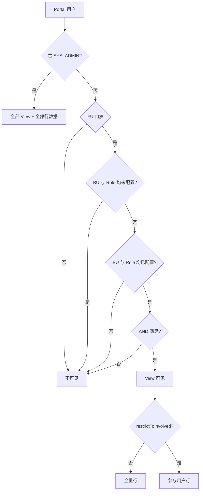

# View 访问管控 — 业务规则与实现契约

**System Administrator** = 平台角色码 `SYS_ADMIN`（种子数据名「System Administrator」）。

## 核心规则（必须遵守）

### 1. View 可见性（Portal 菜单 / listPublishedViews）

| 条件 | 非 SYS_ADMIN 用户 | SYS_ADMIN |
|------|-------------------|-----------|
| View **未配置任何 BU 且未配置任何 Role** | **不可见** | **可见** |
| View **只配置了 BU 或只配置了 Role**（不完整） | **不可见** | **可见** |
| View **同时配置了 BU 与 Role** | 须 **AND** 匹配（见下） | **可见** |
| 已通过 FU 级门禁 | 仍受 View 规则约束 | **绕过 View 规则** |

**成对配置（DW Save 校验 + Portal 运行时）：**

- BU 与 Role **必须同时出现**：要么 **两者均空**（仅 SYS_ADMIN 可见），要么 **两者均有至少一项**。
- ❌ 禁止仅配 BU、仅配 Role、或 Save 时只填一侧。
- ✅ DW Role 下拉须按 **已选 BU** 调用 `GET /business-units/{id}/roles`（准入角色），**禁止**用全局 `/roles`（常为空）。

**AND 语义（两维均已配置时）：**

- 用户须属于已选 BU 列表中的 **至少一个**。
- 用户须拥有已选 Role 列表中的 **至少一个**（`sys_user_business_unit_roles` / Portal profile）。
- **两维须同时满足**。

**与旧文案的区别（禁止再写错）：**

- ❌ 「未选 BU/Role 表示该维度不限制」—— 两维都空 = 仅 SYS_ADMIN；只配一维 = 非 admin **不可见**。
- ❌ 「只配置 BU 时 Role 不限制」—— 已废弃。
- ✅ 「BU 与 Role 均未配置时，仅 System Administrator 可见；若配置访问控制，须 **成对** 选择 BU 与 Role。」

### 2. System Administrator 特权（任何情况下）

`SYS_ADMIN` **始终**：

1. 看见 FU 下 **全部已发布 View**（不过滤 View 菜单）。
2. 看见 View 内 **全部行数据**——即使 View 开启 `restrictToInvolvedUsers`，也 **不** 做发起人/办理人/MI 参与者过滤。
3. 在 Portal 能访问 **所有已启用 Function Unit** 的数据视图——FU 级 `sys_function_unit_access` 对 SYS_ADMIN **bypass**。

非 SYS_ADMIN 仍须先通过 FU 级门禁，再受 View 可见性与数据范围约束。

### 3. 数据范围（非 SYS_ADMIN）

| `restrictToInvolvedUsers` | 行数据 |
|---------------------------|--------|
| `false` | FU 内该 View 对应表的全量行（现状） |
| `true` | 仅 **发起人 + 历史/当前 assignee + MI 子表参与者** 相关行 |

实现：`PortalMainTableViewServiceImpl.loadAndProjectRows` + `MainTableViewInvolvementChecker`；**SYS_ADMIN 在入口短路，跳过 involvement 过滤**。

---

## 决策流程



---

## 代码 touchpoints

| 层 | 文件 | 职责 |
|----|------|------|
| Portal 可见性 | `backend/user-portal/.../MainTableViewAccessResolver.java` | 空规则 / 不完整规则 → 非 admin `false`；完整规则 AND |
| Portal 列表/数据 | `backend/user-portal/.../PortalMainTableViewServiceImpl.java` | 过滤 View；SYS_ADMIN 跳过 involvement |
| Portal FU 门禁 | `backend/user-portal/.../FunctionUnitAccessComponent.java` | SYS_ADMIN bypass；**code → catalog UUID** 后再查 access |
| DW 设计态 | `MainTableViewServiceImpl.validateAccessRules` + `useMainTableViewDesigner.ts` + i18n ×3 | 成对校验；Role 按 BU 准入列表加载 |
| Schema | `deploy/init-scripts/00-schema/51-dw-main-table-view-access.sql` | `dw_main_table_view_access` + `restrict_to_involved_users` |
| 测试种子 | `deploy/init-scripts/91-view-access-test/01-view-access-test-users.sql` | `view_*` 账号；`view_admin` 须含 UBR 才能 FULL 门户 |
| 单测 | `MainTableViewAccessResolverTest`、`FunctionUnitAccessComponentTest`、`MainTableViewServiceImplTest`（access 成对） | 空/不完整/AND；FU code resolve；DW Save 校验 |

---

## 实现要点（Resolver 伪代码）

```java
if (isSystemAdministrator(userId)) return true;

Set<String> buIds = ... BUSINESS_UNIT ...
Set<String> roleIds = ... ROLE ...

if (buIds.isEmpty() && roleIds.isEmpty()) return false;
if (buIds.isEmpty() || roleIds.isEmpty()) return false; // 不完整配置

return !disjoint(buIds, userBuIds) && !disjoint(roleIds, userRoleIds);
```

DW Save 校验：

```java
if (!buIds.isEmpty() || !roleIds.isEmpty()) {
  if (buIds.isEmpty() || roleIds.isEmpty())
    throw BIZ_VIEW_ACCESS_BU_ROLE_PAIR;
}
```

DW Role 选项（前端）：

```typescript
// 已选 BU 变更 → Promise.all(buIds.map(id => getBusinessUnitEligibleRoles(id)))
// Role 下拉 disabled 直到至少选一个 BU
```

Portal FU 门禁与 SYS_ADMIN：

```java
// isSystemAdministrator → GET /users/{id}/roles?profileContext=ADMIN
// canAccessFunctionUnit → resolveFunctionUnitId(code) 后再 GET .../access
```

测试账号：`view_admin` 须 **UBR + vg-sys-admins**；仅虚拟组 → 权限自助模式。

---

## DW UI 文案（三语同步）

`mainTableView.accessControlHint` + `accessControlBuRoleRequired` + `rolesSelectBuFirst`

---

## 测试矩阵（改规则必跑）

| # | 用户 | View BU/Role | 期望 |
|---|------|--------------|------|
| T1 | SYS_ADMIN | 空 | 可见 View + 全量数据 |
| T2 | 普通用户 | 空 | **不可见** View |
| T3 | 用户 A（BU-1 + Role-X） | BU-1 + Role-X | 可见 |
| T4 | 用户 A | BU-1 + Role-Y | 不可见 |
| T5 | 任意用户 | **仅 BU 或仅 Role** | **不可见**（非 admin） |
| T6 | 普通用户 | BU+Role + restrictToInvolved=true | 仅参与行 |
| T7 | SYS_ADMIN | restrictToInvolved=true | **全量行** |
| DW | 设计者 | 只选 BU 点 Save | **拒绝**，提示成对必填 |
| DW | 设计者 | 选 BU 后 | Role 下拉显示该 BU **准入角色** |

单测：`MainTableViewAccessResolverTest`、`FunctionUnitAccessComponentTest`、`MainTableViewServiceImplTest`；手测：`docs/view-access-control-test-guide.md`；E2E：`node scripts/verify-view-access-control.mjs`。

---

## 与现有实现的差距（改动前自检）

落地后应全部为 ✅：

- [x] `canUserSeeView`：不完整配置（仅 BU / 仅 Role）→ 非 admin `false`
- [x] `MainTableViewServiceImpl.validateAccessRules`：Save 成对校验
- [x] DW：`getBusinessUnitEligibleRoles` 加载 Role；Save 前端校验
- [x] i18n：`accessControlHint` / `accessControlBuRoleRequired` / `rolesSelectBuFirst`
- [x] `loadAndProjectRows`：SYS_ADMIN 跳过 `restrictToInvolvedUsers`
- [x] `canAccessFunctionUnit`：SYS_ADMIN bypass；**FU code 先 resolve 再查 access**
- [x] `isSystemAdministrator`：`profileContext=ADMIN`（非 PORTAL）
- [x] 测试种子：`view_admin` 含 UBR + 虚拟组
- [x] Export/Import/Clone：`MainTableViewPortability` JDBC 导出 access + 成对校验（见 `function-unit-portability` skill）

---

## FU 导入 / 导出 / Clone

View access 与 `restrictToInvolvedUsers` MUST 随 FU 包走完整 round-trip。详见 **`.cursor/skills/function-unit-portability/SKILL.md`**。

---

## 参考

- 手测指南：`docs/view-access-control-test-guide.md`
- 测试种子：`deploy/init-scripts/91-view-access-test/01-view-access-test-users.sql`
- FU 可移植性：`.cursor/skills/function-unit-portability/SKILL.md`
- Portal MI 数据语义（View 场景勿混用）：`.cursor/rules/portal-mi-subtable-my-request.mdc`
