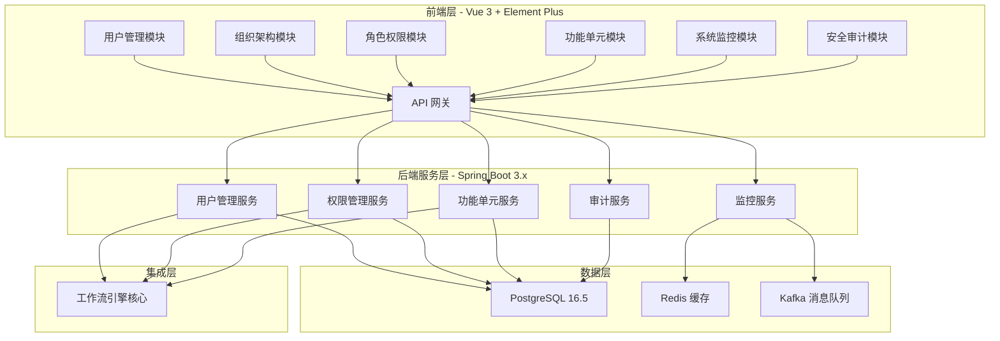
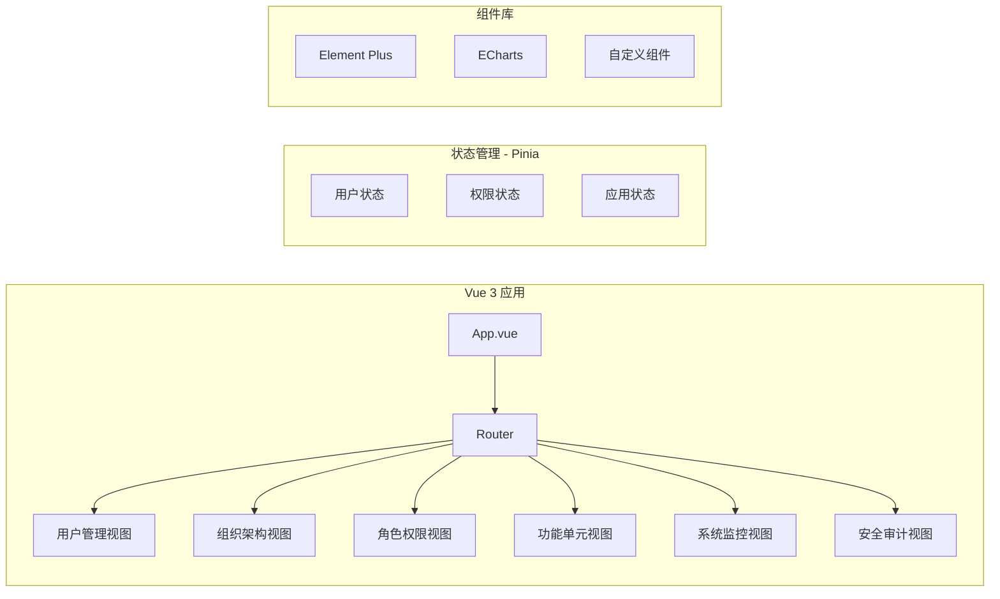
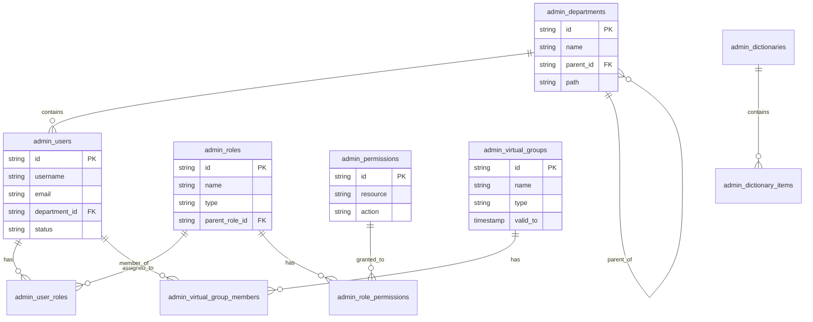

# 管理员中心设计文档

## 概述

管理员中心是低代码工作流平台的核心管理模块，采用 Vue 3 + TypeScript + Element Plus 作为前端技术栈，Spring Boot 3.x + Java 17 作为后端技术栈。本设计文档详细描述了系统的架构设计、核心组件、数据模型和集成方案。

### 设计目标

- **高性能**: 页面加载 < 2秒，操作响应 < 1秒，支持 100 TPS
- **高可用**: 99.5% 可用性，支持故障自动恢复
- **安全性**: RBAC 权限控制、数据加密、审计日志
- **易用性**: 汇丰主题 UI、清爽 OA 布局、多语言支持
- **可扩展**: 模块化设计、API 标准化、插件机制

## 架构设计

### 整体架构




### 前端架构



### 后端微服务架构

| 服务名称 | 端口 | 职责 | 依赖 |
|---------|------|------|------|
| admin-user-service | 8090 | 用户管理、组织架构 | PostgreSQL, Redis |
| admin-permission-service | 8091 | 角色权限、数据权限 | PostgreSQL, Redis |
| admin-function-service | 8092 | 功能单元导入部署 | PostgreSQL, MinIO |
| admin-monitor-service | 8093 | 系统监控、告警管理 | PostgreSQL, Redis, Kafka |
| admin-audit-service | 8094 | 审计日志、安全管理 | PostgreSQL, Kafka |

## 组件和接口

### 核心组件设计

#### 1. 用户管理组件 (UserManagerComponent)

```java
@Component
public class UserManagerComponent {
    
    @Autowired
    private UserRepository userRepository;
    
    @Autowired
    private PasswordEncoder passwordEncoder;
    
    @Autowired
    private AuditService auditService;
    
    /**
     * 创建用户 - 立即激活，无需邮件验证
     */
    public UserCreateResult createUser(UserCreateRequest request) {
        // 验证用户名唯一性
        validateUsernameUnique(request.getUsername());
        // 验证邮箱格式
        validateEmailFormat(request.getEmail());
        // 创建用户并设置初始密码
        User user = buildUser(request);
        user.setStatus(UserStatus.ACTIVE);
        user.setPassword(passwordEncoder.encode(request.getInitialPassword()));
        user.setMustChangePassword(true);
        // 保存用户
        userRepository.save(user);
        // 记录审计日志
        auditService.recordUserCreation(user);
        return UserCreateResult.success(user);
    }
    
    /**
     * 批量导入用户
     */
    public BatchImportResult batchImportUsers(MultipartFile file) {
        // 解析文件（Excel/CSV）
        List<UserImportRow> rows = parseImportFile(file);
        // 验证数据
        List<ValidationError> errors = validateImportData(rows);
        // 执行导入
        BatchImportResult result = executeImport(rows, errors);
        // 记录审计日志
        auditService.recordBatchImport(result);
        return result;
    }
    
    /**
     * 用户状态管理
     */
    public void updateUserStatus(String userId, UserStatus newStatus, String reason) {
        User user = userRepository.findById(userId)
            .orElseThrow(() -> new UserNotFoundException(userId));
        UserStatus oldStatus = user.getStatus();
        user.setStatus(newStatus);
        userRepository.save(user);
        auditService.recordStatusChange(user, oldStatus, newStatus, reason);
    }
}
```

#### 2. 组织架构管理组件 (OrganizationManagerComponent)

```java
@Component
public class OrganizationManagerComponent {
    
    @Autowired
    private DepartmentRepository departmentRepository;
    
    /**
     * 创建部门
     */
    public DepartmentResult createDepartment(DepartmentCreateRequest request) {
        // 验证部门名称唯一性
        validateDepartmentNameUnique(request.getName(), request.getParentId());
        // 验证编码格式
        validateDepartmentCode(request.getCode());
        // 创建部门
        Department dept = buildDepartment(request);
        departmentRepository.save(dept);
        return DepartmentResult.success(dept);
    }
    
    /**
     * 调整部门层级 - 检测循环依赖
     */
    public void moveDepartment(String deptId, String newParentId) {
        // 检测循环依赖
        if (wouldCreateCycle(deptId, newParentId)) {
            throw new CircularDependencyException(deptId, newParentId);
        }
        Department dept = departmentRepository.findById(deptId)
            .orElseThrow(() -> new DepartmentNotFoundException(deptId));
        dept.setParentId(newParentId);
        departmentRepository.save(dept);
    }
    
    /**
     * 删除部门 - 检查子部门和成员
     */
    public void deleteDepartment(String deptId) {
        // 检查是否有子部门
        if (hasChildDepartments(deptId)) {
            throw new DepartmentHasChildrenException(deptId);
        }
        // 检查是否有成员
        if (hasDepartmentMembers(deptId)) {
            throw new DepartmentHasMembersException(deptId);
        }
        departmentRepository.deleteById(deptId);
    }
    
    /**
     * 获取组织架构树
     */
    public DepartmentTree getOrganizationTree() {
        List<Department> allDepts = departmentRepository.findAll();
        return buildDepartmentTree(allDepts);
    }
}
```


#### 3. 角色权限管理组件 (RolePermissionManagerComponent)

```java
@Component
public class RolePermissionManagerComponent {
    
    @Autowired
    private RoleRepository roleRepository;
    
    @Autowired
    private PermissionRepository permissionRepository;
    
    /**
     * 配置角色权限
     */
    public void configureRolePermissions(String roleId, List<PermissionConfig> permissions) {
        Role role = roleRepository.findById(roleId)
            .orElseThrow(() -> new RoleNotFoundException(roleId));
        // 清除现有权限
        role.getPermissions().clear();
        // 添加新权限
        for (PermissionConfig config : permissions) {
            RolePermission rp = buildRolePermission(role, config);
            role.getPermissions().add(rp);
        }
        roleRepository.save(role);
    }
    
    /**
     * 检查权限 - 支持条件权限
     */
    public PermissionCheckResult checkPermission(String userId, String resource, String action) {
        // 获取用户所有角色
        List<Role> roles = getUserRoles(userId);
        // 检查每个角色的权限
        for (Role role : roles) {
            PermissionCheckResult result = checkRolePermission(role, resource, action);
            if (result.isAllowed()) {
                return result;
            }
        }
        return PermissionCheckResult.denied();
    }
    
    /**
     * 权限继承处理
     */
    public Set<Permission> getEffectivePermissions(String roleId) {
        Role role = roleRepository.findById(roleId)
            .orElseThrow(() -> new RoleNotFoundException(roleId));
        Set<Permission> permissions = new HashSet<>(role.getPermissions());
        // 递归获取继承的权限
        if (role.getParentRoleId() != null) {
            permissions.addAll(getEffectivePermissions(role.getParentRoleId()));
        }
        return permissions;
    }
}
```

#### 4. 虚拟组管理组件 (VirtualGroupManagerComponent)

```java
@Component
public class VirtualGroupManagerComponent {
    
    @Autowired
    private VirtualGroupRepository virtualGroupRepository;
    
    @Autowired
    private TaskService taskService;
    
    /**
     * 创建虚拟组
     */
    public VirtualGroupResult createVirtualGroup(VirtualGroupCreateRequest request) {
        VirtualGroup group = VirtualGroup.builder()
            .name(request.getName())
            .type(request.getType())
            .validFrom(request.getValidFrom())
            .validTo(request.getValidTo())
            .build();
        virtualGroupRepository.save(group);
        return VirtualGroupResult.success(group);
    }
    
    /**
     * 获取虚拟组任务 - 所有成员可见
     */
    public List<Task> getGroupTasks(String groupId, String userId) {
        // 验证用户是否是组成员
        if (!isGroupMember(groupId, userId)) {
            throw new NotGroupMemberException(userId, groupId);
        }
        // 获取分配给该组的所有任务
        return taskService.getTasksByGroup(groupId);
    }
    
    /**
     * 认领组任务 - 变为直接任务
     */
    public void claimGroupTask(String taskId, String userId, String groupId) {
        // 验证用户是组成员
        if (!isGroupMember(groupId, userId)) {
            throw new NotGroupMemberException(userId, groupId);
        }
        // 认领任务
        taskService.claimTask(taskId, userId);
        // 记录认领历史
        recordTaskClaim(taskId, userId, groupId);
    }
    
    /**
     * 委托组任务 - 可委托给组外用户
     */
    public void delegateGroupTask(String taskId, String fromUserId, String toUserId, String reason) {
        taskService.delegateTask(taskId, fromUserId, toUserId, reason);
        recordTaskDelegation(taskId, fromUserId, toUserId, reason);
    }
}
```

#### 5. 功能单元管理组件 (FunctionUnitManagerComponent)

```java
@Component
public class FunctionUnitManagerComponent {
    
    @Autowired
    private FunctionUnitRepository functionUnitRepository;
    
    @Autowired
    private DeploymentService deploymentService;
    
    /**
     * 导入功能包 - 完整验证
     */
    public ImportResult importFunctionPackage(MultipartFile file) {
        // 验证文件格式和完整性
        validateFileFormat(file);
        // 验证数字签名
        validateDigitalSignature(file);
        // 解析功能包内容
        FunctionPackage pkg = parseFunctionPackage(file);
        // 验证BPMN语法
        validateBpmnSyntax(pkg.getProcessDefinitions());
        // 验证数据表结构
        validateDataTableStructure(pkg.getDataTables());
        // 验证表单配置
        validateFormConfig(pkg.getForms());
        // 检测依赖冲突
        List<Conflict> conflicts = detectConflicts(pkg);
        return ImportResult.builder()
            .functionPackage(pkg)
            .conflicts(conflicts)
            .build();
    }
    
    /**
     * 部署功能单元 - 支持多种策略
     */
    public DeploymentResult deploy(String functionUnitId, DeploymentRequest request) {
        FunctionUnit unit = functionUnitRepository.findById(functionUnitId)
            .orElseThrow(() -> new FunctionUnitNotFoundException(functionUnitId));
        
        // 检查环境审批要求
        if (request.getEnvironment() == Environment.PRODUCTION) {
            validateProductionApproval(request);
        }
        
        // 执行部署
        DeploymentResult result = switch (request.getStrategy()) {
            case FULL -> deploymentService.fullDeploy(unit, request);
            case INCREMENTAL -> deploymentService.incrementalDeploy(unit, request);
            case CANARY -> deploymentService.canaryDeploy(unit, request);
            case BLUE_GREEN -> deploymentService.blueGreenDeploy(unit, request);
        };
        
        return result;
    }
    
    /**
     * 回滚部署
     */
    public RollbackResult rollback(String deploymentId) {
        return deploymentService.rollback(deploymentId);
    }
}
```


#### 6. 数据权限管理组件 (DataPermissionManagerComponent)

```java
@Component
public class DataPermissionManagerComponent {
    
    /**
     * 应用数据权限过滤 - 生成动态SQL条件
     */
    public String applyDataPermissionFilter(String userId, String tableName, String baseQuery) {
        // 获取用户数据权限规则
        List<DataPermissionRule> rules = getDataPermissionRules(userId, tableName);
        
        // 生成过滤条件
        StringBuilder filterCondition = new StringBuilder();
        for (DataPermissionRule rule : rules) {
            switch (rule.getType()) {
                case ROLE_BASED -> filterCondition.append(buildRoleFilter(rule));
                case DEPARTMENT_BASED -> filterCondition.append(buildDepartmentFilter(rule, userId));
                case USER_BASED -> filterCondition.append(buildUserFilter(rule, userId));
                case CONDITION_BASED -> filterCondition.append(buildConditionFilter(rule));
            }
        }
        
        return baseQuery + " WHERE " + filterCondition.toString();
    }
    
    /**
     * 行级权限检查
     */
    public boolean checkRowPermission(String userId, String tableName, String rowId) {
        List<DataPermissionRule> rules = getDataPermissionRules(userId, tableName);
        return evaluateRowPermission(rules, userId, rowId);
    }
    
    /**
     * 列级权限和数据脱敏
     */
    public Map<String, Object> applyColumnPermission(String userId, String tableName, Map<String, Object> row) {
        List<ColumnPermissionRule> columnRules = getColumnPermissionRules(userId, tableName);
        Map<String, Object> result = new HashMap<>();
        
        for (Map.Entry<String, Object> entry : row.entrySet()) {
            String column = entry.getKey();
            Object value = entry.getValue();
            
            ColumnPermissionRule rule = findColumnRule(columnRules, column);
            if (rule == null || rule.isVisible()) {
                if (rule != null && rule.isMasked()) {
                    result.put(column, maskData(value, rule.getMaskType()));
                } else {
                    result.put(column, value);
                }
            }
            // 不可见的列不添加到结果中
        }
        
        return result;
    }
}
```

#### 7. 系统监控组件 (SystemMonitorComponent)

```java
@Component
public class SystemMonitorComponent {
    
    @Autowired
    private MetricsCollector metricsCollector;
    
    @Autowired
    private AlertService alertService;
    
    /**
     * 获取实时系统指标
     */
    public SystemMetrics getRealtimeMetrics() {
        return SystemMetrics.builder()
            .cpuUsage(metricsCollector.getCpuUsage())
            .memoryUsage(metricsCollector.getMemoryUsage())
            .diskIO(metricsCollector.getDiskIO())
            .networkTraffic(metricsCollector.getNetworkTraffic())
            .dbConnections(metricsCollector.getDbConnections())
            .onlineUsers(metricsCollector.getOnlineUsers())
            .activeProcesses(metricsCollector.getActiveProcesses())
            .taskThroughput(metricsCollector.getTaskThroughput())
            .responseTime(metricsCollector.getAverageResponseTime())
            .cacheHitRate(metricsCollector.getCacheHitRate())
            .build();
    }
    
    /**
     * 配置告警规则
     */
    public void configureAlertRule(AlertRuleConfig config) {
        AlertRule rule = AlertRule.builder()
            .name(config.getName())
            .metric(config.getMetric())
            .condition(config.getCondition())
            .threshold(config.getThreshold())
            .severity(config.getSeverity())
            .notificationChannels(config.getNotificationChannels())
            .build();
        alertService.saveRule(rule);
    }
    
    /**
     * 触发告警
     */
    public void triggerAlert(String ruleId, double currentValue) {
        AlertRule rule = alertService.getRule(ruleId);
        Alert alert = Alert.builder()
            .ruleId(ruleId)
            .ruleName(rule.getName())
            .currentValue(currentValue)
            .threshold(rule.getThreshold())
            .severity(rule.getSeverity())
            .triggeredAt(Instant.now())
            .status(AlertStatus.OPEN)
            .build();
        alertService.saveAlert(alert);
        // 发送通知
        notifyAlertChannels(alert, rule.getNotificationChannels());
    }
}
```

### API 接口设计

#### 1. 用户管理 API

```java
@RestController
@RequestMapping("/api/v1/admin/users")
public class UserController {
    
    @PostMapping
    public ResponseEntity<UserCreateResult> createUser(@RequestBody @Valid UserCreateRequest request);
    
    @PostMapping("/batch-import")
    public ResponseEntity<BatchImportResult> batchImport(@RequestParam("file") MultipartFile file);
    
    @GetMapping
    public ResponseEntity<PageResult<UserInfo>> listUsers(UserQueryRequest request);
    
    @GetMapping("/{userId}")
    public ResponseEntity<UserDetail> getUser(@PathVariable String userId);
    
    @PutMapping("/{userId}")
    public ResponseEntity<Void> updateUser(@PathVariable String userId, @RequestBody UserUpdateRequest request);
    
    @PutMapping("/{userId}/status")
    public ResponseEntity<Void> updateUserStatus(@PathVariable String userId, @RequestBody StatusUpdateRequest request);
    
    @PostMapping("/{userId}/reset-password")
    public ResponseEntity<PasswordResetResult> resetPassword(@PathVariable String userId);
    
    @DeleteMapping("/{userId}")
    public ResponseEntity<Void> deleteUser(@PathVariable String userId);
}
```

#### 2. 组织架构 API

```java
@RestController
@RequestMapping("/api/v1/admin/departments")
public class DepartmentController {
    
    @GetMapping("/tree")
    public ResponseEntity<DepartmentTree> getOrganizationTree();
    
    @PostMapping
    public ResponseEntity<DepartmentResult> createDepartment(@RequestBody @Valid DepartmentCreateRequest request);
    
    @PutMapping("/{deptId}")
    public ResponseEntity<Void> updateDepartment(@PathVariable String deptId, @RequestBody DepartmentUpdateRequest request);
    
    @PutMapping("/{deptId}/move")
    public ResponseEntity<Void> moveDepartment(@PathVariable String deptId, @RequestBody DepartmentMoveRequest request);
    
    @DeleteMapping("/{deptId}")
    public ResponseEntity<Void> deleteDepartment(@PathVariable String deptId);
    
    @GetMapping("/{deptId}/members")
    public ResponseEntity<PageResult<UserInfo>> getDepartmentMembers(@PathVariable String deptId);
}
```

#### 3. 角色权限 API

```java
@RestController
@RequestMapping("/api/v1/admin/roles")
public class RoleController {
    
    @GetMapping
    public ResponseEntity<PageResult<RoleInfo>> listRoles(RoleQueryRequest request);
    
    @PostMapping
    public ResponseEntity<RoleResult> createRole(@RequestBody @Valid RoleCreateRequest request);
    
    @GetMapping("/{roleId}/permissions")
    public ResponseEntity<List<PermissionInfo>> getRolePermissions(@PathVariable String roleId);
    
    @PutMapping("/{roleId}/permissions")
    public ResponseEntity<Void> configurePermissions(@PathVariable String roleId, @RequestBody List<PermissionConfig> permissions);
    
    @GetMapping("/{roleId}/members")
    public ResponseEntity<PageResult<UserInfo>> getRoleMembers(@PathVariable String roleId);
    
    @PostMapping("/{roleId}/members")
    public ResponseEntity<Void> addRoleMembers(@PathVariable String roleId, @RequestBody List<String> userIds);
}
```


## 数据模型

### 核心数据表设计

#### 1. 用户表 (admin_users)

```sql
CREATE TABLE admin_users (
    id VARCHAR(64) PRIMARY KEY,
    username VARCHAR(100) NOT NULL UNIQUE,
    password_hash VARCHAR(255) NOT NULL,
    email VARCHAR(255) NOT NULL,
    phone VARCHAR(50),
    full_name VARCHAR(100) NOT NULL,
    employee_id VARCHAR(50),
    department_id VARCHAR(64),
    position VARCHAR(100),
    status VARCHAR(20) NOT NULL DEFAULT 'ACTIVE',
    must_change_password BOOLEAN DEFAULT FALSE,
    password_expired_at TIMESTAMP,
    last_login_at TIMESTAMP,
    last_login_ip VARCHAR(50),
    failed_login_count INTEGER DEFAULT 0,
    locked_until TIMESTAMP,
    created_at TIMESTAMP DEFAULT CURRENT_TIMESTAMP,
    created_by VARCHAR(64),
    updated_at TIMESTAMP DEFAULT CURRENT_TIMESTAMP,
    updated_by VARCHAR(64),
    
    INDEX idx_user_username (username),
    INDEX idx_user_email (email),
    INDEX idx_user_department (department_id),
    INDEX idx_user_status (status)
);
```

#### 2. 部门表 (admin_departments)

```sql
CREATE TABLE admin_departments (
    id VARCHAR(64) PRIMARY KEY,
    name VARCHAR(100) NOT NULL,
    code VARCHAR(50) NOT NULL,
    parent_id VARCHAR(64),
    level INTEGER NOT NULL DEFAULT 1,
    path VARCHAR(500),
    manager_id VARCHAR(64),
    phone VARCHAR(50),
    description TEXT,
    cost_center VARCHAR(50),
    location VARCHAR(200),
    sort_order INTEGER DEFAULT 0,
    status VARCHAR(20) NOT NULL DEFAULT 'ACTIVE',
    created_at TIMESTAMP DEFAULT CURRENT_TIMESTAMP,
    created_by VARCHAR(64),
    updated_at TIMESTAMP DEFAULT CURRENT_TIMESTAMP,
    updated_by VARCHAR(64),
    
    UNIQUE(code),
    INDEX idx_dept_parent (parent_id),
    INDEX idx_dept_path (path),
    INDEX idx_dept_status (status)
);
```

#### 3. 角色表 (admin_roles)

```sql
CREATE TABLE admin_roles (
    id VARCHAR(64) PRIMARY KEY,
    name VARCHAR(100) NOT NULL,
    code VARCHAR(50) NOT NULL UNIQUE,
    type VARCHAR(20) NOT NULL,
    parent_role_id VARCHAR(64),
    description TEXT,
    status VARCHAR(20) NOT NULL DEFAULT 'ACTIVE',
    created_at TIMESTAMP DEFAULT CURRENT_TIMESTAMP,
    created_by VARCHAR(64),
    updated_at TIMESTAMP DEFAULT CURRENT_TIMESTAMP,
    updated_by VARCHAR(64),
    
    INDEX idx_role_type (type),
    INDEX idx_role_parent (parent_role_id),
    INDEX idx_role_status (status)
);
```

#### 4. 权限表 (admin_permissions)

```sql
CREATE TABLE admin_permissions (
    id VARCHAR(64) PRIMARY KEY,
    name VARCHAR(100) NOT NULL,
    code VARCHAR(100) NOT NULL UNIQUE,
    type VARCHAR(20) NOT NULL,
    resource VARCHAR(200) NOT NULL,
    action VARCHAR(50) NOT NULL,
    parent_id VARCHAR(64),
    description TEXT,
    sort_order INTEGER DEFAULT 0,
    
    INDEX idx_perm_type (type),
    INDEX idx_perm_resource (resource),
    INDEX idx_perm_parent (parent_id)
);
```

#### 5. 角色权限关联表 (admin_role_permissions)

```sql
CREATE TABLE admin_role_permissions (
    id VARCHAR(64) PRIMARY KEY,
    role_id VARCHAR(64) NOT NULL,
    permission_id VARCHAR(64) NOT NULL,
    condition_type VARCHAR(50),
    condition_value JSONB,
    granted_at TIMESTAMP DEFAULT CURRENT_TIMESTAMP,
    granted_by VARCHAR(64),
    
    UNIQUE(role_id, permission_id),
    FOREIGN KEY (role_id) REFERENCES admin_roles(id),
    FOREIGN KEY (permission_id) REFERENCES admin_permissions(id)
);
```

#### 6. 虚拟组表 (admin_virtual_groups)

```sql
CREATE TABLE admin_virtual_groups (
    id VARCHAR(64) PRIMARY KEY,
    name VARCHAR(100) NOT NULL,
    type VARCHAR(20) NOT NULL,
    description TEXT,
    valid_from TIMESTAMP,
    valid_to TIMESTAMP,
    status VARCHAR(20) NOT NULL DEFAULT 'ACTIVE',
    created_at TIMESTAMP DEFAULT CURRENT_TIMESTAMP,
    created_by VARCHAR(64),
    updated_at TIMESTAMP DEFAULT CURRENT_TIMESTAMP,
    updated_by VARCHAR(64),
    
    INDEX idx_vgroup_type (type),
    INDEX idx_vgroup_status (status),
    INDEX idx_vgroup_valid (valid_from, valid_to)
);
```

#### 7. 虚拟组成员表 (admin_virtual_group_members)

```sql
CREATE TABLE admin_virtual_group_members (
    id VARCHAR(64) PRIMARY KEY,
    group_id VARCHAR(64) NOT NULL,
    user_id VARCHAR(64) NOT NULL,
    role VARCHAR(20) NOT NULL DEFAULT 'MEMBER',
    joined_at TIMESTAMP DEFAULT CURRENT_TIMESTAMP,
    
    UNIQUE(group_id, user_id),
    FOREIGN KEY (group_id) REFERENCES admin_virtual_groups(id),
    FOREIGN KEY (user_id) REFERENCES admin_users(id)
);
```

#### 8. 功能单元表 (admin_function_units)

```sql
CREATE TABLE admin_function_units (
    id VARCHAR(64) PRIMARY KEY,
    name VARCHAR(100) NOT NULL,
    code VARCHAR(50) NOT NULL,
    version VARCHAR(20) NOT NULL,
    description TEXT,
    package_path VARCHAR(500),
    status VARCHAR(20) NOT NULL DEFAULT 'DRAFT',
    imported_at TIMESTAMP,
    imported_by VARCHAR(64),
    deployed_at TIMESTAMP,
    deployed_by VARCHAR(64),
    environment VARCHAR(20),
    
    UNIQUE(code, version),
    INDEX idx_func_code (code),
    INDEX idx_func_status (status),
    INDEX idx_func_env (environment)
);
```

#### 9. 数据字典表 (admin_dictionaries)

```sql
CREATE TABLE admin_dictionaries (
    id VARCHAR(64) PRIMARY KEY,
    name VARCHAR(100) NOT NULL,
    code VARCHAR(50) NOT NULL UNIQUE,
    type VARCHAR(20) NOT NULL,
    parent_id VARCHAR(64),
    description TEXT,
    status VARCHAR(20) NOT NULL DEFAULT 'ACTIVE',
    created_at TIMESTAMP DEFAULT CURRENT_TIMESTAMP,
    created_by VARCHAR(64),
    updated_at TIMESTAMP DEFAULT CURRENT_TIMESTAMP,
    updated_by VARCHAR(64),
    
    INDEX idx_dict_type (type),
    INDEX idx_dict_parent (parent_id),
    INDEX idx_dict_status (status)
);
```

#### 10. 数据字典项表 (admin_dictionary_items)

```sql
CREATE TABLE admin_dictionary_items (
    id VARCHAR(64) PRIMARY KEY,
    dictionary_id VARCHAR(64) NOT NULL,
    code VARCHAR(50) NOT NULL,
    name_en VARCHAR(200) NOT NULL,
    name_zh_cn VARCHAR(200),
    name_zh_tw VARCHAR(200),
    parent_item_id VARCHAR(64),
    sort_order INTEGER DEFAULT 0,
    status VARCHAR(20) NOT NULL DEFAULT 'ACTIVE',
    valid_from TIMESTAMP,
    valid_to TIMESTAMP,
    extra_data JSONB,
    
    UNIQUE(dictionary_id, code),
    FOREIGN KEY (dictionary_id) REFERENCES admin_dictionaries(id),
    INDEX idx_dict_item_dict (dictionary_id),
    INDEX idx_dict_item_parent (parent_item_id),
    INDEX idx_dict_item_status (status)
);
```


#### 11. 审计日志表 (admin_audit_logs)

```sql
CREATE TABLE admin_audit_logs (
    id VARCHAR(64) PRIMARY KEY,
    user_id VARCHAR(64),
    username VARCHAR(100),
    action VARCHAR(50) NOT NULL,
    resource_type VARCHAR(50) NOT NULL,
    resource_id VARCHAR(64),
    resource_name VARCHAR(200),
    old_value JSONB,
    new_value JSONB,
    ip_address VARCHAR(50),
    user_agent VARCHAR(500),
    result VARCHAR(20) NOT NULL,
    error_message TEXT,
    created_at TIMESTAMP DEFAULT CURRENT_TIMESTAMP,
    
    INDEX idx_audit_user (user_id),
    INDEX idx_audit_action (action),
    INDEX idx_audit_resource (resource_type, resource_id),
    INDEX idx_audit_time (created_at)
);
```

#### 12. 系统配置表 (admin_system_configs)

```sql
CREATE TABLE admin_system_configs (
    id VARCHAR(64) PRIMARY KEY,
    config_key VARCHAR(100) NOT NULL UNIQUE,
    config_value TEXT NOT NULL,
    config_type VARCHAR(20) NOT NULL,
    description TEXT,
    is_encrypted BOOLEAN DEFAULT FALSE,
    version INTEGER DEFAULT 1,
    updated_at TIMESTAMP DEFAULT CURRENT_TIMESTAMP,
    updated_by VARCHAR(64),
    
    INDEX idx_config_key (config_key),
    INDEX idx_config_type (config_type)
);
```

### 数据关系设计



## 错误处理

### 异常分类

```java
// 业务异常
public class AdminBusinessException extends RuntimeException {
    private final String errorCode;
    private final String errorMessage;
}

// 用户相关异常
public class UserNotFoundException extends AdminBusinessException { }
public class UsernameAlreadyExistsException extends AdminBusinessException { }
public class UserLockedException extends AdminBusinessException { }

// 部门相关异常
public class DepartmentNotFoundException extends AdminBusinessException { }
public class CircularDependencyException extends AdminBusinessException { }
public class DepartmentHasChildrenException extends AdminBusinessException { }
public class DepartmentHasMembersException extends AdminBusinessException { }

// 权限相关异常
public class RoleNotFoundException extends AdminBusinessException { }
public class PermissionDeniedException extends AdminBusinessException { }
public class PermissionConflictException extends AdminBusinessException { }

// 功能单元相关异常
public class FunctionUnitNotFoundException extends AdminBusinessException { }
public class InvalidPackageException extends AdminBusinessException { }
public class DeploymentFailedException extends AdminBusinessException { }
```

### 全局异常处理

```java
@ControllerAdvice
public class AdminGlobalExceptionHandler {
    
    @ExceptionHandler(AdminBusinessException.class)
    public ResponseEntity<ErrorResponse> handleBusinessException(AdminBusinessException ex) {
        ErrorResponse error = ErrorResponse.builder()
            .code(ex.getErrorCode())
            .message(ex.getErrorMessage())
            .timestamp(Instant.now())
            .build();
        return ResponseEntity.badRequest().body(error);
    }
    
    @ExceptionHandler(PermissionDeniedException.class)
    public ResponseEntity<ErrorResponse> handlePermissionDenied(PermissionDeniedException ex) {
        ErrorResponse error = ErrorResponse.builder()
            .code("PERMISSION_DENIED")
            .message(ex.getMessage())
            .timestamp(Instant.now())
            .build();
        return ResponseEntity.status(HttpStatus.FORBIDDEN).body(error);
    }
}
```

## 正确性属性

*属性是一个特征或行为，应该在系统的所有有效执行中保持为真——本质上是关于系统应该做什么的正式陈述。属性作为人类可读规范和机器可验证正确性保证之间的桥梁。*

基于需求分析，以下是管理员中心的关键正确性属性：

### 属性 1: 用户数据验证完整性
*对于任何* 用户创建或更新请求，系统应该正确验证用户名唯一性、邮箱格式和必填字段完整性，有效数据通过验证，无效数据被拒绝并返回具体错误信息
**验证需求: 需求 1.1, 1.2**

### 属性 2: 用户状态转换正确性
*对于任何* 用户状态变更操作（启用、禁用、锁定、解锁），系统应该正确执行状态转换并记录变更历史
**验证需求: 需求 1.5, 1.8**

### 属性 3: 组织架构树形结构完整性
*对于任何* 部门层级调整操作，系统应该检测并阻止循环依赖，保持树形结构的完整性
**验证需求: 需求 2.1, 2.4**

### 属性 4: 部门删除保护有效性
*对于任何* 存在子部门或成员的部门，删除操作应该被阻止并返回相应错误信息
**验证需求: 需求 2.8**

### 属性 5: 权限继承正确性
*对于任何* 具有继承关系的角色，子角色应该正确继承父角色的所有权限
**验证需求: 需求 3.5**

### 属性 6: 权限检查一致性
*对于任何* 权限检查请求，系统应该根据用户的角色和权限配置返回一致的检查结果
**验证需求: 需求 3.2, 3.3, 3.4**

### 属性 7: 虚拟组任务可见性正确性
*对于任何* 分配给虚拟组的任务，该组的所有成员都应该能够在待办任务中看到该任务
**验证需求: 需求 4.5**

### 属性 8: 虚拟组任务认领状态一致性
*对于任何* 虚拟组任务认领操作，认领后任务应该变为该成员的直接任务，其他成员不再能看到该任务
**验证需求: 需求 4.6**

### 属性 9: 功能包验证完整性
*对于任何* 导入的功能包，系统应该正确验证文件格式、BPMN语法、数据表结构和表单配置
**验证需求: 需求 5.1, 5.2**

### 属性 10: 部署回滚正确性
*对于任何* 部署回滚操作，系统应该正确恢复到之前的版本状态
**验证需求: 需求 5.8**

### 属性 11: 数据字典多语言一致性
*对于任何* 数据字典项，系统应该正确存储和返回多语言内容（英文、中文简体、中文繁体）
**验证需求: 需求 6.4**

### 属性 12: 数据权限过滤正确性
*对于任何* 数据查询请求，系统应该根据用户的数据权限规则正确过滤结果，只返回用户有权访问的数据
**验证需求: 需求 7.1, 7.2, 7.3, 7.7**

### 属性 13: 行级权限控制有效性
*对于任何* 行级权限配置，系统应该正确控制用户对特定数据行的访问
**验证需求: 需求 7.4**

### 属性 14: 列级权限和数据脱敏正确性
*对于任何* 列级权限配置，系统应该正确隐藏或脱敏敏感字段
**验证需求: 需求 7.5**

### 属性 15: 告警触发准确性
*对于任何* 配置的告警规则，当指标超过阈值时系统应该正确触发告警并发送通知
**验证需求: 需求 8.5, 8.6**

### 属性 16: 审计日志完整性
*对于任何* 系统操作（用户登录、权限变更、数据修改等），系统应该记录完整的审计日志
**验证需求: 需求 11.1**

### 属性 17: 配置回滚正确性
*对于任何* 配置回滚操作，系统应该正确恢复到历史版本的配置值
**验证需求: 需求 12.5**

### 属性 18: API RESTful 规范性
*对于任何* API 接口，应该遵循 RESTful 设计原则，使用正确的 HTTP 方法、状态码和资源命名规范
**验证需求: 需求 14.1**


## 测试策略

### 双重测试方法

系统采用单元测试和基于属性的测试相结合的方法，确保全面的测试覆盖：

**单元测试**：
- 验证具体示例和边缘情况
- 测试组件间的集成点
- 验证错误条件和异常处理
- 测试特定的业务规则实现

**基于属性的测试**：
- 验证跨所有输入的通用属性
- 通过随机化实现全面的输入覆盖
- 每个属性测试运行最少 100 次迭代
- 每个测试必须引用其设计文档属性

### 基于属性的测试配置

**测试框架**: 使用 JUnit 5 + jqwik 进行基于属性的测试
**最小迭代次数**: 每个属性测试 100 次迭代
**标签格式**: **功能: admin-center, 属性 {编号}: {属性文本}**

**示例属性测试**:
```java
@Property
@Label("功能: admin-center, 属性 1: 用户数据验证完整性")
void userDataValidationIntegrity(@ForAll @StringLength(min = 1, max = 100) String username,
                                  @ForAll @Email String email) {
    UserCreateRequest request = UserCreateRequest.builder()
        .username(username)
        .email(email)
        .fullName("Test User")
        .build();
    
    // 验证用户名唯一性检查
    if (userRepository.existsByUsername(username)) {
        assertThrows(UsernameAlreadyExistsException.class, 
            () -> userManager.createUser(request));
    } else {
        UserCreateResult result = userManager.createUser(request);
        assertThat(result.isSuccess()).isTrue();
        assertThat(result.getUser().getStatus()).isEqualTo(UserStatus.ACTIVE);
    }
}

@Property
@Label("功能: admin-center, 属性 3: 组织架构树形结构完整性")
void organizationTreeIntegrity(@ForAll String deptId, @ForAll String newParentId) {
    Assume.that(!deptId.equals(newParentId));
    
    // 如果移动会创建循环依赖，应该抛出异常
    if (wouldCreateCycle(deptId, newParentId)) {
        assertThrows(CircularDependencyException.class,
            () -> organizationManager.moveDepartment(deptId, newParentId));
    }
}

@Property
@Label("功能: admin-center, 属性 12: 数据权限过滤正确性")
void dataPermissionFilterCorrectness(@ForAll String userId, @ForAll String tableName) {
    // 获取用户数据权限规则
    List<DataPermissionRule> rules = dataPermissionManager.getDataPermissionRules(userId, tableName);
    
    // 执行查询
    List<Map<String, Object>> results = dataPermissionManager.queryWithPermission(userId, tableName);
    
    // 验证所有返回的数据都符合权限规则
    for (Map<String, Object> row : results) {
        assertThat(dataPermissionManager.checkRowPermission(userId, tableName, row.get("id").toString()))
            .isTrue();
    }
}
```

### 单元测试重点

**核心业务逻辑测试**：
- 用户创建和验证逻辑
- 组织架构树形结构操作
- 角色权限配置和检查
- 虚拟组任务分配和认领
- 功能单元导入和部署
- 数据权限过滤逻辑

**集成测试**：
- 用户管理服务与数据库的集成
- 权限管理服务与工作流引擎的集成
- API 接口的端到端测试
- 前后端集成测试

**性能测试**：
- 用户批量导入性能（目标：100 条/秒）
- 权限检查性能（目标：响应时间 < 50ms）
- 组织架构树查询性能（目标：响应时间 < 200ms）
- 系统监控数据收集性能

## 前端组件设计

### 汇丰主题配置

```typescript
// hsbc-theme.ts
export const hsbcTheme = {
  colors: {
    primary: '#DB0011',
    primaryLight: '#E6334A',
    primaryDark: '#B8000E',
    success: '#00A651',
    warning: '#FF6600',
    danger: '#CC0000',
    info: '#0066CC',
    textPrimary: '#333333',
    textRegular: '#666666',
    textSecondary: '#999999',
    border: '#E5E5E5',
    background: '#FFFFFF',
    backgroundLight: '#F8F9FA'
  },
  fonts: {
    family: '"PingFang SC", "Microsoft YaHei", "Helvetica Neue", Arial, sans-serif',
    sizeLarge: '24px',
    sizeMedium: '16px',
    sizeSmall: '14px',
    sizeMini: '12px'
  }
}
```

### 布局组件

```vue
<!-- AdminLayout.vue -->
<template>
  <div class="admin-layout">
    <header class="admin-header">
      <div class="logo">
        
        <span>管理员中心</span>
      </div>
      <div class="header-actions">
        <el-dropdown>
          <span class="user-info">{{ currentUser.name }}</span>
          <template #dropdown>
            <el-dropdown-menu>
              <el-dropdown-item @click="logout">退出登录</el-dropdown-item>
            </el-dropdown-menu>
          </template>
        </el-dropdown>
      </div>
    </header>
    
    <div class="admin-container">
      <aside class="admin-sidebar">
        <el-menu :default-active="activeMenu" router>
          <el-menu-item index="/admin/users">
            <el-icon><User /></el-icon>
            <span>用户管理</span>
          </el-menu-item>
          <el-menu-item index="/admin/departments">
            <el-icon><OfficeBuilding /></el-icon>
            <span>组织架构</span>
          </el-menu-item>
          <el-menu-item index="/admin/roles">
            <el-icon><Key /></el-icon>
            <span>角色权限</span>
          </el-menu-item>
          <el-menu-item index="/admin/virtual-groups">
            <el-icon><UserFilled /></el-icon>
            <span>虚拟组管理</span>
          </el-menu-item>
          <el-menu-item index="/admin/function-units">
            <el-icon><Box /></el-icon>
            <span>功能单元</span>
          </el-menu-item>
          <el-menu-item index="/admin/dictionaries">
            <el-icon><Document /></el-icon>
            <span>数据字典</span>
          </el-menu-item>
          <el-menu-item index="/admin/monitor">
            <el-icon><Monitor /></el-icon>
            <span>系统监控</span>
          </el-menu-item>
          <el-menu-item index="/admin/audit">
            <el-icon><List /></el-icon>
            <span>审计日志</span>
          </el-menu-item>
          <el-menu-item index="/admin/settings">
            <el-icon><Setting /></el-icon>
            <span>系统配置</span>
          </el-menu-item>
        </el-menu>
      </aside>
      
      <main class="admin-main">
        <router-view />
      </main>
    </div>
  </div>
</template>
```

### 用户管理页面

```vue
<!-- UserManagement.vue -->
<template>
  <div class="user-management">
    <div class="page-header">
      <h2>用户管理</h2>
      <div class="actions">
        <el-button type="primary" @click="showCreateDialog">新建用户</el-button>
        <el-button @click="showImportDialog">批量导入</el-button>
        <el-button @click="exportUsers">导出用户</el-button>
      </div>
    </div>
    
    <div class="search-bar">
      <el-input v-model="searchQuery" placeholder="搜索用户名、姓名、邮箱" />
      <el-select v-model="filterDepartment" placeholder="部门">
        <el-option v-for="dept in departments" :key="dept.id" :label="dept.name" :value="dept.id" />
      </el-select>
      <el-select v-model="filterStatus" placeholder="状态">
        <el-option label="启用" value="ACTIVE" />
        <el-option label="禁用" value="DISABLED" />
        <el-option label="锁定" value="LOCKED" />
      </el-select>
      <el-button type="primary" @click="search">搜索</el-button>
    </div>
    
    <el-table :data="users" v-loading="loading">
      <el-table-column type="selection" width="55" />
      <el-table-column prop="username" label="用户名" />
      <el-table-column prop="fullName" label="姓名" />
      <el-table-column prop="email" label="邮箱" />
      <el-table-column prop="departmentName" label="部门" />
      <el-table-column prop="status" label="状态">
        <template #default="{ row }">
          <el-tag :type="getStatusType(row.status)">{{ getStatusLabel(row.status) }}</el-tag>
        </template>
      </el-table-column>
      <el-table-column prop="lastLoginAt" label="最后登录" />
      <el-table-column label="操作" width="200">
        <template #default="{ row }">
          <el-button link @click="editUser(row)">编辑</el-button>
          <el-button link @click="resetPassword(row)">重置密码</el-button>
          <el-dropdown>
            <el-button link>更多</el-button>
            <template #dropdown>
              <el-dropdown-menu>
                <el-dropdown-item @click="toggleStatus(row)">
                  {{ row.status === 'ACTIVE' ? '禁用' : '启用' }}
                </el-dropdown-item>
                <el-dropdown-item @click="deleteUser(row)">删除</el-dropdown-item>
              </el-dropdown-menu>
            </template>
          </el-dropdown>
        </template>
      </el-table-column>
    </el-table>
    
    <el-pagination
      v-model:current-page="currentPage"
      v-model:page-size="pageSize"
      :total="total"
      @current-change="loadUsers"
    />
  </div>
</template>
```
