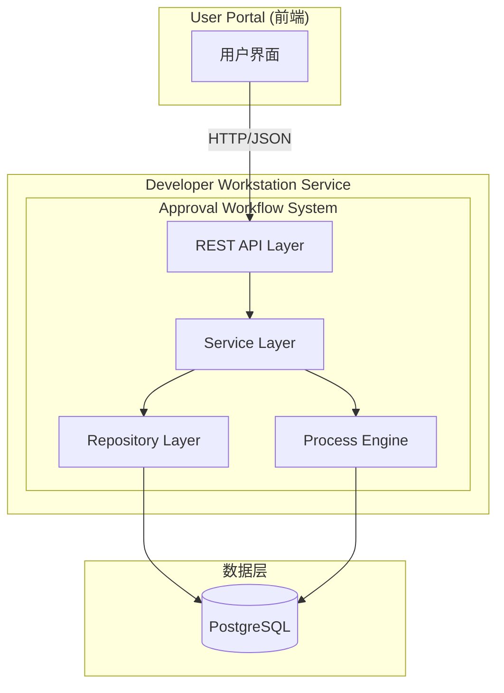
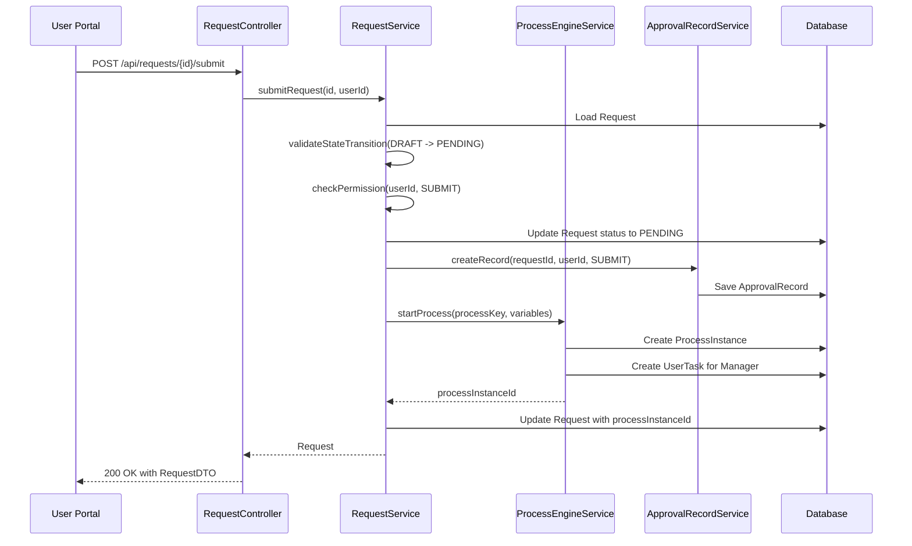
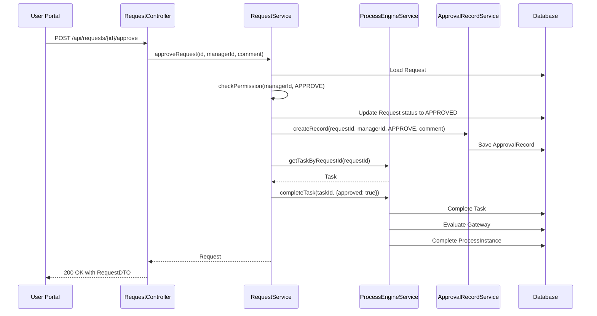
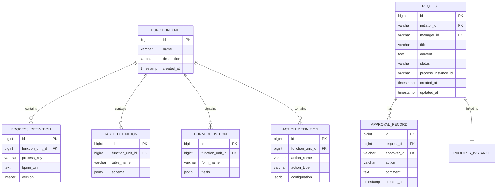

# 设计文档：审批流程系统

## 概述

审批流程系统是一个基于 Spring Boot 的微服务，集成在 Developer Workstation 平台中。系统采用 BPMN 2.0 标准定义审批流程，使用 Camunda 或 Flowable 作为流程引擎，通过 JPA 与 PostgreSQL 数据库交互。系统提供 RESTful API 供 User Portal 调用，实现申请的创建、提交、审批和查看功能。

### 架构原则

- **关注点分离**：后端专注于业务逻辑和数据管理，前端（User Portal）负责用户交互
- **RESTful 设计**：API 遵循 REST 原则，使用标准 HTTP 方法和状态码
- **事务一致性**：使用 Spring 事务管理确保数据操作的原子性
- **权限控制**：集成 Spring Security 实现基于角色的访问控制
- **流程驱动**：使用 BPMN 流程引擎管理业务流程生命周期

## 架构

### 系统架构图



### 技术栈

- **框架**：Spring Boot 2.x/3.x
- **流程引擎**：Camunda BPM 或 Flowable
- **持久化**：Spring Data JPA + Hibernate
- **数据库**：PostgreSQL
- **安全**：Spring Security
- **API 文档**：OpenAPI/Swagger
- **构建工具**：Maven 或 Gradle

### 分层架构

1. **API Layer (Controller)**
   - 处理 HTTP 请求和响应
   - 参数验证和错误处理
   - 权限检查

2. **Service Layer**
   - 业务逻辑实现
   - 事务管理
   - 流程引擎交互

3. **Repository Layer**
   - 数据访问抽象
   - JPA 实体管理

4. **Process Engine**
   - BPMN 流程执行
   - 流程实例管理
   - 任务分配和完成

## 组件和接口

### 核心组件

#### 1. RequestController

REST API 控制器，处理申请相关的 HTTP 请求。

**接口定义**：

```java
@RestController
@RequestMapping("/api/requests")
public class RequestController {
    
    @PostMapping
    ResponseEntity<RequestDTO> createRequest(@RequestBody CreateRequestDTO dto);
    
    @PostMapping("/{id}/submit")
    ResponseEntity<RequestDTO> submitRequest(@PathVariable Long id);
    
    @PostMapping("/{id}/approve")
    ResponseEntity<RequestDTO> approveRequest(
        @PathVariable Long id, 
        @RequestBody ApprovalDTO dto
    );
    
    @PostMapping("/{id}/reject")
    ResponseEntity<RequestDTO> rejectRequest(
        @PathVariable Long id, 
        @RequestBody ApprovalDTO dto
    );
    
    @GetMapping("/{id}")
    ResponseEntity<RequestDetailDTO> getRequest(@PathVariable Long id);
}
```

#### 2. RequestService

业务逻辑服务，协调流程引擎和数据访问。

**接口定义**：

```java
@Service
public class RequestService {
    
    Request createRequest(CreateRequestDTO dto, String initiatorId);
    
    Request submitRequest(Long requestId, String initiatorId);
    
    Request approveRequest(Long requestId, String managerId, String comment);
    
    Request rejectRequest(Long requestId, String managerId, String comment);
    
    RequestDetail getRequestDetail(Long requestId, String userId);
    
    void validateStateTransition(Request request, RequestStatus targetStatus);
    
    void checkPermission(Request request, String userId, ActionType action);
}
```

#### 3. ProcessEngineService

流程引擎封装服务，管理 BPMN 流程实例。

**接口定义**：

```java
@Service
public class ProcessEngineService {
    
    String startProcess(String processKey, Map<String, Object> variables);
    
    void completeTask(String taskId, Map<String, Object> variables);
    
    Task getTaskByRequestId(Long requestId);
    
    ProcessInstance getProcessInstance(String processInstanceId);
    
    boolean isProcessActive(String processInstanceId);
}
```

#### 4. ApprovalRecordService

审批记录服务，管理审批历史。

**接口定义**：

```java
@Service
public class ApprovalRecordService {
    
    ApprovalRecord createRecord(
        Long requestId, 
        String userId, 
        ActionType action, 
        String comment
    );
    
    List<ApprovalRecord> getRecordsByRequestId(Long requestId);
}
```

#### 5. FunctionUnitService

功能单元管理服务，负责定义的注册和管理。

**接口定义**：

```java
@Service
public class FunctionUnitService {
    
    FunctionUnit createApprovalWorkflowUnit();
    
    void registerProcessDefinition(ProcessDefinition definition);
    
    void registerTableDefinitions(List<TableDefinition> definitions);
    
    void registerFormDefinitions(List<FormDefinition> definitions);
    
    void registerActionDefinitions(List<ActionDefinition> definitions);
}
```

### 组件交互流程

#### 申请提交流程



#### 审批流程



## 数据模型

### 实体关系图



### JPA 实体定义

#### Request Entity

```java
@Entity
@Table(name = "requests")
public class Request {
    
    @Id
    @GeneratedValue(strategy = GenerationType.IDENTITY)
    private Long id;
    
    @Column(name = "initiator_id", nullable = false)
    private String initiatorId;
    
    @Column(name = "manager_id", nullable = false)
    private String managerId;
    
    @Column(nullable = false, length = 200)
    private String title;
    
    @Column(nullable = false, length = 2000)
    private String content;
    
    @Enumerated(EnumType.STRING)
    @Column(nullable = false)
    private RequestStatus status;
    
    @Column(name = "process_instance_id")
    private String processInstanceId;
    
    @Column(name = "created_at", nullable = false, updatable = false)
    private LocalDateTime createdAt;
    
    @Column(name = "updated_at", nullable = false)
    private LocalDateTime updatedAt;
    
    @OneToMany(mappedBy = "request", cascade = CascadeType.ALL)
    private List<ApprovalRecord> approvalRecords;
    
    @PrePersist
    protected void onCreate() {
        createdAt = LocalDateTime.now();
        updatedAt = LocalDateTime.now();
        if (status == null) {
            status = RequestStatus.DRAFT;
        }
    }
    
    @PreUpdate
    protected void onUpdate() {
        updatedAt = LocalDateTime.now();
    }
}
```

#### ApprovalRecord Entity

```java
@Entity
@Table(name = "approval_records")
public class ApprovalRecord {
    
    @Id
    @GeneratedValue(strategy = GenerationType.IDENTITY)
    private Long id;
    
    @ManyToOne(fetch = FetchType.LAZY)
    @JoinColumn(name = "request_id", nullable = false)
    private Request request;
    
    @Column(name = "approver_id", nullable = false)
    private String approverId;
    
    @Enumerated(EnumType.STRING)
    @Column(nullable = false)
    private ActionType action;
    
    @Column(length = 1000)
    private String comment;
    
    @Column(name = "created_at", nullable = false, updatable = false)
    private LocalDateTime createdAt;
    
    @PrePersist
    protected void onCreate() {
        createdAt = LocalDateTime.now();
    }
}
```

#### FunctionUnit Entity

```java
@Entity
@Table(name = "function_units")
public class FunctionUnit {
    
    @Id
    @GeneratedValue(strategy = GenerationType.IDENTITY)
    private Long id;
    
    @Column(nullable = false, unique = true)
    private String name;
    
    @Column(length = 500)
    private String description;
    
    @OneToMany(mappedBy = "functionUnit", cascade = CascadeType.ALL)
    private List<ProcessDefinition> processDefinitions;
    
    @OneToMany(mappedBy = "functionUnit", cascade = CascadeType.ALL)
    private List<TableDefinition> tableDefinitions;
    
    @OneToMany(mappedBy = "functionUnit", cascade = CascadeType.ALL)
    private List<FormDefinition> formDefinitions;
    
    @OneToMany(mappedBy = "functionUnit", cascade = CascadeType.ALL)
    private List<ActionDefinition> actionDefinitions;
    
    @Column(name = "created_at", nullable = false, updatable = false)
    private LocalDateTime createdAt;
    
    @PrePersist
    protected void onCreate() {
        createdAt = LocalDateTime.now();
    }
}
```

#### ProcessDefinition Entity

```java
@Entity
@Table(name = "process_definitions")
public class ProcessDefinition {
    
    @Id
    @GeneratedValue(strategy = GenerationType.IDENTITY)
    private Long id;
    
    @ManyToOne(fetch = FetchType.LAZY)
    @JoinColumn(name = "function_unit_id", nullable = false)
    private FunctionUnit functionUnit;
    
    @Column(name = "process_key", nullable = false)
    private String processKey;
    
    @Column(name = "bpmn_xml", nullable = false, columnDefinition = "TEXT")
    private String bpmnXml;
    
    @Column(nullable = false)
    private Integer version;
}
```

#### TableDefinition Entity

```java
@Entity
@Table(name = "table_definitions")
public class TableDefinition {
    
    @Id
    @GeneratedValue(strategy = GenerationType.IDENTITY)
    private Long id;
    
    @ManyToOne(fetch = FetchType.LAZY)
    @JoinColumn(name = "function_unit_id", nullable = false)
    private FunctionUnit functionUnit;
    
    @Column(name = "table_name", nullable = false)
    private String tableName;
    
    @Type(JsonBinaryType.class)
    @Column(columnDefinition = "jsonb", nullable = false)
    private Map<String, Object> schema;
}
```

#### FormDefinition Entity

```java
@Entity
@Table(name = "form_definitions")
public class FormDefinition {
    
    @Id
    @GeneratedValue(strategy = GenerationType.IDENTITY)
    private Long id;
    
    @ManyToOne(fetch = FetchType.LAZY)
    @JoinColumn(name = "function_unit_id", nullable = false)
    private FunctionUnit functionUnit;
    
    @Column(name = "form_name", nullable = false)
    private String formName;
    
    @Type(JsonBinaryType.class)
    @Column(columnDefinition = "jsonb", nullable = false)
    private List<FormField> fields;
}
```

#### ActionDefinition Entity

```java
@Entity
@Table(name = "action_definitions")
public class ActionDefinition {
    
    @Id
    @GeneratedValue(strategy = GenerationType.IDENTITY)
    private Long id;
    
    @ManyToOne(fetch = FetchType.LAZY)
    @JoinColumn(name = "function_unit_id", nullable = false)
    private FunctionUnit functionUnit;
    
    @Column(name = "action_name", nullable = false)
    private String actionName;
    
    @Column(name = "action_type", nullable = false)
    private String actionType;
    
    @Type(JsonBinaryType.class)
    @Column(columnDefinition = "jsonb")
    private Map<String, Object> configuration;
}
```

### 枚举类型

```java
public enum RequestStatus {
    DRAFT,
    PENDING,
    APPROVED,
    REJECTED
}

public enum ActionType {
    SUBMIT,
    APPROVE,
    REJECT
}
```

### DTO 定义

#### CreateRequestDTO

```java
public class CreateRequestDTO {
    @NotBlank
    @Size(max = 200)
    private String title;
    
    @NotBlank
    @Size(max = 2000)
    private String content;
    
    @NotBlank
    private String managerId;
}
```

#### ApprovalDTO

```java
public class ApprovalDTO {
    @NotNull
    private DecisionType decision;
    
    @Size(max = 1000)
    private String comment;
}

public enum DecisionType {
    APPROVE,
    REJECT
}
```

#### RequestDTO

```java
public class RequestDTO {
    private Long id;
    private String initiatorId;
    private String managerId;
    private String title;
    private String content;
    private RequestStatus status;
    private LocalDateTime createdAt;
    private LocalDateTime updatedAt;
}
```

#### RequestDetailDTO

```java
public class RequestDetailDTO {
    private Long id;
    private String initiatorId;
    private String managerId;
    private String title;
    private String content;
    private RequestStatus status;
    private LocalDateTime createdAt;
    private LocalDateTime updatedAt;
    private List<ApprovalRecordDTO> approvalRecords;
}

public class ApprovalRecordDTO {
    private Long id;
    private String approverId;
    private ActionType action;
    private String comment;
    private LocalDateTime createdAt;
}
```

### BPMN 流程定义

```xml
<?xml version="1.0" encoding="UTF-8"?>
<definitions xmlns="http://www.omg.org/spec/BPMN/20100524/MODEL"
             xmlns:bpmndi="http://www.omg.org/spec/BPMN/20100524/DI"
             xmlns:omgdc="http://www.omg.org/spec/DD/20100524/DC"
             xmlns:omgdi="http://www.omg.org/spec/DD/20100524/DI"
             xmlns:camunda="http://camunda.org/schema/1.0/bpmn"
             targetNamespace="http://approval.workflow">
  
  <process id="approval-process" name="Approval Process" isExecutable="true">
    
    <startEvent id="start" name="Start"/>
    
    <sequenceFlow id="flow1" sourceRef="start" targetRef="managerApproval"/>
    
    <userTask id="managerApproval" name="Manager Approval"
              camunda:assignee="${managerId}">
      <extensionElements>
        <camunda:formData>
          <camunda:formField id="approved" label="Approved" type="boolean"/>
          <camunda:formField id="comment" label="Comment" type="string"/>
        </camunda:formData>
      </extensionElements>
    </userTask>
    
    <sequenceFlow id="flow2" sourceRef="managerApproval" targetRef="gateway"/>
    
    <exclusiveGateway id="gateway" name="Approved?"/>
    
    <sequenceFlow id="flowApproved" sourceRef="gateway" targetRef="endApproved">
      <conditionExpression>${approved == true}</conditionExpression>
    </sequenceFlow>
    
    <sequenceFlow id="flowRejected" sourceRef="gateway" targetRef="endRejected">
      <conditionExpression>${approved == false}</conditionExpression>
    </sequenceFlow>
    
    <endEvent id="endApproved" name="Approved"/>
    
    <endEvent id="endRejected" name="Rejected"/>
    
  </process>
  
</definitions>
```

## 正确性属性

属性是系统在所有有效执行中应该保持为真的特征或行为——本质上是关于系统应该做什么的形式化陈述。属性作为人类可读规范和机器可验证正确性保证之间的桥梁。

### 属性 1：BPMN 定义往返一致性

*对于任何*有效的 BPMN 流程定义，存储到数据库然后检索应该产生等价的 XML 内容。

**验证需求：1.1**

### 属性 2：BPMN 定义结构验证

*对于任何*BPMN 定义，如果它缺少必需的元素（开始事件、结束事件或用户任务），系统应该拒绝该定义并返回验证错误。

**验证需求：1.2**

### 属性 3：BPMN 流程变量完整性

*对于任何*部署的 BPMN 流程定义，它应该包含所有必需的流程变量：request_id、initiator_id、manager_id 和 approval_status。

**验证需求：1.3**

### 属性 4：流程网关条件评估

*对于任何*流程实例，当到达排他网关时，应该根据 approval_status 变量的值正确路由到批准或拒绝分支。

**验证需求：1.4**

### 属性 5：Request 创建默认值

*对于任何*新创建的 Request，其状态应该自动设置为 DRAFT，created_at 和 updated_at 时间戳应该被记录。

**验证需求：2.2**

### 属性 6：Request 数据持久化往返

*对于任何*Request 对象，保存到数据库然后检索应该产生具有相同字段值的等价对象。

**验证需求：2.5**

### 属性 7：状态变更更新时间戳

*对于任何*Request，当其状态发生变更时，updated_at 时间戳应该被更新为当前时间。

**验证需求：2.4**

### 属性 8：审批操作创建记录

*对于任何*审批操作（SUBMIT、APPROVE、REJECT），系统应该创建相应的 ApprovalRecord，包含 approver_id、action 类型和时间戳。

**验证需求：3.2, 6.2, 7.3, 7.4**

### 属性 9：表单定义 JSON 序列化往返

*对于任何*FormDefinition 对象，序列化为 JSON 然后反序列化应该产生等价的对象。

**验证需求：4.5**

### 属性 10：输入验证错误响应

*对于任何*包含无效数据的请求（缺少必填字段、超长字段、无效枚举值），系统应该返回验证错误，明确指出哪些字段失败以及原因。

**验证需求：4.4, 13.1, 13.2, 13.5**

### 属性 11：枚举值验证

*对于任何*需要枚举值的字段（ActionType、DecisionType、RequestStatus），系统应该接受有效值并拒绝无效值。

**验证需求：3.3, 5.2, 5.3, 5.5**

### 属性 12：有效状态转换路径

*对于任何*Request，系统应该只允许以下状态转换路径：
- DRAFT → PENDING → APPROVED
- DRAFT → PENDING → REJECTED

任何其他转换应该被拒绝。

**验证需求：10.1, 10.2, 10.5**

### 属性 13：终态不可变性

*对于任何*处于 APPROVED 或 REJECTED 状态的 Request，任何进一步的状态变更尝试应该被拒绝并返回错误。

**验证需求：10.3, 10.4**

### 属性 14：提交操作状态转换

*对于任何*状态为 DRAFT 的 Request，提交操作应该将状态转换为 PENDING，创建 ApprovalRecord，并启动流程实例。

**验证需求：6.1, 6.2, 6.3**

### 属性 15：非 DRAFT 状态提交拒绝

*对于任何*状态不是 DRAFT 的 Request，提交操作应该被拒绝并返回错误。

**验证需求：6.5**

### 属性 16：任务分配正确性

*对于任何*提交的 Request，创建的用户任务应该分配给 Request 中指定的 Manager。

**验证需求：6.4**

### 属性 17：审批操作状态转换

*对于任何*状态为 PENDING 的 Request：
- 批准操作应该将状态转换为 APPROVED
- 拒绝操作应该将状态转换为 REJECTED

**验证需求：7.1, 7.2**

### 属性 18：审批操作推进流程

*对于任何*审批操作（批准或拒绝），流程引擎应该完成用户任务并继续流程执行直到结束事件。

**验证需求：7.5**

### 属性 19：审批权限验证

*对于任何*Request，只有分配的 Manager 可以执行审批操作；其他用户的审批尝试应该被拒绝并返回授权错误。

**验证需求：7.6**

### 属性 20：查看操作响应完整性

*对于任何*查看操作，返回的响应应该包含所有 Request 字段（id、title、content、status、initiator_id、created_at、updated_at）和所有关联的 ApprovalRecord 条目。

**验证需求：8.2, 8.3**

### 属性 21：审批记录排序

*对于任何*Request 的审批历史查询，ApprovalRecord 条目应该按 created_at 降序排列。

**验证需求：8.3**

### 属性 22：查看权限验证

*对于任何*Request：
- Initiator 应该能够查看自己创建的 Request
- 分配的 Manager 应该能够查看分配给自己的 Request
- 其他用户的查看尝试应该被拒绝

**验证需求：8.4, 8.5**

### 属性 23：未授权操作拒绝

*对于任何*用户尝试执行未授权的操作：
- Initiator 尝试审批应该被拒绝
- 非创建者尝试提交应该被拒绝
- 未授权用户尝试查看应该被拒绝

所有拒绝应该返回 HTTP 403 授权错误。

**验证需求：9.1, 9.2, 9.3**

### 属性 24：操作前身份验证

*对于任何*操作请求，系统应该在执行操作前验证用户身份；未认证的请求应该被拒绝。

**验证需求：9.4**

### 属性 25：授权失败日志记录

*对于任何*授权失败，系统应该记录包含 user_id、action 和 timestamp 的日志条目。

**验证需求：9.5**

### 属性 26：流程实例唯一性

*对于任何*提交的 Request，应该创建唯一的 process_instance_id，并且该 ID 应该与 Request 关联存储。

**验证需求：12.1, 12.2**

### 属性 27：流程完成状态同步

*对于任何*完成的流程实例，Request 的状态应该更新为最终状态（APPROVED 或 REJECTED）。

**验证需求：12.3**

### 属性 28：流程实例查询

*对于任何*Request，应该能够通过 Request ID 查询其关联的流程实例。

**验证需求：12.4**

### 属性 29：流程错误状态保持

*对于任何*流程执行中遇到的错误，系统应该记录错误并保持 Request 在当前状态不变。

**验证需求：12.5**

### 属性 30：外键引用完整性

*对于任何*包含无效外键引用的数据（无效的 initiator_id、manager_id），系统应该拒绝并返回引用完整性错误。

**验证需求：2.3, 13.3**

### 属性 31：输入清理防注入

*对于任何*文本输入，系统应该清理输入以防止 SQL 注入和 XSS 攻击。

**验证需求：13.4**

### 属性 32：HTTP 成功响应格式

*对于任何*成功的操作，系统应该返回 HTTP 200 状态码和 JSON 格式的响应体。

**验证需求：14.6**

### 属性 33：HTTP 错误响应格式

*对于任何*失败的操作：
- 验证错误应该返回 HTTP 400 和错误详情
- 授权错误应该返回 HTTP 403 和错误消息
- 资源未找到应该返回 HTTP 404

所有错误响应应该使用 JSON 格式。

**验证需求：14.7, 14.8, 14.9**

### 属性 34：事务原子性

*对于任何*涉及多个数据库操作的业务操作（提交、审批），所有操作应该在单个事务中执行；如果任何操作失败，所有变更应该回滚。

**验证需求：15.1, 15.2, 15.3**

## 错误处理

### 错误类型和处理策略

#### 1. 验证错误（Validation Errors）

**场景**：缺少必填字段、字段长度超限、无效的枚举值、格式不正确的数据

**处理策略**：
```java
@ExceptionHandler(MethodArgumentNotValidException.class)
public ResponseEntity<ErrorResponse> handleValidationException(
    MethodArgumentNotValidException ex) {
    Map<String, String> errors = new HashMap<>();
    ex.getBindingResult().getFieldErrors().forEach(error -> 
        errors.put(error.getField(), error.getDefaultMessage()));
    ErrorResponse response = new ErrorResponse(
        "VALIDATION_ERROR", "Input validation failed", errors);
    return ResponseEntity.status(HttpStatus.BAD_REQUEST).body(response);
}
```

**HTTP 状态码**：400 Bad Request

#### 2. 授权错误（Authorization Errors）

**场景**：用户尝试执行未授权的操作

**处理策略**：
```java
@ExceptionHandler(UnauthorizedException.class)
public ResponseEntity<ErrorResponse> handleUnauthorizedException(
    UnauthorizedException ex) {
    auditLogger.logAuthorizationFailure(
        ex.getUserId(), ex.getAction(), LocalDateTime.now());
    ErrorResponse response = new ErrorResponse(
        "AUTHORIZATION_ERROR", ex.getMessage(), null);
    return ResponseEntity.status(HttpStatus.FORBIDDEN).body(response);
}
```

**HTTP 状态码**：403 Forbidden

#### 3. 资源未找到错误（Not Found Errors）

**场景**：Request ID 不存在、流程实例不存在

**HTTP 状态码**：404 Not Found

#### 4. 状态转换错误（State Transition Errors）

**场景**：无效的状态转换、尝试修改终态 Request

**HTTP 状态码**：400 Bad Request

#### 5. 流程引擎错误（Process Engine Errors）

**场景**：BPMN 定义无效、流程实例启动失败、任务完成失败

**HTTP 状态码**：500 Internal Server Error

#### 6. 数据库错误（Database Errors）

**场景**：外键约束违反、唯一约束违反、数据库连接失败

**HTTP 状态码**：400 Bad Request

### 错误响应格式

```java
public class ErrorResponse {
    private String errorCode;
    private String message;
    private Map<String, String> details;
    private LocalDateTime timestamp;
}
```

## 测试策略

### 双重测试方法

系统采用单元测试和基于属性的测试相结合的方法：

- **单元测试**：验证特定示例、边界情况和错误条件
- **基于属性的测试**：验证所有输入的通用属性

两者是互补的，对于全面覆盖都是必需的。

### 基于属性的测试配置

**测试库选择**：使用 JUnit-Quickcheck 或 jqwik 进行基于属性的测试

**配置要求**：
- 每个属性测试最少运行 100 次迭代
- 每个测试必须引用其设计文档属性
- 标签格式：`@Tag("Feature: approval-workflow-system, Property N: [property text]")`

### 测试层次

#### 1. 单元测试

验证单个类和方法、业务逻辑、边界条件、错误处理

#### 2. 基于属性的测试

验证通用属性、大量随机输入、不变量检查、往返属性

示例：
```java
@Property(tries = 100)
@Tag("Feature: approval-workflow-system, Property 6: Request data persistence round trip")
void testRequestPersistenceRoundTrip(@ForAll("validRequests") Request request) {
    Request saved = requestRepository.save(request);
    entityManager.flush();
    entityManager.clear();
    Request retrieved = requestRepository.findById(saved.getId()).orElseThrow();
    assertThat(retrieved.getTitle()).isEqualTo(request.getTitle());
    assertThat(retrieved.getContent()).isEqualTo(request.getContent());
}
```

#### 3. 集成测试

验证 API 端点、数据库交互、流程引擎集成、事务行为

#### 4. 流程引擎测试

验证 BPMN 流程执行、任务分配、网关路由、流程变量

### 测试覆盖率目标

- **行覆盖率**：最低 80%
- **分支覆盖率**：最低 75%
- **属性测试覆盖率**：所有设计文档中的属性都应该有对应的测试
- **API 端点覆盖率**：100%
