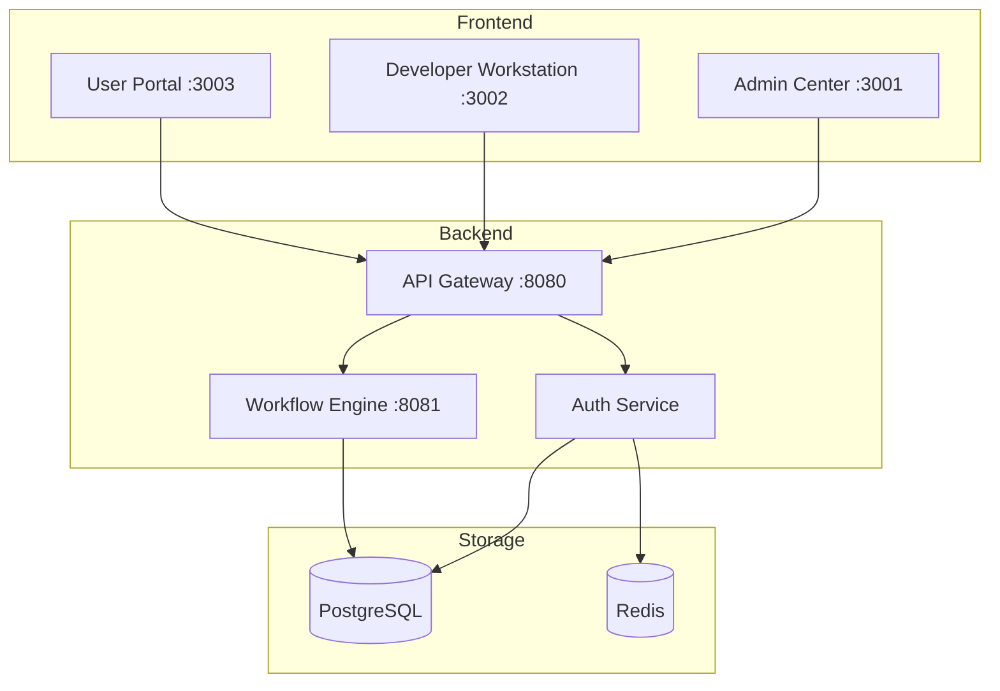
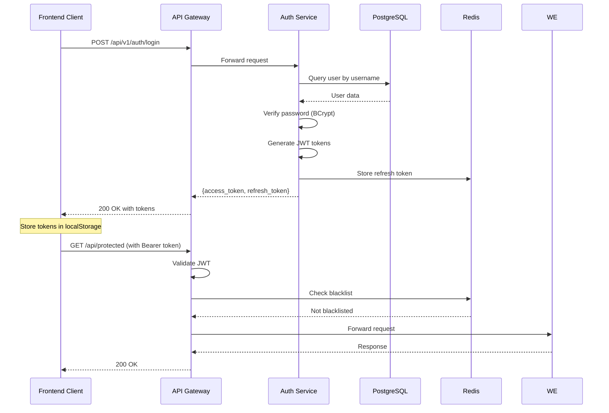

# Design Document: Authentication

## Overview

本设计文档描述了工作流平台统一认证系统的技术实现方案。系统采用 JWT (JSON Web Token) 进行无状态认证，使用 Redis 进行 Token 黑名单管理，通过 API Gateway 统一处理认证路由。

### 技术栈
- **后端**: Spring Boot 3.2 + Spring Security
- **JWT**: jjwt 0.12.3
- **数据库**: PostgreSQL 16.5
- **缓存**: Redis 7.2
- **前端**: Vue 3 + TypeScript + Axios

## Architecture



### 认证流程



## Components and Interfaces

### 1. User Entity

```java
@Entity
@Table(name = "sys_user")
public class User {
    @Id
    @GeneratedValue(strategy = GenerationType.UUID)
    private UUID id;
    
    @Column(unique = true, nullable = false, length = 50)
    private String username;
    
    @Column(nullable = false)
    private String passwordHash;
    
    @Column(length = 100)
    private String email;
    
    @Column(length = 50)
    private String displayName;
    
    @Enumerated(EnumType.STRING)
    @Column(nullable = false)
    private UserStatus status = UserStatus.ACTIVE;
    
    @Column(length = 50)
    private String departmentId;
    
    @Column(length = 10)
    private String language = "zh_CN";
    
    @ManyToMany(fetch = FetchType.EAGER)
    @JoinTable(name = "sys_user_role",
        joinColumns = @JoinColumn(name = "user_id"),
        inverseJoinColumns = @JoinColumn(name = "role_id"))
    private Set<Role> roles = new HashSet<>();
    
    @Column(nullable = false, updatable = false)
    private LocalDateTime createdAt;
    
    @Column(nullable = false)
    private LocalDateTime updatedAt;
}

public enum UserStatus {
    ACTIVE, INACTIVE, LOCKED
}
```

### 2. Authentication Controller

```java
@RestController
@RequestMapping("/api/v1/auth")
public class AuthController {
    
    @PostMapping("/login")
    public ResponseEntity<LoginResponse> login(@RequestBody LoginRequest request);
    
    @PostMapping("/logout")
    public ResponseEntity<Void> logout(@RequestHeader("Authorization") String token);
    
    @PostMapping("/refresh")
    public ResponseEntity<TokenResponse> refresh(@RequestBody RefreshRequest request);
    
    @GetMapping("/me")
    public ResponseEntity<UserInfo> getCurrentUser();
}
```

### 3. Authentication Service Interface

```java
public interface AuthenticationService {
    
    LoginResponse login(String username, String password, String ipAddress);
    
    void logout(String token);
    
    TokenResponse refreshToken(String refreshToken);
    
    UserInfo getCurrentUser(String token);
    
    boolean isTokenBlacklisted(String token);
}
```

### 4. JWT Token Service (已存在，需扩展)

扩展现有的 `JwtTokenService` 接口，添加黑名单管理功能：

```java
public interface JwtTokenService {
    // 现有方法...
    
    // 新增方法
    void blacklistToken(String token);
    boolean isBlacklisted(String token);
}
```

### 5. Frontend API Service

```typescript
// api/auth.ts
export interface LoginRequest {
  username: string;
  password: string;
}

export interface LoginResponse {
  accessToken: string;
  refreshToken: string;
  expiresIn: number;
  user: UserInfo;
}

export interface UserInfo {
  userId: string;
  username: string;
  displayName: string;
  roles: string[];
  permissions: string[];
}

export const authApi = {
  login: (data: LoginRequest) => 
    axios.post<LoginResponse>('/api/v1/auth/login', data),
  
  logout: () => 
    axios.post('/api/v1/auth/logout'),
  
  refresh: (refreshToken: string) => 
    axios.post<{ accessToken: string }>('/api/v1/auth/refresh', { refreshToken }),
  
  getCurrentUser: () => 
    axios.get<UserInfo>('/api/v1/auth/me')
};
```

## Data Models

### Database Schema

```sql
-- 用户表
CREATE TABLE sys_user (
    id UUID PRIMARY KEY DEFAULT uuid_generate_v4(),
    username VARCHAR(50) NOT NULL UNIQUE,
    password_hash VARCHAR(255) NOT NULL,
    email VARCHAR(100),
    display_name VARCHAR(50),
    status VARCHAR(20) NOT NULL DEFAULT 'ACTIVE',
    department_id VARCHAR(50),
    language VARCHAR(10) DEFAULT 'zh_CN',
    created_at TIMESTAMP NOT NULL DEFAULT CURRENT_TIMESTAMP,
    updated_at TIMESTAMP NOT NULL DEFAULT CURRENT_TIMESTAMP
);

-- 角色表
CREATE TABLE sys_role (
    id UUID PRIMARY KEY DEFAULT uuid_generate_v4(),
    code VARCHAR(50) NOT NULL UNIQUE,
    name VARCHAR(100) NOT NULL,
    description TEXT,
    created_at TIMESTAMP NOT NULL DEFAULT CURRENT_TIMESTAMP
);

-- 用户角色关联表
CREATE TABLE sys_user_role (
    user_id UUID NOT NULL REFERENCES sys_user(id),
    role_id UUID NOT NULL REFERENCES sys_role(id),
    PRIMARY KEY (user_id, role_id)
);

-- 登录审计表
CREATE TABLE sys_login_audit (
    id UUID PRIMARY KEY DEFAULT uuid_generate_v4(),
    user_id UUID NOT NULL REFERENCES sys_user(id),
    action VARCHAR(20) NOT NULL, -- LOGIN, LOGOUT, REFRESH
    ip_address VARCHAR(45),
    user_agent TEXT,
    success BOOLEAN NOT NULL,
    failure_reason VARCHAR(255),
    created_at TIMESTAMP NOT NULL DEFAULT CURRENT_TIMESTAMP
);

-- 索引
CREATE INDEX idx_user_username ON sys_user(username);
CREATE INDEX idx_user_status ON sys_user(status);
CREATE INDEX idx_login_audit_user ON sys_login_audit(user_id);
CREATE INDEX idx_login_audit_created ON sys_login_audit(created_at);
```

### Redis Data Structures

```
# Token 黑名单 (使用 SET，带 TTL)
Key: auth:blacklist:{token_hash}
Value: 1
TTL: token 剩余有效期

# Refresh Token 存储
Key: auth:refresh:{user_id}
Value: refresh_token
TTL: 7 days
```

### Request/Response DTOs

```java
// LoginRequest
public record LoginRequest(
    @NotBlank String username,
    @NotBlank String password
) {}

// LoginResponse
public record LoginResponse(
    String accessToken,
    String refreshToken,
    long expiresIn,
    UserInfo user
) {}

// UserInfo
public record UserInfo(
    String userId,
    String username,
    String displayName,
    List<String> roles,
    List<String> permissions,
    String departmentId,
    String language
) {}

// RefreshRequest
public record RefreshRequest(
    @NotBlank String refreshToken
) {}

// TokenResponse
public record TokenResponse(
    String accessToken,
    long expiresIn
) {}
```

## Correctness Properties

*A property is a characteristic or behavior that should hold true across all valid executions of a system-essentially, a formal statement about what the system should do. Properties serve as the bridge between human-readable specifications and machine-verifiable correctness guarantees.*

### Property 1: Password Hashing Security
*For any* password string, when stored in the database, the password_hash field SHALL be a valid BCrypt hash that can verify the original password.
**Validates: Requirements 1.3**

### Property 2: Token Content Completeness
*For any* successfully authenticated user, the generated access_token SHALL contain all required claims (user_id, username, roles, permissions, department_id, language) and the token expiration SHALL be set to the configured duration.
**Validates: Requirements 2.6, 2.7, 2.8**

### Property 3: Authentication Correctness
*For any* login attempt, if credentials are valid and account is ACTIVE, the service SHALL return tokens; otherwise, it SHALL return appropriate error response (401 for invalid credentials, 403 for LOCKED/INACTIVE accounts).
**Validates: Requirements 2.1, 2.2, 2.3, 2.4**

### Property 4: Logout and Blacklist Enforcement
*For any* valid logout operation, the token SHALL be added to the blacklist, and any subsequent request using that token SHALL be rejected with 401 Unauthorized.
**Validates: Requirements 3.1, 3.2, 3.3**

### Property 5: Token Refresh Round-Trip
*For any* valid refresh token, the refresh operation SHALL return a new access_token containing the same user claims (user_id, username, roles, permissions) as the original token.
**Validates: Requirements 4.1, 4.5**

### Property 6: Invalid Token Rejection
*For any* invalid or expired token (access or refresh), the service SHALL return 401 Unauthorized.
**Validates: Requirements 4.2, 4.3, 7.3, 7.4**

## Error Handling

### Error Codes

| Code | HTTP Status | Message | Description |
|------|-------------|---------|-------------|
| AUTH_001 | 401 | Invalid credentials | 用户名或密码错误 |
| AUTH_002 | 403 | Account locked | 账户已锁定 |
| AUTH_003 | 403 | Account inactive | 账户未激活 |
| AUTH_004 | 401 | Token expired | Token 已过期 |
| AUTH_005 | 401 | Token invalid | Token 无效 |
| AUTH_006 | 401 | Token blacklisted | Token 已被注销 |
| AUTH_007 | 401 | Refresh token expired | 刷新令牌已过期 |
| AUTH_008 | 401 | Refresh token invalid | 刷新令牌无效 |

### Error Response Format

```json
{
  "code": "AUTH_001",
  "message": "Invalid credentials",
  "timestamp": "2026-01-06T10:30:00Z",
  "path": "/api/v1/auth/login"
}
```

## Testing Strategy

### Unit Tests
- User entity validation tests
- Password hashing/verification tests
- JWT token generation/parsing tests
- Authentication service logic tests

### Property-Based Tests (using jqwik)
- **Property 1**: Password hashing round-trip
- **Property 2**: Token content verification
- **Property 3**: Authentication correctness
- **Property 4**: Blacklist enforcement
- **Property 5**: Token refresh round-trip
- **Property 6**: Invalid token rejection

### Integration Tests
- Login API endpoint tests
- Logout API endpoint tests
- Refresh API endpoint tests
- Gateway routing tests

### Test Configuration
- Minimum 100 iterations per property test
- Use H2 in-memory database for unit tests
- Use Testcontainers for integration tests with PostgreSQL and Redis

