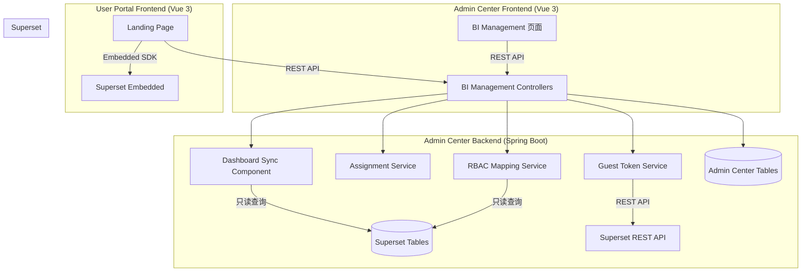
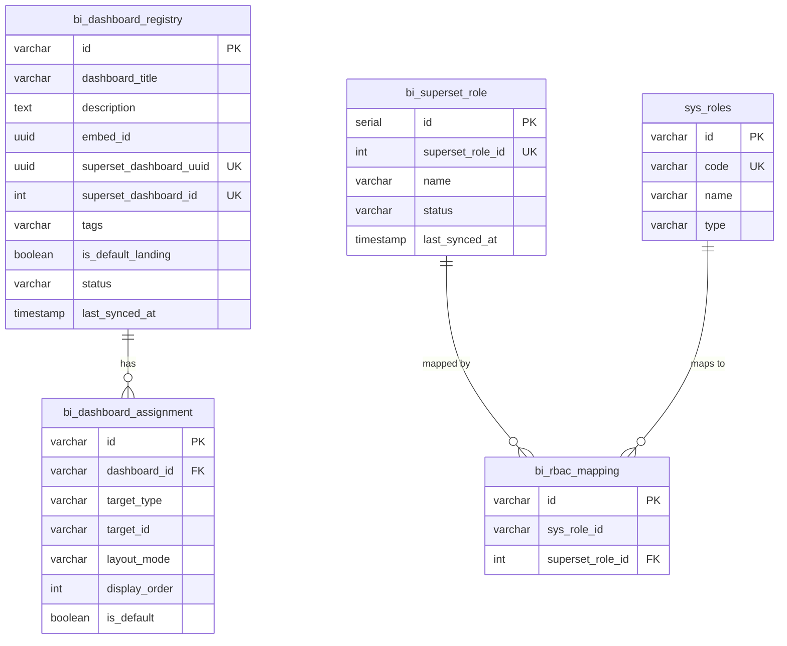
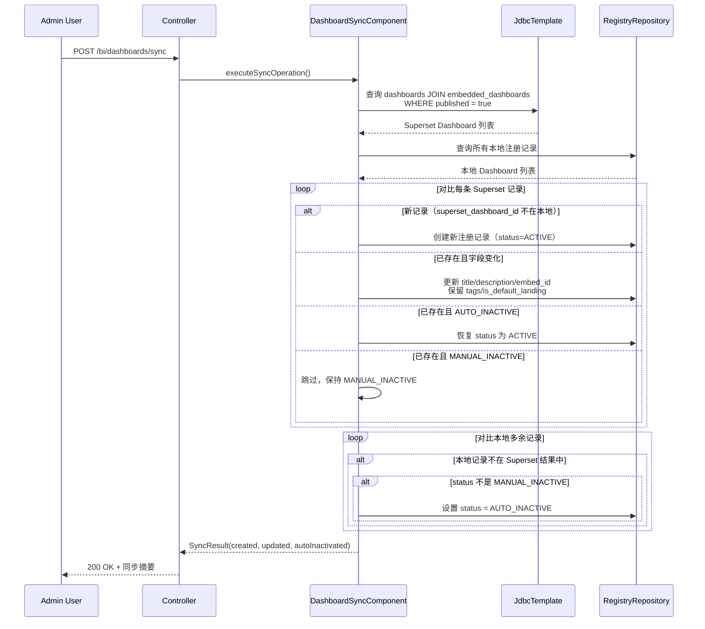
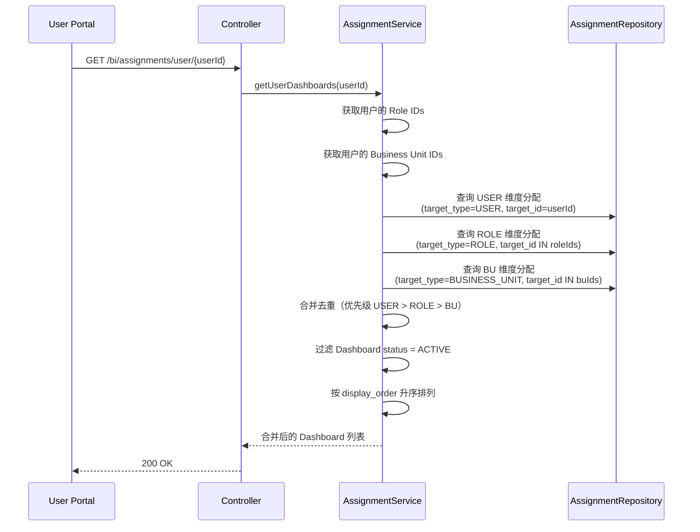

# 技术设计文档：BI Management 模块

## 概述

BI Management 模块为 Admin Center 新增三个子模块：Dashboard Registry（仪表盘注册表）、Dashboard Assignment（仪表盘分配）和 RBAC Mapping（角色映射），实现从 Superset 数据库自动同步 Dashboard 元数据、按 User/Role/Business Unit 维度分配 Dashboard、管理系统角色与 Superset 角色的映射关系，并在 User Portal Landing Page 渲染嵌入式 Dashboard。

核心设计决策：
- **跨数据库直连**：Admin Center 与 Superset 共用同一 PostgreSQL 实例（数据库 `workflow_platform_dev`），通过配置第二个只读 DataSource 直接查询 Superset 的 `dashboards`、`embedded_dashboards`、`ab_role` 表，避免引入额外的 HTTP API 依赖
- **本地注册表模式**：同步数据存储在 Admin Center 自有的表中（`bi_dashboard_registry`、`bi_superset_role` 等），与 Superset 原始表解耦，支持本地扩展字段
- **Guest Token 代理**：后端通过 Superset REST API（`/api/v1/security/guest_token/`）获取 Guest Token，前端不直接与 Superset 通信
- **定时 + 手动同步**：使用 Spring `@Scheduled` 实现定时同步，同时提供手动触发 API

## 架构

### 系统架构图



### 后端模块结构

```
com.admin.bi/
├── config/
│   └── SupersetDataSourceConfig.java      # Superset 只读 DataSource 配置
├── controller/
│   ├── BiDashboardRegistryController.java # Dashboard 注册表 CRUD + 同步
│   ├── BiDashboardAssignmentController.java # Dashboard 分配管理
│   ├── BiRbacMappingController.java       # RBAC 映射管理
│   └── BiGuestTokenController.java        # Guest Token 获取
├── dto/
│   ├── request/
│   │   ├── DashboardRegistryUpdateRequest.java
│   │   ├── DashboardAssignmentCreateRequest.java
│   │   └── RbacMappingUpdateRequest.java
│   └── response/
│       ├── DashboardRegistryResponse.java
│       ├── DashboardAssignmentResponse.java
│       ├── SyncResultResponse.java
│       ├── RbacMappingResponse.java
│       ├── SupersetRoleResponse.java
│       └── UserDashboardResponse.java
├── entity/
│   ├── BiDashboardRegistry.java           # Dashboard 本地注册表
│   ├── BiDashboardAssignment.java         # Dashboard 分配记录
│   ├── BiSupersetRole.java                # Superset 角色本地注册表
│   └── BiRbacMapping.java                 # Sys_Role ↔ Superset_Role 映射
├── enums/
│   ├── DashboardStatus.java               # ACTIVE / AUTO_INACTIVE / MANUAL_INACTIVE
│   ├── AssignmentTargetType.java          # USER / ROLE / BUSINESS_UNIT
│   ├── LayoutMode.java                    # SINGLE / MULTI / WIDGET
│   └── SupersetRoleStatus.java            # ACTIVE / INACTIVE
├── repository/
│   ├── BiDashboardRegistryRepository.java
│   ├── BiDashboardAssignmentRepository.java
│   ├── BiSupersetRoleRepository.java
│   └── BiRbacMappingRepository.java
├── component/
│   ├── DashboardSyncComponent.java        # Dashboard 同步逻辑
│   └── SupersetRoleSyncComponent.java     # Superset 角色同步逻辑
├── service/
│   ├── BiDashboardRegistryService.java
│   ├── BiDashboardAssignmentService.java
│   ├── BiRbacMappingService.java
│   └── BiGuestTokenService.java
└── client/
    └── SupersetApiClient.java             # Superset REST API 客户端
```

### 前端模块结构

```
frontend/admin-center/src/
├── api/
│   └── biManagement.ts                    # BI Management API 服务
├── views/
│   └── bi-management/
│       ├── DashboardRegistry.vue          # Dashboard 注册表页面
│       ├── DashboardAssignment.vue        # Dashboard 分配页面
│       └── RbacMapping.vue                # RBAC 映射页面
└── router/
    └── index.ts                           # 新增 BI Management 路由

frontend/user-portal/src/
├── api/
│   └── biDashboard.ts                     # User Portal Dashboard API
└── views/
    └── landing/
        └── DashboardLanding.vue           # Landing Page Dashboard 渲染
```

## 组件与接口

### 后端 API 接口设计

#### 1. Dashboard Registry API

| 方法 | 路径 | 说明 |
|------|------|------|
| POST | `/bi/dashboards/sync` | 手动触发 Dashboard 同步 |
| GET | `/bi/dashboards` | 分页查询 Dashboard 列表 |
| GET | `/bi/dashboards/{id}` | 获取单个 Dashboard 详情 |
| PUT | `/bi/dashboards/{id}` | 更新本地扩展字段（Tags、Is_Default_Landing） |
| PUT | `/bi/dashboards/{id}/status` | 切换 Dashboard 状态（启用/禁用） |
| DELETE | `/bi/dashboards/{id}` | 删除 Dashboard 记录（有分配关联时拒绝） |

查询参数（GET `/bi/dashboards`）：
- `page`（int，默认 0）
- `size`（int，默认 20）
- `title`（string，模糊搜索）
- `tags`（string，模糊搜索）
- `status`（string，ACTIVE/AUTO_INACTIVE/MANUAL_INACTIVE）

同步结果响应（POST `/bi/dashboards/sync`）：
```json
{
  "created": 3,
  "updated": 1,
  "autoInactivated": 0,
  "syncedAt": "2026-01-31T10:00:00Z"
}
```

#### 2. Dashboard Assignment API

| 方法 | 路径 | 说明 |
|------|------|------|
| POST | `/bi/assignments` | 创建分配记录 |
| GET | `/bi/assignments` | 分页查询分配列表 |
| PUT | `/bi/assignments/{id}` | 更新分配记录 |
| DELETE | `/bi/assignments/{id}` | 删除分配记录 |
| GET | `/bi/assignments/user/{userId}` | 获取用户的有效 Dashboard 列表（合并 User/Role/BU） |

查询参数（GET `/bi/assignments`）：
- `page`、`size`
- `targetType`（USER/ROLE/BUSINESS_UNIT）
- `dashboardTitle`（模糊搜索）

创建请求体：
```json
{
  "dashboardId": "uuid",
  "targetType": "USER",
  "targetId": "uuid",
  "layoutMode": "SINGLE",
  "displayOrder": 0,
  "isDefault": false
}
```

#### 3. RBAC Mapping API

| 方法 | 路径 | 说明 |
|------|------|------|
| POST | `/bi/rbac/superset-roles/sync` | 手动同步 Superset 角色 |
| GET | `/bi/rbac/superset-roles` | 获取所有已同步的 Superset 角色 |
| GET | `/bi/rbac/mappings` | 获取 RBAC 映射列表（含筛选） |
| PUT | `/bi/rbac/mappings/{sysRoleId}` | 更新某个 Sys_Role 的 Superset_Role 映射（全量替换） |

查询参数（GET `/bi/rbac/mappings`）：
- `roleName`（模糊搜索）
- `roleType`（ADMIN/DEVELOPER/BU_BOUNDED/BU_UNBOUNDED）

映射更新请求体：
```json
{
  "supersetRoleIds": [1, 2, 3]
}
```

#### 4. Guest Token API

| 方法 | 路径 | 说明 |
|------|------|------|
| POST | `/bi/guest-token` | 获取 Superset Guest Token |

请求体：
```json
{
  "dashboardId": "uuid"
}
```

响应体：
```json
{
  "token": "eyJ...",
  "dashboardEmbedId": "uuid"
}
```

### 组件职责

#### DashboardSyncComponent
- 查询 Superset 数据库中 `dashboards JOIN embedded_dashboards`，筛选 `published = true`
- 对比本地 `bi_dashboard_registry` 表，执行新增/更新/自动失效逻辑
- 保留 `MANUAL_INACTIVE` 状态不变
- 恢复 `AUTO_INACTIVE` 为 `ACTIVE`（当 Superset 端重新满足条件时）
- 返回同步摘要（created/updated/autoInactivated）

#### SupersetRoleSyncComponent
- 查询 Superset 数据库中 `ab_role` 表
- 对比本地 `bi_superset_role` 表，执行新增/更新/失效逻辑
- 恢复 `INACTIVE` 为 `ACTIVE`（当 Superset 端重新出现时）

#### BiGuestTokenService
- 验证用户是否被分配了请求的 Dashboard
- 根据用户的 Sys_Role 查询 RBAC 映射，获取 Superset_Role 列表
- 调用 Superset REST API `/api/v1/security/guest_token/` 获取 Guest Token
- 传递 `rls`（Row Level Security）角色参数

#### SupersetApiClient
- 封装 Superset REST API 调用
- 使用 `RestTemplate` + 环境变量配置（Host、Port、Admin Username、Admin Password）
- 先调用 `/api/v1/security/login` 获取 Superset access token
- 再调用 `/api/v1/security/guest_token/` 获取 Guest Token
- 处理超时和错误，返回 502 Bad Gateway

## 数据模型

### 新增数据库表

#### bi_dashboard_registry（Dashboard 本地注册表）

```sql
CREATE TABLE bi_dashboard_registry (
    id                      VARCHAR(64)   PRIMARY KEY,
    dashboard_title         VARCHAR(500)  NOT NULL,
    description             TEXT,
    embed_id                UUID          NOT NULL,
    superset_dashboard_uuid UUID          NOT NULL UNIQUE,
    superset_dashboard_id   INTEGER       NOT NULL UNIQUE,
    tags                    VARCHAR(500),
    is_default_landing      BOOLEAN       NOT NULL DEFAULT FALSE,
    status                  VARCHAR(20)   NOT NULL DEFAULT 'ACTIVE',
    last_synced_at          TIMESTAMP     NOT NULL,
    created_at              TIMESTAMP     NOT NULL DEFAULT CURRENT_TIMESTAMP,
    created_by              VARCHAR(64),
    updated_at              TIMESTAMP     NOT NULL DEFAULT CURRENT_TIMESTAMP,
    updated_by              VARCHAR(64)
);

CREATE INDEX idx_bi_dashboard_status ON bi_dashboard_registry(status);
CREATE INDEX idx_bi_dashboard_superset_id ON bi_dashboard_registry(superset_dashboard_id);
```

字段说明：
- `id`：UUID 主键（Admin Center 生成）
- `dashboard_title`、`description`、`embed_id`、`superset_dashboard_uuid`、`superset_dashboard_id`：从 Superset 同步的字段
- `tags`：本地扩展字段，逗号分隔的标签
- `is_default_landing`：本地扩展字段，是否为默认 Landing Dashboard
- `status`：ACTIVE / AUTO_INACTIVE / MANUAL_INACTIVE
- `last_synced_at`：最近一次同步时间

#### bi_dashboard_assignment（Dashboard 分配记录）

```sql
CREATE TABLE bi_dashboard_assignment (
    id              VARCHAR(64)   PRIMARY KEY,
    dashboard_id    VARCHAR(64)   NOT NULL REFERENCES bi_dashboard_registry(id),
    target_type     VARCHAR(20)   NOT NULL,
    target_id       VARCHAR(64)   NOT NULL,
    layout_mode     VARCHAR(20)   NOT NULL DEFAULT 'SINGLE',
    display_order   INTEGER       NOT NULL DEFAULT 0,
    is_default      BOOLEAN       NOT NULL DEFAULT FALSE,
    created_at      TIMESTAMP     NOT NULL DEFAULT CURRENT_TIMESTAMP,
    created_by      VARCHAR(64),
    updated_at      TIMESTAMP     NOT NULL DEFAULT CURRENT_TIMESTAMP,
    updated_by      VARCHAR(64),
    UNIQUE(dashboard_id, target_type, target_id)
);

CREATE INDEX idx_bi_assignment_target ON bi_dashboard_assignment(target_type, target_id);
CREATE INDEX idx_bi_assignment_dashboard ON bi_dashboard_assignment(dashboard_id);
```

字段说明：
- `target_type`：USER / ROLE / BUSINESS_UNIT
- `target_id`：对应 User/Role/Business Unit 的 ID
- `layout_mode`：SINGLE / MULTI / WIDGET
- `display_order`：排序序号
- `is_default`：是否为默认显示的 Dashboard
- UNIQUE 约束防止重复分配

#### bi_superset_role（Superset 角色本地注册表）

```sql
CREATE TABLE bi_superset_role (
    id                  SERIAL        PRIMARY KEY,
    superset_role_id    INTEGER       NOT NULL UNIQUE,
    name                VARCHAR(64)   NOT NULL,
    status              VARCHAR(20)   NOT NULL DEFAULT 'ACTIVE',
    last_synced_at      TIMESTAMP     NOT NULL,
    created_at          TIMESTAMP     NOT NULL DEFAULT CURRENT_TIMESTAMP,
    updated_at          TIMESTAMP     NOT NULL DEFAULT CURRENT_TIMESTAMP
);
```

#### bi_rbac_mapping（Sys_Role ↔ Superset_Role 映射）

```sql
CREATE TABLE bi_rbac_mapping (
    id              VARCHAR(64)   PRIMARY KEY,
    sys_role_id     VARCHAR(64)   NOT NULL,
    superset_role_id INTEGER      NOT NULL,
    created_at      TIMESTAMP     NOT NULL DEFAULT CURRENT_TIMESTAMP,
    created_by      VARCHAR(64),
    UNIQUE(sys_role_id, superset_role_id),
    FOREIGN KEY (superset_role_id) REFERENCES bi_superset_role(superset_role_id)
);

CREATE INDEX idx_bi_rbac_sys_role ON bi_rbac_mapping(sys_role_id);
```

### Entity 关系图



### Superset DataSource 配置

由于 Admin Center 和 Superset 共用同一 PostgreSQL 实例和数据库，使用同一个 DataSource 即可。同步组件通过 `JdbcTemplate` 直接查询 Superset 的 `public.dashboards`、`public.embedded_dashboards`、`public.ab_role` 表（这些表在同一数据库的 public schema 中）。

`application.yml` 新增配置：

```yaml
bi:
  superset:
    host: ${SUPERSET_HOST:http://localhost:8088}
    admin-username: ${SUPERSET_ADMIN_USERNAME:admin}
    admin-password: ${SUPERSET_ADMIN_PASSWORD:admin}
    guest-token-timeout-seconds: 30
  sync:
    cron: ${BI_SYNC_CRON:0 0 */6 * * ?}  # 每6小时同步一次
    enabled: ${BI_SYNC_ENABLED:true}
```

### 同步机制详细流程

#### Dashboard 同步流程



#### 用户 Dashboard 合并查询流程




## 正确性属性（Correctness Properties）

*属性（Property）是指在系统所有有效执行中都应保持为真的特征或行为——本质上是对系统应做什么的形式化陈述。属性是人类可读规范与机器可验证正确性保证之间的桥梁。*

### Property 1: Dashboard 同步正确性

*For any* 一组 Superset Dashboard 数据（包含各种 published/embedded 状态组合）和任意初始 Dashboard Registry 状态，执行 Sync_Operation 后：
- 仅 published=true 且存在 embedded_dashboards 记录的 Dashboard 被视为"符合条件"
- 符合条件且不在本地注册表中的 Dashboard 被创建为 ACTIVE 状态，且包含所有必需字段（dashboard_title、description、embed_id、superset_dashboard_uuid、superset_dashboard_id）
- 符合条件且已在本地注册表中的 Dashboard，其 Superset 来源字段（title/description/embed_id）被更新，本地扩展字段（tags/is_default_landing）保持不变
- 符合条件且本地状态为 AUTO_INACTIVE 的 Dashboard 恢复为 ACTIVE
- 符合条件且本地状态为 MANUAL_INACTIVE 的 Dashboard 保持 MANUAL_INACTIVE 不变
- 不再符合条件且本地状态不是 MANUAL_INACTIVE 的 Dashboard 被设为 AUTO_INACTIVE

**Validates: Requirements 1.1, 1.2, 1.3, 1.4, 1.5, 1.9, 1.10**

### Property 2: 同步摘要准确性

*For any* Sync_Operation 执行结果，返回的同步摘要中 created 数量应等于实际新增的注册记录数，updated 数量应等于实际更新的记录数，autoInactivated 数量应等于实际从非 AUTO_INACTIVE 状态变为 AUTO_INACTIVE 的记录数。

**Validates: Requirements 1.6, 7.7**

### Property 3: Dashboard 同步错误恢复

*For any* 已有的 Dashboard Registry 状态，如果 Sync_Operation 执行过程中发生数据库连接异常，则同步完成后 Registry 中的所有记录应与同步前完全一致（数量和每条记录的所有字段值均不变）。

**Validates: Requirements 1.8**

### Property 4: Dashboard 状态手动切换往返

*For any* 状态为 ACTIVE 的 Dashboard，执行禁用操作后状态应为 MANUAL_INACTIVE；随后执行启用操作后状态应恢复为 ACTIVE。即 enable(disable(dashboard)) 的状态应等于原始 ACTIVE 状态。

**Validates: Requirements 1.11, 1.12**

### Property 5: Dashboard 列表筛选正确性

*For any* Dashboard Registry 数据集和任意筛选条件组合（title 模糊匹配、tags 模糊匹配、status 精确匹配），返回的结果列表中每条记录都应满足所有指定的筛选条件，且数据集中所有满足条件的记录都应出现在结果中。

**Validates: Requirements 1.13**

### Property 6: 本地扩展字段更新往返

*For any* 已同步的 Dashboard 和任意有效的 tags/is_default_landing 值，更新后查询该 Dashboard 应返回更新后的 tags 和 is_default_landing 值，且其他字段（dashboard_title、description、embed_id 等）保持不变。

**Validates: Requirements 1.14**

### Property 7: Dashboard 删除与分配关联守卫

*For any* Dashboard，如果存在关联的 Assignment 记录，则删除操作应被拒绝且 Dashboard 记录保持不变；如果不存在关联的 Assignment 记录，则删除操作应成功且该 Dashboard 不再出现在 Registry 中。

**Validates: Requirements 1.15, 1.16**

### Property 8: Assignment 创建验证

*For any* 分配请求，当且仅当以下条件全部满足时创建应成功：Dashboard ID 存在于 Registry 中且状态为 ACTIVE、Target ID 在对应 Target Type 维度中存在、同一 Dashboard + Target Type + Target ID 的组合不存在已有分配记录。任一条件不满足时创建应被拒绝。

**Validates: Requirements 2.1, 2.2, 2.3, 2.4**

### Property 9: 用户 Dashboard 合并去重与优先级

*For any* 用户及其关联的 Role 和 Business Unit 的分配记录集合，查询该用户的有效 Dashboard 列表时：
- 结果仅包含 Dashboard 状态为 ACTIVE 的记录
- 结果按 display_order 升序排列
- 同一 Dashboard 通过多个维度分配时仅保留一条，优先级为 USER > ROLE > BUSINESS_UNIT
- 结果中无重复 Dashboard

**Validates: Requirements 2.5, 2.6**

### Property 10: Assignment 列表筛选正确性

*For any* Assignment 数据集和任意筛选条件（target_type、dashboard_title），返回的结果中每条记录都应满足所有指定的筛选条件。

**Validates: Requirements 2.8**

### Property 11: Guest Token 授权守卫

*For any* 已认证用户和任意 Dashboard，如果该用户未被分配该 Dashboard（直接或通过 Role/BU 间接），则请求 Guest Token 应返回 403 Forbidden。

**Validates: Requirements 4.2**

### Property 12: 审计日志完整性

*For any* 变更操作（同步、更新、删除、分配创建/删除、状态切换），操作完成后应存在一条对应的审计日志记录，包含操作者 ID、操作类型、目标资源标识和时间戳。

**Validates: Requirements 3.3**

### Property 13: Superset 角色同步正确性

*For any* 一组 ab_role 记录和任意初始 bi_superset_role 状态，执行 Superset_Role_Sync_Operation 后：
- ab_role 中存在但本地不存在的角色被创建为 ACTIVE
- ab_role 中存在且本地已有的角色，name 字段被更新
- 本地存在但 ab_role 中不存在的角色被标记为 INACTIVE
- 本地标记为 INACTIVE 但 ab_role 中重新出现的角色恢复为 ACTIVE

**Validates: Requirements 7.1, 7.2, 7.3, 7.4, 7.5**

### Property 14: Superset 角色同步错误恢复

*For any* 已有的 bi_superset_role 状态，如果 Superset_Role_Sync_Operation 执行过程中发生异常，则同步完成后所有记录应与同步前完全一致。

**Validates: Requirements 7.6**

### Property 15: RBAC 映射全量替换

*For any* Sys_Role 和任意 ACTIVE 状态的 Superset_Role 集合，执行映射更新后，该 Sys_Role 的有效映射应恰好等于提交的 Superset_Role 集合（旧映射被删除，新映射被创建）。

**Validates: Requirements 7.9, 7.10**

### Property 16: RBAC 映射 ACTIVE 约束

*For any* 映射操作，仅 ACTIVE 状态的 Superset_Role 可被映射。当已映射的 Superset_Role 变为 INACTIVE 时，映射记录保留但查询有效映射时该 Superset_Role 被排除。

**Validates: Requirements 7.12, 7.13**

### Property 17: Guest Token 角色合并

*For any* 拥有多个 Sys_Role 的用户，请求 Guest Token 时传递给 Superset API 的 Superset_Role 列表应为该用户所有 Sys_Role 对应的 ACTIVE Superset_Role 映射的去重并集。

**Validates: Requirements 7.14, 7.15**

## 错误处理

### 后端错误处理策略

| 场景 | HTTP 状态码 | 错误信息 | 处理方式 |
|------|------------|---------|---------|
| 未认证访问 | 401 | Unauthorized | Spring Security 拦截 |
| 未授权访问 Dashboard Guest Token | 403 | Dashboard not assigned to user | BiGuestTokenService 校验 |
| Dashboard 不存在 | 404 | Dashboard not found | Service 层抛出自定义异常 |
| Assignment Target 不存在 | 404 | Target not found | Service 层校验 |
| Dashboard 已失效（创建分配时） | 400 | Dashboard is inactive | Service 层校验 |
| 重复分配 | 409 | Assignment already exists | 数据库 UNIQUE 约束 + 异常转换 |
| 删除有关联分配的 Dashboard | 409 | Dashboard has active assignments | Service 层预检查 |
| Superset 数据库连接失败（同步） | 500 | Sync failed: database connection error | 捕获异常，记录日志，返回错误 |
| Superset REST API 调用失败 | 502 | Superset API unavailable | RestTemplate 异常捕获 |
| Superset REST API 超时 | 502 | Superset API timeout | RestTemplate 超时配置 |
| 参数校验失败 | 400 | Validation error details | @Valid + GlobalExceptionHandler |

### 自定义异常

```java
// 继承现有的 AdminBusinessException 模式
public class DashboardNotFoundException extends AdminBusinessException { ... }
public class DashboardInactiveException extends AdminBusinessException { ... }
public class DashboardHasAssignmentsException extends AdminBusinessException { ... }
public class DuplicateAssignmentException extends AdminBusinessException { ... }
public class AssignmentTargetNotFoundException extends AdminBusinessException { ... }
public class SupersetSyncException extends AdminBusinessException { ... }
public class SupersetApiException extends AdminBusinessException { ... }
```

### 前端错误处理

- 同步失败：显示 ElMessage.error 提示，保留当前列表数据
- 创建/更新失败：表单保持打开状态，显示具体错误信息
- 删除失败（有关联分配）：显示 ElMessage.warning 提示关联分配信息
- Guest Token 获取失败：显示错误提示，提供重试按钮
- 网络错误：由全局 Axios 拦截器统一处理

## 测试策略

### 双重测试方法

本模块采用单元测试 + 属性测试的双重测试策略：

- **单元测试**：验证具体示例、边界情况和错误条件
- **属性测试**：验证跨所有输入的通用属性

两者互补，共同提供全面的测试覆盖。

### 属性测试配置

- **测试库**：jqwik 1.8.2（已在 pom.xml 中配置）
- **最小迭代次数**：每个属性测试至少 100 次迭代
- **标签格式**：`Feature: bi-management, Property {number}: {property_text}`
- **每个正确性属性对应一个属性测试方法**

### 单元测试范围

- Controller 层：验证 HTTP 状态码、请求参数校验、响应格式
- Service 层：验证业务逻辑、异常处理
- 边界情况：空列表、空标签、超长字符串
- 错误条件：数据库连接失败、Superset API 超时
- 集成测试：Guest Token 获取流程（Mock Superset API）

### 属性测试范围

每个正确性属性（Property 1-17）对应一个 jqwik 属性测试：

```java
// 示例：Property 1 - Dashboard 同步正确性
// Feature: bi-management, Property 1: Dashboard sync correctness
@Property(tries = 100)
void dashboardSyncCorrectness(
    @ForAll List<SupersetDashboardData> supersetData,
    @ForAll List<BiDashboardRegistry> existingRegistry
) {
    // 执行同步逻辑
    // 验证所有状态转换规则
}
```

### 前端测试

- 使用 Vitest 进行组件单元测试
- 验证路由配置、API 调用参数、表单校验逻辑
- 使用 `vitest --run` 执行（非 watch 模式）
