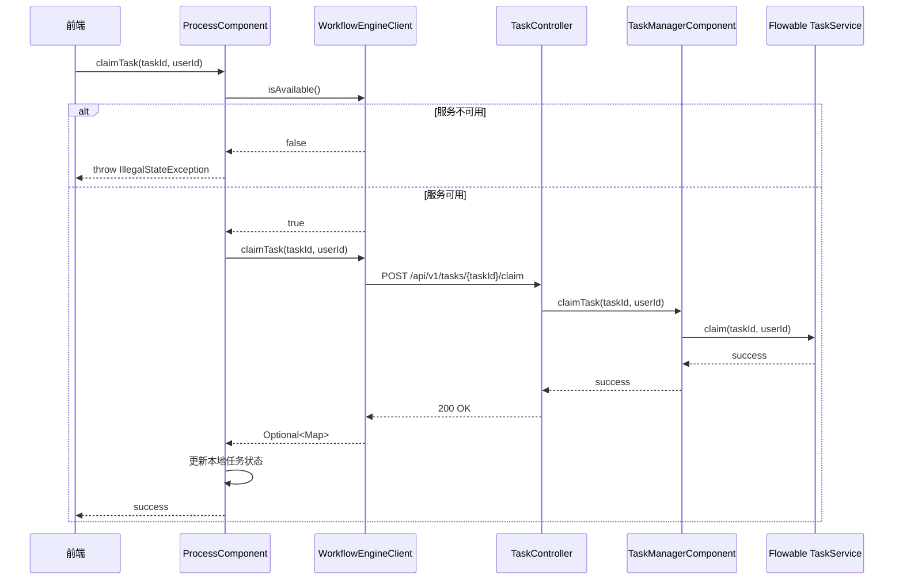

# Flowable 集成重构设计文档

## 概述

本设计文档描述了将 `user-portal` 模块重构为完全依赖 Flowable 工作流引擎的技术方案。所有工作流相关功能通过 `workflow-engine-core` 模块调用 Flowable API，禁止任何本地回退实现。

## 架构

### 系统架构图

```
┌─────────────────────────────────────────────────────────────────────────────┐
│                              user-portal                                     │
│  ┌─────────────────┐  ┌─────────────────┐  ┌─────────────────┐              │
│  │ ProcessComponent│  │TaskProcessComp. │  │ TaskQueryComp.  │              │
│  └────────┬────────┘  └────────┬────────┘  └────────┬────────┘              │
│           │                    │                    │                        │
│           └────────────────────┼────────────────────┘                        │
│                                │                                             │
│                    ┌───────────▼───────────┐                                 │
│                    │ WorkflowEngineClient  │                                 │
│                    └───────────┬───────────┘                                 │
└────────────────────────────────┼────────────────────────────────────────────┘
                                 │ HTTP REST
┌────────────────────────────────▼────────────────────────────────────────────┐
│                         workflow-engine-core                                 │
│  ┌─────────────────┐  ┌─────────────────┐                                   │
│  │ProcessController│  │ TaskController  │                                   │
│  └────────┬────────┘  └────────┬────────┘                                   │
│           │                    │                                             │
│  ┌────────▼────────┐  ┌────────▼────────┐                                   │
│  │ProcessEngineCom.│  │TaskManagerComp. │                                   │
│  └────────┬────────┘  └────────┬────────┘                                   │
└───────────┼────────────────────┼────────────────────────────────────────────┘
            │                    │ Flowable API
┌───────────▼────────────────────▼────────────────────────────────────────────┐
│                           Flowable Engine                                    │
│  ┌─────────────────┐  ┌─────────────────┐  ┌─────────────────┐              │
│  │ RuntimeService  │  │  TaskService    │  │RepositoryService│              │
│  └─────────────────┘  └─────────────────┘  └─────────────────┘              │
└─────────────────────────────────────────────────────────────────────────────┘
```

### 调用流程



## 组件和接口

### WorkflowEngineClient

HTTP 客户端，负责与 workflow-engine-core 通信。

```java
public interface WorkflowEngineClient {
    // 健康检查
    boolean isAvailable();
    
    // 任务操作
    Optional<Map<String, Object>> claimTask(String taskId, String userId);
    Optional<Map<String, Object>> unclaimTask(String taskId);
    Optional<Map<String, Object>> delegateTask(String taskId, String userId);
    Optional<Map<String, Object>> transferTask(String taskId, String userId);
    Optional<Map<String, Object>> completeTask(String taskId, Map<String, Object> variables);
    Optional<Map<String, Object>> returnTask(String taskId, String targetActivityId);
    
    // 流程操作
    Optional<Map<String, Object>> deployProcess(String name, String key, String bpmnXml);
    Optional<Map<String, Object>> startProcess(String processKey, String businessKey, 
                                                String startUserId, Map<String, Object> variables);
    
    // 任务查询
    Optional<List<Map<String, Object>>> getUserTasks(String userId);
    Optional<List<Map<String, Object>>> getGroupTasks(String groupId);
}
```

### TaskProcessComponent

任务处理组件，封装任务操作业务逻辑。

```java
public class TaskProcessComponent {
    // 认领任务
    public void claimTask(String taskId, String userId);
    
    // 取消认领
    public void unclaimTask(String taskId);
    
    // 委托任务
    public void delegateTask(String taskId, String delegatee, String reason);
    
    // 转办任务
    public void transferTask(String taskId, String targetUser, String reason);
    
    // 审批处理
    public void handleApproval(String taskId, String action, Map<String, Object> formData);
    
    // 回退任务
    public void handleReturn(String taskId, String targetActivityId, String reason);
}
```

### ProcessComponent

流程组件，封装流程操作业务逻辑。

```java
public class ProcessComponent {
    // 启动流程
    public ProcessInstanceInfo startProcess(String userId, String processKey, 
                                            ProcessStartRequest request);
    
    // 获取可用流程定义
    public List<ProcessDefinitionInfo> getAvailableProcessDefinitions(String userId, 
                                                                       String category, 
                                                                       String keyword);
}
```

### REST API 端点

| 端点 | 方法 | 描述 |
|------|------|------|
| `/api/v1/tasks/{taskId}/claim` | POST | 认领任务 |
| `/api/v1/tasks/{taskId}/unclaim` | POST | 取消认领 |
| `/api/v1/tasks/{taskId}/delegate` | POST | 委托任务 |
| `/api/v1/tasks/{taskId}/transfer` | POST | 转办任务 |
| `/api/v1/tasks/{taskId}/complete` | POST | 完成任务 |
| `/api/v1/tasks/{taskId}/return` | POST | 回退任务 |
| `/api/v1/processes/instances` | POST | 启动流程 |
| `/api/v1/tasks` | GET | 查询任务列表 |

## 数据模型

### 任务状态枚举

```java
public enum AssignmentType {
    USER,       // 直接分配给用户
    GROUP,      // 分配给组
    ROLE,       // 分配给角色
    DELEGATED   // 已委托
}
```

### 任务信息 DTO

```java
public class TaskInfo {
    private String id;
    private String name;
    private String processInstanceId;
    private String processDefinitionKey;
    private String assignee;
    private AssignmentType assignmentType;
    private String delegator;      // 委托人（仅委托时有值）
    private LocalDateTime createTime;
    private LocalDateTime dueDate;
}
```

### 流程实例信息 DTO

```java
public class ProcessInstanceInfo {
    private String id;
    private String processDefinitionId;
    private String processDefinitionKey;
    private String businessKey;
    private String startUserId;
    private String status;
    private LocalDateTime startTime;
}
```

## 正确性属性

*正确性属性是系统在所有有效执行中应保持为真的特征或行为——本质上是关于系统应该做什么的形式化陈述。属性作为人类可读规范和机器可验证正确性保证之间的桥梁。*

### Property 1: 服务不可用时抛出异常

*For any* 工作流操作（认领、取消认领、委托、转办、完成、回退、启动流程），when workflow-engine-core 不可用时，系统应抛出 IllegalStateException 并包含错误消息 "Flowable 引擎不可用"

**Validates: Requirements 1.2, 2.2, 3.2, 4.2, 5.2, 6.2, 7.2, 8.2**

### Property 2: 认领任务后状态更新

*For any* 任务和用户，当认领操作成功后，本地任务状态的 assignmentType 应为 "USER"，assignee 应为执行认领的用户

**Validates: Requirements 1.3**

### Property 3: 取消认领后状态恢复

*For any* 已认领的任务，当取消认领操作成功后，任务应恢复到原始分配状态

**Validates: Requirements 2.3**

### Property 4: 委托任务后状态更新

*For any* 任务、委托人和被委托人，当委托操作成功后，本地任务状态的 assignmentType 应为 "DELEGATED"，并正确记录委托人和被委托人

**Validates: Requirements 3.3**

### Property 5: 转办任务后状态更新

*For any* 任务和目标用户，当转办操作成功后，本地任务状态的 assignmentType 应为 "USER"，assignee 应为目标用户，委托信息应被清除

**Validates: Requirements 4.3**

### Property 6: 完成任务后移除本地记录

*For any* 任务，当完成操作成功后，该任务应从本地任务存储中移除

**Validates: Requirements 5.3**

### Property 7: 完成任务时传递流程变量

*For any* 审批动作（APPROVE/REJECT）和表单数据，当完成任务时，这些数据应作为流程变量传递给 Flowable

**Validates: Requirements 5.4**

### Property 8: 启动流程返回有效实例信息

*For any* 有效的流程Key和用户，当启动流程成功后，返回的流程实例信息应包含有效的 ID、processDefinitionKey 和 startUserId

**Validates: Requirements 6.3**

### Property 9: 状态变更操作记录审计日志

*For any* 委托或转办操作，系统应记录包含操作类型、操作人、目标用户和原因的审计日志

**Validates: Requirements 3.4, 4.4**

## 错误处理

### 错误处理策略

1. **服务不可用**: 当 `WorkflowEngineClient.isAvailable()` 返回 false 时，立即抛出 `IllegalStateException`
2. **操作失败**: 当 Flowable 操作返回错误时，抛出 `PortalException` 并包含具体错误信息
3. **参数验证**: 在调用 Flowable 之前验证参数，无效参数抛出 `IllegalArgumentException`

### 错误消息规范

```java
// 服务不可用
"Flowable 引擎不可用，请检查 workflow-engine-core 服务是否启动"

// 任务不存在
"任务不存在: {taskId}"

// 无权限操作
"无权操作此任务"

// 流程定义不存在
"流程定义不存在: {processKey}"
```

## 测试策略

### 单元测试

- 测试各组件的参数验证逻辑
- 测试错误处理路径
- 测试状态更新逻辑

### 属性测试

使用 jqwik 框架进行属性测试，验证正确性属性：

- 每个属性测试至少运行 100 次迭代
- 使用 Arbitrary 生成随机测试数据
- Mock WorkflowEngineClient 的响应

### 测试框架

- **单元测试**: JUnit 5 + Mockito
- **属性测试**: jqwik
- **断言库**: AssertJ

### 测试标注格式

```java
@Property(tries = 100)
@Label("Property 1: 服务不可用时抛出异常")
// Feature: flowable-integration, Property 1: 服务不可用时抛出异常
// Validates: Requirements 1.2, 2.2, 3.2, 4.2, 5.2, 6.2, 7.2, 8.2
void serviceUnavailableShouldThrowException(...) {
    // ...
}
```
