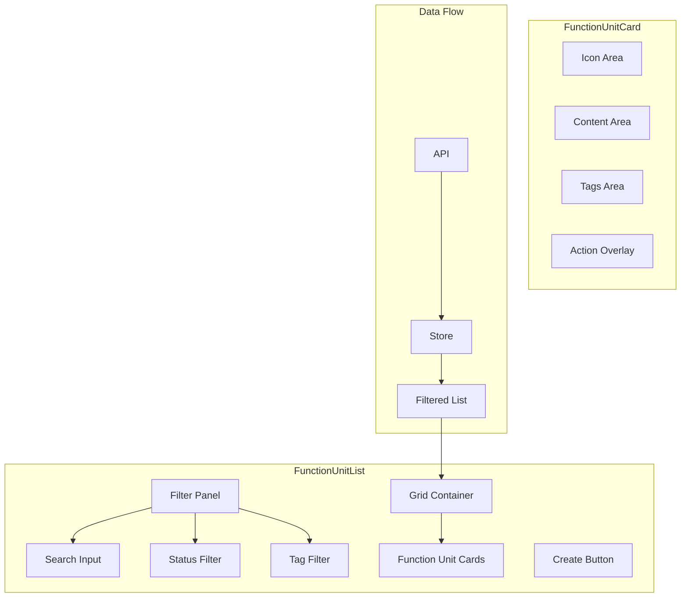

# Design Document: Function Unit Grid Layout

## Overview

本设计将功能单元列表从表格布局重构为现代化的卡片网格布局，使用 CSS Grid 实现响应式布局，并添加标签系统和多维度筛选功能。

## Architecture



## Components and Interfaces

### FunctionUnitList.vue 重构

主要变更：
- 移除 el-table，改用 CSS Grid 布局
- 添加 FunctionUnitCard 子组件
- 添加标签筛选功能
- 添加骨架屏加载状态

### FunctionUnitCard.vue (新组件)

```vue
<template>
  <div class="function-unit-card" @click="handleClick">
    <div class="card-icon">
      <IconPreview :icon-id="item.iconId" size="large" />
    </div>
    <div class="card-content">
      <h3 class="card-title">{{ item.name }}</h3>
      <p class="card-description">{{ item.description }}</p>
      <div class="card-tags">
        <el-tag v-for="tag in displayTags" :key="tag" size="small">{{ tag }}</el-tag>
        <el-tag v-if="extraTagCount > 0" size="small" type="info">+{{ extraTagCount }}</el-tag>
      </div>
      <el-tag :type="statusType" size="small">{{ statusLabel }}</el-tag>
    </div>
    <div class="card-actions" @click.stop>
      <el-button-group>
        <el-button size="small" @click="$emit('edit')">编辑</el-button>
        <el-button size="small" @click="$emit('publish')">发布</el-button>
        <el-button size="small" @click="$emit('clone')">克隆</el-button>
        <el-button size="small" type="danger" @click="$emit('delete')">删除</el-button>
      </el-button-group>
    </div>
  </div>
</template>
```

### Props Interface

```typescript
interface FunctionUnitCardProps {
  item: FunctionUnitResponse
}

interface FunctionUnitCardEmits {
  (e: 'click'): void
  (e: 'edit'): void
  (e: 'publish'): void
  (e: 'clone'): void
  (e: 'delete'): void
}
```

## Data Models

### 标签数据

由于后端暂不支持标签，前端使用本地存储管理标签：

```typescript
interface TagData {
  functionUnitId: number
  tags: string[]
}

// 预定义标签
const PREDEFINED_TAGS = ['核心业务', '报表', '审批流程', '数据管理', '系统集成', '用户管理']

// localStorage key
const TAGS_STORAGE_KEY = 'function-unit-tags'
```

### 筛选状态

```typescript
interface FilterState {
  name: string
  status: string
  tags: string[]
}
```

## Correctness Properties

*A property is a characteristic or behavior that should hold true across all valid executions of a system—essentially, a formal statement about what the system should do.*

### Property 1: Card Displays Required Fields

*For any* function unit data, the rendered card SHALL contain the icon, name, description, status, and tags areas.

**Validates: Requirements 1.4**

### Property 2: Tag Display Limit

*For any* function unit with N tags where N > 3, the card SHALL display exactly 3 tags plus a "+{N-3}" indicator.

**Validates: Requirements 3.1**

### Property 3: Filter Results Correctness

*For any* filter criteria (name, status, tags), the filtered result SHALL only contain function units that match ALL specified criteria.

**Validates: Requirements 4.4**

## Error Handling

| Scenario | Handling |
|----------|----------|
| API 请求失败 | 显示错误提示，保留当前数据 |
| 标签数据损坏 | 重置为空数组 |
| 图标加载失败 | 显示默认占位图标 |

## Testing Strategy

### Unit Tests

- 测试 FunctionUnitCard 组件渲染
- 测试标签显示逻辑（超过3个显示+N）
- 测试筛选逻辑

### Property-Based Tests

使用 fast-check 进行属性测试：

1. **Tag Display Property**: 对于任意数量的标签，显示逻辑正确
2. **Filter Property**: 对于任意筛选条件，结果只包含匹配项

## CSS Grid Layout

```scss
.function-unit-grid {
  display: grid;
  grid-template-columns: repeat(auto-fill, minmax(280px, 1fr));
  gap: 20px;
  padding: 20px 0;
}

.function-unit-card {
  background: #fff;
  border-radius: 8px;
  box-shadow: 0 2px 8px rgba(0, 0, 0, 0.08);
  transition: all 0.3s ease;
  overflow: hidden;
  cursor: pointer;
  
  &:hover {
    box-shadow: 0 4px 16px rgba(0, 0, 0, 0.12);
    transform: translateY(-2px);
    
    .card-actions {
      opacity: 1;
    }
  }
}

.card-icon {
  height: 120px;
  display: flex;
  align-items: center;
  justify-content: center;
  background: linear-gradient(135deg, #f5f7fa 0%, #e4e7ed 100%);
}

.card-content {
  padding: 16px;
}

.card-actions {
  padding: 12px 16px;
  border-top: 1px solid #ebeef5;
  opacity: 0;
  transition: opacity 0.3s;
}
```
