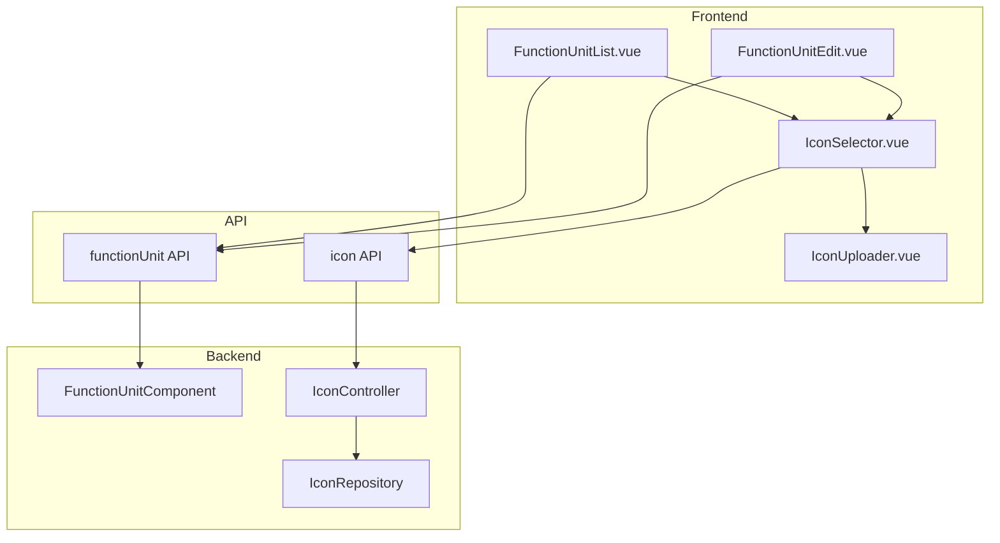

# Design Document: Function Unit Icon Management

## Overview

本设计文档描述功能单元图标上传和修改功能的技术实现方案。该功能允许开发者在创建和编辑功能单元时选择或上传图标，以便在用户门户中更好地展示和识别不同的功能单元。

系统已有图标库（Icon Library）和图标API，本功能主要在前端实现图标选择器组件，并集成到功能单元的创建和编辑流程中。

## Architecture



## Components and Interfaces

### 1. IconSelector Component

新建可复用的图标选择器组件，用于在功能单元创建和编辑时选择图标。

```typescript
// IconSelector.vue Props
interface IconSelectorProps {
  modelValue?: number | null;  // 当前选中的图标ID
  visible: boolean;            // 控制选择器显示/隐藏
}

// IconSelector.vue Emits
interface IconSelectorEmits {
  'update:modelValue': (iconId: number | null) => void;
  'update:visible': (visible: boolean) => void;
  'select': (icon: Icon | null) => void;
}
```

### 2. IconPreview Component

新建图标预览组件，用于显示已选择的图标。

```typescript
// IconPreview.vue Props
interface IconPreviewProps {
  iconId?: number | null;
  iconUrl?: string;
  size?: 'small' | 'medium' | 'large';  // 32px, 48px, 64px
  clickable?: boolean;
}
```

### 3. Updated FunctionUnitList.vue

修改功能单元列表页面，添加图标显示和创建时的图标选择。

```typescript
// 扩展 createForm
interface CreateForm {
  name: string;
  description: string;
  iconId?: number | null;
}
```

### 4. Updated FunctionUnitEdit.vue

修改功能单元编辑页面，在头部显示图标并支持修改。

### 5. API Extensions

扩展 functionUnit API 以支持图标URL返回：

```typescript
// 扩展 FunctionUnitResponse
interface FunctionUnitResponse {
  // ... existing fields
  iconId?: number;
  iconUrl?: string;  // 新增：图标URL用于前端显示
}
```

## Data Models

### Icon (已存在)

```typescript
interface Icon {
  id: number;
  name: string;
  category: string;
  svgContent: string;
  fileSize: number;
  description?: string;
  tags?: string;
  createdAt: string;
}
```

### FunctionUnit Icon Association

功能单元与图标的关联已在后端实现，前端需要：
- 创建时传递 `iconId`
- 更新时传递 `iconId`（可为 null 表示清除）
- 列表和详情返回 `iconId` 和 `iconUrl`

## Correctness Properties

*A property is a characteristic or behavior that should hold true across all valid executions of a system-essentially, a formal statement about what the system should do. Properties serve as the bridge between human-readable specifications and machine-verifiable correctness guarantees.*

### Property 1: Icon ID Persistence Round-Trip

*For any* function unit created or updated with a valid icon ID, retrieving that function unit should return the same icon ID that was saved.

**Validates: Requirements 1.4, 2.3**

### Property 2: Optional Icon Handling

*For any* function unit created or updated with a null/undefined icon ID, the function unit should be saved successfully and retrieving it should return null for the icon field.

**Validates: Requirements 1.5, 2.4**

### Property 3: Icon Upload Persistence

*For any* valid SVG file uploaded to the icon library, the icon should be retrievable by its returned ID with the same content.

**Validates: Requirements 3.3**

### Property 4: Invalid File Rejection

*For any* file that is not a valid SVG or exceeds the size limit, the upload operation should fail with an appropriate error and not create any icon record.

**Validates: Requirements 3.4**

### Property 5: Search Filter Correctness

*For any* search query string, all icons returned by the search should contain the query string (case-insensitive) in their name.

**Validates: Requirements 5.2**

### Property 6: Category Filter Correctness

*For any* category filter value, all icons returned should have their category field equal to the filter value.

**Validates: Requirements 5.3**

## Error Handling

| Error Scenario | Error Code | User Message | Recovery Action |
|---------------|------------|--------------|-----------------|
| Icon not found | ICON_NOT_FOUND | 图标不存在 | 清除选择，刷新图标列表 |
| Invalid SVG file | INVALID_FILE_TYPE | 请上传SVG格式的图标文件 | 提示用户选择正确格式 |
| File too large | FILE_TOO_LARGE | 文件大小超过限制（最大100KB） | 提示用户压缩文件 |
| Upload failed | UPLOAD_FAILED | 上传失败，请重试 | 允许重试 |
| Icon in use | ICON_IN_USE | 该图标正在被使用，无法删除 | 提示用户先解除关联 |

## Testing Strategy

### Unit Tests

- IconSelector 组件渲染测试
- IconPreview 组件渲染测试
- 图标选择交互测试
- 搜索和筛选功能测试

### Property-Based Tests

使用 jqwik 进行属性测试：

1. **Icon ID Round-Trip Test**: 生成随机功能单元数据和图标ID，验证保存后检索返回相同的图标ID
2. **Optional Icon Test**: 生成随机功能单元数据（无图标），验证保存和检索正确处理null值
3. **Search Filter Test**: 生成随机图标数据和搜索词，验证搜索结果的正确性
4. **Category Filter Test**: 生成随机图标数据和分类，验证分类筛选的正确性

### Integration Tests

- 功能单元创建流程（含图标选择）
- 功能单元编辑流程（修改图标）
- 图标上传流程
