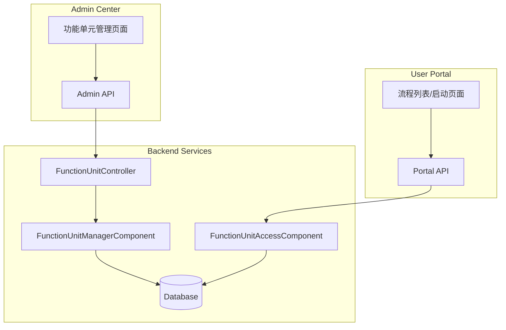
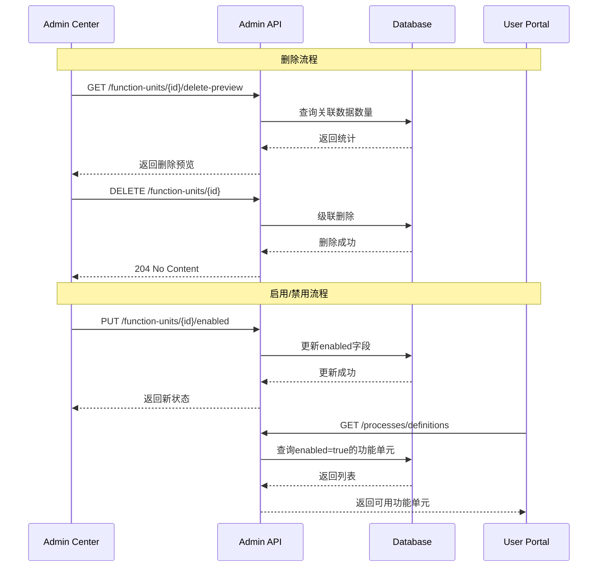

# 功能单元管理设计文档

## 概述

本设计文档描述功能单元管理增强功能的技术实现方案，包括：
1. Admin Center 中的安全删除和启用/禁用开关
2. User Portal 中的功能单元列表和流程启动

## 架构

### 系统架构图



### 数据流



## 组件和接口

### 数据库变更

```sql
-- 添加启用状态字段
ALTER TABLE admin_function_units ADD COLUMN enabled BOOLEAN NOT NULL DEFAULT TRUE;

-- 添加索引优化查询
CREATE INDEX idx_function_units_enabled ON admin_function_units(enabled);
CREATE INDEX idx_function_units_status_enabled ON admin_function_units(status, enabled);
```

### 后端组件

#### FunctionUnitController (增强)

```java
// 获取删除预览
@GetMapping("/{id}/delete-preview")
public ResponseEntity<DeletePreviewResponse> getDeletePreview(@PathVariable String id);

// 切换启用状态
@PutMapping("/{id}/enabled")
public ResponseEntity<EnabledResponse> setEnabled(
    @PathVariable String id, 
    @RequestBody EnabledRequest request);
```

#### FunctionUnitManagerComponent (增强)

```java
// 获取删除预览信息
public DeletePreviewResponse getDeletePreview(String functionUnitId);

// 检查是否有运行中的流程实例
public boolean hasRunningInstances(String functionUnitId);

// 级联删除功能单元
public void deleteFunctionUnitCascade(String functionUnitId);

// 设置启用状态
public FunctionUnit setEnabled(String functionUnitId, boolean enabled);
```

#### FunctionUnitAccessComponent (User Portal, 增强)

```java
// 获取可访问的功能单元（增加enabled过滤）
public List<ProcessDefinitionInfo> getAccessibleFunctionUnits(String userId);

// 检查功能单元是否可访问（包括enabled检查）
public boolean isFunctionUnitAccessible(String functionUnitId, String userId);
```

### 前端组件

#### 删除确认对话框组件

```vue
<template>
  <el-dialog 
    v-model="visible" 
    title="⚠️ 危险操作" 
    width="500px"
    class="danger-dialog"
  >
    <div class="warning-content">
      <el-alert type="error" :closable="false">
        <template #title>
          <strong>您即将删除功能单元: {{ functionUnit.name }}</strong>
        </template>
        <p>此操作不可撤销，将删除以下所有关联数据：</p>
        <ul>
          <li>{{ preview.formCount }} 个表单</li>
          <li>{{ preview.processCount }} 个流程</li>
          <li>{{ preview.dataTableCount }} 个数据表</li>
          <li>{{ preview.accessConfigCount }} 个权限配置</li>
          <li>{{ preview.deploymentCount }} 个部署记录</li>
        </ul>
      </el-alert>
      
      <div class="confirm-input">
        <p>请输入功能单元名称 <strong>{{ functionUnit.name }}</strong> 以确认删除：</p>
        <el-input v-model="confirmName" placeholder="输入功能单元名称" />
      </div>
    </div>
    
    <template #footer>
      <el-button @click="visible = false">取消</el-button>
      <el-button 
        type="danger" 
        :disabled="!canDelete || countdown > 0"
        @click="handleDelete"
      >
        {{ countdown > 0 ? `删除 (${countdown}s)` : '确认删除' }}
      </el-button>
    </template>
  </el-dialog>
</template>
```

#### 启用/禁用开关

```vue
<el-table-column label="状态" width="100">
  <template #default="{ row }">
    <el-switch
      v-model="row.enabled"
      @change="handleEnabledChange(row)"
      :before-change="() => confirmDisable(row)"
    />
  </template>
</el-table-column>
```

## 数据模型

### DeletePreviewResponse

```java
@Data
public class DeletePreviewResponse {
    private String functionUnitId;
    private String functionUnitName;
    private int formCount;
    private int processCount;
    private int dataTableCount;
    private int accessConfigCount;
    private int deploymentCount;
    private boolean hasRunningInstances;
    private int runningInstanceCount;
}
```

### EnabledRequest / EnabledResponse

```java
@Data
public class EnabledRequest {
    private boolean enabled;
}

@Data
public class EnabledResponse {
    private String id;
    private boolean enabled;
    private Instant updatedAt;
}
```

### FunctionUnit Entity (增强)

```java
@Entity
@Table(name = "admin_function_units")
public class FunctionUnit {
    // ... 现有字段 ...
    
    @Column(name = "enabled", nullable = false)
    @Builder.Default
    private Boolean enabled = true;
}
```


## 正确性属性

*正确性属性是系统在所有有效执行中应保持为真的特征或行为。属性作为人类可读规范和机器可验证正确性保证之间的桥梁。*

### Property 1: 删除预览数量正确性

*对于任意* 功能单元，删除预览返回的关联数据数量应与数据库中实际存在的关联记录数量一致。

**Validates: Requirements 1.4**

### Property 2: 名称匹配验证

*对于任意* 功能单元名称和任意用户输入，只有当输入与功能单元名称完全匹配时，删除按钮才应被启用。

**Validates: Requirements 1.6**

### Property 3: 运行实例阻止删除

*对于任意* 有正在运行流程实例的功能单元，删除操作应被阻止并返回错误。

**Validates: Requirements 1.8**

### Property 4: 级联删除完整性

*对于任意* 功能单元，删除操作完成后，该功能单元及其所有关联内容（Content、Deployment、Dependency、Access）都应从数据库中移除。

**Validates: Requirements 1.9**

### Property 5: 启用状态切换正确性

*对于任意* 功能单元，切换启用状态后，数据库中的 enabled 字段应立即反映新状态，且后续查询应返回更新后的状态。

**Validates: Requirements 2.3, 2.6, 2.7**

### Property 6: 禁用状态访问控制

*对于任意* 处于禁用状态的功能单元，用户门户的功能单元列表不应包含该功能单元，且通过ID直接访问应返回禁用提示。

**Validates: Requirements 2.4, 2.5, 4.9**

### Property 7: 功能单元列表过滤

*对于任意* 用户，功能单元列表应只包含同时满足以下条件的功能单元：已部署(DEPLOYED)、已启用(enabled=true)、用户有访问权限。

**Validates: Requirements 3.1**

### Property 8: 搜索和筛选正确性

*对于任意* 搜索关键字或分类筛选条件，返回的功能单元列表中的每个项目都应匹配该条件。

**Validates: Requirements 3.3, 3.4**

### Property 9: 收藏状态切换

*对于任意* 功能单元，切换收藏状态后，该功能单元的 isFavorite 属性应变为相反值。

**Validates: Requirements 3.5**

### Property 10: 表单渲染一致性

*对于任意* 功能单元的表单定义，渲染后的表单字段应与定义中的字段一一对应。

**Validates: Requirements 4.3**

### Property 11: 表单验证正确性

*对于任意* 表单数据，验证结果应与表单定义中的验证规则一致。

**Validates: Requirements 4.5**

## 错误处理

### 删除操作错误

| 错误场景 | HTTP状态码 | 错误消息 |
|---------|-----------|---------|
| 功能单元不存在 | 404 | 功能单元不存在 |
| 有运行中的流程实例 | 409 | 无法删除：存在 N 个运行中的流程实例 |
| 数据库错误 | 500 | 删除失败，请稍后重试 |

### 启用状态切换错误

| 错误场景 | HTTP状态码 | 错误消息 |
|---------|-----------|---------|
| 功能单元不存在 | 404 | 功能单元不存在 |
| 数据库错误 | 500 | 状态更新失败，请稍后重试 |

### 用户门户访问错误

| 错误场景 | HTTP状态码 | 错误消息 |
|---------|-----------|---------|
| 功能单元已禁用 | 403 | 该功能单元已被禁用 |
| 无访问权限 | 403 | 您没有访问该功能单元的权限 |
| 功能单元不存在 | 404 | 功能单元不存在 |

## 测试策略

### 单元测试

- 测试 `FunctionUnitManagerComponent.getDeletePreview()` 返回正确的统计数据
- 测试 `FunctionUnitManagerComponent.hasRunningInstances()` 正确检测运行实例
- 测试 `FunctionUnitManagerComponent.deleteFunctionUnitCascade()` 级联删除所有关联数据
- 测试 `FunctionUnitManagerComponent.setEnabled()` 正确更新状态
- 测试 `FunctionUnitAccessComponent.getAccessibleFunctionUnits()` 正确过滤禁用的功能单元

### 属性测试

使用 jqwik 框架进行属性测试，每个属性测试至少运行 100 次迭代。

- **Property 1**: 生成随机功能单元和关联数据，验证预览数量
- **Property 4**: 生成随机功能单元，执行删除，验证所有关联数据已删除
- **Property 5**: 生成随机功能单元，切换状态，验证数据库状态
- **Property 6**: 生成随机禁用的功能单元，验证列表过滤和访问控制
- **Property 7**: 生成随机用户和功能单元，验证列表过滤逻辑

### 集成测试

- 测试完整的删除流程（预览 -> 确认 -> 删除）
- 测试启用/禁用状态变更对用户门户的影响
- 测试用户门户功能单元列表的权限过滤
