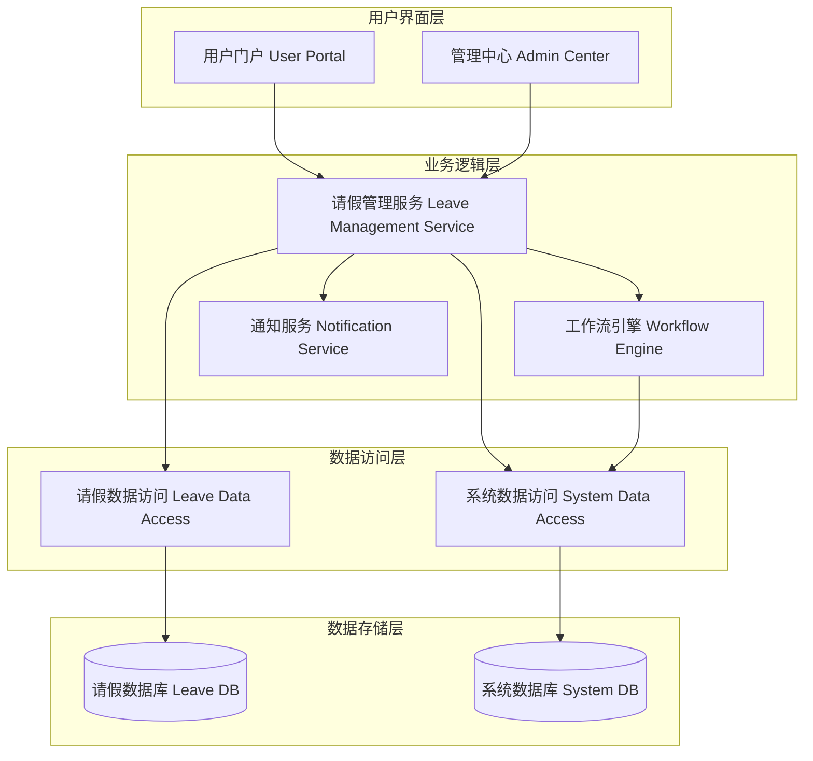

# 请假管理系统设计文档

## 概述

请假管理系统是一个集成到现有工作流平台的功能单元，提供完整的请假申请、审批和管理功能。系统采用微服务架构，与现有的用户管理、组织架构和工作流引擎紧密集成，确保数据一致性和业务流程的无缝衔接。

## 架构

### 系统架构图



### 技术栈

- **后端框架**: Spring Boot (Java)
- **数据库**: MySQL 8.0
- **工作流引擎**: 现有 Workflow Engine Core
- **前端框架**: Vue.js 3 (用户门户) + React (管理中心)
- **API 协议**: RESTful API
- **消息队列**: RabbitMQ (用于通知)
- **缓存**: Redis (用于会话和临时数据)

## 组件和接口

### 核心组件

#### 1. Leave Management Service (请假管理服务)

**职责:**
- 处理请假申请的CRUD操作
- 执行业务规则验证
- 协调工作流引擎和通知服务
- 提供统计和报表功能

**主要接口:**
```java
public interface LeaveManagementService {
    LeaveApplication submitApplication(LeaveApplicationRequest request);
    List<LeaveApplication> getApplicationsByUser(Long userId);
    List<LeaveApplication> getApplicationsByManager(Long managerId);
    LeaveApplication approveApplication(Long applicationId, ApprovalRequest request);
    LeaveApplication rejectApplication(Long applicationId, RejectionRequest request);
    LeaveStatistics getStatistics(StatisticsRequest request);
}
```

#### 2. Leave Workflow Service (请假工作流服务)

**职责:**
- 定义和管理请假审批工作流
- 处理工作流状态转换
- 管理审批任务分配

**主要接口:**
```java
public interface LeaveWorkflowService {
    WorkflowInstance startApprovalProcess(LeaveApplication application);
    void completeTask(Long taskId, TaskCompletionRequest request);
    List<WorkflowTask> getPendingTasks(Long userId);
    WorkflowInstance getWorkflowStatus(Long applicationId);
}
```

#### 3. Leave Notification Service (请假通知服务)

**职责:**
- 发送各类通知消息
- 管理通知模板
- 处理通知失败重试

**主要接口:**
```java
public interface LeaveNotificationService {
    void sendApplicationSubmittedNotification(LeaveApplication application);
    void sendApprovalRequestNotification(LeaveApplication application, User approver);
    void sendStatusChangeNotification(LeaveApplication application);
    void sendReminderNotification(List<WorkflowTask> overdueTasks);
}
```

### API 接口设计

#### REST API 端点

```
POST   /api/leave/applications              # 提交请假申请
GET    /api/leave/applications              # 获取请假申请列表
GET    /api/leave/applications/{id}         # 获取特定请假申请
PUT    /api/leave/applications/{id}/approve # 审批通过
PUT    /api/leave/applications/{id}/reject  # 审批拒绝
GET    /api/leave/applications/pending      # 获取待审批申请
GET    /api/leave/types                     # 获取请假类型
POST   /api/leave/types                     # 创建请假类型 (管理员)
GET    /api/leave/statistics                # 获取统计数据 (管理员)
```

## 数据模型

### 数据库表设计

#### 1. lm_leave_applications (请假申请表)

```sql
CREATE TABLE lm_leave_applications (
    id BIGINT PRIMARY KEY AUTO_INCREMENT,
    application_no VARCHAR(50) UNIQUE NOT NULL COMMENT '申请编号',
    user_id BIGINT NOT NULL COMMENT '申请人ID',
    leave_type_id BIGINT NOT NULL COMMENT '请假类型ID',
    start_date DATE NOT NULL COMMENT '开始日期',
    end_date DATE NOT NULL COMMENT '结束日期',
    days DECIMAL(3,1) NOT NULL COMMENT '请假天数',
    reason TEXT COMMENT '请假原因',
    status VARCHAR(20) NOT NULL DEFAULT 'PENDING' COMMENT '状态',
    workflow_instance_id BIGINT COMMENT '工作流实例ID',
    created_by BIGINT NOT NULL,
    created_time DATETIME NOT NULL DEFAULT CURRENT_TIMESTAMP,
    updated_by BIGINT,
    updated_time DATETIME DEFAULT CURRENT_TIMESTAMP ON UPDATE CURRENT_TIMESTAMP,
    
    INDEX idx_user_id (user_id),
    INDEX idx_status (status),
    INDEX idx_created_time (created_time),
    FOREIGN KEY (user_id) REFERENCES sys_user(id),
    FOREIGN KEY (leave_type_id) REFERENCES lm_leave_types(id)
);
```

#### 2. lm_leave_types (请假类型表)

```sql
CREATE TABLE lm_leave_types (
    id BIGINT PRIMARY KEY AUTO_INCREMENT,
    type_code VARCHAR(20) UNIQUE NOT NULL COMMENT '类型代码',
    type_name VARCHAR(50) NOT NULL COMMENT '类型名称',
    description TEXT COMMENT '描述',
    max_days INT COMMENT '最大天数限制',
    requires_attachment BOOLEAN DEFAULT FALSE COMMENT '是否需要附件',
    workflow_definition_id BIGINT COMMENT '工作流定义ID',
    is_active BOOLEAN DEFAULT TRUE COMMENT '是否启用',
    created_by BIGINT NOT NULL,
    created_time DATETIME NOT NULL DEFAULT CURRENT_TIMESTAMP,
    updated_by BIGINT,
    updated_time DATETIME DEFAULT CURRENT_TIMESTAMP ON UPDATE CURRENT_TIMESTAMP
);
```

#### 3. lm_approval_records (审批记录表)

```sql
CREATE TABLE lm_approval_records (
    id BIGINT PRIMARY KEY AUTO_INCREMENT,
    application_id BIGINT NOT NULL COMMENT '申请ID',
    approver_id BIGINT NOT NULL COMMENT '审批人ID',
    approval_level INT NOT NULL COMMENT '审批级别',
    action VARCHAR(20) NOT NULL COMMENT '操作 (APPROVE/REJECT)',
    comments TEXT COMMENT '审批意见',
    approval_time DATETIME NOT NULL DEFAULT CURRENT_TIMESTAMP,
    
    INDEX idx_application_id (application_id),
    INDEX idx_approver_id (approver_id),
    FOREIGN KEY (application_id) REFERENCES lm_leave_applications(id),
    FOREIGN KEY (approver_id) REFERENCES sys_user(id)
);
```

#### 4. lm_leave_balances (请假余额表)

```sql
CREATE TABLE lm_leave_balances (
    id BIGINT PRIMARY KEY AUTO_INCREMENT,
    user_id BIGINT NOT NULL COMMENT '用户ID',
    leave_type_id BIGINT NOT NULL COMMENT '请假类型ID',
    year INT NOT NULL COMMENT '年份',
    total_days DECIMAL(4,1) NOT NULL COMMENT '总天数',
    used_days DECIMAL(4,1) DEFAULT 0 COMMENT '已用天数',
    remaining_days DECIMAL(4,1) GENERATED ALWAYS AS (total_days - used_days) COMMENT '剩余天数',
    
    UNIQUE KEY uk_user_type_year (user_id, leave_type_id, year),
    FOREIGN KEY (user_id) REFERENCES sys_user(id),
    FOREIGN KEY (leave_type_id) REFERENCES lm_leave_types(id)
);
```

### 实体类设计

#### LeaveApplication 实体

```java
@Entity
@Table(name = "lm_leave_applications")
public class LeaveApplication {
    @Id
    @GeneratedValue(strategy = GenerationType.IDENTITY)
    private Long id;
    
    @Column(name = "application_no", unique = true, nullable = false)
    private String applicationNo;
    
    @Column(name = "user_id", nullable = false)
    private Long userId;
    
    @ManyToOne(fetch = FetchType.LAZY)
    @JoinColumn(name = "leave_type_id")
    private LeaveType leaveType;
    
    @Column(name = "start_date", nullable = false)
    private LocalDate startDate;
    
    @Column(name = "end_date", nullable = false)
    private LocalDate endDate;
    
    @Column(name = "days", nullable = false)
    private BigDecimal days;
    
    @Column(name = "reason")
    private String reason;
    
    @Enumerated(EnumType.STRING)
    @Column(name = "status", nullable = false)
    private ApplicationStatus status;
    
    @Column(name = "workflow_instance_id")
    private Long workflowInstanceId;
    
    // 审计字段
    @Column(name = "created_by", nullable = false)
    private Long createdBy;
    
    @Column(name = "created_time", nullable = false)
    private LocalDateTime createdTime;
    
    @Column(name = "updated_by")
    private Long updatedBy;
    
    @Column(name = "updated_time")
    private LocalDateTime updatedTime;
    
    // 关联关系
    @OneToMany(mappedBy = "application", cascade = CascadeType.ALL, fetch = FetchType.LAZY)
    private List<ApprovalRecord> approvalRecords;
}
```

## 错误处理

### 异常层次结构

```java
public class LeaveManagementException extends RuntimeException {
    private final String errorCode;
    private final Object[] args;
}

public class LeaveApplicationNotFoundException extends LeaveManagementException {
    public LeaveApplicationNotFoundException(Long applicationId) {
        super("LEAVE_APPLICATION_NOT_FOUND", new Object[]{applicationId});
    }
}

public class InsufficientLeaveBalanceException extends LeaveManagementException {
    public InsufficientLeaveBalanceException(BigDecimal requested, BigDecimal available) {
        super("INSUFFICIENT_LEAVE_BALANCE", new Object[]{requested, available});
    }
}

public class InvalidLeaveDateException extends LeaveManagementException {
    public InvalidLeaveDateException(String message) {
        super("INVALID_LEAVE_DATE", new Object[]{message});
    }
}
```

### 错误响应格式

```json
{
    "success": false,
    "errorCode": "INSUFFICIENT_LEAVE_BALANCE",
    "message": "请假余额不足，申请天数: 5.0，可用天数: 3.0",
    "timestamp": "2024-01-15T10:30:00Z",
    "path": "/api/leave/applications"
}
```

## 测试策略

### 测试方法

本系统采用双重测试策略：

1. **单元测试**: 验证具体示例、边界情况和错误条件
2. **基于属性的测试**: 验证跨所有输入的通用属性

### 单元测试重点

- 特定业务场景的验证
- 组件间集成点测试
- 边界条件和错误处理
- 数据库操作和事务处理

### 基于属性的测试重点

- 通用业务规则的验证
- 数据一致性检查
- 工作流状态转换的正确性
- 通过随机化实现全面的输入覆盖

### 测试配置

- 每个属性测试最少运行100次迭代（由于随机化）
- 每个属性测试必须引用其设计文档属性
- 标签格式: **Feature: leave-management, Property {number}: {property_text}**
- 每个正确性属性必须由单个基于属性的测试实现

### 测试框架

- **单元测试**: JUnit 5 + Mockito
- **基于属性的测试**: jqwik (Java的属性测试库)
- **集成测试**: Spring Boot Test + Testcontainers
- **API测试**: REST Assured

## 正确性属性

*属性是一个特征或行为，应该在系统的所有有效执行中保持为真——本质上是关于系统应该做什么的正式声明。属性作为人类可读规范和机器可验证正确性保证之间的桥梁。*

基于需求分析和预工作，以下是请假管理系统的核心正确性属性：

### 属性 1: 请假申请创建完整性
*对于任何*有效的请假申请数据，提交申请应该创建一个新记录并分配唯一的申请编号，同时启动相应的审批工作流
**验证需求: 需求 1.2, 1.3, 1.5**

### 属性 2: 请假类型唯一性
*对于任何*新的请假类型，系统应该验证类型名称的唯一性，拒绝重复的类型名称
**验证需求: 需求 2.3**

### 属性 3: 审批流程路由正确性
*对于任何*提交的请假申请，系统应该正确识别申请人的直属经理并将申请路由给该经理进行审批
**验证需求: 需求 3.1, 3.2**

### 属性 4: 审批状态转换一致性
*对于任何*审批操作（通过或拒绝），系统应该正确更新申请状态并触发下一步流程或结束流程
**验证需求: 需求 3.3, 3.4, 3.5**

### 属性 5: 个人记录访问权限
*对于任何*员工用户，查询请假记录应该只返回该员工自己的申请记录，不包含其他员工的记录
**验证需求: 需求 4.1, 4.5**

### 属性 6: 记录显示完整性
*对于任何*请假记录查询结果，每条记录都应该包含申请日期、请假类型、时间段、状态和审批意见等完整信息
**验证需求: 需求 4.2**

### 属性 7: 时间段搜索准确性
*对于任何*指定的时间段搜索，返回的结果应该只包含该时间段内的请假记录，并按申请时间倒序排列
**验证需求: 需求 4.3, 4.4**

### 属性 8: 管理员权限完整性
*对于任何*管理员用户，应该能够访问所有员工的请假记录、执行搜索过滤、查看统计报表和导出数据
**验证需求: 需求 5.1, 5.2, 5.3, 5.5**

### 属性 9: 系统集成数据一致性
*对于任何*请假相关操作，系统应该从现有系统表（sys_user, sys_organization, sys_role）读取数据并保持数据一致性
**验证需求: 需求 6.1, 6.2, 6.3, 6.5**

### 属性 10: 工作流集成正确性
*对于任何*需要审批的请假申请，系统应该正确调用工作流引擎创建审批流程实例
**验证需求: 需求 6.4**

### 属性 11: 日期验证规则
*对于任何*请假申请，开始日期不应早于当前日期，结束日期不应早于开始日期
**验证需求: 需求 7.1, 7.2**

### 属性 12: 请假冲突检测
*对于任何*新的请假申请，系统应该检测并拒绝与已批准请假时间段重叠的申请
**验证需求: 需求 7.3**

### 属性 13: 年假余额验证
*对于任何*年假申请，系统应该验证申请人的年假余额是否充足，余额不足时拒绝申请
**验证需求: 需求 7.4**

### 属性 14: 错误处理完整性
*对于任何*包含无效数据的请假申请，系统应该拒绝申请并返回详细的错误信息
**验证需求: 需求 7.5**

### 属性 15: 通知发送一致性
*对于任何*请假流程中的关键事件（提交、审批、状态变更、超时），系统应该向相关人员发送适当的通知
**验证需求: 需求 8.1, 8.2, 8.3, 8.4**

### 属性 16: 数据修改历史完整性
*对于任何*请假类型的修改操作，系统应该保留所有历史申请记录的完整性和可访问性
**验证需求: 需求 2.4**

### 属性 17: 请假申请序列化往返
*对于任何*有效的请假申请对象，序列化后再反序列化应该产生等价的对象
**验证需求: 需求 6.5**（数据一致性的一部分）

### 属性 18: 审批权限验证
*对于任何*审批操作，只有具有相应权限的用户（直属经理或人事）才能执行审批，其他用户的审批操作应该被拒绝
**验证需求: 需求 3.1, 6.3**