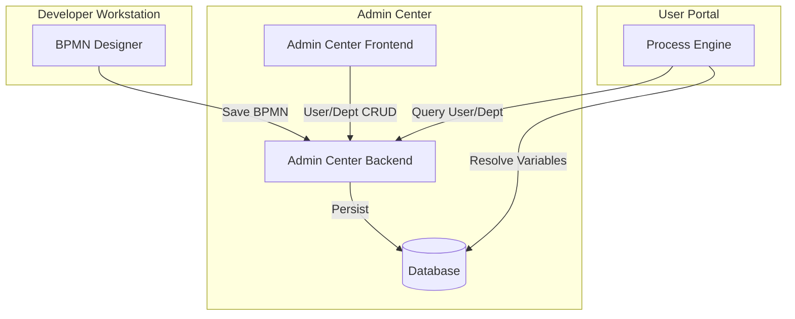

# Design Document: Manager Assignment

## Overview

本设计实现用户的多维度管理者分配功能，包括实体管理者、职能管理者，以及部门双经理支持。该功能涉及三个平台的修改：Admin Center（后端和前端）、Developer Workstation（BPMN 设计器）和 User Portal（流程引擎）。

## Architecture



### 数据流

1. 管理员在 Admin Center 设置用户的 entityManagerId 和 functionManagerId
2. 管理员在 Admin Center 设置部门的 managerId 和 secondaryManagerId
3. 流程设计者在 Developer Workstation 选择任务分配类型（四种管理者选项）
4. 用户发起流程时，User Portal 的 Process Engine 解析管理者变量并分配任务

## Components and Interfaces

### 1. Database Schema Changes

#### admin_users 表新增字段

| Column | Type | Nullable | Description |
|--------|------|----------|-------------|
| entity_manager_id | VARCHAR(64) | YES | 实体管理者ID |
| function_manager_id | VARCHAR(64) | YES | 职能管理者ID |

#### admin_departments 表新增字段

| Column | Type | Nullable | Description |
|--------|------|----------|-------------|
| secondary_manager_id | VARCHAR(64) | YES | 副经理ID |

### 2. Backend Admin Center

#### User Entity 更新

```java
@Entity
@Table(name = "admin_users")
public class User {
    // ... existing fields ...
    
    @Column(name = "entity_manager_id", length = 64)
    private String entityManagerId;
    
    @Column(name = "function_manager_id", length = 64)
    private String functionManagerId;
}
```

#### Department Entity 更新

```java
@Entity
@Table(name = "admin_departments")
public class Department {
    // ... existing fields ...
    
    @Column(name = "secondary_manager_id", length = 64)
    private String secondaryManagerId;
}
```

#### UserDetailInfo DTO 更新

```java
public class UserDetailInfo {
    // ... existing fields ...
    
    private String entityManagerId;
    private String entityManagerName;
    private String functionManagerId;
    private String functionManagerName;
}
```

#### DepartmentInfo DTO 更新

```java
public class DepartmentInfo {
    // ... existing fields ...
    
    private String secondaryManagerId;
    private String secondaryManagerName;
}
```

#### API Endpoints

现有 API 无需新增，只需更新请求/响应 DTO：

- `PUT /api/v1/admin/users/{id}` - 更新用户（包含 entityManagerId, functionManagerId）
- `GET /api/v1/admin/users/{id}` - 获取用户详情（返回管理者名称）
- `PUT /api/v1/admin/departments/{id}` - 更新部门（包含 secondaryManagerId）
- `GET /api/v1/admin/departments/{id}` - 获取部门详情（返回副经理名称）

### 3. Frontend Admin Center

#### 用户编辑表单

新增两个用户选择器组件：
- 实体管理者选择器
- 职能管理者选择器

#### 部门编辑表单

新增一个用户选择器组件：
- 副经理选择器

### 4. Developer Workstation - BPMN Designer

#### UserTaskProperties.vue 更新

更新分配方式选项：

```typescript
const assigneeTypeOptions = [
  { label: '流程发起人', value: 'initiator' },
  { label: '实体管理者', value: 'entityManager' },
  { label: '职能管理者', value: 'functionManager' },
  { label: '实体+职能管理者（会签）', value: 'bothManagers' },
  { label: '部门主经理', value: 'departmentManager' },
  { label: '部门副经理', value: 'departmentSecondaryManager' },
  { label: '指定用户', value: 'user' },
  { label: '指定部门/组', value: 'group' },
  { label: '表达式', value: 'expression' }
]
```

#### 变量映射

| 分配类型 | BPMN 属性 | 表达式 |
|---------|----------|--------|
| entityManager | assignee | ${entityManager} |
| functionManager | assignee | ${functionManager} |
| bothManagers | candidateUsers | ${entityManager},${functionManager} |
| departmentManager | assignee | ${departmentManager} |
| departmentSecondaryManager | assignee | ${departmentSecondaryManager} |

### 5. User Portal - Process Engine

#### ProcessComponent.java 更新

扩展 `resolveProcessVariable` 方法支持新变量：

```java
private String resolveProcessVariable(String varName, Map<String, Object> formData, String initiatorId) {
    // 首先检查表单数据
    if (formData != null && formData.containsKey(varName)) {
        return String.valueOf(formData.get(varName));
    }
    
    // 处理特殊变量
    switch (varName) {
        case "initiator":
            return initiatorId;
        case "entityManager":
            return getEntityManager(initiatorId);
        case "functionManager":
            return getFunctionManager(initiatorId);
        case "departmentManager":
        case "initiatorManager":
            return getDepartmentManager(initiatorId);
        case "departmentSecondaryManager":
            return getDepartmentSecondaryManager(initiatorId);
        default:
            return null;
    }
}

/**
 * 解析候选用户表达式（支持多个变量，如 ${entityManager},${functionManager}）
 */
private List<String> resolveCandidateUsers(String candidateUsersExpr, Map<String, Object> formData, String initiatorId) {
    List<String> users = new ArrayList<>();
    String[] parts = candidateUsersExpr.split(",");
    for (String part : parts) {
        part = part.trim();
        if (part.startsWith("${") && part.endsWith("}")) {
            String varName = part.substring(2, part.length() - 1);
            String resolved = resolveProcessVariable(varName, formData, initiatorId);
            if (resolved != null && !resolved.isEmpty()) {
                users.add(resolved);
            }
        } else {
            users.add(part);
        }
    }
    return users;
}
```

#### 新增方法

```java
private String getEntityManager(String userId) {
    // 调用 Admin Center API 获取用户的 entityManagerId
}

private String getFunctionManager(String userId) {
    // 调用 Admin Center API 获取用户的 functionManagerId
}

private String getDepartmentSecondaryManager(String userId) {
    // 1. 获取用户的 departmentId
    // 2. 获取部门的 secondaryManagerId
}
```

## Data Models

### User Entity (Updated)

```
User {
    id: String (PK)
    username: String
    email: String
    fullName: String
    departmentId: String (FK -> Department)
    entityManagerId: String (FK -> User, nullable)
    functionManagerId: String (FK -> User, nullable)
    // ... other fields
}
```

### Department Entity (Updated)

```
Department {
    id: String (PK)
    name: String
    code: String
    parentId: String (FK -> Department)
    managerId: String (FK -> User, nullable)
    secondaryManagerId: String (FK -> User, nullable)
    // ... other fields
}
```

## Correctness Properties

*A property is a characteristic or behavior that should hold true across all valid executions of a system-essentially, a formal statement about what the system should do. Properties serve as the bridge between human-readable specifications and machine-verifiable correctness guarantees.*

### Property 1: User Manager Fields Persistence

*For any* User entity with valid entityManagerId and functionManagerId values, saving and then retrieving the user SHALL return the same manager IDs.

**Validates: Requirements 1.1, 1.2, 1.3**

### Property 2: User Manager Reference Validation

*For any* User update request with entityManagerId or functionManagerId set to a non-existent user ID, the Admin_Center SHALL reject the request with a validation error.

**Validates: Requirements 1.4**

### Property 3: Department Secondary Manager Persistence

*For any* Department entity with a valid secondaryManagerId value, saving and then retrieving the department SHALL return the same secondary manager ID.

**Validates: Requirements 2.1, 2.2, 2.3**

### Property 4: Manager Variable Resolution

*For any* process with a manager variable assignee (${entityManager}, ${functionManager}, ${departmentManager}, ${departmentSecondaryManager}), the Process_Engine SHALL resolve it to the corresponding manager ID from the initiator's user or department record.

**Validates: Requirements 6.1, 6.2, 6.3, 6.4**

### Property 5: Both Managers Candidate Resolution

*For any* process with candidateUsers containing ${entityManager},${functionManager}, the Process_Engine SHALL resolve both variables and include all non-null managers as candidate users.

**Validates: Requirements 6.5**

### Property 6: Null Manager Handling

*For any* process where the resolved manager is null (manager not set), the Process_Engine SHALL exclude that manager from candidate users or leave the task assignee as null (unassigned).

**Validates: Requirements 6.6**

## Error Handling

| Scenario | Error Response | HTTP Status |
|----------|---------------|-------------|
| entityManagerId references non-existent user | "实体管理者不存在" | 400 |
| functionManagerId references non-existent user | "职能管理者不存在" | 400 |
| secondaryManagerId references non-existent user | "副经理不存在" | 400 |
| Manager variable cannot be resolved | Log warning, leave unassigned | N/A (runtime) |

## Testing Strategy

### Unit Tests

1. **User Entity Tests**
   - Test entityManagerId and functionManagerId field persistence
   - Test null values are accepted

2. **Department Entity Tests**
   - Test secondaryManagerId field persistence
   - Test null values are accepted

3. **ProcessComponent Tests**
   - Test resolveProcessVariable for each manager type
   - Test null manager handling

### Property-Based Tests

使用 jqwik 框架进行属性测试：

1. **User Manager Persistence Property**
   - 生成随机用户和管理者 ID
   - 验证保存后读取一致性

2. **Manager Variable Resolution Property**
   - 生成随机用户配置
   - 验证变量解析正确性

### Integration Tests

1. **End-to-End Flow**
   - 创建用户并设置管理者
   - 创建部门并设置双经理
   - 发起流程验证任务分配

### Test Configuration

- Property tests: minimum 100 iterations
- Test tag format: **Feature: manager-assignment, Property {number}: {property_text}**
