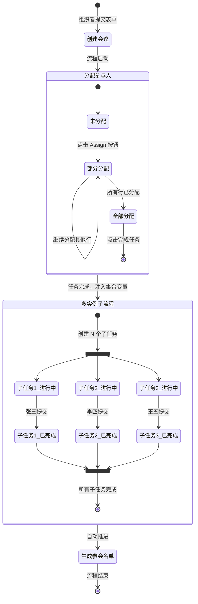
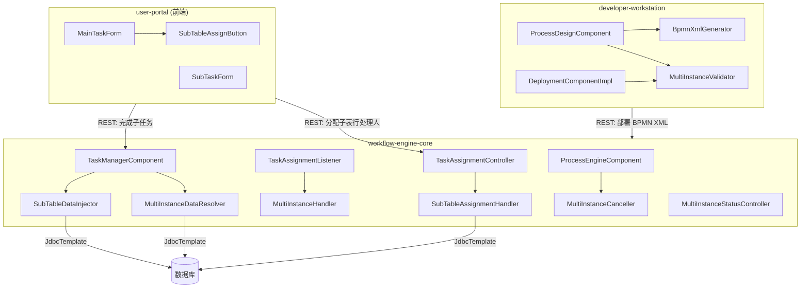
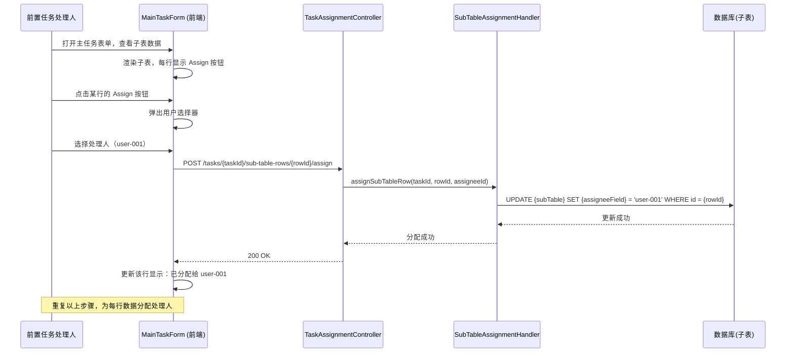
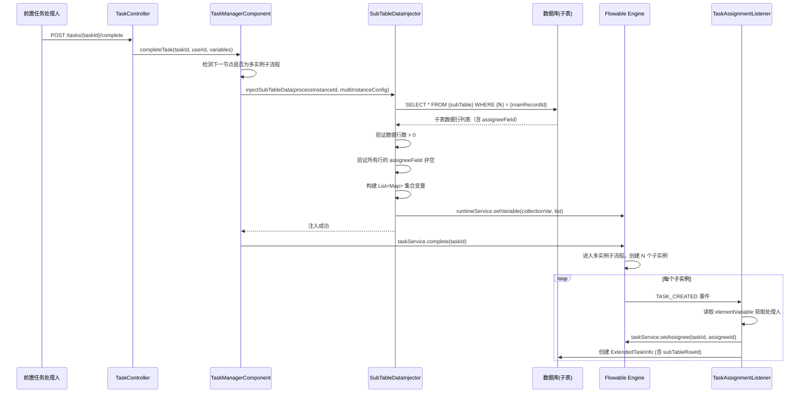
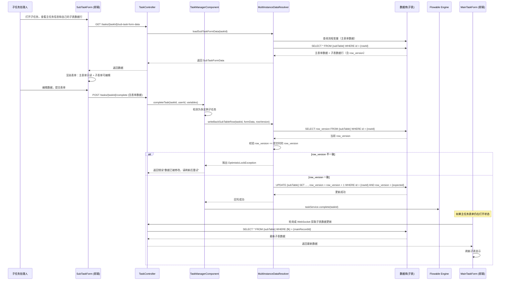
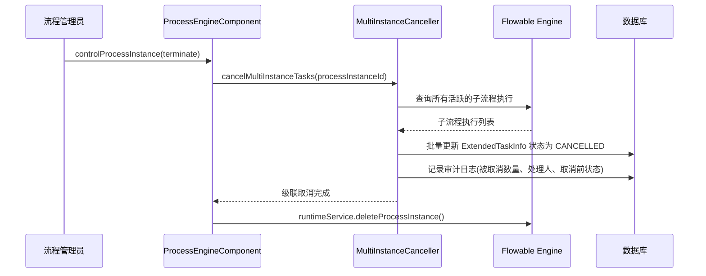
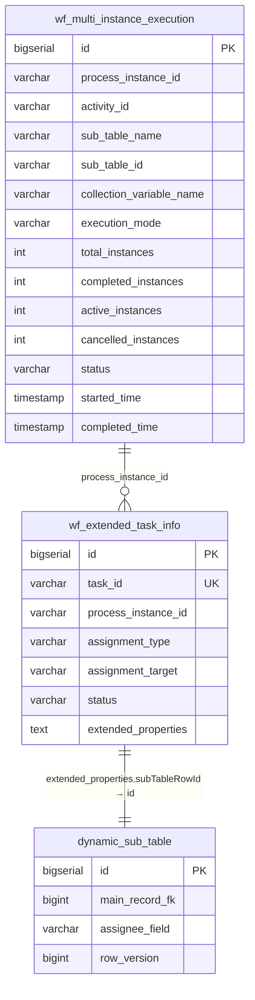

# 技术设计文档：BPMN 多实例子流程动态任务分发

## 概述

本设计实现 BPMN 2.0 多实例子流程（Multi-Instance Sub-Process）模式，支持基于子表数据的动态任务分发。核心流程为：

1. 前置任务处理人在主任务表单中查看子表数据，通过每行的 Assign 按钮手动分配处理人
2. 前置任务完成时，从子表查询数据行（含已分配的处理人）并注入为流程变量（Collection Variable）
3. Flowable 引擎根据集合变量长度自动创建对应数量的并行/顺序子流程实例
4. 每个子实例中的用户任务通过 Element Variable 获取处理人信息并自动分配
5. 子任务处理人在待办列表中打开任务，仅能访问和编辑自己关联的子表数据行
6. 子任务完成后，数据回写到子表，并同步更新主任务表单中的子表显示
7. 所有子任务完成后（或满足完成条件），流程自动推进

涉及三个微服务的修改：
- **developer-workstation**：BPMN XML 生成、多实例节点配置验证、部署验证
- **workflow-engine-core**：子表数据注入、任务分配扩展、数据隔离与回写、状态监控、取消/撤回级联处理
- **user-portal**（前端）：子表行级 Assign 按钮、子任务表单、主任务表单子表数据实时同步

## 用户交互流程

### 完整用户场景：会议参与人信息收集

#### 角色
- **会议组织者（流程发起人）**：负责创建会议并分配参与人
- **参与人（子任务处理人）**：负责填写自己的参会信息

#### 步骤 1：会议组织者创建会议并添加参与人

1. 会议组织者打开"创建会议"表单
2. 填写主表单信息：
   - 会议主题："2026 Q2 产品规划会议"
   - 会议时间："2026-04-15 14:00"
   - 会议地点："3 楼会议室"
3. 在子表"参与人列表"中添加多行数据：
   ```
   | 姓名 | 部门     | 邮箱              | 处理人 |
   |------|----------|-------------------|--------|
   | 张三 | 技术部   | zhang@example.com | 未分配 |
   | 李四 | 市场部   | li@example.com    | 未分配 |
   | 王五 | 财务部   | wang@example.com  | 未分配 |
   ```
4. 提交表单，流程进入"分配参与人"节点

#### 步骤 2：会议组织者分配每个参与人的处理人

1. 会议组织者在待办列表中看到任务："分配参与人 - 2026 Q2 产品规划会议"
2. 打开任务，看到子表数据，每行有一个"分配"按钮
3. 点击第一行（张三）的"分配"按钮：
   - 弹出用户选择器
   - 搜索并选择用户"张三（user-001）"
   - 确认分配
   - 该行显示更新为："已分配给 张三"
4. 重复步骤 3，为李四和王五分配处理人
5. 确认所有行都已分配后，点击"完成任务"按钮
6. 系统验证所有子表行的处理人字段非空，允许任务完成
7. 流程自动进入"多实例子流程：填写参会信息"节点

#### 步骤 3：系统自动创建子任务并分配

1. 系统从子表查询 3 行数据（含已分配的处理人）
2. 注入为流程变量：
   ```json
   [
     { "rowId": 101, "assigneeId": "user-001", "rowVersion": 1 },
     { "rowId": 102, "assigneeId": "user-002", "rowVersion": 1 },
     { "rowId": 103, "assigneeId": "user-003", "rowVersion": 1 }
   ]
   ```
3. Flowable 引擎创建 3 个并行子任务：
   - 子任务 1：分配给 user-001（张三）
   - 子任务 2：分配给 user-002（李四）
   - 子任务 3：分配给 user-003（王五）

#### 步骤 4：参与人填写自己的参会信息

**张三的视角：**
1. 张三登录系统，在待办列表中看到："填写参会信息 - 2026 Q2 产品规划会议"
2. 点击打开任务，看到表单分为两部分：
   
   **会议信息（只读，灰色背景）：**
   ```
   会议主题：2026 Q2 产品规划会议
   会议时间：2026-04-15 14:00
   会议地点：3 楼会议室
   组织者：张经理
   ```
   
   **您的参会信息（可编辑）：**
   ```
   姓名：张三（只读）
   部门：技术部（只读）
   邮箱：zhang@example.com（只读）
   是否参会：[是/否] ← 可选择
   饮食偏好：[无/素食/清真] ← 可选择
   备注：[文本框] ← 可输入
   ```

3. 填写表单：
   - 是否参会：是
   - 饮食偏好：无
   - 备注：需要投影仪
4. 点击"提交"按钮
5. 系统将数据回写到子表第 1 行（rowId=101），row_version 递增为 2
6. 子任务 1 完成

**李四和王五重复相同流程，都能看到完整的会议信息作为上下文**

#### 步骤 5：主任务表单实时同步

1. 如果会议组织者仍在查看"分配参与人"任务的表单（虽然任务已完成）
2. 前端通过轮询或 WebSocket 实时刷新子表数据
3. 子表显示更新：
   ```
   | 姓名 | 部门   | 处理人 | 状态     |
   |------|--------|--------|----------|
   | 张三 | 技术部 | 张三   | 已完成   |
   | 李四 | 市场部 | 李四   | 进行中   |
   | 王五 | 财务部 | 王五   | 进行中   |
   ```

#### 步骤 6：所有子任务完成，流程自动推进

1. 当张三、李四、王五都完成各自的子任务后
2. 多实例子流程自动完成
3. 流程进入下一个节点："生成参会名单"

### 关键用户体验特点

1. **手动分配控制**：会议组织者完全控制每个参与人的处理人分配，而不是依赖子表中预填的字段
2. **完整上下文展示**：子任务处理人可以看到主任务的完整表单信息（只读），了解任务的完整背景
3. **数据隔离**：每个参与人只能编辑自己的数据行，但可以查看主任务信息，保证数据隐私的同时提供足够的上下文
4. **实时同步**：主任务表单可以实时看到子任务的完成进度
5. **灵活重新分配**：在任务完成前，会议组织者可以随时重新分配处理人
6. **乐观锁保护**：防止并发编辑冲突

### 用户操作流程图

```mermaid
sequenceDiagram
    actor Organizer as 会议组织者
    actor User1 as 参与人-张三
    actor User2 as 参与人-李四
    actor User3 as 参与人-王五
    participant UI as 前端界面
    participant Backend as 后端系统
    participant DB as 数据库
    participant Engine as Flowable引擎

    Note over Organizer,Engine: 阶段 1：创建会议并添加参与人
    Organizer->>UI: 打开"创建会议"表单
    Organizer->>UI: 填写会议信息（主题、时间、地点）
    Organizer->>UI: 在子表中添加 3 行参与人数据
    Note over UI: 张三、李四、王五<br/>处理人字段：未分配
    Organizer->>UI: 提交表单
    UI->>Backend: POST /process-instances (启动流程)
    Backend->>DB: 保存主表和子表数据
    Backend->>Engine: 启动流程实例
    Engine-->>Backend: 创建任务："分配参与人"
    Backend-->>UI: 流程启动成功
    UI-->>Organizer: 显示成功消息

    Note over Organizer,Engine: 阶段 2：手动分配每个参与人的处理人
    Organizer->>UI: 打开待办任务："分配参与人"
    UI->>Backend: GET /tasks/{taskId}
    Backend->>DB: 查询任务和子表数据
    Backend-->>UI: 返回任务表单（含子表 3 行）
    UI-->>Organizer: 显示表单，每行有"分配"按钮

    Organizer->>UI: 点击第 1 行"分配"按钮
    UI-->>Organizer: 弹出用户选择器
    Organizer->>UI: 选择"张三 (user-001)"
    UI->>Backend: POST /tasks/{taskId}/sub-table-rows/101/assign
    Backend->>DB: UPDATE 子表 SET assignee='user-001' WHERE id=101
    DB-->>Backend: 更新成功
    Backend-->>UI: 返回分配结果
    UI-->>Organizer: 第 1 行显示"已分配给 张三"

    Organizer->>UI: 点击第 2 行"分配"按钮
    Organizer->>UI: 选择"李四 (user-002)"
    UI->>Backend: POST /tasks/{taskId}/sub-table-rows/102/assign
    Backend->>DB: UPDATE 子表 SET assignee='user-002' WHERE id=102
    Backend-->>UI: 返回分配结果
    UI-->>Organizer: 第 2 行显示"已分配给 李四"

    Organizer->>UI: 点击第 3 行"分配"按钮
    Organizer->>UI: 选择"王五 (user-003)"
    UI->>Backend: POST /tasks/{taskId}/sub-table-rows/103/assign
    Backend->>DB: UPDATE 子表 SET assignee='user-003' WHERE id=103
    Backend-->>UI: 返回分配结果
    UI-->>Organizer: 第 3 行显示"已分配给 王五"

    Organizer->>UI: 点击"完成任务"按钮
    UI->>Backend: POST /tasks/{taskId}/complete
    Backend->>DB: 验证所有子表行 assignee 非空
    Backend->>Backend: SubTableDataInjector 注入集合变量
    Backend->>Engine: taskService.complete(taskId)
    Engine->>Engine: 进入多实例子流程
    Engine->>Engine: 创建 3 个并行子任务
    Engine-->>Backend: 子任务 1 (user-001)
    Engine-->>Backend: 子任务 2 (user-002)
    Engine-->>Backend: 子任务 3 (user-003)
    Backend->>DB: 创建 3 条 ExtendedTaskInfo
    Backend-->>UI: 任务完成成功
    UI-->>Organizer: 显示成功消息

    Note over Organizer,Engine: 阶段 3：参与人填写各自的信息（并行）

    par 张三填写信息
        User1->>UI: 打开待办任务："填写参会信息"
        UI->>Backend: GET /tasks/{task1Id}/sub-task-form-data
        Backend->>DB: 查询流程变量（主表单数据）
        Backend->>DB: SELECT * FROM 子表 WHERE id=101
        Backend-->>UI: 返回主表单数据+张三的子表数据行
        UI-->>User1: 显示表单（主表单只读+张三的数据可编辑）
        Note over User1,UI: 张三看到完整会议信息<br/>（主题、时间、地点等）
        User1->>UI: 填写：是否参会=是，饮食偏好=无
        User1->>UI: 点击"提交"
        UI->>Backend: POST /tasks/{task1Id}/complete
        Backend->>DB: UPDATE 子表 WHERE id=101 (乐观锁)
        Backend->>Engine: taskService.complete(task1Id)
        Engine-->>Backend: 子任务 1 完成
        Backend-->>UI: 提交成功
        UI-->>User1: 显示成功消息
    and 李四填写信息
        User2->>UI: 打开待办任务："填写参会信息"
        UI->>Backend: GET /tasks/{task2Id}/sub-task-form-data
        Backend->>DB: 查询流程变量（主表单数据）
        Backend->>DB: SELECT * FROM 子表 WHERE id=102
        Backend-->>UI: 返回主表单数据+李四的子表数据行
        UI-->>User2: 显示表单（主表单只读+李四的数据可编辑）
        Note over User2,UI: 李四看到完整会议信息<br/>（主题、时间、地点等）
        User2->>UI: 填写：是否参会=是，饮食偏好=素食
        User2->>UI: 点击"提交"
        UI->>Backend: POST /tasks/{task2Id}/complete
        Backend->>DB: UPDATE 子表 WHERE id=102 (乐观锁)
        Backend->>Engine: taskService.complete(task2Id)
        Engine-->>Backend: 子任务 2 完成
        Backend-->>UI: 提交成功
        UI-->>User2: 显示成功消息
    and 王五填写信息
        User3->>UI: 打开待办任务："填写参会信息"
        UI->>Backend: GET /tasks/{task3Id}/sub-task-form-data
        Backend->>DB: 查询流程变量（主表单数据）
        Backend->>DB: SELECT * FROM 子表 WHERE id=103
        Backend-->>UI: 返回主表单数据+王五的子表数据行
        UI-->>User3: 显示表单（主表单只读+王五的数据可编辑）
        Note over User3,UI: 王五看到完整会议信息<br/>（主题、时间、地点等）
        User3->>UI: 填写：是否参会=否
        User3->>UI: 点击"提交"
        UI->>Backend: POST /tasks/{task3Id}/complete
        Backend->>DB: UPDATE 子表 WHERE id=103 (乐观锁)
        Backend->>Engine: taskService.complete(task3Id)
        Engine-->>Backend: 子任务 3 完成
        Backend-->>UI: 提交成功
        UI-->>User3: 显示成功消息
    end

    Note over Organizer,Engine: 阶段 4：所有子任务完成，流程自动推进
    Engine->>Engine: 检测所有子任务已完成
    Engine->>Engine: 多实例子流程完成
    Engine->>Engine: 流程推进到下一节点："生成参会名单"
    Engine-->>Backend: 创建新任务
    Backend-->>Organizer: 通知：新任务已创建
```



### 流程图说明

1. **阶段 1**：会议组织者创建会议，添加参与人基础信息（此时处理人未分配）
2. **阶段 2**：会议组织者在"分配参与人"任务中，逐行点击 Assign 按钮，为每个参与人分配处理人
3. **阶段 3**：系统自动创建 3 个并行子任务，张三、李四、王五各自在待办列表中看到任务并填写信息（并行执行）
4. **阶段 4**：所有子任务完成后，Flowable 引擎自动完成多实例子流程，流程推进到下一节点

### 状态转换图



## 架构

### 系统架构图



### 关键流程时序图

#### 流程 0：前置任务处理人手动分配子表行处理人



#### 流程 1：前置任务完成 → 子表数据注入 → 多实例子任务创建



#### 流程 2：子任务完成 → 数据回写 → 主任务表单同步



#### 流程 3：主流程取消 → 级联取消多实例子任务




## 组件与接口

### 0. user-portal 前端修改

#### 0.1 MainTaskForm 子表 Assign 按钮

在主任务表单的子表组件中，为每行数据增加 Assign 按钮：

```vue
<template>
  <div class="sub-table-container">
    <table>
      <thead>
        <tr>
          <th v-for="field in subTableFields" :key="field.name">{{ field.label }}</th>
          <th>处理人</th>
          <th>操作</th>
        </tr>
      </thead>
      <tbody>
        <tr v-for="row in subTableData" :key="row.id">
          <td v-for="field in subTableFields" :key="field.name">{{ row[field.name] }}</td>
          <td>
            <span v-if="row[assigneeField]">{{ getUserName(row[assigneeField]) }}</span>
            <span v-else class="text-muted">未分配</span>
          </td>
          <td>
            <button 
              @click="openAssignDialog(row)" 
              :disabled="!canAssign"
              class="btn-assign">
              {{ row[assigneeField] ? '重新分配' : '分配' }}
            </button>
          </td>
        </tr>
      </tbody>
    </table>
  </div>
</template>

<script setup>
import { ref } from 'vue';
import { assignSubTableRow } from '@/api/workflow';

const props = defineProps({
  taskId: String,
  subTableData: Array,
  subTableFields: Array,
  assigneeField: String,
  canAssign: Boolean // 当前用户是否有权限分配
});

const emit = defineEmits(['refresh']);

async function openAssignDialog(row) {
  // 打开用户选择器对话框
  const selectedUserId = await showUserPicker();
  if (selectedUserId) {
    await assignSubTableRow(props.taskId, row.id, selectedUserId);
    emit('refresh'); // 刷新子表数据
  }
}
</script>
```

关键设计决策：
- Assign 按钮仅在当前用户是任务处理人时可用（`canAssign` 权限控制）
- 已分配的行显示当前处理人姓名，按钮文本变为"重新分配"
- 点击按钮打开用户选择器，选择后调用后端 API 更新子表 assigneeField

#### 0.2 SubTaskForm 子任务表单

子任务表单显示主任务的只读信息和当前子任务关联的可编辑子表数据行：

```vue
<template>
  <div class="sub-task-form">
    <h3>{{ taskName }}</h3>
    <p class="task-description">请填写您负责的数据行信息</p>
    
    <!-- 主任务表单信息（只读） -->
    <div class="main-form-section">
      <h4>会议信息</h4>
      <div class="readonly-fields">
        <div v-for="field in mainFormFields" :key="field.name" class="form-field readonly">
          <label>{{ field.label }}</label>
          <div class="field-value">{{ mainFormData[field.name] }}</div>
        </div>
      </div>
    </div>
    
    <div class="divider"></div>
    
    <!-- 子任务表单（可编辑） -->
    <div class="sub-form-section">
      <h4>您的参会信息</h4>
      <form @submit.prevent="submitTask">
        <div v-for="field in subFormFields" :key="field.name" class="form-field">
          <label>{{ field.label }}</label>
          <input 
            v-model="formData[field.name]" 
            :type="field.type"
            :required="field.required" />
        </div>
        
        <input type="hidden" v-model="rowVersion" />
        
        <div class="form-actions">
          <button type="submit" class="btn-primary">提交</button>
          <button type="button" @click="cancel" class="btn-secondary">取消</button>
        </div>
      </form>
    </div>
  </div>
</template>

<script setup>
import { ref, onMounted } from 'vue';
import { getSubTaskFormData, completeTask } from '@/api/workflow';

const props = defineProps({
  taskId: String
});

const mainFormData = ref({}); // 主任务表单数据（只读）
const mainFormFields = ref([]); // 主任务表单字段定义
const formData = ref({}); // 子任务表单数据（可编辑）
const subFormFields = ref([]); // 子任务表单字段定义
const rowVersion = ref(null);

onMounted(async () => {
  // 加载子任务表单数据（包含主任务信息和子表数据行）
  const response = await getSubTaskFormData(props.taskId);
  
  // 主任务数据（只读）
  mainFormData.value = response.mainFormData;
  mainFormFields.value = response.mainFormFields;
  
  // 子任务数据（可编辑）
  formData.value = response.subTableRowData;
  subFormFields.value = response.subFormFields;
  rowVersion.value = response.rowVersion;
});

async function submitTask() {
  await completeTask(props.taskId, {
    formData: formData.value,
    rowVersion: rowVersion.value
  });
  // 跳转到待办列表或显示成功消息
}
</script>

<style scoped>
.main-form-section {
  background-color: #f5f5f5;
  padding: 16px;
  border-radius: 4px;
  margin-bottom: 24px;
}

.readonly-fields .form-field {
  margin-bottom: 12px;
}

.readonly-fields .field-value {
  padding: 8px;
  background-color: #fff;
  border: 1px solid #e0e0e0;
  border-radius: 4px;
  color: #666;
}

.divider {
  height: 1px;
  background-color: #e0e0e0;
  margin: 24px 0;
}

.sub-form-section h4 {
  color: #1976d2;
  margin-bottom: 16px;
}
</style>
```

#### 0.3 主任务表单子表数据实时同步

当子任务完成后，主任务表单需要实时刷新子表数据：

实现方式 1：轮询（简单实现）
```javascript
// 在 MainTaskForm 中
let pollingInterval = null;

onMounted(() => {
  // 每 5 秒轮询一次子表数据
  pollingInterval = setInterval(async () => {
    await refreshSubTableData();
  }, 5000);
});

onUnmounted(() => {
  if (pollingInterval) {
    clearInterval(pollingInterval);
  }
});
```

实现方式 2：WebSocket（推荐）
```javascript
// 在 MainTaskForm 中
import { useWebSocket } from '@/composables/useWebSocket';

const { subscribe, unsubscribe } = useWebSocket();

onMounted(() => {
  // 订阅子表数据更新事件
  subscribe(`/topic/tasks/${props.taskId}/sub-table-updates`, (message) => {
    refreshSubTableData();
  });
});

onUnmounted(() => {
  unsubscribe(`/topic/tasks/${props.taskId}/sub-table-updates`);
});
```

### 1. developer-workstation 侧修改

#### 1.1 BPMN XML 生成 — 多实例子流程 XML 结构

生成的 BPMN XML 中多实例子流程节点结构如下：

```xml
<bpmn:subProcess id="MultiInstance_SubTable_{subTableId}" name="多实例-{子表显示名}">
  <bpmn:multiInstanceLoopCharacteristics isSequential="false">
    <bpmn:extensionElements>
      <flowable:collection>multiInstance_{subTableName}_collection</flowable:collection>
      <flowable:elementVariable>currentItem</flowable:elementVariable>
    </bpmn:extensionElements>
    <!-- 可选：完成条件 -->
    <bpmn:completionCondition xsi:type="bpmn:tFormalExpression">
      ${nrOfCompletedInstances == nrOfInstances}
    </bpmn:completionCondition>
  </bpmn:multiInstanceLoopCharacteristics>

  <!-- 子流程内部：开始事件 → 用户任务 → 结束事件 -->
  <bpmn:startEvent id="MI_Start_{subTableId}" />

  <bpmn:userTask id="MI_UserTask_{subTableId}" name="{任务名称}">
    <bpmn:extensionElements>
      <custom:properties>
        <custom:property name="assigneeType" value="ELEMENT_VARIABLE" />
        <custom:property name="subTableId" value="{subTableId}" />
        <custom:property name="subTableName" value="{subTableName}" />
        <custom:property name="assigneeField" value="{assigneeFieldName}" />
        <custom:property name="rowIdVariable" value="currentItem.rowId" />
        <custom:property name="formId" value="{taskFormId}" />
      </custom:properties>
    </bpmn:extensionElements>
  </bpmn:userTask>

  <bpmn:endEvent id="MI_End_{subTableId}" />

  <bpmn:sequenceFlow id="MI_Flow1_{subTableId}" sourceRef="MI_Start_{subTableId}" targetRef="MI_UserTask_{subTableId}" />
  <bpmn:sequenceFlow id="MI_Flow2_{subTableId}" sourceRef="MI_UserTask_{subTableId}" targetRef="MI_End_{subTableId}" />
</bpmn:subProcess>
```

关键设计决策：
- `flowable:collection` 指向的变量名格式为 `multiInstance_{subTableName}_collection`，由 SubTableDataInjector 在前置任务完成时注入
- `flowable:elementVariable` 固定为 `currentItem`，每个子实例中可通过 `${currentItem.rowId}`、`${currentItem.assigneeId}` 访问
- `assigneeType` 新增 `ELEMENT_VARIABLE` 类型，表示从多实例元素变量中读取处理人
- 子流程内部结构固定为 StartEvent → UserTask → EndEvent 的最简结构

#### 1.2 ProcessDesignComponent 扩展

在 `ProcessDesignComponent.validate()` 方法中增加多实例子流程配置验证：

```java
// 新增验证逻辑（在 ProcessDesignComponentImpl 中）
public interface ProcessDesignComponent {
    // 现有方法不变...
    
    /**
     * 验证多实例子流程配置
     * @param bpmnXml BPMN XML 内容
     * @param functionUnitId 功能单元 ID（用于验证子表归属）
     * @return 验证结果
     */
    ValidationResult validateMultiInstance(String bpmnXml, Long functionUnitId);
}
```

验证规则：
1. `flowable:collection` 变量名格式合法（字母、数字、下划线）
2. 子流程内部至少包含一个 `<bpmn:userTask>`
3. 引用的 `subTableId` 属于当前 FunctionUnit 且 `table_type = SUB`
4. 引用的 `assigneeField` 存在于该子表的 FieldDefinition 列表中
5. 如果配置了 `formId`，验证该 FormDefinition 属于当前 FunctionUnit

#### 1.3 DeploymentComponentImpl 扩展

在 `executeDeployment()` 的 Step 1（导出前）增加多实例配置验证步骤：

```java
// 在 executeDeployment 中，Step 0 之后、Step 1 之前
updateStep(steps, "验证多实例配置", "RUNNING", null);
ProcessDefinition pd = processDesignComponent.getByFunctionUnitId(functionUnitId);
if (pd != null) {
    ValidationResult miResult = processDesignComponent.validateMultiInstance(
        pd.getBpmnXml(), functionUnitId);
    if (!miResult.isValid()) {
        throw new BusinessException("MULTI_INSTANCE_VALIDATION_FAILED", miResult.getErrors().toString());
    }
}
updateStep(steps, "验证多实例配置", "SUCCESS", "多实例配置验证通过");
```

### 2. workflow-engine-core 侧修改

#### 2.0 TaskAssignmentController 扩展（新增子表行分配接口）

```java
@RestController
@RequestMapping("/api/workflow/tasks")
public class TaskAssignmentController {
    
    @Autowired
    private SubTableAssignmentHandler subTableAssignmentHandler;
    
    /**
     * 分配子表行处理人
     * POST /api/workflow/tasks/{taskId}/sub-table-rows/{rowId}/assign
     * 
     * @param taskId 主任务 ID
     * @param rowId 子表行 ID
     * @param request 包含 assigneeId
     * @return 分配结果
     */
    @PostMapping("/{taskId}/sub-table-rows/{rowId}/assign")
    public ResponseEntity<AssignmentResponse> assignSubTableRow(
        @PathVariable String taskId,
        @PathVariable Long rowId,
        @RequestBody AssignSubTableRowRequest request) {
        
        // 验证当前用户是否为任务处理人
        // 调用 SubTableAssignmentHandler 更新子表 assigneeField
        return ResponseEntity.ok(subTableAssignmentHandler.assign(taskId, rowId, request.getAssigneeId()));
    }
}
```

请求体：
```json
{
  "assigneeId": "user-001"
}
```

响应：
```json
{
  "success": true,
  "rowId": 101,
  "assigneeId": "user-001",
  "assigneeName": "张三"
}
```

#### 2.0.1 SubTableAssignmentHandler（新增组件）

```java
@Component
public class SubTableAssignmentHandler {
    
    @Autowired
    private TaskService taskService;
    
    @Autowired
    private JdbcTemplate jdbcTemplate;
    
    @Autowired
    private ExtendedTaskInfoRepository extendedTaskInfoRepository;
    
    /**
     * 分配子表行处理人
     * @param taskId 主任务 ID
     * @param rowId 子表行 ID
     * @param assigneeId 处理人用户 ID
     * @return 分配结果
     * @throws WorkflowValidationException 验证失败时
     */
    public AssignmentResponse assign(String taskId, Long rowId, String assigneeId) {
        // 1. 验证任务存在且当前用户有权限
        Task task = taskService.createTaskQuery().taskId(taskId).singleResult();
        if (task == null) {
            throw new WorkflowValidationException("任务不存在");
        }
        
        // 2. 从任务扩展属性或流程定义中获取子表配置
        ExtendedTaskInfo extInfo = extendedTaskInfoRepository.findByTaskId(taskId);
        String subTableName = getSubTableNameFromTask(task);
        String assigneeField = getAssigneeFieldFromTask(task);
        
        // 3. 验证 rowId 属于当前任务关联的主表记录
        Long mainRecordId = getMainRecordIdFromTask(task);
        boolean rowBelongsToMainRecord = verifyRowBelongsToMainRecord(
            subTableName, rowId, mainRecordId);
        if (!rowBelongsToMainRecord) {
            throw new WorkflowValidationException("子表行不属于当前任务");
        }
        
        // 4. 验证 assigneeId 对应的用户存在且未禁用
        // (调用 UserService 验证)
        
        // 5. 更新子表 assigneeField
        String sql = String.format(
            "UPDATE %s SET %s = ? WHERE id = ?",
            subTableName, assigneeField);
        int updated = jdbcTemplate.update(sql, assigneeId, rowId);
        
        if (updated == 0) {
            throw new WorkflowValidationException("子表行不存在或已被删除");
        }
        
        // 6. 返回分配结果
        return AssignmentResponse.builder()
            .success(true)
            .rowId(rowId)
            .assigneeId(assigneeId)
            .assigneeName(getUserName(assigneeId))
            .build();
    }
}
```

#### 2.1 SubTableDataInjector（新增组件）

负责在前置任务完成时查询子表数据并注入为流程变量。

```java
@Component
public class SubTableDataInjector {
    
    /**
     * 从子表查询数据并注入为流程变量
     * @param processInstanceId 流程实例 ID
     * @param subTableName 子表物理表名
     * @param foreignKeyField 外键字段名
     * @param mainRecordId 主表记录 ID
     * @param assigneeField 处理人字段名
     * @param collectionVariableName 集合变量名
     * @throws WorkflowValidationException 数据为空或处理人缺失时
     */
    public void injectSubTableData(String processInstanceId, String subTableName,
                                    String foreignKeyField, Long mainRecordId,
                                    String assigneeField, String collectionVariableName);
}
```

注入的集合变量结构（每个元素为 Map）：
```json
[
  { "rowId": 101, "assigneeId": "user-001", "rowVersion": 1 },
  { "rowId": 102, "assigneeId": "user-002", "rowVersion": 1 },
  { "rowId": 103, "assigneeId": "user-003", "rowVersion": 2 }
]
```

#### 2.2 TaskAssignmentListener 扩展

在 `handleTaskCreated()` 中增加对 `ELEMENT_VARIABLE` 分配类型的处理：

```java
// 在现有 assigneeType 处理逻辑之后增加
if ("ELEMENT_VARIABLE".equals(assigneeType)) {
    // 从流程变量中获取 elementVariable（currentItem）
    Map<String, Object> currentItem = (Map<String, Object>) 
        runtimeService.getVariable(task.getExecutionId(), "currentItem");
    
    if (currentItem != null) {
        String assigneeField = getExtensionProperty(userTask, "assigneeField");
        String assigneeId = String.valueOf(currentItem.get("assigneeId"));
        Long rowId = ((Number) currentItem.get("rowId")).longValue();
        Long rowVersion = ((Number) currentItem.get("rowVersion")).longValue();
        
        // 设置任务处理人
        taskService.setAssignee(taskId, assigneeId);
        
        // 创建 ExtendedTaskInfo
        ExtendedTaskInfo extInfo = ExtendedTaskInfo.builder()
            .taskId(taskId)
            .processInstanceId(processInstanceId)
            .processDefinitionId(processDefinitionId)
            .taskDefinitionKey(taskDefinitionKey)
            .taskName(task.getName())
            .assignmentType(AssignmentType.USER)
            .assignmentTarget(assigneeId)
            .status("ASSIGNED")
            .createdTime(LocalDateTime.now())
            .extendedProperties(buildExtendedProperties(rowId, rowVersion, subTableId, subTableName))
            .build();
        extendedTaskInfoRepository.save(extInfo);
    }
}
```

`extendedProperties` JSON 结构：
```json
{
  "multiInstance": true,
  "subTableRowId": 101,
  "subTableRowVersion": 1,
  "subTableId": "45",
  "subTableName": "fu_participants"
}
```

#### 2.3 MultiInstanceDataResolver（新增组件）

负责子任务的数据加载和回写，实现数据隔离和乐观锁。

```java
@Component
public class MultiInstanceDataResolver {
    
    @Autowired
    private RuntimeService runtimeService;
    
    @Autowired
    private JdbcTemplate jdbcTemplate;
    
    @Autowired
    private ExtendedTaskInfoRepository extendedTaskInfoRepository;
    
    /**
     * 加载子任务表单数据（包含主任务表单数据和子表数据行）
     * @param taskId 任务 ID
     * @return 子任务表单完整数据
     */
    public SubTaskFormData loadSubTaskFormData(String taskId) {
        // 1. 获取子任务的 ExtendedTaskInfo
        ExtendedTaskInfo extInfo = extendedTaskInfoRepository.findByTaskId(taskId);
        Map<String, Object> extProps = parseExtendedProperties(extInfo.getExtendedProperties());
        
        Long subTableRowId = (Long) extProps.get("subTableRowId");
        String subTableName = (String) extProps.get("subTableName");
        
        // 2. 获取流程实例 ID，加载主表单数据
        String processInstanceId = extInfo.getProcessInstanceId();
        Map<String, Object> mainFormData = loadMainFormData(processInstanceId);
        
        // 3. 加载子表数据行
        Map<String, Object> subTableRowData = loadSubTableRow(subTableName, subTableRowId);
        
        // 4. 获取表单字段定义
        List<FormField> mainFormFields = getMainFormFields(processInstanceId);
        List<FormField> subFormFields = getSubFormFields(subTableName);
        
        return SubTaskFormData.builder()
            .taskId(taskId)
            .mainFormData(mainFormData)
            .mainFormFields(mainFormFields)
            .subTableRowData(subTableRowData)
            .subFormFields(subFormFields)
            .rowVersion((Long) subTableRowData.get("row_version"))
            .build();
    }
    
    /**
     * 加载主表单数据（从流程变量中获取）
     */
    private Map<String, Object> loadMainFormData(String processInstanceId) {
        // 从流程变量中获取主表单数据
        Map<String, Object> variables = runtimeService.getVariables(processInstanceId);
        
        // 过滤出主表单相关的变量（排除系统变量和集合变量）
        Map<String, Object> mainFormData = new HashMap<>();
        for (Map.Entry<String, Object> entry : variables.entrySet()) {
            String key = entry.getKey();
            if (!key.startsWith("multiInstance_") && 
                !key.equals("currentItem") &&
                !isSystemVariable(key)) {
                mainFormData.put(key, entry.getValue());
            }
        }
        
        return mainFormData;
    }
    
    /**
     * 加载子表数据行
     */
    private Map<String, Object> loadSubTableRow(String subTableName, Long rowId) {
        String sql = String.format("SELECT * FROM %s WHERE id = ?", subTableName);
        return jdbcTemplate.queryForMap(sql, rowId);
    }
    
    /**
     * 回写子任务表单数据到子表（含乐观锁校验）
     * @param taskId 任务 ID
     * @param formData 表单数据
     * @param expectedRowVersion 期望的 row_version
     * @throws OptimisticLockException row_version 不一致时
     * @throws WorkflowValidationException 数据行已删除时
     */
    public void writeBackSubTableRow(String taskId, Map<String, Object> formData, 
                                      Long expectedRowVersion) {
        // 1. 获取子表信息
        ExtendedTaskInfo extInfo = extendedTaskInfoRepository.findByTaskId(taskId);
        Map<String, Object> extProps = parseExtendedProperties(extInfo.getExtendedProperties());
        
        Long subTableRowId = (Long) extProps.get("subTableRowId");
        String subTableName = (String) extProps.get("subTableName");
        
        // 2. 验证 row_version
        String checkSql = String.format(
            "SELECT row_version FROM %s WHERE id = ?", subTableName);
        Long currentRowVersion = jdbcTemplate.queryForObject(checkSql, Long.class, subTableRowId);
        
        if (currentRowVersion == null) {
            throw new WorkflowValidationException("关联的数据行已不存在");
        }
        
        if (!currentRowVersion.equals(expectedRowVersion)) {
            throw new OptimisticLockException("数据已被修改，请刷新后重试");
        }
        
        // 3. 构建 UPDATE SQL（含乐观锁）
        StringBuilder updateSql = new StringBuilder(String.format("UPDATE %s SET ", subTableName));
        List<Object> params = new ArrayList<>();
        
        for (Map.Entry<String, Object> entry : formData.entrySet()) {
            updateSql.append(entry.getKey()).append(" = ?, ");
            params.add(entry.getValue());
        }
        
        updateSql.append("row_version = row_version + 1 ");
        updateSql.append("WHERE id = ? AND row_version = ?");
        params.add(subTableRowId);
        params.add(expectedRowVersion);
        
        // 4. 执行更新
        int updated = jdbcTemplate.update(updateSql.toString(), params.toArray());
        
        if (updated == 0) {
            // 再次检查是否是 row_version 不一致
            Long latestRowVersion = jdbcTemplate.queryForObject(checkSql, Long.class, subTableRowId);
            if (latestRowVersion == null) {
                throw new WorkflowValidationException("关联的数据行已不存在");
            } else {
                throw new OptimisticLockException("数据已被修改，请刷新后重试");
            }
        }
    }
    
    /**
     * 判断是否为系统变量
     */
    private boolean isSystemVariable(String key) {
        // Flowable 系统变量列表
        return key.equals("nrOfInstances") ||
               key.equals("nrOfActiveInstances") ||
               key.equals("nrOfCompletedInstances") ||
               key.equals("loopCounter") ||
               key.startsWith("_");
    }
    
    /**
     * 获取主表单字段定义
     */
    private List<FormField> getMainFormFields(String processInstanceId) {
        // 从流程定义或 FormDefinition 中获取主表单字段定义
        // 实现细节省略
        return new ArrayList<>();
    }
    
    /**
     * 获取子表单字段定义
     */
    private List<FormField> getSubFormFields(String subTableName) {
        // 从 TableDefinition 和 FieldDefinition 中获取子表字段定义
        // 实现细节省略
        return new ArrayList<>();
    }
}
```

**SubTaskFormData 数据结构：**
```java
@Data
@Builder
public class SubTaskFormData {
    private String taskId;
    
    // 主任务表单数据（只读）
    private Map<String, Object> mainFormData;
    private List<FormField> mainFormFields;
    
    // 子任务表单数据（可编辑）
    private Map<String, Object> subTableRowData;
    private List<FormField> subFormFields;
    
    // 乐观锁版本号
    private Long rowVersion;
}
```

#### 2.4 MultiInstanceCanceller（新增组件）

负责主流程取消/撤回时的级联处理。

```java
@Component
public class MultiInstanceCanceller {
    
    /**
     * 取消多实例子流程中所有未完成的子任务
     * @param processInstanceId 主流程实例 ID
     * @return 被取消的子任务数量和详情
     */
    public CancelResult cancelMultiInstanceTasks(String processInstanceId);
}
```

`CancelResult` 包含：被取消数量、各子任务处理人、取消前状态，用于审计日志。

#### 2.5 MultiInstanceStatusController（新增 REST 接口）

```java
@RestController
@RequestMapping("/api/workflow/multi-instance")
public class MultiInstanceStatusController {
    
    /**
     * 查询多实例子流程执行状态
     * GET /api/workflow/multi-instance/{processInstanceId}/status
     */
    @GetMapping("/{processInstanceId}/status")
    public ResponseEntity<MultiInstanceStatusResponse> getStatus(
        @PathVariable String processInstanceId);
}
```

响应结构：
```json
{
  "processInstanceId": "xxx",
  "multiInstanceActivityId": "MultiInstance_SubTable_45",
  "totalInstances": 5,
  "completedInstances": 3,
  "activeInstances": 2,
  "tasks": [
    {
      "taskId": "task-001",
      "assignee": "user-001",
      "status": "COMPLETED",
      "subTableRowId": 101,
      "completedTime": "2026-03-15T10:30:00"
    },
    {
      "taskId": "task-002",
      "assignee": "user-002",
      "status": "ASSIGNED",
      "subTableRowId": 102,
      "completedTime": null
    }
  ]
}
```

#### 2.6 TaskManagerComponent 扩展

在 `completeTask()` 方法中增加多实例相关逻辑：

1. **前置任务完成时**：检测下一节点是否为多实例子流程，如果是则调用 SubTableDataInjector
2. **子任务完成时**：检测当前任务是否为多实例子任务（通过 extendedProperties 中的 `multiInstance` 标记），如果是则调用 MultiInstanceDataResolver 进行数据回写

在 `returnTask()` 方法中增加：
- 如果回退目标在多实例子流程之前，调用 MultiInstanceCanceller 级联取消

#### 2.7 ProcessEngineComponent 扩展

在 `controlProcessInstance()` 的 `terminate` 分支中，在调用 `runtimeService.deleteProcessInstance()` 之前，先调用 `MultiInstanceCanceller.cancelMultiInstanceTasks()` 更新 ExtendedTaskInfo 状态并记录审计日志。


## 数据模型

### 1. 现有表修改

#### 1.1 子表增加 `row_version` 列

所有通过 DataTableManagerComponent 动态创建的子表（table_type = SUB）需要增加 `row_version` 列用于乐观锁：

```sql
-- 在动态创建子表时自动添加 row_version 列
ALTER TABLE {dynamic_sub_table} ADD COLUMN IF NOT EXISTS row_version BIGINT NOT NULL DEFAULT 1;
```

实现方式：修改 DataTableManagerComponent 的建表逻辑，在创建 SUB 类型表时自动添加 `row_version` 列。对于已存在的子表，提供迁移脚本。

#### 1.2 wf_extended_task_info 表

无需新增列。利用现有的 `extended_properties TEXT` 字段存储多实例相关元数据（JSON 格式）：

```json
{
  "multiInstance": true,
  "subTableRowId": 101,
  "subTableRowVersion": 1,
  "subTableId": "45",
  "subTableName": "fu_participants"
}
```

现有字段复用：
- `assignment_type` = `USER`（多实例子任务始终直接分配给具体用户）
- `assignment_target` = 处理人用户 ID
- `status` 支持现有值：CREATED / ASSIGNED / COMPLETED / CANCELLED

### 2. 新增表

#### 2.1 wf_multi_instance_execution（多实例执行记录表）

用于记录多实例子流程的执行元数据，支持状态监控和历史查询。

```sql
CREATE TABLE IF NOT EXISTS wf_multi_instance_execution (
    id BIGSERIAL PRIMARY KEY,
    process_instance_id VARCHAR(64) NOT NULL,
    activity_id VARCHAR(255) NOT NULL,
    activity_name VARCHAR(255),
    sub_table_name VARCHAR(100) NOT NULL,
    sub_table_id VARCHAR(64) NOT NULL,
    collection_variable_name VARCHAR(255) NOT NULL,
    execution_mode VARCHAR(20) NOT NULL DEFAULT 'PARALLEL',
    total_instances INTEGER NOT NULL,
    completed_instances INTEGER NOT NULL DEFAULT 0,
    active_instances INTEGER NOT NULL DEFAULT 0,
    cancelled_instances INTEGER NOT NULL DEFAULT 0,
    status VARCHAR(20) NOT NULL DEFAULT 'ACTIVE',
    started_time TIMESTAMP NOT NULL,
    completed_time TIMESTAMP,
    created_at TIMESTAMP NOT NULL DEFAULT CURRENT_TIMESTAMP,
    updated_at TIMESTAMP DEFAULT CURRENT_TIMESTAMP,
    CONSTRAINT chk_mi_exec_mode CHECK (execution_mode IN ('PARALLEL', 'SEQUENTIAL')),
    CONSTRAINT chk_mi_exec_status CHECK (status IN ('ACTIVE', 'COMPLETED', 'CANCELLED'))
);

CREATE INDEX IF NOT EXISTS idx_mi_exec_process_instance ON wf_multi_instance_execution(process_instance_id);
CREATE INDEX IF NOT EXISTS idx_mi_exec_status ON wf_multi_instance_execution(status);

COMMENT ON TABLE wf_multi_instance_execution IS '多实例子流程执行记录';
```

### 3. 数据模型关系图



### 4. API 接口设计

#### 4.1 多实例执行状态查询

```
GET /api/workflow/multi-instance/{processInstanceId}/status
```

响应：`MultiInstanceStatusResponse`（见组件与接口 2.5 节）

#### 4.2 子任务表单数据加载（含主任务信息）

```
GET /api/workflow/tasks/{taskId}/sub-task-form-data
```

响应：
```json
{
  "taskId": "task-001",
  "mainFormData": {
    "meetingTitle": "2026 Q2 产品规划会议",
    "meetingTime": "2026-04-15T14:00:00",
    "meetingLocation": "3 楼会议室",
    "organizer": "张经理"
  },
  "mainFormFields": [
    { "name": "meetingTitle", "label": "会议主题", "type": "text" },
    { "name": "meetingTime", "label": "会议时间", "type": "datetime" },
    { "name": "meetingLocation", "label": "会议地点", "type": "text" },
    { "name": "organizer", "label": "组织者", "type": "text" }
  ],
  "subTableRowData": {
    "id": 101,
    "name": "张三",
    "department": "技术部",
    "email": "zhang@example.com",
    "willAttend": null,
    "dietaryPreference": null,
    "remarks": null
  },
  "subFormFields": [
    { "name": "name", "label": "姓名", "type": "text", "readonly": true },
    { "name": "department", "label": "部门", "type": "text", "readonly": true },
    { "name": "email", "label": "邮箱", "type": "email", "readonly": true },
    { "name": "willAttend", "label": "是否参会", "type": "select", "required": true },
    { "name": "dietaryPreference", "label": "饮食偏好", "type": "select" },
    { "name": "remarks", "label": "备注", "type": "textarea" }
  ],
  "rowVersion": 1
}
```

#### 4.3 子任务完成（含数据回写）

复用现有接口 `POST /api/workflow/tasks/{taskId}/complete`，在 `variables` 中增加：
```json
{
  "userId": "user-001",
  "variables": {
    "formData": { "name": "张三", "phone": "138xxxx5678" },
    "rowVersion": 1
  }
}
```

TaskManagerComponent 检测到多实例子任务后，自动调用 MultiInstanceDataResolver 进行回写。

#### 4.4 子表行处理人分配

```
POST /api/workflow/tasks/{taskId}/sub-table-rows/{rowId}/assign
```

请求体：
```json
{
  "assigneeId": "user-001"
}
```

响应：
```json
{
  "success": true,
  "rowId": 101,
  "assigneeId": "user-001",
  "assigneeName": "张三"
}
```

#### 4.5 主任务子表数据查询（用于实时同步）

```
GET /api/workflow/tasks/{taskId}/sub-table-data/all
```

响应：
```json
{
  "taskId": "task-001",
  "subTableName": "fu_participants",
  "rows": [
    {
      "id": 101,
      "name": "张三",
      "phone": "138xxxx1234",
      "assignee": "user-001",
      "assigneeName": "张三",
      "status": "COMPLETED"
    },
    {
      "id": 102,
      "name": "李四",
      "phone": "138xxxx5678",
      "assignee": "user-002",
      "assigneeName": "李四",
      "status": "ASSIGNED"
    }
  ]
}
```


## 正确性属性

*属性（Property）是在系统所有合法执行路径中都应成立的特征或行为——本质上是对系统应做什么的形式化陈述。属性是人类可读规格说明与机器可验证正确性保证之间的桥梁。*

### Property 1: BPMN XML 生成结构完整性

*For any* 合法的多实例子流程配置（包含 subTableId、assigneeField、elementVariable），BPMN XML 生成器输出的 XML 必须包含：`<bpmn:subProcess>` 元素、`<bpmn:multiInstanceLoopCharacteristics>` 子元素、`flowable:collection` 属性、`flowable:elementVariable` 属性，以及子流程内部至少一个 `<bpmn:userTask>` 元素（含 assigneeType、subTableId、assigneeField、rowIdVariable 扩展属性）。

**Validates: Requirements 1.1, 1.2, 1.4**

### Property 2: 执行模式映射正确性

*For any* 多实例子流程配置，当 executionMode 为 PARALLEL 时生成的 XML 中 `isSequential="false"`，当 executionMode 为 SEQUENTIAL 时生成的 XML 中 `isSequential="true"`。

**Validates: Requirements 1.3**

### Property 3: 完成条件条件性生成

*For any* 多实例子流程配置，当且仅当配置了 completionCondition 表达式时，生成的 XML 中 `<bpmn:multiInstanceLoopCharacteristics>` 内才包含 `<bpmn:completionCondition>` 子元素，且其内容与配置的表达式一致。

**Validates: Requirements 1.5**

### Property 4: 多实例配置验证正确性

*For any* subTableId 和 functionUnitId 的组合以及 assigneeField 名称，验证通过当且仅当：该 subTable 属于该 FunctionUnit 且 table_type 为 SUB，且 assigneeField 存在于该子表的 FieldDefinition 列表中。

**Validates: Requirements 2.2, 2.3**

### Property 5: 子表数据注入正确性

*For any* 包含 N 条数据行的子表（N > 0，且所有行的 assigneeField 非空），注入到流程实例的集合变量应包含恰好 N 个元素，每个元素包含正确的 rowId、assigneeId 和 rowVersion，且变量名符合 `multiInstance_{subTableName}_collection` 格式。

**Validates: Requirements 3.1, 3.2, 3.3**

### Property 6: 多实例子任务创建与分配正确性

*For any* 多实例子任务创建事件，TaskAssignmentListener 应将任务分配给 elementVariable 中指定的处理人，并创建 ExtendedTaskInfo 记录（assignment_type=USER，assignment_target=处理人 ID，extended_properties 包含 subTableRowId）。

**Validates: Requirements 4.2, 4.3, 4.4**

### Property 7: 子任务完成状态更新

*For any* 被完成的多实例子任务，对应的 ExtendedTaskInfo 记录状态应更新为 COMPLETED，且 completed_time 和 completed_by 字段被正确设置。

**Validates: Requirements 5.1**

### Property 8: 多实例全部完成触发流程推进

*For any* 包含 N 个子实例的多实例子流程（无自定义完成条件），当且仅当 N 个子任务全部完成时，流程自动推进到下一个节点。

**Validates: Requirements 5.2**

### Property 9: 状态查询一致性

*For any* 正在执行的多实例子流程，状态查询返回的 totalInstances、completedInstances、activeInstances 之和应满足 `completedInstances + activeInstances + cancelledInstances == totalInstances`，且各子任务的状态与 ExtendedTaskInfo 中的记录一致。

**Validates: Requirements 5.4**

### Property 10: 子任务数据隔离

*For any* 多实例子任务，数据加载和编辑操作仅能访问 ExtendedTaskInfo.extended_properties 中 subTableRowId 对应的子表数据行，不能访问其他行。

**Validates: Requirements 6.1, 6.2**

### Property 11: 子表数据回写往返一致性

*For any* 子任务表单数据提交，回写到子表后再次加载该行数据，应与提交的表单数据一致（排除 row_version 字段）。

**Validates: Requirements 6.3**

### Property 12: 乐观锁正确性

*For any* 子表数据行，提交时如果提供的 row_version 与数据库中当前值不一致则更新被拒绝；如果一致则更新成功且 row_version 递增 1。

**Validates: Requirements 6.5, 6.6**

### Property 13: 历史记录保留

*For any* 已完成的多实例子流程，通过 HistoryService 查询应能获取所有子任务的历史执行记录，包括处理人、完成时间和状态。

**Validates: Requirements 7.3**

### Property 14: 部署验证正确性

*For any* 包含多实例子流程的 BPMN XML，部署验证通过当且仅当：collection 变量名格式合法（字母、数字、下划线）且子流程内部至少包含一个 userTask 节点。

**Validates: Requirements 8.1, 8.2**

### Property 15: BPMN XML 往返一致性

*For any* 合法的多实例子流程 BPMN XML，解析为配置对象后再序列化回 BPMN XML，两者应语义等价（包含相同的元素、属性和值）。

**Validates: Requirements 8.4**

### Property 16: 级联取消正确性

*For any* 包含活跃多实例子任务的流程实例，当主流程被终止或撤回到多实例之前的节点时，所有未完成的子任务 ExtendedTaskInfo 记录状态应更新为 CANCELLED。

**Validates: Requirements 9.1, 9.2**

### Property 17: 取消时数据保留

*For any* 被取消的多实例子流程，已提交到子表的数据行不应被回滚或删除，数据内容保持取消前的状态。

**Validates: Requirements 9.3**

### Property 18: 取消审计日志完整性

*For any* 多实例子流程取消操作，审计日志应包含：被取消的子任务数量、各子任务的处理人 ID 和取消前的状态。

**Validates: Requirements 9.4**


## 错误处理

### 1. 前置任务完成阶段（SubTableDataInjector）

| 错误场景 | 错误类型 | 错误信息 | 处理方式 |
|---------|---------|---------|---------|
| 子表数据行数为零 | WorkflowValidationException | "多实例数据源为空，至少需要一条子表数据" | 阻止任务完成，返回 400 |
| 子表数据行中 assigneeField 为空 | WorkflowValidationException | "第 {行号} 行缺少处理人（{assigneeField} 字段为空）" | 阻止任务完成，返回 400 |
| 子表不存在或已被删除 | WorkflowBusinessException | "关联的子表 {subTableName} 不存在" | 阻止任务完成，返回 500 |
| 主表记录不存在 | WorkflowBusinessException | "主表记录 {mainRecordId} 不存在" | 阻止任务完成，返回 500 |

### 2. 子任务创建阶段（TaskAssignmentListener）

| 错误场景 | 错误类型 | 处理方式 |
|---------|---------|---------|
| elementVariable 为 null | 记录 WARN 日志 | 任务状态保持 CREATED，等待手动分配 |
| 处理人 ID 对应用户不存在/已禁用 | 记录 WARN 日志 | 任务状态设为 CREATED，不设置 assignee |
| ExtendedTaskInfo 保存失败 | 记录 ERROR 日志 | 不影响 Flowable 任务创建（isFailOnException=false） |

### 3. 子任务完成阶段（MultiInstanceDataResolver）

| 错误场景 | 错误类型 | 错误信息 | 处理方式 |
|---------|---------|---------|---------|
| 子表数据行已被删除 | WorkflowValidationException | "关联的数据行已不存在" | 阻止任务完成，返回 400 |
| row_version 不一致 | OptimisticLockException | "数据已被修改，请刷新后重试" | 阻止任务完成，返回 409 |
| 数据库写入失败 | WorkflowBusinessException | "数据回写失败: {原因}" | 阻止任务完成，返回 500 |

### 4. 取消/撤回阶段（MultiInstanceCanceller）

| 错误场景 | 处理方式 |
|---------|---------|
| 无活跃的多实例子任务 | 静默跳过，不影响主流程操作 |
| 部分 ExtendedTaskInfo 更新失败 | 记录 ERROR 日志，继续处理其他子任务，最终汇总失败数量 |
| 审计日志写入失败 | 记录 ERROR 日志，不影响取消操作本身 |

## 测试策略

### 测试框架

- **单元测试**：JUnit 5 + Mockito
- **属性测试**：jqwik（项目已使用，见 `.jqwik-database` 文件）
- **集成测试**：Spring Boot Test + Flowable 内嵌引擎

### 属性测试配置

- 每个属性测试最少运行 100 次迭代
- 每个属性测试必须通过注释引用设计文档中的属性编号
- 标签格式：`Feature: multi-instance-task-dispatch, Property {number}: {property_text}`

### 单元测试覆盖

单元测试聚焦于具体示例、边界条件和错误场景：

1. **SubTableDataInjector**
   - 示例：3 行子表数据正确注入为集合变量
   - 边界：子表数据为空时抛出异常（需求 3.4）
   - 边界：assigneeField 为空时抛出异常（需求 3.5）
   - 边界：处理人 ID 无效时的降级处理（需求 4.5）

2. **MultiInstanceDataResolver**
   - 示例：正常数据回写和加载
   - 边界：数据行已删除时抛出异常（需求 6.4）
   - 边界：row_version 不一致时抛出异常（需求 6.5）
   - 边界：并发写入场景

3. **MultiInstanceCanceller**
   - 示例：取消 5 个子任务中的 3 个活跃任务
   - 边界：无活跃子任务时的静默处理
   - 验证：审计日志内容完整性

4. **BPMN XML 验证**
   - 边界：缺少 collection 属性（需求 8.3）
   - 边界：缺少 elementVariable 属性（需求 8.3）
   - 边界：子流程内无 userTask（需求 8.2）

### 属性测试覆盖

属性测试验证跨所有输入的通用属性：

1. **Property 1-3**: BPMN XML 生成 — 随机生成多实例配置，验证输出 XML 结构
2. **Property 4**: 配置验证 — 随机生成 subTableId/functionUnitId/fieldName 组合
3. **Property 5**: 数据注入 — 随机生成子表数据行，验证集合变量结构
4. **Property 6**: 任务分配 — 随机生成 elementVariable 内容，验证 ExtendedTaskInfo
5. **Property 10**: 数据隔离 — 随机生成多个子任务，验证每个只能访问自己的数据行
6. **Property 11**: 数据回写往返 — 随机生成表单数据，写入后读取验证一致性
7. **Property 12**: 乐观锁 — 随机生成 row_version 值，验证匹配/不匹配场景
8. **Property 14**: 部署验证 — 随机生成合法/非法变量名，验证验证结果
9. **Property 15**: BPMN XML 往返 — 随机生成配置，序列化→反序列化→序列化验证等价性
10. **Property 16**: 级联取消 — 随机生成不同数量的活跃/已完成子任务，验证取消结果

### 集成测试

使用 Flowable 内嵌引擎进行端到端流程测试：

1. 部署包含多实例子流程的 BPMN XML
2. 启动流程实例，完成前置任务触发数据注入
3. 验证子任务创建数量和分配
4. 逐个完成子任务，验证数据回写
5. 验证流程自动推进
6. 测试取消和撤回场景
