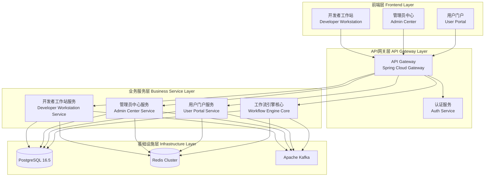
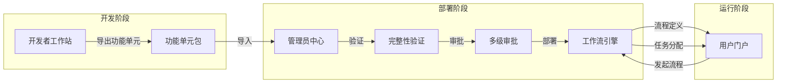

# 平台架构设计文档

## 概述

本设计文档定义了低代码工作流平台的整体技术架构，包括微服务架构、模块集成、统一安全框架、消息通信、缓存策略、监控体系和部署架构。平台采用Spring Boot 3.x + Java 17后端技术栈，Vue 3 + TypeScript前端技术栈，PostgreSQL 16.5主数据库，Redis缓存层，Apache Kafka消息代理。

## 架构

### 整体架构图



### 模块集成架构



## 组件和接口

### 1. API网关组件 (API Gateway)

```java
// API网关配置
@Configuration
public class GatewayConfig {
    
    @Bean
    public RouteLocator customRouteLocator(RouteLocatorBuilder builder) {
        return builder.routes()
            .route("developer-workstation", r -> r
                .path("/api/developer/**")
                .filters(f -> f
                    .stripPrefix(2)
                    .filter(authFilter())
                    .filter(rateLimitFilter()))
                .uri("lb://developer-workstation-service"))
            .route("admin-center", r -> r
                .path("/api/admin/**")
                .filters(f -> f
                    .stripPrefix(2)
                    .filter(authFilter())
                    .filter(rateLimitFilter()))
                .uri("lb://admin-center-service"))
            .route("user-portal", r -> r
                .path("/api/portal/**")
                .filters(f -> f
                    .stripPrefix(2)
                    .filter(authFilter())
                    .filter(rateLimitFilter()))
                .uri("lb://user-portal-service"))
            .route("workflow-engine", r -> r
                .path("/api/workflow/**")
                .filters(f -> f
                    .stripPrefix(2)
                    .filter(authFilter())
                    .filter(rateLimitFilter()))
                .uri("lb://workflow-engine-service"))
            .build();
    }
}
```

### 2. 统一认证组件 (Auth Service)

```java
// JWT令牌服务接口
public interface JwtTokenService {
    
    /**
     * 生成JWT令牌
     * @param userId 用户ID
     * @param roles 用户角色列表
     * @return JWT令牌
     */
    String generateToken(String userId, List<String> roles);
    
    /**
     * 验证JWT令牌
     * @param token JWT令牌
     * @return 令牌是否有效
     */
    boolean validateToken(String token);
    
    /**
     * 从令牌中提取用户信息
     * @param token JWT令牌
     * @return 用户信息
     */
    UserPrincipal extractUserPrincipal(String token);
    
    /**
     * 刷新JWT令牌
     * @param token 原令牌
     * @return 新令牌
     */
    String refreshToken(String token);
}

// 用户主体
public record UserPrincipal(
    String userId,
    String username,
    List<String> roles,
    List<String> permissions,
    String departmentId,
    String language
) {}
```

### 3. 权限控制组件 (Permission Service)

```java
// 权限验证服务接口
public interface PermissionService {
    
    /**
     * 检查用户是否拥有指定权限
     * @param userId 用户ID
     * @param permission 权限标识
     * @return 是否拥有权限
     */
    boolean hasPermission(String userId, String permission);
    
    /**
     * 检查用户是否拥有API访问权限
     * @param userId 用户ID
     * @param apiPath API路径
     * @param method HTTP方法
     * @return 是否拥有权限
     */
    boolean hasApiPermission(String userId, String apiPath, String method);
    
    /**
     * 获取用户的数据权限过滤条件
     * @param userId 用户ID
     * @param resourceType 资源类型
     * @return 数据过滤条件
     */
    DataFilter getDataFilter(String userId, String resourceType);
    
    /**
     * 获取用户的列级权限
     * @param userId 用户ID
     * @param resourceType 资源类型
     * @return 可访问的列列表
     */
    List<String> getAccessibleColumns(String userId, String resourceType);
}

// 数据过滤条件
public record DataFilter(
    String filterExpression,
    Map<String, Object> parameters
) {}
```

### 4. 消息通信组件 (Message Service)

```java
// 事件发布服务接口
public interface EventPublisher {
    
    /**
     * 发布流程状态变更事件
     * @param event 流程事件
     */
    void publishProcessEvent(ProcessEvent event);
    
    /**
     * 发布任务事件
     * @param event 任务事件
     */
    void publishTaskEvent(TaskEvent event);
    
    /**
     * 发布权限变更事件
     * @param event 权限事件
     */
    void publishPermissionEvent(PermissionEvent event);
    
    /**
     * 发布部署事件
     * @param event 部署事件
     */
    void publishDeploymentEvent(DeploymentEvent event);
}

// 流程事件
public record ProcessEvent(
    String eventType,
    String processInstanceId,
    String processDefinitionId,
    String businessKey,
    Map<String, Object> variables,
    LocalDateTime timestamp
) {}

// 任务事件
public record TaskEvent(
    String eventType,
    String taskId,
    String processInstanceId,
    String assignee,
    String candidateGroup,
    LocalDateTime timestamp
) {}
```

### 5. 缓存服务组件 (Cache Service)

```java
// 缓存服务接口
public interface CacheService {
    
    /**
     * 获取缓存值
     * @param key 缓存键
     * @param type 值类型
     * @return 缓存值
     */
    <T> Optional<T> get(String key, Class<T> type);
    
    /**
     * 设置缓存值
     * @param key 缓存键
     * @param value 缓存值
     * @param ttl 过期时间
     */
    void set(String key, Object value, Duration ttl);
    
    /**
     * 删除缓存
     * @param key 缓存键
     */
    void delete(String key);
    
    /**
     * 获取分布式锁
     * @param lockKey 锁键
     * @param timeout 超时时间
     * @return 锁对象
     */
    Optional<DistributedLock> tryLock(String lockKey, Duration timeout);
    
    /**
     * 发布缓存失效通知
     * @param pattern 键模式
     */
    void publishInvalidation(String pattern);
}

// 分布式锁
public interface DistributedLock extends AutoCloseable {
    boolean isLocked();
    void unlock();
}
```

### 6. 功能单元集成组件 (Function Unit Integration)

```java
// 功能单元导出服务
public interface FunctionUnitExportService {
    
    /**
     * 导出功能单元为ZIP包
     * @param functionUnitId 功能单元ID
     * @return ZIP包字节数组
     */
    byte[] exportFunctionUnit(String functionUnitId);
    
    /**
     * 验证功能单元完整性
     * @param functionUnitId 功能单元ID
     * @return 验证结果
     */
    ValidationResult validateFunctionUnit(String functionUnitId);
}

// 功能单元导入服务
public interface FunctionUnitImportService {
    
    /**
     * 导入功能单元包
     * @param packageData ZIP包数据
     * @return 导入结果
     */
    ImportResult importFunctionUnit(byte[] packageData);
    
    /**
     * 验证导入包
     * @param packageData ZIP包数据
     * @return 验证结果
     */
    ValidationResult validatePackage(byte[] packageData);
    
    /**
     * 检查依赖冲突
     * @param packageData ZIP包数据
     * @return 冲突列表
     */
    List<DependencyConflict> checkConflicts(byte[] packageData);
}

// 功能单元部署服务
public interface FunctionUnitDeploymentService {
    
    /**
     * 部署功能单元到指定环境
     * @param functionUnitId 功能单元ID
     * @param environment 目标环境
     * @param strategy 部署策略
     * @return 部署结果
     */
    DeploymentResult deploy(String functionUnitId, Environment environment, DeploymentStrategy strategy);
    
    /**
     * 回滚部署
     * @param deploymentId 部署ID
     * @return 回滚结果
     */
    RollbackResult rollback(String deploymentId);
}
```

## 数据模型

### 1. 统一用户会话模型

```java
// 用户会话
@Entity
@Table(name = "platform_user_session")
public class UserSession {
    @Id
    private String sessionId;
    
    @Column(nullable = false)
    private String userId;
    
    @Column(nullable = false)
    private String token;
    
    @Column(nullable = false)
    private LocalDateTime createdAt;
    
    @Column(nullable = false)
    private LocalDateTime expiresAt;
    
    @Column
    private LocalDateTime lastAccessedAt;
    
    @Column
    private String ipAddress;
    
    @Column
    private String userAgent;
    
    @Column
    private String module; // developer-workstation, admin-center, user-portal
    
    @Column(nullable = false)
    private boolean active;
}
```

### 2. 审计日志模型

```java
// 审计日志
@Entity
@Table(name = "platform_audit_log")
public class AuditLog {
    @Id
    @GeneratedValue(strategy = GenerationType.UUID)
    private String id;
    
    @Column(nullable = false)
    private String userId;
    
    @Column(nullable = false)
    private String username;
    
    @Column(nullable = false)
    private String module;
    
    @Column(nullable = false)
    private String action;
    
    @Column(nullable = false)
    private String resourceType;
    
    @Column
    private String resourceId;
    
    @Column(columnDefinition = "jsonb")
    private String requestData;
    
    @Column(columnDefinition = "jsonb")
    private String responseData;
    
    @Column
    private String ipAddress;
    
    @Column
    private String traceId;
    
    @Column(nullable = false)
    private LocalDateTime timestamp;
    
    @Column
    private Integer statusCode;
    
    @Column
    private Long durationMs;
}
```

### 3. 功能单元包模型

```java
// 功能单元包元数据
public record FunctionUnitPackage(
    String id,
    String name,
    String version,
    String description,
    LocalDateTime createdAt,
    String createdBy,
    List<ProcessDefinitionMeta> processes,
    List<TableDefinitionMeta> tables,
    List<FormDefinitionMeta> forms,
    List<ActionDefinitionMeta> actions,
    List<DependencyMeta> dependencies,
    String checksum
) {}

// 流程定义元数据
public record ProcessDefinitionMeta(
    String id,
    String name,
    String bpmnXml,
    String version
) {}

// 表定义元数据
public record TableDefinitionMeta(
    String id,
    String name,
    String ddl,
    List<FieldMeta> fields
) {}

// 表单定义元数据
public record FormDefinitionMeta(
    String id,
    String name,
    String formJson,
    String boundTable
) {}
```

### 4. 分布式事务模型

```java
// Saga事务记录
@Entity
@Table(name = "platform_saga_transaction")
public class SagaTransaction {
    @Id
    private String sagaId;
    
    @Column(nullable = false)
    private String sagaType;
    
    @Column(nullable = false)
    @Enumerated(EnumType.STRING)
    private SagaStatus status;
    
    @Column(columnDefinition = "jsonb")
    private String payload;
    
    @Column
    private Integer currentStep;
    
    @Column
    private Integer totalSteps;
    
    @Column(columnDefinition = "jsonb")
    private String stepResults;
    
    @Column(nullable = false)
    private LocalDateTime createdAt;
    
    @Column
    private LocalDateTime completedAt;
    
    @Column
    private String errorMessage;
}

public enum SagaStatus {
    STARTED, IN_PROGRESS, COMPLETED, COMPENSATING, COMPENSATED, FAILED
}
```

## 正确性属性

*正确性属性是系统必须满足的形式化规范，用于验证系统行为的正确性。每个属性都是一个普遍量化的陈述，适用于所有有效输入。*

### Property 1: 服务健康检查一致性
*For any* 平台服务实例，调用其健康检查端点应返回包含服务状态、数据库连接状态和依赖服务状态的有效响应。
**Validates: Requirements 1.8**

### Property 2: 功能单元导出导入往返一致性
*For any* 有效的功能单元，导出为ZIP包后再导入，应产生与原功能单元等价的功能单元（包含相同的流程定义、表结构、表单配置和动作定义）。
**Validates: Requirements 2.6, 2.7**

### Property 3: JWT令牌跨模块有效性
*For any* 从任一模块生成的有效JWT令牌，在所有其他模块中验证时应返回相同的用户主体信息。
**Validates: Requirements 3.1, 3.2**

### Property 4: 令牌过期和刷新正确性
*For any* JWT令牌，在配置的过期时间之前应保持有效，过期后应被拒绝，刷新操作应生成新的有效令牌。
**Validates: Requirements 3.3**

### Property 5: 权限执行一致性
*For any* API请求，如果请求用户没有对应的API权限，请求应被拒绝并返回403状态码。
**Validates: Requirements 4.4, 5.2**

### Property 6: 数据权限过滤正确性
*For any* 数据查询请求，返回的数据应仅包含用户有权访问的行和列。
**Validates: Requirements 4.5, 4.6**

### Property 7: API频率限制执行
*For any* API调用者，当调用频率超过配置的限制时，后续请求应被拒绝并返回429状态码。
**Validates: Requirements 5.3**

### Property 8: 错误响应格式一致性
*For any* API错误响应，应包含统一的错误码、错误消息和时间戳字段。
**Validates: Requirements 5.4**

### Property 9: 消息投递可靠性
*For any* 发布到消息队列的事件，应在配置的重试次数内被所有订阅者成功消费，或被移入死信队列。
**Validates: Requirements 6.5, 6.6**

### Property 10: 缓存过期正确性
*For any* 设置了TTL的缓存项，在TTL过期后应不可获取。
**Validates: Requirements 7.4**

### Property 11: 分布式锁互斥性
*For any* 分布式锁，同一时刻最多只有一个客户端能够持有该锁。
**Validates: Requirements 7.5**

### Property 12: 分布式链路追踪完整性
*For any* 跨服务请求，所有参与服务的日志应包含相同的追踪ID。
**Validates: Requirements 8.3**

### Property 13: Saga事务最终一致性
*For any* Saga事务，如果任一步骤失败，所有已完成步骤应被补偿，最终状态应为COMPENSATED或FAILED。
**Validates: Requirements 9.1, 9.2**

### Property 14: 乐观锁并发控制
*For any* 并发更新同一资源的请求，只有一个请求应成功，其他请求应收到版本冲突错误。
**Validates: Requirements 9.3**

### Property 15: 多语言切换即时性
*For any* 语言切换操作，前端界面和后端错误消息应立即使用新选择的语言。
**Validates: Requirements 10.2, 10.3, 10.6**

### Property 16: 敏感数据加密存储
*For any* 标记为敏感的数据字段，存储在数据库中的值应为加密形式，且可正确解密还原。
**Validates: Requirements 13.1**

### Property 17: 审计日志完整性
*For any* 用户操作（登录、登出、数据变更、权限变更），应在审计日志中创建包含用户ID、时间戳、操作类型和资源信息的记录。
**Validates: Requirements 3.8, 4.8, 13.3**

### Property 18: 部署回滚正确性
*For any* 失败的部署，回滚操作应将系统恢复到部署前的状态。
**Validates: Requirements 14.8**

## 错误处理

### 统一错误响应格式

```java
// 统一错误响应
public record ErrorResponse(
    String errorCode,
    String message,
    String traceId,
    LocalDateTime timestamp,
    String path,
    Map<String, Object> details
) {}

// 错误码枚举
public enum ErrorCode {
    // 认证错误 (1xxx)
    AUTH_TOKEN_INVALID("1001", "Invalid authentication token"),
    AUTH_TOKEN_EXPIRED("1002", "Authentication token expired"),
    AUTH_CREDENTIALS_INVALID("1003", "Invalid credentials"),
    AUTH_ACCOUNT_LOCKED("1004", "Account is locked"),
    
    // 权限错误 (2xxx)
    PERMISSION_DENIED("2001", "Permission denied"),
    PERMISSION_INSUFFICIENT("2002", "Insufficient permissions"),
    
    // 业务错误 (3xxx)
    RESOURCE_NOT_FOUND("3001", "Resource not found"),
    RESOURCE_ALREADY_EXISTS("3002", "Resource already exists"),
    VALIDATION_FAILED("3003", "Validation failed"),
    DEPENDENCY_CONFLICT("3004", "Dependency conflict detected"),
    
    // 系统错误 (5xxx)
    INTERNAL_ERROR("5001", "Internal server error"),
    SERVICE_UNAVAILABLE("5002", "Service temporarily unavailable"),
    DATABASE_ERROR("5003", "Database operation failed"),
    CACHE_ERROR("5004", "Cache operation failed"),
    MESSAGE_QUEUE_ERROR("5005", "Message queue operation failed");
    
    private final String code;
    private final String defaultMessage;
}
```

### 异常处理策略

```java
// 全局异常处理器
@RestControllerAdvice
public class GlobalExceptionHandler {
    
    @ExceptionHandler(AuthenticationException.class)
    public ResponseEntity<ErrorResponse> handleAuthenticationException(
            AuthenticationException ex, HttpServletRequest request) {
        ErrorResponse response = new ErrorResponse(
            ErrorCode.AUTH_TOKEN_INVALID.getCode(),
            ex.getMessage(),
            MDC.get("traceId"),
            LocalDateTime.now(),
            request.getRequestURI(),
            null
        );
        return ResponseEntity.status(HttpStatus.UNAUTHORIZED).body(response);
    }
    
    @ExceptionHandler(PermissionDeniedException.class)
    public ResponseEntity<ErrorResponse> handlePermissionDeniedException(
            PermissionDeniedException ex, HttpServletRequest request) {
        ErrorResponse response = new ErrorResponse(
            ErrorCode.PERMISSION_DENIED.getCode(),
            ex.getMessage(),
            MDC.get("traceId"),
            LocalDateTime.now(),
            request.getRequestURI(),
            Map.of("requiredPermission", ex.getRequiredPermission())
        );
        return ResponseEntity.status(HttpStatus.FORBIDDEN).body(response);
    }
}
```

## 测试策略

### 单元测试

- 使用JUnit 5和Mockito进行单元测试
- 测试覆盖率目标：核心业务逻辑 > 80%
- 重点测试：
  - JWT令牌生成和验证逻辑
  - 权限检查逻辑
  - 数据过滤规则应用
  - 缓存操作逻辑

### 属性测试

- 使用jqwik进行属性测试
- 每个属性测试运行至少100次迭代
- 重点属性测试：
  - 功能单元导出导入往返一致性
  - JWT令牌跨模块有效性
  - 分布式锁互斥性
  - Saga事务最终一致性

### 集成测试

- 使用Testcontainers进行集成测试
- 测试真实的PostgreSQL、Redis、Kafka交互
- 重点测试：
  - 跨模块API调用
  - 消息发布和订阅
  - 分布式事务

### 性能测试

- 使用JMeter或Gatling进行性能测试
- 验证100 TPS处理能力
- 验证1000并发用户支持
- 验证页面加载时间 < 2秒

