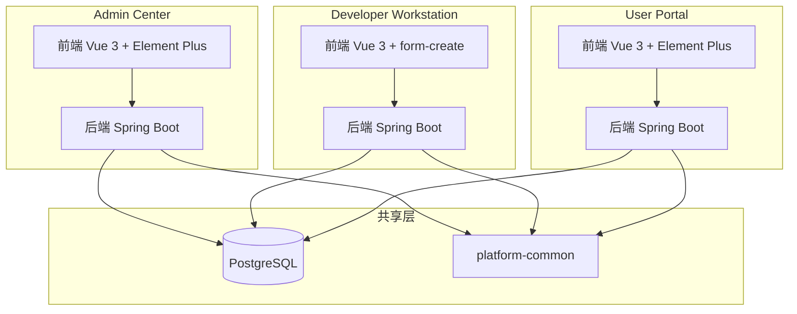
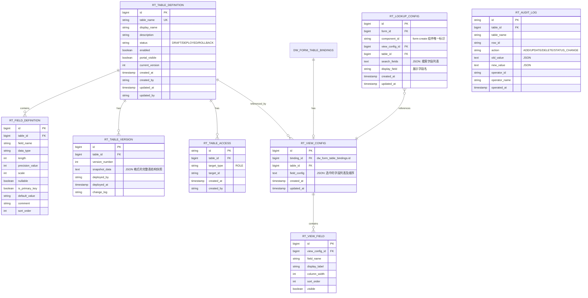
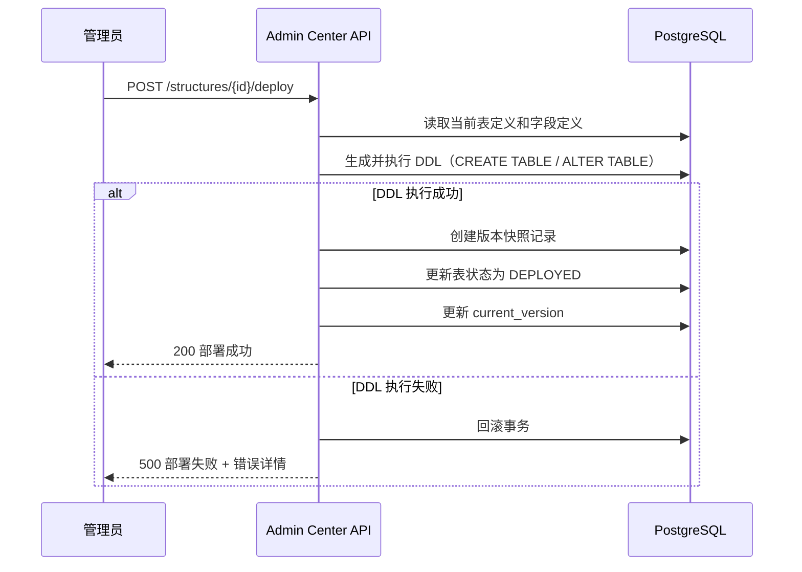
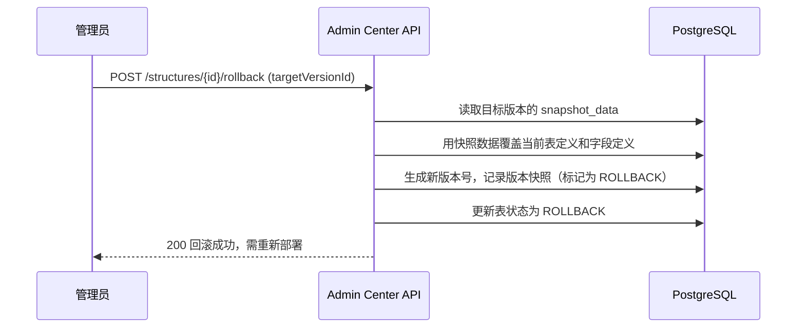

# Relation Tables 设计文档

## 概述

Relation Tables 是一个跨三个微服务（Admin Center、Developer Workstation、User Portal）的公共数据表管理模块。该功能允许管理员在 Admin Center 中可视化地创建和管理数据库表结构及表数据，开发者在 Developer Workstation 中通过 Manage Table Bindings 绑定 Relation Table 并设计 View 页面和 Lookup 组件，业务用户在 User Portal 中查看被授权的 Relation Table 数据。

### 技术栈

- 后端：Spring Boot + JPA/Hibernate + PostgreSQL
- 前端：Vue 3 + TypeScript + Element Plus + Vite
- 表单设计器：@form-create（Developer Workstation 已集成）
- 测试：后端 jqwik（PBT）+ JUnit 5，前端 Vitest + fast-check

### 设计决策

1. Relation Table 的元数据（表定义、字段定义、版本）存储在系统表中，实际业务数据通过动态 DDL 创建的物理表存储
2. 部署机制采用与 FunctionUnit 类似的版本快照模式，每次部署生成新版本号并记录完整的表结构快照
3. 权限复用现有 FunctionUnitAccess 模式，通过 Business Role 控制 User Portal 中的数据可见性
4. Lookup 组件作为 form-create 的自定义扩展组件注册，遵循 form-create 的组件扩展规范
5. View 页面配置以 JSON 格式存储，包含字段列表和布局信息

## 架构

### 系统架构图



### 模块职责

| 模块 | 职责 |
|------|------|
| Admin Center | 表结构 CRUD、版本管理、部署、表数据管理、权限配置、门户可见性控制 |
| Developer Workstation | Table Binding 管理、View 页面设计、Lookup 组件配置 |
| User Portal | 只读数据查看、Lookup 搜索与 View 展示、CSV 导出 |

## 组件与接口

### Admin Center 后端组件

#### RelationTableStructureController

```
POST   /api/relation-tables/structures              — 创建表定义
GET    /api/relation-tables/structures               — 获取表定义列表
GET    /api/relation-tables/structures/{id}          — 获取表定义详情
PUT    /api/relation-tables/structures/{id}          — 更新表定义
DELETE /api/relation-tables/structures/{id}          — 删除表定义
PUT    /api/relation-tables/structures/{id}/enabled  — 启用/禁用
PUT    /api/relation-tables/structures/{id}/portal-visibility — 门户可见性开关
POST   /api/relation-tables/structures/{id}/deploy   — 部署表结构
POST   /api/relation-tables/structures/{id}/rollback — 回滚到指定版本
GET    /api/relation-tables/structures/{id}/versions — 获取版本历史
GET    /api/relation-tables/structures/{id}/access   — 获取访问配置
POST   /api/relation-tables/structures/{id}/access   — 添加访问配置
PUT    /api/relation-tables/structures/{id}/access   — 批量设置访问配置
DELETE /api/relation-tables/structures/{id}/access/{accessId} — 删除访问配置
```

#### RelationTableDataController

```
GET    /api/relation-tables/data/tables              — 获取已部署的表列表
GET    /api/relation-tables/data/{tableId}           — 分页查询表数据
POST   /api/relation-tables/data/{tableId}           — 新增数据
PUT    /api/relation-tables/data/{tableId}/{rowId}   — 修改数据
DELETE /api/relation-tables/data/{tableId}/{rowId}   — 删除数据
PUT    /api/relation-tables/data/{tableId}/{rowId}/status — Active/Inactive 状态变更
```

### Developer Workstation 后端组件

#### RelationTableBindingController（扩展现有 FormDesignController）

```
GET    /api/relation-tables/available                — 获取可绑定的 Relation Table 列表
POST   /api/forms/{formId}/relation-bindings         — 绑定 Relation Table
DELETE /api/forms/{formId}/relation-bindings/{bindingId} — 解除绑定
GET    /api/forms/{formId}/relation-bindings         — 获取绑定列表
```

#### RelationTableViewController

```
GET    /api/forms/{formId}/relation-views/{bindingId}           — 获取 View 配置
PUT    /api/forms/{formId}/relation-views/{bindingId}           — 保存 View 字段配置
GET    /api/forms/{formId}/relation-views/{bindingId}/fields    — 获取可用字段列表
```

#### LookupComponentController

```
GET    /api/forms/{formId}/lookup-config/{componentId}          — 获取 Lookup 配置
PUT    /api/forms/{formId}/lookup-config/{componentId}          — 保存 Lookup 配置
GET    /api/forms/{formId}/lookup-config/{componentId}/bound-views — 获取已绑定的 View 列表
```

### User Portal 后端组件

#### PortalRelationTableController

```
GET    /api/portal/relation-tables                   — 获取用户可见的表列表
GET    /api/portal/relation-tables/{tableId}         — 分页查询表数据（只读）
GET    /api/portal/relation-tables/{tableId}/export  — 导出 CSV
GET    /api/portal/relation-tables/{tableId}/search  — 搜索（Lookup 用）
```

### 前端组件

#### Admin Center 前端

| 组件 | 路径 | 说明 |
|------|------|------|
| TableStructureList | `views/relation-table/structure/index.vue` | 表结构列表页 |
| TableStructureForm | `views/relation-table/structure/form.vue` | 创建/编辑表结构 |
| TableVersionDialog | `views/relation-table/structure/components/VersionDialog.vue` | 版本历史对话框 |
| AccessConfigDialog | `views/relation-table/structure/components/AccessConfigDialog.vue` | Business Role 配置对话框 |
| TableDataList | `views/relation-table/data/index.vue` | 表数据管理页 |
| TableDataForm | `views/relation-table/data/components/DataFormDialog.vue` | 数据新增/编辑对话框 |

#### Developer Workstation 前端

| 组件 | 路径 | 说明 |
|------|------|------|
| RelationBindingPanel | `components/form-designer/RelationBindingPanel.vue` | Relation Table 绑定面板 |
| RelationViewDesigner | `views/form-designer/RelationViewDesigner.vue` | View 页面字段设计器 |
| LookupComponent | `components/form-create/LookupComponent.vue` | form-create 自定义 Lookup 组件 |
| LookupConfigPanel | `components/form-designer/LookupConfigPanel.vue` | Lookup 组件配置面板 |

#### User Portal 前端

| 组件 | 路径 | 说明 |
|------|------|------|
| RelationTableList | `views/relation-tables/index.vue` | Relation Table 列表页 |
| RelationTableData | `views/relation-tables/data.vue` | 表数据查看页 |
| LookupField | `components/lookup/LookupField.vue` | Lookup 搜索字段组件 |
| LookupViewDisplay | `components/lookup/LookupViewDisplay.vue` | Lookup View 展示组件 |


## 数据模型

### 实体关系图



### Admin Center 新增实体

#### RelationTableDefinition

```java
@Entity
@Table(name = "rt_table_definitions")
public class RelationTableDefinition {
    @Id
    @GeneratedValue(strategy = GenerationType.IDENTITY)
    private Long id;

    @Column(name = "table_name", nullable = false, unique = true, length = 100)
    private String tableName;

    @Column(name = "display_name", length = 200)
    private String displayName;

    @Column(name = "description", columnDefinition = "TEXT")
    private String description;

    @Column(name = "status", nullable = false, length = 20)
    @Enumerated(EnumType.STRING)
    private RelationTableStatus status; // DRAFT, DEPLOYED, ROLLBACK

    @Column(name = "enabled", nullable = false)
    private Boolean enabled = true;

    @Column(name = "portal_visible", nullable = false)
    private Boolean portalVisible = false;

    @Column(name = "current_version")
    private Integer currentVersion = 0;

    @CreatedDate
    private Instant createdAt;
    @CreatedBy
    private String createdBy;
    @LastModifiedDate
    private Instant updatedAt;
    @LastModifiedBy
    private String updatedBy;

    @OneToMany(mappedBy = "tableDefinition", cascade = CascadeType.ALL, orphanRemoval = true)
    @OrderBy("sortOrder ASC")
    private List<RelationFieldDefinition> fieldDefinitions = new ArrayList<>();

    @OneToMany(mappedBy = "tableDefinition", cascade = CascadeType.ALL, orphanRemoval = true)
    @OrderBy("versionNumber DESC")
    private List<RelationTableVersion> versions = new ArrayList<>();
}
```

#### RelationFieldDefinition

```java
@Entity
@Table(name = "rt_field_definitions")
public class RelationFieldDefinition {
    @Id
    @GeneratedValue(strategy = GenerationType.IDENTITY)
    private Long id;

    @ManyToOne(fetch = FetchType.LAZY)
    @JoinColumn(name = "table_id", nullable = false)
    private RelationTableDefinition tableDefinition;

    @Column(name = "field_name", nullable = false, length = 100)
    private String fieldName;

    @Column(name = "data_type", nullable = false, length = 50)
    @Enumerated(EnumType.STRING)
    private RelationDataType dataType; // VARCHAR, INTEGER, BIGINT, DECIMAL, BOOLEAN, DATE, TIMESTAMP, TEXT

    @Column(name = "length")
    private Integer length;

    @Column(name = "precision_value")
    private Integer precision;

    @Column(name = "scale")
    private Integer scale;

    @Column(name = "nullable")
    private Boolean nullable = true;

    @Column(name = "is_primary_key")
    private Boolean isPrimaryKey = false;

    @Column(name = "default_value", length = 500)
    private String defaultValue;

    @Column(name = "comment", columnDefinition = "TEXT")
    private String comment;

    @Column(name = "sort_order", nullable = false)
    private Integer sortOrder;
}
```

#### RelationTableVersion

```java
@Entity
@Table(name = "rt_table_versions")
public class RelationTableVersion {
    @Id
    @GeneratedValue(strategy = GenerationType.IDENTITY)
    private Long id;

    @ManyToOne(fetch = FetchType.LAZY)
    @JoinColumn(name = "table_id", nullable = false)
    private RelationTableDefinition tableDefinition;

    @Column(name = "version_number", nullable = false)
    private Integer versionNumber;

    @Column(name = "snapshot_data", nullable = false, columnDefinition = "TEXT")
    private String snapshotData; // JSON 格式

    @Column(name = "deployed_by", nullable = false, length = 64)
    private String deployedBy;

    @Column(name = "deployed_at", nullable = false)
    private Instant deployedAt;

    @Column(name = "change_log", columnDefinition = "TEXT")
    private String changeLog;
}
```

#### RelationTableAccess

```java
@Entity
@Table(name = "rt_table_access")
public class RelationTableAccess {
    @Id
    @GeneratedValue(strategy = GenerationType.UUID)
    private String id;

    @Column(name = "table_id", nullable = false)
    private Long tableId;

    @Column(name = "target_type", nullable = false, length = 20)
    private String targetType; // "ROLE"

    @Column(name = "target_id", nullable = false, length = 64)
    private String targetId;

    @CreatedDate
    private Instant createdAt;
    @CreatedBy
    private String createdBy;
}
```

#### RelationTableAuditLog

```java
@Entity
@Table(name = "rt_audit_logs", indexes = {
    @Index(name = "idx_rt_audit_table", columnList = "table_id"),
    @Index(name = "idx_rt_audit_action", columnList = "action"),
    @Index(name = "idx_rt_audit_operator", columnList = "operator_id"),
    @Index(name = "idx_rt_audit_time", columnList = "operated_at")
})
public class RelationTableAuditLog {
    @Id
    @GeneratedValue(strategy = GenerationType.UUID)
    private String id;

    @Column(name = "table_id", nullable = false)
    private Long tableId;

    @Column(name = "table_name", nullable = false, length = 100)
    private String tableName;

    @Column(name = "row_id", length = 100)
    private String rowId;

    @Column(name = "action", nullable = false, length = 20)
    private String action; // ADD, UPDATE, DELETE, STATUS_CHANGE

    @Column(name = "old_value", columnDefinition = "TEXT")
    private String oldValue;

    @Column(name = "new_value", columnDefinition = "TEXT")
    private String newValue;

    @Column(name = "operator_id", nullable = false, length = 64)
    private String operatorId;

    @Column(name = "operator_name", length = 100)
    private String operatorName;

    @Column(name = "operated_at", nullable = false)
    private Instant operatedAt;
}
```

### Developer Workstation 新增实体

#### RelationViewConfig

```java
@Entity
@Table(name = "rt_view_configs")
public class RelationViewConfig {
    @Id
    @GeneratedValue(strategy = GenerationType.IDENTITY)
    private Long id;

    @Column(name = "binding_id", nullable = false)
    private Long bindingId; // dw_form_table_bindings.id

    @Column(name = "table_id", nullable = false)
    private Long tableId;

    @Column(name = "field_config", columnDefinition = "TEXT")
    private String fieldConfig; // JSON

    @CreatedDate
    private Instant createdAt;
    @LastModifiedDate
    private Instant updatedAt;

    @OneToMany(mappedBy = "viewConfig", cascade = CascadeType.ALL, orphanRemoval = true)
    @OrderBy("sortOrder ASC")
    private List<RelationViewField> viewFields = new ArrayList<>();
}
```

#### RelationViewField

```java
@Entity
@Table(name = "rt_view_fields")
public class RelationViewField {
    @Id
    @GeneratedValue(strategy = GenerationType.IDENTITY)
    private Long id;

    @ManyToOne(fetch = FetchType.LAZY)
    @JoinColumn(name = "view_config_id", nullable = false)
    private RelationViewConfig viewConfig;

    @Column(name = "field_name", nullable = false, length = 100)
    private String fieldName;

    @Column(name = "display_label", length = 200)
    private String displayLabel;

    @Column(name = "column_width")
    private Integer columnWidth;

    @Column(name = "sort_order", nullable = false)
    private Integer sortOrder;

    @Column(name = "visible", nullable = false)
    private Boolean visible = true;
}
```

#### RelationLookupConfig

```java
@Entity
@Table(name = "rt_lookup_configs")
public class RelationLookupConfig {
    @Id
    @GeneratedValue(strategy = GenerationType.IDENTITY)
    private Long id;

    @Column(name = "form_id", nullable = false)
    private Long formId;

    @Column(name = "component_id", nullable = false, length = 100)
    private String componentId;

    @Column(name = "view_config_id")
    private Long viewConfigId;

    @Column(name = "table_id", nullable = false)
    private Long tableId;

    @Column(name = "search_fields", columnDefinition = "TEXT")
    private String searchFields; // JSON 数组

    @Column(name = "display_field", length = 100)
    private String displayField;

    @CreatedDate
    private Instant createdAt;
    @LastModifiedDate
    private Instant updatedAt;
}
```

### 部署流程



### 回滚流程

回滚操作不会直接恢复数据库物理表结构，而是将表定义内容切换为所选历史版本的内容，并生成一个新的版本号。管理员需要再次执行部署操作才能将回滚后的表结构应用到实际数据库。




## 正确性属性（Correctness Properties）

*属性（Property）是指在系统所有有效执行中都应保持为真的特征或行为——本质上是关于系统应该做什么的形式化声明。属性是人类可读规范与机器可验证正确性保证之间的桥梁。*

以下属性经过冗余分析合并后得出：
- 需求 1.5 和 12.6 合并为属性 1（Admin 访问控制）
- 需求 8.7 和 12.5 合并为属性 6（Portal 写操作拒绝）
- 需求 7.2 和 7.3 合并为属性 5（Portal 可见性过滤）
- 需求 4.2、4.4 合并为属性 3（表定义更新持久化）
- 需求 13.1-13.4 合并为属性 9（审计日志完整性）
- 需求 9.3 和 9.7 合并为属性 10（绑定-View 生命周期同步）
- 需求 9.6 和 10.5 合并为属性 11（View 配置持久化往返）
- 需求 9.8 和 10.2 合并为属性 12（Lookup 仅限已绑定表）
- 需求 11.2 和 11.3 合并为属性 13（Lookup 搜索结果正确性）

### Property 1: Admin 角色访问控制

*For any* 非 admin 角色的用户，尝试访问 Relation Tables 的任何 Admin Center API 端点时，系统应拒绝请求并返回 403 错误。

**Validates: Requirements 1.5, 12.6**

### Property 2: 表名唯一性约束

*For any* 两个 RelationTableDefinition 实体，如果它们都存在于系统中，则它们的 table_name 字段值必须不同。

**Validates: Requirements 3.6**

### Property 3: 表定义更新持久化

*For any* 有效的表定义更新请求（包括基本信息修改和字段属性修改），保存后再次读取该表定义，返回的数据应与更新请求中的值一致。

**Validates: Requirements 4.2, 4.4**

### Property 4: 草稿状态不影响物理表

*For any* 表结构修改操作，保存后表的状态应为 DRAFT，且在执行部署操作之前，实际数据库中的物理表结构应保持不变。

**Validates: Requirements 4.5, 5.5**

### Property 5: Portal 可见性过滤

*For any* Relation Table，当 portal_visible 为 true 时，该表应出现在 User Portal 的表列表中（前提是用户有对应权限）；当 portal_visible 为 false 时，该表不应出现在 User Portal 的表列表中。Admin Center 的数据列表不受此开关影响。

**Validates: Requirements 7.2, 7.3, 7.4**

### Property 6: Portal 写操作拒绝

*For any* 通过 User Portal API 发起的写操作（POST、PUT、DELETE），系统应拒绝请求并返回权限错误，表数据应保持不变。

**Validates: Requirements 8.7, 12.5**

### Property 7: 部署版本递增与快照

*For any* 成功的部署操作，新生成的版本号应等于部署前的 current_version + 1，且版本快照中的表结构数据应与部署时的表定义完全一致。

**Validates: Requirements 5.2**

### Property 8: 回滚恢复表定义

*For any* 回滚操作，指定目标历史版本后，当前表定义的字段列表应与目标版本快照中记录的字段列表一致，且系统应生成一个新的版本号。

**Validates: Requirements 5.4**

### Property 9: 审计日志完整性

*For any* 数据变更操作（ADD、UPDATE、DELETE、STATUS_CHANGE），系统应创建一条审计日志记录，包含正确的操作类型、操作人、操作时间；对于 UPDATE 操作，old_value 和 new_value 应分别反映变更前后的数据；对于 ADD 操作，new_value 应包含新增数据；对于 DELETE 操作，old_value 应包含被删除数据。

**Validates: Requirements 13.1, 13.2, 13.3, 13.4**

### Property 10: 绑定-View 生命周期同步

*For any* Relation Table 绑定操作，成功绑定后应自动创建对应的 RelationViewConfig 记录；解除绑定后，对应的 RelationViewConfig 及其 RelationViewField 记录应被同步删除。

**Validates: Requirements 9.3, 9.7**

### Property 11: View 配置持久化往返

*For any* View 字段配置，保存后再次读取应返回与保存时完全一致的字段列表、显示标签、列宽和排序顺序。

**Validates: Requirements 9.6, 10.5**

### Property 12: Lookup 仅限已绑定表

*For any* Lookup 组件配置请求，可选的 Relation Table 列表应恰好等于当前 Form 已通过 Manage Table Bindings 绑定的 Relation Table 集合，不多不少。

**Validates: Requirements 9.8, 10.2**

### Property 13: Lookup 搜索结果正确性

*For any* 搜索关键字和 Search_Field_Config 配置，返回的搜索结果中每条数据至少有一个配置的搜索字段包含该关键字（模糊匹配），且结果列表中每条数据的展示值应来自 Display_Field_Config 指定的字段。

**Validates: Requirements 11.2, 11.3**

### Property 14: 用户权限过滤

*For any* 业务用户和 Relation Table 集合，User Portal 中可见的表应恰好是满足以下两个条件的表的交集：(1) portal_visible = true，(2) 用户拥有的 Business Role 中至少有一个被分配了该表的访问权限。

**Validates: Requirements 8.2, 12.4**

### Property 15: 数据列表仅展示已部署表

*For any* Relation Table 集合，表数据管理页面（Admin Center）应仅展示状态为 DEPLOYED 的表。

**Validates: Requirements 6.1**

### Property 16: 审计日志过滤正确性

*For any* 审计日志查询请求（按操作时间、操作人、操作类型过滤），返回的所有日志记录应满足指定的过滤条件。

**Validates: Requirements 13.5**

### Property 17: 部署失败回滚

*For any* 导致 DDL 执行失败的表定义，部署操作应失败，且表的状态、版本号和物理表结构应保持部署前的状态不变。

**Validates: Requirements 5.6**

### Property 18: CSV 导出数据一致性

*For any* Relation Table 的数据集，导出的 CSV 文件解析后应包含与当前表数据完全一致的行数和列数据。

**Validates: Requirements 8.5**

### Property 19: 分页数据大小约束

*For any* 分页查询请求，返回的数据条数应不超过请求的 pageSize 值。

**Validates: Requirements 6.5**

### Property 20: 绑定列表仅含已部署表

*For any* Manage Table Bindings 的可选表列表请求，返回的 Relation Table 应全部为已部署状态（DEPLOYED）。

**Validates: Requirements 9.1**

### Property 21: Relation Table 绑定类型为 RELATED

*For any* 通过 Manage Table Bindings 创建的 Relation Table 绑定，其 bindingType 应始终为 RELATED。

**Validates: Requirements 9.2**

## 错误处理

### 错误分类与处理策略

| 错误场景 | HTTP 状态码 | 处理策略 |
|----------|------------|---------|
| 表名重复 | 409 Conflict | 返回明确的重复提示，前端显示错误信息 |
| 表定义不存在 | 404 Not Found | 返回资源不存在提示 |
| 部署 DDL 执行失败 | 500 Internal Server Error | 回滚事务，返回详细的 DDL 错误信息 |
| 非 admin 用户访问 Admin Center | 403 Forbidden | 拒绝请求 |
| Portal 用户尝试写操作 | 403 Forbidden | 拒绝请求，返回无权限提示 |
| 用户无 Business Role 权限 | 403 Forbidden | 不返回该表数据 |
| 删除已被绑定的表 | 409 Conflict | 拒绝删除，提示存在绑定关系 |
| 部署未保存的草稿 | 400 Bad Request | 提示先保存修改 |
| 回滚到不存在的版本 | 404 Not Found | 返回版本不存在提示 |
| 字段定义验证失败 | 400 Bad Request | 返回具体的字段验证错误列表 |
| CSV 导出数据量过大 | 413 Payload Too Large | 限制导出行数，提示分批导出 |

### 后端异常类

```java
// Admin Center
public class RelationTableNotFoundException extends RuntimeException { ... }
public class RelationTableNameDuplicateException extends RuntimeException { ... }
public class RelationTableDeploymentException extends RuntimeException { ... }
public class RelationTableBindingExistsException extends RuntimeException { ... }

// 统一异常处理器（复用现有 ErrorHandler 模式）
@RestControllerAdvice
public class RelationTableExceptionHandler {
    @ExceptionHandler(RelationTableNameDuplicateException.class)
    public ResponseEntity<ErrorResponse> handleDuplicate(...) { ... }

    @ExceptionHandler(RelationTableDeploymentException.class)
    public ResponseEntity<ErrorResponse> handleDeploymentError(...) { ... }
}
```

## 测试策略

### 双重测试方法

本功能采用单元测试与属性测试相结合的方式确保正确性：

- 单元测试：验证具体示例、边界情况和错误条件
- 属性测试：验证跨所有输入的通用属性

### 属性测试配置

- 后端：使用 jqwik（项目已集成，见 `backend/platform-common/.jqwik-database`）
- 前端：使用 fast-check（项目已集成，见 `frontend/developer-workstation/node_modules/fast-check` 和 `frontend/user-portal/node_modules/fast-check`）
- 每个属性测试最少运行 100 次迭代
- 每个属性测试必须通过注释引用设计文档中的属性编号
- 标签格式：**Feature: relation-tables, Property {number}: {property_text}**
- 每个正确性属性由一个属性测试实现

### 后端测试计划

#### 属性测试（jqwik）

| 属性 | 测试类 | 说明 |
|------|--------|------|
| Property 2 | `RelationTableStructurePropertyTest` | 生成随机表名，验证唯一性约束 |
| Property 3 | `RelationTableStructurePropertyTest` | 生成随机更新请求，验证持久化往返 |
| Property 4 | `RelationTableStructurePropertyTest` | 生成随机修改，验证草稿状态不影响物理表 |
| Property 7 | `RelationTableDeployPropertyTest` | 生成随机表定义，验证部署后版本递增和快照一致 |
| Property 8 | `RelationTableDeployPropertyTest` | 生成随机版本历史，验证回滚恢复正确性 |
| Property 9 | `RelationTableAuditPropertyTest` | 生成随机数据操作，验证审计日志完整性 |
| Property 14 | `RelationTableAccessPropertyTest` | 生成随机用户角色组合，验证权限过滤 |
| Property 15 | `RelationTableDataPropertyTest` | 生成随机表状态组合，验证仅展示已部署表 |
| Property 16 | `RelationTableAuditPropertyTest` | 生成随机过滤条件，验证审计日志过滤正确性 |
| Property 17 | `RelationTableDeployPropertyTest` | 生成无效 DDL 场景，验证部署失败回滚 |
| Property 19 | `RelationTableDataPropertyTest` | 生成随机分页参数，验证分页大小约束 |

#### 单元测试（JUnit 5）

| 测试类 | 覆盖需求 | 说明 |
|--------|---------|------|
| `RelationTableStructureServiceTest` | 3.1-3.7, 4.1-4.5 | 表结构 CRUD 操作 |
| `RelationTableDeployServiceTest` | 5.1-5.6 | 部署和回滚流程 |
| `RelationTableDataServiceTest` | 6.1-6.5 | 表数据管理操作 |
| `RelationTableAccessServiceTest` | 12.1-12.4 | 权限配置和检查 |
| `RelationTableAuditServiceTest` | 13.1-13.5 | 审计日志记录 |

### 前端测试计划

#### 属性测试（fast-check + Vitest）

| 属性 | 测试文件 | 说明 |
|------|---------|------|
| Property 5 | `portalVisibility.property.test.ts` | 生成随机表和可见性状态，验证过滤逻辑 |
| Property 6 | `portalWriteReject.property.test.ts` | 生成随机写操作请求，验证拒绝逻辑 |
| Property 10 | `bindingViewSync.property.test.ts` | 生成随机绑定/解绑操作，验证 View 生命周期同步 |
| Property 11 | `viewConfigRoundTrip.property.test.ts` | 生成随机 View 配置，验证持久化往返 |
| Property 12 | `lookupBoundTables.property.test.ts` | 生成随机绑定状态，验证 Lookup 可选表过滤 |
| Property 13 | `lookupSearch.property.test.ts` | 生成随机搜索关键字和数据，验证搜索结果正确性 |
| Property 18 | `csvExport.property.test.ts` | 生成随机表数据，验证 CSV 导出一致性 |

#### 单元测试（Vitest）

| 测试文件 | 覆盖需求 | 说明 |
|---------|---------|------|
| `TableStructureList.test.ts` | 2.1-2.7 | 表结构列表渲染和交互 |
| `TableStructureForm.test.ts` | 3.1-3.5 | 创建/编辑表单验证 |
| `TableDataList.test.ts` | 6.1-6.5 | 表数据列表渲染 |
| `LookupComponent.test.ts` | 10.1-10.8 | Lookup 组件配置和渲染 |
| `LookupField.test.ts` | 11.1-11.6 | Portal Lookup 搜索和展示 |
| `RelationTableData.test.ts` | 8.1-8.6 | Portal 数据查看页 |
