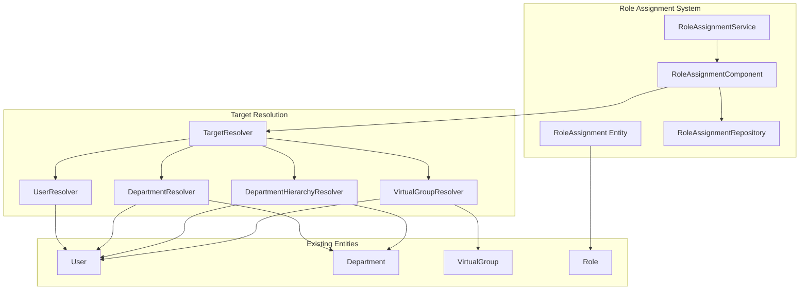
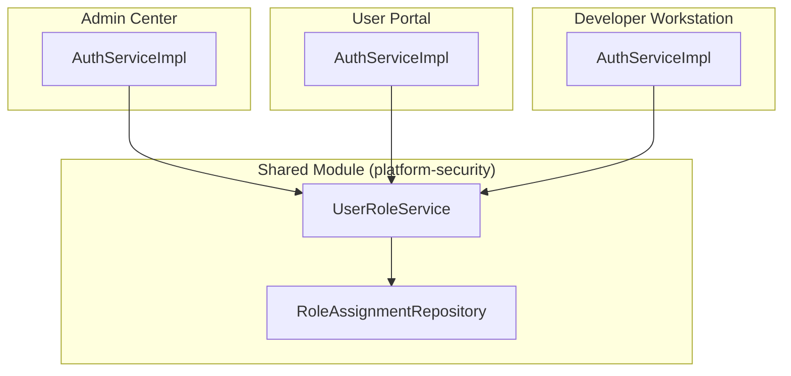

# Design Document: Role Assignment Targets

## Overview

This feature extends the role assignment system to support four types of assignment targets: individual users, departments, department hierarchies, and virtual groups. The design introduces a new `RoleAssignment` entity that replaces the direct user-role relationship for group-based assignments while maintaining backward compatibility with existing user-specific assignments.

## Architecture



## Components and Interfaces

### 1. RoleAssignment Entity

New entity to store role assignments with different target types.

```java
@Entity
@Table(name = "sys_role_assignments")
public class RoleAssignment {
    @Id
    private String id;
    
    @ManyToOne(fetch = FetchType.LAZY)
    @JoinColumn(name = "role_id", nullable = false)
    private Role role;
    
    @Enumerated(EnumType.STRING)
    @Column(name = "target_type", nullable = false)
    private AssignmentTargetType targetType;
    
    @Column(name = "target_id", nullable = false)
    private String targetId;
    
    @Column(name = "include_descendants")
    private Boolean includeDescendants; // For DEPARTMENT_HIERARCHY
    
    private LocalDateTime assignedAt;
    private String assignedBy;
    private LocalDateTime validFrom;
    private LocalDateTime validTo;
}
```

### 2. AssignmentTargetType Enum

```java
public enum AssignmentTargetType {
    USER,              // Direct user assignment
    DEPARTMENT,        // All users in a specific department
    DEPARTMENT_HIERARCHY, // All users in department and descendants
    VIRTUAL_GROUP      // All members of a virtual group
}
```

### 3. RoleAssignmentComponent

Core component for managing role assignments.

```java
public interface RoleAssignmentComponent {
    // Create assignment
    RoleAssignment createAssignment(CreateAssignmentRequest request, String operatorId);
    
    // Delete assignment
    void deleteAssignment(String assignmentId, String operatorId);
    
    // Get assignments for a role
    List<RoleAssignment> getAssignmentsForRole(String roleId);
    
    // Get effective users for a role (resolved from all assignments)
    List<User> getEffectiveUsers(String roleId);
    
    // Get effective users count for an assignment
    long getEffectiveUserCount(String assignmentId);
    
    // Check if user has role (through any assignment type)
    boolean userHasRole(String userId, String roleId);
    
    // Get all roles for a user (through any assignment type)
    List<Role> getRolesForUser(String userId);
}
```

### 4. TargetResolver Interface

Strategy pattern for resolving users from different target types.

```java
public interface TargetResolver {
    AssignmentTargetType getTargetType();
    boolean targetExists(String targetId);
    List<User> resolveUsers(String targetId, boolean includeDescendants);
    String getTargetDisplayName(String targetId);
}
```

### 5. API Endpoints

```
# 角色分配管理 (显示分配记录列表)
POST   /api/v1/admin/roles/{roleId}/assignments     - Create assignment
GET    /api/v1/admin/roles/{roleId}/assignments     - List assignments (分配记录列表)
DELETE /api/v1/admin/roles/{roleId}/assignments/{id} - Delete assignment

# 有效用户查询 (显示所有拥有该角色的用户及来源)
GET    /api/v1/admin/roles/{roleId}/effective-users  - Get effective users with sources

# 用户角色查询 (用于登录和权限检查)
GET    /api/v1/admin/users/{userId}/effective-roles  - Get user's effective roles with sources
```

### 6. 两部分显示设计

#### 第一部分：角色分配记录列表
显示角色的所有分配记录，包括：
- 分配ID
- 分配目标类型 (USER/DEPARTMENT/DEPARTMENT_HIERARCHY/VIRTUAL_GROUP)
- 分配目标名称 (用户名/部门名/虚拟组名)
- 分配时间
- 分配人
- 该分配影响的用户数量

#### 第二部分：有效用户列表
显示所有拥有该角色的用户，包括：
- 用户基本信息 (用户名、姓名、部门)
- 角色来源 (继承自哪里)
  - 直接分配 (USER)
  - 继承自部门 (DEPARTMENT: 部门名)
  - 继承自部门层级 (DEPARTMENT_HIERARCHY: 部门名)
  - 继承自虚拟组 (VIRTUAL_GROUP: 虚拟组名)
- 一个用户可能有多个来源 (如同时属于某部门和某虚拟组)

### 7. 登录时权限获取

用户登录时，系统需要动态计算用户的所有角色：

```java
public interface UserRoleResolver {
    /**
     * 获取用户的所有有效角色（包括直接分配和继承）
     * @param userId 用户ID
     * @return 角色列表，每个角色包含来源信息
     */
    List<UserRoleWithSource> getEffectiveRolesForUser(String userId);
}

public class UserRoleWithSource {
    private String roleId;
    private String roleCode;
    private String roleName;
    private AssignmentTargetType sourceType;
    private String sourceId;      // 来源ID (部门ID/虚拟组ID/用户ID)
    private String sourceName;    // 来源名称
}
```

登录时的角色获取流程：
1. 查询 USER 类型分配：直接分配给该用户的角色
2. 查询 DEPARTMENT 类型分配：用户所在部门被分配的角色
3. 查询 DEPARTMENT_HIERARCHY 类型分配：用户所在部门的祖先部门被分配的角色
4. 查询 VIRTUAL_GROUP 类型分配：用户所属虚拟组被分配的角色
5. 合并去重，返回角色列表（保留来源信息用于审计）

### 8. 三端统一登录集成

角色计算服务需要在三个前端统一使用：



**实现方案：**

1. **共享模块 `platform-security`**
   - 实现 `UserRoleService` 接口
   - 包含角色计算逻辑
   - 访问 `sys_role_assignments` 表

2. **各前端后端引用共享模块**
   - Admin Center: `com.admin.service.impl.AuthServiceImpl` 调用 `UserRoleService`
   - User Portal: `com.portal.service.impl.AuthServiceImpl` 调用 `UserRoleService`
   - Developer Workstation: `com.developer.service.impl.AuthServiceImpl` 调用 `UserRoleService`

3. **登录响应统一格式**
   ```java
   public class LoginResponse {
       private String accessToken;
       private String refreshToken;
       private long expiresIn;
       private UserLoginInfo user;
   }
   
   public class UserLoginInfo {
       private String userId;
       private String username;
       private String displayName;
       private List<String> roles;        // 角色代码列表 (去重后)
       private List<String> permissions;  // 权限列表 (去重后)
       private List<RoleWithSource> rolesWithSources;  // 角色及来源信息 (必选)
   }
   
   public class RoleWithSource {
       private String roleCode;
       private String roleName;
       private AssignmentTargetType sourceType;  // USER/DEPARTMENT/DEPARTMENT_HIERARCHY/VIRTUAL_GROUP
       private String sourceId;
       private String sourceName;
   }
   ```

## Data Models

### Database Schema

```sql
CREATE TABLE sys_role_assignments (
    id VARCHAR(64) PRIMARY KEY,
    role_id VARCHAR(64) NOT NULL REFERENCES sys_roles(id),
    target_type VARCHAR(30) NOT NULL,
    target_id VARCHAR(64) NOT NULL,
    include_descendants BOOLEAN DEFAULT FALSE,
    assigned_at TIMESTAMP DEFAULT CURRENT_TIMESTAMP,
    assigned_by VARCHAR(64),
    valid_from TIMESTAMP,
    valid_to TIMESTAMP,
    created_at TIMESTAMP DEFAULT CURRENT_TIMESTAMP,
    updated_at TIMESTAMP DEFAULT CURRENT_TIMESTAMP,
    
    CONSTRAINT uk_role_target UNIQUE (role_id, target_type, target_id)
);

CREATE INDEX idx_role_assignments_role ON sys_role_assignments(role_id);
CREATE INDEX idx_role_assignments_target ON sys_role_assignments(target_type, target_id);
```

### Request/Response DTOs

```java
// Create Assignment Request
public class CreateAssignmentRequest {
    @NotNull private String roleId;
    @NotNull private AssignmentTargetType targetType;
    @NotNull private String targetId;
    private LocalDateTime validFrom;
    private LocalDateTime validTo;
}

// Assignment Response (第一部分：分配记录)
public class RoleAssignmentResponse {
    private String id;
    private String roleId;
    private String roleName;
    private AssignmentTargetType targetType;
    private String targetId;
    private String targetName;          // 目标名称 (用户名/部门名/虚拟组名)
    private long effectiveUserCount;    // 该分配影响的用户数
    private LocalDateTime assignedAt;
    private String assignedBy;
    private String assignedByName;
}

// Effective User Response (第二部分：有效用户)
public class EffectiveUserResponse {
    private String userId;
    private String username;
    private String displayName;
    private String departmentId;
    private String departmentName;
    private List<RoleSource> sources;   // 角色来源列表 (可能有多个)
}

// 角色来源
public class RoleSource {
    private AssignmentTargetType sourceType;  // USER/DEPARTMENT/DEPARTMENT_HIERARCHY/VIRTUAL_GROUP
    private String sourceId;                   // 来源ID
    private String sourceName;                 // 来源名称
    private String assignmentId;               // 对应的分配记录ID
}

// 用户有效角色 (用于登录)
public class UserEffectiveRole {
    private String roleId;
    private String roleCode;
    private String roleName;
    private RoleType roleType;
    private List<RoleSource> sources;   // 角色来源列表
}

// 用户有效角色列表响应
public class UserEffectiveRolesResponse {
    private String userId;
    private String username;
    private List<UserEffectiveRole> roles;
    private List<String> permissions;   // 合并后的权限列表
}
```

## Correctness Properties

*A property is a characteristic or behavior that should hold true across all valid executions of a system-essentially, a formal statement about what the system should do. Properties serve as the bridge between human-readable specifications and machine-verifiable correctness guarantees.*

### Property 1: USER Assignment Grants Role to Single User
*For any* role assignment with target type USER, the effective users for that assignment SHALL contain exactly one user - the user specified by the target ID.
**Validates: Requirements 1.2**

### Property 2: DEPARTMENT Assignment Grants Role to Department Members
*For any* role assignment with target type DEPARTMENT, the effective users SHALL equal the set of users whose department_id matches the target ID.
**Validates: Requirements 1.3, 3.2**

### Property 3: DEPARTMENT_HIERARCHY Assignment Grants Role to Hierarchy Members
*For any* role assignment with target type DEPARTMENT_HIERARCHY, the effective users SHALL include all users in the target department and all users in departments whose path starts with the target department's path.
**Validates: Requirements 1.4, 3.3**

### Property 4: VIRTUAL_GROUP Assignment Grants Role to Group Members
*For any* role assignment with target type VIRTUAL_GROUP, the effective users SHALL equal the set of active members of the virtual group specified by the target ID.
**Validates: Requirements 1.5, 3.4**

### Property 5: Effective Users Deduplication
*For any* role with multiple assignments, the effective users list SHALL contain each user at most once, even if the user is matched by multiple assignments.
**Validates: Requirements 3.5**

### Property 6: Assignment Uniqueness
*For any* attempt to create an assignment with the same (role_id, target_type, target_id) as an existing assignment, the system SHALL reject the request with a duplicate error.
**Validates: Requirements 2.3**

### Property 7: Target Validation
*For any* assignment creation request, if the target_id does not correspond to an existing entity of the specified target_type, the system SHALL reject the request with a not-found error.
**Validates: Requirements 2.2**

### Property 8: Assignment Deletion Removes Role Access
*For any* assignment that is deleted, users who only had the role through that assignment SHALL no longer have the role (unless granted through another assignment).
**Validates: Requirements 2.6**

### Property 9: Dynamic Membership - User Gains Role
*For any* user added to a department or virtual group that has a role assignment, the user SHALL immediately be included in the effective users for that role.
**Validates: Requirements 4.1, 4.3**

### Property 10: Dynamic Membership - User Loses Role
*For any* user removed from a department or virtual group that has a role assignment, the user SHALL immediately be excluded from the effective users for that role (unless matched by another assignment).
**Validates: Requirements 4.2, 4.4**

## Error Handling

| Error Code | Description | HTTP Status |
|------------|-------------|-------------|
| ROLE_NOT_FOUND | Role does not exist | 404 |
| TARGET_NOT_FOUND | Target (user/department/virtual group) does not exist | 404 |
| ASSIGNMENT_NOT_FOUND | Assignment does not exist | 404 |
| DUPLICATE_ASSIGNMENT | Assignment already exists for this role and target | 409 |
| INVALID_TARGET_TYPE | Invalid target type specified | 400 |
| SYSTEM_ROLE_MODIFICATION | Cannot modify assignments for system roles | 403 |

## Testing Strategy

### Unit Tests
- Test each TargetResolver implementation independently
- Test RoleAssignmentComponent business logic
- Test DTO validation

### Property-Based Tests
- Use jqwik for property-based testing
- Generate random assignments and verify properties hold
- Test edge cases: empty departments, nested hierarchies, overlapping assignments

### Integration Tests
- Test full API flow for each target type
- Test effective user calculation with complex scenarios
- Test concurrent assignment modifications

### Test Configuration
- Minimum 100 iterations per property test
- Tag format: **Feature: role-assignment-targets, Property {number}: {property_text}**
