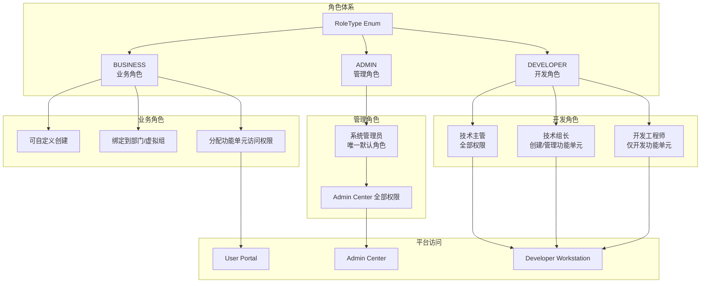

# Design Document: Role System Redesign

## Overview

本设计文档描述了 Admin Center 角色体系的重构方案，将角色分为三大类：业务角色（BUSINESS）、管理角色（ADMIN）和开发角色（DEVELOPER）。每类角色服务于不同的平台和用途，实现清晰的权限分离。

## Architecture



## Components and Interfaces

### 1. RoleType 枚举重构

```java
public enum RoleType {
    /** 业务角色 - 用于 User Portal 用户管理 */
    BUSINESS,
    /** 管理角色 - 用于 Admin Center 管理功能 */
    ADMIN,
    /** 开发角色 - 用于 Developer Workstation 功能权限 */
    DEVELOPER
}
```

### 2. 开发者权限代码枚举

```java
public enum DeveloperPermission {
    // 功能单元权限
    FUNCTION_UNIT_CREATE("function_unit:create"),
    FUNCTION_UNIT_UPDATE("function_unit:update"),
    FUNCTION_UNIT_DELETE("function_unit:delete"),
    FUNCTION_UNIT_VIEW("function_unit:view"),
    FUNCTION_UNIT_DEVELOP("function_unit:develop"),
    
    // 表单设计权限
    FORM_CREATE("form:create"),
    FORM_UPDATE("form:update"),
    FORM_DELETE("form:delete"),
    FORM_VIEW("form:view"),
    
    // 流程设计权限
    PROCESS_CREATE("process:create"),
    PROCESS_UPDATE("process:update"),
    PROCESS_DELETE("process:delete"),
    PROCESS_VIEW("process:view"),
    
    // 数据表权限
    TABLE_CREATE("table:create"),
    TABLE_UPDATE("table:update"),
    TABLE_DELETE("table:delete"),
    TABLE_VIEW("table:view");
    
    private final String code;
}
```

### 3. 角色权限映射

| 角色 | 权限范围 |
|------|----------|
| 技术主管 | 所有权限 |
| 技术组长 | function_unit:*, form:*, process:*, table:* |
| 开发工程师 | function_unit:view, function_unit:develop, form:view, form:update, process:view, process:update, table:view |

### 4. 功能单元访问配置简化

```java
// 简化后只保留 ROLE 类型
public enum FunctionUnitAccessType {
    /** 角色 - 只支持业务角色 */
    ROLE
}
```

### 5. 服务接口

```java
public interface RoleService {
    // 获取指定类型的角色列表
    List<Role> getRolesByType(RoleType type);
    
    // 获取业务角色列表（用于功能单元访问配置）
    List<Role> getBusinessRoles();
    
    // 检查角色是否可删除
    boolean isDeletable(String roleId);
}

public interface DeveloperPermissionService {
    // 检查用户是否有指定权限
    boolean hasPermission(String userId, DeveloperPermission permission);
    
    // 获取用户的所有开发权限
    Set<DeveloperPermission> getUserPermissions(String userId);
    
    // 获取角色的权限列表
    Set<DeveloperPermission> getRolePermissions(String roleId);
}

public interface FunctionUnitAccessService {
    // 获取用户可访问的功能单元列表
    List<FunctionUnit> getAccessibleFunctionUnits(String userId);
    
    // 检查用户是否可以访问指定功能单元
    boolean canAccess(String userId, String functionUnitId);
    
    // 为功能单元分配业务角色
    void assignRole(String functionUnitId, String roleId);
    
    // 移除功能单元的角色分配
    void removeRole(String functionUnitId, String roleId);
}
```

## Data Models

### 1. Role 实体更新

```java
@Entity
@Table(name = "admin_roles")
public class Role {
    @Id
    private String id;
    
    private String name;
    private String code;
    
    @Enumerated(EnumType.STRING)
    private RoleType type;  // BUSINESS, ADMIN, DEVELOPER
    
    private String description;
    
    @Column(name = "is_system")
    private boolean system;  // 系统角色不可删除
    
    private String status;
    
    // ... 其他字段
}
```

### 2. DeveloperRolePermission 实体

```java
@Entity
@Table(name = "admin_developer_role_permissions")
public class DeveloperRolePermission {
    @Id
    private String id;
    
    @Column(name = "role_id")
    private String roleId;
    
    @Enumerated(EnumType.STRING)
    private DeveloperPermission permission;
    
    private Instant createdAt;
}
```

### 3. FunctionUnitAccess 实体简化

```java
@Entity
@Table(name = "admin_function_unit_access")
public class FunctionUnitAccess {
    @Id
    private String id;
    
    @ManyToOne
    private FunctionUnit functionUnit;
    
    // 只保留角色ID，移除 accessType 字段
    @Column(name = "role_id")
    private String roleId;
    
    private String roleName;  // 冗余字段
    
    private Instant createdAt;
    private String createdBy;
}
```

### 4. 默认角色数据

```sql
-- 管理角色
INSERT INTO admin_roles (id, name, code, type, is_system, status) VALUES
('role_sys_admin', '系统管理员', 'SYS_ADMIN', 'ADMIN', true, 'ACTIVE');

-- 开发角色
INSERT INTO admin_roles (id, name, code, type, is_system, status) VALUES
('role_tech_director', '技术主管', 'TECH_DIRECTOR', 'DEVELOPER', true, 'ACTIVE'),
('role_team_leader', '技术组长', 'TEAM_LEADER', 'DEVELOPER', true, 'ACTIVE'),
('role_developer', '开发工程师', 'DEVELOPER', 'DEVELOPER', true, 'ACTIVE');

-- 开发角色权限配置
-- 技术主管：所有权限
-- 技术组长：创建、更新、删除、查看、开发
-- 开发工程师：查看、开发
```

## Correctness Properties

*A property is a characteristic or behavior that should hold true across all valid executions of a system-essentially, a formal statement about what the system should do. Properties serve as the bridge between human-readable specifications and machine-verifiable correctness guarantees.*

### Property 1: Role Category Validation
*For any* role creation request, the system shall accept only BUSINESS, ADMIN, or DEVELOPER as valid role types, and reject any other value.
**Validates: Requirements 1.1, 1.2, 1.3**

### Property 2: System Role Protection
*For any* system role (is_system = true), deletion attempts shall be rejected and the role shall remain in the database.
**Validates: Requirements 3.3, 6.3**

### Property 3: Developer Permission Enforcement
*For any* user with a developer role, the system shall grant exactly the permissions defined for that role: Technical Director gets all permissions, Team Leader gets create/update/delete/view/develop, Developer gets only view/develop.
**Validates: Requirements 4.2, 4.3, 4.4, 4.5, 5.2, 5.3, 5.4**

### Property 4: Function Unit Visibility by Role
*For any* function unit and any user, the function unit shall be visible in User Portal if and only if the user has at least one business role that is assigned access to that function unit.
**Validates: Requirements 7.1, 7.3, 7.4, 7.5**

### Property 5: Business Role Only for Function Unit Access
*For any* function unit access configuration, the target shall be a role with type BUSINESS, and attempts to assign access to ADMIN or DEVELOPER roles shall be rejected.
**Validates: Requirements 7.1, 7.2, 9.3**

### Property 6: Virtual Group Role Binding
*For any* user who joins a virtual group, the user shall automatically receive all business roles bound to that virtual group.
**Validates: Requirements 2.4**

### Property 7: Admin Role Restriction
*For any* admin role, it shall not be bindable to virtual groups, and attempts to create such bindings shall be rejected.
**Validates: Requirements 3.4**

### Property 8: Permission Check Enforcement
*For any* operation in Developer Workstation, the system shall verify the user has the required permission code before allowing the operation.
**Validates: Requirements 5.5**

## Error Handling

1. **角色删除保护**: 尝试删除系统角色时返回 400 错误，提示"系统角色不可删除"
2. **无效角色类型**: 创建角色时使用无效类型返回 400 错误
3. **权限不足**: 用户尝试执行无权限操作时返回 403 错误
4. **功能单元访问配置错误**: 尝试将功能单元分配给非业务角色时返回 400 错误

## Testing Strategy

### Unit Tests
- 角色类型枚举值验证
- 系统角色删除保护逻辑
- 权限代码映射正确性
- 功能单元访问配置验证

### Property-Based Tests
- Property 1: 使用随机角色类型测试验证逻辑
- Property 3: 使用随机用户和操作测试权限检查
- Property 4: 使用随机用户和功能单元测试可见性
- Property 5: 使用随机角色类型测试访问配置限制

### Integration Tests
- 完整的角色创建和权限分配流程
- 用户加入虚拟组后的角色继承
- Developer Workstation 权限控制端到端测试
- User Portal 功能单元可见性端到端测试
