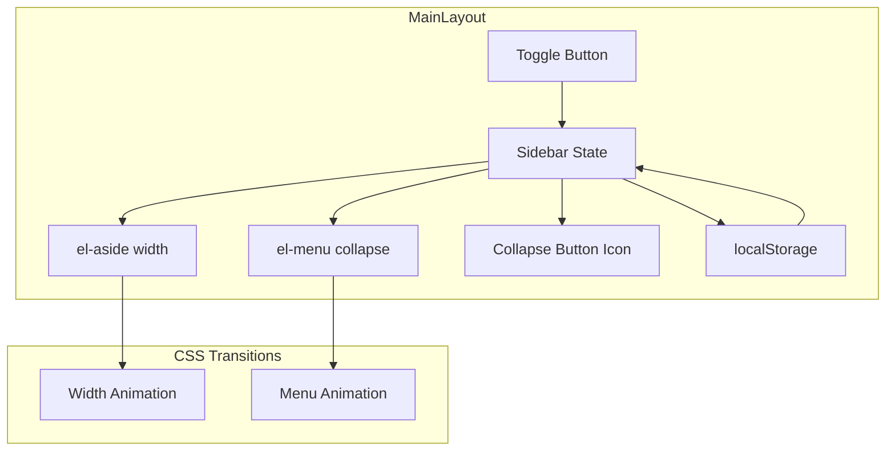

# Design Document: Sidebar Collapse

## Overview

本设计为开发者工作站的 MainLayout 组件添加侧边栏折叠/展开功能。通过修改现有的 `MainLayout.vue` 组件，利用 Element Plus 的 `el-menu` 组件内置的 `collapse` 属性实现菜单折叠，并添加状态管理和持久化逻辑。

## Architecture



### 设计决策

1. **使用 Element Plus 内置功能**: `el-menu` 组件原生支持 `collapse` 属性，折叠时自动隐藏文字标签并显示 tooltip
2. **响应式状态管理**: 使用 Vue 3 的 `ref` 管理折叠状态
3. **CSS 过渡动画**: 使用 CSS `transition` 属性实现平滑动画
4. **localStorage 持久化**: 使用 localStorage 保存用户偏好

## Components and Interfaces

### MainLayout.vue 修改

#### 新增状态

```typescript
// 侧边栏折叠状态
const isCollapsed = ref(false)

// 侧边栏宽度计算
const sidebarWidth = computed(() => isCollapsed.value ? '64px' : '240px')
```

#### 新增方法

```typescript
// 切换折叠状态
function toggleSidebar(): void {
  isCollapsed.value = !isCollapsed.value
  localStorage.setItem('sidebar-collapsed', String(isCollapsed.value))
}

// 初始化时恢复状态
function initSidebarState(): void {
  const stored = localStorage.getItem('sidebar-collapsed')
  isCollapsed.value = stored === 'true'
}
```

#### 模板结构变更

```vue
<el-aside :width="sidebarWidth" class="sidebar">
  <el-menu 
    :default-active="activeMenu" 
    :collapse="isCollapsed"
    router
  >
    <!-- menu items -->
  </el-menu>
  
  <div class="collapse-btn" @click="toggleSidebar">
    <el-icon>
      <DArrowLeft v-if="!isCollapsed" />
      <DArrowRight v-else />
    </el-icon>
  </div>
</el-aside>
```

## Data Models

### 状态存储

| Key | Type | Description |
|-----|------|-------------|
| `sidebar-collapsed` | string ("true" \| "false") | localStorage 中存储的侧边栏折叠状态 |

### 组件状态

| State | Type | Default | Description |
|-------|------|---------|-------------|
| `isCollapsed` | `Ref<boolean>` | `false` | 当前侧边栏是否折叠 |
| `sidebarWidth` | `ComputedRef<string>` | `'240px'` | 计算得出的侧边栏宽度 |

## Correctness Properties

*A property is a characteristic or behavior that should hold true across all valid executions of a system—essentially, a formal statement about what the system should do. Properties serve as the bridge between human-readable specifications and machine-verifiable correctness guarantees.*

### Property 1: Toggle State Consistency

*For any* sidebar state (collapsed or expanded), clicking the toggle button SHALL result in the opposite state.

**Validates: Requirements 1.1, 2.1**

### Property 2: State Persistence Round-Trip

*For any* sidebar state, saving to localStorage then loading from localStorage SHALL produce the same state value.

**Validates: Requirements 4.1, 4.2**

## Error Handling

| Scenario | Handling |
|----------|----------|
| localStorage 不可用 | 静默失败，使用默认展开状态 |
| localStorage 值损坏 | 解析失败时使用默认展开状态 |

```typescript
function initSidebarState(): void {
  try {
    const stored = localStorage.getItem('sidebar-collapsed')
    isCollapsed.value = stored === 'true'
  } catch (e) {
    // localStorage 不可用，使用默认值
    isCollapsed.value = false
  }
}
```

## Testing Strategy

### Unit Tests

- 测试 `toggleSidebar` 方法正确切换状态
- 测试 `initSidebarState` 正确从 localStorage 恢复状态
- 测试默认状态为展开

### Property-Based Tests

使用 fast-check 进行属性测试：

1. **Toggle Property**: 对于任意初始状态，toggle 操作后状态应该翻转
2. **Round-Trip Property**: 对于任意布尔值，存储后读取应该得到相同值

### Visual Tests

- 折叠状态下侧边栏宽度为 64px
- 展开状态下侧边栏宽度为 240px
- 折叠按钮图标正确显示
- 过渡动画平滑

## CSS Styles

```scss
.sidebar {
  transition: width 0.3s ease;
  display: flex;
  flex-direction: column;
  
  .el-menu {
    flex: 1;
    border-right: none;
  }
}

.collapse-btn {
  height: 48px;
  display: flex;
  align-items: center;
  justify-content: center;
  cursor: pointer;
  border-top: 1px solid #e6e6e6;
  
  &:hover {
    background-color: #f5f7fa;
  }
}
