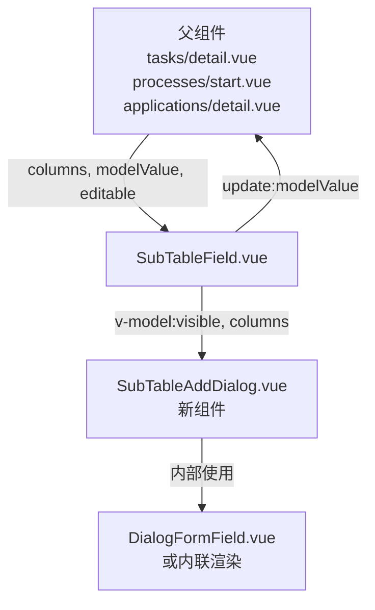

# Design Document: Sub Table Add Dialog

## Overview

本功能将 Sub Table 的行数据录入方式从"直接插入空行"改为"弹出 Dialog 填写后提交"。核心变更集中在 `SubTableField.vue` 组件（user-portal 和 developer-workstation 各一份），以及 FormDesigner 的 Preview 逻辑。

**变更范围：**
- `frontend/user-portal/src/components/SubTableField.vue` — 主要改动点
- `frontend/developer-workstation/src/components/designer/SubTableField.vue` — 同步改动
- `frontend/developer-workstation/src/components/designer/FormDesigner.vue` — Preview 中的 Sub Table 逻辑

**不变范围：**
- `FormRenderer.vue` — 主表单渲染逻辑不变
- 所有调用 `SubTableField` 的父组件（`tasks/detail.vue`、`processes/start.vue`、`applications/detail.vue`）— 接口不变，无需修改

---

## Architecture

### 当前架构

```
SubTableField
  ├── Add 按钮 → handleAdd() → 直接 push 空行到 rows，进入行内编辑模式
  └── 行内编辑（editingRow 状态）
```

### 目标架构

```
SubTableField
  ├── Add 按钮 → handleAdd() → 打开 SubTableAddDialog
  ├── SubTableAddDialog（新组件）
  │     ├── 根据 columns prop 动态渲染表单字段
  │     ├── Save → 校验 → emit('save', rowData) → 关闭
  │     └── Cancel → 关闭，不修改数据
  └── 行内编辑（editingRow 状态）— 保留，用于 Edit 操作
```

### 组件关系图



---

## Components and Interfaces

### 1. SubTableAddDialog.vue（新组件）

**位置：**
- `frontend/user-portal/src/components/SubTableAddDialog.vue`
- `frontend/developer-workstation/src/components/designer/SubTableAddDialog.vue`

**Props：**

```typescript
interface SubTableAddDialogProps {
  visible: boolean           // 控制显示/隐藏
  columns: DialogColumn[]    // 字段配置（来自 SubTableField 的 columns prop）
  title?: string             // Dialog 标题，默认 "Add Record"
}
```

**Emits：**

```typescript
interface SubTableAddDialogEmits {
  'update:visible': (val: boolean) => void   // 关闭 dialog
  'save': (rowData: Record<string, any>) => void  // 提交数据
}
```

**DialogColumn 类型扩展：**

现有 `Column` 类型需扩展以支持所有 10 种控件：

```typescript
interface DialogColumn {
  field: string
  label: string
  type?: ColumnType
  required?: boolean
  placeholder?: string
  minWidth?: number
  props?: {
    // 通用
    action?: string          // upload: 上传地址
    accept?: string          // upload: 文件类型
    fileNameTargetField?: string  // upload: 文件名回填字段
    // 选择类
    options?: Array<{ label: string; value: any }>  // select/radio/checkbox
    multiple?: boolean       // select: 多选
    // 数字类
    precision?: number       // number: 小数位
    min?: number
    max?: number
    // 文本类
    rows?: number            // textarea: 行数
    maxlength?: number
    // 人员/部门
    userType?: 'user' | 'department'
    [key: string]: any
  }
}

type ColumnType =
  | 'text'       // varchar(255), 无特殊子类型
  | 'textarea'   // text
  | 'number'     // int4 / numeric
  | 'select'     // varchar/int4 单选子类型（下拉）
  | 'radio'      // varchar/int4 单选子类型（单选按钮）
  | 'checkbox'   // varchar[] 多选
  | 'switch'     // bool
  | 'date'       // date
  | 'datetime'   // timestamp
  | 'upload'     // varchar 文件/图片子类型
  | 'user'       // varchar 人员子类型
  | 'department' // varchar 部门子类型
```

### 2. SubTableField.vue（修改）

**变更点：**

1. 移除 `handleAdd` 中直接插入空行的逻辑
2. 新增 `dialogVisible` ref 控制 Dialog 显示
3. `handleAdd` 改为打开 Dialog
4. 新增 `handleDialogSave(rowData)` 方法，将数据追加到 rows 并 emit

```typescript
// 新增状态
const dialogVisible = ref(false)

// 修改后的 handleAdd
function handleAdd() {
  dialogVisible.value = true
}

// 新增 handleDialogSave
function handleDialogSave(rowData: Record<string, any>) {
  rows.value.push(rowData)
  emit('update:modelValue', [...rows.value])
}
```

**Column 类型扩展：** 与 `DialogColumn` 保持一致，向后兼容（原有 `'text' | 'number' | 'date' | 'upload'` 类型继续支持）。

### 3. FormDesigner.vue Preview（修改）

FormDesigner 的 Preview 中，Sub Table 的 Add 按钮当前直接 `push({})` 到 `previewTableRows`。需要改为同样弹出 Dialog。

**变更点：**
- 在 Preview Dialog 内引入 `SubTableAddDialog`
- 每个 sub binding 维护独立的 `previewDialogVisible` 状态

---

## Data Models

### 行数据模型

Dialog 提交的 `rowData` 是一个普通对象，key 为 `column.field`，value 为用户输入值：

```typescript
type RowData = Record<string, any>
// 示例：
// { item_name: "Widget", quantity: 5, unit_price: 9.99, is_active: true }
```

### 字段初始值规则

| ColumnType | 初始值 |
|---|---|
| `number` | `undefined`（让 el-input-number 显示 placeholder）|
| `switch` | `false` |
| `checkbox` | `[]` |
| `date` / `datetime` | `null` |
| 其他 | `''` |

### 校验规则

Dialog 内使用 Element Plus `el-form` 的 `rules` 机制：

```typescript
// 从 columns 生成 rules
function buildRules(columns: DialogColumn[]): FormRules {
  const rules: FormRules = {}
  columns.forEach(col => {
    if (col.required) {
      rules[col.field] = [{
        required: true,
        message: `${col.label} is required`,
        trigger: col.type === 'select' || col.type === 'date' ? 'change' : 'blur'
      }]
    }
  })
  return rules
}
```

### 控件类型映射

`deriveColumnsFromBinding` 中已有从 form-create rule type 到 Column type 的映射。新增对更多类型的支持：

| form-create rule.type | props 条件 | DialogColumn.type |
|---|---|---|
| `input` | 无 / `props.type !== 'textarea'` | `text` |
| `input` | `props.type === 'textarea'` | `textarea` |
| `inputNumber` | — | `number` |
| `select` | `props.multiple !== true` | `select` |
| `select` | `props.multiple === true` | `checkbox` |
| `radio` | — | `radio` |
| `switch` | — | `switch` |
| `datePicker` | `props.type === 'date'` | `date` |
| `datePicker` | `props.type === 'datetime'` | `datetime` |
| `upload` | — | `upload` |
| `userSelect` / `user` | — | `user` |
| `departmentSelect` / `department` | — | `department` |

---

## Correctness Properties

*A property is a characteristic or behavior that should hold true across all valid executions of a system — essentially, a formal statement about what the system should do. Properties serve as the bridge between human-readable specifications and machine-verifiable correctness guarantees.*

### Property 1: Cancel preserves table state

*For any* sub-table with any number of existing rows, opening the Add Dialog and then canceling (without saving) should leave the row count and all row data completely unchanged.

**Validates: Requirements 1.4, 2.1**

### Property 2: Dialog form mirrors column configuration

*For any* array of column configurations, the Dialog Form should render exactly one form field per column, in the same order, with matching field key, label, required flag, and placeholder.

**Validates: Requirements 3.1, 3.2, 3.4**

### Property 3: Control type mapping is correct

*For any* column configuration with a given `type` value, the rendered control in the Dialog Form should be the correct Element Plus component corresponding to that type (text → el-input, number → el-input-number, switch → el-switch, date → el-date-picker[date], datetime → el-date-picker[datetime], select → el-select, checkbox → el-checkbox-group, upload → el-upload, etc.).

**Validates: Requirements 4.1, 4.2, 4.3, 4.4, 4.5, 4.6, 4.7, 4.8, 4.9, 4.10**

### Property 4: Valid save appends exactly one row

*For any* sub-table with N rows and any valid row data (all required fields filled), clicking Save should result in the table having exactly N+1 rows, with the new row appended at the end containing the submitted data.

**Validates: Requirements 5.2, 5.3**

### Property 5: Invalid save does not modify table

*For any* sub-table state and any form submission where at least one required field is empty or a validation rule fails, clicking Save should not append any row to the table, and the table should remain unchanged.

**Validates: Requirements 5.4, 5.5**

---

## Error Handling

| 场景 | 处理方式 |
|---|---|
| 必填字段为空时点击 Save | el-form 校验失败，显示每个字段的错误提示，Dialog 不关闭 |
| 文件上传失败 | ElMessage.error 提示，upload 字段值保持为空 |
| columns 为空数组 | Dialog 显示空表单，Save 直接追加空行（与原行为一致）|
| 网络错误（upload） | 捕获 on-error 回调，显示错误消息 |

---

## Testing Strategy

### 单元测试（Unit Tests）

针对具体示例和边界情况：

1. **`buildRules` 函数** — 验证从 columns 生成的 el-form rules 正确包含 required 规则
2. **`buildInitialRow` 函数** — 验证各类型字段的初始值正确
3. **`deriveColumnsFromBinding` 扩展** — 验证新增类型（textarea、select、checkbox、datetime、user、department）的映射正确
4. **Cancel 行为** — 点击 Cancel 后 `dialogVisible` 为 false，rows 不变
5. **Save 成功** — 提交有效数据后 rows 增加一条，dialog 关闭

### 属性测试（Property-Based Tests）

使用 `fast-check`（developer-workstation 和 user-portal 均已安装）：

**配置：** 每个属性测试最少运行 100 次迭代。

**Property 1 实现：**
```typescript
// Feature: sub-table-add-dialog, Property 1: Cancel preserves table state
fc.assert(fc.property(
  fc.array(fc.record({ field1: fc.string(), field2: fc.integer() })),
  (existingRows) => {
    // 模拟：打开 dialog，取消，验证 rows 不变
    const rows = [...existingRows]
    const rowsBefore = JSON.stringify(rows)
    // cancelDialog() — 不修改 rows
    expect(JSON.stringify(rows)).toBe(rowsBefore)
  }
), { numRuns: 100 })
```

**Property 2 实现：**
```typescript
// Feature: sub-table-add-dialog, Property 2: Dialog form mirrors column configuration
fc.assert(fc.property(
  fc.array(fc.record({
    field: fc.string({ minLength: 1 }),
    label: fc.string({ minLength: 1 }),
    required: fc.boolean(),
    type: fc.constantFrom('text', 'number', 'switch', 'date')
  }), { minLength: 1 }),
  (columns) => {
    const rules = buildRules(columns)
    const initialRow = buildInitialRow(columns)
    // 验证每个 required 字段都有对应 rule
    columns.filter(c => c.required).forEach(c => {
      expect(rules[c.field]).toBeDefined()
      expect(rules[c.field][0].required).toBe(true)
    })
    // 验证 initialRow 包含所有字段
    columns.forEach(c => {
      expect(Object.keys(initialRow)).toContain(c.field)
    })
  }
), { numRuns: 100 })
```

**Property 3 实现：**
```typescript
// Feature: sub-table-add-dialog, Property 3: Control type mapping is correct
fc.assert(fc.property(
  fc.record({
    type: fc.constantFrom('text', 'textarea', 'number', 'select', 'checkbox', 'switch', 'date', 'datetime', 'upload', 'radio'),
    field: fc.string({ minLength: 1 }),
    label: fc.string({ minLength: 1 })
  }),
  (column) => {
    const controlType = resolveControlComponent(column)
    expect(controlType).toBeDefined()
    expect(CONTROL_TYPE_MAP[column.type]).toBe(controlType)
  }
), { numRuns: 100 })
```

**Property 4 实现：**
```typescript
// Feature: sub-table-add-dialog, Property 4: Valid save appends exactly one row
fc.assert(fc.property(
  fc.array(fc.record({ id: fc.integer() })),
  fc.record({ name: fc.string({ minLength: 1 }), value: fc.integer() }),
  (existingRows, newRowData) => {
    const rows = [...existingRows]
    const nBefore = rows.length
    // handleDialogSave(newRowData)
    rows.push(newRowData)
    expect(rows.length).toBe(nBefore + 1)
    expect(rows[rows.length - 1]).toEqual(newRowData)
  }
), { numRuns: 100 })
```

**Property 5 实现：**
```typescript
// Feature: sub-table-add-dialog, Property 5: Invalid save does not modify table
fc.assert(fc.property(
  fc.array(fc.record({ id: fc.integer() })),
  fc.array(fc.record({
    field: fc.string({ minLength: 1 }),
    label: fc.string({ minLength: 1 }),
    required: fc.constant(true)
  }), { minLength: 1 }),
  (existingRows, requiredColumns) => {
    const rows = [...existingRows]
    const nBefore = rows.length
    // 提交空数据（所有 required 字段为空）
    const emptyData: Record<string, any> = {}
    requiredColumns.forEach(c => { emptyData[c.field] = '' })
    const isValid = validateRow(emptyData, requiredColumns)
    if (!isValid) {
      // 不追加行
      expect(rows.length).toBe(nBefore)
    }
  }
), { numRuns: 100 })
```

**测试文件位置：**
- `frontend/user-portal/src/components/__tests__/SubTableAddDialog.property.test.ts`
- `frontend/developer-workstation/src/components/designer/__tests__/SubTableAddDialog.property.test.ts`
