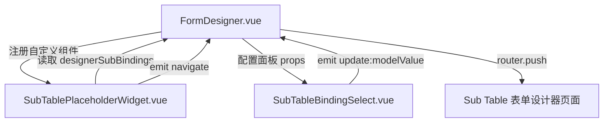

# 设计文档：Sub Table 占位符组件增强

## 概述

本功能在表单设计器（FormDesigner）中增强 Sub Table 占位符组件（SubTablePlaceholderWidget）的视觉展示、绑定配置和导航能力。

**背景：** `sub-table-position-control` 功能已在 `config_json.rule` 中引入了 `type: "subTable"` 占位符条目，并通过 `_bindingId` 关联 `dw_form_table_bindings`。但在 FormDesigner 画布上，该占位符的视觉呈现过于简陋，设计者无法直观看到对应的 Sub Table 名称，也无法快速跳转到对应 Sub Table 的表单设计器页面。

**本功能的变更范围：**
- `frontend/developer-workstation/src/components/designer/FormDesigner.vue` — 主要改动点（画布组件、配置面板、保存验证、跳转逻辑）
- `frontend/developer-workstation/src/components/designer/SubTablePlaceholderWidget.vue` — 新增组件，用于在画布上渲染占位符
- `frontend/developer-workstation/src/components/designer/SubTableBindingSelect.vue` — 新增组件，用于配置面板的绑定下拉选择器

**不变范围：**
- `FormRenderer.vue` — 运行时渲染逻辑不变
- `user-portal` 侧所有组件 — 本功能仅影响 FormDesigner 侧
- `config_json` 数据结构 — 不引入新字段，完全兼容 `sub-table-position-control` 规范

---

## 架构

### 现有架构（sub-table-position-control 之后）

```
FormDesigner 画布
  └── subTable rule 条目
        └── 简陋占位符（仅显示 "Sub-Table" 标签 + binding ID 数字）
              └── 配置面板：_bindingId 数字输入框（无可读性）
```

### 目标架构

```
FormDesigner 画布
  └── subTable rule 条目
        └── SubTablePlaceholderWidget（增强组件）
              ├── 已绑定：显示 tableName / tableDescription + 跳转按钮
              ├── 未配置：显示"未选择 Sub Table"提示
              └── 绑定失效：显示"绑定已失效"警告标识

配置面板（右侧）
  └── SubTableBindingSelect（下拉选择器）
        ├── 选项：designerSubBindings 列表（"名称（描述）"格式）
        ├── 选择 → 写入 _bindingId
        ├── 清除 → _bindingId = null
        └── 空状态：显示"暂无可用 Sub Table"

保存验证
  └── 扫描 rule 中 _bindingId 为 null 的 subTable 条目 → 阻止保存

跳转导航
  └── 点击跳转按钮 → router.push({ name: 'SubTableDesigner', params: { bindingId } })
```

### 组件关系图



### 状态流

```
designerSubBindings（从后端加载）
  ↓
SubTablePlaceholderWidget（画布展示）
  ├── 查找 _bindingId → 显示 tableName
  └── 未找到 → 区分 null（未配置）vs 有值（失效）

SubTableBindingSelect（配置面板）
  ├── 选择 → rule._bindingId = selectedId
  └── 清除 → rule._bindingId = null

handleSaveForm（保存时）
  └── 检查 rule.filter(r => r.type === 'subTable' && !r._bindingId)
        └── 有 → ElMessage.error，阻止保存
```

---

## 组件与接口

### 1. SubTablePlaceholderWidget.vue（新增）

**位置：** `frontend/developer-workstation/src/components/designer/SubTablePlaceholderWidget.vue`

**Props：**

```typescript
interface SubTablePlaceholderWidgetProps {
  bindingId: number | null | undefined   // 来自 rule._bindingId
  subBindings: DesignerSubBinding[]      // 来自 FormDesigner 的 designerSubBindings
}
```

**Emits：**

```typescript
interface SubTablePlaceholderWidgetEmits {
  'navigate': (bindingId: number) => void   // 点击跳转按钮时触发
}
```

**内部状态计算：**

```typescript
type PlaceholderState = 'unconfigured' | 'valid' | 'stale'

const state = computed((): PlaceholderState => {
  if (!props.bindingId) return 'unconfigured'
  const found = props.subBindings.find(b => b.id === props.bindingId)
  return found ? 'valid' : 'stale'
})

const displayName = computed(() => {
  if (state.value !== 'valid') return null
  const binding = props.subBindings.find(b => b.id === props.bindingId)!
  return binding.tableDescription
    ? `${binding.tableName}（${binding.tableDescription}）`
    : binding.tableName
})
```

**模板结构：**

```html
<div class="sub-table-placeholder-widget" :class="[`is-${state}`]">
  <!-- 图标 + 状态文字 -->
  <el-icon><Grid /></el-icon>
  <span v-if="state === 'valid'" class="binding-name">{{ displayName }}</span>
  <span v-else-if="state === 'unconfigured'" class="hint-text">未选择 Sub Table</span>
  <el-tag v-else type="warning" size="small">绑定已失效</el-tag>

  <!-- 跳转按钮（仅 valid 状态显示） -->
  <el-button
    v-if="state === 'valid'"
    link
    type="primary"
    size="small"
    class="navigate-btn"
    @click.stop="emit('navigate', bindingId!)"
  >
    <el-icon><ArrowRight /></el-icon>
  </el-button>
</div>
```

**样式规范：**

| 状态 | 边框颜色 | 背景色 | 说明 |
|---|---|---|---|
| `unconfigured` | `#dcdfe6`（灰色） | `#f5f7fa` | 未选择绑定 |
| `valid` | `#409eff`（蓝色） | `#ecf5ff` | 已绑定有效 |
| `stale` | `#e6a23c`（橙色） | `#fdf6ec` | 绑定已失效 |

### 2. SubTableBindingSelect.vue（新增）

**位置：** `frontend/developer-workstation/src/components/designer/SubTableBindingSelect.vue`

**Props：**

```typescript
interface SubTableBindingSelectProps {
  modelValue: number | null
  subBindings: DesignerSubBinding[]
}
```

**Emits：**

```typescript
interface SubTableBindingSelectEmits {
  'update:modelValue': (val: number | null) => void
}
```

**模板结构：**

```html
<el-select
  :model-value="modelValue"
  clearable
  placeholder="请选择 Sub Table"
  @change="emit('update:modelValue', $event ?? null)"
>
  <el-option
    v-for="b in subBindings"
    :key="b.id"
    :value="b.id"
    :label="b.tableDescription ? `${b.tableName}（${b.tableDescription}）` : b.tableName"
  />
  <template v-if="subBindings.length === 0" #empty>
    <span class="el-select-dropdown__empty">暂无可用 Sub Table</span>
  </template>
</el-select>
```

### 3. FormDesigner.vue（修改）

#### 3a. 注册 SubTablePlaceholderWidget

在 `fc-designer` 挂载前，通过 `@form-create/element-ui` v3 的自定义组件 API 注册 `subTable` 类型：

```typescript
import SubTablePlaceholderWidget from './SubTablePlaceholderWidget.vue'

// 在 designerConfig 中注册自定义渲染组件
const designerConfig = {
  // ...existing config...
  componentMap: {
    subTable: SubTablePlaceholderWidget
  }
}
```

#### 3b. 配置面板 props 注册

在 `designerConfig.menu` 的 `subTable` 条目中，将 `_bindingId` 的配置项类型改为使用 `SubTableBindingSelect`：

```typescript
{
  label: 'Sub Table 绑定',
  field: '_bindingId',
  type: 'subTableBindingSelect',   // 自定义配置控件类型
  props: {
    subBindings: []   // 由 FormDesigner 动态注入 designerSubBindings
  }
}
```

#### 3c. 重复绑定检测

在配置面板选择绑定时，检测是否已有其他占位符使用了相同的 `_bindingId`：

```typescript
const checkDuplicateBinding = (selectedId: number, currentRuleIndex: number): boolean => {
  const rule = designerRef.value.getRule()
  return rule.some((r: any, idx: number) =>
    idx !== currentRuleIndex && r.type === 'subTable' && r._bindingId === selectedId
  )
}
```

若检测到重复，在配置面板显示警告提示（不阻止选择，仅警告）。

#### 3d. 跳转导航处理

监听 `SubTablePlaceholderWidget` 的 `navigate` 事件：

```typescript
const handleSubTableNavigate = (bindingId: number) => {
  router.push({
    name: 'SubTableFormDesigner',   // 对应 Sub Table 表单设计器路由名称
    params: { bindingId: String(bindingId) }
  })
}
```

#### 3e. 保存验证增强

在现有 `handleSaveForm` 的验证逻辑中，补充对 `_bindingId` 为 null 的检查（`sub-table-position-control` 已有此逻辑，本功能确保其存在并完整）：

```typescript
const rule = designerRef.value.getRule()
const invalidPlaceholders = rule.filter(
  (r: any) => r.type === 'subTable' && (r._bindingId == null)
)
if (invalidPlaceholders.length > 0) {
  ElMessage.error(t('form.subTableBindingRequired'))
  return
}
```

### 4. DesignerSubBinding 类型

`designerSubBindings` 中每条记录的类型（已存在于 FormDesigner，本功能明确其接口）：

```typescript
interface DesignerSubBinding {
  id: number
  tableName: string
  tableDescription: string
  bindingType: string
}
```

---

## 数据模型

### SubTablePlaceholder rule 条目（config_json.rule，不变）

```json
{
  "type": "subTable",
  "_bindingId": 42,
  "title": "Sub-Table",
  "props": {}
}
```

本功能不引入任何新字段，与 `sub-table-position-control` 规范完全一致。

### 占位符状态枚举

```typescript
type PlaceholderState =
  | 'unconfigured'   // _bindingId 为 null/undefined
  | 'valid'          // _bindingId 有值且在 designerSubBindings 中存在
  | 'stale'          // _bindingId 有值但在 designerSubBindings 中不存在
```

### 配置面板绑定选项格式

```typescript
// 下拉选项的显示格式
const formatBindingLabel = (b: DesignerSubBinding): string =>
  b.tableDescription ? `${b.tableName}（${b.tableDescription}）` : b.tableName
```

### 路由跳转参数

```typescript
// 跳转到 Sub Table 表单设计器页面
router.push({
  name: 'SubTableFormDesigner',
  params: { bindingId: String(bindingId) }
})
// 在当前窗口内导航，不使用 window.open
```

---

## 正确性属性

*属性（Property）是在系统所有有效执行中都应成立的特征或行为——本质上是对系统应做什么的形式化陈述。属性是人类可读规范与机器可验证正确性保证之间的桥梁。*

### Property Reflection（冗余消除）

在写出最终属性前，对 prework 中识别的可测试项进行冗余分析：

- 1.1（显示名称）与 1.4（响应式更新）均测试 `displayName` 计算属性，合并为 Property 1。
- 1.2（未配置状态）、5.2（stale 状态）、5.3（状态区分）均测试 `state` 计算属性的三种分支，合并为 Property 2。
- 2.3（选择写入）与 2.4（清除为 null）是互补的 round-trip，合并为 Property 3。
- 3.1（有效时显示跳转）与 3.3（无效时隐藏跳转）合并为 Property 4。
- 4.2（拖拽插入结构）与 4.3（多实例独立）合并为 Property 5。
- 4.4（保存序列化）与 6.3（加载兼容）均为 round-trip，合并为 Property 6。
- 2.2（格式化标签）、2.5（保存验证）、5.1（重复检测）各自独立保留。

### Property 1：displayName 反映当前 subBindings 列表

*对任意* `designerSubBindings` 列表和其中存在的任意 `bindingId`，`SubTablePlaceholderWidget` 计算出的 `displayName` 应包含对应 binding 的 `tableName`；当 `tableDescription` 非空时，`displayName` 还应包含 `tableDescription`。

**Validates: Requirements 1.1, 1.4**

### Property 2：占位符状态计算覆盖三种分支

*对任意* `designerSubBindings` 列表和任意 `bindingId` 值：
- 当 `bindingId` 为 `null` 或 `undefined` 时，`state` 应为 `'unconfigured'`
- 当 `bindingId` 有值且在列表中存在时，`state` 应为 `'valid'`
- 当 `bindingId` 有值但在列表中不存在时，`state` 应为 `'stale'`

**Validates: Requirements 1.2, 5.2, 5.3**

### Property 3：绑定选择的 round-trip

*对任意* 有效的 `bindingId`（正整数），通过 `SubTableBindingSelect` 选择该 id 后，对应 rule 条目的 `_bindingId` 应等于所选 id；清除选择后，`_bindingId` 应为 `null`。

**Validates: Requirements 2.3, 2.4**

### Property 4：跳转按钮可见性与 state 一致

*对任意* `SubTablePlaceholderWidget` 实例，当 `state === 'valid'` 时跳转按钮应可见且可点击；当 `state` 为 `'unconfigured'` 或 `'stale'` 时，跳转按钮应不可见或被禁用。

**Validates: Requirements 3.1, 3.3**

### Property 5：拖拽插入产生正确结构且多实例独立

*对任意* 数量（≥1）的 Sub Table 占位符拖拽操作，每次插入应在 rule 数组中新增一个 `{ type: "subTable", _bindingId: null }` 条目；各条目的 `_bindingId` 可独立设置为不同的值，互不影响。

**Validates: Requirements 4.2, 4.3**

### Property 6：_bindingId 序列化与加载的 round-trip

*对任意* 包含一个或多个 `subTable` rule 条目（各有不同 `_bindingId`）的表单配置，保存后再加载，每个条目的 `_bindingId` 值应与保存前完全一致，不丢失数据。

**Validates: Requirements 4.4, 6.3**

### Property 7：绑定标签格式化

*对任意* `DesignerSubBinding` 对象，`formatBindingLabel` 函数返回的字符串应始终包含 `tableName`；当 `tableDescription` 非空时，返回字符串还应包含 `tableDescription`。

**Validates: Requirements 2.2**

### Property 8：保存验证阻止未绑定占位符

*对任意* 包含至少一个 `_bindingId` 为 `null` 的 `subTable` rule 条目的表单，`handleSaveForm` 应返回错误（不执行保存），且错误消息应被触发。

**Validates: Requirements 2.5**

### Property 9：重复绑定检测

*对任意* rule 数组，若其中存在两个或多个 `subTable` 条目具有相同的非 null `_bindingId`，`checkDuplicateBinding` 函数应返回 `true`；若所有 `_bindingId` 各不相同，应返回 `false`。

**Validates: Requirements 5.1**

---

## 错误处理

| 场景 | 处理方式 |
|---|---|
| `_bindingId` 为 null（未配置） | SubTablePlaceholderWidget 显示"未选择 Sub Table"提示，跳转按钮隐藏 |
| `_bindingId` 有值但 binding 已删除（stale） | SubTablePlaceholderWidget 显示"绑定已失效"橙色警告标识，跳转按钮隐藏 |
| 保存时存在未绑定占位符 | `handleSaveForm` 调用 `ElMessage.error`，阻止保存，不发送网络请求 |
| 重复绑定（两个占位符绑定同一 Sub Table） | 配置面板显示警告提示，不阻止选择（允许设计者有意为之或后续修正） |
| `designerSubBindings` 为空列表 | 下拉选择器显示"暂无可用 Sub Table"空状态，所有已有 `_bindingId` 的占位符均显示 stale 状态 |
| 跳转目标路由不存在 | 由 Vue Router 的 404 处理逻辑接管，FormDesigner 本身不做额外处理 |
| `SubTablePlaceholderWidget` 的 `navigate` 事件在 stale 状态下被触发 | 不应发生（按钮已隐藏），若通过其他途径触发，FormDesigner 忽略该事件（guard: `if (!bindingId) return`） |

---

## 测试策略

### 双轨测试方法

单元测试和属性测试互补，共同保障正确性：
- 单元测试：覆盖具体示例、集成点和边界情况
- 属性测试：通过随机输入验证通用正确性属性

### 单元测试

聚焦具体示例和边界情况：

1. `SubTablePlaceholderWidget` — `_bindingId: null` 时渲染"未选择 Sub Table"文字
2. `SubTablePlaceholderWidget` — `_bindingId` 有值且在列表中时渲染 tableName
3. `SubTablePlaceholderWidget` — `_bindingId` 有值但不在列表中时渲染"绑定已失效"标签
4. `SubTablePlaceholderWidget` — `state === 'valid'` 时跳转按钮可见，点击触发 `navigate` emit
5. `SubTablePlaceholderWidget` — `state !== 'valid'` 时跳转按钮不可见
6. `SubTableBindingSelect` — `subBindings` 为空时显示空状态提示
7. `formatBindingLabel` — 有 `tableDescription` 时返回 `"名称（描述）"` 格式
8. `formatBindingLabel` — 无 `tableDescription` 时仅返回 `tableName`
9. `checkDuplicateBinding` — 两个相同 `_bindingId` 时返回 `true`
10. `handleSaveForm` — 存在 `_bindingId: null` 的 subTable 条目时阻止保存并显示错误

### 属性测试（Property-Based Tests）

使用 `fast-check`（developer-workstation 已安装）。每个属性测试最少运行 100 次迭代。

**测试文件位置：**
- `frontend/developer-workstation/src/components/designer/__tests__/SubTablePlaceholderWidget.property.test.ts`
- `frontend/developer-workstation/src/components/designer/__tests__/FormDesigner.subTablePlaceholder.property.test.ts`

**Property 1 实现：**
```typescript
// Feature: sub-table-placeholder-component, Property 1: displayName 反映当前 subBindings 列表
fc.assert(fc.property(
  fc.array(fc.record({
    id: fc.integer({ min: 1, max: 9999 }),
    tableName: fc.string({ minLength: 1 }),
    tableDescription: fc.oneof(fc.string(), fc.constant(''))
  }), { minLength: 1 }),
  fc.nat({ max: 99 }),  // index into array
  (bindings, idx) => {
    const uniqueBindings = [...new Map(bindings.map(b => [b.id, b])).values()]
    if (uniqueBindings.length === 0) return
    const target = uniqueBindings[idx % uniqueBindings.length]
    const label = formatBindingLabel(target)
    expect(label).toContain(target.tableName)
    if (target.tableDescription) {
      expect(label).toContain(target.tableDescription)
    }
  }
), { numRuns: 100 })
```

**Property 2 实现：**
```typescript
// Feature: sub-table-placeholder-component, Property 2: 占位符状态计算覆盖三种分支
fc.assert(fc.property(
  fc.array(fc.record({ id: fc.integer({ min: 1, max: 9999 }), tableName: fc.string({ minLength: 1 }), tableDescription: fc.string() })),
  fc.oneof(fc.constant(null), fc.constant(undefined), fc.integer({ min: 1, max: 9999 })),
  (subBindings, bindingId) => {
    const state = computePlaceholderState(bindingId, subBindings)
    if (bindingId == null) {
      expect(state).toBe('unconfigured')
    } else if (subBindings.some(b => b.id === bindingId)) {
      expect(state).toBe('valid')
    } else {
      expect(state).toBe('stale')
    }
  }
), { numRuns: 100 })
```

**Property 3 实现：**
```typescript
// Feature: sub-table-placeholder-component, Property 3: 绑定选择的 round-trip
fc.assert(fc.property(
  fc.integer({ min: 1, max: 9999 }),
  (bindingId) => {
    const rule: any = { type: 'subTable', _bindingId: null }
    // 模拟选择
    rule._bindingId = bindingId
    expect(rule._bindingId).toBe(bindingId)
    // 模拟清除
    rule._bindingId = null
    expect(rule._bindingId).toBeNull()
  }
), { numRuns: 100 })
```

**Property 6 实现：**
```typescript
// Feature: sub-table-placeholder-component, Property 6: _bindingId 序列化与加载的 round-trip
fc.assert(fc.property(
  fc.array(fc.integer({ min: 1, max: 9999 }), { minLength: 1, maxLength: 5 }),
  (bindingIds) => {
    const rules = bindingIds.map(id => ({ type: 'subTable', _bindingId: id, title: 'Sub-Table', props: {} }))
    const serialized = JSON.stringify({ rule: rules })
    const loaded = JSON.parse(serialized)
    loaded.rule.forEach((r: any, i: number) => {
      expect(r._bindingId).toBe(bindingIds[i])
    })
  }
), { numRuns: 100 })
```

**Property 8 实现：**
```typescript
// Feature: sub-table-placeholder-component, Property 8: 保存验证阻止未绑定占位符
fc.assert(fc.property(
  fc.array(fc.integer({ min: 1, max: 9999 }), { maxLength: 4 }),
  (validIds) => {
    // 在有效条目中混入一个 _bindingId: null 的条目
    const rules = [
      ...validIds.map(id => ({ type: 'subTable', _bindingId: id })),
      { type: 'subTable', _bindingId: null }
    ]
    const invalid = rules.filter((r: any) => r.type === 'subTable' && r._bindingId == null)
    expect(invalid.length).toBeGreaterThan(0)
    // 验证逻辑应检测到并阻止保存
    const shouldBlock = invalid.length > 0
    expect(shouldBlock).toBe(true)
  }
), { numRuns: 100 })
```

**Property 9 实现：**
```typescript
// Feature: sub-table-placeholder-component, Property 9: 重复绑定检测
fc.assert(fc.property(
  fc.integer({ min: 1, max: 9999 }),
  fc.array(fc.integer({ min: 1, max: 9999 }), { maxLength: 4 }),
  (duplicateId, otherIds) => {
    // 构造包含重复 id 的 rule 数组
    const rules = [
      { type: 'subTable', _bindingId: duplicateId },
      { type: 'subTable', _bindingId: duplicateId },
      ...otherIds.map(id => ({ type: 'subTable', _bindingId: id }))
    ]
    const hasDuplicate = checkDuplicateBindings(rules)
    expect(hasDuplicate).toBe(true)

    // 构造无重复的 rule 数组
    const uniqueIds = [...new Set([duplicateId, ...otherIds])]
    const uniqueRules = uniqueIds.map(id => ({ type: 'subTable', _bindingId: id }))
    const noDuplicate = checkDuplicateBindings(uniqueRules)
    expect(noDuplicate).toBe(false)
  }
), { numRuns: 100 })
```
