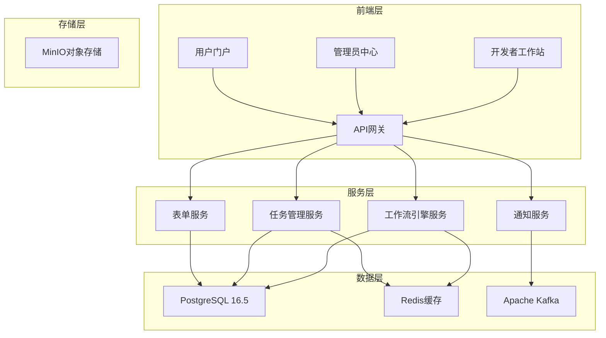
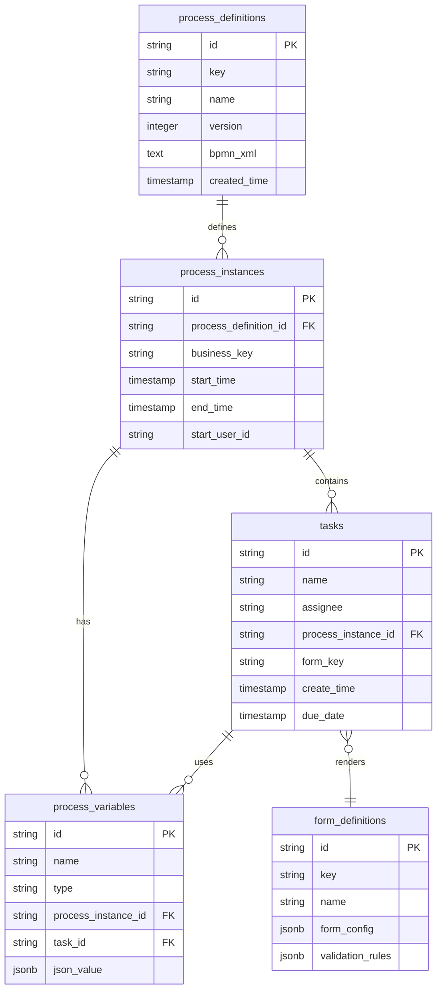

# 工作流引擎核心设计文档

## 概述

工作流引擎核心基于Flowable 7.0.0构建，采用Spring Boot 3.x + Java 17微服务架构，为低代码工作流平台提供强大的BPMN 2.0流程执行能力。本设计文档详细描述了系统的架构设计、核心组件、数据模型和集成方案。

### 设计目标

- **高性能**: 支持100 TPS处理能力，响应时间小于1秒
- **高可用**: 99.5%可用性，支持故障自动恢复
- **可扩展**: 支持水平扩展和微服务架构
- **标准化**: 完全兼容BPMN 2.0国际标准
- **企业级**: 支持RBAC权限、审计日志、数据加密

## 架构设计

### 整体架构



### 微服务架构

系统采用领域驱动设计(DDD)，按业务域拆分为以下微服务：

#### 1. 工作流引擎服务 (Workflow Engine Service)
- **职责**: 流程定义管理、流程实例执行、BPMN解析
- **端口**: 8080
- **数据库**: workflow_engine schema
- **依赖**: Redis缓存、Kafka消息队列

#### 2. 任务管理服务 (Task Management Service)  
- **职责**: 任务分配、任务处理、任务查询
- **端口**: 8081
- **数据库**: task_management schema
- **依赖**: 工作流引擎服务、表单服务

#### 3. 表单服务 (Form Service)
- **职责**: 动态表单渲染、表单数据验证、Form-Create集成
- **端口**: 8082
- **数据库**: form_definition schema
- **依赖**: MinIO对象存储

#### 4. 通知服务 (Notification Service)
- **职责**: 消息通知、事件发布、邮件发送
- **端口**: 8083
- **数据库**: notification schema
- **依赖**: Kafka消息队列、邮件服务器

## 组件和接口

### 核心组件设计

#### 1. 流程引擎组件 (ProcessEngineComponent)

```java
@Component
public class ProcessEngineComponent {
    
    @Autowired
    private ProcessEngine processEngine;
    
    @Autowired
    private RepositoryService repositoryService;
    
    @Autowired
    private RuntimeService runtimeService;
    
    /**
     * 部署流程定义
     */
    public DeploymentResult deployProcess(ProcessDefinitionRequest request) {
        // 验证BPMN文件
        // 创建部署
        // 返回部署结果
    }
    
    /**
     * 启动流程实例
     */
    public ProcessInstanceResult startProcess(StartProcessRequest request) {
        // 验证流程定义
        // 初始化流程变量
        // 启动流程实例
        // 发布流程启动事件
    }
}
```

#### 2. 任务管理组件 (TaskManagerComponent)

```java
@Component
public class TaskManagerComponent {
    
    @Autowired
    private TaskService taskService;
    
    @Autowired
    private FormService formService;
    
    @Autowired
    private UserService userService;
    
    @Autowired
    private VirtualGroupService virtualGroupService;
    
    @Autowired
    private DepartmentService departmentService;
    
    /**
     * 查询用户待办任务（包括直接分配和委托的任务）
     */
    public TaskListResult getUserTasks(String userId, TaskQueryRequest request) {
        // 查询直接分配给用户的任务
        List<Task> directTasks = taskService.createTaskQuery()
            .taskAssignee(userId)
            .list();
            
        // 查询委托给用户的任务
        List<Task> delegatedTasks = taskService.createTaskQuery()
            .taskDelegatedTo(userId)
            .list();
            
        // 查询用户所属虚拟组的任务
        List<String> userVirtualGroups = virtualGroupService.getUserVirtualGroups(userId);
        List<Task> virtualGroupTasks = new ArrayList<>();
        for (String groupId : userVirtualGroups) {
            virtualGroupTasks.addAll(taskService.createTaskQuery()
                .taskCandidateGroup(groupId)
                .list());
        }
        
        // 查询用户部门角色的任务
        List<Task> departmentRoleTasks = getDepartmentRoleTasks(userId);
        
        // 合并所有任务并去重
        Set<Task> allTasks = new HashSet<>();
        allTasks.addAll(directTasks);
        allTasks.addAll(delegatedTasks);
        allTasks.addAll(virtualGroupTasks);
        allTasks.addAll(departmentRoleTasks);
        
        return TaskListResult.builder()
            .tasks(new ArrayList<>(allTasks))
            .totalCount(allTasks.size())
            .build();
    }
    
    /**
     * 分配任务（支持多种分配类型）
     */
    public TaskAssignmentResult assignTask(String taskId, TaskAssignmentRequest request) {
        Task task = taskService.createTaskQuery().taskId(taskId).singleResult();
        
        switch (request.getAssignmentType()) {
            case USER:
                // 直接分配给用户
                taskService.setAssignee(taskId, request.getAssignedUserId());
                updateTaskAssignmentInfo(taskId, AssignmentType.USER, 
                    request.getAssignedUserId(), null, null, null);
                break;
                
            case VIRTUAL_GROUP:
                // 分配给虚拟组
                taskService.addCandidateGroup(taskId, request.getAssignedVirtualGroupId());
                updateTaskAssignmentInfo(taskId, AssignmentType.VIRTUAL_GROUP, 
                    null, request.getAssignedVirtualGroupId(), null, null);
                break;
                
            case DEPT_ROLE:
                // 分配给部门的某个角色
                String candidateGroup = buildDeptRoleGroup(
                    request.getAssignedDepartmentId(), 
                    request.getAssignedRoleId());
                taskService.addCandidateGroup(taskId, candidateGroup);
                updateTaskAssignmentInfo(taskId, AssignmentType.DEPT_ROLE, 
                    null, null, request.getAssignedDepartmentId(), request.getAssignedRoleId());
                break;
        }
        
        // 发布任务分配事件
        publishTaskAssignmentEvent(task, request);
        
        return TaskAssignmentResult.success();
    }
    
    /**
     * 委托任务（任何分配类型的任务都可以被委托）
     */
    public TaskDelegationResult delegateTask(String taskId, TaskDelegationRequest request) {
        Task task = taskService.createTaskQuery().taskId(taskId).singleResult();
        
        // 验证委托权限
        validateDelegationPermission(task, request.getDelegatedBy());
        
        // 执行委托
        taskService.delegateTask(taskId, request.getDelegatedTo());
        
        // 更新委托信息
        updateTaskDelegationInfo(taskId, request.getDelegatedBy(), 
            request.getDelegatedTo(), request.getDelegationReason());
        
        // 发布任务委托事件
        publishTaskDelegationEvent(task, request);
        
        return TaskDelegationResult.success();
    }
    
    /**
     * 完成任务（支持委托人代表原分配人完成）
     */
    public TaskCompleteResult completeTask(String taskId, TaskCompleteRequest request) {
        Task task = taskService.createTaskQuery().taskId(taskId).singleResult();
        
        // 验证完成权限（原分配人或委托人都可以完成）
        validateTaskCompletePermission(task, request.getUserId());
        
        // 验证表单数据
        if (task.getFormKey() != null) {
            FormValidationResult validation = formService.validateFormData(
                task.getFormKey(), request.getFormData());
            if (!validation.isValid()) {
                throw new WorkflowValidationException(validation.getErrors());
            }
        }
        
        // 完成任务
        taskService.complete(taskId, request.getFormData());
        
        // 记录完成信息
        recordTaskCompletion(task, request.getUserId(), request.getCompletionComment());
        
        // 发布任务完成事件
        publishTaskCompletionEvent(task, request);
        
        return TaskCompleteResult.success();
    }
    
    private List<Task> getDepartmentRoleTasks(String userId) {
        // 获取用户的部门和角色信息
        UserDepartmentRole userDeptRole = userService.getUserDepartmentRole(userId);
        if (userDeptRole == null) {
            return Collections.emptyList();
        }
        
        // 构建部门角色组标识
        String deptRoleGroup = buildDeptRoleGroup(
            userDeptRole.getDepartmentId(), 
            userDeptRole.getRoleId());
        
        return taskService.createTaskQuery()
            .taskCandidateGroup(deptRoleGroup)
            .list();
    }
    
    private String buildDeptRoleGroup(String departmentId, String roleId) {
        return "DEPT_ROLE:" + departmentId + ":" + roleId;
    }
    
    private void validateDelegationPermission(Task task, String delegatedBy) {
        // 验证委托人是否有权限委托此任务
        // 1. 如果任务直接分配给用户，只有该用户可以委托
        // 2. 如果任务分配给虚拟组，虚拟组成员可以委托
        // 3. 如果任务分配给部门角色，该部门该角色的用户可以委托
    }
    
    private void validateTaskCompletePermission(Task task, String userId) {
        // 验证用户是否有权限完成此任务
        // 1. 原分配人可以完成
        // 2. 委托人可以代表原分配人完成
        // 3. 虚拟组成员可以完成组任务
        // 4. 部门角色用户可以完成角色任务
    }
}
```

#### 3. 表单渲染组件 (FormRendererComponent)

```java
@Component
public class FormRendererComponent {
    
    @Autowired
    private FormDefinitionRepository formDefinitionRepository;
    
    /**
     * 渲染任务表单
     */
    public FormRenderResult renderTaskForm(String taskId) {
        // 获取任务信息
        // 加载表单定义
        // 生成Form-Create配置
        // 填充表单数据
        // 返回表单配置
    }
    
    /**
     * 验证表单数据
     */
    public FormValidationResult validateFormData(String formId, Map<String, Object> formData) {
        // 加载表单验证规则
        // 执行数据验证
        // 返回验证结果
    }
}
```

### API接口设计

#### 1. 流程管理API

```java
@RestController
@RequestMapping("/api/v1/processes")
public class ProcessController {
    
    @PostMapping("/definitions")
    public ResponseEntity<DeploymentResult> deployProcess(@RequestBody ProcessDefinitionRequest request);
    
    @GetMapping("/definitions")
    public ResponseEntity<PageResult<ProcessDefinition>> getProcessDefinitions(@RequestParam ProcessQueryRequest request);
    
    @PostMapping("/instances")
    public ResponseEntity<ProcessInstanceResult> startProcess(@RequestBody StartProcessRequest request);
    
    @GetMapping("/instances/{instanceId}")
    public ResponseEntity<ProcessInstanceDetail> getProcessInstance(@PathVariable String instanceId);
    
    @PutMapping("/instances/{instanceId}/suspend")
    public ResponseEntity<Void> suspendProcessInstance(@PathVariable String instanceId);
    
    @PutMapping("/instances/{instanceId}/activate")
    public ResponseEntity<Void> activateProcessInstance(@PathVariable String instanceId);
}
```

#### 2. 任务管理API

```java
@RestController
@RequestMapping("/api/v1/tasks")
public class TaskController {
    
    @GetMapping("/user/{userId}")
    public ResponseEntity<PageResult<TaskInfo>> getUserTasks(@PathVariable String userId, @RequestParam TaskQueryRequest request);
    
    @PostMapping("/{taskId}/complete")
    public ResponseEntity<TaskCompleteResult> completeTask(@PathVariable String taskId, @RequestBody TaskCompleteRequest request);
    
    @PostMapping("/{taskId}/delegate")
    public ResponseEntity<Void> delegateTask(@PathVariable String taskId, @RequestBody TaskDelegateRequest request);
    
    @PostMapping("/{taskId}/claim")
    public ResponseEntity<Void> claimTask(@PathVariable String taskId, @RequestBody TaskClaimRequest request);
    
    @GetMapping("/{taskId}/form")
    public ResponseEntity<FormRenderResult> getTaskForm(@PathVariable String taskId);
}
```

#### 3. 流程监控API

```java
@RestController
@RequestMapping("/api/v1/monitoring")
public class MonitoringController {
    
    @GetMapping("/statistics")
    public ResponseEntity<ProcessStatistics> getProcessStatistics(@RequestParam StatisticsRequest request);
    
    @GetMapping("/instances/{instanceId}/diagram")
    public ResponseEntity<ProcessDiagramResult> getProcessDiagram(@PathVariable String instanceId);
    
    @GetMapping("/performance")
    public ResponseEntity<PerformanceMetrics> getPerformanceMetrics(@RequestParam PerformanceRequest request);
    
    @GetMapping("/health")
    public ResponseEntity<HealthStatus> getEngineHealth();
}
```

## 数据模型

### 核心数据表设计

#### 1. 流程定义表 (process_definitions)

```sql
CREATE TABLE process_definitions (
    id VARCHAR(64) PRIMARY KEY,
    key VARCHAR(255) NOT NULL,
    name VARCHAR(255) NOT NULL,
    version INTEGER NOT NULL DEFAULT 1,
    category VARCHAR(255),
    description TEXT,
    bpmn_xml TEXT NOT NULL,
    deployment_id VARCHAR(64) NOT NULL,
    resource_name VARCHAR(255),
    diagram_resource_name VARCHAR(255),
    has_start_form_key BOOLEAN DEFAULT FALSE,
    has_graphical_notation BOOLEAN DEFAULT FALSE,
    suspension_state INTEGER DEFAULT 1,
    tenant_id VARCHAR(255),
    created_time TIMESTAMP DEFAULT CURRENT_TIMESTAMP,
    created_by VARCHAR(64),
    updated_time TIMESTAMP DEFAULT CURRENT_TIMESTAMP,
    updated_by VARCHAR(64),
    
    UNIQUE(key, version, tenant_id),
    INDEX idx_process_def_key (key),
    INDEX idx_process_def_category (category),
    INDEX idx_process_def_tenant (tenant_id)
);
```

#### 2. 流程实例表 (process_instances)

```sql
CREATE TABLE process_instances (
    id VARCHAR(64) PRIMARY KEY,
    process_definition_id VARCHAR(64) NOT NULL,
    process_definition_key VARCHAR(255) NOT NULL,
    process_definition_name VARCHAR(255),
    process_definition_version INTEGER,
    business_key VARCHAR(255),
    name VARCHAR(255),
    description TEXT,
    start_time TIMESTAMP NOT NULL,
    end_time TIMESTAMP,
    duration_in_millis BIGINT,
    start_user_id VARCHAR(64),
    start_activity_id VARCHAR(255),
    end_activity_id VARCHAR(255),
    super_process_instance_id VARCHAR(64),
    root_process_instance_id VARCHAR(64),
    suspension_state INTEGER DEFAULT 1,
    tenant_id VARCHAR(255),
    delete_reason VARCHAR(4000),
    
    FOREIGN KEY (process_definition_id) REFERENCES process_definitions(id),
    INDEX idx_proc_inst_def_id (process_definition_id),
    INDEX idx_proc_inst_business_key (business_key),
    INDEX idx_proc_inst_start_user (start_user_id),
    INDEX idx_proc_inst_tenant (tenant_id)
);
```

#### 3. 任务表 (tasks)

```sql
CREATE TABLE tasks (
    id VARCHAR(64) PRIMARY KEY,
    name VARCHAR(255) NOT NULL,
    description TEXT,
    priority INTEGER DEFAULT 50,
    owner VARCHAR(64),
    assignee VARCHAR(64),
    
    -- 任务分配类型：USER(用户), VIRTUAL_GROUP(虚拟组), DEPT_ROLE(部门角色)
    assignment_type VARCHAR(20) NOT NULL DEFAULT 'USER',
    
    -- 分配目标信息
    assigned_user_id VARCHAR(64),           -- 直接分配给用户
    assigned_virtual_group_id VARCHAR(64),  -- 分配给虚拟组
    assigned_department_id VARCHAR(64),     -- 分配给部门
    assigned_role_id VARCHAR(64),           -- 分配给角色（与部门组合使用）
    
    -- 委托信息
    delegation_state VARCHAR(20),           -- PENDING, RESOLVED
    delegated_by VARCHAR(64),               -- 委托人
    delegated_to VARCHAR(64),               -- 被委托人
    delegation_reason TEXT,                 -- 委托原因
    delegation_time TIMESTAMP,              -- 委托时间
    
    process_instance_id VARCHAR(64),
    process_definition_id VARCHAR(64),
    case_instance_id VARCHAR(64),
    case_definition_id VARCHAR(64),
    task_definition_key VARCHAR(255),
    task_definition_id VARCHAR(64),
    form_key VARCHAR(255),
    create_time TIMESTAMP NOT NULL,
    due_date TIMESTAMP,
    follow_up_date TIMESTAMP,
    suspension_state INTEGER DEFAULT 1,
    tenant_id VARCHAR(255),
    execution_id VARCHAR(64),
    activity_instance_id VARCHAR(64),
    parent_task_id VARCHAR(64),
    
    FOREIGN KEY (process_instance_id) REFERENCES process_instances(id),
    INDEX idx_task_assignee (assignee),
    INDEX idx_task_owner (owner),
    INDEX idx_task_assignment_type (assignment_type),
    INDEX idx_task_assigned_user (assigned_user_id),
    INDEX idx_task_assigned_vgroup (assigned_virtual_group_id),
    INDEX idx_task_assigned_dept_role (assigned_department_id, assigned_role_id),
    INDEX idx_task_delegated_to (delegated_to),
    INDEX idx_task_proc_inst (process_instance_id),
    INDEX idx_task_create_time (create_time),
    INDEX idx_task_due_date (due_date)
);
```

#### 4. 流程变量表 (process_variables)

```sql
CREATE TABLE process_variables (
    id VARCHAR(64) PRIMARY KEY,
    name VARCHAR(255) NOT NULL,
    type VARCHAR(100) NOT NULL,
    process_instance_id VARCHAR(64),
    execution_id VARCHAR(64),
    task_id VARCHAR(64),
    case_instance_id VARCHAR(64),
    case_execution_id VARCHAR(64),
    activity_instance_id VARCHAR(64),
    tenant_id VARCHAR(255),
    sequence_counter BIGINT,
    is_concurrent_local BOOLEAN DEFAULT FALSE,
    
    -- 不同类型的值字段
    text_value TEXT,
    text_value2 TEXT,
    double_value DOUBLE PRECISION,
    long_value BIGINT,
    date_value TIMESTAMP,
    
    -- JSON类型变量 (PostgreSQL 16.5 JSON支持)
    json_value JSONB,
    
    created_time TIMESTAMP DEFAULT CURRENT_TIMESTAMP,
    updated_time TIMESTAMP DEFAULT CURRENT_TIMESTAMP,
    
    INDEX idx_variable_name (name),
    INDEX idx_variable_proc_inst (process_instance_id),
    INDEX idx_variable_task (task_id),
    INDEX idx_variable_tenant (tenant_id)
);
```

#### 5. 表单定义表 (form_definitions)

```sql
CREATE TABLE form_definitions (
    id VARCHAR(64) PRIMARY KEY,
    key VARCHAR(255) NOT NULL,
    name VARCHAR(255) NOT NULL,
    version INTEGER NOT NULL DEFAULT 1,
    description TEXT,
    
    -- Form-Create配置 (JSON格式)
    form_config JSONB NOT NULL,
    
    -- 表单验证规则
    validation_rules JSONB,
    
    -- 表单样式配置
    style_config JSONB,
    
    category VARCHAR(255),
    tags VARCHAR(500),
    is_active BOOLEAN DEFAULT TRUE,
    tenant_id VARCHAR(255),
    
    created_time TIMESTAMP DEFAULT CURRENT_TIMESTAMP,
    created_by VARCHAR(64),
    updated_time TIMESTAMP DEFAULT CURRENT_TIMESTAMP,
    updated_by VARCHAR(64),
    
    UNIQUE(key, version, tenant_id),
    INDEX idx_form_def_key (key),
    INDEX idx_form_def_category (category),
    INDEX idx_form_def_active (is_active)
);
```

### 数据关系设计



## 错误处理

### 异常处理策略

#### 1. 异常分类

```java
// 业务异常
public class WorkflowBusinessException extends RuntimeException {
    private final String errorCode;
    private final String errorMessage;
    private final Object[] parameters;
}

// 系统异常  
public class WorkflowSystemException extends RuntimeException {
    private final String errorCode;
    private final Throwable cause;
}

// 验证异常
public class WorkflowValidationException extends RuntimeException {
    private final List<ValidationError> validationErrors;
}
```

#### 2. 全局异常处理

```java
@ControllerAdvice
public class GlobalExceptionHandler {
    
    @ExceptionHandler(WorkflowBusinessException.class)
    public ResponseEntity<ErrorResponse> handleBusinessException(WorkflowBusinessException ex) {
        ErrorResponse error = ErrorResponse.builder()
            .code(ex.getErrorCode())
            .message(ex.getErrorMessage())
            .timestamp(Instant.now())
            .build();
        return ResponseEntity.badRequest().body(error);
    }
    
    @ExceptionHandler(WorkflowValidationException.class)
    public ResponseEntity<ValidationErrorResponse> handleValidationException(WorkflowValidationException ex) {
        ValidationErrorResponse error = ValidationErrorResponse.builder()
            .code("VALIDATION_ERROR")
            .message("数据验证失败")
            .validationErrors(ex.getValidationErrors())
            .timestamp(Instant.now())
            .build();
        return ResponseEntity.badRequest().body(error);
    }
}
```

#### 3. 重试机制

```java
@Component
public class RetryableWorkflowService {
    
    @Retryable(
        value = {DataAccessException.class, TransientException.class},
        maxAttempts = 3,
        backoff = @Backoff(delay = 1000, multiplier = 2)
    )
    public ProcessInstanceResult startProcessWithRetry(StartProcessRequest request) {
        return processEngineComponent.startProcess(request);
    }
    
    @Recover
    public ProcessInstanceResult recover(Exception ex, StartProcessRequest request) {
        log.error("流程启动重试失败，转入手动处理队列", ex);
        manualProcessingQueue.add(request);
        throw new WorkflowSystemException("PROCESS_START_FAILED", ex);
    }
}
```

## 测试策略

### 单元测试

针对核心业务逻辑编写单元测试，重点测试：
- 流程定义的验证和部署逻辑
- 任务分配和完成逻辑  
- 表单数据验证逻辑
- 异常处理逻辑

### 集成测试

测试各组件间的集成，包括：
- 流程引擎与数据库的集成
- API接口的端到端测试
- 消息队列的事件发布和消费
- 缓存的读写操作

### 性能测试

使用JMeter进行性能测试：
- 并发流程启动测试（目标：100 TPS）
- 大量任务查询测试（目标：响应时间<500ms）
- 长时间运行稳定性测试
- 内存泄漏检测

## 正确性属性

*属性是一个特征或行为，应该在系统的所有有效执行中保持为真——本质上是关于系统应该做什么的正式陈述。属性作为人类可读规范和机器可验证正确性保证之间的桥梁。*

基于需求分析，以下是工作流引擎核心的关键正确性属性：

### 属性 1: BPMN文件验证完整性
*对于任何* 上传的BPMN文件，验证器应该正确识别文件是否符合BPMN 2.0标准，有效文件通过验证，无效文件被拒绝
**验证需求: 需求 1.1**

### 属性 2: 流程定义版本不变性  
*对于任何* 流程定义，部署新版本后，所有历史版本应该保持完整且不被修改
**验证需求: 需求 1.2**

### 属性 3: 流程查询信息完整性
*对于任何* 流程定义查询请求，返回的结果应该包含定义的详细信息、版本历史和部署状态等所有必需字段
**验证需求: 需求 1.3**

### 属性 4: 运行实例删除保护
*对于任何* 存在运行中实例的流程定义，删除操作应该被阻止并返回相应错误信息
**验证需求: 需求 1.4**

### 属性 5: 流程实例创建一致性
*对于任何* 有效的流程启动请求，应该创建唯一的流程实例并正确初始化所有指定的流程变量
**验证需求: 需求 2.1**

### 属性 6: 多维度任务分配正确性
*对于任何* 流程执行到用户任务节点时，应该根据配置的分配类型（用户、虚拟组、部门角色）正确创建任务并分配给相应的处理人
**验证需求: 需求 2.2, 3.2**

### 属性 7: 任务完成状态一致性
*对于任何* 有效的任务完成操作，无论是原分配人还是委托人完成，任务状态都应该更新为已完成，流程应该继续执行到下一个节点
**验证需求: 需求 2.3, 3.6**

### 属性 8: 多维度任务查询准确性
*对于任何* 用户的待办任务查询，返回的结果应该包含直接分配、虚拟组分配、部门角色分配和委托给该用户的所有未完成任务
**验证需求: 需求 3.1**

### 属性 9: 任务委托权限有效性
*对于任何* 任务委托操作，只有具有委托权限的用户（原分配人、虚拟组成员、部门角色用户）才能成功委托任务
**验证需求: 需求 3.5**

### 属性 10: 流程变量往返一致性
*对于任何* 流程变量，设置变量值后立即获取应该返回相同的值，支持所有数据类型的序列化和反序列化
**验证需求: 需求 4.1, 4.2**

### 属性 11: 流程监控状态准确性
*对于任何* 流程实例查询，返回的状态信息应该准确反映实例的当前状态和执行历史
**验证需求: 需求 5.1**

### 属性 12: 历史数据归档完整性
*对于任何* 完成的流程实例，归档到历史表的数据应该与原始执行数据完全一致，不丢失任何信息
**验证需求: 需求 6.1**

### 属性 13: API接口RESTful规范性
*对于任何* API接口，应该遵循RESTful设计原则，使用正确的HTTP方法、状态码和资源命名规范
**验证需求: 需求 7.1**

### 属性 14: 数据库事务原子性
*对于任何* 涉及多个数据库操作的流程操作，要么所有操作都成功提交，要么所有操作都回滚，保持数据一致性
**验证需求: 需求 8.2**

### 属性 15: 异常信息记录完整性
*对于任何* 流程执行异常，应该记录详细的错误信息、堆栈跟踪和上下文数据，便于问题诊断
**验证需求: 需求 9.1**

### 属性 16: 权限控制有效性
*对于任何* 需要权限验证的操作，应该正确验证用户权限，拒绝未授权的访问请求
**验证需求: 需求 11.1**

### 属性 17: 事件通知触发准确性
*对于任何* 流程生命周期事件（如任务分配、完成、超时），应该触发相应的通知并发送给正确的接收者
**验证需求: 需求 12.1**

## 测试策略

### 双重测试方法

系统采用单元测试和基于属性的测试相结合的方法，确保全面的测试覆盖：

**单元测试**：
- 验证具体示例和边缘情况
- 测试组件间的集成点
- 验证错误条件和异常处理
- 测试特定的业务规则实现

**基于属性的测试**：
- 验证跨所有输入的通用属性
- 通过随机化实现全面的输入覆盖
- 每个属性测试运行最少100次迭代
- 每个测试必须引用其设计文档属性

### 基于属性的测试配置

**测试框架**: 使用JUnit 5 + jqwik进行基于属性的测试
**最小迭代次数**: 每个属性测试100次迭代
**标签格式**: **功能: workflow-engine-core, 属性 {编号}: {属性文本}**

**示例属性测试**:
```java
@Property
@Label("功能: workflow-engine-core, 属性 9: 流程变量往返一致性")
void processVariableRoundTripConsistency(@ForAll ProcessVariable variable) {
    // 设置变量
    String variableId = variableManager.setVariable(variable);
    
    // 获取变量
    ProcessVariable retrieved = variableManager.getVariable(variableId);
    
    // 验证一致性
    assertThat(retrieved).isEqualTo(variable);
}
```

### 单元测试重点

**核心业务逻辑测试**：
- 流程定义的BPMN验证逻辑
- 任务分配和完成逻辑  
- 表单数据验证逻辑
- 异常处理和恢复逻辑

**集成测试**：
- 流程引擎与PostgreSQL数据库的集成
- API接口的端到端测试
- Kafka消息队列的事件发布和消费
- Redis缓存的读写操作

**性能测试**：
- 并发流程启动测试（目标：100 TPS）
- 大量任务查询测试（目标：响应时间<500ms）
- 长时间运行稳定性测试
- 内存泄漏和资源使用检测