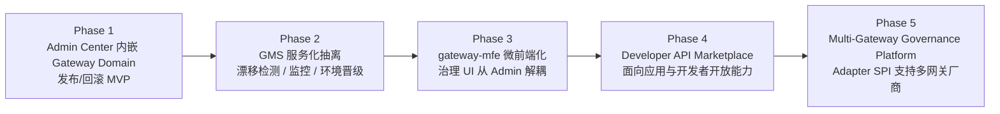

# Workflow Station 项目架构（最新版）

本文档基于当前仓库实际目录与 `pom.xml` 聚合模块定义整理，适用于日常开发、联调与部署排查。

> 📐 **边界事实来源**：谁负责什么 / 数据归谁 / 谁能调谁 / 什么禁止依赖，见
> [docs/architecture/architecture-blueprint.md](docs/architecture/architecture-blueprint.md)（架构蓝图，逐条核对代码与 schema）。
> 相关：[架构示意](docs/architecture/architecture-diagram.md) · [优化方案](docs/architecture/architecture-optimization-plan.md)。

## 1. 项目总览

- 项目定位：企业级低代码工作流平台（Workflow Station）
- 后端技术栈：Java 17、Spring Boot 3.2、Flowable 7、PostgreSQL、Redis、Kafka
- 前端技术栈：Vue 3 + TypeScript + Vite + Element Plus
- 网关与入口：Kong Gateway（API 边缘）+ 各前端应用自带 Nginx（按环境可直连后端或转发 Kong）

## 1.0 当前建设重点（2026-05）

### A) Gateway Governance（分阶段演进）

- 当前运行面维持 Kong 统一网关，不改变线上流量主路径。
- 治理面按 Phase 1–5 渐进：Admin 内嵌治理域 -> GMS 抽离 -> `gateway-mfe` -> API Marketplace -> 多网关平台。
- 治理业务模型统一为 `API / Application / Policy / Release`，避免前端直接面向 Kong 原生对象。
- 详见：`docs/gateway-governance-README.md` 及各 phase 配套 blueprint/task/api/ddl/permission/checklist 文档。

### B) Process Debug Console MVP（Developer Workstation）

- 在 `Process Design` 现有模拟器上增强调试闭环，而非引入完整 runtime 引擎。
- 核心能力：`Gateway Explain`、`Lookup Live Probe`、`Action Button Runner`。
- 目标是提升流程调试可解释性与可执行性，同时控制跨模块爆炸半径。
- 详见：`docs/process-debug-console-mvp-spec.md`。

## 1.1 架构图（ASCII，兼容所有 Markdown 预览）

```text
┌─────────────────────────────────────────────────────────┐
│                    Ingress (K8S) / Nginx                │
│         admin.company.com  portal.company.com           │
│         dev.company.com                                 │
└──────┬──────────────┬──────────────────┬────────────────┘
       │              │                  │
┌──────▼──────┐ ┌─────▼──────┐ ┌────────▼────────┐
│ Admin Center│ │ User Portal│ │ Dev Workstation  │
│  Frontend   │ │  Frontend  │ │   Frontend       │
│  (nginx)    │ │  (nginx)   │ │   (nginx)        │
└──────┬──────┘ └──┬────┬────┘ └────┬─────────────┘
       │           │    │           │
┌──────▼──────┐ ┌──▼────▼────┐ ┌───▼──────────────┐
│ Admin Center│ │ User Portal│ │ Dev Workstation   │
│  Backend    │ │  Backend   │ │   Backend         │
└──────┬──────┘ └──┬────┬────┘ └───┬──────────────┘
       │           │    │           │
       └───────────┼────┼───────────┘
                   │    │
            ┌──────▼────▼──────┐
            │ Workflow Engine  │
            │   (Flowable)     │
            └──────┬───────────┘
                   │
    ┌──────────────┼──────────────┐
    │              │              │
┌───▼─────┐  ┌────▼────┐  ┌─────▼────┐
│PostgreSQL│  │  Redis  │  │  Kafka   │
│(公司现有) │  │(K8S部署) │  │(K8S部署) │
└─────────┘  └─────────┘  └──────────┘
```

## 1.3 Gateway Governance 演进时序（Phase 1 -> Phase 5）



ASCII 兜底（Mermaid 不可用时）：

```text
Phase 1 -> Phase 2 -> Phase 3 -> Phase 4 -> Phase 5
Admin嵌入  -> GMS抽离  -> gateway-mfe -> Marketplace -> Multi-Gateway
```

## 1.2 后端模块依赖关系（文字版）

- 业务服务：`admin-center`、`developer-workstation`、`user-portal`、`workflow-engine-core`
- 共享模块：`platform-common`、`platform-security`、`platform-cache`、`platform-messaging`
- 依赖原则：4 个业务服务都依赖上述 4 个共享模块

## 2. 仓库结构（当前）

```text
Workflow-Station---sun/
├─ backend/
│  ├─ platform-common/            # 共享基础模块（DTO/工具/异常等）
│  ├─ platform-cache/             # 缓存能力封装（Redis）
│  ├─ platform-security/          # 认证鉴权与安全能力
│  ├─ platform-messaging/         # 消息能力封装（Kafka）
│  ├─ workflow-engine-core/       # 流程引擎核心服务
│  ├─ admin-center/               # 管理后台服务（用户/角色/权限/字典）
│  ├─ developer-workstation/      # 开发工作台服务（表单/流程/决策/关联表）
│  ├─ user-portal/                # 用户门户服务（任务处理/发起流程）
│  └─ api-gateway/                # 网关相关工程（是否启用按部署策略）
├─ frontend/
│  ├─ admin-center/               # 管理端前端
│  ├─ developer-workstation/      # 开发端前端
│  └─ user-portal/                # 门户端前端
├─ deploy/                        # SQL 初始化脚本、K8s/Kong 部署资源
├─ docs/                          # 技术文档
├─ BUILD_GUIDE.md                 # 构建与部署指南
└─ pom.xml                        # Maven 聚合根（后端核心模块聚合）
```

## 3. Maven 聚合模块（以根 `pom.xml` 为准）

根 `pom.xml` 当前聚合以下模块：

1. `backend/platform-common`
2. `backend/platform-cache`
3. `backend/platform-security`
4. `backend/platform-messaging`
5. `backend/workflow-engine-core`
6. `backend/admin-center`
7. `backend/developer-workstation`
8. `backend/user-portal`

说明：
- `backend/api-gateway` 目录存在，但未包含在根聚合模块列表中，通常按独立工程或按部署场景使用。

## 4. 业务域与服务边界

### 4.1 developer-workstation（设计时）
- 核心对象：`FunctionUnit`、`FormDesign`、`Decision`、`RelationTable`
- 作用：为流程与表单提供可视化建模能力

### 4.2 workflow-engine-core（运行时流程）
- 核心对象：`ProcessDefinition`、`ProcessInstance`、`Task`
- 作用：流程编排、任务流转、流程状态管理

### 4.3 admin-center（平台治理）
- 核心对象：`User`、`Role`、`Permission`、`Dictionary`
- 作用：账号体系与权限治理

### 4.4 user-portal（终端用户门户）
- 关注对象：`Task`（用户视角）与流程发起
- 作用：待办处理、流程发起、消息中心（面向门户用户）

## 5. 前后端映射关系

| 前端应用 | 对应后端服务 |
|---|---|
| `frontend/admin-center` | `admin-center` |
| `frontend/developer-workstation` | `developer-workstation` + `workflow-engine-core` |
| `frontend/user-portal` | `user-portal` + `workflow-engine-core` |

## 6. 共享能力与基础设施

### 6.1 共享后端模块
- `platform-common`：公共 DTO、异常、工具类（爆炸半径最大）
- `platform-security`：JWT、安全校验、加解密相关能力
- `platform-cache`：Redis 访问抽象
- `platform-messaging`：Kafka 事件生产/消费能力

### 6.2 基础设施
- 数据库：PostgreSQL（业务数据持久化）
- 缓存：Redis（缓存、会话等）
- 消息：Kafka（异步事件与通知）
- 部署：Docker + Kubernetes（资源位于 `deploy/`）

## 7. 典型调用链

### 7.1 同步链路（HTTP）
`Frontend -> Nginx -> (Kong 或直连) -> Backend Service -> PostgreSQL/Redis`

### 7.2 异步链路（事件）
`Producer Service -> Kafka Topic -> Consumer Service -> DB/Portal通知`

## 8. 代码分层约定（后端）

统一遵循：
`Controller -> Component(接口) -> ComponentImpl -> Service/Repository`

返回体统一使用：
`ApiResponse<T>`

## 9. 数据与脚本约定

- **Schema 唯一事实来源：`deploy/init-scripts/00-schema/`**（快照式：表+列+索引写在一起）。
  新增/改表只改这里。Flyway 已于 2026-06 清退（所有环境本就 `SPRING_FLYWAY_ENABLED=false`、
  迁移从未在部署中执行），历史迁移归档于 `docs/legacy-flyway-migrations/`。
  详见 `docs/schema-single-source-init-scripts-plan.md`。**不要再写 Flyway 迁移。**
- 初始化/种子脚本目录：`deploy/init-scripts/`（schema + 角色 + demo 种子 + post-seed）
- 表名前缀：
  - `dw_`：developer-workstation
  - `ac_`：admin-center
  - `up_`：user-portal
  - `we_`：workflow-engine

## 10. 架构维护建议

- 新增后端模块时：同时更新根 `pom.xml` 与本文档“聚合模块”章节
- 新增前端应用时：补充“前后端映射关系”
- 变更部署链路时：同步更新 `BUILD_GUIDE.md` 与 `deploy/` 文档
- Gateway 治理阶段变更时：同步更新 `docs/gateway-governance-README.md` 与本文档“1.3 演进时序”

