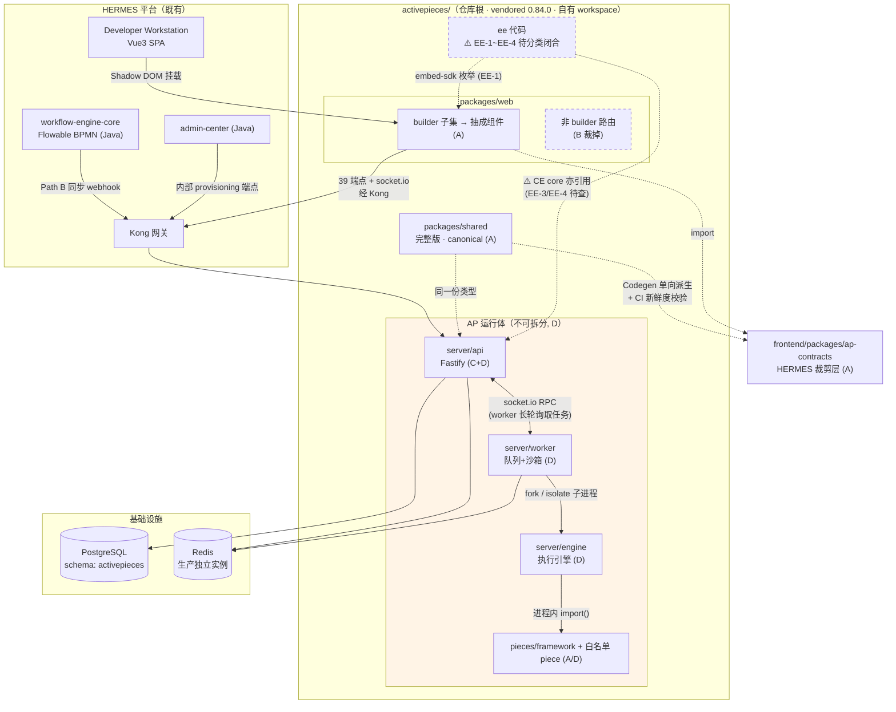
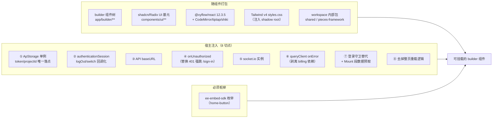

# Activepieces 0.84.0 依赖图与模块处置（Dependency Map & Module Disposition）

> **Document 3 / 10** — 前置：[REQUIREMENTS.md](REQUIREMENTS.md)（Q1–Q9 + Q4a 已裁决）、
> [ARCHITECTURE_ANALYSIS.md](ARCHITECTURE_ANALYSIS.md)（六线逆向完成）。
> 决策见 [DECISIONS.md](DECISIONS.md)；阻塞项见 [OPEN_GATES.md](OPEN_GATES.md)；总览见 [STATUS.md](STATUS.md)。
> 状态：**初稿，待评审**。本文档**不被 AG-01~AG-06 阻塞**（Gate 影响的是 Document 4 的 Layer 定案），
> 但**自身含一项 P0 未闭合项：§2.2 的 EE 依赖分类（EE-1~EE-4）**——它是 Document 4 的硬前置。
> 全部结论基于 0.84.0 快照实测（与官方 tag 逐字节一致）。日期：2026-07-22

---

## 0. 本文档要回答的核心问题

> **"Activepieces 到底哪些模块进入 HERMES，哪些被裁掉，哪些通过 HTTP 保留，哪些必须整体部署？"**

回答分两个**互相独立的维度**——混谈这两者是理解 AP 架构最常见的错误：

| 维度 | 含义 | 取值 |
|---|---|---|
| **代码归属**（Code Disposition） | 这段代码进不进我们的仓库/构建产物 | **A** 进入 HERMES ／ **B** 裁掉 |
| **交互与部署**（Runtime Disposition） | 运行期我们怎么跟它打交道、它能否独立部署 | **C** 经 HTTP 交互 ／ **D** 必须整体部署 |

**C 与 D 不互斥**：`server/api` 既是"我方只经 HTTP 与之交互"（C），又属于"必须与 engine/worker
一起部署的运行体"（D）。§2 的矩阵对每个模块同时给出两维结论。

---

## 1. 0.84.0 包结构总览

```
packages/
├── web/            React 19 + Vite SPA（builder 在此）
├── server/
│   ├── api/        Fastify API 服务（flows/runs/webhooks/pieces/authn/…）
│   ├── engine/     flow 执行引擎（被 worker 以子进程拉起）
│   ├── worker/     队列消费 + sandbox 管理 + piece/code 安装
│   └── utils/      服务端共享工具
├── shared/         前后端共用类型契约（flow schema / TypeBox）
├── pieces/         piece 框架 + 社区 pieces
├── cli/            脚手架 CLI（开发态）
├── ee/             企业版代码（含 embed-sdk）—— 商业许可
└── tests-e2e/      端到端测试
```

---

## 2. 模块处置矩阵（核心交付）

图例：**A**=进入 HERMES 代码库并进构建产物 ／ **B**=裁掉（不构建不部署不分发）
／ **C**=运行期经 HTTP 交互 ／ **D**=必须与其他模块整体部署 ／ **—**=不适用

| 模块 | 代码归属 | 运行期 | 理由与证据 |
|---|---|---|---|
| **`web` — builder 子集**<br>（`app/builder/**`、`routes/flows/id`、`components/ui`、`features/{pieces,flows,flow-runs,connections,projects}`、`hooks`、`lib/api`、`i18n`、`styles.css`） | **A** | — | Q3 裁决抽"纯 builder 组件"进 DW；框架级 PoC 已过（AG-04 §6.5）。经 8 个注入切点改造后随 DW 构建产物发布 |
| **`web` — 非 builder 路由**<br>（auth / platform-admin / public forms·chat·mcp-authorize / embed / connections·runs·tables·templates·variables 列表页 / `features/billing` / `features/platform-admin`） | **B** | — | §1.6 排除清单。其中 `embed/` 是 iframe postMessage 握手（我们同进程挂载不需要），`features/billing` 是 EE 计费 |
| **`web` → `ee-embed-sdk` 依赖** | **B（必须桩掉）** | — | **许可红线**：`packages/web` 经 `home-button.tsx:1,22` 引入 EE 包的一个字符串枚举。builder 闭包内**仅此 1 处**，删按钮或本地常量替换即断（NFR-S03 / GW-11） |
| **`server/api`** | **A**（vendored 自建镜像） | **C + D** | **C**：Java/DW 侧只经 HTTP（`ActivepiecesApiClient`/`ApTaskExecutor` 既有模式，CR-05 不做 TS→Java 翻译）。**D**：与 engine/worker 紧耦合，见 §3.2 |
| **`server/engine`** | **A** | **D** | 不可独立部署：由 worker 以 `child_process.fork`（`worker/src/lib/sandbox/fork.ts:7`）或 isolate（`isolate.ts:120`）拉起，经本地 WS-RPC 通信 |
| **`server/worker`** | **A** | **D** | 不直连 BullMQ，经 socket.io RPC 向 `server/api` 长轮询取任务（`worker/src/lib/worker.ts`） |
| **`server/utils`** | **A** | **D** | 服务端共享库，被 api/worker/engine 引用 |
| **`shared`** | **A**（服务端完整版）<br>+ **HERMES 自有裁剪层**（前端） | **D**（服务端侧） | **跨语言契约边界**。⚠️ **经 [D2](DECISIONS.md#d2) 修正**：前端**不再** `workspace:* → AP shared`，改为 **HERMES 拥有的裁剪层**（Flow/Step/Trigger/Action schema + piece metadata + API DTO）。**Canonical = 服务端消费的 vendored AP shared**，前端层为派生物，须 Codegen + CI 新鲜度校验（[AG-02.7](OPEN_GATES.md)）。平台已 pin `@sinclair/typebox`，AG-02.1 须对账 |
| **`pieces/framework`** | **A** | **D** | piece 运行时框架，engine 进程内加载 piece 依赖它 |
| **`pieces` — 白名单 10 个** | **A**（构建期预装进镜像） | **D** | FR-F01/F03A：构建期预装 + `ready` 标记，**运行时零安装**。注意 AG-05/SG-1 须验证 isolate rootfs 下仍可 `import()` |
| **`pieces` — 其余社区 pieces** | **B** | — | 不在白名单即不预装、不进镜像（断外网红线） |
| **`pieces` — approval / todos** | **B** | — | Q9 裁决：业务审批唯一归 Flowable（§2.3 W-12），移出白名单；`patch-web-approvals` 同步移除 |
| **`ee/**`** | **⚠️ 见 §2.2 —— 单一"B"结论已作废** | — | 商业许可（NFR-S03），但**已发现 CE 核心代码存在对 ee 的引用**（`user-service.ts:29` 等），"ee 完全不构建"与"CE 能运行"可能直接冲突。**必须按 EE-1~EE-4 分类逐条闭合，见 §2.2** |
| **`cli`** | **B-dev**（留树、不进产物） | — | 开发态脚手架（自研 piece 用）。不进任何生产镜像；其 `generate-translation-file-for-piece.ts:25` 的 `bun install` 需随 CR-01 改 pnpm |
| **`tests-e2e`** | **A-test**（建议保留） | — | **建议留作回归资产**：我们要打 HERMES-PATCH（RBAC 补丁、provisioning 端点、run_agent patch），需要回归网。可裁剪为与我方场景相关的子集 |
| `Dockerfile` / `docker-entrypoint.sh` | **A（重写）** | — | 自建镜像：剥 bun（CR-01）、加 pieces 预装、加沙箱/网络基线（AG-05） |
| `.github/workflows` | **B** | — | 我方用既有 CI（Jenkins）；12 个 workflow 依赖 bun，无保留价值 |
| `docs/`、`.agents/`、`.cursor/`、`.claude/` | **B** | — | 上游文档与 agent 配置，与我方无关 |

### 2.1 边界情形的处置说明

- **`shared` 同时是 A 与 D**：它既进 DW 前端构建产物（类型契约），又是服务端运行体的一部分。
  这不矛盾——**A/B 说的是代码，C/D 说的是运行形态**，同一份代码可在两处被消费。
- **`server/api` 同时是 C 与 D**：这正是 §0 强调的两维度。它对我方是"HTTP 服务"，
  但它自身不能脱离 engine/worker 单独部署。
- **`cli` 与 `tests-e2e` 的取舍**：二者都不进生产产物，区别在于是否值得维护。
  建议 `cli` 保留（自研 piece 需要脚手架）、`tests-e2e` 保留可用子集（补丁回归网）。
  **若评审认为维护成本过高，可整体降为 B，但须在 Document 9 补充等价的回归手段。**

### 2.2 ⛔ P0：EE 依赖必须按 EE-1~EE-4 分类闭合（Document 4 前置）

#### 2.2.1 已识别的逻辑矛盾（本文档初稿的缺陷，2026-07-22 评审指出）

初稿同时声称了三件不能同时为真的事：

1. `packages/ee/` **不进任何构建产物**；
2. web 侧**只需桩掉 `ee-embed-sdk` 一处**；
3. §6 又记录：CE 核心 `user-service.ts:29` **import 了 ee 目录的 `projectMemberRepo`**。

若 (3) 属实，则 (1) 与"CE 能运行"冲突，(2) 也不足以覆盖依赖面。
**这个矛盾必须在 Document 4 之前闭合**，否则设计会建立在"禁止 EE 但 CE runtime 仍 import EE"
的自相矛盾前提上。

#### 2.2.2 约束表述修正（措辞是实质问题，不是文字游戏）

| 旧表述（作废） | 新表述（采用） |
|---|---|
| `packages/ee/` 不进任何构建产物 | **No EE Business Features / No EE Proprietary Runtime Capability** |

旧表述把"目录"当成许可边界，但**许可边界是"专有功能与专有运行能力"，不是文件路径**。
上游把一部分通用技术组件放在 `ee/` 目录并不自动使其成为我们必须放弃的能力，
反之目录之外也可能存在受限内容。新表述让每一条依赖都必须被**逐条判定**，而不是靠路径一刀切。

#### 2.2.3 EE 代码四分类（每条 CE→EE 依赖必须归入其一）

| 类别 | 定义 | 处置 |
|---|---|---|
| **EE-1** Embed SDK | `ee-embed-sdk` 及其 postMessage/iframe 嵌入通道 | **MUST REMOVE**（我们同进程挂载，本就不需要） |
| **EE-2** 企业专有业务功能 | SSO/SAML、audit log、git sync、billing/plan、api-key、SCIM、managed-authn、oauth-apps、global-connections、secret-managers、project-release、analytics 等 | **MUST REMOVE**（对应能力由平台侧自建，§2.2 非目标已列） |
| **EE-3** 共享技术依赖 | 本质是通用实体/仓储/类型/工具，**只是恰好放在 ee 目录**，CE 核心路径亦在使用（候选：project-member / project-role / concurrency-pool 等） | **MUST REPLACE / REIMPLEMENT / EXTRACT**——三选一，逐条定；**不得简单声明"不构建"** |
| **EE-4** CE 运行时硬依赖 | CE 主流程（非 EE 功能分支）在运行期真会执行到的 ee 代码 | **MUST NOT REMAIN UNRESOLVED**——必须有明确解法，且**在 Document 4 前闭合** |

**EE-3 的三种处置及适用条件**：

- **EXTRACT（移动到 core）**：仅当该单元是**纯实体/类型定义、无 EE 业务语义**时适用。
  成本最低，但改变了上游目录结构（需 HERMES-PATCH 记录、影响未来 diff 对位）。
- **REIMPLEMENT（按契约重写，不复制 EE 代码）**：当该单元含逻辑、或许可上不宜直接搬运时。
  须明确"最小契约"是什么（我们只需要它的哪一部分行为）。
- **REPLACE（改用 CE 已有能力或平台侧能力绕过）**：当 CE 主流程其实可以不经该依赖时——
  **优先级最高**，因为它同时消除了许可风险与维护负担。
  > 已有先例：§2.7 的 RBAC 补丁打在 **core 层**（`authz/authorize.ts` + `websockets.service.ts`）
  > 而非 ee 的 `rbac-service`/`project-member.service`，且 provisioning 因此**不再需要写
  > `project_member` 行**——这正是 REPLACE 路线的一次成功应用，可作为其余条目的范式。

#### 2.2.4 ✅ 全量枚举已完成（2026-07-22）—— **结论：0.84.0 上"ee 完全不构建"不可行**

##### (1) 许可边界（原文引述，**不作法律解释，须合规/法务评审**）

根 `LICENSE:5` 逐字点名**两个**路径受 Enterprise License 约束：
> All content that resides under the **"packages/ee/"** and **"packages/server/api/src/app/ee"**
> directory of this repository, if that directory exists, is licensed under the license defined in packages/ee/LICENSE

`LICENSE:6`：其余内容为 MIT Expat。`packages/ee/LICENSE` 关键句：
> …may only be used in production, if you… have a valid Activepieces Enterprise license…
> Notwithstanding the foregoing, **you may copy and modify the Software for development and testing
> purposes, without requiring a subscription.** …it is forbidden to copy, merge, publish, distribute…

**已核实**：`app/ee/` 下 172 个 `.ts` **无任何许可头**，其许可完全依赖根 LICENSE 的路径条款。

**🔑 条款未覆盖的三个"ee"目录**（按条款文本属 MIT，**须法务确认**）：
`packages/shared/src/lib/ee/**`（40 文件，含 `access-control-list.ts` 的 `rolePermissions`）、
`server/worker/src/lib/execute/jobs/ee/`（3 文件）、各测试目录下的 `ee/`。

##### (2) 依赖规模（实测）

| 项 | 数量 |
|---|---|
| CE 文件 import `app/ee/**` | **37 个文件 / 约 105 条 import** |
| `getEntities()` 无条件注册的 ee 实体 | **19 个**（EntitySchema 定义**全部**在 `app/ee/**`） |
| 无条件迁移数组中的 ee 迁移 | **20 个** |
| 前端 import `ee-embed-sdk` | 3 文件 + 3 处构建配置 |
| `packages/pieces`、`server/{engine,utils}` → ee | **0** ✅ |

##### (3) ⛔ 决定性判定：排除 ee 后 CE **编译期即死**

| 层 | 结论 | 首个失败点 |
|---|---|---|
| **编译期** | ❌ **失败** | `database-connection.ts:10` `TS2307: Cannot find module '../ee/alerts/alerts-entity'`，随后 `:11-28` 再 18 次、`app.ts:24-59` 再 36 次，**共约 105 处、横跨 37 文件** |
| 启动期 | ❌ 到不了 | 即便 transpile-only 跳过类型检查，`database-connection.ts:136` `entities: getEntities()` 顶层求值即 `MODULE_NOT_FOUND` |
| 运行期 | ❌ 到不了 | 首个 project 级请求会在 `authz/authorize.ts:102` `rbacService is not a function` |

##### (4) EE-4（CE 运行时硬依赖）已确认 13 条，**主干路径中招**

| # | ee 代码 | CE 触发点 | 频率 |
|---|---|---|---|
| **R1** | `rbacService.assertPrinicpalAccessToProject` → `projectMemberService.getRole` → `projectRoleService` | `authz/authorize.ts:102`（经 `app.ts:168` **全局 preHandler**） | **每个 project 级 HTTP 请求** |
| **R2** | `projectMemberService.getRole` | `core/websockets.service.ts:105` | 每次 WS 握手 |
| **R3–R5** | `secretManagersService.resolveObject/resolveString` | `app-connection-service.ts:93`、**`app-connection-worker-controller.ts:38`（engine 取连接）**、oauth2 两处 | **每次读连接 / 每次 flow 执行取连接** |
| **R6** | `concurrencyPoolService` | `rate-limiter-interceptor.ts:53,63,112` | **每次入队 job** |
| **R7** | `workerGroupService.getWorkerGroupId` | `job-queue.ts:177`、`machine-service.ts:100` | 每次入队 / worker 上报 |
| **R8** | **`/v1/projects`、`/v1/platforms`、`/v1/worker/project` 控制器** | `app.ts:307` —— **在 `case ApEdition.COMMUNITY:` 分支里注册 ee 模块** | 前端每次列 project |
| R9–R13 | `deletePersonalProjectForUser`、`/v1/users`·`/v1/alerts`·`licenseKeys` 无条件注册、role-seed、19 实体、20 迁移 | 各处 | 启动/常用 |

> **重要对比**：旧版 `rbacMiddleware`（`ee/.../rbac-middleware.ts:99-101`）**有** CE 短路，
> 但 **v2 的 `authorize.ts` 路径没有**——这是"每请求执行 ee 代码"的根因。

##### (5) 🎁 关键利好：**表 DDL 在 MIT 区，实体映射在 EE 区**

`project_member` 表由 **MIT 迁移** `1764867709704-UnifyCommunityWithEnterprise.ts:25-34`
**专为 COMMUNITY** 创建；`project_role` 由 MIT 迁移 `1731424289830-CreateProjectRoleTable.ts` 创建；
`concurrency_pool` 由 MIT `1775800000000` 创建。而它们的 `EntitySchema`（TS）在 `ee/`。

→ **`EntitySchema` 可依据 MIT 区的 DDL 独立重写，无需复制任何 EE 文件。** 这是重实现路线的基础。

##### (6) 错位清单（ee 目录里的 CE 通用能力，13 项）

`project_role`/`project_member`/`concurrency_pool` 实体、`SecretManagerEntity`、`AlertEntity`、
`ChatConversationEntity`（这四个在 `database-connection.ts` 里被列在 `// Enterprise` 注释**之上**的
CE 段——**上游作者自己也当它们是 CE**）、`/v1/users`、**`/v1/projects`+`/v1/platforms`**、
通用 SMTP 发信、并发池、worker-group、licenseKeys 模块、20 个"EE"迁移、
`projectMemberRepo` 定义在 `project-role.service.ts:9`（连位置都错）。

##### (7) 重实现工作量（按改动面排序，实测估算）

```
P1  删 tsconfig 死别名                2 行
P4  user-service getUsersForProject   3 行    ← 最初的疑点，最易解决（CE 本就短路）
N5/N6/N4  concurrencyPool/workerGroup/secretManagers stub   各 ~10-15 行
P2  embed-sdk 解耦（EE-1）            ~7 处
N3  projectRoleService 重写           ~40 行
N1  rbacService 替代                  ~60 行   ← 切断"每请求走 ee"的关键
M1  3 个 EntitySchema 重写            ~120 行
N2  getRole 替代 + websocket 改造     ~60 行
N8/N10  deletePersonalProject / SMTP  ~110 行
P5  8 个 edition-gated 调用点         ~50 行
P3  app.ts 删 EE 分支                 ~90 行
M2  getEntities 19→3（含 FK 核实）    ~35 行
P6  20 个 ee 迁移处置                 视方案
N9  /v1/users 重写                    ~100 行
N7  /v1/projects+/v1/platforms 全套   ~300-500 行  ← 最大块
N11 未核实项（otp/flags/template/git-sync 等 8 条）  待定
```
**合计约 1000–1300 行重实现 + 8 条未核实项待定。**

##### (8) 闭合状态与待决策

- **EE-1/EE-2 处置明确**（删除/绕过），**EE-3 有重实现路径**（依 MIT DDL 重写实体）；
- **EE-4 尚未清零**——需完成上表工作量，且 8 条（R14–R21）未核实项须先补测；
- **GW-11 的 CI 规则须重定义**：从"扫 `packages/ee` 目录"改为"扫已裁定必须移除的具体单元"。

**⚠️ 这已不是文档措辞问题，而是影响项目可行性与排期的架构级发现——
须由你在下列路线中裁决（§2.2.5），Document 4 涉及 AP 服务端的 Layer 在裁决前不得开写。**

#### 2.2.5 路线选项 → ✅ **已裁决走 R-A（[D1](DECISIONS.md#d1)，2026-07-23）**

| 路线 | 说明 | 裁决 |
|---|---|---|
| **R-A 重实现** | 按 §(7) 完成 ~1000–1300 行重实现，全部依 MIT 区 DDL/类型，**不复制任何 EE 文件** | **✅ 采用**（D1）——技术上确定可行（§(5) DDL 在 MIT 区），代价是工期与 `/v1/projects` 大块工作量 |
| **R-B 合规路径** | 法务/合规评估 EE LICENSE 在我方场景的适用性（含 "development and testing purposes" 豁免与 "production" 限制） | **⏳ 尚未启动**（[D4](DECISIONS.md#d4)）。**并行推进**：若结论允许更宽用法，可缩减 R-A 范围；但**在得到正式意见前一律按 R-A 执行，不得以"可能不需要"推迟** |
| ~~R-C 换版本~~ | 更早 AP 版本是否 CE/EE 分离更干净 | **❌ 不采用**——与 [Q8](DECISIONS.md#q8)「0.84.0 frozen baseline」冲突；且未核实 |
| ~~R-D 缩小集成面~~ | 放弃自建 AP 服务端，继续用官方镜像 | **❌ 不采用**——与 [Q2](DECISIONS.md#q2)（禁 bun，官方镜像含 bun）及 G2（源码自主权）双重冲突 |

**R-A 的执行方案 = [Document 3.5](EE_REMOVAL_PLAN.md)**，且须**先完成 Integration Phase 0**
（HERMES 能力盘点 → EE 逻辑映射 → 处置裁定），**再决定哪些 AP 代码真正需要集成**——
绝不能先按 AP 原架构实现、事后才发现 HERMES 已有同等能力。

---

## 3. 依赖图（基于源码实测）

### 3.1 全局视图



### 3.2 ⛔ 不可独立抽取 / 必须整体部署的模块（关键结论）

**`server/api` + `server/engine` + `server/worker` + `server/utils` 是一个紧耦合运行体**，
只能整体部署，理由均有源码实测支撑：

| 耦合 | 证据 |
|---|---|
| worker **不直连 BullMQ**，经 socket.io RPC 向 api 长轮询取任务 | `worker/src/lib/worker.ts`（`createRpcClient` + `pollAndExecute`）；api 侧 `workers/job-queue/job-broker.ts` 出队 |
| engine **由 worker 拉起为子进程**，不能独立运行 | `worker/src/lib/sandbox/fork.ts:7`（`child_process.fork`）、`sandbox/isolate.ts:120`（isolate + `process.execPath`） |
| engine ↔ worker 经**本地 WS-RPC + 一次性 token** 通信 | `worker/src/lib/sandbox/sandbox.ts`（本地 socket.io server + `timingSafeEqual` 握手）；engine 侧 `engine/src/lib/worker-socket.ts` |
| **piece 在 engine 进程内执行**，无进程边界 | `engine/src/lib/helper/piece-loader.ts:18` `await import(piecePath)`——piece 与 engine 同 V8、同权限、共享 `process.env` |
| `POST /v1/pieces/options` 会**同步跑引擎作业** | api 侧 `EXECUTE_PROPERTY` + 等待 worker 响应——即"前端一个下拉框"背后是 api→worker→engine 全链路 |

**推论**：
1. **不做 TS→Java 翻译**（CR-05 已裁决）——该运行体无法按模块拆分给 Java 重写；
2. **Java 侧只能经 HTTP 与之交互**（既有 `ApTaskExecutor` / `ActivepiecesApiClient` 模式即正解）；
3. 部署单元 = 一个（或按 `AP_CONTAINER_TYPE` 拆 APP/WORKER 两个，但仍属同一发布单元、同版本）。

### 3.3 builder 抽取的依赖闭包与注入切点

builder 可抽取，但依赖三类东西——前两类随组件打包，第三类**必须由宿主注入**：



**切点 ① 是撬动全局的支点**：`lib/ap-browser-storage.ts` 的 `ApStorage` 模块级单例是 token/projectId
的**唯一物理落点**，api / socket-provider / 所有 hooks 的会话读取都经过它——改造为可注入 provider
后一处覆盖全局。

---

## 4. 宿主/网关 API 契约（四段分类，39 端点 + 16 WS 事件）

> 完整明细见 [ARCHITECTURE_ANALYSIS §1.5](ARCHITECTURE_ANALYSIS.md)。此处为 Document 4
> 网关设计所需的分段摘要与硬约束。

| 阶段 | 端点数 | 必需 | 缺失后果 |
|---|---|---|---|
| **Mount** | 10 | 6 | **4 个 `useSuspenseQuery` = 永久白屏**（`/v1/flags`、`/v1/platforms/:id`、`/v1/projects`、`/v1/users/:id`）；`/v1/flows/:id`、`/v1/sample-data` 为 spinner 级 |
| **Edit** | 25 | 8 | 能看不能改。核心单点：`POST /v1/flows/:id` |
| **Run** | 9 HTTP + 3 组 WS | 5 | 不能测试（**且按钮永久 pending，Promise 不 reject**） |
| **Observe** | 6 HTTP + 3 组 WS | 5 | 看不到执行结果与进度 |

**网关必须满足的 5 条硬约束**（详见 §1.5，此处为 Document 4 checklist）：

1. **支持 websocket 升级**（`/api/socket.io`，握手 auth = `{token, projectId}`）——
   **测试与观测 100% 依赖它，无 HTTP 兜底**；
2. **`POST /v1/flows/:id` 需最高 SLA**——单点写路径，失败即编辑会话静默停止落库；
3. **`POST /v1/pieces/options` 需单独放宽超时**——它同步跑引擎作业，非无状态代理；
4. **路径含未编码斜杠**（`/v1/pieces/@activepieces/piece-slack`）——路由匹配/重写须兼容；
5. **限流阈值留够**——首屏 ~2N+2M 请求（20 步 flow ≈ 80 个）。

---

## 5. 外部依赖与基础设施边界

| 依赖 | 用途 | 我方策略 |
|---|---|---|
| PostgreSQL | AP 全部持久化（61+ 表） | **独立 schema `activepieces`**（Q5）+ **独立迁移 lifecycle**（NFR-D02/D03）+ **DB 角色权限强制边界** |
| Redis | BullMQ 队列 / PubSub / 分布式锁 / 并发池 | **生产独立实例**（`noeviction` + 持久化）；dev 可用独立 DB 号（CR-08） |
| 公网 npm registry | 运行时装 piece / code 依赖 | **全部关闭**（FR-F03A/F03B）——构建期预装，运行时零安装 |
| `secrets.activepieces.com` | cloud OAuth app 列表 | **禁用**（`cloudAuthEnabled=false`，已在既有配置中关闭） |
| `registry.npmjs.org` | Code step 加 npm 包对话框 | **随 FR-F03B 关闭**（CODE step 禁外部依赖） |
| Segment / PostHog | 遥测 | **构建期禁用**（断外网 + 合规） |
| AI provider（deepseek） | AI Generate 生产依赖 | **必须在 egress 白名单**——AG-05/SG-3 的重点验证项 |

---

## 6. 循环依赖与隐藏耦合

| 类型 | 发现 | 影响 |
|---|---|---|
| **模块级单例（前端）** | `ApStorage`、`authenticationSession`、`API_URL`、socket.io 实例、`queryClient`、`memoryRouter`/`browserRouter` 均为模块级创建 | 抽组件时必须注入化，否则多实例/跨宿主污染（§3.3 八切点） |
| **全局副作用（前端）** | `main.tsx` 三个 window 监听、i18n 模块级初始化、Tailwind preflight | 不得随组件带入宿主（AG-04） |
| **隐式服务端状态** | `POST /v1/pieces/options` 要求 flow 已存在于服务端 | 网关不能当无状态代理；离线/预览态无法工作 |
| **配置总线** | `/v1/flags` 决定 13 处 UI 行为（含 webhook URL 前缀） | 宿主必须提供完整 flags map，缺 key 会静默隐藏 UI |
| **⛔ EE 目录被 CE core 引用（P0）** | `user-service.ts:29` import `projectMemberRepo`（ee 目录实体）——**已知至少 1 处，全集待枚举** | **CE 与 ee/ 并非纯隔离**：使"ee 完全不构建"与"CE 能运行"可能冲突。**必须按 §2.2 的 EE-1~EE-4 逐条闭合后方可进 Document 4**。§2.7 的 RBAC 补丁打在 core 层是 REPLACE 路线的先例 |
| **进程内共享环境** | piece/code 与 engine 同进程、共享 `process.env`（含 engineToken） | 安全边界问题，AG-05 的核心动因 |

---

## 7. 对 Document 4 的移交清单

| 输入 | 来源 |
|---|---|
| 模块处置矩阵（A/B/C/D） | §2 |
| 不可拆分运行体的部署单元定义 | §3.2 |
| builder 八个注入切点 + 打包边界 | §3.3 |
| 四段 API 契约 + 网关 5 条硬约束 | §4 |
| 基础设施边界（schema/Redis/egress 白名单） | §5 |
| 隐藏耦合清单（注入化/桩掉/网关特例） | §6 |
| **未闭合 Gate**（AG-01~06）对各 Layer 的阻塞关系 | ARCHITECTURE_ANALYSIS §8.1 |

**Document 4 编写纪律**：Gate 未通过的 Layer 只能写"候选方案 + 待验"，不得写成既定设计
（Layer 1 ← AG-01/02/04；Layer 3–5 ← AG-05；身份与权限层 ← AG-03/06）。
