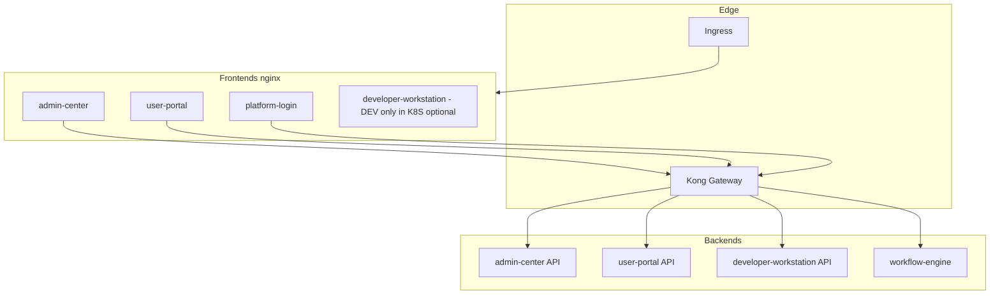

# 架构示意

## 逻辑模块（Maven）

```
platform-common ◄── platform-cache
       ▲            platform-security
       │            platform-messaging
       │
       ├── admin-center          (context-path: /api/v1/admin)
       ├── developer-workstation (context-path: /api/v1)
       ├── user-portal           (context-path: /api/portal)
       └── workflow-engine-core  (context-path: /)
```

`platform-*` 为共享 JAR，**不单独部署**。业务上可部署的后端为上述四个 Spring Boot 应用。

## 请求路径（典型生产 / K8S）

浏览器只暴露 **Ingress 域名**；静态资源由各前端 **nginx** 容器提供；浏览器对 **`/api/*`** 的请求由 nginx **`proxy_pass`** 到 **Kong**，再由 Kong 路由到对应后端（JWT 校验策略以各服务与 Kong 配置为准）。



## 与本地 Compose 的差异

- **Dev**：`docker-compose.dev.yml` 可拉起 **developer-workstation** 前后端、Kong、**edge-frontend**（默认 `EDGE_FRONTEND_PORT=3000`，单源路径 `/admin/`、`/portal/`、`/login/`、`/dev/`）、中间件与业务后端；各子应用也可直连各自 `*_FRONTEND_PORT`（如 3100–3110）。端口以 `deploy/environments/dev/.env` 为准，汇总表见 `BUILD_GUIDE.md` §8.2。
- **SIT/UAT/PROD（默认清单）**：`deploy.ps1` **不**部署 `developer-workstation`；需要时在维护窗口手动应用 `deployment-developer-workstation-optional.yaml`（勿用于生产租户 unless 政策允许）。

## 数据与异步

- **PostgreSQL**：业务库 + Flowable 表；N8N 使用独立库（如 `n8n_{env}`）。
- **Redis**：会话/缓存等（按服务配置）。
- **Kafka**：如 `platform.notification.events`（站内信等）；**developer-workstation** 不参与门户消息消费。
