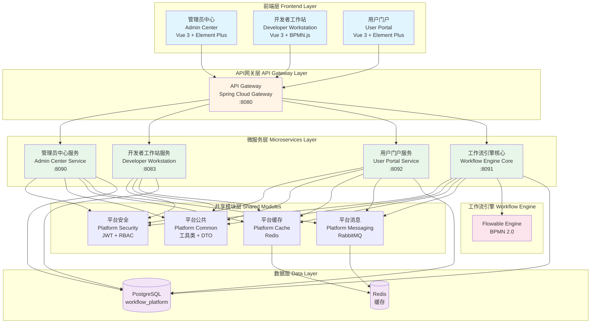
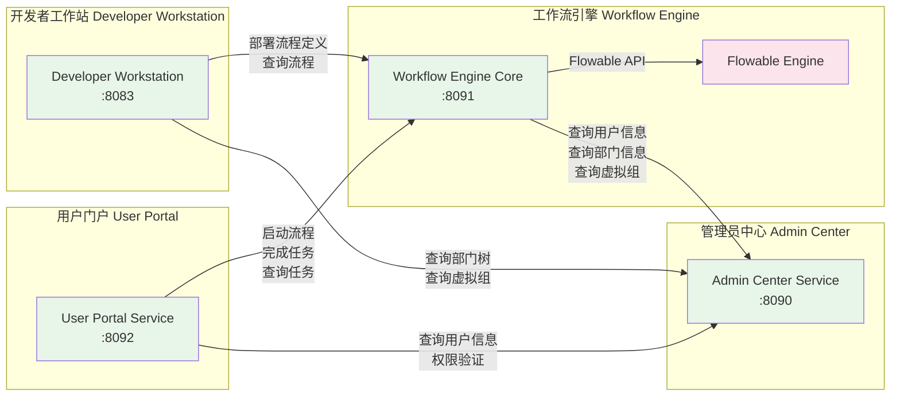
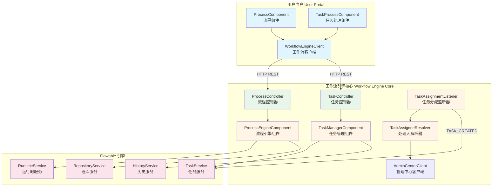
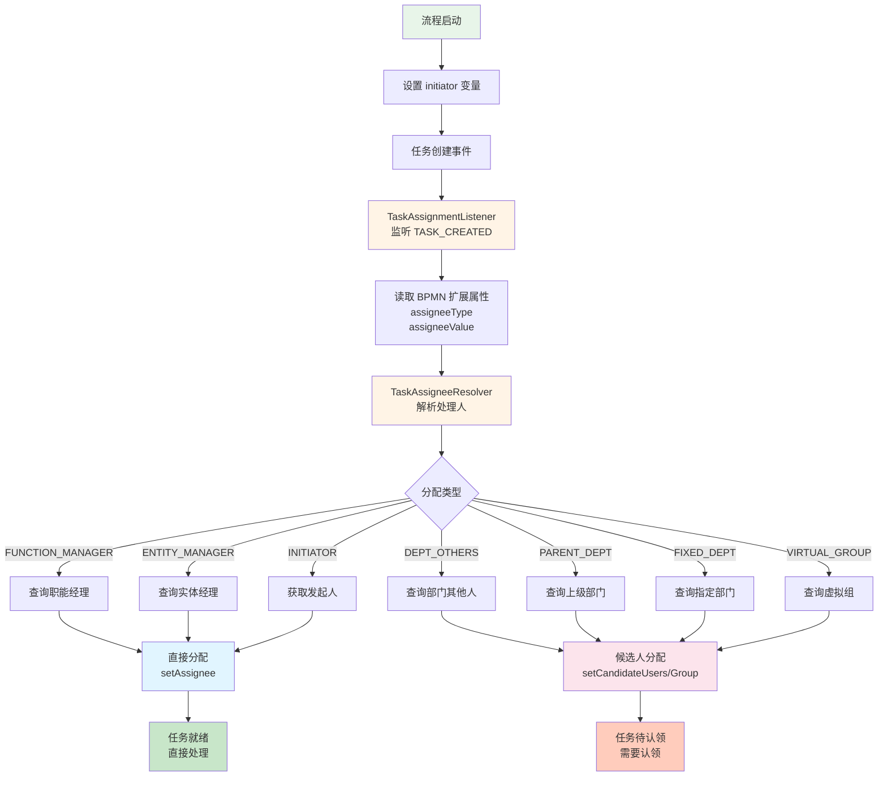
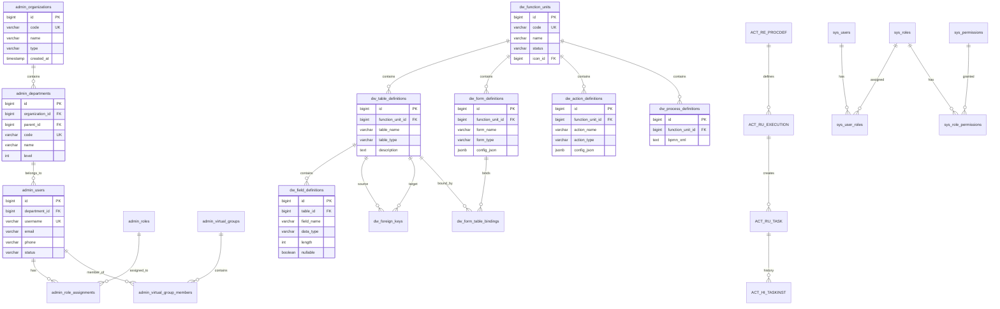
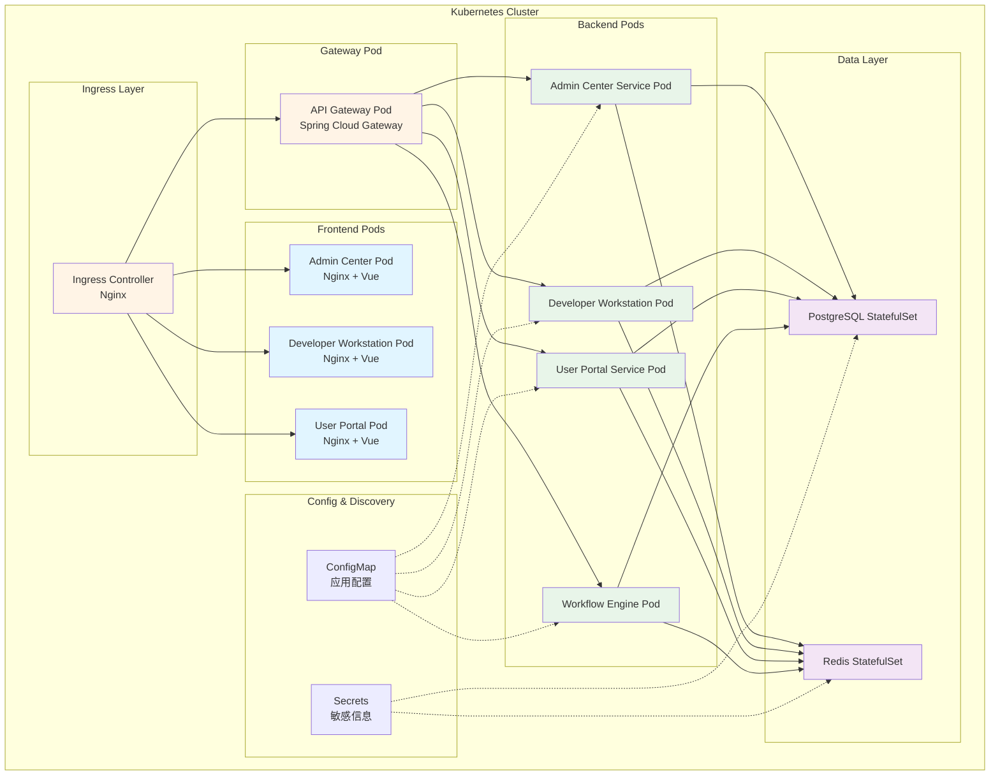
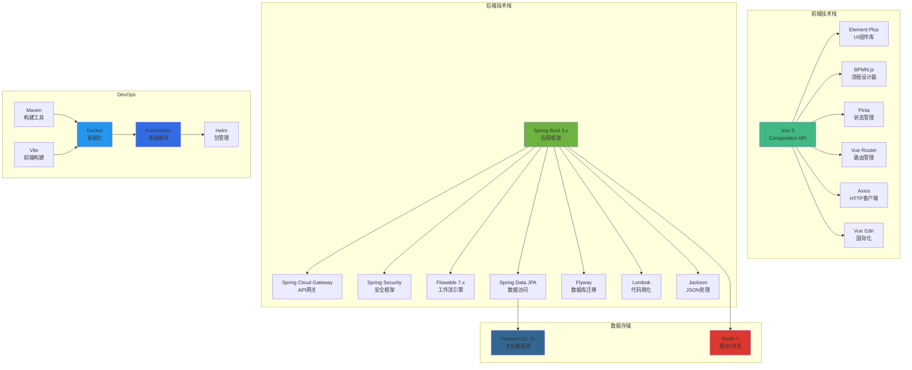
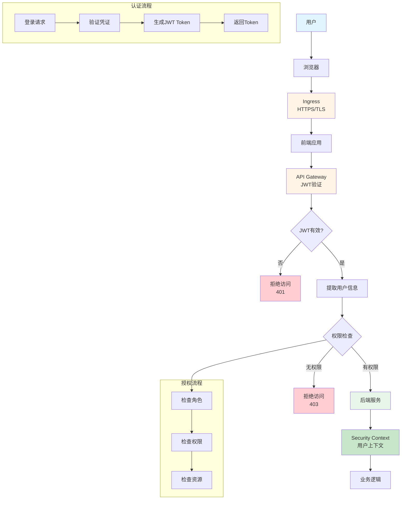
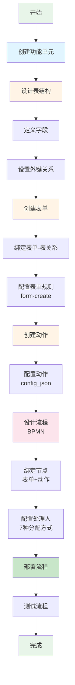
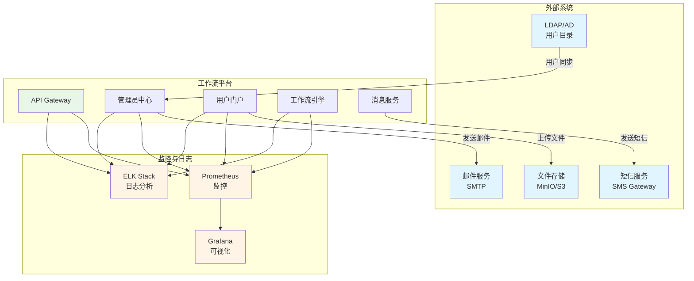

# 工作流平台解决方案架构

## 1. 系统总体架构图

## 2. 微服务交互架构图

## 3. 工作流引擎架构图

## 4. 任务分配机制架构图

## 5. 数据库架构图

## 6. 部署架构图

## 7. 技术栈架构图

## 8. 安全架构图

## 9. 功能单元设计流程图

## 10. 系统集成架构图

---

## 架构说明

### 核心特性

1. **微服务架构**: 采用 Spring Boot 微服务架构，服务间通过 REST API 通信
2. **工作流引擎**: 基于 Flowable 7.x 实现 BPMN 2.0 标准工作流
3. **前后端分离**: Vue 3 前端 + Spring Boot 后端
4. **容器化部署**: Docker + Kubernetes 容器编排
5. **安全认证**: JWT + RBAC 权限控制
6. **多租户支持**: 组织-部门-用户三级结构

### 技术选型理由

- **Flowable**: 成熟的 BPMN 2.0 工作流引擎，支持复杂流程
- **PostgreSQL**: 强大的关系数据库，支持 JSONB 类型
- **Redis**: 高性能缓存和消息队列
- **Vue 3**: 现代化前端框架，Composition API
- **Spring Boot 3**: 最新的 Java 企业级框架
- **Kubernetes**: 云原生容器编排平台

### 扩展性设计

1. **水平扩展**: 所有服务支持多实例部署
2. **垂直扩展**: 数据库支持读写分离和分片
3. **插件化**: 功能单元可独立开发和部署
4. **API优先**: 所有功能通过 REST API 暴露

---

**文档版本**: 1.0  
**最后更新**: 2026-01-14  
**维护者**: 架构团队
