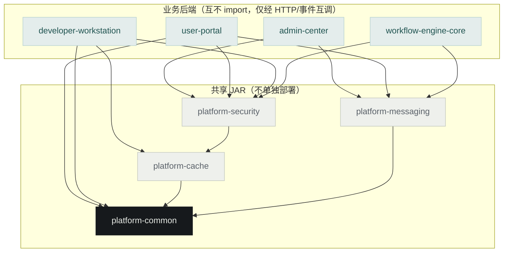
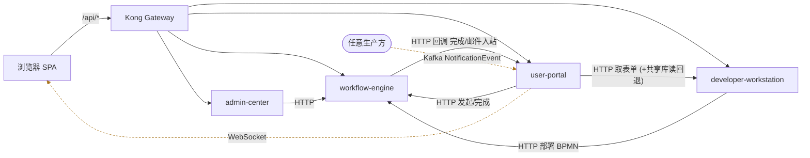

# Workflow Station 架构蓝图（Architecture Blueprint）

> 目的：用一页说清「谁负责什么、数据归谁、谁能调谁、什么禁止依赖」，作为跨团队协作与代码评审的**边界事实来源**。
> 本文由代码 + `pom.xml` + `deploy/init-scripts/00-schema/` + 运行时 URL 配置**逐条核对**得出（2026-07），不是愿景图。
> 相关文档：[项目架构](../../PROJECT_ARCHITECTURE.md) · [架构示意](architecture-diagram.md) · [优化方案](architecture-optimization-plan.md)

---

## 0. 系统清单（一句话定位）

平台本质是 **共享 PostgreSQL 之上的模块化单体**：4 个业务后端 + 4 个共享 JAR + 4 个前端 SPA，经 Kong 统一入口。

| 层 | 系统 | 形态 | context-path |
|---|---|---|---|
| 入口 | **Kong Gateway** | 边缘网关（运行面） | `/api/*` 路由 + JWT 校验 |
| 前端 | admin-center / user-portal / developer-workstation / login | 4 个独立 Vue SPA（各自 nginx） | 静态资源 + `proxy_pass → Kong` |
| 业务后端 | **admin-center** (AC) | Spring Boot | `/api/v1/admin` |
| 业务后端 | **user-portal** (UP) | Spring Boot | `/api/portal` |
| 业务后端 | **developer-workstation** (DW) | Spring Boot（设计时，SIT/UAT/PROD 默认不部署） | `/api/v1` |
| 业务后端 | **workflow-engine-core** (WE) | Spring Boot + Flowable 7 | `/` |
| 共享 JAR | platform-common / -cache / -security / -messaging | **不单独部署**，被业务后端编译依赖 | — |
| 基础设施 | PostgreSQL / Redis / Kafka | 共享数据/缓存/异步事件 | — |
| 外部集成 | Superset(BI) · Activepieces/N8N · LDAP · Email(IMAP/SMTP) | 独立系统 | — |

---

## 1️⃣ 每个系统负责什么？（Responsibility）

**一句话原则：设计时（DW）产出蓝图 → 运行时（WE）执行流程 → 门户（UP）承载终端用户 → 治理（AC）管账号与平台。**

| 系统 | 核心职责 | 核心领域对象 | **不该做什么** |
|---|---|---|---|
| **developer-workstation (DW)** | **设计时建模**：可视化设计 Function Unit（表/字段/FK-PK/关联表/表单/视图访问/BPMN/决策/动作/邮件规则）；版本管理与导入导出/克隆 | `FunctionUnit`、`FormDesign`、`RelationTable`、`Decision`、`Version` | 不承载终端用户运行时任务；不消费门户消息；生产环境非常驻 |
| **workflow-engine-core (WE)** | **运行时流程引擎**：部署 BPMN、启动/流转流程实例、任务分派、多实例、流程完成回调、邮件入站(IMAP)同步 | `ProcessDefinition`、`ProcessInstance`、`Task`（Flowable `act_*`） | 不做界面业务逻辑；不直接持有账号/权限主数据 |
| **admin-center (AC)** | **平台治理**：用户/角色/权限/委托/字典/系统配置/审计日志/LDAP 同步/BI(Superset) 管理/Gateway 治理域 | `User`、`Role`、`Permission`、`Dictionary`、`AuditLog`、`BI` | 不处理业务流程运行；不直接改 DW 设计数据 |
| **user-portal (UP)** | **终端用户门户**：待办处理、发起流程、填写表单、我的申请、关联表(MI)子表数据、站内信/通知、权限自助申请 | `Task`(用户视角)、`ProcessInstance`(门户视角)、`up_*` 运行数据、`Notification` | 不设计表单/流程（只**消费** DW 蓝图）；不管账号主数据 |
| **platform-security** | JWT、认证鉴权、加解密、`sys_` 用户/角色/权限主数据实体 | `SysUser`、`SysRole`、`SysPermission` | — |
| **platform-common / -cache / -messaging** | 公共 DTO/异常/工具（common）；Redis 封装（cache）；Kafka 事件与通知分发（messaging） | `ApiResponse<T>`、`*Event` | 共享层**绝不反向依赖任何业务后端** |
| **Kong** | 边缘路由、JWT 校验、限流、correlation-id | — | 前端不直接调 Kong Admin API（由后端治理域编排） |

---

## 2️⃣ 每种数据归谁管理？（Data Ownership）

**原则：表前缀 = 归属服务。写方唯一，读方可跨库读（当前现实，非理想）。** 已按 `deploy/init-scripts/00-schema/` 逐一核对。

| 前缀 | 归属（Owner，唯一写方） | 数据内容 | 表数 |
|---|---|---|---|
| `sys_*` | **platform-security**（被所有服务共享的身份核心） | 用户、角色、权限、动作定义(`sys_action_definitions`)、共享邮件配置(`sys_email_*`) | ~33 |
| `dw_*` | **developer-workstation** | Function Unit 设计元数据：表/字段定义、FK-PK、表单绑定、视图访问、版本、邮件规则 | ~32 |
| `admin_*` / `ac_*` | **admin-center** | 系统配置、审计日志、权限变更史、委托、告警策略、LDAP 同步审计 | ~16 |
| `up_*` | **user-portal** | 门户流程实例、变更历史、成员、权限申请、目录置顶 | ~12 |
| `rt_*` | **DW 定义结构 / UP 写入运行数据**（关联表 JSON 行存储） | 关联表行数据 `rt_table_data_rows.data` (JSONB)、PK 序列、lookup 配置 | ~10 |
| `wf_*` | **workflow-engine** | 引擎扩展表（多实例执行、邮件入站等） | ~6 |
| `bi_*` | **admin-center**（BI 域） | BI/Superset 管理元数据 | ~4 |
| `act_*` / `ACT_*` | **workflow-engine 独占**（Flowable 原生） | 流程定义/实例/任务/历史 | Flowable |
| `n8n_{env}` | **Activepieces/N8N**（独立库） | 自动化流程数据 | 独立 DB |

> ⚠️ **已知跨界读（技术债，非违规但受控）**：`user-portal` 运行时会**直接读 `dw_*` 表**（共享库）加载表单定义，DW 不可达时才回退 HTTP（见 `TaskFormDefinitionLoader`）。这是「共享 schema、跨服务读表」形态，优化方案标为 🔴，保留但不得扩大。

---

## 3️⃣ 系统之间允许哪些调用？（Allowed Calls）

分两个平面：**编译期（Maven JAR 依赖）** 与 **运行期（HTTP / Kafka）**。

### 3.1 编译期依赖（已核对 `pom.xml`，✅ 边界干净：无业务→业务 JAR 依赖）



依赖偏序（上依赖下）：`业务后端 → platform-security → platform-cache → platform-common`；`platform-messaging → platform-common`。**无环。**

ASCII 兜底（Mermaid 不可用时）：

```text
platform-common  ◄─ platform-cache ◄─ platform-security
       ▲                                     ▲
       └──────────── platform-messaging      │
   业务后端只依赖 platform-*：
     admin-center            → security, messaging
     user-portal             → security, messaging, common
     developer-workstation   → security, cache, common
     workflow-engine-core    → security, messaging
```

### 3.2 运行期调用（已核对 URL 配置 + RestTemplate 调用点）



> `UP ↔ WE` 双向：UP 发起流程/完成任务调 WE；WE 通过 `ProcessCompletionListener` 回调 UP 更新状态（`/api/portal/processes/{id}/complete`）与邮件入站 `hydrate-process-instance`。虚线为异步（Kafka/WebSocket）。

| 主调方 | 被调方 | 方式 | 用途 |
|---|---|---|---|
| 浏览器 SPA | Kong → 对应后端 | HTTP | 全部 `/api/*` |
| **AC** | **WE** | HTTP (`WORKFLOW_ENGINE_URL`) | 流程治理/查询 |
| **UP** | **WE** | HTTP (`WORKFLOW_ENGINE_URL`) | 发起流程、完成任务 |
| **UP** | **DW** | HTTP (`DEVELOPER_WORKSTATION_URL`) + **共享库读回退** | 取表单定义（DW 不可达回退读 `dw_*`） |
| **DW** | **WE** | HTTP (`WORKFLOW_ENGINE_URL`) | 部署 BPMN |
| **WE** | **UP** | HTTP 回调 (`USER_PORTAL_URL`) | 流程完成→`/api/portal/processes/{id}/complete`；邮件入站→`hydrate-process-instance` |
| 任意生产方 | **UP**(消费) | **Kafka** `NotificationEvent` 等 | `NotificationKafkaConsumer` → WebSocket 推浏览器 |

**允许的调用形态（仅此三种）：**
1. **HTTP**：业务后端之间只经 REST 互调（返回体统一 `ApiResponse<T>`，经 Resilience4j 熔断）。
2. **Kafka 事件**：异步解耦（`TaskEvent`/`ProcessEvent`/`PermissionEvent`/`NotificationEvent`/`DeploymentEvent`），UP 消费转 WebSocket。
3. **共享 DB 读**：受控的跨前缀读（当前仅 UP 读 `dw_*` 已登记）。

> 🔁 **注意 WE ↔ UP 是运行期双向**（UP 调 WE 发起流程；WE 回调 UP 更新状态）。这是唯一的运行期双向耦合，通过内部服务 token + 异步回调控制，勿在此基础上再加同步双向链路。

---

## 4️⃣ 哪些方向禁止依赖？（Forbidden Dependencies）

| # | 禁止方向 | 原因 | 违反后果 |
|---|---|---|---|
| **F1** | `platform-*` **禁止依赖任何业务后端**（AC/UP/DW/WE） | 共享层是叶子/地基，反向即成环 | Maven 循环依赖、全量重编、无法独立发版 |
| **F2** | 业务后端之间**禁止编译期 JAR 依赖**（AC/UP/DW/WE 互不 import） | 保持服务可独立构建/发版；跨服务只走 HTTP/事件 | 退化为「分布式单体」，改一处全体重编 |
| **F3** | 任何服务**禁止直接读写 Flowable `act_*` 表** | 引擎数据仅 WE 独占，只经 HTTP 访问 | 绕过引擎一致性、破坏流程状态 |
| **F4** | 任何服务**禁止写非自己前缀的表**（如 UP 写 `dw_*`、AC 写 `up_*`） | 单一写方保证数据主权；跨前缀**只读**且需登记 | 数据归属混乱、并发覆盖、审计断链 |
| **F5** | **生产运行链路禁止依赖 developer-workstation** | DW 是设计时系统，SIT/UAT/PROD 默认不部署 | 生产因缺 DW 而故障（故 UP 取表单必须有共享库回退） |
| **F6** | 前端 **禁止直连 Kong Admin API / 直连后端跳过 Kong**（生产） | 网关治理由后端治理域编排；边缘统一 JWT | 绕过鉴权与限流 |
| **F7** | `platform-common` **禁止继续膨胀**（现 110+ 类 god module） | 爆炸半径最大，改一 DTO 触发 4 服务重编 | 见优化方案 P1-1 拆分计划 |

### 依赖方向总则（一句话）

> **共享层被业务层依赖，业务层之间只经 HTTP/事件；数据按前缀单一写方、跨前缀只读且登记；引擎数据只经 HTTP；设计时系统不进生产运行链路。**

---

## 5. 维护约定

- 新增后端模块：同步更新根 `pom.xml` + 本文 §0/§1 + [PROJECT_ARCHITECTURE.md](../../PROJECT_ARCHITECTURE.md)。
- 新增表：只改 `deploy/init-scripts/00-schema/`（唯一事实来源，Flyway 已清退），前缀必须匹配归属服务，并登记到 §2。
- 新增跨服务调用：登记到 §3.2，确认不违反 §4 的 F1–F7。
- 新增跨前缀读：必须在 §2「已知跨界读」显式登记并说明回退策略。
