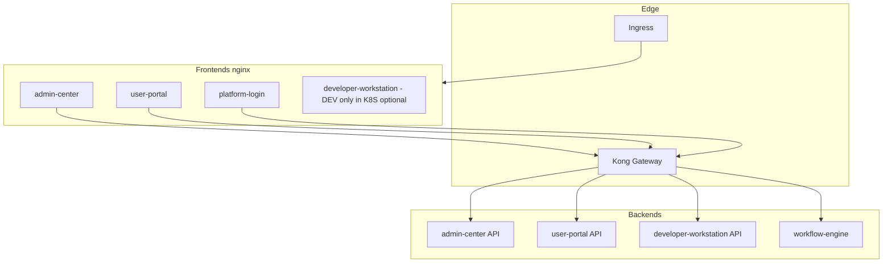
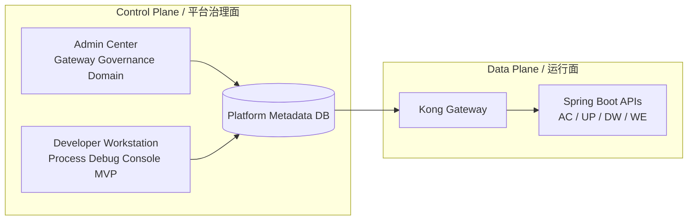
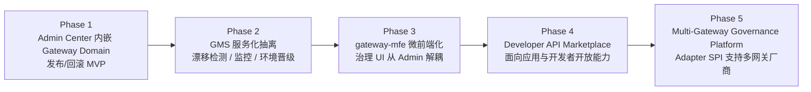

# 架构示意

## 逻辑模块（Maven）

```
platform-common ◄── platform-cache
       ▲            platform-security
       │            platform-messaging
       │
       ├── admin-center          (context-path: /api/v1/admin)
       ├── developer-workstation (context-path: /api/v1)
       ├── user-portal           (context-path: /api/portal)
       └── workflow-engine-core  (context-path: /)
```

`platform-*` 为共享 JAR，**不单独部署**。业务上可部署的后端为上述四个 Spring Boot 应用。

## 当前建设重点（2026-05）

### 1) Gateway Governance（规划中，分阶段推进）

- **当前运行态不变**：Kong 仍是统一 API Gateway 运行面。
- **治理面建设中**：以 Admin Center 内嵌 Gateway Domain 起步，逐步演进到独立 `gateway-mfe`，最终支持多网关治理。
- **统一建模方向**：平台侧以 `API / Application / Policy / Release` 作为业务模型，不直接暴露 Kong 原生对象给前端。
- **治理路线图**：尚未成文（规划中；注意 [architecture-optimization-plan.md](./architecture-optimization-plan.md) 已将「多厂商 Adapter SPI」类扩展判为过度设计，路线图落笔时需对齐该口径）。

### 2) Process Debug Console MVP（Developer Workstation）

- 在 `Process Design` 现有模拟能力上扩展 **可解释性 + 可执行性**。
- **Gateway Explain**：展示网关分支命中结果与命中原因。
- **Lookup Live Probe**：在 debug 会话中执行真实 lookup 探测并返回回填结果。
- **Action Button Runner**：在 debug 会话中执行 action 并返回变量补丁与执行日志。
- 采用“**模拟器主导**”路径，不引入完整 runtime 引擎，控制爆炸半径（MVP 规格尚未成文）。

## 请求路径（典型生产 / K8S）

浏览器只暴露 **Ingress 域名**；静态资源由各前端 **nginx** 容器提供；浏览器对 **`/api/*`** 的请求由 nginx **`proxy_pass`** 到 **Kong**，再由 Kong 路由到对应后端（JWT 校验策略以各服务与 Kong 配置为准）。



## 控制面 vs 运行面（当前口径）



- **Control Plane**：配置、策略、发布、回滚、调试观测。
- **Data Plane**：真实流量转发与运行时服务处理。
- **约束**：前端不直接调用 Kong Admin API，平台后端负责治理操作编排。

## Gateway Governance 演进时序（Phase 1 → Phase 5）



- **Phase 1**：先在现有 Admin Center 内落地最小治理闭环，快速验证发布/回滚链路。
- **Phase 2**：补齐治理中台能力（服务化、漂移治理、观测、跨环境推广）。
- **Phase 3**：治理前端能力独立为 `gateway-mfe`，降低对 Admin 主体耦合。
- **Phase 4**：从“平台治理”扩展到“开发者消费”，引入 API Marketplace。
- **Phase 5**：通过 Adapter SPI 从 Kong 单一实现演进到多网关统一治理。

## 与本地 Compose 的差异

- **Dev**：`docker-compose.dev.yml` 可拉起 **developer-workstation** 前后端、Kong、**edge-frontend**（默认 `EDGE_FRONTEND_PORT=3000`，单源路径 `/admin/`、`/portal/`、`/login/`、`/help/`、`/dev/`）、中间件与业务后端；各子应用也可直连各自 `*_FRONTEND_PORT`（如 3100–3111）。端口以 `deploy/environments/dev/.env` 为准，汇总表见 `BUILD_GUIDE.md` §8.2。
- **SIT/UAT/PROD（默认清单）**：`deploy.ps1` **不**部署 `developer-workstation`；需要时在维护窗口手动应用 `deployment-developer-workstation-optional.yaml`（勿用于生产租户 unless 政策允许）。

## 数据与异步

- **PostgreSQL**：业务库 + Flowable 表；N8N 使用独立库（如 `n8n_{env}`）。
- **Redis**：会话/缓存等（按服务配置）。
- **Kafka**：如 `platform.notification.events`（站内信等）；**developer-workstation** 不参与门户消息消费。
