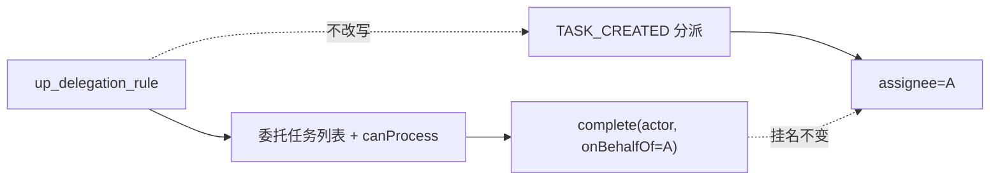
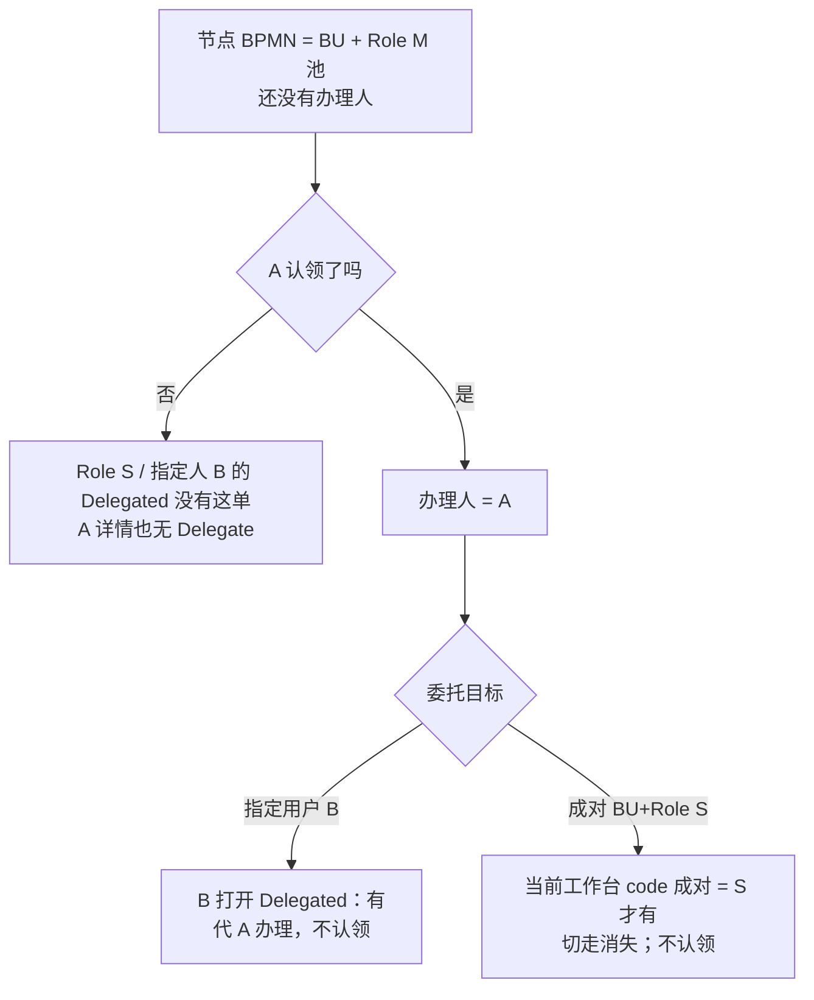
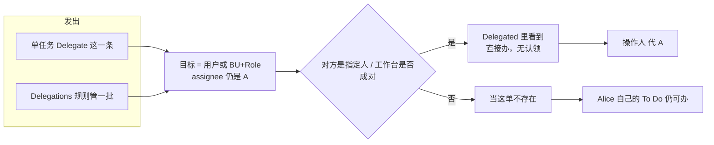
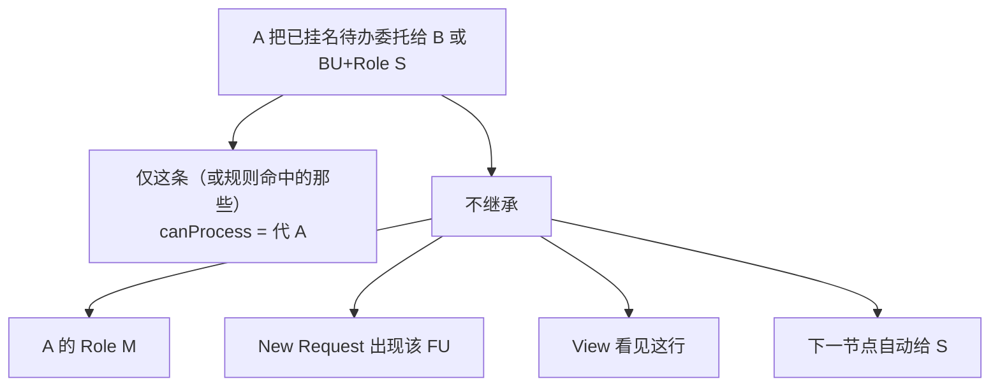
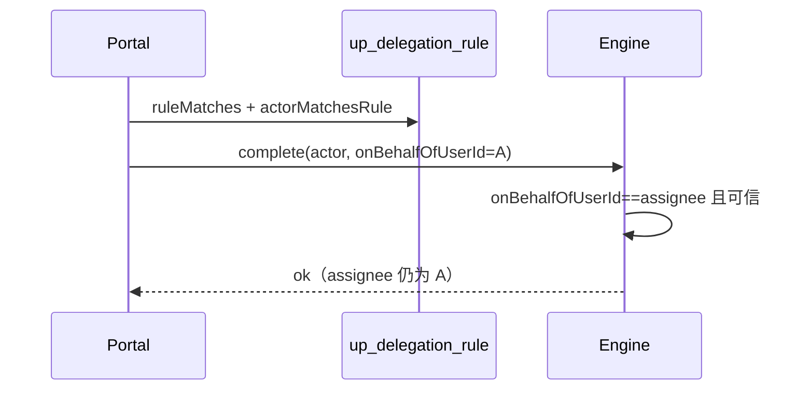

# User Portal：站立任务委托（不改 assignee）

> 状态：**方案已定稿（2026-09-14；2026-09-15 补认领池交叉与代办权限）** · 本文只做**站立规则** · 目标：**指定用户** 或 **某个 BU + 某个 Role** · 单任务按钮见 [portal-task-single-delegate.md](./portal-task-single-delegate.md) · 转办 / UBR「代办申请」/ Admin 权限委托 **不理**

关联：[portal-task-single-delegate.md](./portal-task-single-delegate.md) · [portal-bu-rbac.md](./portal-bu-rbac.md) · [portal-permission-self-service.md](./portal-permission-self-service.md)（UBR 代办申请 ≠ 本文）· [shared-list-components.md](./shared-list-components.md) · [owner-field-component.md](./owner-field-component.md)

用词与单任务委托相同，见 sibling **§0**：任务叫 **委托**；To Do 筛选与本页 Tab 叫 **委托任务**；B 看单叫 **代 A 办理**；complete 参数 `onBehalfOfUserId`。  
菜单 Tab 的 i18n **key** 可仍叫 `delegation.proxyTasks`（共享列表已用这名字）；**文案**必须是「委托任务 / Delegated」。  
BU+Role 与单任务同一套：**不认领**；**必须切到该 BU+Role 工作台** 才看得见、办得了。

---

## 1. 一句话

A 配**委托规则**（时间窗内）：把挂在 A 名下的待办交给 **指定用户 B**，或交给 **某个 BU + 某个 Role**。Flowable `assignee` **始终是 A**；办结记「操作人 代 A」。

---

## 2. 范围

| 做 | 不做 |
|----|------|
| `up_delegation_rule` CRUD / 暂停恢复；目标 USER 或成对 BU+Role | 转办；创建任务时自动改派 |
| `ruleMatches` + 委托任务列表（设置页 Tab **和** To Do 的 `DELEGATED` 筛选，同一查询） | 默认 To Do 自动并进站立委托 |
| 工作台成对匹配 BU_ROLE 规则 | 单任务按钮（见 sibling）；本文不写任务上的 `delegated_*` |
| complete 可信 `onBehalfOfUserId`（与单任务 **共用**） | Flowable 原生 `delegateTask`/`resolveTask`；认领 |
| 委托页：选用户 **或** 选 BU+Role / 类型校验 / **委托任务** Tab | 引擎读规则表；虚拟组；仅 BU 或仅 Role |

---

## 3. 模型



| 真相 | 表/字段 |
|------|---------|
| 谁可以顶谁 | `up_delegation_rule`（USER：`delegate_id`；BU_ROLE：`delegate_bu_code` + `delegate_role_code`） |
| 任务挂谁名下 | `ACT_RU_TASK.assignee`（= 委托人 A） |
| 办理审计 | `up_delegation_audit` + 历史「操作人 代 A」 |

列表 `assignmentType=DELEGATED` 仍是 **portal DTO 标记**。站立规则 **不写** `wf_extended_task_info.delegated_*`（那是单任务按钮的真相）。

### 规则字段

已有：`delegator_id` / `delegate_id` / `delegation_type` / `process_types` / `priority_filter` / `start_time` / `end_time` / `status` / `reason` / `lock_version`

**增列**（init-scripts 只增；`delegate_id` 改为可空）：

| 列 | USER | BU_ROLE |
|----|------|---------|
| `delegate_target_type` | `USER`（存量空 = USER） | `BU_ROLE` |
| `delegate_id` | 用户 ID | null |
| `delegate_bu_code` | null | BU code |
| `delegate_role_code` | null | Role code |

BU、Role **存 code**。禁止只填一侧。

| type（`delegation_type`，覆盖哪些任务） | 要点 |
|------|------|
| `ALL` | 窗内全部（建议有起止） |
| `PARTIAL` | `process_types` **必填**，值为 **功能单元 code**（门户发起码 / startable `key`）列表；Matcher 同时认任务 `functionUnitCode`（含流程变量）与 BPMN `processDefinitionKey`。站立 overlay 在匹配前用 `RequestIdEnricher` 从 `up_process_instance` 填 code（引擎 assigned-to 列表不含 variables） |
| `TEMPORARY` | 起止 **必填** |
| `URGENT` | **本阶段 UI 隐藏**。类型仍存在于枚举/库；Matcher 仍比字符串 `URGENT`/`CRITICAL`。发起不写 Flowable 优先级，现网任务无法标紧急。真·紧急委托见后续分期 |

`priority_filter` 非空时再 ∩ 该集合（大小写不敏感）。

```
ruleMatches(task, rule)
  ACTIVE 且 now∈[start,end]（null 视为无界）
  + type 门控（PARTIAL∈process_types；URGENT∈{URGENT,CRITICAL}）
  + 若 priority_filter 非空则 priority∈filter

actorMatchesRule(actor, workspace, rule)
  USER: actor == delegate_id
  BU_ROLE: workspace 的 BU code + Role code 成对等于规则
```

查询 / `canProcess` / complete 前共用上述两函数，禁止复制第二份。实现类：`DelegationRuleMatcher`。

循环委托：仅 **USER→USER** 创建时检测，最大深度 2。BU_ROLE 不做用户链循环检测。  
自委托：USER 下拉不列出当前用户；POST 仍校验禁自己。BU_ROLE 允许 A 选一个自己也在的 UBR（列表按 `taskId` 去重，避免本人 To Do 与委托任务各出现一次）。

---

## 4. 实现对照

相对 2026-08 草稿，下列项在实现中收口（不要再当「未做缺口」抄）：

| 项 | 锁定 |
|----|------|
| 默认 To Do | 本人任务 ∪ 认领池，**不**合并站立委托 |
| 委托任务入口 | 设置 → 委托管理 Tab **和** To Do 筛选 `assignmentTypes=DELEGATED`；同一 `DelegatedTaskQueryComponent` |
| `GET /delegations/proxy-tasks` | 返回委托**任务**（`TaskInfo`），禁止再返回规则列表 |
| 引擎 complete | 服务间：`onBehalfOfUserId == ASSIGNEE_` 即放行；**不**要求扩展表已委托。Portal 在 `ruleMatches` ∧ `actorMatchesRule`（或单任务 `isSingleTaskDelegatee`）通过后才组该字段。前端**不得**传 `onBehalfOfUserId` |
| Owner Case Handler | 委托期间仍是 A；该节点 Complete 写实际操作人（与 sibling / owner 文档一致） |

---

## 5. 主流程

### 5.1 配置

委托人 → 委托管理 → 选目标：**指定用户** 或 **指定 BU 和 Role**（Role 下拉 `GET /business-units/{id}/roles`）→ `POST /delegations` → 校验（USER 禁自己 / 循环；BU_ROLE 成对必填 / PARTIAL·TEMPORARY 字段）→ 存 ACTIVE + 审计。

### 5.2 看待办（委托任务列表）

并行：

- 单任务 overlay（引擎 `delegated_*`，见 sibling）
- USER 规则：当前用户 = `delegate_id` → 拉各委托人**已指派**任务
- BU_ROLE 规则：当前工作台 code 成对匹配 → 拉各委托人**已指派**任务

均经 **`ruleMatches`** → 投影 `DELEGATED`。  
**只叠** `assignee==委托人` 的已指派任务（候选池 / 未认领认领池不进 **委托任务**）。SYS_ADMIN 不因此看见全部站立委托任务。

切走该 BU+Role 工作台 → 对应 **BU_ROLE 规则**的委托任务消失。USER 规则按指定人命中，**不要**再用查看者工作台把 A 已占的 `FIXED_BU_ROLE` 单滤掉（见下段 overlay 过滤）。

委托任务 overlay **不要**再套查看者自己的 `FIXED_BU_ROLE` 工作台过滤（`MineTaskScanner#applyDelegatedOverlayPostFilters`）：那是 **A 已占着的单**，不是查看者的认领池。套上会把「A 从 M 池认领后叠给 B/S」的单滤掉。

### 5.2a 认领池 × 站立规则 / 单任务委托（用户走向）

两种入口的**目标类型相同**：指定用户 **或** 成对 BU+Role（禁止只选一侧）。差的是粒度。

| | 待办详情 **Delegate**（sibling） | Setup → Delegations **建规则**（本文） |
|---|---|---|
| 覆盖 | **这一条** | 时间窗内命中的、**已指派给 A** 的待办 |
| 未认领 Role M 池 | **无** Delegate 按钮 | **叠不出去** |

「BU+Role 委托不认领」只发生在 **后半段**：单已经是 A 的之后，对方代办时不要再占一次（认领会改 `assignee`）。前半段节点若是 Role **M** 池，A 仍须先认领，否则这单还不是「A 的工作」。



按人走：



同一 S 工作台下多人：谁打开谁就能办，没有「先认领别人就办不了」。该 UBR 暂无人：列表空，单仍挂 A。

### 5.2b 代办人权限（任务级，不是 UBR 转授）

委托放开的是 **这条已挂 A 的待办**：列表可见、`canProcess` / 表单读写、complete（服务间 `onBehalfOfUserId=A`）。  
Portal：`assignee==自己` **或** `isSingleTaskDelegatee` **或** `matchesStanding`。  
引擎：可信且 `onBehalfOfUserId == assignee` 即放行；**不校验**代办人是否属于原节点 Role M；**不读**规则表。

**能办：** 合法命中后，与 A 同一张该节点待办表单，保存并批准。不要求对方平时会被 BPMN 分到这个节点。

**不会因此获得：** A 的 Role、该 FU 的 New Request 准入、Data View 行权限、A 的其它未委托待办、下一节点分派。



| 反例 | 期望 |
|---|---|
| 节点 Role M 池且 A 未认领 | B/S 不可见不可办 |
| 工作台 ≠ 目标 BU+Role | 不可见，complete 403 |
| PARTIAL 不含该 FU / 暂停 / 过期 | 不可见 |
| 无关用户 C | 403 |
| B 打开 New Request / View | 仍按 **B 自己**当前工作台准入，不继承 A |
| 下一节点新任务 | 代办关系不延续；按 BPMN 重新分派 |

表单内容跟 **该节点 To Do 表单设计**走，不按代办人角色再裁一套字段。Owner Case Handler：未 Complete 仍是 A；该节点 Complete 写实际操作人（见 [owner-field-component.md](./owner-field-component.md)）。

### 5.3 办理（核心）

1. Portal：非本人 assignee 时 `ruleMatches` **且** `actorMatchesRule`，失败 403。  
2. **不认领**。complete 带 `onBehalfOfUserId=A`（仅服务间）。  
3. 引擎：可信且 `onBehalfOfUserId == assignee` → 允许；**不读**规则表；**不**要求 `wf_extended_task_info.delegated_*`。  
4. 审计「操作人 代 A」；**禁止** `setAssignee`。

A 自办：走 assignee 匹配。



---

## 6. 实现落点

| 层 | 做什么 |
|----|--------|
| Schema | `delegate_id` 可空；增 `delegate_target_type` / `delegate_bu_code` / `delegate_role_code` + 索引 |
| Portal | `DelegationRuleMatcher`；叠加查询 USER ∪ 当前工作台 BU_ROLE；站立命中也组 `onBehalfOfUserId` |
| Engine | `TaskCompletionService`：`onBehalfOfUserId == assignee` 即放行（与单任务共用） |
| UI | 创建规则：指定用户 **或** BU+Role；委托任务 Tab（共享列表）；详情「代 A 办理」 |
| i18n | sibling §0；菜单 Tab 文案「委托任务」 |
| Help | 站立规则独立 Guidelines + 委托管理页头 `?`（不要挤进 task-delegate） |

API：现有 `/delegations*` 扩展目标类型（不传则 USER）。`/transfer` 不动。`/delegate` 见 sibling。

---

## 7. 验收

| | 场景 | 期望 |
|--|------|------|
| 反 | 无规则 / 过期 / SUSPENDED / PARTIAL 不含该流程 | 不可见不可办 |
| 反 | USER 委托给自己 | 400 |
| 反 | 只选 BU 或只选 Role | 400 |
| 反 | PARTIAL 未选功能单元 | 400 |
| 反 | TEMPORARY 无起止 | 400 |
| 反 | 伪造 `onBehalfOfUserId` | 引擎拒 |
| 反 | 仅候选池 | 不进委托任务列表 |
| 反 | 节点 Role M 池且 A 未认领，A 已建规则给 Role S | S 的 Delegated **没有**这单；A 详情无 Delegate |
| 反 | BU+Role 规则但工作台对不上 | 看不见、办不了 |
| 反 | 代办人无该 FU 的 New Request / View 准入 | **仍可**办已委托待办；发起目录与 View **仍不可**见 |
| 正 | USER 规则 ACTIVE 窗内 | B 可见可办；assignee 仍 A；不认领 |
| 正 | BU+Role 规则 | 切到该工作台可见可办；换工作台不可见；不认领 |
| 正 | 办结 | 流程前进；历史「操作人 代 A」 |
| 正 | A 配规则后自办 | 允许 |
| 正 | 三 Tab | 规则 / 委托任务 / 审计均为共享列表 |

验证：portal/engine 单测 + 委托管理（用户 / BU+Role 各一）+ 委托任务截图（含换工作台）。

---

## 8. 分期

| 阶段 | 内容 |
|------|------|
| **P0** | Matcher（含 `actorMatchesRule`）+ 过滤 + `onBehalfOfUserId` + USER 与 BU_ROLE 规则（可与单任务共用 complete） |
| **P1** | UI 选人/选 BU+Role/校验/委托任务 Tab/徽章/Help |
| **以后** | 批量查询优化；取消/收回 |

---

## 9. 决策

| | 决定 |
|--|------|
| D1 | 本文只做站立规则；单任务按钮见 sibling |
| D2 | 规则不改写 TASK_CREATED、不写任务 `delegated_*` |
| D3 | 引擎不读规则表；portal 校验 + 可信 `onBehalfOfUserId == assignee`（不强制扩展表已委托） |
| D4 | 不用 Flowable 原生委托；不认领 |
| D5 | 委托任务列表仅已指派任务 |
| D6 | 用词见 sibling §0；菜单 Tab 文案「委托任务」 |
| D7 | 规则目标：指定用户 **或** 成对 BU+Role（存 code） |
| D8 | BU+Role **必须当前工作台成对匹配** 才可见可办 |
| D9 | SYS_ADMIN 不因此看见全部站立委托任务 |
| D10 | 默认 To Do 不合并站立委托 |
| D11 | PARTIAL = 功能单元 code（兼认 BPMN process id）；URGENT 枚举保留、创建 UI 隐藏 |
| D12 | 前端不得传 `onBehalfOfUserId` |
| D13 | 委托是任务级 `canProcess`，**不是**把 A 的 UBR / FU 准入 / View 转授给代办人 |
| D14 | 认领池未 hold 不叠委托；「不认领」只指代办方办理时不再 claim |

---

## 10. 代码索引

`DelegationRule` / `DelegationRuleMatcher` / `DelegationComponent` / `DelegatedTaskQueryComponent` / `TaskPermissionEvaluator`（portal）· `TaskCompletionService`（engine）· `delegations/index.vue` / `DelegationCreateDialog.vue` / `DelegationProxyTasksList.vue` · schema `up_delegation_rule` 增列
