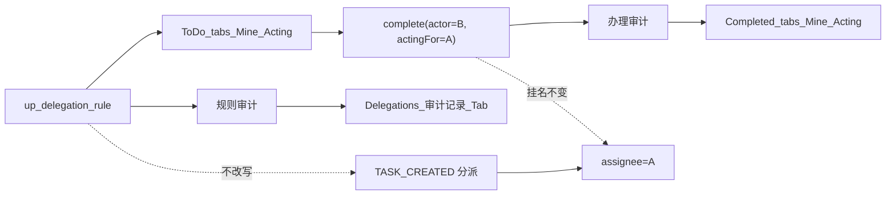
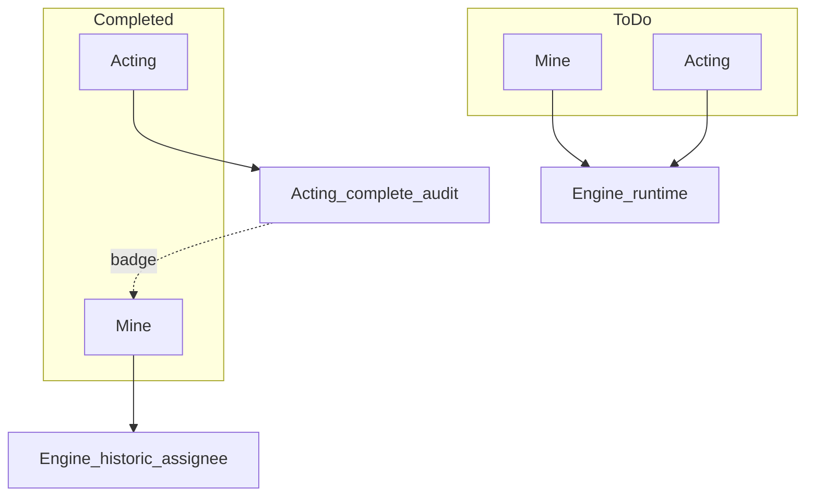
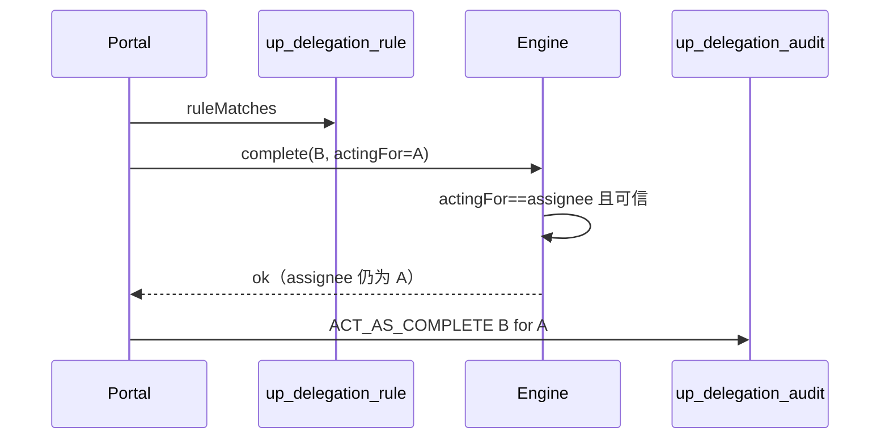

# User Portal：站立任务委托（act-as）

> 状态：**P0+P1 已落地** · 本期只做**站立规则** · 单任务 DELEGATE/TRANSFER / UBR「代办」/ Admin 权限委托 **一律不理**

关联：[portal-bu-rbac.md](./portal-bu-rbac.md) · [portal-permission-self-service.md](./portal-permission-self-service.md)（UBR 代办 ≠ 本文）

---

## 1. 一句话

A 配规则让 B 在时间窗内**看见并办完**挂在 A 名下的待办；Flowable `assignee` **始终是 A**；办结记「B 代 A」。

待办 `/tasks` 与已办 `/tasks/completed` 均用**页内双 Tab**「我的 | 代理办理」；**不**用侧栏二级菜单；任务页 Tab **不**叫「审计」。

---

## 2. 范围

| 做 | 不做 |
|----|------|
| `up_delegation_rule` CRUD / 暂停恢复 | 单任务 DELEGATE/TRANSFER、DW 委托按钮 |
| `ruleMatches` 过滤；待办/已办**页内双 Tab**分源展示 | 默认把引擎任务与代理任务 merge 成一张表 |
| complete 可信 `actingFor` + **办理审计**落库（代理已办数据源） | Flowable 原生 `delegateTask`/`resolveTask` |
| 委托页选人 / 类型校验；代理入口深链 To Do | 侧栏再挂代理子菜单；任务页第三「审计」Tab；引擎读规则表；改 `wf_extended_task_info.delegated_*` |

文案：任务 Tab / 行内用「代理办理 / 代某某办理」；**不用**「代办」（撞 UBR）。

---

## 3. 模型



| 真相 | 表/字段 |
|------|---------|
| 谁可以顶谁 | `up_delegation_rule` |
| 任务挂谁名下 | `ACT_RU_TASK.assignee`（= 委托人） |
| 规则审计 / 办理审计 | 同表 `up_delegation_audit`，用 `operation_type` 区分（见 §5.5） |

列表里的 `assignmentType=DELEGATED` 只是 **portal DTO 标记**，不是引擎扩展表状态。

### 规则字段（已有表）

`delegator_id` / `delegate_id` / `delegation_type` / `process_types` / `priority_filter` / `start_time` / `end_time` / `status` / `reason` / `lock_version`

| type | 要点 |
|------|------|
| `ALL` | 窗内全部（建议有起止） |
| `PARTIAL` | `process_types` **必填** |
| `TEMPORARY` | 起止 **必填** |
| `URGENT` | 只匹配紧急档 priority（实现前锁定枚举值） |

```
ruleMatches(task, rule)  // 查询 / canProcess / complete 前共用，禁止复制第二份
  ACTIVE 且 now∈[start,end]
  + type 门控（PARTIAL∈process_types；URGENT∈urgentSet …）
  + 若 priority_filter 非空则 priority∈filter
```

循环委托：创建时检测，最大深度 2。

---

## 4. 现状缺口（As-Is）

| 已有 | 缺口 |
|------|------|
| 规则 CRUD、循环检测、待办叠加骨架；`up_delegation_audit` 表与规则类审计 | `process_types`/`priority_filter` **未**用于查询/鉴权 |
| portal `canProcess` 认规则 | 引擎 complete **只认** assignee → 代理常办不成；**办理审计**未在 complete 路径稳定写入 |
| 待办默认 merge 两路；已办按 `assignee=我` | merge 导致翻页错误；B 代理办完后已办看不到；委托页代理 Tab stub；创建规则选人硬编码 |

---

## 5. 主流程

### 5.0 Tab 命名规范（两页共用）

**原则**

1. 待办页与已办页同构：`My Tasks | Acting For`，词根一致。  
2. 侧栏已表生命周期（Pending Tasks / Completed Tasks；中文：待办 / 已办），Tab **不再**叠「待办/已办」长后缀。  
3. 禁用「代办」；代理侧用「代理办理」/ `Acting For`。  
4. i18n：key 固定，三语文案可换。  
5. 任务页 Tab **不**命名为「审计」（审计见 §5.5）。

| locale | Tab A（默认） | Tab B |
|--------|---------------|-------|
| zh-CN | 我的 | 代理办理 |
| zh-TW | 我的 | 代理辦理 |
| en | My Tasks | Acting For |

| locale | 侧栏待办 | 侧栏已办 |
|--------|----------|----------|
| zh-CN | 待办 | 已办 |
| zh-TW | 待辦 | 已辦 |
| en | Pending Tasks | Completed Tasks |

| i18n key | 用途 |
|----------|------|
| `task.tab.mine` | 两页共用 Tab A |
| `task.tab.actingForOthers` | 两页共用 Tab B |

空状态示例：`暂无代理办理` / `No tasks to act for`。  
行内（非 Tab 名）：「代 {name} 办理」「由 {name} 代理完成」。

**弃用**：我的待办/代理任务；我完成的/我代理完成的；Assigned to me/Delegated（易混引擎单次 delegate）；Mine / Acting for others / To Do（口语化旧英译）。

### 5.1 配置

委托人 → Delegations 页 → `POST /delegations` → 校验（禁自委托 / 循环 / 类型字段）→ 存 ACTIVE + **规则审计**。

### 5.2 看待办（页内双 Tab，默认不合并）

侧栏仍只保留 `/tasks` 一级入口。页内 Tab：

| Tab | 数据源 | 分页 |
|-----|--------|------|
| **我的** | 引擎本人任务；**不拼**委托 | 信任引擎 `page/size` + `total`；**禁止**引擎已切页再 `subList` |
| **代理办理** | 按规则拉各委托人任务 → **`ruleMatches`** → 投影 `DELEGATED` → 同一 workspace BU 过滤 | 过滤后内存分页；`total = 过滤后条数` |

- 默认落在「我的」；「代理办理」可角标数量（P1）。
- 首版**仅** `assignee==委托人` 的已指派任务（候选池不进列表）。
- 深链：`/tasks?view=proxy`（书签/外链可选；委托页不再提供 Proxy Tasks 入口）。
- API：我的 → 不含 `DELEGATED`；代理办理 → `assignmentTypes=DELEGATED`（已有 `queryDelegatedTasksOnlyPage`）。

**禁止**默认两路 merge 再切页。

### 5.3 看已办（页内双 Tab）

侧栏仍只保留 `/tasks/completed` 一级入口。页内 Tab（文案同 §5.0）：

| Tab | 数据源 | 说明 |
|-----|--------|------|
| **我的** | 引擎 `assignee=我` 的 finished 历史 | 本人挂名且办结 |
| **代理办理** | **不以** `assignee=我` 为准；以 **办理审计**（§5.5）hydrate 任务摘要 | 表已有；P0 须保证 complete 写入 |

- 委托人 A：「我的」已办仍可见挂名=A 的办结行；行上标「由 B 代理完成」（同源办理审计），**不**另开第三 Tab。
- 两 Tab 独立分页；代理已办按办理审计时间倒序。
- 深链：`/tasks/completed?view=proxy`。



### 5.4 办理（核心）

1. Portal：非本人 assignee 时再跑 `ruleMatches`，失败 403。  
2. 调引擎 complete 带 `actingForUserId=委托人`（**仅服务间**，浏览器不可伪造）。  
3. 引擎：可信请求且 `actingFor == assignee` → 允许 actor 完成；**不读**规则表。  
4. 写入 **办理审计**（§5.5）；**禁止** `setAssignee(B)`。



### 5.5 审计双域（同表、分用途）

`up_delegation_audit` **已存在**。任务列表 Tab **不叫**「审计」。

| 域 | `operation_type`（示例） | 谁看 | UI |
|----|--------------------------|------|-----|
| **规则审计** | `CREATE_DELEGATION` / `UPDATE_*` / `SUSPEND_*` / `RESUME_*` / `DELETE_*` | 规则变更追溯 | 委托管理页「审计记录」Tab（现有） |
| **办理审计** | `ACT_AS_COMPLETE`（及必要的办操作）含 `task_id`、delegator、delegate、结果 | 代理已办列表；A 行徽章 | **数据源**，不是任务页第三 Tab |

- 委托页「审计记录」以规则类为主；办理类可同表可选列出，**不**替代已办「代理办理」列表。  
- P0：complete 路径必须写办理审计，否则已办「代理办理」无数据。

---

## 6. 实现落点（评审通过后再写代码）

| 层 | 做什么 |
|----|--------|
| Portal | 抽 `DelegationRuleMatcher`；查询/鉴权/complete 前共用；组装 `actingFor`；写 `ACT_AS_COMPLETE`；待办默认不 merge；代理已办按办理审计查询 |
| Engine | `TaskCompletionService` 认可信 `actingForUserId` |
| UI | To Do / Completed **页内双 Tab**（`task.tab.mine` / `task.tab.actingForOthers`）；行内「代 A 办理」/「由 B 代理完成」；委托页**不**再挂 Proxy Tasks Tab |
| i18n | 三语按 §5.0；勿用「代办」指任务 Tab |

API：现有 `/delegations*`（规则 CRUD / 审计）；complete 注入 actingFor。`/delegate|/transfer` 现网不动。  
代理待办/已办统一走 tasks 查询（`assignmentTypes=DELEGATED`）+ 办理审计；已删除 `GET /delegations/proxy-tasks` 与委托页 Proxy Tasks Tab。

---

## 7. 验收

| | 场景 | 期望 |
|--|------|------|
| 反 | 无规则 / 过期 / SUSPENDED / PARTIAL 不含该流程 | 不可见不可办 |
| 反 | 伪造 actingFor | 引擎拒 |
| 反 | 仅候选池 | 不进「代理办理」待办 |
| 反 | 默认打开 To Do / Completed | **不再**合并列表；侧栏无代理二级菜单；任务页无「审计」Tab |
| 正 | ACTIVE 窗内 | B 在待办「代理办理」可见可 complete；assignee 仍 A；有办理审计 |
| 正 | 办结 | 流程前进；B 在已办「代理办理」可见；A「我的」同行有「由 B 代理完成」 |
| 正 | 两页 Tab 文案 | 均为「我的 / 代理办理」（及 en/zh-TW 对应）；翻页互不串数据 |

验证：相关 mvn 单测 + 待办/已办双 Tab 与委托页截图。

---

## 8. 分期

| 阶段 | 内容 |
|------|------|
| **P0** | Matcher + 过滤 + actingFor + **办理审计写入/可查**；待办「我的」去掉二次切页且不 merge ✅ |
| **P1** | To Do / Completed 页内双 Tab UI（§5.0 文案）、角标、选人/类型校验、委托页深链、A 侧徽章 ✅ |
| **以后** | 单任务委托梳理；代理查询批量优化 |

---

## 9. 决策

| | 决定 |
|--|------|
| D1 | 本期只做站立 act-as |
| D2 | 规则不改写 TASK_CREATED |
| D3 | 引擎不读规则表；portal 校验 + 可信 actingFor |
| D4 | 不用 Flowable 原生委托 |
| D5 | 代理待办列表仅已指派任务 |
| D6 | 待办/已办均用**页内双 Tab**；分源分页；**不用**侧栏二级菜单 |
| D7 | 已办「代理办理」以**办理审计**为准，不以 `assignee=我` |
| D8 | Tab 文案两页共用「我的 / 代理办理」；任务页不设「审计」Tab；规则审计留在委托管理页 |

---

## 10. 代码索引

`DelegationRule` / `DelegationComponent` / `DelegatedTaskQueryComponent` / `TaskPermissionEvaluator` / `TaskQueryComponent` / `TaskHistoryComponent` / `DelegationAudit`（portal）· `TaskCompletionService` / `HistoryController`（engine）· `tasks/index.vue` / `tasks/completed.vue` / `delegations/index.vue` · schema `03-user-portal-schema.sql`
