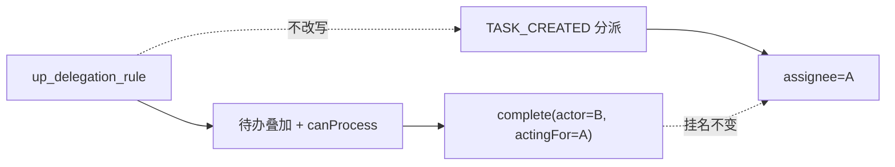
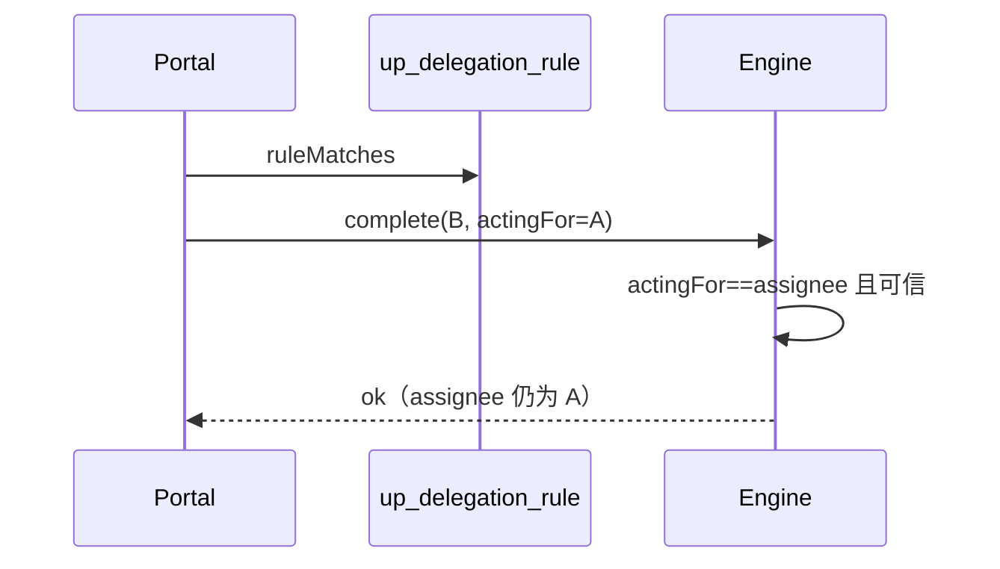

# User Portal：站立任务委托（act-as）

> 状态：**方案定稿中** · 本期只做**站立规则** · 单任务 DELEGATE/TRANSFER / UBR「代办」/ Admin 权限委托 **一律不理**

关联：[portal-bu-rbac.md](./portal-bu-rbac.md) · [portal-permission-self-service.md](./portal-permission-self-service.md)（UBR 代办 ≠ 本文）

---

## 1. 一句话

A 配规则让 B 在时间窗内**看见并办完**挂在 A 名下的待办；Flowable `assignee` **始终是 A**；办结记「B 代 A」。

---

## 2. 范围

| 做 | 不做 |
|----|------|
| `up_delegation_rule` CRUD / 暂停恢复 | 单任务 DELEGATE/TRANSFER、DW 委托按钮 |
| 待办叠加 + `ruleMatches` 过滤 | 创建任务时自动改派 |
| complete 可信 `actingFor`（闭合引擎缺口） | Flowable 原生 `delegateTask`/`resolveTask` |
| 委托页选人 / 类型校验 / 代理任务 Tab | 引擎读规则表；改 `wf_extended_task_info.delegated_*` |

文案用「委托规则 / 代理任务 / 代某某办理」，**不用**「代办」（撞 UBR）。

---

## 3. 模型



| 真相 | 表/字段 |
|------|---------|
| 谁可以顶谁 | `up_delegation_rule` |
| 任务挂谁名下 | `ACT_RU_TASK.assignee`（= 委托人） |
| 办理审计 | `up_delegation_audit` + 历史「B 代 A」 |

列表里的 `assignmentType=DELEGATED` 只是 **portal DTO 标记**，不是引擎扩展表状态。

### 规则字段（已有表）

`delegator_id` / `delegate_id` / `delegation_type` / `process_types` / `priority_filter` / `start_time` / `end_time` / `status` / `reason` / `lock_version`

| type | 要点 |
|------|------|
| `ALL` | 窗内全部（建议有起止） |
| `PARTIAL` | `process_types` **必填** |
| `TEMPORARY` | 起止 **必填** |
| `URGENT` | 只匹配紧急档 priority（实现前锁定枚举值） |

```
ruleMatches(task, rule)  // 查询 / canProcess / complete 前共用，禁止复制第二份
  ACTIVE 且 now∈[start,end]
  + type 门控（PARTIAL∈process_types；URGENT∈urgentSet …）
  + 若 priority_filter 非空则 priority∈filter
```

循环委托：创建时检测，最大深度 2。

---

## 4. 现状缺口（As-Is）

| 已有 | 缺口 |
|------|------|
| 规则 CRUD、循环检测、待办叠加骨架 | `process_types`/`priority_filter` **未**用于查询/鉴权 |
| portal `canProcess` 认规则 | 引擎 complete **只认** assignee → 代理常办不成 |
| | 代理 Tab stub；创建规则选人硬编码 |

---

## 5. 主流程

### 5.1 配置

委托人 → Delegations 页 → `POST /delegations` → 校验（禁自委托 / 循环 / 类型字段）→ 存 ACTIVE + 审计。

### 5.2 看待办

并行：本人引擎任务 ∥ 按规则拉各委托人任务 → **`ruleMatches`** → 投影 `DELEGATED` → **同一 workspace BU 过滤**。  
首版**只叠** `assignee==委托人` 的已指派任务（候选池不进列表）。

### 5.3 办理（核心）

1. Portal：非本人 assignee 时再跑 `ruleMatches`，失败 403。  
2. 调引擎 complete 带 `actingForUserId=委托人`（**仅服务间**，浏览器不可伪造）。  
3. 引擎：可信请求且 `actingFor == assignee` → 允许 actor 完成；**不读**规则表。  
4. 审计「B 代 A」；**禁止** `setAssignee(B)`。



---

## 6. 实现落点（评审通过后再写代码）

| 层 | 做什么 |
|----|--------|
| Portal | 抽 `DelegationRuleMatcher`；查询/鉴权/complete 前共用；组装 `actingFor` |
| Engine | `TaskCompletionService` 认可信 `actingForUserId` |
| UI | 用户搜索、类型校验、代理任务 Tab、详情「代 A 办理」 |
| i18n | 三语；勿用「代办」指任务 |

API：现有 `/delegations*`；complete 注入 actingFor。`/delegate|/transfer` 现网不动。  
`proxy-tasks` 今日返回规则列表属缺陷 → 改为任务列表或文档化为 `GET /tasks?assignmentTypes=DELEGATED`。

---

## 7. 验收

| | 场景 | 期望 |
|--|------|------|
| 反 | 无规则 / 过期 / SUSPENDED / PARTIAL 不含该流程 | 不可见不可办 |
| 反 | 伪造 actingFor | 引擎拒 |
| 反 | 仅候选池 | 不进代理列表 |
| 正 | ACTIVE 窗内 | B 可见可 complete；assignee 仍 A；历史「B 代 A」 |
| 正 | 办结 | 流程前进（与 A 自办一致） |

验证：相关 mvn 单测 + 委托页/代理待办截图。

---

## 8. 分期

| 阶段 | 内容 |
|------|------|
| **P0** | Matcher + 过滤 + actingFor |
| **P1** | UI 选人/校验/代理 Tab/徽章 |
| **以后** | 单任务委托梳理；批量查询优化 |

---

## 9. 决策

| | 决定 |
|--|------|
| D1 | 本期只做站立 act-as |
| D2 | 规则不改写 TASK_CREATED |
| D3 | 引擎不读规则表；portal 校验 + 可信 actingFor |
| D4 | 不用 Flowable 原生委托 |
| D5 | 代理列表仅已指派任务 |

---

## 10. 代码索引

`DelegationRule` / `DelegationComponent` / `DelegatedTaskQueryComponent` / `TaskPermissionEvaluator`（portal）· `TaskCompletionService`（engine）· `delegations/index.vue` · schema `03-user-portal-schema.sql`
