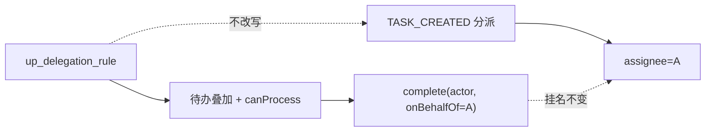
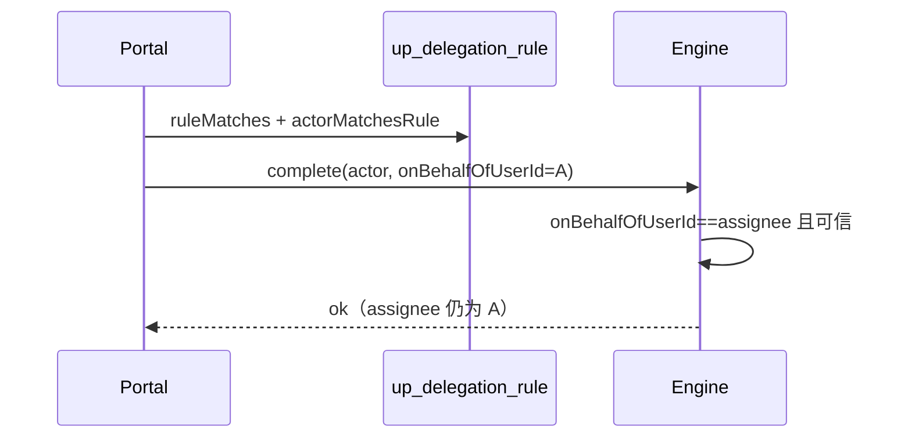

# User Portal：站立任务委托（不改 assignee）

> 状态：**方案定稿中（2026-08-26 修订）** · 本文只做**站立规则** · 目标：**指定用户** 或 **某个 BU + 某个 Role** · 单任务按钮见 [portal-task-single-delegate.md](./portal-task-single-delegate.md) · 转办 / UBR「代办申请」/ Admin 权限委托 **不理**

关联：[portal-task-single-delegate.md](./portal-task-single-delegate.md) · [portal-bu-rbac.md](./portal-bu-rbac.md) · [portal-permission-self-service.md](./portal-permission-self-service.md)（UBR 代办申请 ≠ 本文）

用词与单任务委托相同，见 sibling **§0**：任务叫 **委托**；To Do / 本页 Tab 叫 **委托任务**；B 看单叫 **代 A 办理**；complete 参数 `onBehalfOfUserId`。  
BU+Role 与单任务同一套：**不认领**；**必须切到该 BU+Role 工作台** 才看得见、办得了。

---

## 1. 一句话

A 配**委托规则**（时间窗内）：把挂在 A 名下的待办交给 **指定用户 B**，或交给 **某个 BU + 某个 Role**。Flowable `assignee` **始终是 A**；办结记「操作人 代 A」。

---

## 2. 范围

| 做 | 不做 |
|----|------|
| `up_delegation_rule` CRUD / 暂停恢复；目标 USER 或成对 BU+Role | 转办；创建任务时自动改派 |
| 待办叠加 + `ruleMatches`；工作台成对匹配 BU_ROLE 规则 | 单任务按钮（见 sibling）；本文不写任务上的 `delegated_*` |
| complete 可信 `onBehalfOfUserId`（与单任务 **共用**） | Flowable 原生 `delegateTask`/`resolveTask`；认领 |
| 委托页：选用户 **或** 选 BU+Role / 类型校验 / **委托任务** Tab | 引擎读规则表；虚拟组；仅 BU 或仅 Role |

---

## 3. 模型



| 真相 | 表/字段 |
|------|---------|
| 谁可以顶谁 | `up_delegation_rule`（USER：`delegate_id`；BU_ROLE：`delegate_bu_code` + `delegate_role_code`） |
| 任务挂谁名下 | `ACT_RU_TASK.assignee`（= 委托人 A） |
| 办理审计 | `up_delegation_audit` + 历史「操作人 代 A」 |

列表 `assignmentType=DELEGATED` 仍是 **portal DTO 标记**。站立规则 **不写** `wf_extended_task_info.delegated_*`（那是单任务按钮的真相）。

### 规则字段

已有：`delegator_id` / `delegate_id` / `delegation_type` / `process_types` / `priority_filter` / `start_time` / `end_time` / `status` / `reason` / `lock_version`

**增列**（init-scripts 只增；`delegate_id` 改为可空）：

| 列 | USER | BU_ROLE |
|----|------|---------|
| `delegate_target_type` | `USER`（存量空 = USER） | `BU_ROLE` |
| `delegate_id` | 用户 ID | null |
| `delegate_bu_code` | null | BU code |
| `delegate_role_code` | null | Role code |

BU、Role **存 code**。禁止只填一侧。

| type（`delegation_type`，覆盖哪些任务） | 要点 |
|------|------|
| `ALL` | 窗内全部（建议有起止） |
| `PARTIAL` | `process_types` **必填** |
| `TEMPORARY` | 起止 **必填** |
| `URGENT` | 只匹配紧急档 priority（实现前锁定枚举值） |

```
ruleMatches(task, rule)
  ACTIVE 且 now∈[start,end]
  + type 门控（PARTIAL∈process_types；URGENT∈urgentSet …）
  + 若 priority_filter 非空则 priority∈filter

actorMatchesRule(actor, workspace, rule)
  USER: actor == delegate_id
  BU_ROLE: workspace 的 BU code + Role code 成对等于规则
```

查询 / `canProcess` / complete 前共用上述两函数，禁止复制第二份。

循环委托：仅 **USER→USER** 创建时检测，最大深度 2。BU_ROLE 不做用户链循环检测。  
自委托：USER 禁自己。BU_ROLE 允许 A 选一个自己也在的 UBR（列表按 `taskId` 去重，避免本人 To Do 与委托任务各出现一次）。

---

## 4. 现状缺口（As-Is）

| 已有 | 缺口 |
|------|------|
| 规则 CRUD、循环检测、待办叠加骨架（只认 `delegate_id`） | `process_types`/`priority_filter` **未**用于查询/鉴权 |
| portal `canProcess` 认「指定用户」规则 | 引擎 complete **只认** assignee → 常办不成 |
| | 委托任务 Tab stub；创建规则选人硬编码；无 BU+Role 目标 |

---

## 5. 主流程

### 5.1 配置

委托人 → 委托管理 → 选目标：**指定用户** 或 **指定 BU 和 Role**（Role 下拉 `GET /business-units/{id}/roles`）→ `POST /delegations` → 校验（USER 禁自己 / 循环；BU_ROLE 成对必填 / 类型字段）→ 存 ACTIVE + 审计。

### 5.2 看待办

并行：

- 本人引擎任务
- USER 规则：当前用户 = `delegate_id` → 拉各委托人已指派任务
- BU_ROLE 规则：当前工作台 code 成对匹配 → 拉各委托人已指派任务

均经 **`ruleMatches`** → 投影 `DELEGATED` → **同一 workspace** 过滤（BU_ROLE 规则本身已按工作台成对；USER 规则仍受当前工作台数据范围约束，与现网一致）。  
首版**只叠** `assignee==委托人` 的已指派任务（候选池不进 **委托任务**）。SYS_ADMIN 不因此看见全部站立委托任务。

切走该 BU+Role 工作台 → 对应规则的委托任务消失。

### 5.3 办理（核心）

1. Portal：非本人 assignee 时 `ruleMatches` **且** `actorMatchesRule`，失败 403。  
2. **不认领**。complete 带 `onBehalfOfUserId=A`（仅服务间）。  
3. 引擎：可信且 `onBehalfOfUserId == assignee` → 允许；**不读**规则表。  
4. 审计「操作人 代 A」；**禁止** `setAssignee`。

A 自办：走 assignee 匹配。



---

## 6. 实现落点（评审通过后再写代码）

| 层 | 做什么 |
|----|--------|
| Schema | `delegate_id` 可空；增 `delegate_target_type` / `delegate_bu_code` / `delegate_role_code` + 索引 |
| Portal | `DelegationRuleMatcher`（`ruleMatches` + `actorMatchesRule`）；叠加查询 USER ∪ 当前工作台 BU_ROLE；`onBehalfOfUserId` |
| Engine | `TaskCompletionService` 认可信 `onBehalfOfUserId`（与单任务共用） |
| UI | 创建规则：指定用户 **或** BU+Role；委托任务 Tab；详情「代 A 办理」 |
| i18n | sibling §0 + 指定用户 / 指定 BU 和角色 |

API：现有 `/delegations*` 扩展目标类型（不传则 USER）。`/transfer` 不动。`/delegate` 见 sibling。  
`proxy-tasks` 缺陷 → 任务列表或 `GET /tasks?assignmentTypes=DELEGATED`。

---

## 7. 验收

| | 场景 | 期望 |
|--|------|------|
| 反 | 无规则 / 过期 / SUSPENDED / PARTIAL 不含该流程 | 不可见不可办 |
| 反 | USER 委托给自己 | 400 |
| 反 | 只选 BU 或只选 Role | 400 |
| 反 | 伪造 `onBehalfOfUserId` | 引擎拒 |
| 反 | 仅候选池 | 不进委托任务列表 |
| 反 | BU+Role 规则但工作台对不上 | 看不见、办不了 |
| 正 | USER 规则 ACTIVE 窗内 | B 可见可办；assignee 仍 A；不认领 |
| 正 | BU+Role 规则 | 切到该工作台可见可办；换工作台不可见；不认领 |
| 正 | 办结 | 流程前进；历史「操作人 代 A」 |
| 正 | A 配规则后自办 | 允许 |

验证：portal/engine 单测 + 委托管理（用户 / BU+Role 各一）+ 委托任务截图（含换工作台）。

---

## 8. 分期

| 阶段 | 内容 |
|------|------|
| **P0** | Matcher（含 `actorMatchesRule`）+ 过滤 + `onBehalfOfUserId` + USER 与 BU_ROLE 规则（可与单任务共用 complete） |
| **P1** | UI 选人/选 BU+Role/校验/委托任务 Tab/徽章 |
| **以后** | 批量查询优化 |

---

## 9. 决策

| | 决定 |
|--|------|
| D1 | 本文只做站立规则；单任务按钮见 sibling |
| D2 | 规则不改写 TASK_CREATED、不写任务 `delegated_*` |
| D3 | 引擎不读规则表；portal 校验 + 可信 `onBehalfOfUserId` |
| D4 | 不用 Flowable 原生委托；不认领 |
| D5 | 委托任务列表仅已指派任务 |
| D6 | 用词见 sibling §0 |
| D7 | 规则目标：指定用户 **或** 成对 BU+Role（存 code） |
| D8 | BU+Role **必须当前工作台成对匹配** 才可见可办 |
| D9 | SYS_ADMIN 不因此看见全部站立委托任务 |

---

## 10. 代码索引

`DelegationRule` / `DelegationComponent` / `DelegatedTaskQueryComponent` / `TaskPermissionEvaluator`（portal）· `TaskCompletionService`（engine）· `delegations/index.vue` / `DelegationCreateDialog.vue` · schema `up_delegation_rule` 增列
