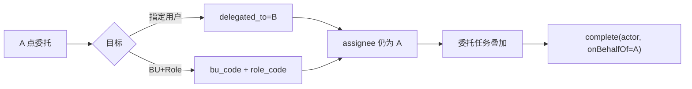
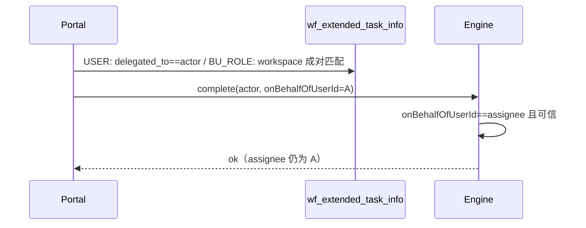

# User Portal：单任务委托（不改 assignee）

> 状态：**方案已定稿（2026-08-26，同日修订）** · 委托 ≠ 转办 · 保留原 `assignee` · 目标：**指定用户** 或 **某个 BU + 某个 Role**
>
> 关联：[portal-task-delegation.md](./portal-task-delegation.md)（站立规则：同一套不改 assignee；目标同样是指定用户或 BU+Role）· [portal-bu-rbac.md](./portal-bu-rbac.md) · [portal-permission-self-service.md](./portal-permission-self-service.md)（UBR「代办申请」≠ 本文）· [owner-field-component.md](./owner-field-component.md)

给后续 agent：实现以本文为准，不要按现网 `setAssignee(B)` 打补丁。改代码前按 playbook 执行。

---

## 0. 用词（已定）

任务这条线只用 **「委托」**。权限自助的「代办」留给 UBR 申请。不要 Acting For / act-as / 代理任务。

| 位置 | 中文 | 英文 |
|------|------|------|
| 按钮 | 委托 | Delegate |
| 动作结果 / 状态 | 已委托 | Delegated |
| To Do 筛选或 Tab | 委托任务 | Delegated |
| Delegations 页 | 委托管理；规则叫委托规则 | Delegations / Delegation rules |
| Delegations 里那类任务 Tab | **委托任务** | Delegated |
| A 看自己的单（指定人） | 委托给 B | Delegated to B |
| A 看自己的单（BU+Role） | 委托给 {BU名} / {Role名} | Delegated to {BU} / {Role} |
| 被委托方看这单 | 代 A 办理 | On behalf of A |
| complete 参数（代码） | — | `onBehalfOfUserId`（办理人 A） |

对照：委托 = 任务仍挂 A，别人顶着办；转办 = Transfer，办理人换成别人。  
**认领** = 共享池里还没落到人时先占单（会改 `assignee`）。本文 BU+Role 委托 **不做认领**。

---

## 1. 背景 / 问题

任务详情底栏「委托」按钮现网是**单任务改派**：写 `delegated_*` 后立刻 `setAssignee(被委托人)`，办理人变成 B，和站立规则不一致，也和转办几乎重复。

已定 **方案 1**：不改 `assignee`。增量：目标不只有指定用户，还可以是 **某一个 BU 下的某一个 Role**（成对 UBR）。

---

## 2. 一句话 / 目标

办理人 A 把**这一条**待办委托出去：`ACT_RU_TASK.ASSIGNEE_` **仍是 A**；状态已委托。目标二选一：

1. **指定用户 B**
2. **指定一个 BU + 一个 Role**（必须成对）

被委托方在 To Do **委托任务** 里看见并代 A 办完；历史记「操作人 代 A」。转办仍改 `assignee`。

成功标准：

1. 委托后 Flowable `ASSIGNEE_` 不改、不变空。
2. 扩展表 `status=DELEGATED`，记下目标（用户 **或** BU code + Role code）。
3. UI 办理人 = A；另显「委托给 B」或「委托给 {BU}/{Role}」。
4. 指定人：B 在委托任务可见可办。BU+Role：须 **当前工作台** 正好是这一对才能看见、直接可办（**不认领**）。
5. A 两种委托后都仍可自办。转办行为不变。

---

## 3. 非目标

- 不改委托管理规则 CRUD 的**时间窗/流程类型语义**（那篇自己扩 BU+Role）。单任务 **不写** `up_delegation_rule` 行。
- **不把委托做成改派**；不做转办；**不加** Flowable candidate、**不** `setAssignee(null)`。
- 不用 Flowable 原生 `delegateTask` / `resolveTask`。
- 不改 UBR「代办申请」、Admin 权限委托、Owner 控件。
- 不做取消/收回、不做被委托人再委托、不做候选池未认领任务委托。
- 不委托给虚拟组、不委托「仅 BU」或「仅 Role」。
- 不把 View 的 SYS_ADMIN 全量可见套到委托任务上（没有该 UBR 就看不见）。
- 不在本期做站立规则的 `ruleMatches` / `process_types` 过滤（可复用 `onBehalfOfUserId`）。
- 不改 `platform-common`、不碰 MI 语义层。
- MVP **不**按 DW Action 显隐按钮。

已定：

- A 委托后**仍可自己办完**。
- 未认领候选池**不显示**「委托」按钮。
- BU+Role 委托 **不用认领**，对该 UBR 的人直接可办。
- **必须切到该 BU+Role 工作台** 才看得见、办得了（成对匹配当前工作台）。

---

## 4. 与转办 / 站立规则

| | 委托（本文） | 转办 | 站立规则 |
|--|-------------|------|----------|
| 粒度 | 一条任务 | 一条任务 | 时间窗内 A 的待办 |
| `assignee` | **不变（A）** | 改成目标用户 | 不变（A） |
| 谁能办 | 指定用户 **或** 当前工作台匹配的 BU+Role | 新 assignee | 规则里的指定用户 **或** 当前工作台匹配的 BU+Role |
| 办理人显示 | A +「委托给 …」 | 新办理人 | A +「代 A 办理」 |

---

## 5. 方案权衡

| 方案 | 做法 | 结论 |
|------|------|------|
| **A** | 不改 `assignee`。USER 写 `delegated_to`；BU_ROLE 写 bu/role **code**。可见性 Portal 叠加；办理 `onBehalfOfUserId=A`。BU+Role **不认领**，**按当前工作台成对匹配**。 | **采用** |
| B | 点按钮插 TEMPORARY 规则 | 拒：没有任务粒度 |
| C | Flowable 原生委托 | 拒：会改 assignee |
| D | 委托给 Role 时改成候选池（认领） | 拒：认领会改 `assignee`，违背方案 1 |
| E | 人只要有这条 UBR、人在别的工作台也看见 | 拒：可见范围过大，和门户工作台模型不一致 |

模块：portal + engine + deploy（init-scripts 增列）。admin 仅复用已有 BU/Role 查询。

---

## 6. 模型

| 真相 | USER | BU_ROLE |
|------|------|---------|
| 办理人 | `ASSIGNEE_` = A | 同左 |
| 目标 | `delegated_to` = 用户 ID | `delegated_to` 空；`delegated_bu_code` + `delegated_role_code` |
| 类型 | `delegated_target_type=USER` | `BU_ROLE` |
| 谁点的委托 | `delegated_by` = A | 同左 |
| 扩展状态 | `DELEGATED` | 同左 |
| `current_assignee` | 仍是 A | 同左 |

列表 `assignmentType=DELEGATED` 仍是 **portal DTO 标记**。

**禁止**把 `TaskInfo.assignee` 投影成被委托人。  
`getCurrentAssignee()` 已委托时仍返回 A（认领人 / `assignment_target`），**不要**返回 `delegatedTo`。

BU、Role **存 code 不存数字 ID**（与 BPMN BU_ROLE 一致，跨环境稳定）。

---

## 7. 主流程

### 7.1 委托

A → 详情「委托」→ 选目标类型：

- **指定用户**：选 B（禁自己）+ 原因。
- **指定 BU 和 Role**：先选 BU，Role 下拉用 `GET /business-units/{id}/roles`（与 View 准入同一数据源，**不用**全局 `/roles`）。两侧都必填。

`POST /tasks/{id}/delegate`。引擎写扩展表；**禁止** `setAssignee`、禁止加 candidate。Portal **禁止**改 `current_assignee`。

### 7.2 看待办

- A：本人 To Do 仍有这单；徽章已委托 + 委托给谁。
- **指定用户**：B 叠加 `delegated_to=B`。
- **BU+Role**：仅当 JWT 当前工作台 `(active BU, active Role)` 的 **code 成对等于** 委托目标时，才进入该用户的 **委托任务**。切到别的工作台即不可见。SYS_ADMIN 不因此看见全部委托任务。
- 该 UBR 目前没人：委托任务列表为空，单仍挂 A，A 可办。
- My Requests：当前处理人仍是 A。

### 7.3 办理

1. Portal：actor≠assignee 时：USER 须 `delegated_to==actor`；BU_ROLE 须当前工作台成对匹配；或站立规则命中。否则 403。
2. **不认领**（认领会改 `assignee`）。
3. complete 带 `onBehalfOfUserId=A`（仅服务间）。
4. 引擎：可信且 `onBehalfOfUserId == ASSIGNEE_` → 放行。
5. 历史「{操作人} 代 A」。

A 自办：走 assignee 匹配，不必带 `onBehalfOfUserId`。

---

## 8. 显示与按钮

| 谁看 | 办理人 | 额外 |
|------|--------|------|
| A（指定人） | A | 已委托 + 委托给 B |
| A（BU+Role） | A | 已委托 + 委托给 {BU} / {Role} |
| 被委托用户 | A | 代 A 办理 |
| 工作台匹配该 UBR 的人 | A | 代 A 办理 |
| My Requests | A | 不把被委托方写成当前处理人 |

弹窗：单选「指定用户」|「指定 BU 和 Role」。按钮：未完成且已有明确办理人时显示。DW `DELEGATE` Action 走同一 API，避免两颗按钮。

---

## 9. 影响面

| 层级 | 变更 |
|------|------|
| API / Component | `delegateTask` 去掉 `setAssignee`；complete 认 `onBehalfOfUserId`；`TaskDelegationRequest` 增加目标类型（不传则视为 USER）；查询/鉴权分 USER 与工作台成对 BU_ROLE |
| Entity / SQL | **增列**（见 §10）。`delegated_to` 仍给 USER。引擎按 `delegated_to` 以及 `(bu_code, role_code)` 查运行中任务 |
| 前端 | 委托弹窗两种目标；详情两种「委托给」；To Do 委托任务 |
| i18n | §0 + 指定用户 / 指定 BU 和角色 / 成对必填 |
| 部署 | 新 init-script；rebuild `workflow-engine` `user-portal` `user-portal-frontend` |
| Help | 详情委托 Guidelines + `?` |
| 禁止 | `platform-common`、MI 语义层、`/transfer` |

---

## 10. 数据与契约

`wf_extended_task_info` 只增不改（init-scripts 幂等）：

| 列 | USER | BU_ROLE |
|----|------|---------|
| `delegated_target_type` | `USER`（存量空 = USER） | `BU_ROLE` |
| `delegated_to` | 用户 ID | null |
| `delegated_bu_code` | null | BU code |
| `delegated_role_code` | null | Role code |
| `delegated_by` | A | A |

索引：保留 `idx_delegated_to`；新增 `(delegated_bu_code, delegated_role_code)` 便于叠加查询。

- `POST /{taskId}/delegate` URL 不变。Body：USER 继续 `delegatedTo`；BU_ROLE 传 `delegatedTargetType=BU_ROLE` + `delegatedBuCode` + `delegatedRoleCode`。禁止只传一侧。
- complete 增可选 `onBehalfOfUserId`（仅服务间）。
- 存量改派任务（`ASSIGNEE_` 已是 B）**不回写**。
- Owner `CURRENT_ASSIGNEE` 仍跟办理人 A。

---

## 11. 实现落点

| 层 | 做什么 |
|----|--------|
| Engine | 去掉 `setAssignee`；`getCurrentAssignee` 委托后仍返回 A；`onBehalfOfUserId`；按 user / bu+role 查运行中任务 |
| Portal | 不改 `current_assignee`；叠加 + `canProcess` 认 user 或当前工作台 UBR；complete 组装 `onBehalfOfUserId` |
| UI | 两种目标弹窗；`TaskInfo` 增加 type / bu / role / 展示名 |
| 测试 | 改 `TaskDelegationPermissionProperties`；补 user / BU_ROLE / 工作台不匹配 / 不认领 断言 |

---

## 12. 风险与回滚

- 漏工作台成对过滤 → 有该 Role、换个 BU 也能看见。必须成对匹配当前工作台。
- 若对 BU+Role 走自动认领 → `assignee` 被改掉。禁止。
- 只停 `setAssignee` 不上 `onBehalfOfUserId` → 看见办不成。同 PR 交付。
- 新列可空，USER 路径不受影响。不必 feature flag。

---

## 13. 验收

| | 场景 | 期望 |
|--|------|------|
| 反 | 委托给自己（USER） | 400 |
| 反 | 只选 BU 或只选 Role | 400 |
| 反 | 未认领候选池 | 无「委托」按钮 |
| 反 | 委托后 `ASSIGNEE_` 变别人或变空 | 失败 |
| 反 | 工作台 BU/Role 对不上 | 看不见、办不了 |
| 反 | 伪造 `onBehalfOfUserId` | 引擎拒 |
| 反 | 无关用户 C | 403 |
| 正 | A→指定用户 B | 办理人 A；委托给 B；B 委托任务可办；不认领 |
| 正 | A→某 BU+Role | 办理人 A；委托给该 BU/Role；切到该工作台可见可办；换工作台不可见；不认领 |
| 正 | 该 UBR 暂无人 | A 仍可办 |
| 正 | A 两种委托后自办 | 允许 |
| 正 | 转办 | 仍改 assignee |

---

## 14. 验证（实现后最低命令）

- `mvn -pl backend/workflow-engine-core,backend/user-portal -am test`
- `cd frontend/user-portal && pnpm run build` + 相关 vitest
- compose rebuild `workflow-engine` `user-portal` `user-portal-frontend`
- Playwright：指定用户一张；BU+Role 对上工作台可见、换工作台不可见；截图 `frontend/user-portal/verification-screenshots/`
- 不跑 `regression:mi`（除非误碰热路径）

---

## 15. 分期

| 阶段 | 内容 |
|------|------|
| **MVP** | 不改派 + `onBehalfOfUserId` + USER 与 BU_ROLE 两种目标 + 工作台成对可见/可办 + 不认领 + 详情文案 + 单测/截图 |
| **后续** | 取消/收回；DW 显隐 |

`onBehalfOfUserId` 与站立规则共用一次落地。

---

## 16. 决策

| | 决定 |
|--|------|
| D1 | 委托 ≠ 转办：不改 `assignee` |
| D2 | 不写规则行；单任务真相在 `delegated_*` |
| D3 | 不用 Flowable 原生委托 |
| D4 | 引擎不读规则表；Portal 校验 + 可信 `onBehalfOfUserId` |
| D5 | A 委托后仍可自办 |
| D6 | 未认领候选池不可委托 |
| D7 | MVP 按钮不跟 DW Action 显隐 |
| D8 | 用词见 §0 |
| D9 | 目标：指定用户 **或** 成对 BU+Role（存 code） |
| D10 | BU+Role **不认领**，直接可办 |
| D11 | 必须 **当前工作台** 成对匹配才看得见/办得了 |
| D12 | SYS_ADMIN 不因此看见全部委托任务 |

---

## 17. 代码索引

`TaskActionService#delegateTask` / `ExtendedTaskInfo` / `TaskCompletionService`（engine）· `TaskProcessComponent#delegateTask` / `DelegatedTaskQueryComponent` / `TaskPermissionEvaluator`（portal）· `TaskActionBar.vue` / `useTaskActions.ts` / Action 弹窗 · schema `wf_extended_task_info` 增列脚本
