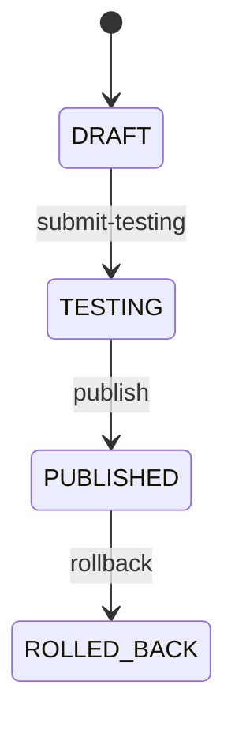
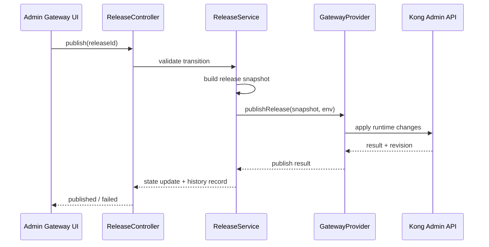

# Gateway Governance Phase 1 API Contract

## 1. Overview

This contract defines the minimum Phase 1 backend API set for Gateway Governance Domain.

- Service context: `admin-center`
- Base path: `/api/v1/admin/gateway`
- Response style: follow current admin-center conventions
- Tenant scope: all resources are tenant-scoped

---

## 2. Common Conventions

## Headers

- `Authorization: Bearer <token>`
- `X-User-Id: <userId>`
- `X-Username: <username>`
- `X-Tenant-Id: <tenantId>` (reserved for tenant context integration)

## Common Fields

- `id`: resource identifier
- `createdAt`, `updatedAt`
- `createdBy`, `updatedBy`
- `status`: lifecycle status per resource

## Error Codes (Phase 1)

- `GATEWAY_API_NOT_FOUND`
- `GATEWAY_APP_NOT_FOUND`
- `GATEWAY_RELEASE_NOT_FOUND`
- `GATEWAY_INVALID_STATE_TRANSITION`
- `GATEWAY_PUBLISH_FAILED`
- `GATEWAY_ADAPTER_ERROR`
- `GATEWAY_PERMISSION_DENIED`

---

## 3. API Management

## 3.1 Create API Definition

- **Method**: `POST`
- **Path**: `/apis`

### Request

```json
{
  "apiCode": "order-query-api",
  "name": "Order Query API",
  "domain": "order",
  "basePath": "/api/orders",
  "protocol": "HTTP"
}
```

### Response

```json
{
  "id": 1001,
  "apiCode": "order-query-api",
  "name": "Order Query API",
  "domain": "order",
  "basePath": "/api/orders",
  "protocol": "HTTP",
  "status": "DRAFT"
}
```

## 3.2 List API Definitions

- **Method**: `GET`
- **Path**: `/apis?page=0&size=20&keyword=order&status=DRAFT`

## 3.3 Get API Definition Detail

- **Method**: `GET`
- **Path**: `/apis/{apiId}`

## 3.4 Update API Definition

- **Method**: `PUT`
- **Path**: `/apis/{apiId}`

## 3.5 Create API Version

- **Method**: `POST`
- **Path**: `/apis/{apiId}/versions`

### Request

```json
{
  "version": "v1",
  "openapiDoc": "{...openapi json...}",
  "upstreamRef": "order-service.default.svc.cluster.local:8080"
}
```

### Response

```json
{
  "id": 2001,
  "apiDefinitionId": 1001,
  "version": "v1",
  "lifecycleStatus": "DRAFT"
}
```

## 3.6 Import OpenAPI

- **Method**: `POST`
- **Path**: `/apis/import-openapi`

### Request

```json
{
  "name": "Order API",
  "apiCode": "order-api",
  "openapiDoc": "{...}",
  "defaultDomain": "order"
}
```

---

## 4. Application Management

## 4.1 Create Application

- **Method**: `POST`
- **Path**: `/applications`

### Request

```json
{
  "appCode": "portal-app",
  "name": "User Portal",
  "owner": "portal-team"
}
```

## 4.2 List Applications

- **Method**: `GET`
- **Path**: `/applications?page=0&size=20&keyword=portal`

## 4.3 Get Application

- **Method**: `GET`
- **Path**: `/applications/{appId}`

## 4.4 Update Application

- **Method**: `PUT`
- **Path**: `/applications/{appId}`

## 4.5 Create Credential

- **Method**: `POST`
- **Path**: `/applications/{appId}/credentials`

### Request

```json
{
  "credentialType": "API_KEY",
  "displayName": "portal-app-dev-key",
  "expiresAt": "2027-01-01T00:00:00Z"
}
```

---

## 5. Policy Management

## 5.1 Upsert Access Policies

- **Method**: `POST`
- **Path**: `/apis/{apiVersionId}/access-policies`

### Request

```json
{
  "policies": [
    {
      "type": "JWT",
      "enabled": true,
      "config": {
        "issuer": "workflow-station",
        "requiredClaims": ["sub", "roles"]
      }
    },
    {
      "type": "IP_WHITELIST",
      "enabled": true,
      "config": {
        "cidrs": ["10.0.0.0/8", "192.168.0.0/16"]
      }
    }
  ]
}
```

## 5.2 Upsert Traffic Policies

- **Method**: `POST`
- **Path**: `/apis/{apiVersionId}/traffic-policies`

### Request

```json
{
  "policies": [
    {
      "type": "RATE_LIMIT",
      "enabled": true,
      "config": {
        "minute": 600,
        "policy": "local"
      }
    },
    {
      "type": "TIMEOUT",
      "enabled": true,
      "config": {
        "connectMs": 1000,
        "readMs": 3000,
        "writeMs": 3000
      }
    }
  ]
}
```

## 5.3 Get Policy Bundle

- **Method**: `GET`
- **Path**: `/apis/{apiVersionId}/policies`

---

## 6. Release Management

## 6.1 Create Release

- **Method**: `POST`
- **Path**: `/releases`

### Request

```json
{
  "environmentCode": "DEV",
  "releaseName": "release-2026-05-27-01",
  "apiVersionIds": [2001, 2002],
  "description": "Initial DEV release"
}
```

### Response

```json
{
  "id": 3001,
  "releaseNo": "DEV-20260527-0001",
  "state": "DRAFT",
  "environmentCode": "DEV"
}
```

## 6.2 Submit Testing

- **Method**: `POST`
- **Path**: `/releases/{releaseId}/submit-testing`

### Transition

- `DRAFT -> TESTING`

## 6.3 Publish Release

- **Method**: `POST`
- **Path**: `/releases/{releaseId}/publish`

### Transition

- `TESTING -> PUBLISHED`

## 6.4 Rollback Release

- **Method**: `POST`
- **Path**: `/releases/{releaseId}/rollback`

### Request

```json
{
  "targetReleaseId": 2999,
  "reason": "Error rate increased after publish"
}
```

### Transition

- `PUBLISHED -> ROLLED_BACK`

## 6.5 Get Release Detail

- **Method**: `GET`
- **Path**: `/releases/{releaseId}`

## 6.6 Get Release History

- **Method**: `GET`
- **Path**: `/releases/{releaseId}/history`

---

## 7. Release State Machine (Phase 1)



Invalid transitions return `GATEWAY_INVALID_STATE_TRANSITION`.

---

## 8. Publish Runtime Flow



---

## 9. Non-Functional Requirements for Phase 1

- Idempotency for publish endpoint by release state checks
- Adapter failures must be mapped to domain-level error code
- All write operations must be auditable
- Cross-tenant reads/writes must be rejected at repository query level

