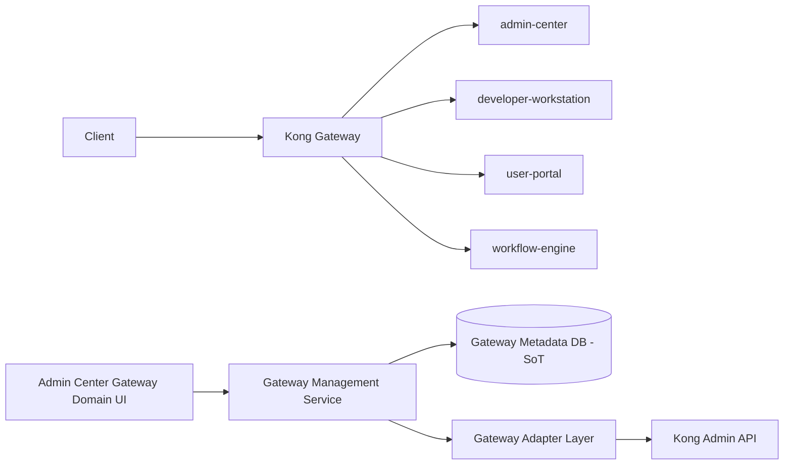
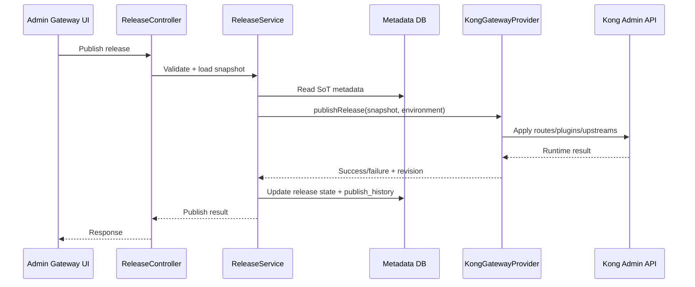

# Gateway Governance Domain - Phase 1 Blueprint

## 1. Goals and Constraints

This design is incremental and compatible with the current system:

- Keep current traffic path unchanged: `Client -> Kong -> Backend Services`
- Build Gateway Governance as an embedded domain in `Admin Center`
- Do not expose Kong native runtime models to business users
- Use platform metadata database as Source of Truth
- Keep future evolution path for micro frontend and multi-gateway support

> **Implementation Status: ✅ Complete — 2026-05-28**
>
> All architectural decisions enforced. See `gateway-governance-phase1-task-breakdown.md` for item-level status.

---

## 2. Current-to-Target Architecture



### Key Principle

- Metadata DB is Source of Truth
- Kong is Runtime State
- Publish pipeline pushes from SoT to runtime through adapter

---

## 3. Frontend Implementation Plan (Admin Center Embedded)

### 3.1 Directory Structure

```text
frontend/admin-center/src/
├── domains/
│   └── gateway/
│       ├── api/           ← implemented as api/gateway.ts (replaces services/)
│       ├── types/         ← implemented as types/gateway.ts (replaces models/)
│       └── pages/
│           ├── apis/      ✅ implemented
│           ├── applications/ ✅ implemented
│           ├── releases/  ✅ implemented
│           └── audit/     ✅ implemented
```

> **Deviation from blueprint**: `services/` → `api/`, `models/` → `types/` to match existing admin-center conventions.
> `access-policies/`, `traffic-policies/`, `environments/` pages deferred to Phase 2.

### 3.2 Routes

- ✅ `/gateway/apis`
- ✅ `/gateway/applications`
- ⬜ `/gateway/access-policies` — deferred (managed within API detail)
- ⬜ `/gateway/traffic-policies` — deferred
- ✅ `/gateway/releases`
- ⬜ `/gateway/environments` — deferred
- ✅ `/gateway/audit`

### 3.3 Menu

Add `Gateway Governance` submenu in `AdminLayout.vue`:

- ✅ API Management
- ✅ Application Management
- ⬜ Access Policies — deferred
- ⬜ Traffic Policies — deferred
- ✅ Release Management
- ⬜ Environment Management — deferred
- ✅ Audit

### 3.4 Permission Keys

- ✅ `gateway:api:read`
- ✅ `gateway:api:write`
- ✅ `gateway:application:read`
- ✅ `gateway:application:write`
- ✅ `gateway:policy:read`
- ✅ `gateway:policy:write`
- ✅ `gateway:release:read` (added beyond blueprint)
- ✅ `gateway:release:execute`
- ✅ `gateway:environment:read` (added beyond blueprint)
- ✅ `gateway:environment:write` (added beyond blueprint)
- ✅ `gateway:audit:read`

> 11 keys implemented (blueprint listed 8). `gateway:release:read`, `gateway:environment:read`, `gateway:environment:write` added for completeness.

---

## 4. Backend Phase 1 Design (Embedded in admin-center)

### 4.1 Package Structure

```text
backend/admin-center/src/main/java/com/admin/
├── controller/gateway/    ✅ 4 controllers
├── service/gateway/       ✅ 4 services
├── repository/gateway/    ✅ 9 repositories
├── entity/gateway/        ✅ 9 entities
├── adapter/gateway/
│   ├── spi/               ✅ GatewayProvider interface
│   ├── kong/              ✅ KongGatewayProvider (NOT_IMPLEMENTED stub)
│   ├── stub/              ✅ StubGatewayProvider (default dev mode)
│   └── dto/               ✅ ReleaseSnapshot, PublishResult, RollbackResult
```

> Minor deviation: `dto/` is under `adapter/gateway/` (not `dto/gateway/` at top level) since DTOs are adapter-layer concepts.

### 4.2 Core Components

- ✅ `GatewayProvider` (SPI abstraction)
- ✅ `StubGatewayProvider` (default mode, `gateway.adapter.mode=stub`)
- ✅ `KongGatewayProvider` (Phase 1 placeholder, returns GATEWAY_ADAPTER_ERROR)
- ✅ `ReleaseService` (orchestration for publish/rollback)
- ✅ `ApiDefinitionService`, `ApplicationService`
- ✅ `GatewayAuditService`

### 4.3 Audit Integration

Integrate new controllers into `AdminAuditAspect` pointcuts:

- ✅ `ApiDefinitionController` → domain `GATEWAY_API`
- ✅ `ApplicationController` → domain `GATEWAY_APP`
- ✅ `ReleaseController` → domain `GATEWAY_RELEASE`
- ✅ `GatewayAuditController` → read-only, covered by release audit

---

## 5. API Contract (Phase 1 Minimal Viable Set)

Base path: `/api/v1/admin/gateway`

### API Management

- ✅ `POST /apis`
- ✅ `GET /apis`
- ✅ `GET /apis/{apiId}`
- ✅ `PUT /apis/{apiId}`
- ✅ `POST /apis/{apiId}/versions`
- ✅ `POST /apis/import-openapi` — stub (returns 202 ACCEPTED)

### Application Management

- ✅ `POST /applications`
- ✅ `GET /applications`
- ✅ `GET /applications/{appId}`
- ✅ `PUT /applications/{appId}`
- ✅ `POST /applications/{appId}/credentials`

### Policy Management

- ⬜ `POST /apis/{apiVersionId}/access-policies` — deferred (DB tables exist)
- ⬜ `POST /apis/{apiVersionId}/traffic-policies` — deferred
- ⬜ `GET /apis/{apiVersionId}/policies` — deferred

### Release Management

- ✅ `POST /releases`
- ✅ `POST /releases/{releaseId}/submit-testing`
- ✅ `POST /releases/{releaseId}/publish`
- ✅ `POST /releases/{releaseId}/rollback`
- ✅ `GET /releases/{releaseId}`
- ✅ `GET /releases/{releaseId}/history`

> Also implemented: `GET /releases` (list), `GET /gateway/audit`, `GET /gateway/audit/releases`

---

## 6. Database Design (Phase 1 Core Tables)

- ✅ `ac_gateway_api_definition`
- ✅ `ac_gateway_api_version`
- ✅ `ac_gateway_application`
- ✅ `ac_gateway_credential`
- ✅ `ac_gateway_access_policy`
- ✅ `ac_gateway_traffic_policy`
- ✅ `ac_gateway_environment`
- ✅ `ac_gateway_release`
- ✅ `ac_gateway_publish_history`
- ✅ `ac_gateway_audit_log`

> 10 tables implemented (blueprint listed 5). All with IF NOT EXISTS, indexes, GIN on JSONB, CHECK constraints, and COMMENT ON.

### Multi-tenant Requirements

- ✅ Every core table includes `tenant_id`
- ✅ Composite unique indexes include tenant dimension
- ✅ Environment dimension included in release tables

---

## 7. Publish Pipeline



> ✅ Pipeline implemented end-to-end. StubGatewayProvider returns deterministic mock revision. KongGatewayProvider scaffolded with TODO markers.

---

## 8. Two-Week Delivery Plan

### Week 1

- ✅ Frontend: menu, routes, page skeleton, domain module scaffolding
- ✅ Backend: API/Application CRUD
- ✅ DB: first 3 tables (`api_definition`, `api_version`, `application`) — plus 7 more

### Week 2

- ✅ Backend: release tables and publish orchestration
- ✅ Adapter: `GatewayProvider` + `StubGatewayProvider` + `KongGatewayProvider` scaffold
- ✅ Frontend: release page and publish history
- ✅ Audit: add gateway controller pointcuts in audit aspect

---

## 9. Evolution Roadmap

| Phase | Focus | Doc |
|---|---|---|
| Phase 1 | Embedded Gateway Domain in Admin Center ← **DONE 2026-05-28** | `gateway-governance-phase1-blueprint.md` |
| Phase 2 | GMS extraction, drift, monitoring, promotion | `gateway-governance-phase2-blueprint.md` |
| Phase 3 | `gateway-mfe` micro frontend | `gateway-governance-phase3-blueprint.md` |
| Phase 4 | Developer API Marketplace | `gateway-governance-phase4-blueprint.md` |
| Phase 5 | Multi-gateway governance platform | `gateway-governance-phase5-blueprint.md` |

---

## 10. Implementation Alignment Notes (2026-05-28)

### ✅ Aligned with Blueprint

- All 5 core principles enforced
- Package structure matches (minor naming: `api/`/`types/` instead of `services/`/`models/`)
- State machine: DRAFT → TESTING → PUBLISHED → ROLLED_BACK
- Adapter SPI: `GatewayProvider.publishRelease()` / `rollbackRelease()`
- Audit: all mutating gateway operations recorded via AdminAuditAspect
- Tenant isolation: `tenant_id` in all tables + repository queries

### ⚠️ Deviations (Intentional)

| Blueprint | Implementation | Reason |
|---|---|---|
| 7 menu items / routes | 4 (apis, applications, releases, audit) | Policies + environments managed within detail pages per implementation plan |
| `services/` and `models/` | `api/` and `types/` | Matches existing admin-center convention |
| Policy management API endpoints | Not implemented | Deferred to Phase 2; DB tables exist |
| Kong adapter fully functional | Scaffold (returns NOT_IMPLEMENTED) | Requires Kong Admin API connectivity |
| Backend `@PreAuthorize` enforcement | Not configured | Phase 2; audit aspect covers all calls |
| GATEWAY_VIEWER/OPERATOR/ADMIN roles | Only SYS_ADMIN seeded | Phase 2 RBAC refinement |
