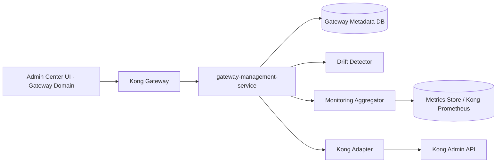
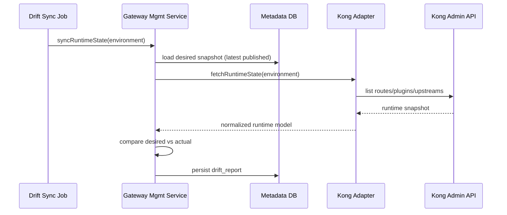
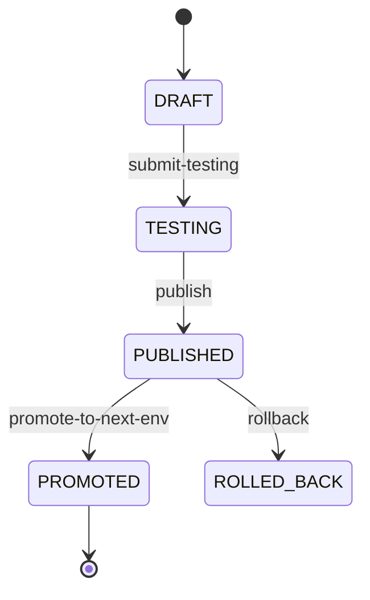

# Gateway Governance Domain - Phase 2 Blueprint

## 1. Prerequisites

Phase 2 starts after Phase 1 exit criteria are met:

- Gateway Domain embedded in Admin Center with publish/rollback loop
- Metadata SoT tables online
- Kong adapter MVP operational
- Audit and RBAC baseline working

Related docs: `gateway-governance-phase1-blueprint.md`

---

## 2. Phase 2 Goals

Phase 2 focus: **modularization + governance hardening**.

- Extract `gateway-management-service` from admin-center (independent deployable)
- Add drift detection (SoT vs Kong runtime)
- Add monitoring read model and dashboard
- Enhance release: environment promotion + prod approval gate
- Complete policy coverage: OAuth2, ACL, Canary, Blue-Green
- Strengthen audit with publish diff and compliance export

**Non-goals (Phase 2):**

- Micro frontend independent deployment (Phase 3)
- Developer API Marketplace (Phase 4)
- APISIX/Envoy runtime switching (Phase 5)

---

## 3. Target Architecture



### Service Extraction Strategy

1. Move `com.admin.gateway.*` packages to `backend/gateway-management-service`
2. Keep API path stable: `/api/v1/admin/gateway/*` via Kong route update
3. admin-center retains shell; gateway calls proxy or route directly to GMS

---

## 4. Drift Detection Design



### Drift Modes

| Mode | Behavior |
|---|---|
| `REPORT_ONLY` | Record drift, alert only (default Phase 2) |
| `ENFORCE` | Auto-reconcile runtime to SoT (opt-in per environment) |

---

## 5. Release Enhancement

### Promotion Flow



- Promotion chain: `DEV -> SIT -> UAT -> PROD`
- PROD publish requires approval (integrate with existing admin approval pattern or workflow-engine stub)

---

## 6. Monitoring Read Model

- Aggregate from Kong/Prometheus or access logs
- Metrics: QPS, P50/P95 latency, 4xx/5xx rate, top APIs, top applications
- Phase 2 scope: read-only dashboard, no alerting platform

---

## 7. Backend Module Structure (Extracted)

```text
backend/gateway-management-service/
├── controller/
├── component/
├── service/
├── repository/
├── entity/
├── adapter/
│   ├── spi/
│   ├── kong/
│   ├── drift/
│   └── metrics/
└── dto/
```

---

## 8. Delivery Plan (4 Weeks)

| Week | Deliverable |
|---|---|
| W1 | Service extraction + Kong route cutover |
| W2 | Drift detection (report-only) |
| W3 | Monitoring dashboard + promotion flow |
| W4 | Policy enhancements + prod approval + stabilization |

---

## 9. Phase 2 Exit Criteria

- GMS independently deployable; admin-center UI unchanged from user perspective
- Drift reports generated per environment on schedule
- Monitoring dashboard shows QPS/latency/error for published APIs
- DEV->PROD promotion path works with prod approval gate
- OAuth2/ACL/Canary policies mappable through adapter
