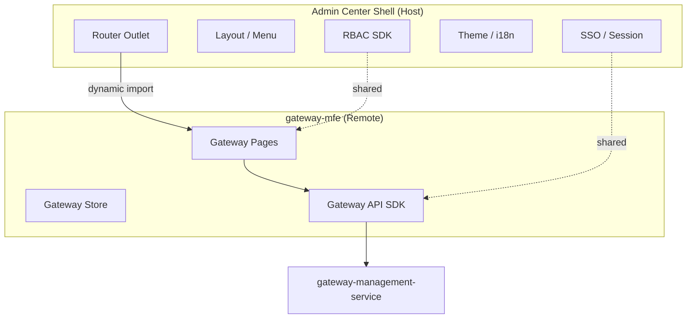

# Gateway Governance Domain - Phase 3 Blueprint

## 1. Prerequisites

Phase 3 starts after Phase 2 exit criteria:

- `gateway-management-service` independently deployed
- Drift detection and monitoring baseline operational
- Gateway domain code isolated under `src/domains/gateway/*`

Related docs: `gateway-governance-phase2-blueprint.md`

---

## Retrofit Note (Post-Phase-3 Alignment)

Phase 3 delivery status is unchanged (completed as planned).  
After completion, its release governance semantics are aligned to `release-control-plane-blueprint.md` through documentation and contract mapping (retrofit), not by redoing Phase 3 implementation.

---

## 2. Phase 3 Goals

Phase 3 focus: **micro frontend extraction**.

- Extract Gateway Domain as `gateway-mfe` (Module Federation or equivalent)
- Admin Center remains host shell (SSO, Layout, RBAC, Theme)
- Independent build and deploy pipeline for gateway-mfe
- Prepare optional splits: `monitoring-mfe`, `auth-mfe` (scaffolding only)

**Non-goals (Phase 3):**

- Developer API Marketplace (Phase 4)
- Multi-gateway provider runtime (Phase 5)

---

## 3. Micro Frontend Architecture



---

## 4. Shared vs Remote Boundaries

| Layer | Host (Admin Center) | Remote (gateway-mfe) |
|---|---|---|
| SSO / Session | Own | Consume via shared SDK |
| Layout / Menu | Own | Remote renders in outlet only |
| RBAC | Own permission SDK | Import shared `@platform/permission` |
| Theme / i18n | Own | Shared design tokens + vue-i18n bridge |
| Gateway pages | — | Own |
| Gateway store | — | Own (isolated Pinia) |
| Gateway API SDK | — | Own |

---

## 5. Directory Structure (Post-Extraction)

```text
frontend/
├── admin-center/              # Host shell
│   └── src/
│       ├── layouts/
│       ├── platform/          # shared SDK for remotes
│       └── router/            # lazy-load gateway-mfe routes
└── gateway-mfe/               # New remote app
    └── src/
        ├── pages/
        ├── store/
        ├── services/
        ├── models/
        └── exposes/           # Module Federation exposes
```

---

## 6. Routing Integration

Host router lazy-loads remote:

```text
/gateway/*  ->  gateway-mfe remote entry
```

Menu remains in host `AdminLayout.vue`; menu items trigger host routes that mount remote components.

---

## 7. Build and Deploy

- `gateway-mfe` produces remote entry (`remoteEntry.js`) + chunks
- Host references remote URL via env: `VITE_GATEWAY_MFE_URL`
- Kong/nginx serves remote assets; version pinning for rollback
- CI: independent pipeline for gateway-mfe

---

## 8. Delivery Plan (3 Weeks)

| Week | Deliverable |
|---|---|
| W1 | Extract domain to `gateway-mfe` package; local dev with host |
| W2 | Module Federation wiring + shared SDK extraction |
| W3 | CI/CD, deploy, rollback validation |

---

## 9. Phase 3 Exit Criteria

- Gateway UI loads from remote entry in Admin Center shell
- SSO/RBAC/Theme work identically to Phase 2 embedded mode
- gateway-mfe deployable independently without host redeploy
- Rollback: host can pin previous remote version
- release-related semantics are mappable to shared Release Control Plane contract
