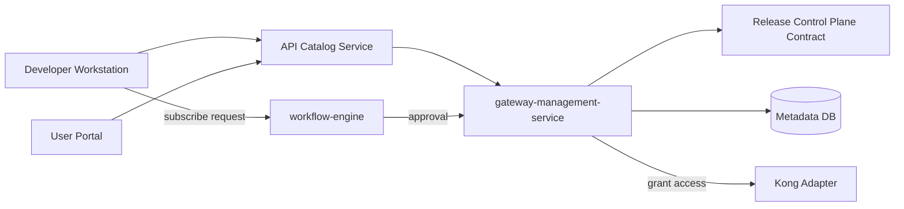

# Gateway Governance Domain - Phase 4 Blueprint

## 1. Prerequisites

Phase 4 starts after Phase 3 exit criteria:

- `gateway-mfe` independently deployable
- GMS stable with full governance loop
- Developer Workstation and User Portal operational

Related docs: `gateway-governance-phase3-blueprint.md`
Shared contract: `release-control-plane-blueprint.md`

---

## 2. Phase 4 Goals

Phase 4 focus: **Developer API Marketplace**.

- Expose published API catalog to Developer Workstation
- Self-service application subscription and credential request
- Approval workflow for API access (integrate workflow-engine)
- API documentation portal (OpenAPI-driven)
- Bridge design-time (Function Unit / API design) to runtime governance

**Non-goals (Phase 4):**

- Multi-gateway provider switching (Phase 5)
- Full API monetization/billing platform

---

## 3. Architecture

Phase 4 capabilities (subscription, approval, provisioning, audit) follow the canonical lifecycle/policy/approval semantics in the shared Release Control Plane contract while keeping Gateway business payloads.

---

## 4. Core Capabilities

### API Catalog

- Browse published APIs by domain, environment, version
- View OpenAPI docs, sample requests, policy requirements
- Filter by tenant and visibility (internal / restricted)

### Application Self-Service

- Developer creates Application from DW
- Request API subscription (select APIs + environment)
- Credential provisioning after approval

### Approval Integration

- Subscription request triggers workflow process
- Approver reviews in User Portal or Admin Center
- On approve: GMS creates access policy + credential

### Design-to-Runtime Bridge

- Function Unit or form design can reference catalog API
- Optional: auto-register draft API from designer (manual publish still required)

---

## 5. New Surfaces

| Surface | Module | Purpose |
|---|---|---|
| API Catalog | Developer Workstation | Browse and subscribe |
| My Subscriptions | Developer Workstation | View apps, credentials, status |
| Subscription Approval | User Portal / Admin | Approve/reject requests |
| Marketplace Admin | Admin Center / gateway-mfe | Catalog visibility, policy templates |

---

## 6. Data Model Extensions

- `ac_gateway_api_subscription` — app ↔ api_version ↔ environment
- `ac_gateway_subscription_request` — pending approval requests
- `ac_gateway_catalog_visibility` — which APIs appear in marketplace

See: `gateway-governance-phase4-ddl.sql`

---

## 7. Delivery Plan (4 Weeks)

| Week | Deliverable |
|---|---|
| W1 | Catalog API + DW catalog UI |
| W2 | Subscription request flow + workflow integration |
| W3 | Approval UI + auto-provision on approve |
| W4 | OpenAPI doc portal + design-time bridge stub |

---

## 8. Phase 4 Exit Criteria

- Developer can browse catalog and submit subscription request
- Approval workflow completes and provisions access in Kong
- OpenAPI documentation viewable for published APIs
- Audit trail covers subscription lifecycle
