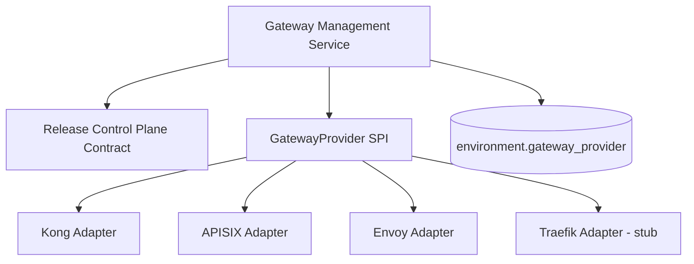
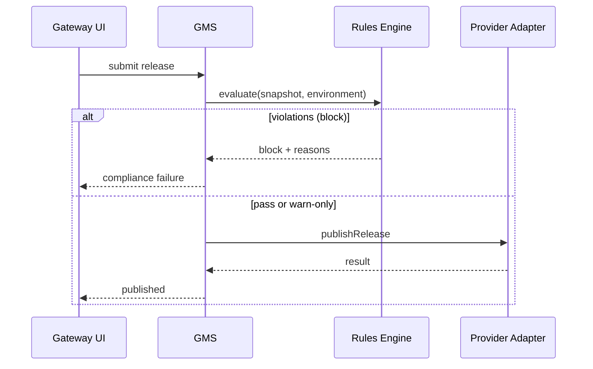

# Gateway Governance Domain - Phase 5 Blueprint

## 1. Prerequisites

Phase 5 starts after Phase 4 exit criteria:

- API Marketplace operational
- GMS adapter SPI stable
- Multi-environment governance mature

Related docs: `gateway-governance-phase4-blueprint.md`
Shared contract: `release-control-plane-blueprint.md`

---

## 2. Phase 5 Goals

Phase 5 focus: **Multi-Gateway API Governance Platform**.

- Support Kong, APISIX, Envoy (and Traefik stub) via unified adapter SPI
- Per-environment provider selection
- Governance rules center (naming, security, versioning policies)
- Automated compliance checks before publish
- Provider-agnostic policy engine

**Non-goals (Phase 5):**

- Replace Kong as default runtime for existing deployments
- Full service mesh control plane

---

## 3. Multi-Provider Architecture

### Provider Selection

- `ac_gateway_environment.gateway_provider` drives adapter resolution
- Same business model (API/Application/Policy/Release) regardless of provider
- Adapter translates to provider-native config internally
- Release lifecycle, policy gate, approval, and audit semantics remain aligned to the shared Release Control Plane contract

---

## 4. Governance Rules Center

| Rule Category | Example |
|---|---|
| Naming | API code must match `^[a-z0-9-]+$` |
| Security | PROD APIs must have JWT or OAuth2 |
| Versioning | Breaking change requires major version bump |
| Traffic | Rate limit required for public APIs |
| Environment | PROD publish requires 2 approvers |

Rules evaluated at release submit; block or warn based on severity.

---

## 5. Compliance Pipeline

---

## 6. Adapter Capability Matrix (Target)

| Capability | Kong | APISIX | Envoy |
|---|---|---|---|
| Route sync | Yes | Yes | Yes (xDS) |
| Rate limit | Yes | Yes | Yes |
| JWT/OAuth2 | Yes | Yes | Yes |
| Canary | Yes | Yes | Partial |
| Blue-Green | Yes | Yes | Partial |
| DB-less mode | Yes | Yes | N/A |

---

## 7. Delivery Plan (6 Weeks)

| Week | Deliverable |
|---|---|
| W1-W2 | APISIX adapter MVP |
| W3 | Envoy adapter MVP (basic route + policy) |
| W4 | Governance rules center + compliance engine |
| W5 | Per-environment provider switching |
| W6 | Cross-provider drift detection + stabilization |

---

## 8. Phase 5 Exit Criteria

- At least two providers (Kong + APISIX) operational in non-prod
- Governance rules block invalid publishes in PROD
- Compliance report exportable for audit
- Provider switch per environment without business model change
