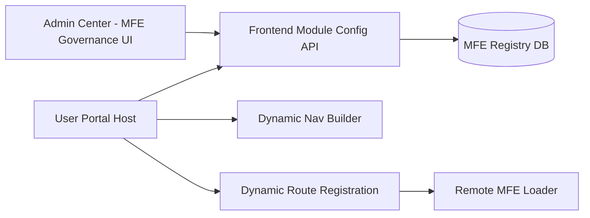

# MFE Governance Implementation Guide

## 1. Objective

Implement a configuration-driven MFE governance model:

- `Admin Center` manages module configuration
- `User Portal` loads module configuration at runtime
- Navigation tags and routes are generated dynamically from config

This allows adding/removing MFE modules without changing host portal code each time.

---

## 2. Target Flow



---

## 3. Data Model (Admin Center)

Recommended table: `ac_frontend_module_registry`

| Field | Type | Description |
|---|---|---|
| `id` | bigint | PK |
| `host_app` | varchar(64) | `user-portal` / `admin-center` / `developer-workstation` |
| `module_code` | varchar(128) | unique module code, e.g. `notification-mfe` |
| `display_name` | varchar(255) | menu display name |
| `route_path` | varchar(255) | host route path, e.g. `/notifications` |
| `icon` | varchar(64) | icon key for host menu |
| `order_no` | int | menu order |
| `remote_entry_url` | varchar(512) | remote entry address |
| `exposed_module` | varchar(128) | exposed module key, e.g. `./App` |
| `enabled` | boolean | enable/disable module |
| `required_permissions` | jsonb | array of permissions |
| `tenant_scope` | jsonb | allowed tenant list |
| `env` | varchar(32) | DEV/SIT/UAT/PROD |
| `version` | varchar(64) | module version |
| `created_by` / `updated_by` | varchar(64) | audit fields |
| `created_at` / `updated_at` | timestamp | audit fields |

### Key constraints

- Unique: `(host_app, env, module_code)`
- Unique route per host/env: `(host_app, env, route_path)`
- Index: `(host_app, env, enabled, order_no)`

---

## 4. Admin Center API Contract

Base path (suggested): `/api/v1/admin/frontend-modules`

### Read APIs (used by host apps)

- `GET /runtime?hostApp=user-portal&env=DEV`
  - Returns only runtime-safe, enabled configs

### Management APIs (used by admin users)

- `GET /?hostApp=user-portal&env=DEV`
- `POST /`
- `PUT /{id}`
- `POST /{id}/enable`
- `POST /{id}/disable`
- `POST /{id}/rollback-version`

### Runtime response example

```json
[
  {
    "moduleCode": "notification-mfe",
    "displayName": "Notifications",
    "routePath": "/notifications",
    "icon": "Bell",
    "orderNo": 40,
    "remoteEntryUrl": "https://cdn.example.com/notification-mfe/1.0.2/remoteEntry.js",
    "exposedModule": "./App",
    "requiredPermissions": ["notification:read"],
    "tenantScope": ["TENANT_A", "TENANT_B"],
    "version": "1.0.2"
  }
]
```

---

## 5. User Portal Host Integration

## 5.1 Runtime steps

1. Host startup loads module config from runtime API
2. Apply local filters:
   - `enabled`
   - `tenantScope`
   - `requiredPermissions`
3. Build dynamic menu items from filtered list
4. Register routes via `router.addRoute(...)`
5. Render remote module through a shared `RemoteLoader`

## 5.2 Host responsibilities (do not move to MFE)

- SSO/session
- global layout and navigation shell
- permission context
- tenant context
- theme and i18n bridge
- global error boundary

---

## 6. Dynamic Route Registration Pattern

Pseudo pattern:

```ts
for (const mod of runtimeModules) {
  router.addRoute('PortalRoot', {
    path: mod.routePath,
    name: `MFE_${mod.moduleCode}`,
    component: RemoteLoader,
    meta: {
      moduleCode: mod.moduleCode,
      remoteEntryUrl: mod.remoteEntryUrl,
      exposedModule: mod.exposedModule,
      requiredPermissions: mod.requiredPermissions
    }
  })
}
```

---

## 7. Dynamic Navigation Pattern

- Keep existing static menu items (core paths)
- Append dynamic items from runtime config
- Sort by `orderNo`
- Hide items when permission check fails

---

## 8. Security and Governance

## 8.1 Mandatory checks

- UI visibility check based on permissions
- backend authorization for module config management
- tenant isolation in runtime config query
- audit log for all module config changes

## 8.2 Sensitive operations

- changing `remote_entry_url`
- changing `route_path`
- enabling/disabling modules in PROD
- switching version in PROD

These operations should require stricter approval/audit policy.

---

## 9. Reliability and Rollback

## 9.1 Runtime fallback

- If remote load fails, show module-level fallback view
- Do not break the host shell
- Keep menu visible but show degraded status message

## 9.2 Rollback strategy

- Version pin in config (`version`, `remote_entry_url`)
- one-click rollback by switching to previous version
- keep at least one previous stable version per module/env

---

## 10. Recommended Delivery Plan

## Phase A - Foundation (1 sprint)

- MFE registry table + Admin CRUD API
- runtime read API
- host config fetch and in-memory store

## Phase B - Dynamic shell (1 sprint)

- dynamic nav rendering
- dynamic route registration
- RemoteLoader and error boundary

## Phase C - Governance hardening (1 sprint)

- audit and permission matrix
- version rollback controls
- tenant/env visibility controls

---

## 11. Definition of Done

- Admin Center can configure a module for `user-portal`
- User Portal shows new nav tag without host code changes
- route is dynamically registered and remote module loads
- permission and tenant filters are enforced
- config change and runtime failures are auditable

---

## 12. Release Control Plane Alignment

MFE governance aligns to the shared contract in `release-control-plane-blueprint.md` while preserving MFE-specific runtime payload fields.

### Mapping Rules

- module lifecycle operations (`switch-version`, `rollback-version`, enable/disable with release impact) map to canonical release lifecycle semantics
- health/version/audit operations map to shared ops and audit event taxonomy
- MFE-specific fields (`hostApp`, `moduleCode`, `remoteEntryUrl`, `routePath`, `exposedModule`) remain domain payload extensions

### Compatibility Policy

- existing MFE endpoints remain backward compatible
- control-plane alignment is additive and semantic; no mandatory endpoint replacement in this phase

