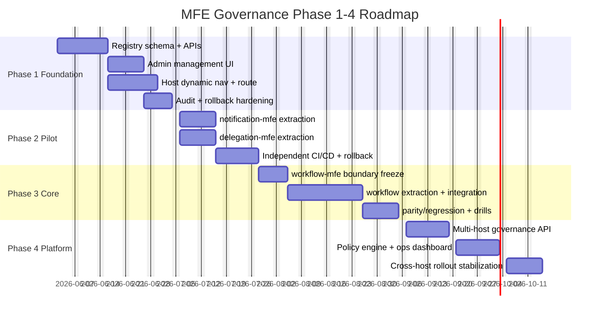
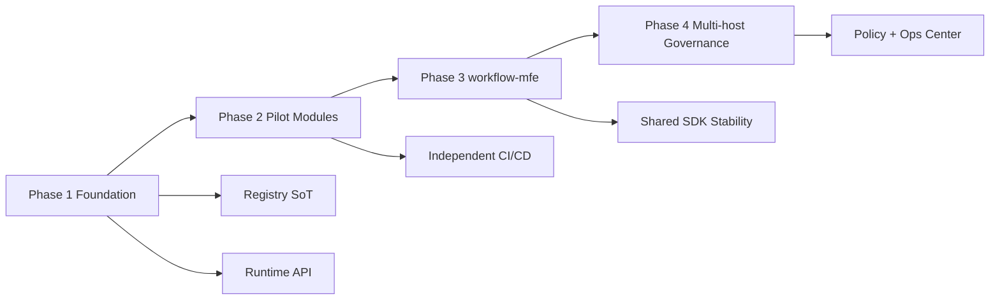

# MFE Governance Phase 1-4 Roadmap

## 1. Purpose

This roadmap provides a single execution view across MFE Governance Phase 1 to Phase 4:

- timeline
- dependencies
- gate criteria
- risk checkpoints

Related index: `mfe-governance-README.md`
Related shared contract: `release-control-plane-blueprint.md`

---

## 2. Phase Summary

| Phase | Focus | Outcome |
|---|---|---|
| Phase 1 | Config-driven foundation | Admin manages module config; host renders dynamic nav/routes |
| Phase 2 | Pilot rollout | 1-2 low-risk MFEs independently deployable |
| Phase 3 | Core workflow extraction | `workflow-mfe` split with parity and rollback readiness |
| Phase 4 | Platform governance | Multi-host governance on top of the shared Release Control Plane contract |

---

## 3. Timeline (Suggested)

---

## 4. Dependency Graph

---

## 5. Gate Criteria (Must Pass)

## Phase 1 Gate

- Admin Center can CRUD module config by host/env
- User Portal can display a new nav tag from runtime config only
- dynamic route registration works
- remote loader fallback does not break host shell
- config changes are auditable

## Phase 2 Gate

- at least 2 MFEs (`notification`, `delegation`) independently deployable
- version switch without host redeploy
- rollback drill passes in non-prod
- runtime failure metrics visible

## Phase 3 Gate

- `workflow-mfe` serves To Do / My Request / New Request routes
- no major regression against baseline behavior
- critical version switch protected by permission
- rollback for workflow-mfe validated

## Phase 4 Gate

- governance APIs support `admin-center` / `user-portal` / `developer-workstation`
- policy-based rollout control active
- centralized ops and audit dashboard available
- cross-host release and rollback playbooks verified
- phase outputs are mapped to canonical lifecycle/events in `release-control-plane-blueprint.md`

---

## 6. Risks and Mitigations

| Risk | Typical Phase | Mitigation |
|---|---|---|
| route conflict across modules | P1/P2 | unique route constraint + pre-publish validation |
| remote load failure impacts UX | P1+ | RemoteLoader fallback + timeout + host boundary |
| version drift across envs | P2/P3 | explicit env/version pin + release checklist |
| workflow split regression | P3 | parity test matrix + staged rollout + rollback gate |
| policy complexity explosion | P4 | start with minimal policy set and progressive enforcement |

---

## 7. Operating Model

## Cadence

- weekly architecture sync
- per-phase kickoff and exit review
- release readiness review before each PROD rollout

## Owners

- Platform Architect: boundary and gate decisions
- Frontend Lead: host/remote implementation quality
- Backend Lead: registry/runtime API and audit
- DevOps Lead: pipeline, versioning, rollback automation
- QA Lead: cross-host regression and resilience validation

---

## 8. Recommended First Execution Order

1. Complete Phase 1 gate with `user-portal`
2. Start Phase 2 with `notification-mfe`
3. Add `delegation-mfe` and lock independent release process
4. Enter Phase 3 only after pilot stability is proven
5. Start Phase 4 after workflow-mfe production stabilization

