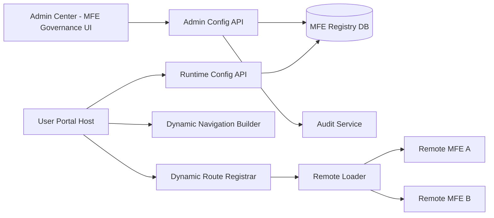

# MFE Governance Phase 1 Blueprint

## 1. Context and Goal

Current state:

- `user-portal` navigation and routes are statically coded
- adding a new MFE requires host code changes and redeploy
- no unified control plane for frontend module lifecycle

Phase 1 goal:

- introduce a configuration-driven MFE governance baseline
- manage MFE metadata in `Admin Center`
- let host app (`user-portal`) render nav and routes dynamically from config
- keep existing SSO, RBAC, tenant, and layout architecture unchanged

---

## 2. Scope

## In Scope

- MFE registry metadata model
- Admin Center module config management API
- runtime config query API for host apps
- dynamic nav and dynamic route registration in host
- remote loader fallback and basic rollback controls
- audit logging for config changes

## Out of Scope

- full MFE marketplace and billing
- cross-host orchestration for all apps
- advanced canary rollout by percentage
- multi-CDN artifact orchestration

---

## 3. Architecture Blueprint

---

## 4. Design Principles

1. Host keeps platform capabilities:
   - auth/session
   - layout/nav shell
   - permission and tenant context
   - theme and i18n
2. MFE registry is Source of Truth for module exposure.
3. Runtime APIs return only host-safe configuration.
4. Frontend visibility is not security boundary:
   backend authorization remains mandatory.
5. Module failure must degrade gracefully without crashing host.

---

## 5. MFE Registry Model

Recommended table: `ac_frontend_module_registry`

Core fields:

- `host_app`
- `module_code`
- `display_name`
- `route_path`
- `remote_entry_url`
- `exposed_module`
- `enabled`
- `required_permissions`
- `tenant_scope`
- `env`
- `version`
- audit fields (`created_by`, `updated_by`, timestamps)

Suggested constraints:

- unique `(host_app, env, module_code)`
- unique `(host_app, env, route_path)`
- index `(host_app, env, enabled, order_no)`

---

## 6. API Blueprint

Base path: `/api/v1/admin/frontend-modules`

## Management APIs (Admin Center)

- `GET /?hostApp=user-portal&env=DEV`
- `POST /`
- `PUT /{id}`
- `POST /{id}/enable`
- `POST /{id}/disable`
- `POST /{id}/rollback-version`

## Runtime API (Host Consumption)

- `GET /runtime?hostApp=user-portal&env=DEV`

Runtime response should include only active, non-sensitive fields required for rendering and loading.

---

## 7. Host Runtime Integration

## Startup sequence

1. host fetches runtime module config
2. host filters by:
   - `enabled`
   - current tenant in `tenant_scope`
   - user permissions
3. host builds dynamic menu items
4. host registers routes using `router.addRoute`
5. host resolves remote modules via shared `RemoteLoader`

## Dynamic route contract

Each module contributes:

- route path
- route name
- loader metadata (`remote_entry_url`, `exposed_module`)
- permission metadata

---

## 8. Security and Audit

Mandatory controls:

- Admin APIs protected by RBAC
- runtime config query tenant-aware
- module config changes recorded with before/after payload
- sensitive operations require stricter policy:
  - changing route path
  - changing remote entry URL in PROD
  - disabling critical module in PROD

---

## 9. Reliability and Rollback

## Runtime resilience

- remote load timeout
- fallback component for failed module
- host shell remains available on remote failure

## Rollback model

- keep versioned module records per env
- switch active version through config toggle
- one-click rollback via Admin Center operation

---

## 10. Delivery Plan (Phase 1)

## Sprint 1 - Foundation

- registry schema
- management API + runtime API
- Admin Center CRUD page

## Sprint 2 - Host Dynamic Integration

- runtime config store in `user-portal`
- dynamic nav + route registration
- RemoteLoader with fallback

## Sprint 3 - Governance Hardening

- audit + permission matrix
- PROD guardrails and rollback operation
- smoke tests and release checklist

---

## 11. Exit Criteria

- Admin Center can create/update module registry entries
- User Portal can show a new nav tag from runtime config without host code changes
- dynamic route works and remote module is loadable
- permission and tenant filters are enforced
- all config changes are auditable
- module rollback can be performed via config switch

