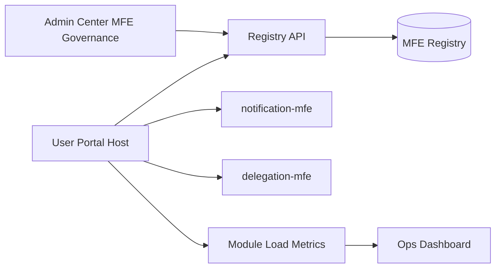

# MFE Governance Phase 2 Blueprint

## 1. Goal

Phase 2 focuses on pilot rollout for low-risk modules and independent release validation.

- Extract and onboard 1-2 low-coupling MFEs first
- Prove independent build/deploy/rollback works
- Keep host shell stable and unchanged for users

---

## 2. Scope

## In Scope
- pilot modules: `notification-mfe`, `delegation-mfe`
- remote artifact pipeline and version pin
- runtime fallback and host resilience
- module-level monitoring and audit

## Out of Scope
- `workflow-mfe` extraction
- multi-host unified governance

---

## 3. Architecture

---

## 4. Delivery Plan (2-3 Sprints)

1. Build independent pipelines for `notification-mfe` and `delegation-mfe`
2. Register modules via Admin Center config
3. Enable in DEV -> SIT with rollback drills
4. Harden with fallback + audit + load metrics

---

## 5. Exit Criteria

- At least 2 MFEs independently deployable
- Host can switch module version by config only
- Failed module does not break host shell
- Rollback tested successfully in non-prod

