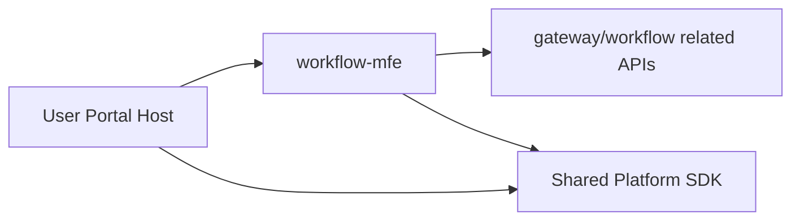

# MFE Governance Phase 3 Blueprint

## 1. Goal

Extract core workflow domain into `workflow-mfe`:

- To Do
- My Request
- New Request

Keep all three in one MFE to preserve shared logic and reduce cross-MFE complexity.

---

## 2. Scope

## In Scope
- route migration: `/tasks*`, `/processes*`, `/my-applications*`
- shared SDK stabilization (auth/permission/theme/i18n bridge)
- host-remote runtime parity validation

## Out of Scope
- splitting workflow domain into smaller MFEs
- multi-host federation

---

## 3. Architecture

---

## 4. Delivery Plan

1. carve workflow domain boundaries
2. extract code and standalone build
3. integrate with host dynamic registry
4. run parity and regression tests

---

## 5. Exit Criteria

- workflow-mfe independently deployable
- no functional regression in tasks/processes/applications flows
- host shell metrics stable after extraction

