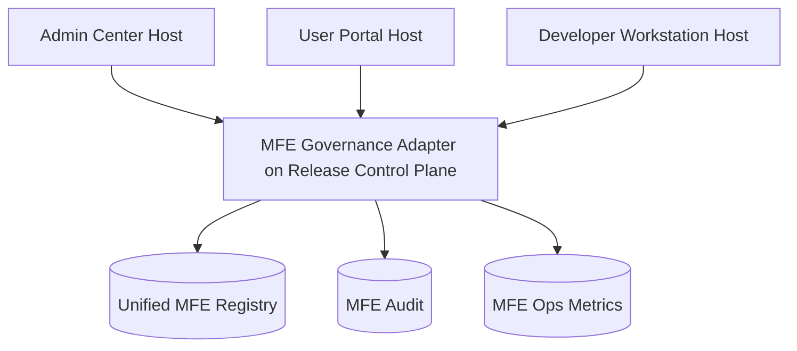

# MFE Governance Phase 4 Blueprint

## 1. Goal

Platformize MFE governance across multiple hosts:

- `admin-center`
- `user-portal`
- `developer-workstation`

Provide unified policy, observability, and release governance.

This phase adopts the shared contract in `release-control-plane-blueprint.md` as the canonical baseline for lifecycle states, policy outcomes, approval semantics, and audit event naming.

---

## 2. Scope

## In Scope
- multi-host module registry
- environment/tenant scoped release policy
- centralized MFE audit and operational dashboard
- policy-based rollout guardrails

## Out of Scope
- external third-party plugin marketplace

---

## 3. Architecture

`GOV` is an MFE-domain adapter over the shared Release Control Plane contract, not an isolated semantics model.

---

## 4. Exit Criteria

- unified governance API serves all hosts
- module release policy supports tenant/env constraints
- operational dashboard tracks load errors, switch events, rollback stats

