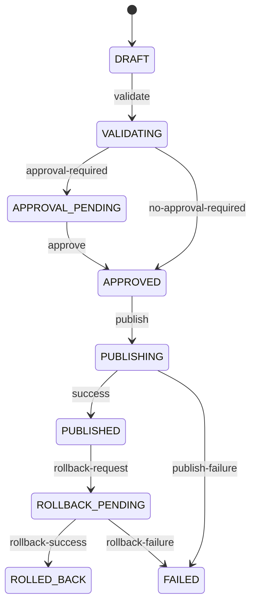

# Release Control Plane Blueprint

## 1. Purpose

This blueprint defines a shared release governance contract across multiple domains:

- MFE governance (`frontend modules`)
- Gateway governance (`APIs / Applications / Policies / Releases`)

The goal is to align release semantics, policy gates, approval flow, drift checks, and audit model without forcing immediate service-level consolidation.

---

## 2. Scope and Boundaries

## In Scope

- canonical release lifecycle states
- policy decision model (`PASS` / `WARN` / `BLOCK`)
- approval ticket model and transitions
- release execution record and runtime revision tracking
- drift detection model (`desired` vs `actual`)
- shared audit event taxonomy

## Out of Scope

- replacing current domain services immediately
- replacing runtime gateways or host runtime behavior
- forcing single physical database schema in this phase

---

## 3. Core Principles

1. **Contract first, implementation second**: unify semantics first; keep domain implementations independent.
2. **Backward compatibility**: existing MFE/Gateway APIs remain valid; mapping layer aligns them to canonical model.
3. **Metadata SoT, runtime projection**: desired state is governed by metadata and projected to runtime via adapters.
4. **Domain payload isolation**: shared model handles common fields; domain-specific fields stay in extension payloads.
5. **Auditable sensitive operations**: publish, rollback, policy override, approval decisions must be traceable.

---

## 4. Canonical Domain Model

## Shared Objects

- `ReleaseUnit`: logical unit to be released (module, API bundle)
- `ReleasePlan`: release intent for tenant/env with target version
- `ReleaseExecution`: one publish/rollback execution result
- `ApprovalTicket`: approval request and decision trail
- `PolicyDecision`: gate result with violations/warnings
- `DriftReport`: desired vs actual mismatch report
- `AuditEvent`: immutable operation event

## Domain Extensions (Examples)

- MFE: `hostApp`, `moduleCode`, `remoteEntryUrl`, `exposedModule`, `routePath`
- Gateway: `provider`, `apiVersionIds`, `runtimeRevision`, `policyBundle`

---

## 5. Canonical Lifecycle

Promotion (such as `DEV -> SIT -> UAT -> PROD`) is modeled as an action from a `PUBLISHED` release to a new target-environment `ReleasePlan`.

---

## 6. Canonical Events

Suggested event names:

- `release.created`
- `release.validated`
- `release.approval.requested`
- `release.approval.decided`
- `release.publish.started`
- `release.publish.succeeded`
- `release.publish.failed`
- `release.rollback.started`
- `release.rollback.succeeded`
- `release.rollback.failed`
- `policy.evaluated`
- `drift.detected`

---

## 7. Error Code Layering

- control-plane generic: `CP_INVALID_STATE`, `CP_APPROVAL_REQUIRED`, `CP_POLICY_BLOCKED`, `CP_PUBLISH_FAILED`
- MFE domain-specific: existing `MFE_*`
- Gateway domain-specific: existing `GATEWAY_*`

Domain code sets remain intact; cross-domain tooling can depend on generic `CP_*` categories.

---

## 8. Retrofit Strategy

1. Introduce this canonical contract and mappings in docs.
2. Keep existing APIs and state names operational.
3. Add mapping notes in MFE/Gateway phase docs.
4. Apply contract-first alignment to new Phase 4+ features.
5. Re-evaluate physical control plane consolidation after Phase 4+ stabilization.

---

## 9. Document Mapping

- MFE:
  - `mfe-governance-phase4-blueprint.md`
  - `mfe-governance-phase4-api-contract.md`
  - `mfe-governance-phase1-4-roadmap.md`
- Gateway:
  - `gateway-governance-phase3-blueprint.md` (retrofit note)
  - `gateway-governance-phase4-blueprint.md`
  - `gateway-governance-phase5-blueprint.md`

