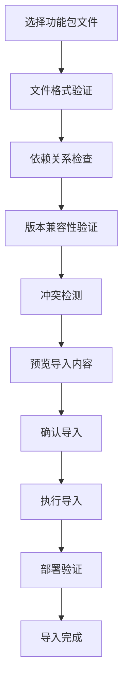

# 管理员中心需求

## 1. 概述

管理员中心是低代码工作流平台的核心管理模块，负责系统配置、权限管理、功能单元部署和系统监控等关键功能。它为系统管理员提供了统一的管理界面，确保平台的安全、稳定和高效运行。

### 1.1 核心职责
- **权限管理**：用户、角色、组织架构的统一管理
- **功能单元管理**：从开发工作站导入和部署功能单元
- **数据字典管理**：关联数据表和字典配置
- **系统监控**：平台运行状态和性能监控
- **安全审计**：操作日志和安全事件管理
- **系统配置**：平台参数和策略配置

### 1.2 用户角色
- **超级管理员**：拥有所有权限，负责系统整体管理
- **安全管理员**：负责安全策略和权限管理
- **业务管理员**：负责业务相关的配置和管理
- **运维管理员**：负责系统监控和维护

## 2. 权限管理系统

### 2.1 用户管理
#### 2.1.1 用户基本信息管理
- **个人信息**：
  - 用户名（唯一标识，不可修改）
  - 姓名（中文姓名，支持多语言）
  - 工号（员工编号，可选）
  - 邮箱（用于通知和找回密码）
  - 手机号（用于短信验证）
  - 部门归属
  - 职位信息
  - 入职日期

- **账户状态管理**：
  - 启用/禁用账户
  - 锁定/解锁账户
  - 密码重置
  - 强制下线
  - 账户过期设置

#### 2.1.2 用户生命周期管理
```yaml
user_lifecycle:
  creation:
    - 批量导入（Excel/CSV）
    - 单个创建
    - 自助注册（可配置开关）
    - AD/LDAP同步
  
  activation:
    - 邮箱验证激活
    - 管理员手动激活
    - 首次登录激活
  
  maintenance:
    - 定期信息更新
    - 权限调整
    - 部门调动
  
  deactivation:
    - 离职处理
    - 账户归档
    - 数据保留策略
```

#### 2.1.3 批量操作功能
- **批量导入**：
  - Excel模板下载
  - 数据验证和错误提示
  - 导入进度显示
  - 导入结果报告

- **批量操作**：
  - 批量启用/禁用
  - 批量角色分配
  - 批量部门调整
  - 批量密码重置

### 2.2 组织架构管理
#### 2.2.1 部门结构管理
- **树形结构**：
  - 支持多级部门嵌套
  - 拖拽调整部门层级
  - 部门合并和拆分
  - 部门重命名和编码

- **部门属性**：
  - 部门名称和编码
  - 部门负责人
  - 联系方式
  - 部门描述
  - 成本中心
  - 地理位置

#### 2.2.2 组织架构可视化
- **组织架构图**：
  - 树形展示
  - 人员统计
  - 层级导航
  - 搜索定位

- **统计分析**：
  - 部门人员分布
  - 层级深度分析
  - 管理幅度统计

### 2.3 角色管理
#### 2.3.1 角色定义和分类
- **系统角色**：
  - 超级管理员
  - 安全管理员
  - 业务管理员
  - 普通用户

- **业务角色**：
  - 流程发起人
  - 审批人
  - 抄送人
  - 监控人

- **功能角色**：
  - 功能单元管理员
  - 数据管理员
  - 报表管理员

#### 2.3.2 权限矩阵管理
```sql
-- 权限资源定义
CREATE TABLE permission_resources (
    id UUID PRIMARY KEY,
    resource_type VARCHAR(50) NOT NULL,  -- MODULE, FUNCTION, DATA, API
    resource_code VARCHAR(100) NOT NULL, -- 资源编码
    resource_name VARCHAR(200) NOT NULL, -- 资源名称
    parent_id UUID,                      -- 父资源ID
    description TEXT,
    created_at TIMESTAMP DEFAULT CURRENT_TIMESTAMP
);

-- 权限操作定义
CREATE TABLE permission_actions (
    id UUID PRIMARY KEY,
    action_code VARCHAR(50) NOT NULL,    -- CREATE, READ, UPDATE, DELETE, EXECUTE
    action_name VARCHAR(100) NOT NULL,
    description TEXT
);

-- 角色权限关联
CREATE TABLE role_permissions (
    id UUID PRIMARY KEY,
    role_id UUID NOT NULL,
    resource_id UUID NOT NULL,
    action_id UUID NOT NULL,
    granted BOOLEAN DEFAULT true,
    conditions JSONB,                    -- 权限条件
    created_at TIMESTAMP DEFAULT CURRENT_TIMESTAMP,
    
    UNIQUE(role_id, resource_id, action_id)
);
```

#### 2.3.3 动态权限配置
- **条件权限**：
  - 基于时间的权限
  - 基于地理位置的权限
  - 基于数据范围的权限
  - 基于业务规则的权限

- **权限继承**：
  - 角色继承关系
  - 权限传递规则
  - 冲突解决策略

### 2.4 虚拟组管理
#### 2.4.1 虚拟组类型
- **项目组**：
  - 临时项目团队
  - 项目周期管理
  - 成员动态调整
  - 项目结束自动解散

- **工作组**：
  - 跨部门协作组
  - 专题工作小组
  - 常设委员会
  - 兴趣小组

#### 2.4.2 虚拟组管理功能
- **组创建和配置**：
  - 组名称和描述
  - 组类型选择
  - 有效期设置
  - 权限范围定义

- **成员管理**：
  - 成员添加和移除
  - 角色分配（组长、成员）
  - 权限委托
  - 成员活跃度统计

## 3. 功能单元管理

### 3.1 功能包导入
#### 3.1.1 导入流程


#### 3.1.2 导入验证规则
- **文件格式验证**：
  - 文件完整性检查
  - 数字签名验证
  - 文件大小限制
  - 病毒扫描

- **内容验证**：
  - BPMN流程语法检查
  - 数据表结构验证
  - 表单配置验证
  - 权限配置检查

#### 3.1.3 冲突处理策略
- **名称冲突**：
  - 自动重命名
  - 手动重命名
  - 覆盖现有
  - 取消导入

- **版本冲突**：
  - 版本升级
  - 并行部署
  - 回滚处理

### 3.2 功能单元部署管理
#### 3.2.1 部署策略
- **全量部署**：
  - 一次性部署所有组件
  - 适用于新功能上线
  - 需要停机维护

- **增量部署**：
  - 仅部署变更部分
  - 最小化影响范围
  - 支持热更新

- **灰度部署**：
  - 分批次部署
  - 用户分组测试
  - 逐步扩大范围

#### 3.2.2 部署环境管理
```yaml
deployment_environments:
  development:
    description: "开发环境"
    auto_deploy: true
    approval_required: false
    
  testing:
    description: "测试环境"
    auto_deploy: false
    approval_required: true
    approvers: ["test_manager"]
    
  staging:
    description: "预生产环境"
    auto_deploy: false
    approval_required: true
    approvers: ["business_manager", "tech_manager"]
    
  production:
    description: "生产环境"
    auto_deploy: false
    approval_required: true
    approvers: ["business_manager", "tech_manager", "security_manager"]
    change_window: "02:00-06:00"
```

### 3.3 版本管理
#### 3.3.1 版本控制策略
- **语义化版本**：
  - 主版本号：不兼容的API修改
  - 次版本号：向下兼容的功能性新增
  - 修订号：向下兼容的问题修正

- **版本生命周期**：
  - 开发版本（Development）
  - 测试版本（Testing）
  - 发布候选版本（Release Candidate）
  - 正式版本（Release）
  - 维护版本（Maintenance）
  - 废弃版本（Deprecated）

#### 3.3.2 版本升级管理
- **升级计划**：
  - 升级时间窗口
  - 影响范围评估
  - 回滚计划
  - 通知机制

- **兼容性管理**：
  - 向前兼容性检查
  - 向后兼容性保证
  - 迁移脚本生成
  - 数据迁移验证

## 4. 关联数据表管理

### 4.1 数据字典管理
#### 4.1.1 字典分类体系
- **系统字典**：
  - 用户状态
  - 流程状态
  - 优先级
  - 审批结果

- **业务字典**：
  - 客户类型
  - 产品分类
  - 地区代码
  - 币种代码

#### 4.1.2 字典维护功能
- **字典项管理**：
  - 代码和名称
  - 排序权重
  - 启用状态
  - 有效期设置
  - 父子关系

- **多语言支持**：
  - 中英文对照
  - 本地化翻译
  - 语言切换
  - 默认语言设置

### 4.2 关联表配置
#### 4.2.1 数据源配置
```yaml
data_source_config:
  database_connections:
    - name: "客户信息库"
      type: "postgresql"
      host: "customer-db.hsbc.com"
      port: 5432
      database: "customer_db"
      username: "${CUSTOMER_DB_USER}"
      password: "${CUSTOMER_DB_PASS}"
      
    - name: "产品信息库"
      type: "mysql"
      host: "product-db.hsbc.com"
      port: 3306
      database: "product_db"
      
  api_connections:
    - name: "外部客户API"
      base_url: "https://api.customer.hsbc.com"
      auth_type: "oauth2"
      timeout: 30000
```

#### 4.2.2 字段映射配置
- **显示字段配置**：
  - 主显示字段
  - 辅助显示字段
  - 字段格式化
  - 字段排序

- **值字段配置**：
  - 主键字段
  - 外键字段
  - 关联字段
  - 计算字段

### 4.3 数据过滤和权限
#### 4.3.1 数据过滤规则
```sql
-- 数据过滤配置表
CREATE TABLE data_filter_rules (
    id UUID PRIMARY KEY,
    table_name VARCHAR(100) NOT NULL,
    rule_name VARCHAR(100) NOT NULL,
    filter_condition TEXT NOT NULL,      -- SQL WHERE条件
    user_roles TEXT[],                   -- 适用角色
    user_departments TEXT[],             -- 适用部门
    effective_date DATE,                 -- 生效日期
    expiry_date DATE,                    -- 失效日期
    created_at TIMESTAMP DEFAULT CURRENT_TIMESTAMP
);

-- 示例过滤规则
INSERT INTO data_filter_rules VALUES (
    gen_random_uuid(),
    'customers',
    '销售人员只能看到自己的客户',
    'sales_person_id = ${current_user_id}',
    ARRAY['SALES_PERSON'],
    NULL,
    '2024-01-01',
    NULL,
    CURRENT_TIMESTAMP
);
```

#### 4.3.2 动态权限控制
- **基于角色的过滤**：
  - 角色权限映射
  - 动态SQL生成
  - 权限缓存机制

- **基于部门的过滤**：
  - 部门层级权限
  - 跨部门数据共享
  - 数据隔离策略

## 5. 系统监控和管理

### 5.1 系统监控Dashboard
#### 5.1.1 实时监控指标
- **系统性能指标**：
  - CPU使用率
  - 内存使用率
  - 磁盘I/O
  - 网络流量
  - 数据库连接数

- **业务指标**：
  - 在线用户数
  - 活跃流程数
  - 任务处理量
  - 错误率统计

#### 5.1.2 告警管理
```yaml
alert_rules:
  system_alerts:
    - name: "CPU使用率过高"
      condition: "cpu_usage > 80%"
      duration: "5m"
      severity: "warning"
      
    - name: "内存使用率过高"
      condition: "memory_usage > 90%"
      duration: "2m"
      severity: "critical"
      
  business_alerts:
    - name: "流程执行失败率过高"
      condition: "error_rate > 5%"
      duration: "10m"
      severity: "warning"
      
    - name: "任务积压过多"
      condition: "pending_tasks > 1000"
      duration: "15m"
      severity: "warning"
```

### 5.2 日志管理
#### 5.2.1 日志分类和存储
- **系统日志**：
  - 应用启动日志
  - 错误异常日志
  - 性能监控日志
  - 安全审计日志

- **业务日志**：
  - 用户操作日志
  - 流程执行日志
  - 数据变更日志
  - 权限变更日志

#### 5.2.2 日志查询和分析
- **日志搜索**：
  - 关键词搜索
  - 时间范围过滤
  - 日志级别过滤
  - 用户行为追踪

- **日志分析**：
  - 错误趋势分析
  - 用户行为分析
  - 性能瓶颈分析
  - 安全事件分析

### 5.3 系统配置管理
#### 5.3.1 参数配置
- **系统参数**：
  - 会话超时时间
  - 文件上传大小限制
  - 密码策略配置
  - 邮件服务器配置

- **业务参数**：
  - 流程超时设置
  - 任务分配规则
  - 通知策略配置
  - 数据保留策略

#### 5.3.2 配置版本管理
- **配置变更记录**：
  - 变更时间
  - 变更人员
  - 变更内容
  - 变更原因

- **配置回滚**：
  - 历史版本查看
  - 一键回滚
  - 影响范围评估
  - 回滚验证

## 6. 安全管理

### 6.1 安全策略配置
#### 6.1.1 密码策略
- **密码复杂度**：
  - 最小长度要求
  - 字符类型要求
  - 特殊字符要求
  - 历史密码限制

- **密码生命周期**：
  - 密码有效期
  - 到期提醒
  - 强制修改
  - 临时密码

#### 6.1.2 登录安全策略
- **登录限制**：
  - 失败次数限制
  - 锁定时间设置
  - IP白名单
  - 时间段限制

- **多因素认证**：
  - 短信验证码
  - 邮箱验证码
  - 硬件令牌
  - 生物识别

### 6.2 审计管理
#### 6.2.1 操作审计
- **审计事件记录**：
  - 用户登录登出
  - 权限变更
  - 数据修改
  - 系统配置变更

- **审计日志分析**：
  - 异常行为检测
  - 权限滥用分析
  - 数据访问模式
  - 安全风险评估

#### 6.2.2 合规报告
- **定期报告**：
  - 用户访问报告
  - 权限变更报告
  - 数据操作报告
  - 安全事件报告

- **按需报告**：
  - 特定用户行为报告
  - 特定时间段报告
  - 特定功能使用报告
  - 异常事件报告

## 7. 详细界面设计规范

### 7.1 权限管理界面详细设计

#### 7.1.1 用户管理主界面布局
**页面整体结构**：
- 页面标题区域：高度80像素，包含页面标题、描述和主要操作按钮
- 搜索筛选区域：高度60像素，包含搜索框和筛选条件
- 批量操作区域：高度40像素，选中用户时显示，包含批量操作按钮
- 用户列表区域：占据主要空间，显示用户数据表格
- 分页控件区域：高度50像素，包含分页导航

**页面标题区域设计**：
- 左侧标题信息：
  - 主标题："用户管理"，使用24像素大字体
  - 副标题："管理系统用户账户和基本信息"，使用14像素灰色字体
- 右侧操作按钮：
  - 新建用户：蓝色主要按钮，包含加号图标
  - 批量导入：灰色次要按钮，包含上传图标
  - 导出用户：灰色次要按钮，包含下载图标

**搜索筛选区域设计**：
- 搜索框：宽度300像素，支持按用户名、姓名、邮箱搜索
- 部门筛选：下拉选择器，显示部门树形结构
- 状态筛选：下拉选择器，包含启用、禁用、锁定选项
- 角色筛选：下拉选择器，显示所有可用角色
- 搜索按钮：蓝色按钮，执行搜索操作
- 重置按钮：灰色按钮，清空所有筛选条件

#### 7.1.2 用户列表表格设计
**表格列定义**：
- 选择列：复选框，宽度50像素，用于批量选择
- 头像列：宽度80像素，显示用户头像或姓名首字母
- 用户名列：宽度120像素，显示登录用户名
- 姓名列：宽度100像素，显示用户真实姓名
- 邮箱列：宽度200像素，显示用户邮箱地址
- 部门列：宽度150像素，显示完整部门路径
- 角色列：宽度200像素，显示用户拥有的所有角色
- 状态列：宽度100像素，显示用户当前状态
- 最后登录列：宽度150像素，显示最后登录时间
- 操作列：宽度200像素，固定在右侧，包含操作按钮

**状态显示规范**：
- 启用状态：绿色标签，显示"正常"
- 禁用状态：灰色标签，显示"禁用"
- 锁定状态：红色标签，显示"锁定"
- 过期状态：橙色标签，显示"过期"

**操作按钮设计**：
- 编辑按钮：小尺寸蓝色按钮，点击打开编辑对话框
- 重置密码按钮：小尺寸橙色按钮，点击重置用户密码
- 更多操作：下拉菜单按钮，包含以下选项：
  - 启用/禁用：切换用户状态
  - 锁定/解锁：锁定或解锁用户账户
  - 权限管理：跳转到用户权限配置页面
  - 操作日志：查看用户操作历史记录
  - 删除用户：删除用户账户（需要确认）

#### 7.1.3 用户编辑对话框详细设计
**对话框规格**：
- 宽度：800像素
- 高度：自适应内容，最大600像素
- 位置：屏幕居中显示
- 标题：新建用户时显示"新建用户"，编辑时显示"编辑用户"

**表单布局设计**：
- 两列布局：左右各占50%宽度
- 标签宽度：100像素，右对齐
- 输入框宽度：占据剩余空间
- 行间距：20像素

**基本信息区域**：
- 用户名输入框：
  - 新建时可编辑，编辑时禁用
  - 长度限制：3-20个字符
  - 格式要求：字母、数字、下划线
  - 唯一性验证：实时检查用户名是否已存在
- 姓名输入框：
  - 必填项，长度限制：2-20个字符
  - 支持中文、英文姓名
- 邮箱输入框：
  - 必填项，格式验证
  - 唯一性验证：实时检查邮箱是否已存在
- 手机号输入框：
  - 可选项，格式验证
  - 支持国内手机号格式

**组织信息区域**：
- 工号输入框：
  - 可选项，长度限制：1-20个字符
  - 唯一性验证
- 职位输入框：
  - 可选项，长度限制：1-50个字符
- 所属部门选择器：
  - 必填项，树形下拉选择器
  - 显示完整的部门层级结构
  - 支持搜索部门名称
- 直接上级选择器：
  - 可选项，用户选择器
  - 排除当前用户自己
  - 支持搜索用户姓名

**角色权限区域**：
- 分配角色选择器：
  - 多选下拉框，最多选择10个角色
  - 显示角色名称和描述
  - 支持搜索角色名称
- 用户状态选择：
  - 单选按钮组：启用、禁用
  - 默认选择启用状态

**账户设置区域**：
- 密码永不过期：复选框，默认不选中
- 下次登录必须修改密码：复选框，默认不选中
- 启用多因素认证：复选框，默认不选中

**初始密码设置**（仅新建用户时显示）：
- 密码输入框：
  - 必填项，密码强度验证
  - 显示密码强度指示器
  - 支持显示/隐藏密码
- 生成密码按钮：
  - 自动生成符合安全策略的随机密码
  - 生成后自动填入密码框

#### 7.1.4 批量操作功能设计
**批量操作触发条件**：
- 选中一个或多个用户后，页面顶部显示批量操作工具栏
- 工具栏背景色为浅蓝色，高度40像素
- 左侧显示选中用户数量："已选择X个用户"
- 右侧显示批量操作按钮

**批量操作按钮**：
- 批量启用：将选中的禁用用户设置为启用状态
- 批量禁用：将选中的启用用户设置为禁用状态
- 批量分配角色：为选中用户批量添加或移除角色
- 批量重置密码：为选中用户批量重置密码
- 批量删除：删除选中的用户账户

**批量操作确认对话框**：
- 显示操作类型和影响的用户数量
- 列出将要操作的用户列表
- 提供操作原因输入框
- 显示操作可能的后果和风险
- 提供确认和取消按钮

**批量操作结果反馈**：
- 操作进度条：显示批量操作的执行进度
- 结果统计：显示成功、失败的操作数量
- 详细报告：列出每个用户的操作结果
- 错误信息：显示操作失败的具体原因
- 导出报告：支持将操作结果导出为Excel文件

### 7.2 组织架构管理界面设计

#### 7.2.1 部门管理主界面布局
**界面分区设计**：
- 左侧部门树区域：宽度300像素，显示完整的组织架构树
- 右侧详情区域：占据剩余宽度，显示选中部门的详细信息
- 分隔条：可拖拽调整左右区域宽度

**部门树区域设计**：
- 树形控件头部：
  - 标题："组织架构"
  - 展开/收起按钮：控制整个树的展开状态
  - 搜索框：支持按部门名称搜索
- 树形节点设计：
  - 部门图标：一级部门显示大楼图标，其他部门显示文件夹图标
  - 部门名称：显示部门全称
  - 人员数量：显示部门总人数（包含子部门）
  - 操作按钮：鼠标悬停时显示添加、编辑、删除按钮

**部门节点交互功能**：
- 点击节点：选中部门并在右侧显示详情
- 双击节点：进入部门编辑模式
- 右键菜单：
  - 添加子部门：在当前部门下创建子部门
  - 编辑部门：修改部门信息
  - 删除部门：删除部门（需要确认且部门为空）
  - 移动部门：将部门移动到其他位置
- 拖拽操作：
  - 支持拖拽部门到其他位置调整层级关系
  - 拖拽时显示可放置的目标位置
  - 防止循环依赖和不合理的层级关系

#### 7.2.2 部门详情面板设计
**部门基本信息卡片**：
- 卡片标题："部门信息"，右侧显示编辑按钮
- 信息展示采用描述列表格式：
  - 部门名称：显示部门全称
  - 部门编码：显示部门唯一编码
  - 部门负责人：显示负责人头像、姓名、职位
  - 联系电话：显示部门联系电话
  - 部门层级：显示"X级部门"
  - 成员数量：显示直接成员数量
  - 创建时间：显示部门创建时间
  - 部门描述：显示部门职能描述

**部门成员卡片**：
- 卡片标题："部门成员"，显示成员总数，右侧显示添加成员按钮
- 成员列表表格：
  - 头像列：显示成员头像
  - 姓名列：显示成员姓名
  - 职位列：显示成员职位
  - 邮箱列：显示成员邮箱
  - 电话列：显示成员电话
  - 操作列：设为负责人、移除成员按钮
- 分页控件：如果成员较多，提供分页功能

**子部门卡片**（如果有子部门）：
- 卡片标题："子部门"，显示子部门数量
- 子部门网格：
  - 每个子部门显示为一个卡片
  - 卡片包含：部门图标、部门名称、成员数量
  - 点击卡片选中对应的子部门
  - 网格布局，每行显示3-4个子部门

#### 7.2.3 部门编辑对话框设计
**对话框规格**：
- 宽度：600像素
- 高度：自适应内容
- 标题：新建时显示"新建部门"，编辑时显示"编辑部门"

**基本信息表单**：
- 部门名称：
  - 必填项，长度限制：2-50个字符
  - 同级部门名称不能重复
- 部门编码：
  - 必填项，长度限制：2-20个字符
  - 全局唯一，只能包含字母、数字、下划线
- 上级部门：
  - 部门树形选择器
  - 新建时必须选择上级部门
  - 编辑时可以调整部门层级
- 部门负责人：
  - 用户选择器，从部门成员中选择
  - 可选项，可以暂时不设置负责人
- 联系电话：
  - 可选项，格式验证
- 部门描述：
  - 可选项，多行文本输入
  - 长度限制：500个字符

**高级设置**：
- 部门排序：数字输入，控制同级部门的显示顺序
- 部门状态：启用/禁用，禁用的部门不显示在选择器中
- 成本中心：可选项，用于财务管理
- 地理位置：可选项，部门所在地址

### 7.3 角色权限管理界面设计

#### 7.3.1 角色管理主界面
**页面布局**：
- 角色列表区域：占据主要空间，显示所有角色
- 操作工具栏：页面顶部，包含新建角色和搜索功能

**角色列表表格设计**：
- 角色名称列：显示角色的显示名称
- 角色编码列：显示角色的系统编码
- 角色类型列：显示角色类型标签
  - 系统角色：蓝色标签，系统预定义角色
  - 业务角色：绿色标签，业务相关角色
  - 功能角色：橙色标签，功能权限角色
- 描述列：显示角色的详细描述
- 用户数列：显示拥有该角色的用户数量
- 状态列：显示角色启用/禁用状态的开关
- 操作列：包含编辑、权限配置、成员管理、删除按钮

**角色类型说明**：
- 系统角色：系统管理员、安全管理员等，不可删除
- 业务角色：部门经理、项目经理等，可以自定义
- 功能角色：审批人、抄送人等，与具体功能相关

#### 7.3.2 权限配置界面设计
**权限配置对话框**：
- 宽度：屏幕宽度的90%，最大1400像素
- 高度：屏幕高度的80%，最大800像素
- 标题：显示"配置角色权限 - [角色名称]"

**权限树形结构**：
- 左侧权限树面板：宽度400像素
- 权限搜索框：支持按权限名称搜索
- 树形控件：
  - 根节点：按模块分组（用户管理、流程管理、系统设置等）
  - 子节点：具体的功能权限
  - 复选框：支持父子节点联动选择
  - 权限图标：不同类型权限显示不同图标
  - 权限描述：鼠标悬停显示详细描述

**权限操作配置**：
- 右侧操作面板：占据剩余宽度
- 选中权限信息：
  - 权限名称：显示选中权限的名称
  - 权限描述：显示权限的详细说明
  - 资源类型：显示权限对应的资源类型
- 操作权限矩阵：
  - 创建权限：复选框，是否允许创建操作
  - 查看权限：复选框，是否允许查看操作
  - 修改权限：复选框，是否允许修改操作
  - 删除权限：复选框，是否允许删除操作
  - 执行权限：复选框，是否允许执行操作

**条件权限配置**：
- 权限条件设置：
  - 时间条件：设置权限的有效时间段
  - 数据范围：设置可访问的数据范围
  - 地理位置：设置允许访问的地理位置
  - 自定义条件：使用表达式定义复杂条件
- 条件编辑器：
  - 可视化条件编辑器
  - 支持拖拽组合条件
  - 实时预览条件效果
  - 条件验证和测试

#### 7.3.3 角色成员管理界面
**成员管理对话框**：
- 宽度：800像素
- 高度：600像素
- 标题：显示"角色成员管理 - [角色名称]"

**当前成员列表**：
- 左侧面板：显示当前拥有该角色的用户
- 用户信息显示：头像、姓名、部门、邮箱
- 移除按钮：点击移除用户的角色
- 搜索功能：支持按姓名搜索当前成员

**添加成员功能**：
- 右侧面板：显示可以添加的用户
- 用户筛选：按部门、状态筛选用户
- 用户搜索：按姓名、用户名搜索
- 批量选择：支持批量选择用户
- 添加按钮：将选中用户添加到角色

**操作记录**：
- 底部面板：显示角色成员变更历史
- 记录信息：操作时间、操作人、操作类型、目标用户
- 分页显示：支持分页查看历史记录
    
    <!-- 搜索和筛选 -->
    <div class="filter-section">
      <el-form :model="searchForm" inline>
        <el-form-item label="搜索">
          <el-input
            v-model="searchForm.keyword"
            placeholder="用户名、姓名、邮箱"
            prefix-icon="Search"
            clearable
            style="width: 300px"
          />
        </el-form-item>
        <el-form-item label="部门">
          <department-selector v-model="searchForm.department" clearable />
        </el-form-item>
        <el-form-item label="状态">
          <el-select v-model="searchForm.status" clearable placeholder="全部">
            <el-option label="启用" value="active" />
            <el-option label="禁用" value="disabled" />
            <el-option label="锁定" value="locked" />
          </el-select>
        </el-form-item>
        <el-form-item>
          <el-button type="primary" @click="searchUsers">搜索</el-button>
          <el-button @click="resetSearch">重置</el-button>
        </el-form-item>
      </el-form>
    </div>
    
    <!-- 批量操作栏 -->
    <div v-if="selectedUsers.length > 0" class="batch-actions">
      <span>已选择 {{ selectedUsers.length }} 个用户</span>
      <el-button size="small" @click="batchEnable">批量启用</el-button>
      <el-button size="small" @click="batchDisable">批量禁用</el-button>
      <el-button size="small" @click="batchAssignRole">批量分配角色</el-button>
      <el-button size="small" type="danger" @click="batchDelete">批量删除</el-button>
    </div>
    
    <!-- 用户列表 -->
    <el-table
      :data="userList"
      v-loading="loading"
      @selection-change="handleSelectionChange"
      row-key="id"
    >
      <el-table-column type="selection" width="55" />
      <el-table-column prop="avatar" label="头像" width="80">
        <template #default="{ row }">
          <el-avatar :src="row.avatar" :size="40">
            {{ row.name?.charAt(0) }}
          </el-avatar>
        </template>
      </el-table-column>
      <el-table-column prop="username" label="用户名" width="120" />
      <el-table-column prop="name" label="姓名" width="100" />
      <el-table-column prop="email" label="邮箱" width="200" />
      <el-table-column prop="department" label="部门" width="150">
        <template #default="{ row }">
          {{ getDepartmentPath(row.departmentId) }}
        </template>
      </el-table-column>
      <el-table-column prop="roles" label="角色" width="200">
        <template #default="{ row }">
          <el-tag
            v-for="role in row.roles"
            :key="role.id"
            size="small"
            style="margin-right: 4px"
          >
            {{ role.name }}
          </el-tag>
        </template>
      </el-table-column>
      <el-table-column prop="status" label="状态" width="100">
        <template #default="{ row }">
          <el-tag :type="getStatusType(row.status)">
            {{ getStatusText(row.status) }}
          </el-tag>
        </template>
      </el-table-column>
      <el-table-column prop="lastLoginTime" label="最后登录" width="150">
        <template #default="{ row }">
          {{ formatDateTime(row.lastLoginTime) }}
        </template>
      </el-table-column>
      <el-table-column label="操作" width="200" fixed="right">
        <template #default="{ row }">
          <el-button size="small" @click="editUser(row)">编辑</el-button>
          <el-button size="small" @click="resetPassword(row)">重置密码</el-button>
          <el-dropdown @command="handleUserAction">
            <el-button size="small">
              更多<el-icon><ArrowDown /></el-icon>
            </el-button>
            <template #dropdown>
              <el-dropdown-menu>
                <el-dropdown-item :command="{action: 'toggle', user: row}">
                  {{ row.status === 'active' ? '禁用' : '启用' }}
                </el-dropdown-item>
                <el-dropdown-item :command="{action: 'lock', user: row}">
                  {{ row.status === 'locked' ? '解锁' : '锁定' }}
                </el-dropdown-item>
                <el-dropdown-item :command="{action: 'permissions', user: row}">
                  权限管理
                </el-dropdown-item>
                <el-dropdown-item :command="{action: 'logs', user: row}">
                  操作日志
                </el-dropdown-item>
                <el-dropdown-item :command="{action: 'delete', user: row}" divided>
                  删除用户
                </el-dropdown-item>
              </el-dropdown-menu>
            </template>
          </el-dropdown>
        </template>
      </el-table-column>
    </el-table>
    
    <!-- 分页 -->
    <el-pagination
      v-model:current-page="pagination.page"
      v-model:page-size="pagination.pageSize"
      :total="pagination.total"
      :page-sizes="[10, 20, 50, 100]"
      layout="total, sizes, prev, pager, next, jumper"
      @size-change="handleSizeChange"
      @current-change="handlePageChange"
    />
  </div>
</template>
```

#### 7.1.2 用户编辑对话框
```vue
<template>
  <el-dialog
    v-model="dialogVisible"
    :title="isEdit ? '编辑用户' : '新建用户'"
    width="800px"
    :before-close="handleClose"
  >
    <el-form
      :model="userForm"
      :rules="userRules"
      ref="userFormRef"
      label-width="100px"
    >
      <el-row :gutter="20">
        <el-col :span="12">
          <el-form-item label="用户名" prop="username">
            <el-input
              v-model="userForm.username"
              :disabled="isEdit"
              placeholder="请输入用户名"
            />
          </el-form-item>
        </el-col>
        <el-col :span="12">
          <el-form-item label="姓名" prop="name">
            <el-input v-model="userForm.name" placeholder="请输入姓名" />
          </el-form-item>
        </el-col>
      </el-row>
      
      <el-row :gutter="20">
        <el-col :span="12">
          <el-form-item label="邮箱" prop="email">
            <el-input v-model="userForm.email" placeholder="请输入邮箱" />
          </el-form-item>
        </el-col>
        <el-col :span="12">
          <el-form-item label="手机号" prop="phone">
            <el-input v-model="userForm.phone" placeholder="请输入手机号" />
          </el-form-item>
        </el-col>
      </el-row>
      
      <el-row :gutter="20">
        <el-col :span="12">
          <el-form-item label="工号">
            <el-input v-model="userForm.employeeId" placeholder="请输入工号" />
          </el-form-item>
        </el-col>
        <el-col :span="12">
          <el-form-item label="职位">
            <el-input v-model="userForm.position" placeholder="请输入职位" />
          </el-form-item>
        </el-col>
      </el-row>
      
      <el-row :gutter="20">
        <el-col :span="12">
          <el-form-item label="所属部门" prop="departmentId">
            <department-tree-select v-model="userForm.departmentId" />
          </el-form-item>
        </el-col>
        <el-col :span="12">
          <el-form-item label="直接上级">
            <user-selector 
              v-model="userForm.managerId"
              :exclude-users="[userForm.id]"
            />
          </el-form-item>
        </el-col>
      </el-row>
      
      <el-form-item label="分配角色">
        <role-selector 
          v-model="userForm.roleIds"
          multiple
          :max-selections="10"
        />
      </el-form-item>
      
      <el-form-item label="用户状态">
        <el-radio-group v-model="userForm.status">
          <el-radio label="active">启用</el-radio>
          <el-radio label="disabled">禁用</el-radio>
        </el-radio-group>
      </el-form-item>
      
      <el-form-item label="账户设置">
        <el-checkbox v-model="userForm.passwordNeverExpires">密码永不过期</el-checkbox>
        <el-checkbox v-model="userForm.mustChangePassword">下次登录必须修改密码</el-checkbox>
        <el-checkbox v-model="userForm.enableMfa">启用多因素认证</el-checkbox>
      </el-form-item>
      
      <el-form-item v-if="!isEdit" label="初始密码" prop="password">
        <el-input
          v-model="userForm.password"
          type="password"
          placeholder="请输入初始密码"
          show-password
        >
          <template #append>
            <el-button @click="generatePassword">生成密码</el-button>
          </template>
        </el-input>
      </el-form-item>
    </el-form>
    
    <template #footer>
      <el-button @click="dialogVisible = false">取消</el-button>
      <el-button type="primary" @click="saveUser" :loading="saving">
        保存
      </el-button>
    </template>
  </el-dialog>
</template>
```

### 7.2 组织架构管理界面
#### 7.2.1 部门树形管理
```vue
<template>
  <div class="department-management">
    <div class="management-layout">
      <!-- 左侧部门树 -->
      <div class="department-tree-panel">
        <div class="tree-header">
          <h3>组织架构</h3>
          <el-button size="small" @click="expandAll">
            {{ allExpanded ? '收起' : '展开' }}全部
          </el-button>
        </div>
        
        <el-tree
          ref="departmentTreeRef"
          :data="departmentTree"
          :props="treeProps"
          :expand-on-click-node="false"
          :default-expand-all="false"
          node-key="id"
          draggable
          @node-drop="handleNodeDrop"
          @node-click="handleNodeClick"
        >
          <template #default="{ node, data }">
            <div class="tree-node">
              <div class="node-content">
                <el-icon class="node-icon">
                  <OfficeBuilding v-if="data.level === 1" />
                  <Collection v-else />
                </el-icon>
                <span class="node-label">{{ data.name }}</span>
                <el-tag v-if="data.memberCount" size="small" type="info">
                  {{ data.memberCount }}人
                </el-tag>
              </div>
              
              <div class="node-actions">
                <el-button size="small" text @click.stop="addSubDepartment(data)">
                  <el-icon><Plus /></el-icon>
                </el-button>
                <el-button size="small" text @click.stop="editDepartment(data)">
                  <el-icon><Edit /></el-icon>
                </el-button>
                <el-button 
                  size="small" 
                  text 
                  type="danger" 
                  @click.stop="deleteDepartment(data)"
                  :disabled="data.memberCount > 0"
                >
                  <el-icon><Delete /></el-icon>
                </el-button>
              </div>
            </div>
          </template>
        </el-tree>
      </div>
      
      <!-- 右侧详情面板 -->
      <div class="department-detail-panel">
        <div v-if="selectedDepartment" class="detail-content">
          <!-- 部门基本信息 -->
          <el-card class="info-card">
            <template #header>
              <div class="card-header">
                <span>部门信息</span>
                <el-button size="small" @click="editDepartment(selectedDepartment)">
                  编辑
                </el-button>
              </div>
            </template>
            
            <el-descriptions :column="2" border>
              <el-descriptions-item label="部门名称">
                {{ selectedDepartment.name }}
              </el-descriptions-item>
              <el-descriptions-item label="部门编码">
                {{ selectedDepartment.code }}
              </el-descriptions-item>
              <el-descriptions-item label="部门负责人">
                <user-avatar 
                  v-if="selectedDepartment.manager"
                  :user="selectedDepartment.manager"
                  show-name
                />
                <span v-else class="text-muted">未设置</span>
              </el-descriptions-item>
              <el-descriptions-item label="联系电话">
                {{ selectedDepartment.phone || '未设置' }}
              </el-descriptions-item>
              <el-descriptions-item label="部门层级">
                {{ selectedDepartment.level }}级部门
              </el-descriptions-item>
              <el-descriptions-item label="成员数量">
                {{ selectedDepartment.memberCount }}人
              </el-descriptions-item>
              <el-descriptions-item label="创建时间" :span="2">
                {{ formatDateTime(selectedDepartment.createdAt) }}
              </el-descriptions-item>
              <el-descriptions-item label="部门描述" :span="2">
                {{ selectedDepartment.description || '暂无描述' }}
              </el-descriptions-item>
            </el-descriptions>
          </el-card>
          
          <!-- 部门成员 -->
          <el-card class="members-card">
            <template #header>
              <div class="card-header">
                <span>部门成员 ({{ departmentMembers.length }})</span>
                <el-button size="small" @click="addMember">
                  添加成员
                </el-button>
              </div>
            </template>
            
            <el-table :data="departmentMembers" v-loading="membersLoading">
              <el-table-column prop="avatar" label="头像" width="60">
                <template #default="{ row }">
                  <el-avatar :src="row.avatar" :size="32">
                    {{ row.name?.charAt(0) }}
                  </el-avatar>
                </template>
              </el-table-column>
              <el-table-column prop="name" label="姓名" />
              <el-table-column prop="position" label="职位" />
              <el-table-column prop="email" label="邮箱" />
              <el-table-column prop="phone" label="电话" />
              <el-table-column label="操作" width="150">
                <template #default="{ row }">
                  <el-button size="small" @click="setAsManager(row)">
                    设为负责人
                  </el-button>
                  <el-button size="small" type="danger" @click="removeMember(row)">
                    移除
                  </el-button>
                </template>
              </el-table-column>
            </el-table>
          </el-card>
          
          <!-- 子部门 -->
          <el-card v-if="selectedDepartment.children?.length > 0" class="children-card">
            <template #header>
              <span>子部门 ({{ selectedDepartment.children.length }})</span>
            </template>
            
            <div class="children-grid">
              <div
                v-for="child in selectedDepartment.children"
                :key="child.id"
                class="child-department-card"
                @click="selectDepartment(child)"
              >
                <div class="child-header">
                  <el-icon><Collection /></el-icon>
                  <span>{{ child.name }}</span>
                </div>
                <div class="child-stats">
                  <span>{{ child.memberCount }}人</span>
                </div>
              </div>
            </div>
          </el-card>
        </div>
        
        <div v-else class="empty-state">
          <el-empty description="请选择一个部门查看详情" />
        </div>
      </div>
    </div>
  </div>
</template>
```

### 7.3 角色权限管理界面
#### 7.3.1 角色管理主界面
```vue
<template>
  <div class="role-management">
    <!-- 角色列表 -->
    <div class="role-list-section">
      <div class="section-header">
        <h2>角色管理</h2>
        <el-button type="primary" @click="createRole">
          <el-icon><Plus /></el-icon>
          新建角色
        </el-button>
      </div>
      
      <el-table :data="roleList" v-loading="loading">
        <el-table-column prop="name" label="角色名称" width="150" />
        <el-table-column prop="code" label="角色编码" width="150" />
        <el-table-column prop="type" label="角色类型" width="100">
          <template #default="{ row }">
            <el-tag :type="getRoleTypeColor(row.type)">
              {{ getRoleTypeText(row.type) }}
            </el-tag>
          </template>
        </el-table-column>
        <el-table-column prop="description" label="描述" />
        <el-table-column prop="userCount" label="用户数" width="80" />
        <el-table-column prop="status" label="状态" width="80">
          <template #default="{ row }">
            <el-switch
              v-model="row.enabled"
              @change="toggleRoleStatus(row)"
            />
          </template>
        </el-table-column>
        <el-table-column label="操作" width="200">
          <template #default="{ row }">
            <el-button size="small" @click="editRole(row)">编辑</el-button>
            <el-button size="small" @click="managePermissions(row)">权限</el-button>
            <el-button size="small" @click="viewMembers(row)">成员</el-button>
            <el-button 
              size="small" 
              type="danger" 
              @click="deleteRole(row)"
              :disabled="row.userCount > 0 || row.systemRole"
            >
              删除
            </el-button>
          </template>
        </el-table-column>
      </el-table>
    </div>
  </div>
</template>
```

#### 7.3.2 权限矩阵配置界面
```vue
<template>
  <el-dialog
    v-model="permissionDialogVisible"
    :title="`配置角色权限 - ${currentRole?.name}`"
    width="90%"
    :before-close="handlePermissionDialogClose"
  >
    <div class="permission-matrix">
      <!-- 权限树形结构 -->
      <div class="permission-tree-panel">
        <div class="tree-header">
          <el-input
            v-model="permissionSearchKeyword"
            placeholder="搜索权限..."
            prefix-icon="Search"
            clearable
          />
        </div>
        
        <el-tree
          ref="permissionTreeRef"
          :data="permissionTree"
          :props="permissionTreeProps"
          :filter-node-method="filterPermissionNode"
          show-checkbox
          node-key="id"
          :default-checked-keys="checkedPermissions"
          @check="handlePermissionCheck"
        >
          <template #default="{ node, data }">
            <div class="permission-node">
              <div class="node-info">
                <el-icon class="node-icon">
                  <component :is="getPermissionIcon(data.type)" />
                </el-icon>
                <span class="node-label">{{ data.name }}</span>
                <el-tag v-if="data.type" size="small" :type="getPermissionTypeColor(data.type)">
                  {{ getPermissionTypeText(data.type) }}
                </el-tag>
              </div>
              <div class="node-description">
                {{ data.description }}
              </div>
            </div>
          </template>
        </el-tree>
      </div>
      
      <!-- 权限操作配置 -->
      <div class="permission-actions-panel">
        <div class="actions-header">
          <h4>操作权限配置</h4>
        </div>
        
        <div v-if="selectedPermission" class="actions-content">
          <el-descriptions :column="1" border>
            <el-descriptions-item label="权限名称">
              {{ selectedPermission.name }}
            </el-descriptions-item>
            <el-descriptions-item label="权限描述">
              {{ selectedPermission.description }}
            </el-descriptions-item>
            <el-descriptions-item label="资源类型">
              {{ selectedPermission.resourceType }}
            </el-descriptions-item>
          </el-descriptions>
          
          <div class="actions-grid">
            <div
              v-for="action in availableActions"
              :key="action.id"
              class="action-item"
            >
              <el-checkbox
                v-model="action.granted"
                @change="handleActionChange(action)"
              >
                {{ action.name }}
              </el-checkbox>
              <div class="action-description">
                {{ action.description }}
              </div>
              
              <!-- 条件权限配置 -->
              <div v-if="action.granted && action.supportConditions" class="condition-config">
                <el-button size="small" text @click="configureConditions(action)">
                  配置条件
                </el-button>
              </div>
            </div>
          </div>
        </div>
        
        <div v-else class="empty-selection">
          <el-empty description="请选择一个权限项进行配置" />
        </div>
      </div>
    </div>
    
    <template #footer>
      <el-button @click="permissionDialogVisible = false">取消</el-button>
      <el-button type="primary" @click="savePermissions" :loading="savingPermissions">
        保存权限配置
      </el-button>
    </template>
  </el-dialog>
</template>
```

## 8. 技术架构详细设计

### 8.1 前端技术栈
#### 8.1.1 核心框架和依赖
```json
{
  "dependencies": {
    "vue": "^3.4.0",
    "vue-router": "^4.2.0",
    "pinia": "^2.1.0",
    "element-plus": "^2.4.0",
    "@element-plus/icons-vue": "^2.1.0",
    "typescript": "^5.0.0",
    "axios": "^1.6.0",
    "dayjs": "^1.11.0",
    "echarts": "^5.4.0",
    "lodash-es": "^4.17.21",
    "crypto-js": "^4.2.0"
  },
  "devDependencies": {
    "vite": "^5.0.0",
    "@vitejs/plugin-vue": "^4.5.0",
    "unplugin-auto-import": "^0.17.0",
    "unplugin-vue-components": "^0.26.0",
    "sass": "^1.69.0",
    "eslint": "^8.55.0",
    "@typescript-eslint/parser": "^6.14.0"
  }
}
```

#### 7.1.2 专业组件
- **表格组件**：支持大数据量、虚拟滚动、行列冻结
- **树形组件**：支持拖拽、懒加载、虚拟滚动
- **图表组件**：ECharts集成，支持实时数据更新
- **表单组件**：动态表单生成、验证、联动

### 7.2 后端技术架构
#### 7.2.1 微服务架构
```yaml
services:
  user-service:
    description: "用户管理服务"
    port: 8081
    database: user_db
    
  permission-service:
    description: "权限管理服务"
    port: 8082
    database: permission_db
    
  function-service:
    description: "功能单元管理服务"
    port: 8083
    database: function_db
    
  monitor-service:
    description: "监控管理服务"
    port: 8084
    database: monitor_db
```

#### 7.2.2 数据库设计
- **用户相关表**：用户信息、部门、角色、权限
- **功能相关表**：功能单元、版本、部署记录
- **监控相关表**：系统指标、告警记录、日志
- **配置相关表**：系统参数、字典、规则

### 7.3 集成接口
#### 7.3.1 内部接口
- **与开发工作站集成**：功能包导入、版本管理
- **与用户门户集成**：权限验证、用户信息同步
- **与工作流引擎集成**：流程部署、监控数据

#### 7.3.2 外部接口
- **AD/LDAP集成**：用户同步、认证集成
- **邮件系统集成**：通知发送、密码重置
- **监控系统集成**：指标采集、告警推送

## 8. 非功能需求

### 8.1 性能要求
- **响应时间**：页面加载 < 2秒，操作响应 < 1秒
- **并发支持**：支持100个管理员同时在线
- **数据处理**：支持10万用户、1万角色的管理
- **批量操作**：支持1000条记录的批量处理

### 8.2 安全要求
- **数据加密**：敏感数据AES-256加密存储
- **传输安全**：HTTPS/TLS 1.3加密传输
- **访问控制**：基于RBAC的细粒度权限控制
- **审计跟踪**：完整的操作审计日志

### 8.3 可用性要求
- **系统可用性**：99.5%可用性保证
- **故障恢复**：RTO < 1小时，RPO < 15分钟
- **备份策略**：每日全量备份，实时增量备份
- **灾难恢复**：异地灾备，自动故障切换
#### 8.1.2 状态管理架构
```typescript
// 用户管理状态
export const useUserStore = defineStore('user', {
  state: () => ({
    userList: [] as User[],
    selectedUsers: [] as User[],
    currentUser: null as User | null,
    pagination: {
      page: 1,
      pageSize: 20,
      total: 0
    },
    searchFilters: {
      keyword: '',
      department: '',
      status: '',
      role: ''
    },
    loading: false
  }),
  
  getters: {
    activeUsers: (state) => state.userList.filter(user => user.status === 'active'),
    usersByDepartment: (state) => (departmentId: string) => 
      state.userList.filter(user => user.departmentId === departmentId),
    hasSelectedUsers: (state) => state.selectedUsers.length > 0
  },
  
  actions: {
    async fetchUsers(params?: UserQueryParams) {
      this.loading = true
      try {
        const response = await userApi.getUsers({
          ...this.searchFilters,
          ...this.pagination,
          ...params
        })
        
        this.userList = response.data
        this.pagination.total = response.total
      } catch (error) {
        ElMessage.error('获取用户列表失败')
        throw error
      } finally {
        this.loading = false
      }
    },
    
    async createUser(userData: CreateUserRequest) {
      try {
        const newUser = await userApi.createUser(userData)
        this.userList.unshift(newUser)
        this.pagination.total++
        ElMessage.success('用户创建成功')
        return newUser
      } catch (error) {
        ElMessage.error('用户创建失败')
        throw error
      }
    },
    
    async updateUser(userId: string, userData: UpdateUserRequest) {
      try {
        const updatedUser = await userApi.updateUser(userId, userData)
        const index = this.userList.findIndex(user => user.id === userId)
        if (index >= 0) {
          this.userList[index] = updatedUser
        }
        ElMessage.success('用户更新成功')
        return updatedUser
      } catch (error) {
        ElMessage.error('用户更新失败')
        throw error
      }
    },
    
    async batchUpdateUsers(userIds: string[], updates: Partial<User>) {
      try {
        await userApi.batchUpdateUsers(userIds, updates)
        
        // 更新本地状态
        userIds.forEach(id => {
          const user = this.userList.find(u => u.id === id)
          if (user) {
            Object.assign(user, updates)
          }
        })
        
        ElMessage.success(`批量更新 ${userIds.length} 个用户成功`)
      } catch (error) {
        ElMessage.error('批量更新失败')
        throw error
      }
    }
  }
})

// 权限管理状态
export const usePermissionStore = defineStore('permission', {
  state: () => ({
    roleList: [] as Role[],
    permissionTree: [] as PermissionNode[],
    currentRole: null as Role | null,
    rolePermissions: new Map<string, string[]>(),
    loading: false
  }),
  
  actions: {
    async fetchRoles() {
      this.loading = true
      try {
        this.roleList = await roleApi.getRoles()
      } catch (error) {
        ElMessage.error('获取角色列表失败')
        throw error
      } finally {
        this.loading = false
      }
    },
    
    async fetchPermissionTree() {
      try {
        this.permissionTree = await permissionApi.getPermissionTree()
      } catch (error) {
        ElMessage.error('获取权限树失败')
        throw error
      }
    },
    
    async updateRolePermissions(roleId: string, permissionIds: string[]) {
      try {
        await roleApi.updatePermissions(roleId, permissionIds)
        this.rolePermissions.set(roleId, permissionIds)
        ElMessage.success('权限配置更新成功')
      } catch (error) {
        ElMessage.error('权限配置更新失败')
        throw error
      }
    }
  }
})
```

### 8.2 后端微服务架构
#### 8.2.1 服务拆分设计
```yaml
services:
  # 用户认证服务
  auth-service:
    port: 8081
    database: auth_db
    responsibilities:
      - 用户认证和授权
      - JWT令牌管理
      - 密码策略管理
      - 多因素认证
    dependencies:
      - user-service
      - notification-service
    
  # 用户管理服务
  user-service:
    port: 8082
    database: user_db
    responsibilities:
      - 用户CRUD操作
      - 用户信息管理
      - 用户状态管理
      - 批量操作
    dependencies:
      - department-service
      - notification-service
    
  # 部门组织服务
  department-service:
    port: 8083
    database: org_db
    responsibilities:
      - 组织架构管理
      - 部门CRUD操作
      - 层级关系维护
      - 成员关系管理
    
  # 权限管理服务
  permission-service:
    port: 8084
    database: permission_db
    responsibilities:
      - 角色权限管理
      - 权限矩阵配置
      - 权限验证
      - 动态权限控制
    dependencies:
      - user-service
      - department-service
    
  # 功能单元服务
  function-service:
    port: 8085
    database: function_db
    responsibilities:
      - 功能单元导入
      - 版本管理
      - 部署管理
      - 依赖检查
    dependencies:
      - workflow-engine
      - database-service
    
  # 监控服务
  monitoring-service:
    port: 8086
    database: monitor_db
    responsibilities:
      - 系统监控
      - 性能指标收集
      - 告警管理
      - 日志聚合
    
  # 通知服务
  notification-service:
    port: 8087
    database: notification_db
    responsibilities:
      - 消息推送
      - 邮件发送
      - 短信发送
      - 通知模板管理
```

#### 8.2.2 数据库设计
```sql
-- 用户管理相关表
CREATE TABLE users (
    id UUID PRIMARY KEY DEFAULT gen_random_uuid(),
    username VARCHAR(50) UNIQUE NOT NULL,
    name VARCHAR(100) NOT NULL,
    email VARCHAR(255) UNIQUE NOT NULL,
    phone VARCHAR(20),
    employee_id VARCHAR(50),
    position VARCHAR(100),
    department_id UUID,
    manager_id UUID,
    avatar_url TEXT,
    status VARCHAR(20) DEFAULT 'active',
    password_hash VARCHAR(255) NOT NULL,
    password_expires_at TIMESTAMP,
    must_change_password BOOLEAN DEFAULT false,
    mfa_enabled BOOLEAN DEFAULT false,
    mfa_secret VARCHAR(255),
    last_login_time TIMESTAMP,
    last_login_ip INET,
    failed_login_attempts INTEGER DEFAULT 0,
    locked_until TIMESTAMP,
    created_at TIMESTAMP DEFAULT CURRENT_TIMESTAMP,
    updated_at TIMESTAMP DEFAULT CURRENT_TIMESTAMP,
    created_by UUID,
    updated_by UUID,
    
    CONSTRAINT fk_users_department FOREIGN KEY (department_id) REFERENCES departments(id),
    CONSTRAINT fk_users_manager FOREIGN KEY (manager_id) REFERENCES users(id)
);

-- 部门表
CREATE TABLE departments (
    id UUID PRIMARY KEY DEFAULT gen_random_uuid(),
    name VARCHAR(100) NOT NULL,
    code VARCHAR(50) UNIQUE NOT NULL,
    parent_id UUID,
    level INTEGER NOT NULL DEFAULT 1,
    path TEXT, -- 部门路径，如 /1/2/3
    manager_id UUID,
    phone VARCHAR(20),
    email VARCHAR(255),
    address TEXT,
    description TEXT,
    sort_order INTEGER DEFAULT 0,
    status VARCHAR(20) DEFAULT 'active',
    created_at TIMESTAMP DEFAULT CURRENT_TIMESTAMP,
    updated_at TIMESTAMP DEFAULT CURRENT_TIMESTAMP,
    
    CONSTRAINT fk_departments_parent FOREIGN KEY (parent_id) REFERENCES departments(id),
    CONSTRAINT fk_departments_manager FOREIGN KEY (manager_id) REFERENCES users(id)
);

-- 角色表
CREATE TABLE roles (
    id UUID PRIMARY KEY DEFAULT gen_random_uuid(),
    name VARCHAR(100) NOT NULL,
    code VARCHAR(50) UNIQUE NOT NULL,
    type VARCHAR(20) NOT NULL, -- system, business, functional
    description TEXT,
    enabled BOOLEAN DEFAULT true,
    system_role BOOLEAN DEFAULT false,
    created_at TIMESTAMP DEFAULT CURRENT_TIMESTAMP,
    updated_at TIMESTAMP DEFAULT CURRENT_TIMESTAMP
);

-- 权限资源表
CREATE TABLE permission_resources (
    id UUID PRIMARY KEY DEFAULT gen_random_uuid(),
    resource_type VARCHAR(50) NOT NULL, -- module, function, data, api
    resource_code VARCHAR(100) NOT NULL,
    resource_name VARCHAR(200) NOT NULL,
    parent_id UUID,
    path TEXT,
    level INTEGER DEFAULT 1,
    description TEXT,
    sort_order INTEGER DEFAULT 0,
    created_at TIMESTAMP DEFAULT CURRENT_TIMESTAMP,
    
    CONSTRAINT fk_permission_resources_parent FOREIGN KEY (parent_id) REFERENCES permission_resources(id)
);

-- 权限操作表
CREATE TABLE permission_actions (
    id UUID PRIMARY KEY DEFAULT gen_random_uuid(),
    action_code VARCHAR(50) NOT NULL,
    action_name VARCHAR(100) NOT NULL,
    description TEXT,
    created_at TIMESTAMP DEFAULT CURRENT_TIMESTAMP
);

-- 角色权限关联表
CREATE TABLE role_permissions (
    id UUID PRIMARY KEY DEFAULT gen_random_uuid(),
    role_id UUID NOT NULL,
    resource_id UUID NOT NULL,
    action_id UUID NOT NULL,
    granted BOOLEAN DEFAULT true,
    conditions JSONB, -- 权限条件
    created_at TIMESTAMP DEFAULT CURRENT_TIMESTAMP,
    
    UNIQUE(role_id, resource_id, action_id),
    CONSTRAINT fk_role_permissions_role FOREIGN KEY (role_id) REFERENCES roles(id) ON DELETE CASCADE,
    CONSTRAINT fk_role_permissions_resource FOREIGN KEY (resource_id) REFERENCES permission_resources(id),
    CONSTRAINT fk_role_permissions_action FOREIGN KEY (action_id) REFERENCES permission_actions(id)
);

-- 用户角色关联表
CREATE TABLE user_roles (
    id UUID PRIMARY KEY DEFAULT gen_random_uuid(),
    user_id UUID NOT NULL,
    role_id UUID NOT NULL,
    assigned_by UUID,
    assigned_at TIMESTAMP DEFAULT CURRENT_TIMESTAMP,
    expires_at TIMESTAMP,
    
    UNIQUE(user_id, role_id),
    CONSTRAINT fk_user_roles_user FOREIGN KEY (user_id) REFERENCES users(id) ON DELETE CASCADE,
    CONSTRAINT fk_user_roles_role FOREIGN KEY (role_id) REFERENCES roles(id) ON DELETE CASCADE,
    CONSTRAINT fk_user_roles_assigned_by FOREIGN KEY (assigned_by) REFERENCES users(id)
);

-- 功能单元表
CREATE TABLE function_units (
    id UUID PRIMARY KEY DEFAULT gen_random_uuid(),
    name VARCHAR(100) NOT NULL,
    version VARCHAR(20) NOT NULL,
    description TEXT,
    icon_url TEXT,
    category VARCHAR(50),
    status VARCHAR(20) DEFAULT 'draft', -- draft, published, deprecated
    package_path TEXT,
    package_size BIGINT,
    package_hash VARCHAR(64),
    workflow_definition JSONB,
    table_schemas JSONB,
    form_configs JSONB,
    action_configs JSONB,
    dependencies JSONB,
    created_by UUID NOT NULL,
    created_at TIMESTAMP DEFAULT CURRENT_TIMESTAMP,
    updated_at TIMESTAMP DEFAULT CURRENT_TIMESTAMP,
    published_at TIMESTAMP,
    published_by UUID,
    
    UNIQUE(name, version),
    CONSTRAINT fk_function_units_created_by FOREIGN KEY (created_by) REFERENCES users(id),
    CONSTRAINT fk_function_units_published_by FOREIGN KEY (published_by) REFERENCES users(id)
);

-- 功能单元部署记录表
CREATE TABLE function_unit_deployments (
    id UUID PRIMARY KEY DEFAULT gen_random_uuid(),
    function_unit_id UUID NOT NULL,
    environment VARCHAR(20) NOT NULL, -- development, testing, staging, production
    version VARCHAR(20) NOT NULL,
    status VARCHAR(20) NOT NULL, -- pending, deploying, deployed, failed, rollback
    deployment_config JSONB,
    deployment_log TEXT,
    deployed_by UUID NOT NULL,
    deployed_at TIMESTAMP DEFAULT CURRENT_TIMESTAMP,
    completed_at TIMESTAMP,
    
    CONSTRAINT fk_deployments_function_unit FOREIGN KEY (function_unit_id) REFERENCES function_units(id),
    CONSTRAINT fk_deployments_deployed_by FOREIGN KEY (deployed_by) REFERENCES users(id)
);

-- 系统配置表
CREATE TABLE system_configs (
    id UUID PRIMARY KEY DEFAULT gen_random_uuid(),
    config_key VARCHAR(100) UNIQUE NOT NULL,
    config_value TEXT,
    config_type VARCHAR(20) DEFAULT 'string', -- string, number, boolean, json
    category VARCHAR(50),
    description TEXT,
    editable BOOLEAN DEFAULT true,
    created_at TIMESTAMP DEFAULT CURRENT_TIMESTAMP,
    updated_at TIMESTAMP DEFAULT CURRENT_TIMESTAMP,
    updated_by UUID,
    
    CONSTRAINT fk_system_configs_updated_by FOREIGN KEY (updated_by) REFERENCES users(id)
);

-- 操作日志表
CREATE TABLE audit_logs (
    id UUID PRIMARY KEY DEFAULT gen_random_uuid(),
    user_id UUID,
    action VARCHAR(50) NOT NULL,
    resource_type VARCHAR(50),
    resource_id VARCHAR(100),
    resource_name VARCHAR(200),
    old_values JSONB,
    new_values JSONB,
    ip_address INET,
    user_agent TEXT,
    session_id VARCHAR(100),
    result VARCHAR(20), -- success, failure
    error_message TEXT,
    created_at TIMESTAMP DEFAULT CURRENT_TIMESTAMP,
    
    CONSTRAINT fk_audit_logs_user FOREIGN KEY (user_id) REFERENCES users(id)
);

-- 创建索引
CREATE INDEX idx_users_username ON users(username);
CREATE INDEX idx_users_email ON users(email);
CREATE INDEX idx_users_department ON users(department_id);
CREATE INDEX idx_users_status ON users(status);
CREATE INDEX idx_departments_parent ON departments(parent_id);
CREATE INDEX idx_departments_path ON departments USING GIN(to_tsvector('simple', path));
CREATE INDEX idx_role_permissions_role ON role_permissions(role_id);
CREATE INDEX idx_user_roles_user ON user_roles(user_id);
CREATE INDEX idx_audit_logs_user_action ON audit_logs(user_id, action);
CREATE INDEX idx_audit_logs_created_at ON audit_logs(created_at);
```

### 8.3 API接口设计
#### 8.3.1 用户管理API
```typescript
// 用户管理API接口定义
interface UserAPI {
  // 获取用户列表
  getUsers(params: UserQueryParams): Promise<PagedResponse<User>>
  
  // 获取用户详情
  getUserById(id: string): Promise<User>
  
  // 创建用户
  createUser(userData: CreateUserRequest): Promise<User>
  
  // 更新用户
  updateUser(id: string, userData: UpdateUserRequest): Promise<User>
  
  // 批量更新用户
  batchUpdateUsers(userIds: string[], updates: Partial<User>): Promise<void>
  
  // 删除用户
  deleteUser(id: string): Promise<void>
  
  // 重置密码
  resetPassword(id: string, newPassword?: string): Promise<{ password: string }>
  
  // 启用/禁用用户
  toggleUserStatus(id: string, status: UserStatus): Promise<void>
  
  // 锁定/解锁用户
  lockUser(id: string, lockUntil?: Date): Promise<void>
  unlockUser(id: string): Promise<void>
  
  // 批量导入用户
  importUsers(file: File): Promise<ImportResult>
  
  // 导出用户
  exportUsers(params: UserQueryParams): Promise<Blob>
}

// 请求响应类型定义
interface UserQueryParams {
  page?: number
  pageSize?: number
  keyword?: string
  department?: string
  status?: UserStatus
  role?: string
  sortBy?: string
  sortOrder?: 'asc' | 'desc'
}

interface CreateUserRequest {
  username: string
  name: string
  email: string
  phone?: string
  employeeId?: string
  position?: string
  departmentId?: string
  managerId?: string
  roleIds?: string[]
  password?: string
  mustChangePassword?: boolean
  enableMfa?: boolean
}

interface UpdateUserRequest {
  name?: string
  email?: string
  phone?: string
  employeeId?: string
  position?: string
  departmentId?: string
  managerId?: string
  roleIds?: string[]
  status?: UserStatus
}

interface ImportResult {
  total: number
  success: number
  failed: number
  errors: ImportError[]
}
```

#### 8.3.2 权限管理API
```typescript
// 权限管理API接口定义
interface PermissionAPI {
  // 角色管理
  getRoles(): Promise<Role[]>
  createRole(roleData: CreateRoleRequest): Promise<Role>
  updateRole(id: string, roleData: UpdateRoleRequest): Promise<Role>
  deleteRole(id: string): Promise<void>
  
  // 权限树管理
  getPermissionTree(): Promise<PermissionNode[]>
  getResourcePermissions(resourceId: string): Promise<Permission[]>
  
  // 角色权限配置
  getRolePermissions(roleId: string): Promise<RolePermission[]>
  updateRolePermissions(roleId: string, permissions: RolePermissionUpdate[]): Promise<void>
  
  // 用户权限查询
  getUserPermissions(userId: string): Promise<UserPermission[]>
  checkUserPermission(userId: string, resource: string, action: string): Promise<boolean>
  
  // 权限验证
  validatePermissions(permissions: PermissionCheck[]): Promise<PermissionResult[]>
}

interface RolePermissionUpdate {
  resourceId: string
  actionId: string
  granted: boolean
  conditions?: PermissionCondition[]
}

interface PermissionCondition {
  type: 'time' | 'location' | 'data' | 'custom'
  operator: 'eq' | 'ne' | 'gt' | 'lt' | 'in' | 'contains'
  value: any
  description?: string
}

interface UserPermission {
  resourceCode: string
  resourceName: string
  actions: string[]
  conditions?: PermissionCondition[]
  source: 'role' | 'direct' | 'inherited'
}
```

### 8.4 安全架构设计
#### 8.4.1 认证授权机制
```typescript
// JWT令牌管理
class JWTManager {
  private readonly secretKey: string
  private readonly accessTokenExpiry: number = 15 * 60 // 15分钟
  private readonly refreshTokenExpiry: number = 7 * 24 * 60 * 60 // 7天
  
  generateTokens(user: User): TokenPair {
    const payload = {
      userId: user.id,
      username: user.username,
      roles: user.roles.map(r => r.code),
      permissions: this.getUserPermissions(user),
      sessionId: generateUUID()
    }
    
    const accessToken = jwt.sign(payload, this.secretKey, {
      expiresIn: this.accessTokenExpiry,
      issuer: 'workflow-admin',
      audience: 'workflow-users'
    })
    
    const refreshToken = jwt.sign(
      { userId: user.id, sessionId: payload.sessionId },
      this.secretKey,
      { expiresIn: this.refreshTokenExpiry }
    )
    
    return { accessToken, refreshToken }
  }
  
  verifyToken(token: string): TokenPayload {
    try {
      return jwt.verify(token, this.secretKey) as TokenPayload
    } catch (error) {
      if (error instanceof jwt.TokenExpiredError) {
        throw new AuthenticationError('令牌已过期')
      } else if (error instanceof jwt.JsonWebTokenError) {
        throw new AuthenticationError('无效的令牌')
      }
      throw error
    }
  }
  
  refreshAccessToken(refreshToken: string): string {
    const payload = this.verifyToken(refreshToken)
    const user = this.getUserById(payload.userId)
    
    if (!user || user.status !== 'active') {
      throw new AuthenticationError('用户状态异常')
    }
    
    const newTokens = this.generateTokens(user)
    return newTokens.accessToken
  }
}

// 权限验证中间件
class PermissionMiddleware {
  async checkPermission(
    req: AuthenticatedRequest,
    res: Response,
    next: NextFunction
  ): Promise<void> {
    try {
      const { resource, action } = req.route.meta || {}
      
      if (!resource || !action) {
        return next() // 无需权限验证的路由
      }
      
      const hasPermission = await this.permissionService.checkUserPermission(
        req.user.userId,
        resource,
        action,
        req.body // 用于条件权限验证
      )
      
      if (!hasPermission) {
        throw new AuthorizationError('权限不足')
      }
      
      next()
    } catch (error) {
      next(error)
    }
  }
  
  requireRoles(roles: string[]) {
    return (req: AuthenticatedRequest, res: Response, next: NextFunction) => {
      const userRoles = req.user.roles || []
      const hasRequiredRole = roles.some(role => userRoles.includes(role))
      
      if (!hasRequiredRole) {
        throw new AuthorizationError('角色权限不足')
      }
      
      next()
    }
  }
}
```

#### 8.4.2 数据安全和加密
```typescript
// 数据加密服务
class EncryptionService {
  private readonly algorithm = 'aes-256-gcm'
  private readonly keyDerivationIterations = 100000
  
  // 敏感数据加密
  encryptSensitiveData(data: string, userKey?: string): EncryptedData {
    const key = userKey ? this.deriveKey(userKey) : this.getSystemKey()
    const iv = crypto.randomBytes(16)
    const cipher = crypto.createCipher(this.algorithm, key)
    cipher.setAAD(Buffer.from('sensitive-data'))
    
    let encrypted = cipher.update(data, 'utf8', 'hex')
    encrypted += cipher.final('hex')
    
    const authTag = cipher.getAuthTag()
    
    return {
      data: encrypted,
      iv: iv.toString('hex'),
      authTag: authTag.toString('hex'),
      algorithm: this.algorithm
    }
  }
  
  // 解密敏感数据
  decryptSensitiveData(encryptedData: EncryptedData, userKey?: string): string {
    const key = userKey ? this.deriveKey(userKey) : this.getSystemKey()
    const decipher = crypto.createDecipher(this.algorithm, key)
    
    decipher.setAAD(Buffer.from('sensitive-data'))
    decipher.setAuthTag(Buffer.from(encryptedData.authTag, 'hex'))
    
    let decrypted = decipher.update(encryptedData.data, 'hex', 'utf8')
    decrypted += decipher.final('utf8')
    
    return decrypted
  }
  
  // 密码哈希
  hashPassword(password: string, salt?: string): HashedPassword {
    const passwordSalt = salt || crypto.randomBytes(32).toString('hex')
    const hash = crypto.pbkdf2Sync(
      password,
      passwordSalt,
      this.keyDerivationIterations,
      64,
      'sha512'
    ).toString('hex')
    
    return {
      hash,
      salt: passwordSalt,
      iterations: this.keyDerivationIterations
    }
  }
  
  // 验证密码
  verifyPassword(password: string, hashedPassword: HashedPassword): boolean {
    const hash = crypto.pbkdf2Sync(
      password,
      hashedPassword.salt,
      hashedPassword.iterations,
      64,
      'sha512'
    ).toString('hex')
    
    return crypto.timingSafeEqual(
      Buffer.from(hashedPassword.hash, 'hex'),
      Buffer.from(hash, 'hex')
    )
  }
  
  private deriveKey(userKey: string): Buffer {
    return crypto.pbkdf2Sync(userKey, 'user-salt', 10000, 32, 'sha256')
  }
  
  private getSystemKey(): Buffer {
    return Buffer.from(process.env.SYSTEM_ENCRYPTION_KEY!, 'hex')
  }
}

// 审计日志服务
class AuditLogService {
  async logUserAction(
    userId: string,
    action: string,
    resourceType: string,
    resourceId: string,
    oldValues?: any,
    newValues?: any,
    request?: Request
  ): Promise<void> {
    const logEntry: AuditLogEntry = {
      userId,
      action,
      resourceType,
      resourceId,
      oldValues: oldValues ? JSON.stringify(oldValues) : null,
      newValues: newValues ? JSON.stringify(newValues) : null,
      ipAddress: this.getClientIP(request),
      userAgent: request?.headers['user-agent'],
      sessionId: request?.session?.id,
      timestamp: new Date()
    }
    
    await this.auditLogRepository.create(logEntry)
    
    // 异步发送到日志聚合服务
    this.sendToLogAggregator(logEntry)
  }
  
  async getAuditLogs(params: AuditLogQueryParams): Promise<PagedResponse<AuditLogEntry>> {
    return await this.auditLogRepository.findWithPagination(params)
  }
  
  private getClientIP(request?: Request): string {
    if (!request) return 'unknown'
    
    return (
      request.headers['x-forwarded-for'] as string ||
      request.headers['x-real-ip'] as string ||
      request.connection.remoteAddress ||
      'unknown'
    )
  }
}
```

这样我们就完成了管理员中心的详细需求规范。现在让我继续细化用户门户的需求文档。