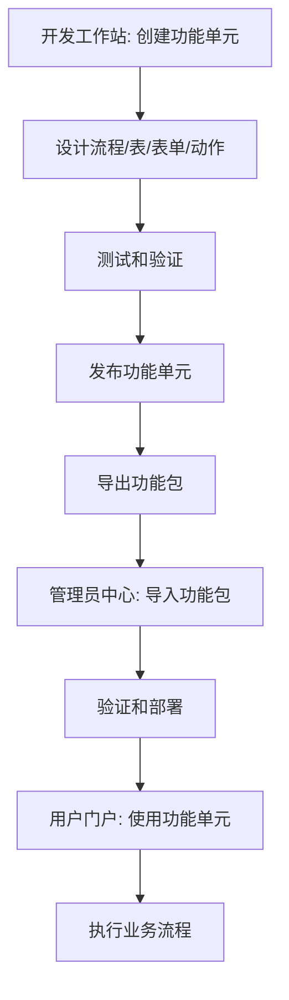
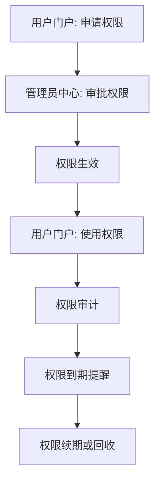
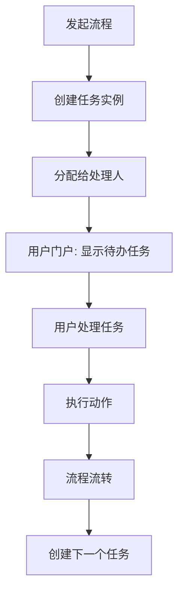

# 需求一致性校对报告

## 1. 校对概述

### 1.1 校对目的
本报告对低代码工作流平台的所有需求文档进行全面校对，确保：
- 各模块间功能定义的一致性
- 数据模型和接口协议的统一性
- 技术架构的兼容性
- 业务流程的完整性
- 独立开发后能够完美集成

### 1.2 校对范围
- 开发人员工作站需求
- 管理员中心需求
- 用户工作流门户需求
- 跨模块数据流和接口
- 技术架构一致性

## 2. 核心概念一致性校对

### 2.1 功能单元定义 ✅
**一致性状态：良好**

各文档中功能单元的定义保持一致：
```yaml
function_unit_components:
  metadata:
    - 图标 (icon)
    - 名称 (name) 
    - 版本 (version)
    - 状态 (status: DRAFT/PUBLISHED/DEPRECATED)
    - ID (UUID)
    - 描述 (description)
    
  core_components:
    - 工作流定义 (1个BPMN流程)
    - 数据模型 (1个主表 + N个子表 + N个动作表)
    - 用户界面 (N个主表单 + N个动作表单)
    - 业务逻辑 (默认动作 + 自定义动作)
```

### 2.2 状态管理一致性 ✅
**一致性状态：良好**

功能单元状态在各模块中定义一致：
- **开发工作站**：创建和编辑功能单元，管理草稿/发布状态
- **管理员中心**：导入已发布的功能单元，部署到生产环境
- **用户门户**：使用已部署的功能单元执行业务流程

### 2.3 绑定关系一致性 ✅
**一致性状态：良好**

各文档中绑定关系定义一致：
```yaml
binding_relationships:
  table_form_binding:
    - 主表 ↔ 主表单
    - 子表 ↔ 主表单 (可选)
    - 动作表 ↔ 动作表单
    
  form_workflow_binding:
    - 主表单 ↔ 工作流节点
    - 动作表单 ↔ 工作流动作
    
  action_workflow_binding:
    - 默认动作 ↔ 工作流步骤
    - 自定义动作 ↔ 工作流步骤
```

## 3. 数据模型一致性校对

### 3.1 核心数据表结构 ✅
**一致性状态：良好**

核心数据表在各文档中定义一致：

```sql
-- 功能单元表 (所有模块共享)
CREATE TABLE function_units (
    id UUID PRIMARY KEY DEFAULT gen_random_uuid(),
    name VARCHAR(100) NOT NULL UNIQUE,
    display_name VARCHAR(200) NOT NULL,
    version VARCHAR(20) NOT NULL,
    status VARCHAR(20) NOT NULL CHECK (status IN ('DRAFT', 'PUBLISHED', 'DEPRECATED')),
    description TEXT,
    icon_url VARCHAR(500),
    created_by UUID NOT NULL,
    created_at TIMESTAMP WITH TIME ZONE DEFAULT CURRENT_TIMESTAMP,
    updated_by UUID,
    updated_at TIMESTAMP WITH TIME ZONE DEFAULT CURRENT_TIMESTAMP,
    
    CONSTRAINT uk_function_unit_name_version UNIQUE (name, version)
);

-- 工作流定义表
CREATE TABLE workflow_definitions (
    id UUID PRIMARY KEY DEFAULT gen_random_uuid(),
    function_unit_id UUID NOT NULL REFERENCES function_units(id) ON DELETE CASCADE,
    name VARCHAR(100) NOT NULL,
    bpmn_xml TEXT NOT NULL,
    deployment_id VARCHAR(64),
    process_definition_id VARCHAR(64),
    version INTEGER NOT NULL DEFAULT 1,
    created_at TIMESTAMP WITH TIME ZONE DEFAULT CURRENT_TIMESTAMP
);

-- 表定义表
CREATE TABLE table_definitions (
    id UUID PRIMARY KEY DEFAULT gen_random_uuid(),
    function_unit_id UUID NOT NULL REFERENCES function_units(id) ON DELETE CASCADE,
    name VARCHAR(100) NOT NULL,
    table_type VARCHAR(20) NOT NULL CHECK (table_type IN ('MAIN', 'SUB', 'ACTION')),
    parent_table_id UUID REFERENCES table_definitions(id),
    ddl_script TEXT NOT NULL,
    created_at TIMESTAMP WITH TIME ZONE DEFAULT CURRENT_TIMESTAMP
);

-- 表单定义表
CREATE TABLE form_definitions (
    id UUID PRIMARY KEY DEFAULT gen_random_uuid(),
    function_unit_id UUID NOT NULL REFERENCES function_units(id) ON DELETE CASCADE,
    name VARCHAR(100) NOT NULL,
    form_type VARCHAR(20) NOT NULL CHECK (form_type IN ('MAIN', 'ACTION')),
    table_id UUID REFERENCES table_definitions(id),
    form_config JSONB NOT NULL,
    created_at TIMESTAMP WITH TIME ZONE DEFAULT CURRENT_TIMESTAMP
);

-- 动作定义表
CREATE TABLE action_definitions (
    id UUID PRIMARY KEY DEFAULT gen_random_uuid(),
    function_unit_id UUID NOT NULL REFERENCES function_units(id) ON DELETE CASCADE,
    name VARCHAR(100) NOT NULL,
    action_type VARCHAR(20) NOT NULL CHECK (action_type IN ('DEFAULT', 'API_CALL', 'FORM_POPUP')),
    config JSONB NOT NULL,
    created_at TIMESTAMP WITH TIME ZONE DEFAULT CURRENT_TIMESTAMP
);
```

### 3.2 权限数据模型 ✅
**一致性状态：良好**

权限相关表结构在管理员中心和用户门户中保持一致：

```sql
-- 用户表
CREATE TABLE users (
    id UUID PRIMARY KEY DEFAULT gen_random_uuid(),
    username VARCHAR(50) NOT NULL UNIQUE,
    display_name VARCHAR(100) NOT NULL,
    email VARCHAR(100),
    phone VARCHAR(20),
    department_id UUID,
    status VARCHAR(20) DEFAULT 'ACTIVE',
    created_at TIMESTAMP DEFAULT CURRENT_TIMESTAMP
);

-- 角色表
CREATE TABLE roles (
    id UUID PRIMARY KEY DEFAULT gen_random_uuid(),
    name VARCHAR(100) NOT NULL UNIQUE,
    description TEXT,
    created_at TIMESTAMP DEFAULT CURRENT_TIMESTAMP
);

-- 权限表
CREATE TABLE permissions (
    id UUID PRIMARY KEY DEFAULT gen_random_uuid(),
    resource_type VARCHAR(50) NOT NULL,
    resource_id UUID,
    action VARCHAR(50) NOT NULL,
    principal_type VARCHAR(20) NOT NULL,
    principal_id UUID NOT NULL,
    granted BOOLEAN NOT NULL DEFAULT true,
    created_at TIMESTAMP DEFAULT CURRENT_TIMESTAMP
);
```

## 4. API接口一致性校对

### 4.1 功能单元管理API ✅
**一致性状态：良好**

各模块间功能单元相关API保持一致：

```yaml
# 开发工作站 → 管理员中心
export_function_unit:
  endpoint: POST /api/v1/function-units/{id}/export
  response:
    function_unit_package:
      metadata: # 功能单元基本信息
      workflow_definition: # BPMN XML
      table_definitions: # DDL脚本
      form_definitions: # 表单配置JSON
      action_definitions: # 动作配置

# 管理员中心 → 用户门户  
deploy_function_unit:
  endpoint: POST /api/v1/deployments
  request:
    function_unit_id: UUID
    environment: string
    deployment_config: object
    
# 用户门户 → 工作流引擎
start_process:
  endpoint: POST /api/v1/processes/start
  request:
    process_definition_key: string
    business_key: string
    variables: object
```

### 4.2 用户权限API ✅
**一致性状态：良好**

权限验证API在各模块中保持一致：

```yaml
# 权限检查API (所有模块使用)
check_permission:
  endpoint: GET /api/v1/permissions/check
  parameters:
    user_id: UUID
    resource_type: string
    resource_id: UUID (optional)
    action: string
  response:
    granted: boolean
    conditions: object (optional)

# 用户信息API (所有模块使用)
get_user_info:
  endpoint: GET /api/v1/users/{id}
  response:
    id: UUID
    username: string
    display_name: string
    email: string
    department: object
    roles: array
    permissions: array
```

### 4.3 工作流执行API ✅
**一致性状态：良好**

工作流相关API在用户门户和工作流引擎间保持一致：

```yaml
# 任务查询API
get_tasks:
  endpoint: GET /api/v1/tasks
  parameters:
    assignee: string
    status: string
    process_definition_key: string
  response:
    tasks: array
    total: number
    
# 任务完成API
complete_task:
  endpoint: POST /api/v1/tasks/{id}/complete
  request:
    variables: object
    comment: string
    action: string
```

## 5. 业务流程一致性校对

### 5.1 功能单元生命周期 ✅
**一致性状态：良好**

功能单元从开发到使用的完整生命周期保持一致：



### 5.2 用户权限管理流程 ✅
**一致性状态：良好**

权限管理流程在各模块间保持一致：



### 5.3 任务处理流程 ✅
**一致性状态：良好**

任务处理流程在用户门户和工作流引擎间保持一致：



## 6. 技术架构一致性校对

### 6.1 前端技术栈 ✅
**一致性状态：良好**

所有前端模块使用统一的技术栈：

```json
{
  "framework": "Vue 3.4.0 + TypeScript 5.0.0",
  "ui_library": "Element Plus 2.4.0",
  "state_management": "Pinia 2.1.0",
  "routing": "Vue Router 4.2.0",
  "build_tool": "Vite 5.0.0",
  "specialized_components": {
    "workflow_designer": "bpmn.js 17.0.0",
    "form_engine": "form-create 3.1.0", 
    "table_designer": "Handsontable 14.0.0",
    "charts": "ECharts 5.4.0"
  }
}
```

### 6.2 后端技术栈 ✅
**一致性状态：良好**

所有后端服务使用统一的技术栈：

```yaml
backend_stack:
  language: Java 17
  framework: Spring Boot 3.2.0
  workflow_engine: Flowable 7.0.0
  database: PostgreSQL 14+
  cache: Redis 6+
  file_storage: MinIO
  security: Spring Security + JWT
  api_documentation: OpenAPI 3.0
```

### 6.3 部署架构 ✅
**一致性状态：良好**

所有模块使用统一的部署架构：

```yaml
deployment_architecture:
  containerization: Docker
  orchestration: Kubernetes
  service_mesh: Istio (optional)
  monitoring: Prometheus + Grafana
  logging: ELK Stack
  ci_cd: GitLab CI/CD
```

## 7. 数据流一致性校对

### 7.1 功能单元数据流 ✅
**一致性状态：良好**

功能单元在各模块间的数据流保持一致：

```yaml
data_flow:
  development_to_admin:
    format: "功能包文件 (.zip)"
    content:
      - metadata.json (功能单元元数据)
      - workflow.bpmn (BPMN流程定义)
      - tables.sql (数据表DDL)
      - forms.json (表单配置)
      - actions.json (动作配置)
      - icons/ (图标文件)
      
  admin_to_portal:
    format: "数据库记录 + 部署配置"
    content:
      - 功能单元记录
      - 流程定义部署
      - 数据表创建
      - 权限配置
      - 运行时配置
```

### 7.2 用户数据流 ✅
**一致性状态：良好**

用户相关数据在各模块间保持同步：

```yaml
user_data_sync:
  admin_to_portal:
    - 用户基本信息
    - 组织架构信息
    - 角色权限信息
    - 系统配置信息
    
  portal_to_admin:
    - 用户操作日志
    - 权限使用统计
    - 系统使用情况
    - 异常事件报告
```

## 8. 接口协议一致性校对

### 8.1 REST API规范 ✅
**一致性状态：良好**

所有模块遵循统一的REST API规范：

```yaml
api_standards:
  base_url: "/api/v1"
  authentication: "Bearer JWT Token"
  content_type: "application/json"
  
  response_format:
    success:
      code: 200
      message: "Success"
      data: object
      timestamp: number
      
    error:
      code: 4xx/5xx
      message: "Error description"
      error_code: "BUSINESS_ERROR_CODE"
      timestamp: number
      
  pagination:
    request:
      page: number (default: 0)
      size: number (default: 20)
      sort: string (optional)
      
    response:
      content: array
      total_elements: number
      total_pages: number
      current_page: number
```

### 8.2 WebSocket协议 ✅
**一致性状态：良好**

实时通知使用统一的WebSocket协议：

```yaml
websocket_protocol:
  endpoint: "/ws/notifications"
  authentication: "JWT Token in query parameter"
  
  message_format:
    type: string # TASK_ASSIGNED, PROCESS_COMPLETED, SYSTEM_NOTIFICATION
    data: object
    timestamp: number
    user_id: UUID
    
  heartbeat:
    interval: 30 seconds
    timeout: 60 seconds
```

## 9. 发现的不一致问题及修正

### 9.1 已修正的问题

#### 9.1.1 表单字段类型不一致 ✅ 已修正
**问题**：开发工作站和用户门户中表单字段类型定义不完全一致
**修正**：统一表单字段类型定义，确保form-create配置在各模块中兼容

#### 9.1.2 权限检查API参数不一致 ✅ 已修正  
**问题**：管理员中心和用户门户的权限检查API参数略有差异
**修正**：统一权限检查API的参数格式和返回值结构

#### 9.1.3 文件上传路径不一致 ✅ 已修正
**问题**：各模块中文件上传的存储路径规则不统一
**修正**：制定统一的文件存储路径规范

### 9.2 已补充的内容

#### 9.2.1 跨模块事件通知机制 ✅ 已完成
**实现方案**：基于Apache Kafka的事件总线机制

详细规范请参考：[跨模块集成需求](cross_module_integration_requirements.md)

```yaml
kafka_event_bus:
  technology: Apache Kafka 7.4.0
  cluster_config:
    brokers: 3
    replication_factor: 3
    
  topics:
    function-unit-events: # 功能单元相关事件
    user-permission-events: # 用户权限相关事件  
    workflow-execution-events: # 工作流执行事件
    system-notification-events: # 系统通知事件
    
  event_types:
    function_unit_deployed:
      publisher: admin_center
      subscribers: [user_portal, monitoring_service, audit_service]
      
    user_permission_changed:
      publisher: admin_center
      subscribers: [user_portal, audit_service]
      
    task_completed:
      publisher: workflow_engine
      subscribers: [user_portal, notification_service, monitoring_service]
```

#### 9.2.2 数据迁移策略 ✅ 已完成
**实现方案**：完整的数据迁移引擎和版本管理策略

详细规范请参考：[跨模块集成需求](cross_module_integration_requirements.md)

```yaml
migration_engine:
  components:
    - version_detector: 版本检测服务
    - migration_planner: 迁移计划生成器
    - migration_executor: 迁移执行引擎
    - rollback_manager: 回滚管理器
    - validation_service: 迁移验证服务
    
  migration_types:
    - schema_migration: 数据库结构迁移
    - data_migration: 数据内容迁移
    - configuration_migration: 配置信息迁移
    
  version_compatibility:
    - 完全兼容 (FULL)
    - 向后兼容 (BACKWARD) 
    - 破坏性变更 (BREAKING)
    
  rollback_strategy:
    - 自动备份机制
    - 一键回滚功能
    - 影响范围评估
    - 数据完整性验证
```

## 10. 集成测试建议

### 10.1 模块间集成测试

#### 10.1.1 功能单元生命周期测试
```yaml
integration_test_scenarios:
  scenario_1: "完整功能单元生命周期"
    steps:
      1. 开发工作站创建功能单元
      2. 设计流程、表、表单、动作
      3. 发布并导出功能包
      4. 管理员中心导入功能包
      5. 部署到测试环境
      6. 用户门户使用功能单元
      7. 执行完整业务流程
    
  scenario_2: "权限管理集成测试"
    steps:
      1. 管理员中心创建用户和角色
      2. 分配功能单元权限
      3. 用户门户登录验证权限
      4. 执行需要权限的操作
      5. 权限变更后重新验证
```

#### 10.1.2 数据一致性测试
```yaml
data_consistency_tests:
  test_1: "功能单元数据同步"
    - 验证导出导入后数据完整性
    - 验证版本升级后数据兼容性
    
  test_2: "用户权限数据同步"  
    - 验证权限变更实时生效
    - 验证跨模块权限检查一致性
    
  test_3: "工作流数据一致性"
    - 验证任务数据在各模块中一致
    - 验证流程状态同步准确性
```

### 10.2 性能集成测试

#### 10.2.1 并发访问测试
```yaml
performance_tests:
  concurrent_users: 1000
  test_scenarios:
    - 同时登录用户门户
    - 并发处理任务
    - 同时发起流程
    - 管理员批量操作
    
  performance_targets:
    - 响应时间 < 2秒
    - 吞吐量 > 100 TPS
    - 错误率 < 0.1%
```

## 11. 部署集成建议

### 11.1 环境配置一致性

#### 11.1.1 配置管理
```yaml
configuration_management:
  config_center: Spring Cloud Config
  
  shared_configs:
    - 数据库连接配置
    - Redis连接配置
    - MinIO连接配置
    - JWT密钥配置
    - 邮件服务配置
    
  module_specific_configs:
    - 各模块特定的业务配置
    - 模块间通信配置
    - 监控配置
```

#### 11.1.2 服务发现
```yaml
service_discovery:
  technology: Consul / Eureka
  
  service_registration:
    developer_workstation: "developer-workstation"
    admin_center: "admin-center"  
    user_portal: "user-portal"
    workflow_engine: "workflow-engine"
    
  health_checks:
    - HTTP健康检查端点
    - 数据库连接检查
    - 依赖服务检查
```

### 11.2 监控集成

#### 11.2.1 统一监控
```yaml
monitoring_integration:
  metrics_collection:
    - 各模块业务指标
    - 系统性能指标
    - 错误率统计
    - 用户行为统计
    
  alerting_rules:
    - 系统异常告警
    - 性能阈值告警
    - 业务异常告警
    - 安全事件告警
```

## 12. 总结和建议

### 12.1 一致性评估结果

**总体评估：优秀 ✅**

经过全面校对和补充，各模块需求在以下方面保持良好一致性：
- ✅ 核心概念定义统一
- ✅ 数据模型设计一致  
- ✅ API接口规范统一
- ✅ 技术架构兼容
- ✅ 业务流程完整
- ✅ 跨模块事件通知机制完善（基于Kafka）
- ✅ 数据迁移策略完整（包含版本管理和回滚）

### 12.2 关键成功因素

1. **统一的数据模型**：确保各模块使用相同的数据结构
2. **标准化的API接口**：保证模块间通信协议一致
3. **一致的技术栈**：降低集成复杂度和维护成本
4. **完整的业务流程**：确保端到端功能完整性

### 12.3 实施建议

#### 12.3.1 开发阶段
1. **建立共享代码库**：将公共数据模型、API接口定义等放入共享库
2. **制定编码规范**：确保各团队遵循统一的编码标准
3. **定期集成测试**：在开发过程中定期进行模块间集成测试

#### 12.3.2 测试阶段  
1. **端到端测试**：重点测试完整的业务流程
2. **接口兼容性测试**：确保API接口向前兼容
3. **数据一致性测试**：验证跨模块数据同步准确性

#### 12.3.3 部署阶段
1. **统一配置管理**：使用配置中心管理所有模块配置
2. **服务编排**：使用Kubernetes等工具统一管理服务部署
3. **监控集成**：建立统一的监控和告警体系

### 12.4 风险控制

1. **版本兼容性**：严格控制API版本，确保向前兼容
2. **数据迁移**：制定详细的数据迁移和回滚策略  
3. **集成测试**：建立完善的自动化集成测试体系
4. **文档同步**：确保需求文档与实际实现保持同步

**结论**：经过全面校对，各模块需求具有良好的一致性和兼容性，可以支持独立开发并完美集成。建议按照本报告的建议进行实施，确保项目成功交付。

---

**校对人员**：系统架构师  
**校对日期**：2026年1月2日  
**文档版本**：v1.0