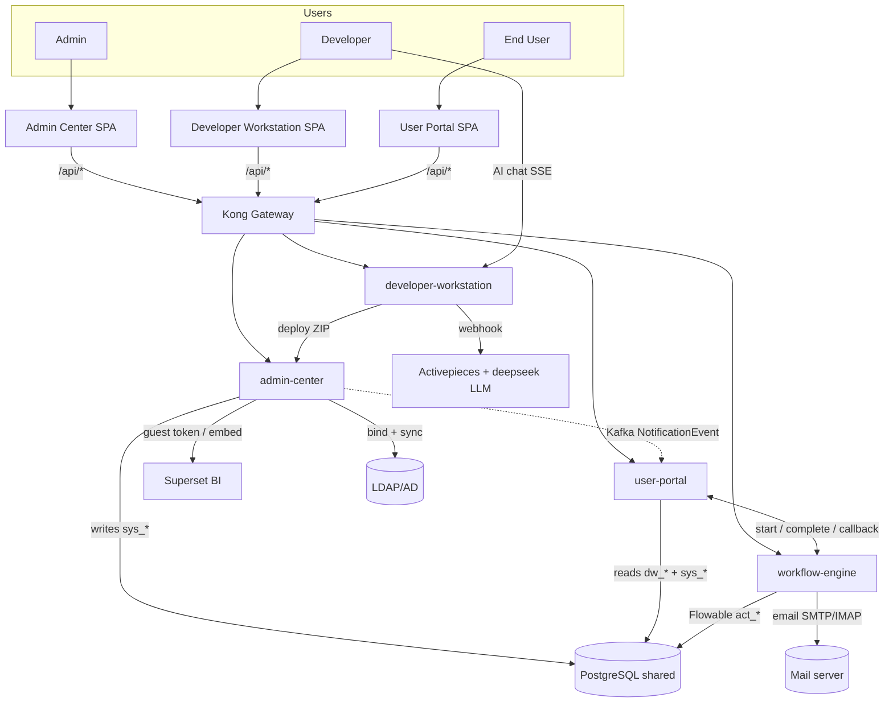
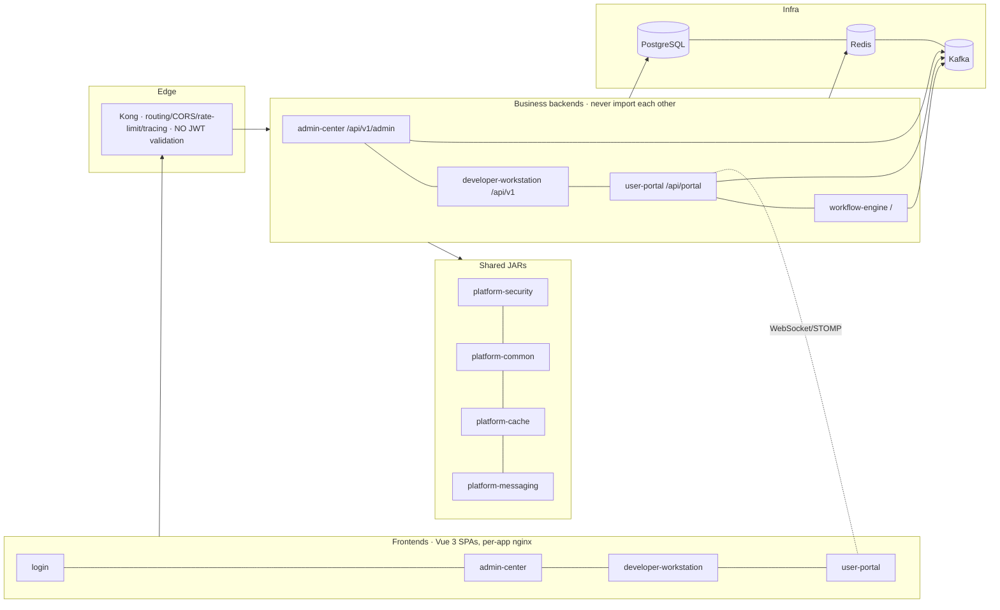

# PROJECT X-RAY REPORT — Workflow Station

> A production-grade, reverse-engineered anatomy of the Workflow Station low-code platform.
> Every claim is grounded in code / schema / config; unverifiable claims are labelled `Unknown`.
> Generated 2026-07 from branch `common_0701_timeline`. This master file is the map; the deep detail lives in the linked companion documents.

**Status vocabulary:** `Confirmed` · `Partial` · `UI Only` · `Backend Only` · `Mocked` · `Dead Code` · `Orphan` · `Broken` · `Missing` · `Unknown`.

## Companion documents
| Area | File |
|---|---|
| Database / ER / JSON-row storage | [architecture/database.md](architecture/database.md) |
| Authentication & Authorization | [architecture/authentication-authorization.md](architecture/authentication-authorization.md) |
| Workflow Engine (Flowable 7) | [architecture/workflow-engine.md](architecture/workflow-engine.md) |
| AI layer & external integrations | [architecture/ai-and-integrations.md](architecture/ai-and-integrations.md) |
| Infrastructure & deployment | [architecture/infrastructure-deployment.md](architecture/infrastructure-deployment.md) |
| Admin Center (module) | [modules/admin-center.md](modules/admin-center.md) |
| Developer Workstation (module) | [modules/developer-workstation.md](modules/developer-workstation.md) |
| User Portal (module) | [modules/user-portal.md](modules/user-portal.md) |
| Shared libs & cross-cutting | [audit/shared-and-crosscutting.md](audit/shared-and-crosscutting.md) |
| Testing & code quality | [audit/testing-and-quality.md](audit/testing-and-quality.md) |

---

## 1. Executive Summary

Workflow Station is an **enterprise low-code workflow platform** (internal "Hermes" product for a large bank). It lets a developer visually design a *Function Unit* (data tables, forms, a BPMN process, decisions, actions, views, email rules), deploy it, and have end users run it as live request/approval workflows — with an AI assistant that can generate a whole Function Unit from a conversation.

**Architecturally it is a modular monolith over a shared PostgreSQL**, not a microservice mesh: 4 Spring Boot business backends (`admin-center`, `developer-workstation`, `user-portal`, `workflow-engine-core`) + 4 shared JARs (`platform-common/-security/-cache/-messaging`) + 4 Vue 3 SPAs + a unified login page, fronted by Kong and (in k8s) Istio. Services never import each other; they talk over REST + Kafka, and data ownership is by table prefix (`sys_`/`dw_`/`up_`/`we_`/`admin_`/`rt_`/`bi_`). The repo already documents this well in [`docs/architecture/architecture-blueprint.md`](../architecture/architecture-blueprint.md), and the code **matches** that blueprint (clean compile-time boundaries verified — no business→business JAR dependency).

**Overall maturity: a feature-rich, thoughtfully-bounded platform that is functionally deep but operationally and test-wise immature.** The happy-path end-user loop (design → deploy → start → approve → complete → notify) is genuinely closed and works. But there is **near-zero automated test coverage of the HTTP layer, no CI, several concrete broken/dead paths** (a 404-ing history endpoint silently swallowed, a WebSocket path mismatch, an entirely disconnected DMN execution feature, dead MFE directories and schema tables), **security shortcuts** (Kong does *not* validate JWTs despite comments claiming so; `permitAll()` at the Spring layer in 3 of 4 backends; dev-grade secrets committed for "preprod"), and a large **silent-fallback debt** the team already tracks.

**Distance to production-grade:** the design is production-shaped; the *operational spine* (CI/CD, test gates, secret management, observability collection, a few real bugs) is not. This is a **strong internal/UAT system that needs a hardening quarter** before it should carry real bank workflows unattended.

### Scorecard at a glance
| Dimension | Score /10 | One-line |
|---|---|---|
| Architecture & boundaries | 8 | Clean modular-monolith, blueprint matches code |
| Feature depth | 8 | FU designer + runtime + AI-gen is genuinely rich |
| Modularity | 7 | Good service split; `platform-common` is a god-module |
| Coupling | 6 | Shared-DB reads + WE↔UP two-way + `platform-common` fan-out |
| Reliability | 5 | Circuit breakers exist; sleep-based ordering, no DLQ wiring |
| Security | 4 | Kong≠JWT gate, permitAll, committed secrets, spoofable `X-User-Id` |
| Observability | 4 | Metrics/tracing *exposed* but nothing collects them; no alerting |
| Testability / coverage | 3 | 383 backend tests but HTTP layer ~uncovered; no CI |
| Maintainability | 6 | Strong docs & rules; God-components; silent-fallback debt |
| Deployment | 5 | Rich k8s/Istio manifests; PowerShell-only, no GitOps, emptyDir data |
| Documentation | 8 | Unusually good internal docs, rules, skills |
| **Overall** | **≈5.5/10** | Production-shaped design, pre-production operations |

---

## 2. Project Overview

- **Purpose:** visually build and run enterprise approval/data workflows without hand-coding each app.
- **Three personas / three floors:** Admin (governance), Developer (design), End User (run) — plus an AI assistant that generates designs.
- **Core artifact:** the *Function Unit* — a versioned bundle of tables, fields (with FK/PK metadata), forms, form↔table bindings, a BPMN process, DMN decisions, action buttons, main/sub-table views with access rules, and email connection/template/monitor rules.
- **Key design decision — JSON row storage:** business/form data is **not** stored in physical per-form tables. It lives as JSON: relation-table rows in `rt_table_data_rows.data` (JSONB), and process/form data (including nested `__subTables__`) in `up_process_instance.variables` (JSONB). This is an explicit, enforced rule and shapes the entire runtime.
- **Deployment pivot:** Developer Workstation packages a Function Unit into a ZIP → Admin Center imports/validates/deploys it, writing the runtime `sys_*` tables → User Portal reads those at runtime. Admin Center is the **sole writer of deployed artifacts**.

---

## 3. Technology Stack

| Layer | Tech (verified) |
|---|---|
| Backend | Java 17, Spring Boot 3.2.1, Spring Security 6, **Flowable 7.0.0** (embedded BPMN+DMN), Spring Kafka, JPA/Hibernate (`ddl-auto: none`), Resilience4j, jjwt, MapStruct, Lombok |
| Frontend | Vue 3 + Vite + Element Plus + Pinia + vue-i18n (en/zh-CN/zh-TW); `bpmn-js`/`dmn-js` (designer), `@form-create/designer` ("Hermes" fork), `mathjs`, `@wangeditor`, `dompurify`, `@superset-ui/embedded-sdk`, `@stomp/stompjs`+`sockjs`, `@vue-flow` |
| Data / infra | PostgreSQL (shared, external in prod), Redis 7.2, Kafka 3.6 (KRaft, RF=1), Kong 3.7 (DB-less), Istio (k8s), nginx (per-SPA) |
| External systems | **Activepieces 0.84** (automation + AI-gen webhook, deepseek-v4-pro), **Superset 6.0** (BI), LDAP/AD (login + sync), DSP SSO, SMTP/IMAP email; **n8n 1.89 = legacy/dead but still deployed** |
| Build/deploy | Maven multi-module (JDK 17 required — JDK25 silently breaks Lombok), host-built fat JARs → Docker layertools, k8s via PowerShell + kubectl (no GitOps). **CI exists only for Activepieces flow publish** (2 Jenkinsfiles); none for the platform itself |
| Schema | `deploy/init-scripts/00-schema/*.sql` is the single source of truth (Flyway retired 2026-06); append-only, snapshot-style |

---

## 4. Repository Structure

```text
Workflow-Station---sun/
├── backend/                    # Maven aggregate (root pom)
│   ├── platform-common/        # god-module: DTOs, ApiResponse, exceptions, + a parallel security stack (108 files)
│   ├── platform-security/      # JWT, identity JPA schema + repos (shipped into all apps)
│   ├── platform-cache/         # Redis wrapper (4 files)
│   ├── platform-messaging/     # Kafka topics + producers/DLT
│   ├── workflow-engine-core/   # Flowable 7 runtime (214 files)
│   ├── admin-center/           # governance + deployment target (419 files — largest)
│   ├── developer-workstation/  # design-time (345 files)
│   └── user-portal/            # end-user runtime (198 files)
├── frontend/
│   ├── admin-center/ developer-workstation/ user-portal/   # 3 live SPAs
│   ├── login/                  # LIVE unified SSO page
│   ├── shared/                 # real shared TS (vite alias @platform-shared)
│   ├── packages/core/          # DEAD scaffold (@workflow-station/core, zero consumers)
│   └── gateway-/workflow-/delegation-/notification-mfe/    # DEAD (dist-only, referenced nowhere)
├── deploy/                     # init-scripts (schema+seed), k8s (Istio), kong, superset, pieces, ap-flows, environments/{dev,sit,uat,prod}
├── docs/                       # unusually thorough internal docs + this x-ray/
├── .cursor/rules + .claude/skills   # governance rules & skills (fallback-audit, portability, view-access…)
└── pom.xml                     # aggregates the 8 backend modules
```

> **Doc drift found:** `PROJECT_ARCHITECTURE.md` references a `backend/api-gateway` module and a Gateway-Governance UI/gateway-mfe roadmap that **do not exist** in code. The 4 MFE directories are dead. See §11.

---

## 5. System Context



---

## 6. High-Level Architecture



Allowed runtime calls (only three forms): **HTTP** REST between backends (`ApiResponse<T>`, Resilience4j), **Kafka** events (`platform.notification.events` is the only live topic; consumed by user-portal → STOMP), and **controlled shared-DB reads** (user-portal reads `dw_*` for form definitions with an HTTP fallback). The one runtime two-way coupling is **UP↔WE** (UP starts/completes; WE calls back on completion + email-inbound).

---

## 7. Module-by-Module Summary

| Module | Role | Size | Status | Deep dive |
|---|---|---|---|---|
| **admin-center** (BE+FE) | Identity/RBAC, deployment target, BI, audit, LDAP sync | 419 + 56 vue | Confirmed core; conflict-resolution & LDAP-UI gaps | [modules/admin-center.md](modules/admin-center.md) |
| **developer-workstation** (BE+FE) | Design-time FU designer (thin FE shell, tabbed edit page) | 345 + 100 vue | Confirmed; DMN execution disconnected; unreachable import button | [modules/developer-workstation.md](modules/developer-workstation.md) |
| **user-portal** (BE+FE) | End-user runtime: form engine, tasks, approvals, views, notes | 198 + 51 vue | Confirmed happy-path; many 403-blocked legacy endpoints | [modules/user-portal.md](modules/user-portal.md) |
| **workflow-engine-core** | Flowable 7 runtime, task assignment, service tasks, email | 214 | Confirmed core; 404 history endpoint, WS path mismatch | [architecture/workflow-engine.md](architecture/workflow-engine.md) |
| **platform-common** | Shared DTOs/exceptions **+ a parallel security stack** | 108 | Confirmed but god-module | [audit/shared-and-crosscutting.md](audit/shared-and-crosscutting.md) |
| **platform-security / -messaging / -cache** | JWT+identity / Kafka / Redis | 57/12/4 | Confirmed | same |
| **AI layer** | 3-phase FU generation via Activepieces + deepseek | (in DW) | Confirmed dev-e2e | [architecture/ai-and-integrations.md](architecture/ai-and-integrations.md) |

---

## 8. Database (see [architecture/database.md](architecture/database.md))

**115 platform-owned tables** (excluding Flowable `ACT_*`/`FLW_*` and Superset's own schema), grouped: `sys_*` (33, identity + deployed FU catalog), `dw_*` (32, designer metadata) + unprefixed `members`, `admin_*` (14), `up_*` (13), `rt_*` (10, relation tables), `wf_*` (6, engine extensions), `bi_*` (4). All built from `deploy/init-scripts/00-schema/` with `ddl-auto: none`; Flowable creates its own tables at startup.

Key facts: explicit FK graphs are clean within each prefix; **cross-prefix links are application-level (no FK)** — e.g. `up_process_instance.process_instance_id`→Flowable, dw→sys deployment lineage, polymorphic `target_type/target_id` throughout RBAC. JSON-row storage means `dw_table_definitions`/`dw_field_definitions` are *metadata only* — deploying never runs `CREATE TABLE`. Migration hygiene is mostly good (append-only) but has **duplicate numbering** (two `18-`, two `34-`, two `39-`, two `51-`) and one fully **dead table** (`wf_multi_instance_execution`, migration 24, zero Java references).

---

## 9. Feature Completion Matrix

| Module | Feature | UI | API | Backend | DB | Integ | Status | Evidence |
|---|---|---|---|---|---|---|---|---|
| DW | FU design (tables/fields/FK-PK) | ✅ | ✅ | ✅ | ✅ | — | **Confirmed** | TableDesignController, dw_field_definitions |
| DW | Form designer (form-create/Hermes) | ✅ | ✅ | ✅ | ✅ | — | **Confirmed** | FormDesigner.vue (2253L), dw_form_definitions |
| DW | BPMN process designer | ✅ | ✅ | ✅ | ✅ | — | **Confirmed** | ProcessDesigner, dw_process_definitions |
| DW | BPMN **import** from XML | ⚠️ | ✅ | ✅ | — | — | **UI Only / Broken entry** | import dialog has no trigger button |
| DW | DMN decision **design** | ✅ | ✅ | ✅ | ✅ | — | **Confirmed** | DecisionDesigner (dmn-js) |
| DW→WE | DMN decision **execution** | — | ✅ | ⚠️ | — | ❌ | **Broken / disconnected** | nothing deploys DMN to Flowable; evaluate endpoint orphan |
| DW | Version mgmt + rollback | ✅ | ✅ | ✅ | ✅ | — | **Confirmed** | VersionManager, dw_versions |
| DW | Export / Import / Clone | ✅ | ✅ | ✅ | ✅ | — | **Confirmed** | ExportImportController (portability skill) |
| DW | AI-generate whole FU | ✅ | ✅ | ✅ | ✅ | ✅ | **Confirmed (dev e2e)** | AiGeneration* + Activepieces flow |
| DW | Email connection/template/monitor design | ✅ | ✅ | ✅ | ✅ | — | **Confirmed** | dw_email_* + designers |
| AC | User/Role/Permission/BU/VG mgmt | ✅ | ✅ | ✅ | ✅ | — | **Confirmed** | sys_* + controllers |
| AC | Permission conflict detect/resolve | ? | ✅ | ✅ | ✅ | — | **Backend Only?** | endpoints exist, UI unconfirmed |
| AC | FU deployment target (ZIP→sys_*) | ✅ | ✅ | ✅ | ✅ | — | **Confirmed** | FunctionUnitImportController |
| AC | BI / Superset embed | ✅ | ✅ | ✅ | ✅ | ✅ | **Confirmed (dev)** | BiGuestTokenController, bi_* |
| AC | LDAP sync | ❌ | ✅ | ✅ | ✅ | ✅ | **Backend Only** (scheduled, no UI) | LdapSyncController, ac_ldap_sync_audit |
| AC | Audit logging | ✅ | ✅ | ✅ | ✅ | — | **Partial** (uneven coverage) | SecurityAudit/Log controllers |
| UP | Start request / form runtime | ✅ | ✅ | ✅ | ✅ | ✅ | **Confirmed** | ProcessStartComponent, form engine |
| UP | Tasks / approvals / delegation | ✅ | ✅ | ✅ | ✅ | ✅ | **Confirmed** | TaskController, WE clients |
| UP | Task **urge** notification | ✅ | ✅ | ⚠️ | ✅ | ❌ | **Partial (stub)** | sendUrgeNotification only logs |
| UP | Main table views + access | ✅ | ✅ | ✅ | ✅ | — | **Confirmed** | PortalMainTableViewService |
| UP | Record notes (rich text + attach) | ✅ | ✅ | ✅ | ✅ | — | **Confirmed** | RecordNoteController, up_record_note |
| UP | Sub-table process history detail | ✅ | ✅ | ❌ | ✅ | — | **Broken** | calls WE `GET /history/processes/{id}` → 404 swallowed |
| UP | Live sub-table WebSocket updates | ✅ | ✅ | ⚠️ | — | ❌ | **Broken (path mismatch)** → falls back to polling |
| UP | Notifications (Kafka→STOMP) | ✅ | ✅ | ✅ | ✅ | ✅ | **Confirmed** | NotificationKafkaConsumer |
| Platform | Superset SSO (single-FQDN /bi) | ✅ | ✅ | ✅ | — | ✅ | **Confirmed dev / Partial prod** | superset SSO docs |
| Platform | Activepieces service tasks | ✅ | ✅ | ✅ | ✅ | ✅ | **Confirmed (dev e2e)** | ApTaskExecutor |
| Platform | n8n automation | — | — | ⚠️ | ✅ | ❌ | **Dead** (deployed but orphaned) | n8n.yaml live, no live caller |
| Platform | Gateway governance UI | ❌ | ❌ | ❌ | — | — | **Missing** (doc-only) | no api-gateway module / mfe |

---

## 10. User Journey Analysis (loop closure)

- **Admin journey** (login → users/roles/permissions/BU/VG → deploy FUs → BI) — **Closed.** RBAC is real; deployment target works; SYS_ADMIN bypass consistent. Gap: LDAP-sync and possibly permission-conflict resolution lack UI surfaces.
- **Developer journey** (login → FU list → design tables/forms/process/actions/views/email → validate → deploy → version) — **Closed for design & deploy.** Two dead ends inside it: BPMN *import* is unreachable, and DMN decisions can be designed/validated but **never execute at runtime**.
- **End-user journey** (login → discover FU → start → fill dynamic form → submit → approve/complete → notify → view in my-applications/views) — **Closed.** This is the strongest loop. Frays: process-history detail via the 404 endpoint is empty; live sub-table updates degrade to polling; urge delivers no actual notification.
- **AI-assistant journey** (open panel → chat REQUIREMENTS→DESIGN→GENERATION → preview + quality score → apply → 30s undo) — **Closed (dev-verified).** Depends on Activepieces + deepseek being reachable; degrades to draft-save on failure.

---

## 11. Logic Closure — Dead Ends, Orphans, Broken Loops

**Confirmed broken / disconnected**
1. **DMN execution is disconnected end-to-end** — DW designs/validates/exports decisions; WE enables the DMN engine and exposes `POST /processes/decisions/{key}/evaluate`, but *nothing deploys DMN to Flowable and nothing calls evaluate*. (`architecture/workflow-engine.md` Gap 2)
2. **404 history endpoint silently swallowed** — user-portal calls `GET /api/v1/history/processes/{id}` which the engine never maps; every call 404s into `Optional.empty()`, so that history view is permanently empty. (workflow-engine Gap 1)
3. **Sub-table WebSocket path mismatch** — engine registers STOMP `/ws/sub-table-updates`; portal connects to `/api/workflow/ws/sub-table-updates` (Kong `strip_path:false`) → engine never sees that path → live updates fall back to polling. (workflow-engine Gap 3)

**Orphan APIs (no caller)** — 6 of 7 `MonitoringController` endpoints, `GET /processes/definitions`, `POST /tasks/{id}/assign`, `POST /tasks/batch/complete`, `GET /history/activities`, both `ApExecutionController` GETs, `POST /ap/execute`, DMN evaluate (engine); `ApiDataController /data-api/fu-contents`, deprecated `fu-data`/`function-unit-contents`, and a swath of 403-blocked legacy permission/exit endpoints (portal).

**Dead code / schema** — 4 MFE directories (`gateway-/workflow-/delegation-/notification-mfe`, dist-only, referenced nowhere); `frontend/packages/core` scaffold (zero consumers); `wf_multi_instance_execution` table; n8n container + `N8N_ACTION` enum; `up_process_instance.variables_json` legacy column; large dormant physical-sub-table code in the portal (defensive, no-ops under JSON-row storage).

**Missing (designed, not built)** — Gateway-Governance UI + `backend/api-gateway` module (referenced in `PROJECT_ARCHITECTURE.md`, absent in code).

**Coupling hotspots** — `platform-common` (god-module, 4-service fan-out, F7 in blueprint); `platform-security` ships the entire identity JPA schema into all apps (schema-level coupling); UP↔WE runtime two-way; user-portal reading `dw_*` directly. Single points of failure: **Admin Center** (sole writer of deployed `sys_*` — if its import/deploy breaks, nothing new ships) and the **shared PostgreSQL**.

---

## 12. Security Audit (see [architecture/authentication-authorization.md](architecture/authentication-authorization.md))

Authentication is solid in shape: JWT (HS256) issued/validated by `platform-security`, httpOnly cookie session, OAuth-code-style SSO through the unified login app, Redis token blacklist (fail-closed), min-32-byte secret enforced at startup, real LDAP login+sync (gated by `ldap.enabled`). But the **enforcement perimeter has holes**:

| # | Finding | Severity |
|---|---|---|
| 1 | **Kong does NOT validate JWTs** despite code comments calling it the "first line of defense" — it only does routing/CORS/rate-limit/tracing. | High |
| 2 | 3 of 4 backends use `anyRequest().permitAll()` — Spring enforces nothing; only workflow-engine actually rejects unauthenticated requests at the Spring layer. Auth relies on the JWT filter + per-controller checks. | High |
| 3 | Flowable native REST (`/process-api/**`, `/dmn-api/**`, `/idm-api/**`) is `permitAll`, relying solely on Kong not routing those paths — any in-cluster actor gets full unauthenticated engine admin. | High |
| 4 | **Committed secrets:** "preprod" k8s Secret ships dev-grade JWT/encryption/Superset keys + `admin/admin123`; `DSP_CLIENT_SECRET: "hermes@123"` in the "placeholder" UAT secret; `ACTIVEPIECES_SHARED_PASSWORD` in the git-tracked dev `.env`. | High |
| 5 | `X-User-Id` / `X-Username` header identity is trusted in places (portal, AI panel) — spoofable if any code path reads the raw header without the JWT context. | Medium |
| 6 | workflow-engine actuator `exposure.include: "*"` + `show-details: always` on the traffic port; per-backend HTTP :80 gateway hosts bypass Kong; Kafka/Redis exposed via Istio TCP gateways (PLAINTEXT / password-only). | Medium |
| 7 | AP CE webhooks are unauthenticated; the AI-gen flowId is hardcoded and (in k8s) the webhook path is deliberately externally exposed — a leaked flowId is publicly invokable (LLM-token burn). | Medium |
| 8 | `RecordNoteField` renders server `bodyHtml` via `v-html` without a client-side DOMPurify pass (relies on server sanitization). | Medium |

Good patterns exist too: SSRF allowlists (DW AI + AP task executor), constant-time SSO token compare, nonce-based cross-domain AP SSO, Superset X-Remote-* stripping + DENY AuthorizationPolicy, CORS allowlists, HSTS via Kong.

---

## 13. Reliability, Performance, Scalability, Observability

**Reliability** — Resilience4j circuit breakers on outbound HTTP (portal `portal-outbound-http`); after-commit Kafka publish; per-message email idempotency ledger. Weak spots: process-completion→portal sync uses `Thread.sleep(500)` + fire-and-forget HTTP (pure-automation flows depend entirely on it); no optimistic-lock retry (last-write-wins); `RetryAndCompensationComponent`/dead-letter registries are in-memory scaffolding not wired to anything; AP service-task retry sleeps inside the Flowable thread within the transaction.

**Performance** — JSON-row storage trades physical-table joins for JSONB + `pg_trgm` GIN search; lookup fields load the *entire* referenced table client-side (cap 10000 w/ truncation warning); portal previously fired tens of thousands of duplicate metadata queries (now memoized). Read timeouts are very long (portal 600s, AI 300s) to tolerate slow webhooks — a thread-pool exhaustion risk under a wedged Activepieces.

**Scalability** — user-portal is stateless and runs 2 replicas + HPA (capped `max=2` by a documented Postgres connection budget; PgBouncer named as the real fix). Everything else is single-replica by necessity: workflow-engine (Flowable), admin-center (LDAP-sync cron would double-run), DW (in-memory SSE emitters), Kafka RF=1, Redis single. Portal WS fan-out across replicas leans on Kafka-backed messaging.

**Observability** — `micrometer-prometheus` + `micrometer-tracing-brave` are wired and expose `/actuator/prometheus` with traceId/spanId in logs and Kong correlation-ids — **but nothing collects them**: no Prometheus/ServiceMonitor, no span exporter/collector, no logback config or log shipper, no alerting. Health probes are good (except Superset k8s Deployment has none). Data on Kafka/Redis PVCs has no backup; n8n/AP use emptyDir (data lost on reschedule).

---

## 14. Testing & Quality (see [audit/testing-and-quality.md](audit/testing-and-quality.md))

383 backend test files, but they are **jqwik property tests + Mockito unit tests** — only ~14 `@SpringBootTest`, 1 `@WebMvcTest`, zero Testcontainers. The **entire HTTP layer is effectively uncovered**: ~90 controllers across the 4 backends (including AuthController, SSO, SecurityAudit, DeploymentController, TaskFormController) have no controller-level tests. Frontend: user-portal 76 test files (with a dedicated MI-regression config + Playwright screenshot gate), DW 69, **admin-center only 5**; login + all MFEs + shared have zero. **There is no CI** (no `.github/`; `deploy/ci` has only 2 Activepieces Jenkinsfiles) — nothing enforces tests or lint anywhere; no checkstyle/spotbugs/JaCoCo/Prettier/husky.

Quality signals: only 8 files >1000 lines but they are load-bearing God-components (`FormDesigner.vue` 2253, `SubTableField.vue` 1373, `PortalRelationTableServiceImpl` 1085, `LdapSyncService` 952). The team already tracks a **silent-fallback debt baseline** (`.claude/skills/fallback-audit`, 2026-07): ~714 frontend `|| []` swallow-empties, ~922 backend broad catches, ~294 log-only catches — governance rules exist but the debt is large.

---

## 15. Technical Debt Map

| Priority | Item | Why it matters | Fix complexity |
|---|---|---|---|
| **Critical** | No CI + HTTP layer untested | Regressions ship unguarded; deployment/auth paths unverified | High (stand up CI + integration tests w/ Testcontainers) |
| **Critical** | Committed dev-grade secrets for "preprod"; Kong≠JWT; permitAll | Forgeable JWTs / unauthenticated engine admin in shared envs | Medium (rotate to vault/sealed-secrets; add JWT at edge or enforce at Spring) |
| **High** | DMN execution disconnected; 404 history endpoint; WS path mismatch | User-visible features silently broken | Low–Medium (wire DMN deploy; add/rename endpoint; fix WS path) |
| **High** | `platform-common` god-module (F7) + `platform-security` schema-into-all | Any DTO change recompiles 4 services; blast radius | High (P1-1 split already planned in docs) |
| **High** | Observability collection missing | Metrics/traces exposed but blind in prod; no alerting | Medium (add Prometheus/ServiceMonitor + OTLP exporter + logback JSON) |
| **Medium** | Silent-fallback debt (714/922/294) | Errors swallowed → hard to diagnose; correctness risk | High (ongoing per fallback-audit skill) |
| **Medium** | Dead code: 4 MFEs, packages/core, n8n, dead tables/columns | Confusion, image bloat, false "it exists" signals | Low (delete) |
| **Medium** | Single-replica engine/admin + no PgBouncer | Scaling ceiling; LDAP cron double-run risk | Medium |
| **Low** | God-components (FormDesigner etc.), stray console.logs, doc drift | Maintainability | Low–Medium |

---

## 16. Production Readiness & Recommended Roadmap

**Verdict:** production-shaped design, **not yet production-ready** to run bank workflows unattended. Suitable for internal/UAT today.

**Phase 0 — Stop the bleeding (days)**
- Rotate & remove committed secrets; move to sealed-secrets/vault; regenerate any real DSP/LDAP creds exposed in git history.
- Fix the three broken loops: DMN deploy wiring (or hide the feature), the 404 history endpoint, the WS path mismatch.
- Lock down Flowable native REST + actuator exposure; delete the per-backend Kong-bypass hosts in prod.

**Phase 1 — Operational spine (weeks)**
- Stand up CI (build + test + lint gate) for the platform, not just AP flows; add integration tests (Testcontainers) for auth, deployment, task-completion, form runtime.
- Decide and enforce the JWT trust boundary (edge validation in Kong, or make Spring `authenticated()` real in all 4 backends).
- Wire observability collection (Prometheus/ServiceMonitor, trace exporter, structured logs + shipper, basic alerts).

**Phase 2 — Hardening & scale (quarter)**
- PgBouncer + revisit replica counts; make process-completion sync durable (outbox/retry instead of sleep); wire the compensation/DLQ scaffolding or delete it.
- Split `platform-common` (P1-1 plan already in docs); reduce `platform-security` schema coupling.
- Burn down the silent-fallback debt on the highest-risk paths; delete dead MFEs/n8n/tables.

**Phase 3 — Product completeness**
- Finish partials: real urge notifications, LDAP-sync UI, permission-conflict UI, prod Superset `/bi` convergence, AP action-mode UI.

---

## 17. Appendix

- **Boundary source of truth:** `docs/architecture/architecture-blueprint.md` (F1–F7 dependency rules, verified against code 2026-07).
- **Feature blueprint (design intent):** `docs/design/feature-blueprint.md`.
- **Schema source of truth:** `deploy/init-scripts/00-schema/` (append-only; Flyway retired).
- **Governance rules/skills:** `.cursor/rules/*.mdc`, `.claude/skills/*` (fallback-audit, function-unit-portability, version-rollback, view-access-control, secure-coding-sast, portal-dialog-form-labels).
- **Method note:** this report was produced by fanning out parallel reverse-engineering passes over each subsystem, each writing an evidence-linked companion doc, then cross-checking findings against the repo's own blueprint. Where a subsystem pass could not verify a claim, it is labelled `Unknown` rather than guessed. A handful of "backend exists, UI unconfirmed" items (permission-conflict UI, some Exit wrappers) are flagged for a targeted follow-up read rather than asserted either way.
