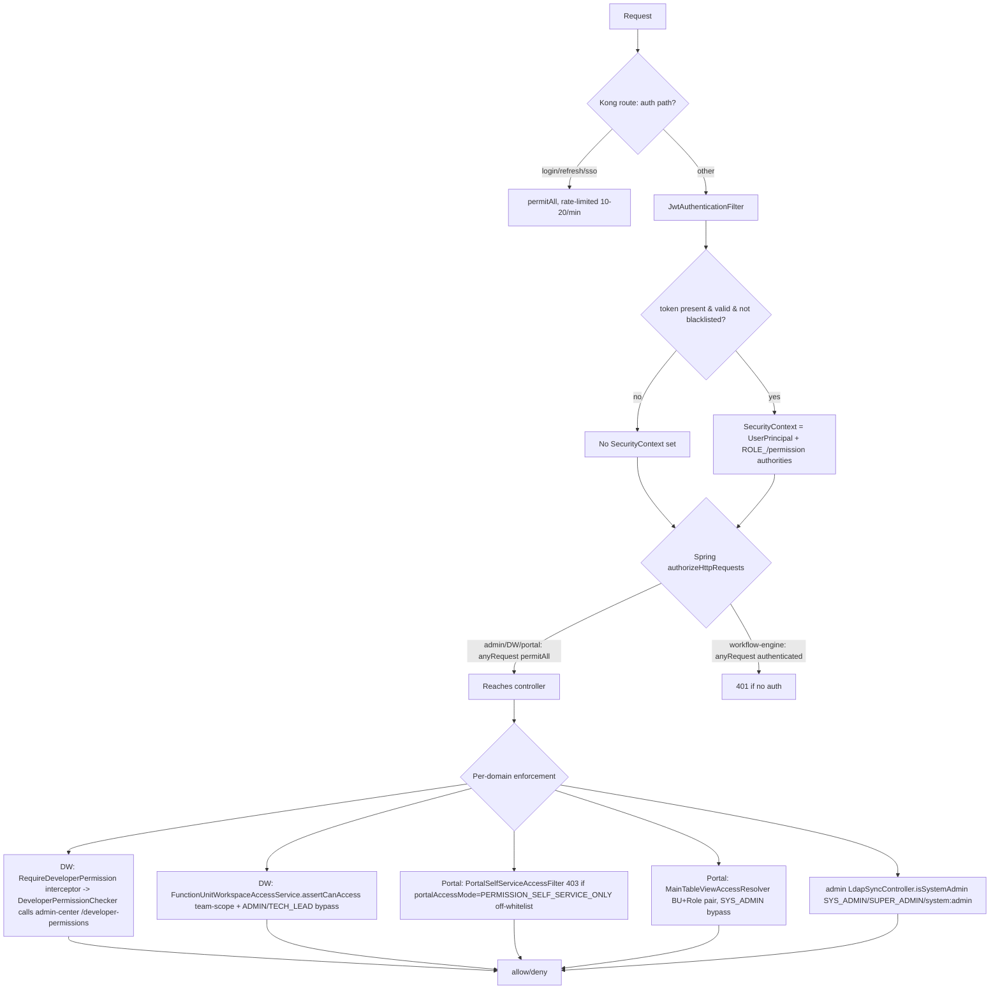

# Auth X-Ray — Workflow Station (Authentication + Authorization)

Reverse-engineered from source. All paths absolute. Line numbers cited where load-bearing.

---

## 0. Component map

| Concern | Owner |
|---|---|
| JWT issue/validate/blacklist | `backend/platform-security` (shared lib) — `JwtTokenServiceImpl`, `JwtAuthenticationFilter`, `JwtProperties` |
| Unified login page | `frontend/login` (static Vue app served at `/login/`) |
| SSO code issuance / redeem | `backend/admin-center` — `SsoAuthController` (`/sso/login`, `/sso/passwordless`), `SsoInternalController` (`/internal/sso/redeem`), `PlatformSsoService` |
| Per-app session (cookie JWT) | each backend's own `AuthController` + `AuthSsoExchangeController` (portal / DW), `PortalSessionIssuerService` |
| Gateway | Kong (`deploy/kong/kong.yml.template`) — routing/CORS/rate-limit only, **no JWT verification** |
| LDAP | `backend/admin-center/.../ldap/*` — auth (`LdapAuthenticator`, `ConditionalOnProperty ldap.enabled`) + scheduled sync (`LdapSyncService`) |
| Superset SSO | admin-center `BiSupersetAuthController` `/internal/bi/superset/authorize` + edge nginx `auth_request` |
| Activepieces bridge | admin-center `/internal/ap/bridge` + `/internal/ap/token` (nonce), `deploy/k8s/ap-gateway.yaml` |

---

## (a) Authentication flow (Mermaid)

```mermaid
sequenceDiagram
    autonumber
    participant U as Browser
    participant L as login app (/login/)
    participant AC as admin-center (SSO issuer)
    participant R as Redis
    participant APP as target app backend (portal/DW/admin)
    participant DB as Postgres

    Note over U,L: App router guard hits protected route with no valid cookie
    U->>L: redirect /login/?client_id&redirect_uri&state&auto_sso=1
    U->>L: submit username/password (useLogin.ts)
    L->>AC: POST /api/v1/admin/sso/login (SsoLoginRequest)
    AC->>AC: PlatformSsoService.authenticate()
    alt ldap.enabled=true
        AC->>AC: LdapAuthenticator.authenticate (bind + JIT upsert)
        Note right of AC: BAD_CREDENTIALS => reject (no fallback)<br/>NOT_IN_LDAP / UNAVAILABLE => local fallback
    else ldap disabled / fallback
        AC->>DB: userRepository + BCrypt matches
    end
    AC->>R: SET platform:sso:code:<uuid> = {userId,...} TTL
    AC-->>L: { authorizationCode, redirectUri, state }
    L->>U: window.location = redirectUri?code=..&state=..
    U->>APP: GET /sso/callback (SPA) -> POST /auth/sso/exchange {code, workspaceBU, workspaceRole}
    APP->>AC: POST /internal/sso/redeem (X-Platform-Sso-Internal: SSO_INTERNAL_TOKEN)
    AC->>R: GETDEL code -> userId (one-time)
    AC-->>APP: { userId }
    APP->>DB: load user, status checks, resetFailedLoginCount, lastLogin
    APP->>APP: PortalSessionIssuerService.issuePortalSession()
    APP-->>U: Set-Cookie access_token + refresh_token (httpOnly, SameSite=Lax) + LoginResponse(user)
    Note over U,APP: Subsequent API calls: axios withCredentials sends cookie;<br/>JwtAuthenticationFilter validates, sets SecurityContext
```

Direct password login also exists per-app (`portal AuthController POST /auth/login`, admin `AuthController`, platform-security `AuthController /api/v1/auth/login`) returning tokens in body — but the production path is the SSO code exchange above (login guards force `redirectToUnifiedLogin` in PROD).

### Token mechanics (evidence)
- JWT HS256 via jjwt. Signing key `Keys.hmacShaKeyFor(secret)`, **min 32 bytes enforced at startup** — `JwtTokenServiceImpl.java:44-54`.
- Claims: `userId, username, email, displayName, roles, permissions, language, tokenType, activeBusinessUnitId, activeRoleId, portalAccessMode`, `jti=UUID`, issuer `platform` — `JwtTokenServiceImpl.java:63-96,166-170`.
- Access TTL default 1h (`JWT_EXPIRATION` overrides; portal yml sets 86400000ms=24h), refresh 7 days — `JwtProperties.java:25-30`, `user-portal/application.yml:116-117`.
- Blacklist on logout/refresh-rotation: Redis key `auth:blacklist:<sha256(token)>` with TTL=remaining validity — `JwtTokenServiceImpl.java:218-246`. **Fail-closed**: Redis down => `isBlacklisted` returns true (token rejected) — line 242-244.
- Token extraction order: `Authorization: Bearer` header first, then httpOnly cookie by per-service `cookieNames` list — `JwtAuthenticationFilter.java:84-106`.
- Cookies issued httpOnly, `SameSite=Lax`, `secure=false` (dev), path `/` — `PortalSessionIssuerService.java:314-322`.

---

## (b) Authorization decision flow (Mermaid)



### RBAC model
- Tables: `sys_users`, `sys_roles`, `sys_permissions`, `sys_role_permissions`, `sys_role_assignments`, `sys_virtual_groups` + `sys_virtual_group_members`, business-unit + `sys_business_unit_roles`, `dw_function_unit_dev_groups` (VG→FU), `dw_main_table_view_access` (view BU/Role), `up_permission_request`.
- Effective roles = **direct USER assignments ∪ virtual-group assignments** — `UserRoleServiceImpl.java:40-77` (`getEffectiveRolesForUser` unions `findValidUserAssignments` + `findValidVirtualGroupAssignments`). Note: BU_UNBOUNDED roles skip USER direct assignment (line 141).
- Permissions resolved `sys_roles -> sys_role_permissions -> sys_permissions` — `UserRoleServiceImpl.java:222-228`; also baked into JWT at login (`AuthenticationServiceImpl.login` roles+permissions).
- Engine has its own in-memory RBAC with wildcard support (`resource:*`, `*:*`) — `SecurityRbacService.checkPermission` (workflow-engine-core).

---

## (c) Enforcement points table

| # | Layer | Mechanism | File:line | Status |
|---|---|---|---|---|
| 1 | Gateway | Kong routing + CORS + rate-limit; login 10/min, refresh 20/min, global 600/min. **NO JWT plugin** (comment: "Kong 不做 JWT 验证") | `deploy/kong/kong.yml.template:207-208,231-317` | Confirmed |
| 2 | Filter (all apps) | `JwtAuthenticationFilter` validates token, builds `ROLE_<code>` + raw permission authorities | `platform-security/.../filter/JwtAuthenticationFilter.java:48-75` | Confirmed |
| 3 | Spring authz | admin/DW/portal `anyRequest().permitAll()` — authz delegated to filters/services, NOT Spring | `admin/config/SecurityConfig.java:69`; `portal:46`; `developer/config/SecurityConfig.java:61` | Confirmed |
| 4 | Spring authz | workflow-engine `anyRequest().authenticated()` (only module that enforces at Spring layer) | `workflow/config/SecurityConfig.java:63` | Confirmed |
| 5 | DW method | `@RequireDeveloperPermission` -> `DeveloperPermissionInterceptor.preHandle` -> `DeveloperPermissionChecker` (calls admin-center `/developer-permissions/user/{id}`, 5-min cache) | `developer/security/DeveloperPermissionInterceptor.java:30-52`, `DeveloperPermissionChecker.java:45-88` | Confirmed |
| 6 | DW data | `FunctionUnitWorkspaceAccessService.assertCanAccess` — team VG-scope per FU; ADMIN/TECH_LEAD global bypass; VIEW/MODIFY/DELETE matrix | `developer/security/FunctionUnitWorkspaceAccessService.java:50-92` | Confirmed |
| 7 | Portal filter | `PortalSelfServiceAccessFilter` — `portalAccessMode=PERMISSION_SELF_SERVICE_ONLY` locked to whitelist, else 403 `PORTAL_ACCESS_DENIED` | `portal/config/PortalSelfServiceAccessFilter.java:38-75` | Confirmed |
| 8 | Portal view | `MainTableViewAccessResolver.canUserSeeView` — requires BU+Role **pair**; empty config = SYS_ADMIN only; SYS_ADMIN bypass | `portal/component/MainTableViewAccessResolver.java:38-59` | Confirmed |
| 9 | admin LDAP sync | `LdapSyncController.isSystemAdmin` (SYS_ADMIN / SUPER_ADMIN / `system:admin`) | `admin/controller/LdapSyncController.java:105-111` | Confirmed |
| 10 | Identity resolve | `@CurrentUserId` prefers SecurityContext, falls back to `X-User-Id` header | `portal/security/CurrentUserIdArgumentResolver.java:28-29` | Confirmed (risk, see G4) |
| 11 | Service-to-service | admin `ServiceCallAuthenticationFilter` trusts `X-Username`/`X-User-Id` when no auth (empty roles) | `admin/config/SecurityConfig.java:158-185` | Confirmed (risk, see G4) |
| 12 | Superset author | `BiSupersetAuthController.authorize` — 401 no JWT, 403 no BI role mapping; nginx auth_request injects X-Remote-* | `admin/bi/controller/BiSupersetAuthController.java:58-83` | Confirmed |
| 13 | SSO redeem | `SsoInternalController.redeem` — constant-time compare of `X-Platform-Sso-Internal` vs `SSO_INTERNAL_TOKEN`, 503 if unset, 401 mismatch | `admin/controller/SsoInternalController.java:38-54` | Confirmed |

Only **4** `@PreAuthorize`-style annotations exist repo-wide; DW is the only module with `@EnableMethodSecurity` + `DatabasePermissionEvaluator`. Authorization is overwhelmingly **imperative service/filter checks**, not annotations.

---

## Login flow end-to-end (per app)

- **3 SPAs** (`admin-center`, `developer-workstation`, `user-portal`) each: axios `withCredentials:true`, no bearer token stored client-side (real session = httpOnly cookie). Request interceptor adds `X-User-Id` (portal) — `frontend/user-portal/src/api/request.ts:26,33-52`.
- **401 handling**: interceptor attempts one `/refresh` (cookie-based, single-flight `isRefreshing` queue); on refresh failure -> `clearAuth()` + `setSsoReturnPath` + `redirectToUnifiedLogin(...,{autoSso:true})` — `request.ts:77-104`; DW `api/index.ts:47-95`; admin `api/request.ts:45-70`.
- **Router guards**: `beforeEach` forces `/login` to unified login in PROD; protected routes verify via `/me` (portal) or stored user (DW/admin); `requiredRoles`/`portalAccessMode` gating; DW consults backend `getWorkspaceAccess()` for team members — `user-portal/router/index.ts:185-241`, `developer-workstation/router/index.ts:82-140`.
- `JwtAuthenticationFilter.shouldNotFilter` skips `/auth/`, `/sso/`, `/internal/sso/`, `/actuator/`, swagger — `JwtAuthenticationFilter.java:109-118`.

---

## SSO details
- **SSO_INTERNAL_TOKEN**: shared secret admin↔portal↔DW for `/internal/sso/redeem`; env-injected, empty default in yml. Dev value hardcoded `dev-sso-internal-token-change-me` (`deploy/environments/dev/.env:49`, `docker-compose.dev.yml:343/465/506`); UAT/SIT `CHANGE_ME_*` placeholders.
- **Code store**: Redis `platform:sso:code:<uuid>`, one-time GETDEL, short TTL — `PlatformSsoService.java:126-175`.
- **DSP passwordless** (`/sso/passwordless`): AMToken/E2E-header exchange, `ConditionalOnProperty`-style optional, returns `ApiResponse` envelope — `SsoAuthController.java:62-81`, `admin/sso/dsp/*`.
- **Superset SSO**: dev single FQDN `/bi`, only `/bi/login/` gated (auth_request -> admin-center authorize -> inject X-Remote-User/Roles -> Superset REMOTE_USER). Bare 8088 must be closed (any `X-Remote-User` header = impersonation). Prod: nginx author-proxy + Istio `action:DENY` AuthorizationPolicy on forged X-Remote-* — `deploy/SUPERSET_SSO_INTEGRATION.md`, `deploy/k8s/SUPERSET_SSO_GATEWAY.md`.
- **Activepieces bridge**: shared-account model, one-time nonce at `/__ap/token`, AP host needs NO platform cookie — `deploy/k8s/ap-gateway.yaml`. Shared AP password `Hermes-Svc-Pass-123` in dev env.

## LDAP
- **Login: REAL** when `ldap.enabled=true`. `LdapAuthenticator.authenticate` = findUserDn -> bind -> JIT upsert; injected `@ConditionalOnProperty(ldap.enabled=true)` optionally via `ObjectProvider` — `LdapAuthenticator.java:22-71`, `PlatformSsoService.java:87-105`. Fallback semantics: BAD_CREDENTIALS from LDAP = authoritative reject (no local fallback unless user is local-managed / not created by LDAP sync actor); NOT_IN_LDAP/UNAVAILABLE = local fallback.
- **Sync: REAL & scheduled** — `LdapSyncService.runHermesAdGroupSync` / incremental, audited to `ac_ldap_sync_audit` (schema `39-/44-ac-ldap-sync-audit.sql`).
- **TLS enforced**: startup fails on `ldap://` + `ldap.tls=false` (cleartext guard) — `LdapClient.java:58-67`. Uses `SECURITY_AUTHENTICATION=simple` over SSL when configured.
- **Status label: Confirmed (both login + sync real; gated by `ldap.enabled`, default off in dev).**

---

## (d) Gaps / Risks

| ID | Finding | Evidence | Status |
|---|---|---|---|
| G1 | **All 3 primary app backends `anyRequest().permitAll()`** — Spring Security enforces nothing; security depends entirely on (a) Kong being in front and (b) each controller/filter doing its own checks. If any endpoint lacks a filter/service check and Kong is bypassed (direct pod access), it is open. Design note says Kong is 1st line, JWT filter 2nd — but JWT filter only *populates* context, it does not *require* auth (it calls `filterChain.doFilter` even with no token). | `admin/config/SecurityConfig.java:64-69`, `portal/config/SecurityConfig.java:45-46`, `developer/config/SecurityConfig.java:56-61`; `JwtAuthenticationFilter.java:43-46` | Confirmed |
| G2 | **Kong does NOT validate JWT** despite comments across code claiming "Kong rejects unauthenticated requests." Kong config has only correlation-id/cors/rate-limiting/prometheus plugins; the "JWT" comment explicitly says Kong does not verify. So the claimed "1st line of defense" does not exist — real auth is only the per-service filter, which does not reject on missing token at the Spring layer (except workflow-engine). | `deploy/kong/kong.yml.template:207-208` (no jwt plugin) vs SecurityConfig comments | Confirmed |
| G3 | **workflow-engine exposes Flowable management APIs permitAll**: `/process-api/**`, `/cmmn-api/**`, `/dmn-api/**`, `/idm-api/**`, `/form-api/**`, `/content-api/**`, `/app-api/**`, plus `/api/v1/processes/definitions/**`, `/instances`, `/instances/*/purge` — all unauthenticated. Relies solely on Kong not exposing these paths (only `/api/workflow` is routed). Direct pod access = full engine control incl. purge. | `workflow/config/SecurityConfig.java:43-62`; Kong route only `/api/workflow` | Confirmed (high) |
| G4 | **Header-based identity spoofing**: admin `ServiceCallAuthenticationFilter` and portal `@CurrentUserId` trust `X-Username`/`X-User-Id` when no JWT. With permitAll + no Kong JWT stripping of client-supplied headers, a direct caller can assert any userId (roles empty, but identity-scoped data reads may leak). Kong CORS allows `X-Requested-With` etc; no explicit strip of `X-User-Id`. | `admin/config/SecurityConfig.java:158-185`, `portal/security/CurrentUserIdArgumentResolver.java:28-29` | Partially Mitigated (empty roles limit blast radius; still an identity-trust risk) |
| G5 | **`data-api/**` permitAll in admin-center** and portal `ApiDataController` at `/data-api/fu-contents` — FU content API intentionally unauthenticated at Spring layer to dodge ResourceHttpRequestHandler; depends on Kong. | `admin/config/SecurityConfig.java:64`, `portal/controller/ApiDataController.java:17` | Confirmed |
| G6 | **Weak/committed secrets**: dev `JWT_SECRET`, `ENCRYPTION_SECRET_KEY=dev-32-byte-aes-256-secret-key!!`, `SSO_INTERNAL_TOKEN=dev-sso-internal-token-change-me` in `deploy/environments/dev/.env`. **`deploy/k8s/secret/preprod/secret-workflow-paltform.yml` ships the DEV secrets as preprod values** (real JWT/encryption/AP secrets = dev strings). Superset `admin123`, AP shared `Hermes-Svc-Pass-123` also committed. UAT/SIT use `CHANGE_ME_*` placeholders (fail if not replaced). | `deploy/environments/dev/.env:26,31,49`; `deploy/k8s/secret/preprod/secret-workflow-paltform.yml:8-21` | Confirmed (high) |
| G7 | **Insecure yml defaults**: `platform.security.jwt.secret` default `your-256-bit-secret-key-for-development-only` (portal yml) and admin `jwt-secret-key:${JWT_SECRET:default-jwt-secret-key}`. If env unset, app boots with a known key (JwtTokenServiceImpl only enforces >=32 bytes, not non-default). | `user-portal/application.yml:116`, `admin-center/application.yml:22` | Confirmed |
| G8 | **Permission deadlock mitigations present**: DW `DeveloperPermissionChecker` returns expired cache / team-view fallback when admin-center down (avoids lockout); portal SSO exchange clears role cache at login (freshly granted role visible). Blacklist fail-closed could lock everyone out if Redis down (availability vs security tradeoff). | `DeveloperPermissionChecker.java:76-88`, `AuthSsoExchangeController.java:84-87`, `JwtTokenServiceImpl.java:242-244` | Confirmed (by design) |
| G9 | **secure=false cookies hardcoded** in `PortalSessionIssuerService.setAuthCookie` (comment "false for dev HTTP"). Must be flipped for prod HTTPS or session cookie sent over cleartext. HSTS also gated behind `hsts.enabled` (default false). | `PortalSessionIssuerService.java:317` | Confirmed |
| G10 | **Refresh token rotation**: refresh blacklists old refresh token and issues new pair (good). But `JwtTokenServiceImpl.refreshToken` (unused generic path) regenerates access token with **null roles/permissions** — the real per-app refresh in controllers reloads fresh roles, so acceptable; generic method is a footgun if ever called. | `JwtTokenServiceImpl.java:181-197` | Partially Implemented |

### Unauthenticated endpoints (Spring layer), per module
- **admin-center**: `/api-docs/**`, `/swagger-ui/**`, `/actuator/**`, `/health/**`, `/.well-known/health`, `/data-api/**`, **and effectively everything (`anyRequest permitAll`)**. `/auth/**`,`/sso/**`,`/internal/sso/**` also skip JWT filter.
- **user-portal**: `/health/**`, `/.well-known/health`, **everything permitAll**.
- **developer-workstation**: `/auth/**`, `/swagger-ui/**`, `/actuator/**`, `/health/**`, **everything permitAll**.
- **workflow-engine**: `/auth/**`, `/actuator`, `/health`, swagger, all Flowable `*-api/**`, process definition deploy/instances/purge — the rest `authenticated()`.

Net: only workflow-engine actually rejects unauthenticated requests at Spring; the others rely on Kong + per-controller checks.
