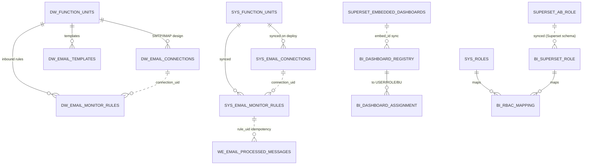

# Database Layer — Reverse-Engineering Analysis

Repo: `/Users/qiweige/Desktop/PROJECTXXXSUN/Workflow-Station---sun`
Schema single source of truth: `deploy/init-scripts/00-schema/` (snapshot-style, append-only; Flyway retired 2026-06, history archived in `docs/legacy-flyway-migrations/`).
All backends run `hibernate.ddl-auto: none` (Confirmed: `backend/*/src/main/resources/application.yml`), so the init scripts are authoritative. Flowable `ACT_*`/`FLW_*` tables are the one exception — created by the engine itself (`flowable.database-schema-update: true` in `backend/workflow-engine-core/src/main/resources/application-docker.yml:84`).

Status labels used throughout: **Confirmed** (read directly from cited file), **Inferred** (strongly implied by code/comments), **Unknown** (could not verify in this pass).

---

## 0. Execution model (how the schema gets built)

Evidence: `deploy/init-scripts/00-init-all.sh` (Docker entrypoint), `deploy/init-scripts/init-database.ps1` (Windows manual), `00-schema/00-init-all-schemas.sql` (manual psql, Docker paths), `00-schema/00-init-all-schemas-standalone.sql` (manual psql, relative paths).

Order in `00-init-all.sh` (Confirmed):
1. Create separate database `n8n_dev` (legacy N8N; platform has since migrated automation to Activepieces — the DB is still created every init).
2. Base schemas: `01-` (sys_), `02-` (wf_), `03-` (up_), `04-` (dw_), `05-` (admin_).
3. Incremental migrations `06-` … `54-` via per-number globs (`09-` intentionally reserved/unused per script comment; `14-` silently absent from both the folder and the glob list).
4. `01-admin/`: roles+virtual groups, admin user, developer permissions, role-table sync, admin permissions, e2e users+BUs, HASE org seed. (`07-fu-viewer-team-scope-migration.sql` exists in the folder but is **not** invoked by `00-init-all.sh` — Confirmed by reading the script; it is an idempotent manual/upgrade script.)
5. `99-maintenance/00-wipe-all-function-units.sql` — wipes FU catalogs + Flowable (`DROP` of all `act_*`/`flw_*`).
6. Seed packages: `15-platform-showcase`, `08-digital-lending-v2-en`, `16-meeting-participant-collection`, `17-Multi-Instance-Subtask-Demo`, `18-MCY`, `19-ATM`.
7. `90-post-seed/00-align-id-sequences.sql` — advances every `dw_*`/`rt_*` BIGSERIAL sequence past `MAX(id)` because seed packages insert explicit IDs (otherwise the first JPA `GenerationType.IDENTITY` insert collides; Confirmed in the script's header comment).

ID conventions (Confirmed, header of `04-developer-workstation-schema.sql`): `dw_*` = BIGSERIAL; `sys_*`, `bi_*` = VARCHAR(64) UUID-ish strings; dw→sys ID-type conversion happens in the application layer at deployment.

---

## 1. Full table inventory

### 1.1 `sys_*` — Platform security / shared catalog (33 tables)

Source: `00-schema/01-platform-security-schema.sql` unless noted. All Confirmed.

| Table | Purpose | PK | Important columns | FKs | Unique | Indexes (beyond PK) |
|---|---|---|---|---|---|---|
| `sys_users` | Unified user table for all services | `id` VARCHAR(64) | `username`, `password_hash`, `email`, `employee_id`, `entity_manager_id`, `function_manager_id`, `status` (CHECK ACTIVE/INACTIVE/DISABLED/LOCKED/PENDING), `must_change_password`, `failed_login_count`, `locked_until`, soft-delete trio (`deleted/deleted_at/deleted_by`), `lock_version` | — (`entity_manager_id`/`function_manager_id` are implicit self-refs, no FK) | `username` UNIQUE | username, email, status, employee_id, deleted |
| `sys_roles` | Role definitions; `type` CHECK ADMIN/DEVELOPER/BU_BOUNDED/BU_UNBOUNDED | `id` | `code`, `name`, `type`, `is_system`, `lock_version` (added `22-*.sql`) | — | `code` UNIQUE | code, type |
| `sys_business_units` | Org tree | `id` | `code`, `name`, `parent_id`, `level`, `path`, `status` CHECK ACTIVE/DISABLED, `cost_center`; TIMESTAMPTZ(6) audit cols | `parent_id` implicit self-ref (no FK constraint) | `code` UNIQUE | parent_id, code, status |
| `sys_user_roles` | User↔Role m:n | `id` | `user_id`, `role_id`, `valid_from/valid_to` | → sys_users, sys_roles (both CASCADE) | (user_id, role_id) | user, role |
| `sys_role_assignments` | Role → polymorphic target (user/dept/group) | `id` | `role_id`, `target_type`, `target_id`, validity window | → sys_roles CASCADE; `target_id` polymorphic (no FK) | (role_id, target_type, target_id) | role, (target_type,target_id), (valid_from,valid_to) |
| `sys_permissions` | Permission catalog | `id` | `code`, `resource`, `action`, `parent_id` (implicit self-ref) | — | `code` UNIQUE | parent_id |
| `sys_role_permissions` | Role↔Permission m:n | `id` | `condition_type`, `condition_value` JSONB, `granted_at/by` | → sys_roles, sys_permissions (CASCADE) | (role_id, permission_id) | — |
| `sys_login_audit` | Login/logout audit | `id` UUID (uuid_generate_v4) | `user_id`, `username`, `action`, `ip_address`, `login_platform` (added `51-add-login-platform-to-audit.sql`: ADMIN_CENTER/USER_PORTAL/DEVELOPER_WORKSTATION), `success`, `failure_reason` | `user_id` implicit → sys_users (no FK) | — | user, username, created_at |
| `sys_virtual_groups` | Virtual groups (`type` SYSTEM/CUSTOM) | `id` | `code`, `rule_expression`, `ad_group` (LDAP link), `status` | — | `code` UNIQUE | — |
| `sys_virtual_group_members` | Group membership | `id` | `group_id`, `user_id`, `added_by` | → sys_virtual_groups, sys_users (CASCADE) | (group_id, user_id) | — |
| `sys_virtual_group_roles` | Group→Role binding | `id` | — | → sys_virtual_groups, sys_roles (CASCADE) | (virtual_group_id, role_id) | vg, role |
| `sys_virtual_group_task_history` | Task assignment history per group (`action_type` CHECK CREATED..RETURNED) | `id` | `task_id` (implicit → Flowable task), `from/to/assigned_user_id`, `status`, TIMESTAMPTZ created | → sys_virtual_groups (group_id) | — | task, group, action, created |
| `sys_business_unit_roles` | BU→Role binding | `id` | — | → sys_business_units, sys_roles (CASCADE) | (business_unit_id, role_id) | bu, role |
| `sys_user_business_units` | User↔BU membership | `id` | — | → sys_users, sys_business_units (CASCADE) | (user_id, business_unit_id) | user, bu |
| `sys_user_business_unit_roles` | User×BU×Role ternary assignment | `id` | — | → sys_users, sys_business_units, sys_roles (CASCADE) | (user_id, business_unit_id, role_id) | user, bu, role |
| `sys_approvers` | Approver config per polymorphic target | `id` | `target_type`, `target_id`, `user_id` | → sys_users CASCADE; target polymorphic | (target_type, target_id, user_id) | target, user |
| `sys_permission_requests` | Permission requests (`request_type` CHECK VIRTUAL_GROUP/BUSINESS_UNIT/BUSINESS_UNIT_ROLE; `status` CHECK PENDING/APPROVED/REJECTED/CANCELLED) | `id` | `applicant_id`, `target_id`, `role_ids` TEXT (CSV/JSON — app-level), `approver_id` | → sys_users (applicant) | — | applicant, status, type, target |
| `sys_member_change_logs` | Membership change audit | `id` | `change_type`, `target_type/id`, `user_id`, `role_ids`, `operator_id` | — (all implicit) | — | target, user, change_type, created |
| `sys_user_preferences` | Key/value user prefs (admin-side; portal has its own) | `id` | `preference_key/value` | → sys_users CASCADE | (user_id, preference_key) | user, key |
| `sys_dictionaries` | Data dictionaries (`data_source_type` CHECK DATABASE/API/FILE/STATIC) | `id` | `code`, `type`, `cache_ttl`, `data_source_config`, `version` | — | `code` UNIQUE | code, type, status |
| `sys_dictionary_items` | Dictionary entries, i18n names (`name_en/zh_cn/zh_tw`), validity window, `ext_attributes` | `id` | `item_code`, `value`, `parent_id` (implicit self-ref) | → sys_dictionaries CASCADE | — | dict_id, (dict_id,item_code) |
| `sys_dictionary_versions` | Dictionary snapshots (`snapshot_data` TEXT) | `id` VARCHAR(36) | `version`, `change_description` | `dictionary_id` implicit (no FK) | (dictionary_id, version) | dict_id |
| `sys_dictionary_data_sources` | External dictionary source config | `id` VARCHAR(36) | `source_type`, `connection_string`, `table_name`, field mappings, `cache_ttl` | `dictionary_id` implicit (no FK) | — | dict_id |
| `sys_function_units` | **Deployed** FU catalog (runtime side of dw_function_units) | `id` | `code`, `name`, `version`, `status` CHECK DRAFT/VALIDATED/DEPLOYED/DEPRECATED/ARCHIVED (widened by `34-extend…`+`35-drop-init…`), `enabled`, `is_active`, `checksum`, `digital_signature`, `package_path/size`, `process_deployed`, `icon_svg`, `description` (renamed from display_name by `36-*.sql`), `previous_version_id` | self-FK `previous_version_id` (SET NULL) | partial UNIQUE `(code) WHERE enabled=true` (`11-*.sql`) | (name,version), (name,is_active), deployed_at |
| `sys_function_unit_deployments` | Deployment runs incl. rollback bookkeeping (cols added `06-*.sql`) | `id` | `environment`, `strategy`, `status`, `rollback_to_id`, `rollback_reason/by/at`, `deployment_log` | → sys_function_units | — | fu, status |
| `sys_function_unit_approvals` | Multi-level deployment approvals (`approval_order` added `10-*.sql`; `approver_id` made nullable) | `id` | `approval_type`, `approval_order`, `approver_id`, `status`, `comment` | → sys_function_unit_deployments | — | deployment |
| `sys_function_unit_dependencies` | FU dependency declarations | `id` | `dependency_code/version/type` | → sys_function_units | — | fu |
| `sys_function_unit_contents` | Deployed FU payloads (`content_type` CHECK PROCESS/FORM/DATA_TABLE/SCRIPT/ACTION/MAIN_TABLE_VIEW; CHECK re-widened in-place inside 01 script) | `id` | `content_name/path`, `content_data` TEXT (BPMN XML / form JSON / table schema JSON), `checksum`, `source_id` (implicit → dw source row), `flowable_deployment_id`, `flowable_process_definition_id` (implicit → Flowable) | → sys_function_units | — | fu |
| `sys_function_unit_access` | FU access grants (polymorphic target) | `id` | `access_type`, `target_type/id` | → sys_function_units | — | fu |
| `sys_developer_role_permissions` | Developer-workstation permission strings per role | `id` | `permission` VARCHAR(50) | → sys_roles CASCADE | (role_id, permission) | role |
| `sys_action_definitions` (`07-add-action-definitions-table.sql`) | Deployed action buttons (runtime copy of dw_action_definitions) | `id` | `action_name/type`, `config_json` JSONB, `icon`, `button_color`, `is_default`, `description` (renamed by `37-*.sql`) | `function_unit_id` implicit → sys_function_units (**no FK constraint**) | UNIQUE INDEX (function_unit_id, action_name) | fu, type |
| `sys_email_connections` (`46-*.sql`, extended `49-*.sql`) | SMTP/IMAP connections synced from DW on FU import/deploy; runtime credential lookup | `id` | `connection_type`, `host` (nullable after 49), `port`, `password_encrypted`, `from_email`, `use_tls`, `imap_*`, `direction` OUTBOUND default, `oauth_provider/…_encrypted tokens`, `mailbox_address` | → sys_function_units CASCADE | (function_unit_id, name) | fu |
| `sys_email_monitor_rules` (`49-*.sql`) | Inbound email monitor rules synced from DW | `id` | `rule` fields: `connection_uid` (implicit → sys_email_connections by uid), `process_definition_key`, `start_event_id`, `folder_label`, `filter_from/subject`, `action_type`, `extraction_rules` JSONB, `correlation` JSONB, `poll_interval_seconds`, `last_sync_cursor` | → sys_function_units CASCADE | (function_unit_id, name) | fu, enabled |

### 1.2 `wf_*` — Workflow-engine extension tables (6 tables)

Source: `00-schema/02-workflow-engine-schema.sql`, plus `24-add-multi-instance-execution-table.sql`. All Confirmed.

| Table | Purpose | PK | Important columns | FKs | Unique | Indexes |
|---|---|---|---|---|---|---|
| `wf_extended_task_info` | Multi-dimensional task assignment layered over Flowable tasks (USER / VIRTUAL_GROUP / DEPT_ROLE), delegation + claim tracking | `id` BIGSERIAL | `task_id` (implicit → ACT_RU_TASK), `process_instance_id`, `assignment_type/target`, `delegated_to/by`, `claimed_by`, `status`, `form_key`, `business_key`, `extended_properties` TEXT, `version`, `is_deleted` | none (all Flowable refs implicit) | `task_id` UNIQUE | 10 idx: task, assignment type/target, delegated_to, claimed_by, proc-inst, created, due, priority, status |
| `wf_process_variables` | Variable history/extended info (parallel to Flowable var tables) | `id` VARCHAR(64) | `name`, `type`, `text_value/text_value2/double/long/date/json_value JSONB/binary_value BYTEA`, `operation_type`, `change_reason` | none (proc/task ids implicit) | — | name, proc-inst, task, created |
| `wf_audit_logs` | Workflow operation audit (compliance) | `id` | `user_id`, `operation_type`, `resource_type/id`, `before_data/after_data/context_data` JSONB, `risk_level`, `is_sensitive` | none | — | 9 idx incl. composite (user, op, ts) |
| `wf_exception_records` | Workflow exception + retry tracking (severity/status CHECKs) | `id` | `exception_type/class/message`, `stack_trace`, `variables_snapshot`, `retry_count/max/next_retry_time`, `resolved*`, `alert_sent` | none | — | proc-inst, task, type, severity, status, occurred, resolved |
| `wf_ap_execution_record` | Activepieces sync-webhook execution log (`source_type` SERVICE_TASK/ACTION; status CHECK PENDING..TIMEOUT) | `id` BIGSERIAL | `ap_flow_id`, `webhook_url`, `input_data/output_data` JSONB, `timeout_seconds` default 120 | none | — | proc-inst, task, status, created |
| `wf_multi_instance_execution` (`24-*.sql`) | MI sub-process dispatch state per activity (sub-table driven) | `id` BIGSERIAL | `activity_id`, `sub_table_name/sub_table_id`, `collection_variable_name`, `execution_mode` PARALLEL/SEQUENTIAL, counts (total/completed/active/cancelled), `status` | none | — | proc-inst, status, activity, started |

> **Orphan alert (Confirmed):** `wf_multi_instance_execution` has **zero** references in backend Java main sources (`grep -rn "wf_multi\|MultiInstanceExecution" backend/*/src/main/java` → no hits beyond an unrelated `MultiInstanceCanceller` class that does not touch this table). Schema-only table; either future-facing or dead.

### 1.3 `up_*` — User Portal (13 tables)

Source: `00-schema/03-user-portal-schema.sql`, plus 13/19/54 migrations. All Confirmed.

| Table | Purpose | PK | Important columns | FKs | Unique | Indexes |
|---|---|---|---|---|---|---|
| `up_user_preference` | Theme/language/timezone/page-size prefs | `id` BIGSERIAL | `theme`, `theme_color` default `#DB0011`, `language`, `page_size` | none (user_id implicit) | `user_id` UNIQUE | user |
| `up_dashboard_layout` | Grid layout per user | BIGSERIAL | `component_id/type`, `grid_x/y/w/h`, `config` JSONB | none | (user_id, component_id) | user |
| `up_notification_preference` | Per-type channel toggles + quiet hours | BIGSERIAL | `notification_type`, `email/browser/in_app_enabled`, `quiet_start/end_time` | none | (user_id, notification_type) | user |
| `up_delegation_rule` | Task delegation rules | BIGSERIAL | `delegator_id`, `delegate_id`, `delegation_type`, `process_types` JSONB, `priority_filter` JSONB, window, `lock_version` (`17-*.sql`) | none | — | delegator, delegate, status |
| `up_permission_request` | Portal-side permission requests (role / VG / BU denormalized name columns), `submitted_by_user_id` added `29-*.sql` | BIGSERIAL | `request_type`, `permissions` JSONB, `role_id/name`, `virtual_group_id/name`, `business_unit_id/name`, `approver_id` | none | — | applicant, submitted_by, status |
| `up_favorite_process` | Starred process definitions | BIGSERIAL | `process_definition_key`, `display_order` | none | (user_id, process_definition_key) | user |
| `up_process_draft` | Saved-but-not-submitted form data | BIGSERIAL | `form_data` JSONB, `attachments` JSONB, `lock_version` | none | — | user, process_key |
| `up_delegation_audit` | Delegation op audit | BIGSERIAL | `operation_type/result/detail`, ip, ua | none | — | delegator, delegate, task, created |
| `up_process_instance` | **Portal mirror of process instances + JSON form data store** | `id` VARCHAR(64) | `process_definition_key/id/name`, `process_instance_id` (implicit → Flowable ACT_RU/HI), `business_key` (widened to 255 by `23-*.sql`), `initiator_id`, `start_user_id/name`, `title`, `status`, `priority`, **`variables` JSONB** + legacy `variables_json` TEXT, `current_node/assignee`, `candidate_users`, `function_unit_version_id` (`08-*.sql`), catalog pin trio `function_unit_catalog_id/code/version_label` (`27-*.sql`), `lock_version` | none — all cross-refs app-level | — | start_user, status, def_key, fu_version, fu_catalog, (fu_code,fu_ver) |
| `up_process_history` | Per-activity operation history | BIGSERIAL | `activity_id/name/type`, `operation_type`, `operator_id/name`, `comment`, `duration` | none | — | proc-inst |
| `up_notification` (`13-*.sql`) | In-app notifications | BIGSERIAL | `type`, `title`, `content`, `link`, `is_read` | none | — | user, created, (user,created DESC), (user,is_read) |
| `up_change_history` (`19-*.sql`) | Field-level change history for process/task forms, incl. sub-table rows (`sub_table_name`, `row_identifier`, `is_concurrent`) | BIGSERIAL | `process_instance_id`, `task_instance_id`, `stage_id`, `field_name`, `old/new_value`, `change_type` | none | — | process, task, (process,timestamp) |
| `up_record_note` (`54-*.sql`) | Rich-text comments + attachments (Dataverse-annotation-style single table); stream key = (target_type, target_id, table_id); `target_type` TABLE (target=process-instance id) or RECORD (target=sub-table row id); `table_kind` DW/RT selects the ID space of `table_id` | `id` VARCHAR(64) | `note_type` COMMENT/ATTACHMENT (shape CHECK), `parent_note_id` self-FK CASCADE, `subject`, `body_html/body_text`, `file_name/mime_type/file_size/file_content BYTEA`, `is_inline_image`, `is_deleted`, `lock_version` | self-FK only; table/FU refs app-level | — | partial (target_type,target_id,created DESC) WHERE is_deleted=FALSE; parent; fu |

### 1.4 `dw_*` — Developer Workstation designer metadata (32 tables) + `members`

Source: `00-schema/04-developer-workstation-schema.sql` plus 08/16/26/28/32/33/34/38/39/41/42/43/45/47/48/51/53 migrations. All Confirmed.

| Table | Purpose | PK | Important columns | FKs | Unique | Indexes |
|---|---|---|---|---|---|---|
| `dw_icons` | SVG icon library | BIGSERIAL | `name`, `category`, `svg_content` | — | `name` UNIQUE | name, category |
| `dw_function_units` | Designer FU catalog (status DRAFT/PUBLISHED/ARCHIVED — different lifecycle from sys) | BIGSERIAL | `code`, `name`, `version`, `current_version`, `is_active`, `enabled` (`12-*.sql`), `deployed_at`, `previous_version_id` self-FK, `tags` JSONB (`41-*.sql`), `lock_version` | icon → dw_icons (SET NULL); self-FK previous_version | `code` UNIQUE, `name` UNIQUE, partial `(code) WHERE enabled=true` | name, status, code, (name,version), (name,is_active), deployed_at, enabled |
| `dw_process_definitions` | BPMN XML per FU | BIGSERIAL | `bpmn_xml` TEXT, `function_unit_version_id` (`08-*.sql`, NOT NULL, FK) | → dw_function_units ×2 (CASCADE) | UNIQUE INDEX on `function_unit_id` (`53-*.sql`, one process per FU) | fu, version |
| `dw_table_definitions` | Logical business-table metadata (`table_type` CHECK MAIN/SUB/ACTION/RELATION) | BIGSERIAL | `table_name` (**globally UNIQUE** `uk_dw_table_name` — per-table PK sequences depend on global identity, comment cites Flyway V320 parity), `table_display_name`, `request_id_config` JSONB (`39-add-request-id-…`) | → dw_function_units CASCADE | table_name | fu |
| `dw_field_definitions` | Field metadata incl. FK/PK generation (`43-*.sql` backfill) | BIGSERIAL | `field_name`, `data_type`, `length/precision/scale`, `nullable`, `is_primary_key`, `is_unique`, `sort_order`, `is_foreign_key`, `ref_table_id`, `ref_primary_key_fields` JSONB, `pk_generation_json` JSONB, `fk_display_mode`, `relation_cardinality` | table → dw_table_definitions CASCADE; ref_table → dw_table_definitions SET NULL | (table_id, field_name) | table; partial (ref_table_id) WHERE is_foreign_key |
| `dw_foreign_keys` | Designer-declared FK edges between logical tables | BIGSERIAL | `on_delete/on_update` | 4 FKs → dw_table_definitions ×2, dw_field_definitions ×2 (CASCADE) | — | table |
| `dw_pk_sequences` | Counter store for generated business PKs (scope perTable etc.) | BIGSERIAL | `field_name`, `scope_type/key`, `prefix`, `pad_width`, `current_value` | none (table_id implicit) | (table_id, field_name, scope_type, scope_key) | table |
| `dw_form_definitions` | Form designs (`form_type` CHECK PROCESS/TASK/ACTION after `16-*.sql` rename), full layout in `config_json` JSONB, `field_permissions` JSONB + `show_live_values` (16), `lock_version` (18) | BIGSERIAL | `form_name`, `bound_table_id` | → dw_function_units CASCADE; bound_table → dw_table_definitions SET NULL | (function_unit_id, form_name) | fu |
| `dw_form_table_bindings` | Form↔table binding (`binding_type` PRIMARY/SUB/RELATED; `binding_mode` EDITABLE/READONLY) | BIGSERIAL | `table_id` (nullable since 21), `relation_table_id` (implicit → rt_table_definitions, `21-*.sql`), `foreign_key_field`, `binding_link_mode` structuralFk/customField (42), `sub_list_view_id`, `sub_mode` (32) | form → dw_form_definitions CASCADE; table → dw_table_definitions | — | form, table, sub_list_view; partial relation_table |
| `dw_action_definitions` | Designer action buttons (types incl. PROCESS_SUBMIT/APPROVE/REJECT/N8N_ACTION/FORM_POPUP/API_CALL per column comment) | BIGSERIAL | `config_json` JSONB, `icon`, `button_color`, `is_default` | → dw_function_units CASCADE | (function_unit_id, action_name) | fu |
| `dw_versions` | FU version snapshots (`snapshot_data` **BYTEA** — zipped full design) | BIGSERIAL | `version_number`, `change_log`, `published_by/at` | → dw_function_units CASCADE | (function_unit_id, version_number) | fu |
| `dw_uploaded_files` | DB-backed file storage (`content` BYTEA), `stored_name` = opaque URL token | BIGSERIAL | `original_name`, `content_type`, `file_size`, `lock_version` | — | `stored_name` UNIQUE | created_at DESC |
| `dw_operation_logs` | Designer operation audit | BIGSERIAL | `operator`, `operation_type`, `target_type/id`, `details` | — | — | operator, target, time |
| `dw_ai_sessions` | AI-generation sessions (phase REQUIREMENTS/DESIGN/GENERATION; mode NEW/MODIFY) | BIGSERIAL | `session_id` UUID UNIQUE, `user_id`, `current_phase`, `status` | → dw_function_units CASCADE | session_id | fu, user, (fu,user,status) |
| `dw_ai_messages` | Chat messages per session | BIGSERIAL | `role` USER/ASSISTANT, `content`, `phase` | → dw_ai_sessions(session_id) CASCADE | — | session, (session, created) |
| `dw_ai_documents` | Versioned AI requirement/design docs | BIGSERIAL | `document_type` REQUIREMENTS/DESIGN, `version`, `content` | → dw_function_units CASCADE | (fu, doc_type, version) | fu, (fu,type) |
| `dw_function_unit_access` | FU access grants, designer side (polymorphic target) | BIGSERIAL | `access_type`, `target_type/id` | → dw_function_units CASCADE | — | fu |
| `dw_decision_definitions` (16) | DMN decisions | BIGSERIAL | `decision_key/name`, `dmn_xml`, `hit_policy` | → dw_function_units CASCADE | (fu, decision_key) | fu |
| `dw_table_relations` (16) | Declared relations (ONE_TO_ONE/ONE_TO_MANY/MANY_TO_MANY) between logical tables | BIGSERIAL | `source/target_field_name` | fu + source/target → dw_table_definitions (CASCADE) | — | fu, source, target |
| `dw_form_stage_bindings` (16, +`read_only` in 18) | Form ↔ BPMN stage (task node) binding | BIGSERIAL | `stage_id` (implicit → BPMN element id), `stage_name`, `read_only` | form → dw_form_definitions CASCADE | (form_id, stage_id) | stage_id |
| `dw_deployment_jobs` (26) | Async deploy-to-admin-center job state | `id` VARCHAR(36) | `target_admin_url`, `status`, `progress`, `steps_json`, `version_number` | → dw_function_units CASCADE | — | (fu, started DESC) |
| `dw_function_unit_dev_groups` (28) | FU ↔ development team (virtual group) scope | BIGSERIAL | `virtual_group_id` (implicit → sys_virtual_groups) | → dw_function_units CASCADE | (fu, virtual_group_id) | fu, vg |
| `dw_sub_table_view_configs` (33) | Sub-table list-view config per binding | BIGSERIAL | — | → dw_form_table_bindings CASCADE (added with orphan cleanup) | binding_id UNIQUE INDEX | — |
| `dw_sub_table_view_fields` (33) | Columns of a sub-table view | BIGSERIAL | `field_name`, `display_label`, `column_width`, `sort_order`, `visible` | → dw_sub_table_view_configs CASCADE | — | config, (config,sort) |
| `dw_link_form_components` (34) | Curated Link Form widget definitions (FU-scoped; negative componentIds are GENERIC, positive reference rows here — table comment) | BIGSERIAL | `component_name`, `linked_form_id` (implicit → dw_form_definitions), `display_field`, `link_text`, `config_json` JSONB | none (fu implicit) | — | fu, (fu,sort) |
| `dw_link_form_data` (34) | Runtime per-row Link Form data (JSONB `form_data`), keyed component_id + sub_table_row_id | BIGSERIAL | — | none | — | (component,row), row |
| `dw_main_table_view_configs` (38, +`restrict_to_involved_users` in 51) | Main-table View designs (default per table, sort/filter JSONB) | BIGSERIAL | `view_name`, `is_default`, `sort_config/filter_config` JSONB, `status`, `restrict_to_involved_users` | → dw_function_units, dw_table_definitions (CASCADE) | partial UNIQUE (main_table_id) WHERE is_default | fu, table |
| `dw_main_table_view_fields` (38) | Columns of a main-table view (`is_system_field`) | BIGSERIAL | field cols as sub-table views | → dw_main_table_view_configs CASCADE | — | (config, sort) |
| `dw_main_table_view_access` (51) | Per-view BU/Role visibility (`target_type` CHECK ROLE/BUSINESS_UNIT) | BIGSERIAL | `target_id` (implicit → sys_roles / sys_business_units) | → dw_main_table_view_configs CASCADE | UNIQUE INDEX (view, target_type, target_id) | view |
| `dw_email_connections` (45, +48) | Design-time SMTP/IMAP + OAuth inbound connections per FU | BIGSERIAL | `connection_uid` UNIQUE (portable id used cross-env), `direction`, `password_encrypted`, `oauth_*`, `imap_*` | → dw_function_units CASCADE | connection_uid; (fu, name) | fu, uid |
| `dw_email_templates` (47) | Email templates (HTML + placeholders) | BIGSERIAL | `subject`, `body_html` | → dw_function_units CASCADE | (fu, name) | fu |
| `dw_email_monitor_rules` (48) | Inbound email → start-process rules (extraction_rules/correlation JSONB) | BIGSERIAL | `rule_uid` UNIQUE, `connection_uid` (implicit), `process_definition_key`, `target_form_id/binding_id`, `poll_interval_seconds` | → dw_function_units CASCADE | rule_uid; (fu, name) | fu, uid |
| `members` (20 — **unprefixed name**) | DW member directory, explicitly separate from sys_users | BIGSERIAL | `username` UNIQUE, `email`, `business_unit_id/name` (denormalized), `role`, `active` | none | username | email, active |

### 1.5 `rt_*` — Relation Tables (admin-managed shared reference tables, 10 tables)

Source: `00-schema/21-add-rt-relation-tables.sql`, `52-add-rt-lookup-config.sql`. All Confirmed.

| Table | Purpose | PK | Important columns | FKs | Unique | Indexes |
|---|---|---|---|---|---|---|
| `rt_table_definitions` | Relation Table metadata + lifecycle (DRAFT/DEPLOYED/ROLLBACK), `portal_visible`, `current_version`, `deployed_display_name` | BIGSERIAL | — | — | `table_name` UNIQUE | — |
| `rt_field_definitions` | RT field metadata; `lookup_config` JSONB (`52-*.sql`: refTableId, searchFields, displayFields, derivedFrom joins…) | BIGSERIAL | same shape as dw_field_definitions minus relation_cardinality | table → rt_table_definitions; ref_table → rt_table_definitions SET NULL | — | table |
| `rt_pk_sequences` | PK counter store (parity with admin Flyway V207) | BIGSERIAL | scope/prefix/pad/current_value | none | (table_id, field_name, scope_type, scope_key) | table |
| `rt_table_versions` | Deploy-time snapshots (`snapshot_data` TEXT) | BIGSERIAL | `version_number`, `deployed_by/at`, `change_log` | → rt_table_definitions | — | table |
| `rt_table_access` | Role-based access (READONLY / READ_WRITE) | `id` VARCHAR(64) | `target_type` ('ROLE'), `target_id`, `permission_level` | → rt_table_definitions | — | table, target |
| `rt_audit_logs` | RT row-change audit (ADD/UPDATE/DELETE/STATUS_CHANGE) | VARCHAR(64) | `row_id`, `old/new_value`, `operator_id` | none (table_id implicit) | — | table, action, operator, time |
| `rt_table_data_rows` | **JSON row store** — one row per logical RT row, `data` JSONB | BIGSERIAL | `row_id` VARCHAR(100), `data` JSONB, `status` | → rt_table_definitions CASCADE | (table_id, row_id) | table, (table,status), **pg_trgm GIN on `(data::text)`** for ILIKE search, (table_id,id) keyset pagination |
| `rt_view_configs` | View config for RELATED bindings (`binding_id` implicit → dw_form_table_bindings.id per column comment) | BIGSERIAL | `field_config` TEXT (JSON) | none | — | binding, table |
| `rt_view_fields` | Field rows of an RT view | BIGSERIAL | display/width/sort/visible | → rt_view_configs CASCADE | — | config |
| `rt_lookup_configs` | Lookup component config for form-create (`search_fields` JSON) | BIGSERIAL | `form_id` (implicit → dw_form_definitions), `component_id`, `display_field` | view_config → rt_view_configs | — | form, (form,component) |

### 1.6 `admin_*` — Admin Center (14 tables)

Source: `00-schema/05-admin-center-schema.sql`. All Confirmed.

| Table | Purpose | PK | Important columns | FKs | Unique | Indexes |
|---|---|---|---|---|---|---|
| `admin_password_history` | Password reuse policy history | VARCHAR(64) | `password_hash` | → sys_users | — | user, created |
| `admin_permission_delegations` | Permission delegation (TEMPORARY/PROXY/TRANSFER) | VARCHAR(64) | `delegator/delegatee_id`, `conditions` JSONB, `valid_from/to`, revoke trio, `permission_id` (implicit → sys_permissions, no FK) | → sys_users ×2 | — | delegator, delegatee, status |
| `admin_permission_conflicts` | Conflict tracking + resolution strategy CHECK (DENY/ALLOW/HIGHEST…/MANUAL) | VARCHAR(64) | `conflict_source1/2`, `user_id`, `permission_id` (implicit) | — | — | user, status |
| `admin_permission_change_history` | Permission change audit | VARCHAR(36) | `change_type`, `target_user/role/permission_id`, old/new | — | — | target_user, change_type, changed_at |
| `admin_alert_rules` | Metric alert rules | VARCHAR(36) | `metric_name`, `operator`, `threshold`, `notify_channels` | — | — | name, enabled |
| `admin_alerts` | Fired alerts (ack/resolve workflow) | VARCHAR(36) | `severity`, `status`, `metric_value` | → admin_alert_rules | — | status, severity |
| `admin_system_configs` | System config KV (typed, encrypted flag, per-env) | VARCHAR(36) | `category`, `config_key`, `config_value`, `version` | — | `config_key` UNIQUE | category, key |
| `admin_system_logs` | Request/system logs | VARCHAR(36) | log level/module/action, request/response bodies, timing | — | — | type, level, ts, user |
| `admin_security_policies` | Security policies (one per `policy_type`) | VARCHAR(36) | `policy_config` TEXT | — | policy_type UNIQUE | — |
| `admin_data_permission_rules` | Row-scope rules (data_scope, custom_filter) | VARCHAR(36) | `permission_type`, target poly, `resource_type`, `priority` | — | — | type, target |
| `admin_column_permissions` | Column visibility/masking per rule | VARCHAR(36) | `column_name`, `visible`, `masked`, `mask_type/expression` | → admin_data_permission_rules | — | rule |
| `admin_audit_logs` | Admin action audit (in-place `ADD COLUMN IF NOT EXISTS` backfills for duration/method/path inside base script — snapshot-style exception) | VARCHAR(36) | action, resource, user, old/new value, success, duration_ms | — | — | action, user, ts |
| `admin_config_history` | Config change history | VARCHAR(36) | old/new value+version, reason | `config_id` implicit → admin_system_configs | — | key, time |
| `admin_log_retention_policies` | Retention/archival per log type | VARCHAR(36) | `retention_days`, `archive_*`, `compression_enabled` | — | log_type UNIQUE | — |

### 1.7 `bi_*` + `superset` — BI (4 tables + 1 schema)

Source: `00-schema/15-bi-management-schema.sql`, `40-superset-schema.sql`. All Confirmed.

| Table | Purpose | PK | Important columns | FKs | Unique |
|---|---|---|---|---|---|
| `bi_dashboard_registry` | Local registry of Superset dashboards (sync target) | VARCHAR(64) | `embed_id` UUID (from Superset `embedded_dashboards`), `superset_dashboard_uuid`, `superset_dashboard_id`, `tags`, `is_default_landing`, `status` ACTIVE/AUTO_INACTIVE/MANUAL_INACTIVE, `last_synced_at` | — | superset uuid & id each UNIQUE |
| `bi_dashboard_assignment` | Dashboard → USER/ROLE/BUSINESS_UNIT assignment; layout SINGLE/MULTI/WIDGET | VARCHAR(64) | `target_type/id`, `display_order`, `is_default` | → bi_dashboard_registry | (dashboard, target_type, target_id) |
| `bi_superset_role` | Superset roles synced from Superset `ab_role` | SERIAL | `superset_role_id`, `name`, `status`, `last_synced_at` | — | superset_role_id UNIQUE |
| `bi_rbac_mapping` | sys_roles ↔ Superset roles m:n | VARCHAR(64) | — | → sys_roles, → bi_superset_role(superset_role_id) | (sys_role_id, superset_role_id) |
| `superset` schema | Empty schema; **all tables inside are owned/migrated by Superset CLI** (`superset db upgrade` / `superset init`) — Confirmed comment in `40-superset-schema.sql` | — | — | — | — |

### 1.8 `ac_*`, `we_*` — LDAP audit & inbound email (2 tables)

| Table | Source | Purpose | PK | Notes |
|---|---|---|---|---|
| `ac_ldap_sync_audit` | `39-ac-ldap-sync-audit.sql` **and** duplicate `44-ac-ldap-sync-audit.sql` | LDAP/Hermes-AD sync run audit + incremental high-water mark (`snapshot_at`, `high_water_mark`) | VARCHAR(64) | 44 is a consolidated re-issue of 39 (columns inline instead of DO-block); both idempotent. Indexes: (sync_type,status,started DESC), (started DESC). JPA entity `backend/admin-center/.../ldap/LdapSyncAudit.java` (note: lives outside `entity/` dir). |
| `we_email_processed_messages` | `50-we-email-inbound.sql` | Idempotency ledger for inbound email → process start; one row per (rule_uid, message_id); status STARTED/REVIEW/FAILED | BIGSERIAL | UNIQUE(rule_uid, message_id); idx rule, status. Engine has no Flyway/ddl — init-scripts authoritative (script comment). |

### 1.9 Flowable `ACT_*` / `FLW_*` — engine-managed (Confirmed, not in init DDL)

- Created at engine startup: `flowable.database-schema-update: true` (`application-docker.yml:84`); `00-init-all.sh` comment says the same.
- Init scripts only patch them **if present**: `30-widen-flowable-identitylink-columns.sql` (act_ru/hi_identitylink → VARCHAR(4000) because long virtual-group ids overflowed 255), `31-widen-flowable-act-hi-comment-columns.sql` (message_→TEXT, full_msg_→bytea; also mirrored at runtime by `FlowableActHiCommentSchemaRepair` per script comment).
- `99-maintenance/01-repair-flowable-schema.sql` drops all `act_*`/`flw_*` so the engine can recreate them (fixes `act_ge_property` NPE after TRUNCATE).
- Table list itself is Flowable-standard (ACT_RU_TASK, ACT_RU_EXECUTION, ACT_HI_*, ACT_RE_*, ACT_GE_*…): **Inferred** (standard Flowable 7; not enumerated anywhere in repo DDL).

### 1.10 Other databases

- `n8n_dev` — separate PostgreSQL database created by `00-init-all.sh` step 0 for the (now retired) N8N integration; contents managed by N8N itself. Status: Confirmed creation, likely vestigial (AI generation has migrated to Activepieces per `wf_ap_execution_record` design and repo memory).

---

## 2. Relationships

### Explicit FK constraints (Confirmed, from DDL above)

- Security core: `sys_user_roles`, `sys_role_assignments`, `sys_role_permissions`, `sys_virtual_group_members/roles`, `sys_business_unit_roles`, `sys_user_business_units`, `sys_user_business_unit_roles`, `sys_approvers`, `sys_permission_requests` → `sys_users` / `sys_roles` / `sys_business_units` / `sys_virtual_groups` / `sys_permissions`.
- FU deployed catalog: `sys_function_unit_{deployments,approvals,dependencies,contents,access}` chain under `sys_function_units`; `sys_function_units.previous_version_id` self-FK; `sys_email_connections` / `sys_email_monitor_rules` → `sys_function_units` (CASCADE).
- Designer graph: everything under `dw_function_units` (process/table/field/foreign_keys/form/binding/action/version/ai_*/decision/relations/dev_groups/deployment_jobs/email_*), `dw_field_definitions.ref_table_id`, `dw_form_table_bindings→dw_form_definitions/dw_table_definitions`, `dw_sub_table_view_*` and `dw_main_table_view_*` chains, `dw_main_table_view_access` → view configs.
- RT graph: `rt_field_definitions`, `rt_table_versions`, `rt_table_access`, `rt_table_data_rows` → `rt_table_definitions`; `rt_view_fields` → `rt_view_configs`; `rt_lookup_configs.view_config_id` → `rt_view_configs`.
- Admin: `admin_password_history`/`admin_permission_delegations` → `sys_users`; `admin_alerts` → `admin_alert_rules`; `admin_column_permissions` → `admin_data_permission_rules`.
- BI: `bi_dashboard_assignment` → `bi_dashboard_registry`; `bi_rbac_mapping` → `sys_roles` + `bi_superset_role`.
- Notes: `up_record_note.parent_note_id` self-FK.

### Implicit / application-level joins (Confirmed absence of FK in DDL; join semantics from column comments & code)

| From | To | Semantics |
|---|---|---|
| `up_process_instance.process_instance_id` | Flowable `ACT_RU_EXECUTION`/`ACT_HI_PROCINST` | portal mirror of engine instance |
| `up_process_instance.function_unit_catalog_id/code/version_label` | `sys_function_units` | catalog version pinning (27) |
| `up_process_instance.function_unit_version_id` | `dw_function_units.id` (BIGINT) | version pin (08) — crosses dw/sys ID spaces |
| `wf_extended_task_info.task_id` | `ACT_RU_TASK.ID_` | task extension |
| `wf_*.process_instance_id`, `up_process_history`, `up_change_history`, `up_delegation_audit.task_id` | Flowable ids | history/audit joins |
| `sys_function_unit_contents.source_id` | dw source row id | dw→sys deployment lineage |
| `sys_function_unit_contents.flowable_deployment_id / flowable_process_definition_id` | Flowable ACT_RE_* | deployment link |
| `sys_action_definitions.function_unit_id` | `sys_function_units` | **no FK constraint** (unlike the other sys_fu children) |
| `sys_email_monitor_rules.connection_uid` / `dw_email_monitor_rules.connection_uid` | `*_email_connections.connection_uid` | portable UID join |
| `dw_form_table_bindings.relation_table_id` | `rt_table_definitions.id` | RELATED binding |
| `rt_view_configs.binding_id` | `dw_form_table_bindings.id` | per column comment |
| `rt_lookup_configs.form_id` | `dw_form_definitions.id` | lookup widget owner |
| `dw_function_unit_dev_groups.virtual_group_id` | `sys_virtual_groups.id` | team scoping |
| `dw_main_table_view_access.target_id` | `sys_roles` / `sys_business_units` (by target_type) | view visibility |
| `dw_link_form_components.function_unit_id`, `.linked_form_id` | dw_function_units / dw_form_definitions | no FK |
| `dw_link_form_data.sub_table_row_id` | sub-table row id inside `__subTables__` JSON | JSON-space reference |
| `up_record_note.table_id` (+`table_kind`) | `dw_table_definitions` or `rt_table_definitions` | dual ID-space discriminated ref |
| `up_record_note.target_id` | process-instance id or sub-table row id (by target_type) | polymorphic |
| `members.business_unit_id` | `sys_business_units` | denormalized copy |
| `bi_dashboard_assignment.target_id` | sys_users / sys_roles / sys_business_units | polymorphic |
| `sys_virtual_group_task_history.task_id` | Flowable task | audit |
| `admin_permission_delegations.permission_id`, `admin_permission_conflicts.permission_id` | `sys_permissions` | no FK |
| `admin_config_history.config_id` | `admin_system_configs` | no FK |
| `sys_dictionary_versions.dictionary_id`, `sys_dictionary_data_sources.dictionary_id` | `sys_dictionaries` | no FK (VARCHAR(36) vs 64 mismatch too) |
| `up_*` user columns, `wf_*` user columns, `rt_*` operator columns | `sys_users` | app-level |
| `dw_versions.snapshot_data` | whole design graph | serialized snapshot, not relational |

**Unknown:** whether `up_process_instance.process_definition_key` values always match Flowable `KEY_` (naming suggests yes; not verified against engine code in this pass). Whether `sys_function_units.code` ties to `dw_function_units.code` 1:1 at deploy (Inferred yes from wipe script treating both as "developer + deployed catalog" pair, `99-maintenance/00-wipe-all-function-units.sql`).

---

## 3. JSON-row storage design (no physical per-form tables)

**Rule (Confirmed):** `.cursor/rules/json-row-storage-no-physical-tables.mdc` — "Relation Table / Table Design 行数据仅用 JSON 存储，禁止为每张业务表创建物理表". Designer-defined "tables" are logical models only; deploying an FU or an RT never executes `CREATE TABLE`.

Two JSON containers:

1. **Relation Tables → `rt_table_data_rows`** (Confirmed, `21-add-rt-relation-tables.sql` §5b): one row per logical row — `table_id` + `row_id` + `data JSONB` (field name → value) + `status`. Search uses a `pg_trgm` GIN index over `(data::text)` because column names are user-defined and can't be indexed individually; `(table_id,id)` supports keyset pagination. Accessed via **JdbcTemplate raw SQL** (no JPA entity): `backend/admin-center/.../service/impl/RelationTableDataServiceImpl.java`, `backend/user-portal/.../service/PortalRelationTableServiceImpl.java`, plus deploy path `RelationTableDeployServiceImpl.java` (metadata + `rt_table_versions` snapshot only, no DDL). Legacy physical tables from the old deploy path are cleaned by `99-maintenance/03-drop-relation-table-legacy-physical-tables.sql`.

2. **FU form/business data → process-variable JSON on `up_process_instance`** (Confirmed): main-form fields and the recursive sub-table payload live in `up_process_instance.variables` JSONB (plus legacy `variables_json` TEXT) under keys including `__subTables__`. Evidence:
   - `backend/user-portal/src/main/java/com/portal/entity/ProcessInstance.java:67-86` (`variables` mapped `columnDefinition="jsonb"`).
   - `__subTables__` handled across ~10 portal components (`ProcessComponent`, `TaskFormComponent`, `SubTableEnrichmentComponent`, `MiSubTableVariableSupport`, …) and `platform-common/.../jdbc/SubTableRowKeySupport.java`.
   - `backend/user-portal/.../component/SubTablePhysicalMetadataCache.java` javadoc: "Business tables are JSON-row stored (no physical table) per json-row-storage rule, so most lookups are stable 'absent' results" — the physical-table probe exists only for legacy remnants and is memoized.
   - Change tracking of those JSON rows goes to `up_change_history` (`sub_table_name`, `row_identifier`).
   - Seed packages insert **metadata + JSON row data only** (mandated by the rule's checklist).
   - Historical residue: `25-add-row-version-to-sub-tables.sql` still iterates `dw_table_definitions WHERE table_type='SUB'` and ALTERs physical tables **if they exist** — a pre-JSON-era migration kept for append-only compliance; on fresh DBs it is a no-op.

Structure metadata for both worlds lives in `dw_table_definitions`/`dw_field_definitions` (FU) and `rt_table_definitions`/`rt_field_definitions` (RT); generated business PKs come from counter tables `dw_pk_sequences`/`rt_pk_sequences` via `platform-common/.../fk/JdbcPrimaryKeyAllocationService.java` (raw JDBC).

---

## 4. Mermaid ER diagrams

### 4.1 Identity & access (sys_)

```mermaid
erDiagram
    SYS_USERS ||--o{ SYS_USER_ROLES : has
    SYS_ROLES ||--o{ SYS_USER_ROLES : grants
    SYS_ROLES ||--o{ SYS_ROLE_PERMISSIONS : maps
    SYS_PERMISSIONS ||--o{ SYS_ROLE_PERMISSIONS : in
    SYS_ROLES ||--o{ SYS_ROLE_ASSIGNMENTS : "to polymorphic target"
    SYS_USERS ||--o{ SYS_USER_BUSINESS_UNITS : member
    SYS_BUSINESS_UNITS ||--o{ SYS_USER_BUSINESS_UNITS : contains
    SYS_USERS ||--o{ SYS_USER_BUSINESS_UNIT_ROLES : "role in BU"
    SYS_BUSINESS_UNITS ||--o{ SYS_USER_BUSINESS_UNIT_ROLES : scopes
    SYS_ROLES ||--o{ SYS_USER_BUSINESS_UNIT_ROLES : grants
    SYS_BUSINESS_UNITS ||--o{ SYS_BUSINESS_UNIT_ROLES : binds
    SYS_ROLES ||--o{ SYS_BUSINESS_UNIT_ROLES : bound
    SYS_VIRTUAL_GROUPS ||--o{ SYS_VIRTUAL_GROUP_MEMBERS : member
    SYS_USERS ||--o{ SYS_VIRTUAL_GROUP_MEMBERS : joins
    SYS_VIRTUAL_GROUPS ||--o{ SYS_VIRTUAL_GROUP_ROLES : binds
    SYS_ROLES ||--o{ SYS_VIRTUAL_GROUP_ROLES : bound
    SYS_VIRTUAL_GROUPS ||--o{ SYS_VIRTUAL_GROUP_TASK_HISTORY : "task audit"
    SYS_USERS ||--o{ SYS_APPROVERS : approves
    SYS_USERS ||--o{ SYS_PERMISSION_REQUESTS : applies
    SYS_ROLES ||--o{ SYS_DEVELOPER_ROLE_PERMISSIONS : "dev perms"
    SYS_USERS ||--o{ ADMIN_PASSWORD_HISTORY : history
    SYS_USERS ||--o{ ADMIN_PERMISSION_DELEGATIONS : delegates
    SYS_DICTIONARIES ||--o{ SYS_DICTIONARY_ITEMS : contains
```

### 4.2 Function-unit design & deployment (dw_ → sys_)

```mermaid
erDiagram
    DW_FUNCTION_UNITS ||--o| DW_PROCESS_DEFINITIONS : "1 BPMN"
    DW_FUNCTION_UNITS ||--o{ DW_TABLE_DEFINITIONS : "logical tables"
    DW_TABLE_DEFINITIONS ||--o{ DW_FIELD_DEFINITIONS : fields
    DW_TABLE_DEFINITIONS ||--o{ DW_FOREIGN_KEYS : "fk edges"
    DW_FUNCTION_UNITS ||--o{ DW_TABLE_RELATIONS : relations
    DW_FUNCTION_UNITS ||--o{ DW_FORM_DEFINITIONS : forms
    DW_FORM_DEFINITIONS ||--o{ DW_FORM_TABLE_BINDINGS : binds
    DW_TABLE_DEFINITIONS ||--o{ DW_FORM_TABLE_BINDINGS : bound
    DW_FORM_DEFINITIONS ||--o{ DW_FORM_STAGE_BINDINGS : "BPMN stage"
    DW_FORM_TABLE_BINDINGS ||--o| DW_SUB_TABLE_VIEW_CONFIGS : "sub view"
    DW_SUB_TABLE_VIEW_CONFIGS ||--o{ DW_SUB_TABLE_VIEW_FIELDS : columns
    DW_FUNCTION_UNITS ||--o{ DW_MAIN_TABLE_VIEW_CONFIGS : views
    DW_MAIN_TABLE_VIEW_CONFIGS ||--o{ DW_MAIN_TABLE_VIEW_FIELDS : columns
    DW_MAIN_TABLE_VIEW_CONFIGS ||--o{ DW_MAIN_TABLE_VIEW_ACCESS : "BU/Role"
    DW_FUNCTION_UNITS ||--o{ DW_ACTION_DEFINITIONS : actions
    DW_FUNCTION_UNITS ||--o{ DW_DECISION_DEFINITIONS : DMN
    DW_FUNCTION_UNITS ||--o{ DW_VERSIONS : snapshots
    DW_FUNCTION_UNITS ||--o{ DW_DEPLOYMENT_JOBS : "async deploy"
    DW_FUNCTION_UNITS ||--o{ DW_FUNCTION_UNIT_DEV_GROUPS : "team scope"
    DW_FUNCTION_UNITS ||--o{ DW_AI_SESSIONS : "AI gen"
    DW_AI_SESSIONS ||--o{ DW_AI_MESSAGES : chat
    DW_FUNCTION_UNITS ||--o{ DW_AI_DOCUMENTS : docs
    DW_ICONS ||--o{ DW_FUNCTION_UNITS : icon
    SYS_FUNCTION_UNITS ||--o{ SYS_FUNCTION_UNIT_CONTENTS : payloads
    SYS_FUNCTION_UNITS ||--o{ SYS_FUNCTION_UNIT_DEPLOYMENTS : deploys
    SYS_FUNCTION_UNIT_DEPLOYMENTS ||--o{ SYS_FUNCTION_UNIT_APPROVALS : approvals
    SYS_FUNCTION_UNITS ||--o{ SYS_FUNCTION_UNIT_DEPENDENCIES : deps
    SYS_FUNCTION_UNITS ||--o{ SYS_FUNCTION_UNIT_ACCESS : access
    SYS_FUNCTION_UNITS ||--o{ SYS_ACTION_DEFINITIONS : "actions (no FK)"
    DW_FUNCTION_UNITS ||..o{ SYS_FUNCTION_UNITS : "deployed as (app-level)"
```

### 4.3 Runtime: process instances, tasks, JSON rows, notes, notifications

```mermaid
erDiagram
    UP_PROCESS_INSTANCE ||..|| FLOWABLE_ACT_PROCINST : "mirrors (app-level)"
    FLOWABLE_ACT_RU_TASK ||..o| WF_EXTENDED_TASK_INFO : "extends (app-level)"
    UP_PROCESS_INSTANCE ||--o{ UP_PROCESS_HISTORY : "ops (app-level)"
    UP_PROCESS_INSTANCE ||--o{ UP_CHANGE_HISTORY : "field diffs (app-level)"
    UP_PROCESS_INSTANCE ||..o{ WF_MULTI_INSTANCE_EXECUTION : "MI state (orphan table)"
    UP_PROCESS_INSTANCE ||..o{ WF_AP_EXECUTION_RECORD : "AP calls (app-level)"
    UP_PROCESS_INSTANCE ||..o{ UP_RECORD_NOTE : "TABLE-stream notes"
    UP_RECORD_NOTE ||--o{ UP_RECORD_NOTE : attachments
    UP_PROCESS_INSTANCE {
        varchar id PK
        jsonb variables "form data + __subTables__"
        varchar function_unit_catalog_id "pin -> sys_function_units"
        bigint function_unit_version_id "pin -> dw_function_units"
    }
    RT_TABLE_DEFINITIONS ||--o{ RT_FIELD_DEFINITIONS : fields
    RT_TABLE_DEFINITIONS ||--o{ RT_TABLE_DATA_ROWS : "JSON rows"
    RT_TABLE_DEFINITIONS ||--o{ RT_TABLE_VERSIONS : snapshots
    RT_TABLE_DEFINITIONS ||--o{ RT_TABLE_ACCESS : "role access"
    RT_TABLE_DATA_ROWS {
        bigint table_id FK
        varchar row_id
        jsonb data "field->value"
    }
    UP_NOTIFICATION }o..|| SYS_USERS : "user_id (app-level)"
    UP_DELEGATION_RULE }o..|| SYS_USERS : "delegator/delegate"
    UP_PROCESS_DRAFT }o..|| SYS_USERS : owner
```

### 4.4 Email & BI

---

## 5. JPA entities vs raw-SQL-only tables

Method (Confirmed): enumerated every `@Table(name=…)` in `backend/*/src/main/java/**/entity/` plus `admin-center/.../ldap/LdapSyncAudit.java`; grepped for JdbcTemplate usage of the remainder.

**Tables WITH JPA entities (module → table):**
- platform-security: sys_users, sys_roles, sys_business_units, sys_user_roles, sys_role_assignments, sys_permissions, sys_role_permissions, sys_login_audit, sys_virtual_groups, sys_virtual_group_members, sys_virtual_group_roles, sys_business_unit_roles, sys_user_business_units, sys_user_business_unit_roles.
- admin-center: all 14 `admin_*`; sys_approvers, sys_permission_requests, sys_member_change_logs, sys_user_preferences, sys_virtual_group_task_history, sys_developer_role_permissions, sys_dictionaries + items + versions + data_sources, sys_function_units + deployments + approvals + dependencies + contents + access, sys_action_definitions, sys_email_connections, sys_email_monitor_rules; rt_table_definitions, rt_field_definitions, rt_table_versions, rt_table_access, rt_audit_logs; bi_dashboard_registry, bi_dashboard_assignment, bi_superset_role, bi_rbac_mapping; ac_ldap_sync_audit.
- developer-workstation: all 32 `dw_*` designer tables (incl. dw_main_table_view_access via multi-line `@Table`), `members`, rt_lookup_configs, rt_view_configs (`RelationViewConfig`), rt_view_fields, plus **duplicate mappings** of sys_users (`com.developer.entity.User`) and up_process_instance (`com.developer.entity.ProcessInstance`).
- user-portal: up_user_preference, up_dashboard_layout, up_notification_preference, up_delegation_rule, up_permission_request, up_favorite_process, up_process_draft, up_delegation_audit, up_process_instance, up_process_history, up_notification, up_change_history, up_record_note; sys_action_definitions (second mapping).
- workflow-engine-core: wf_extended_task_info, wf_process_variables, wf_audit_logs, wf_exception_records, wf_ap_execution_record, we_email_processed_messages, sys_email_connections + sys_email_monitor_rules (read-side duplicate mappings).

**Tables with NO JPA entity (raw SQL / JdbcTemplate / external only):**
| Table | Access evidence |
|---|---|
| `rt_table_data_rows` | JdbcTemplate: `admin-center/.../RelationTableDataServiceImpl.java`, `RelationTableDeployServiceImpl.java`, `user-portal/.../PortalRelationTableServiceImpl.java`, `developer-workstation/.../ProcessDebugProbeRunner.java` (Confirmed) |
| `dw_pk_sequences`, `rt_pk_sequences` | raw JDBC: `platform-common/.../fk/JdbcPrimaryKeyAllocationService.java`, `admin-center/.../RelationTablePrimaryKeyAllocationService.java`, portal PK enrichers (Confirmed) |
| `wf_multi_instance_execution` | **no Java references at all** — orphan (Confirmed by grep) |
| Flowable `ACT_*`/`FLW_*` | Flowable engine MyBatis, not JPA (Confirmed config) |
| `superset` schema tables | Superset (Python/Alembic) (Confirmed comment in 40) |
| `n8n_dev` DB | external N8N (Confirmed creation only) |

Cross-module duplicate mappings worth flagging: `up_process_instance` is mapped by **two different entities** (user-portal + developer-workstation), `sys_users` by two (platform-security + developer-workstation), `sys_action_definitions` by two (admin-center + user-portal), `sys_email_connections`/`sys_email_monitor_rules` by two (admin-center + workflow-engine-core). Schema drift between these twins is only caught at runtime (Confirmed mappings; risk assessment Inferred).

---

## 6. Migration hygiene observations

1. **Duplicate numbers (Confirmed):** `18-add-lock-version-to-form-definitions.sql` + `18-add-read-only-to-form-stage-bindings.sql`; `34-dw-link-form-components.sql` + `34-extend-function-unit-status-check.sql`; `39-ac-ldap-sync-audit.sql` + `39-add-request-id-config-to-table-definitions.sql`; `51-add-login-platform-to-audit.sql` + `51-dw-main-table-view-access.sql`. Glob `NN-*.sql` runs both in **alphabetical** order — harmless today (all pairs independent), but numbering no longer encodes a total order.
2. **Near-duplicate content (Confirmed):** `44-ac-ldap-sync-audit.sql` re-creates the same `ac_ldap_sync_audit` as `39-ac-ldap-sync-audit.sql` (39 uses DO-block column adds, 44 inlines the columns). Idempotent so safe, but two "sources of truth" for one table.
3. **Missing numbers (Confirmed):** `09-` reserved intentionally (comment in `00-init-all.sh`); `14-` simply absent — the shell glob list skips from `13-*` to `15-*`, so a future `14-*.sql` would silently never run under the manual `00-init-all-schemas.sql` and would run under `00-init-all.sh` only if added to the glob list (it is not).
4. **Aggregate files lag the folder (Confirmed):** both `00-init-all-schemas.sql` and `00-init-all-schemas-standalone.sql` end at `51-dw-main-table-view-access.sql` — they omit `51-add-login-platform-to-audit.sql`, `52-add-rt-lookup-config.sql`, `53-dw-process-definitions-fu-unique.sql`, `54-up-record-notes.sql`. Anyone initializing manually via these files gets a schema missing 4 migrations (`sys_login_audit.login_platform` is tolerated because the base 01 script already contains the column — snapshot-style; but 52/54 tables/columns would be absent for pre-existing DB upgrades). Docker path (`00-init-all.sh`) is complete.
5. **Append-only convention (Confirmed):** `.cursor/rules/init-scripts-append-only.mdc` + `deploy/CLAUDE.md` mandate never editing existing `.sql`, always new incremented files. However the convention is **snapshot-hybrid**: base scripts 01–05 are retroactively edited to fold in later columns (e.g. `lock_version` in 01, `binding_link_mode` in 04, in-place `ALTER`s inside 01/05 like `chk_content_type` re-add and `admin_audit_logs ADD COLUMN IF NOT EXISTS`). Fresh installs read the snapshot; existing DBs rely on the numbered backfills (32/42/43 explicitly exist only to catch DBs initialized before base-DDL edits). This dual mechanism works but every base-DDL edit must remember its paired backfill script — the 42/43 comments show this has bitten before.
6. **No migration ledger:** with Flyway gone there is no `schema_version` table; idempotency is per-script (`IF NOT EXISTS` everywhere). Re-running is safe (Confirmed style), but there is no record of what ran, and non-idempotent statements would go unnoticed (e.g. `23-widen-up-process-instance-business-key.sql` runs an unconditional `ALTER COLUMN TYPE` — idempotent by effect, but pattern is fragile).
7. **SELECT statements inside migrations (Confirmed):** `11-` and `12-` contain bare verification `SELECT`s whose results nobody reads in the Docker path — noise, not risk.
8. **Cross-ID-space FKs impossible:** dw (BIGSERIAL) vs sys (VARCHAR) means the dw→sys deployment lineage can never be FK-enforced; integrity rests on app code (`sys_function_unit_contents.source_id`, `up_process_instance.function_unit_version_id`). Confirmed design note in 04 header.
9. **Wipe script maintenance risk (Confirmed):** `99-maintenance/00-wipe-all-function-units.sql` TRUNCATEs an explicit table list; any new runtime table (e.g. `up_record_note`, added later) must be manually added or wipes leave orphans. `up_record_note` is **not** in the wipe list (checked §1 of the script) — process-instance-scoped notes survive an FU wipe as orphans. (Also applies to `we_email_processed_messages` — Unknown whether intentional.)
10. **`members` table breaks the prefix convention** (no `dw_` prefix) — collision-prone in a shared-schema DB (Confirmed DDL, risk Inferred).
11. **Legacy N8N database still provisioned** every init (`n8n_dev`) although automation moved to Activepieces (Confirmed script; retirement status from repo memory — Inferred).
12. **`25-add-row-version-to-sub-tables.sql` predates the JSON-row rule** and dynamically ALTERs physical sub-tables if they exist — contradicts the no-physical-tables rule but is a no-op on clean DBs (Confirmed).

---

## 7. Summary of counts

| Prefix | Tables | DDL source | JPA coverage |
|---|---|---|---|
| sys_ | 33 | 01, 07, 46, 49 + alters | full (split across platform-security / admin-center; some dual-mapped) |
| wf_ | 6 | 02, 24 | 5 of 6 (`wf_multi_instance_execution` orphan) |
| up_ | 13 | 03, 13, 19, 54 + alters | full |
| dw_ | 32 | 04 + 16/26/28/32/33/34/38/45/47/48/51 | full |
| rt_ | 10 | 21, 52 | 9 of 10 (`rt_table_data_rows` raw SQL by design) |
| admin_ | 14 | 05 | full |
| bi_ | 4 | 15 | full |
| ac_ / we_ / members | 3 | 39+44 / 50 / 20 | full |
| act_/flw_ (Flowable) | ~60 (standard) | engine-managed | none (MyBatis) |
| superset schema | Superset-managed | 40 (schema only) | none |

Total platform-owned tables: **115** (excluding Flowable and Superset).
