# Workflow Station — Deployment & Infrastructure X-Ray

Repo: `/Users/qiweige/Desktop/PROJECTXXXSUN/Workflow-Station---sun` (branch `common_0701_timeline`, snapshot 2026-07-18)

Legend: ✅ present/solid · ⚠️ partial/risky · ❌ missing

---

## 1. Topology (Mermaid deployment diagram)

```mermaid
flowchart TB
    subgraph EXT["Internet / Corp network"]
        BROWSER["Browser (staff)"]
        EXTSYS["External systems (webhook callers)"]
        LDAP["Corp LDAPS aa-lds-prod.hk.hsbc:3269"]
        DSP["DSP SSO cmb-staff-dsp-uat.hk.hsbc:8443"]
        PG["Corp PostgreSQL (external, e.g. hkl25243602:25011)"]
    end

    subgraph MESH["K8s namespace (Istio mesh, ns=__NAMESPACE__)"]
        subgraph IGW["istio ingressgateway"]
            GW1["workflow-platform-ingress-gateway<br/>__INGRESS_HOST__ :80/:443 TLS SIMPLE"]
            GW2["per-service Gateways :80 HTTP only<br/>kong.* n8n.* activepieces.* superset-embed.* superset-author.*<br/>redis.* :6379 TCP kafka.* :9092 TCP"]
        end

        KONG["kong (Deployment, 1 replica)<br/>kong:3.7 DB-less<br/>:8000 proxy /:8001 admin/:8100 status"]

        subgraph FE["Frontends (nginx:alpine, :80, 1 replica each)"]
            LOGINFE["platform-login-frontend /login"]
            ADMINFE["admin-center-frontend /admin"]
            PORTALFE["user-portal-frontend /portal"]
            DWFE["developer-workstation-frontend /dev (DEV-only)"]
        end

        subgraph BE["Backends (Spring Boot, :8080)"]
            AC["admin-center x1"]
            UP["user-portal x2 + HPA(2..2) + PDB"]
            WE["workflow-engine-core x1 (Flowable)"]
            DW["developer-workstation x1 (DEV-only)"]
        end

        subgraph INFRA["Infra in-cluster"]
            REDIS["redis 7.2 x1 (PVC 2Gi, requirepass)"]
            KAFKA["kafka 3.6.2 KRaft x1 (PVC 5Gi, PLAINTEXT)"]
        end

        subgraph AUTO["Automation / BI"]
            N8N["n8n 1.89.2 x1 (:5678, emptyDir)"]
            AP["activepieces 0.84.0 x1 (:80, emptyDir,<br/>PIECES_SYNC_MODE=NONE)"]
            SUP["superset 6.0.0 x1 (:8088, svc :80)"]
            SUPPROXY["superset-author-proxy (nginx)<br/>auth_request -> admin-center"]
        end
        APJOB["Job ap-bootstrap-shared-account (non-prod)"]
    end

    BROWSER -->|"https://INGRESS_HOST /login /admin /portal /dev"| GW1
    GW1 --> LOGINFE & ADMINFE & PORTALFE & DWFE
    GW1 -->|"/api, /api/*"| KONG
    EXTSYS -->|"activepieces.BASE_DOMAIN /api/v1/webhooks only"| GW2 --> AP
    GW2 -->|"superset embed host (X-Remote-* stripped)"| SUP
    GW2 -->|"superset author host"| SUPPROXY -->|"auth_request /internal/bi/superset/authorize"| AC
    SUPPROXY -->|"inject validated X-Remote-*"| SUP
    GW2 -->|"AP bridge host /__ap/bridge /__ap/token"| AC
    GW2 -->|"AP bridge host /*"| AP

    KONG -->|"/api/v1/admin -> :8080"| AC
    KONG -->|"/api/v1 + /api/v1/ai-generation SSE 300s -> :8080"| DW
    KONG -->|"/api/portal + /api/portal/ws (WS 86400s) -> :8080"| UP
    KONG -->|"/api/workflow -> :8080"| WE
    KONG -->|"rate-limit counters db5"| REDIS

    AC & UP & WE & DW -->|"jdbc :5432/:25011"| PG
    AC & UP & WE & DW -->|":6379 auth"| REDIS
    AC & UP & WE -->|"kafka-service:29092"| KAFKA
    AC -->|"ACTIVEPIECES_INTERNAL_URL http://activepieces-service:80"| AP
    DW -->|"AI_GENERATION_WEBHOOK_URL http://activepieces-service:80/api/v1/webhooks/{flowId}/sync"| AP
    AC -->|"SUPERSET_HOST guest-token mint"| SUP
    N8N -->|"schema n8n"| PG
    AP -->|"shared platform DB + Redis"| PG & REDIS
    SUP -->|"schema superset"| PG
    AC -->|"ldaps bind + sync cron"| LDAP
    AC -->|"token translate"| DSP
    APJOB -->|"sign-up shared account"| AP

    UP <-->|"WORKFLOW_ENGINE_URL http://workflow-engine-service:8080"| WE
    WE -->|"ADMIN_CENTER_URL / USER_PORTAL_URL"| AC & UP
    DW -->|"WORKFLOW_ENGINE_URL deploy BPMN"| WE
```

**Service DNS/port pattern** (`config_map/*/configmap-workflow-platform-config.yml`): every inter-service URL is `http://<svc>-service.__NAMESPACE__:8080` (backends), `kong-service:8000`, `redis-service:6379`, `kafka-service:29092` (internal listener), `n8n-service:5678`, `activepieces-service:80`, `hase-hermes-workflow-superset:80→8088`. Dev compose mirrors it with compose hostnames (`http://kong:8000`, `kafka:29092`, `activepieces:80`, `superset-final:8088`).

---

## 2. K8s manifests per service (`deploy/k8s/`)

All Deployments: `imagePullSecrets: nexus3`, registry `nexus3.hk.hsbc:18080/hsbc-238092-cmbhase-bisp/workflow-station2/<name>:__IMAGE_TAG__`, Istio sidecar injected (proxy 50m/200m CPU, 400Mi mem), `holdApplicationUntilProxyStarts`, per-app `Sidecar` egress limited to `./*` + `istio-system/*`, `DestinationRule` subset v1, `VirtualService` `retries: attempts 0`, timeout 30s (AP 120s). Placeholders `__NAMESPACE__ __IMAGE_TAG__ __BASE_DOMAIN__ __INGRESS_HOST__` rendered by `deploy/k8s/ps1/*.ps1`.

| Service | File | Image | Port | Replicas | Requests / Limits | Probes | Notes |
|---|---|---|---|---|---|---|---|
| admin-center | `admin-center.yaml` | `admin-center:__IMAGE_TAG__` | 8080 | 1 | 512Mi/500m → 1Gi/1000m | ✅ startup+live `/api/v1/admin/health/live`, ready `/health/ready` | envFrom ConfigMap+Secret; probes-enabled env vars |
| developer-workstation | `developer-workstation.yaml` | `developer-workstation:...` | 8080 | 1 | 512Mi/500m → 1Gi/1000m | ✅ live `/api/v1/health/live`, ready | DEV-only; runAsNonRoot 10001; excluded from default deploy set |
| user-portal | `user-portal.yaml` | `user-portal:...` | 8080 | **2** | 512Mi/500m → 1Gi/1000m | ✅ live `/api/portal/health/live`, ready | HPA min=2 **max=2** (capped by Postgres max_connections math, documented in-file), PDB minAvailable=1 |
| workflow-engine | `workflow-engine.yaml` | `workflow-engine-core:...` | 8080 | 1 | 512Mi/500m → 1Gi/1000m | ✅ live `/health/live`, ready `/health/ready` | Flowable engine; single instance |
| 4 frontends | `*-frontend.yaml` | nginx-based `:...-frontend` | 80 | 1 each | 128Mi/100m → 256Mi/200m (login 64Mi/50m → 128Mi/100m) | ✅ HTTP `/admin/` `/portal/` `/dev/` `/login/` | `KONG_PROXY_URL` from ConfigMap → runtime `config.js`; admin-fe also `AP_BRIDGE_URL` (optional); login-fe gets `VITE_DSP_*` incl. `VITE_DSP_CLIENT_SECRET` from Secret |
| kong | `kong.yaml` | `kong:3.7` (pinned, not tag-templated) | 8000/8001/8100 | 1 | 256Mi/250m → 1Gi/500m | ✅ exec `kong health` startup/live/ready | DB-less; template+entrypoint mounted from ConfigMap `kong-declarative-config`; admin :8001 in Service (ClusterIP) |
| redis | `redis.yaml` | `redis:7.2` | 6379 | 1 | 128Mi/100m → 256Mi/500m | ✅ exec redis-cli ping | PVC 2Gi `pwx-standard`; requirepass from Secret; ⚠️ also exposed via Istio TCP Gateway `workflow-station-redis.__BASE_DOMAIN__:6379` |
| kafka | `kafka.yaml` | `kafka:3.6.2` KRaft | 9092/29092 | 1 | 512Mi/250m → 1Gi/1000m | ✅ tcpSocket 29092 | PVC 5Gi; RF=1; PLAINTEXT, no auth; ⚠️ Istio TCP Gateway `...-kafka.__BASE_DOMAIN__:9092` |
| n8n | `n8n.yaml` | `n8n:1.89.2` | 5678 | 1 | 512Mi/250m → 1Gi/1000m | ✅ `/healthz` | DB = shared platform PG schema `n8n`; ⚠️ `/home/node/.n8n` = **emptyDir**; DOUBAO creds from Secret; UI exposed at `n8n.__BASE_DOMAIN__` (no platform auth in front) |
| activepieces | `activepieces.yaml` | `activepieces:0.84.0` | 80 | 1 | 512Mi/250m → 1Gi/1000m | ✅ `/api/v1/flags` | Prod = runtime-only: VirtualService matches **only `/api/v1/webhooks`** (UI 404s). Offline policy: `AP_PIECES_SYNC_MODE=NONE` (note: 0.84 has no `AP_PIECES_SOURCE` var — the once-configured `AP_PIECES_SOURCE=DB` was never read and has been removed), `AP_TELEMETRY_ENABLED=false`, `NPM_CONFIG_REGISTRY` fail-closed `.invalid` default. `AP_WEBHOOK_TIMEOUT_SECONDS=300`; ⚠️ data dir emptyDir |
| ap-gateway (non-prod) | `ap-gateway.yaml` | (routing only) | — | — | — | — | Host `hermes-workflow-activepieces.*`: `/__ap/bridge`,`/__ap/token` → admin-center (nonce-based cross-domain SSO, 方案 B), rest → AP. Excluded by default; `-IncludeApBridgeGateway` |
| ap-bootstrap-job | `ap-bootstrap-job.yaml` | reuses AP image | — | Job | 128Mi/50m → 512Mi/500m | — | AP provisioning, all idempotent. initContainers run in order: `ap-bootstrap` (sign-in probe → sign-up → `POST /v1/platforms`, giving platform + default project) then `ap-provision-db` (stamps project `externalId`, applies the piece seed from the `ap-pieces-seed` ConfigMap, publishes Redis `piece-registry-invalidation`). Main container `ap-verify` is read-only and fails the Job with per-gap remediation if any of the four provisioning items is missing. Node scripts are injected at render time from `deploy/scripts/` (no pasted copies); signing-key remains manual. Sidecar injection off; ttl 3600s |
| superset | `workflow-station-superset.yaml` | `superset:6.0.0` | 8088 (svc :80) | 1 | 2000Mi/600m → 3600Mi/1000m | ❌ **no liveness/readiness probes** | Config from ConfigMap `superset_config.py`. Two hosts: embed host (strips inbound `x-remote-*`) and author host → nginx `superset-author-proxy` (auth_request → admin-center, injects X-Remote-*). `AuthorizationPolicy` DENY any `x-remote-user` not from proxy SA (needs mTLS) |
| superset-author-proxy | (same file) | `superset-author-proxy:__IMAGE_TAG__` (nginx) | 8080 (svc :80) | 1 | 64Mi/50m → 128Mi/200m | ✅ `/healthz` | Own ServiceAccount; envsubst pinned to `INGRESS_HOST`,`POD_NAMESPACE` |
| ingress gateway | `workflow-platform-ingress-gateway.yaml` | — | 80/443 | — | — | — | Single shared host `__INGRESS_HOST__`; 443 TLS `mode: SIMPLE`, `credentialName: __INGRESS_TLS_SECRET__`. Path routing: `/login /admin /portal /dev` → frontends, `/api` → kong |

**kustomization.yaml** lists: ingress-gateway, redis, kafka, n8n, activepieces, superset, workflow-engine, admin-center, user-portal, kong, 3 frontends. ❗ Excludes developer-workstation(+frontend), ap-gateway, ap-bootstrap-job — consistent with "DW/AP-UI are dev/non-prod-only".

### ConfigMap / Secret (`deploy/k8s/config_map/`, `deploy/k8s/secret/`)
- Environments present: `preprod/` (default; actually labeled "sit" inside) and `uat/`. Injected wholesale via `envFrom` into all backends + superset.
- `config_map/<env>/configmap-workflow-platform-config.yml` — ~120 keys (see §4 table). UAT adds LDAP/DSP real endpoints, `JWT_VALIDATE_ISSUER`, SSRF allowlist, AP bridge keys, Superset SSO keys.
- `config_map/preprod/kong-declarative-config.yml` — Kong template + entrypoint (k8s copy of `deploy/kong/`).
- `config_map/preprod/superset-config.yml` — full `superset_config.py` (guest token, CORS, CSP frame-ancestors, fail-closed SECRET_KEY).
- `secret/<env>/secret-workflow-p{a,l}atform.yml` — tracked YAML Secrets. UAT = `CHANGE_ME_UAT_*` placeholders **except `DSP_CLIENT_SECRET`/`VITE_DSP_CLIENT_SECRET: "hermes@123"`** (see §8). Preprod = committed working dev-grade values (see §8). `secret/note.md`: real secrets live on an SMB share (`\\hbap.adroot.hsbc\...\hermes2.0\secret`) and are copy-pasted in — no vault/sealed-secrets.
- Note the filename typo `secret-workflow-paltform.yml` (preprod) vs `secret-workflow-platform.yml` (uat) — scripts handle per-env dirs, but it's fragile.

---

## 3. Docker layer

### Dockerfiles
| File | Base | Pattern |
|---|---|---|
| `backend/{admin-center,user-portal,developer-workstation,workflow-engine-core}/Dockerfile` | `eclipse-temurin:17-jre` (ARG `JAVA_BASE_IMAGE`) | 2-stage **layertools explode** of pre-built fat JAR (`COPY target/*.jar`) — Maven runs on host, not in Docker. Non-root `platform` user, `JAVA_OPTS` G1GC, Docker `HEALTHCHECK` → actuator health. DW adds entrypoint script + fixed UID 10001 |
| `frontend/*/Dockerfile.local` (used by compose + k8s build script) | `nginx:alpine` | Copies pre-built `dist/` (host `npm run build`); nginx.conf as template + `docker-entrypoint.sh` (envsubst `KONG_PROXY_URL`, runtime `config.js`). CRLF→LF fixups baked in |
| `frontend/*/Dockerfile` | node:22-alpine build + nginx | Full multi-stage (exists but **not** the sanctioned path — deploy/CLAUDE.md mandates Dockerfile.local) |
| `deploy/superset/Dockerfile` | `apache/superset:6.0.0` | + psycopg2, custom `superset_config.py` + `superset_security_manager.py` (REMOTE_USER SSO). SECRET_KEY deliberately not baked |
| `deploy/superset/author-proxy/Dockerfile` | nginx:alpine | JWT-gating author proxy for k8s |
| `activepieces/Dockerfile` | `node:24.14.0-bullseye-slim` (override with `--build-arg NODE_IMAGE`) | Builds the vendored, EE-removed, de-bunned AP 0.84.0 from source; bakes a pnpm offline store for ARCHIVE piece installs; last layer pre-installs the allowlisted pieces (`activepieces/hermes/pieces.json`) so the runtime installer never hits a registry (offline/IKP policy). Metadata half seeded separately via `deploy/pieces/metadata/pieces-seed.sql` |

### docker-compose (dev only): `deploy/environments/dev/docker-compose.dev.yml` (686 lines)
Services: postgres:16.5-alpine (mounts `deploy/init-scripts` as initdb.d), redis:7.2, cp-kafka:7.5.3 KRaft, n8n (latest), activepieces (custom pieces image, **no host port** — only via edge :8085 bridge), superset-final (**no host port** — only via edge `/bi`), 4 Spring backends (build from module Dockerfiles), kong:3.9 (template entrypoint), 4 frontends (Dockerfile.local), `edge-frontend` nginx (single-origin :3000 multi-path + :8085 AP gateway). Dev-only extras: `WORKFLOW_TEST_USERS=admin:admin123,user:user123` (fail-closed default in prod), local LDAP mock defaults, `docker-compose.email-override.yml`, `docker-compose.local.example.yml` overlay (LOCAL-OVERLAY.md).

### Edge nginx (`deploy/environments/dev/nginx-edge.conf`)
Single origin `:3000`: `/api/→kong`, `/login/ /admin/ /portal/ /dev/`→frontend containers, `/n8n/`→n8n, `/bi/`→superset with **`/bi/login/` gated by `auth_request /_superset_authz`** (→ admin-center `/api/v1/admin/internal/bi/superset/authorize`, bypassing Kong) which injects trusted `X-Remote-*`; all other `/bi/*` paths strip client-forged `X-Remote-*` (guest-token embed). `:8085` server = AP login bridge. This is the dev twin of the k8s superset-author-proxy + AuthorizationPolicy design (single-FQDN `/bi` model; old :8087/:8089 retired).

### Environments `deploy/environments/{dev,sit,uat,prod}`
| | dev | sit | uat | prod |
|---|---|---|---|---|
| Runs on | Docker Desktop compose | company K8s | company K8s | company K8s |
| File role | live compose env (tracked, contains real dev secrets — §8) | reference for ConfigMap/Secret | reference (real LDAP/DSP endpoints, CHANGE_ME secrets) | reference (CHANGE_ME) |
| JWT exp / refresh | 86400000/604800000 | same | 43200000/259200000 | 28800000/86400000 |
| Swagger | true | true | false | false |
| Flowable schema-update | (docker profile true) | true | false | false |
| Password min len / max attempts / session | – | 8/5/30 | 10/3/30 | 12/3/15 |
| Hikari pool | – | 15 | 20 | 50 |
| Log level | INFO | INFO | INFO | WARN root / ERROR sql |
| Extras | full LDAP/DSP/AP/Superset/n8n dev config, edge ports | LDAP PPD groups | LDAP UAT groups, DSP UAT | none (no AP/Superset section yet ⚠️) |
| dev-only | `.image-versions.env`, `build-and-deploy.ps1`, `prepull-images.ps1`, `verify-ldap.ps1`, nginx-edge.conf, email/local compose overlays | | k8s `config_map/uat` + `secret/uat` pair | |

### Build/deploy pipeline
- `deploy/scripts/build.ps1`, `build-and-push-k8s.ps1` (225 lines): host `mvn -T 1C -pl <modules> -am package` + host `npm run build`, then parallel `docker build` (backend with `JAVA_BASE_IMAGE` arg; frontends via Dockerfile.local with node_modules staleness check) and `docker push` to the nexus3 registry. `mirror-thirdparty-images-k8s.ps1` mirrors kong/redis/kafka/n8n/ap/superset into nexus3.
- `deploy/scripts/deploy.ps1` (297 lines) + `deploy/k8s/ps1/apply-workflow-station-all.ps1`: render/apply order **ConfigMap → Secret → Istio manifests**, params `-Namespace -ImageTag -Environment(-preprod default) -BaseDomain -IngressHost -IngressTlsSecret -ImageRepositoryPrefix -IncludeDeveloperWorkstation -IncludeApBridgeGateway -InitializeDatabase -IncludeDemoData -RenderOnly`. No GitOps; imperative PowerShell + kubectl.
- CI: only for AP flows — `deploy/ci/Jenkinsfile.ap-flows-publish` (manual, per-env AP creds from Jenkins credentials, imports `deploy/ap-flows/*.json` via `ap-import.js`, prints new flowIds to backfill BPMN `ap:flowId` + configmap `__AI_GEN_FLOW_ID__`) and `Jenkinsfile.ap-flows-export`. ❌ No CI pipeline for building/deploying the platform images themselves (PowerShell-driven).

### CONFIG_SYNC convention (`deploy/CONFIG_SYNC.md`)
Docker compose (dev) and K8s (sit/uat/prod) must use the **same env var names**. New var = 5 steps: ① `${ENV:default}` in `application.yml` ② dev `.env` + compose `environment:` ③ same key in `config_map/<env>/...` (non-sensitive) or `secret/<env>/...` (sensitive) ④ BUILD_GUIDE §12 doc ⑤ volumes/ports stay Docker-only. Enforced as an agent rule (`.cursor/rules/docker-k8s-config-sync.mdc`). Backends consume via `envFrom` so Deployment yamls rarely change. Schema source of truth = `deploy/init-scripts/00-schema/` (Flyway retired 2026-06; `SPRING_FLYWAY_ENABLED: "false"`), init SQL append-only.

---

## 4. Environment variables — inventory & consumers

Root `.env` — **not git-tracked** (ignored via `.gitignore:140 *.env`; verified `git ls-files`); `.env.example` is tracked and placeholder-only ✅. But `deploy/environments/{dev,sit,uat,prod}/.env` **are tracked** (re-included), and dev's has real values (§8).

Consumers determined by grepping `${VAR}` in `backend/*/src/main/resources/application*.yml` (AC=admin-center, UP=user-portal, WE=workflow-engine-core, DW=developer-workstation; FE=frontends at runtime/build):

| Var group | Vars (representative) | Consumers |
|---|---|---|
| Datasource | `SPRING_DATASOURCE_URL/USERNAME/PASSWORD`, `POSTGRES_*` (compose interpolation) | AC UP WE DW |
| Redis | `SPRING_REDIS_HOST/PORT/PASSWORD`, `SPRING_DATA_REDIS_*` (uat cm), `SPRING_REDIS_SSL_ENABLED` | AC UP WE DW, kong (rate-limit), AP (`ACTIVEPIECES_REDIS_*`) |
| Kafka | `SPRING_KAFKA_BOOTSTRAP_SERVERS` | AC UP WE (platform-messaging) |
| JWT/crypto | `JWT_SECRET`, `APP_SECURITY_JWT_SECRET_KEY`, `JWT_EXPIRATION(_MS)`, `JWT_REFRESH_EXPIRATION(_MS)`, `JWT_ISSUER`, `JWT_VALIDATE_ISSUER`, `JWT_COOKIE_DOMAIN`, `ENCRYPTION_SECRET_KEY` | all 4 backends (platform-security), kong entrypoint (JWT_SECRET optional/unused) |
| Service URLs | `ADMIN_CENTER_URL`, `WORKFLOW_ENGINE_URL`, `USER_PORTAL_URL`, `DEVELOPER_WORKSTATION_URL`, `*_BACKEND_URL`, `API_GATEWAY_URL`, `KONG_PROXY_URL` | cross-service REST clients; `KONG_PROXY_URL` → frontend nginx proxy target |
| SSO/login | `SSO_INTERNAL_TOKEN`, `SSO_REDIRECT_{ADMIN,PORTAL,DW}_(HTTP_)PREFIX`, `SSO_CODE_TTL_SECONDS`, `SSO_CLIENT_DEVELOPER_ENABLED`, `SSO_DEVELOPER_EXCHANGE_ENABLED` | AC (issuer) + UP DW (redeem); login FE |
| LDAP | `LDAP_ENABLED/PROVIDER_URL/BASE_DN/BIND_DN/BIND_PASSWORD/TLS/ALLOW_INSECURE/CONNECT_TIMEOUT_MS/READ_TIMEOUT_MS/PAGE_SIZE/MAX_ENTRIES/USER_SEARCH_FILTER/SYNC_ENABLED/SYNC_CRON/KEYSTORE_PATH/KEYSTORE_PASSWORD/ATTR_*`, `LDAP_HERMES_*`, `LDAP_GROUP_*` | AC only |
| DSP SSO | `DSP_SSO_ENABLED/AUTHENTICATE_URL/TRANSLATOR_URL/MANIFEST_LOCATIONS/CLIENT_ID/CLIENT_SECRET/ACCEPT_API_VERSION/AM_TOKEN_NAME/E2E_HEADER_NAME/INPUT_TOKEN_TYPE/OUTPUT_TOKEN_TYPE/ACCEPT_GATEWAY_E2E_TOKEN/EMPLOYEE_ID_CLAIMS/USERNAME_CLAIMS` | AC; `VITE_DSP_*` (incl `VITE_DSP_CLIENT_SECRET` — ships to the browser ⚠️) → login FE |
| n8n | `N8N_DB_*`, `N8N_ENCRYPTION_KEY`, `N8N_WEBHOOK_URL`, `N8N_PORT`, `N8N_RUNNERS_ENABLED`, `N8N_DIAGNOSTICS_ENABLED`, `N8N_{RESTRICT_ENVIRONMENT_VARIABLES_ACCESS,BLOCK_ENV_ACCESS_IN_NODE,ENFORCE_SETTINGS_FILE_PERMISSIONS}`, `N8N_DOUBAO_*`, `N8N_SERVICE_URL` | n8n pod; WE (n8n action calls) |
| Activepieces | `ACTIVEPIECES_POSTGRES_*`, `ACTIVEPIECES_REDIS_*`, `ACTIVEPIECES_ENCRYPTION_KEY`, `ACTIVEPIECES_JWT_SECRET`, `ACTIVEPIECES_FRONTEND_URL/WEBHOOK_URL/INTERNAL_URL/BRIDGE_ENABLED/SHARED_EMAIL/SHARED_PASSWORD/NPM_REGISTRY`, `AP_BRIDGE_URL`, `AI_GENERATION_WEBHOOK_URL`, `AI_GENERATION_TIMEOUT`, `ACTIVEPIECES_WEBHOOK_BASE_URL` | AP pod; AC (bridge/launch); DW (AI generation); admin FE (launcher) |
| Superset/BI | `SUPERSET_SECRET_KEY`, `SUPERSET_HOST`, `SUPERSET_PUBLIC_HOST`, `SUPERSET_DB_SCHEMA`, `SUPERSET_CORS_ORIGINS`, `SUPERSET_APP_ROOT` (dev), `SUPERSET_LOGOUT_REDIRECT_URL`, `APP_SECURITY_LOGOUT_REDIRECT_TARGET`, `BI_SUPERSET_USERNAME/PASSWORD`, `SUPERSET_CONFIG_PATH` | superset pod; AC (guest tokens, authorize endpoint) |
| Security/ops | `SECURITY_PASSWORD_MIN_LENGTH`, `SECURITY_LOGIN_MAX_FAILED_ATTEMPTS`, `SECURITY_SESSION_TIMEOUT_MINUTES`, `USER_RESET_PASSWORD`, `ADMIN_DEV_BYPASS_ROLE_CHECK`, `WORKFLOW_TEST_USERS(_ENABLED)`, `SSRF_ALLOWED_HOSTS` (DW), `PORTAL_INTERNAL_API_TOKEN` (UP↔WE), `CORS_ALLOWED_ORIGINS`, `SWAGGER_ENABLED` | AC UP WE DW as noted |
| Logging/cache | `LOG_LEVEL(_ROOT/_PLATFORM/_SQL)`, `CACHE_{USER,PERMISSION,DICTIONARY}_TTL_MINUTES` | all backends |
| Workflow tunables | `WORKFLOW_*` (~25 flags: retries, circuit breaker, caching, page sizes, callback base URL) | UP/WE workflow client config |
| Misc | `SERVER_PORT`, `SPRING_PROFILES_ACTIVE`, `SPRING_FLYWAY_ENABLED`, `FLOWABLE_SCHEMA_UPDATE`, `FILE_UPLOAD_BASE_URL`, `FILE_SERVICE_BASE_URL`, `INGRESS_HOST`, `DOUBAO_MODEL_ID/API_KEY` | various |

---

## 5. Kong gateway — role & routes

Evidence: `deploy/kong/kong.yml.template` (dev, compose hostnames) and `deploy/k8s/config_map/preprod/kong-declarative-config.yml` (k8s DNS) — same structure, kept in sync per CONFIG_SYNC.

- **Kong IS in the request path** for all API traffic: frontend nginx containers proxy `/api/*` to `KONG_PROXY_URL` (injected env), the dev edge nginx sends `/api/` to kong, and in k8s the shared-host VirtualService `kong-shared-host-api-virtual-service` routes `__INGRESS_HOST__/api(/*)` → `kong-service:8000`. Not optional (except the deliberate Superset auth_request bypass straight to admin-center).
- Routes (strip_path=false): `/api/v1/admin`→admin-center; DW: `/api/v1/auth/login`, `/api/v1/auth/refresh`, `/api/v1/upload`+`/api/v1/import`, catch-all `/api/v1`; **SSE** `/api/v1/ai-generation` (separate service, read/write timeout 300s); `/api/portal`→user-portal (600s timeouts); **WS** `/api/portal/ws` (86400s); `/api/workflow`→workflow-engine; plus dedicated no-JWT auth route entries (admin/portal login, refresh, sso exchange). Ordering comment: specific paths before the `/api/v1` wildcard.
- Plugins: `correlation-id` (X-Trace-Id uuid#counter, echoed downstream), `cors` (origins from `CORS_ALLOWED_ORIGINS`, credentials true), global `rate-limiting` 600/min by IP (Redis db5, fault_tolerant), per-login-route 10/min ×4, per-refresh-route 20/min ×3, `prometheus` (status/latency/bandwidth/upstream-health), k8s adds `response-transformer` HSTS header. **No JWT plugin** — explicit comment: JWT validation is done by backend `JwtAuthenticationFilter`; Kong = routing/CORS/rate-limit/tracing only.
- Entrypoint `docker-entrypoint-kong.sh` seds `__REDIS_HOST__/__REDIS_PASSWORD__/__JWT_SECRET__` and expands CORS origins into YAML; fails if CORS unset; JWT_SECRET only warns.
- Dev-only nginx tuning on kong container: `PROXY_BUFFER_SIZE 32k` (SSE 502 fix), `DNS_VALID_TTL=5`.

---

## 6. Ingress & single-FQDN model

- `workflow-platform-ingress-gateway.yaml`: one Istio Gateway, host `__INGRESS_HOST__`, :80 HTTP + :443 HTTPS (TLS SIMPLE, `__INGRESS_TLS_SECRET__` on the ingressgateway). Path routing via per-app VirtualServices: `/login`, `/admin`, `/portal`, `/dev` (opt), `/api` → Kong.
- Per-backend "debug" hosts also exist (`workflow-station-backend-*.__BASE_DOMAIN__` :80 plain HTTP → each service :8080) — ⚠️ these bypass Kong (no rate-limit/CORS) and have no TLS.
- Superset: k8s uses **two extra hosts** (embed `hermes-workflow-superset-internal-proxy.*` ungated w/ header-strip; author `hermes-workflow-superset-author.*` via JWT-gating nginx proxy + DENY AuthorizationPolicy). The **single-FQDN `/bi` path model is currently dev-only** (edge nginx :3000/bi, Superset 6 `SUPERSET_APP_ROOT=/bi`); memory + `deploy/k8s/SUPERSET_SSO_GATEWAY.md` note prod still runs the dual-subdomain scheme pending migration to `/bi`. Status: dev ✅ / k8s ⚠️ pending.
- AP: prod webhook-only host; non-prod extra bridge host. Kafka/Redis get TCP gateway hosts (⚠️ §8).

---

## 7. Observability & ops

| Aspect | Status | Evidence |
|---|---|---|
| Health checks | ✅ | Actuator health groups `live` (ping) / `ready` (db[,redis]) in every backend `application.yml` `management:` block; k8s probes wired to them; Docker HEALTHCHECKs in Dockerfiles; infra probes (redis ping, kafka tcp, n8n /healthz, AP /api/v1/flags). Superset k8s Deployment lacks probes ❌ |
| Metrics | ⚠️ | `micrometer-registry-prometheus` in backend poms; exposure `health,info,metrics,prometheus` (AC/UP/DW). **workflow-engine exposes `include: "*"` + `show-details: always`** (see §8). Kong prometheus plugin on. But ❌ no Prometheus server/ServiceMonitor/scrape config anywhere in `deploy/` — metrics are exposed, nothing collects them (user-portal HPA comment says "已有 Prometheus + Istio" i.e. cluster-provided) |
| Tracing | ⚠️ | `micrometer-tracing-bridge-brave` + `management.tracing.sampling.probability: 1.0` in all 4 backends → traceId/spanId in log pattern; Kong `correlation-id` X-Trace-Id. ❌ No span exporter (no zipkin/otlp reporter dep, no collector deployment) — correlation-by-logs only |
| Logging | ⚠️ | Console pattern with `[service] [traceId,spanId]` per `application.yml`; levels via `LOG_LEVEL_*` env. ❌ No `logback*.xml`, no JSON logging, no file rotation config, no log shipper (fluentd/filebeat) in deploy/. Dev mounts `./logs:/app/logs` |
| Alerting | ❌ | Nothing (no Alertmanager rules, no notification config in deploy/) |
| Scaling posture | ⚠️ | user-portal: documented stateless (JWT cookie per-request, no @Scheduled) → 2 replicas + HPA (capped max=2 by DB-connection budget; PgBouncer named as the real fix) + PDB. All others single-replica: workflow-engine (Flowable, single), admin-center (LDAP sync cron — would double-run if scaled), DW (SSE emitters in-memory — sticky/single only), kafka RF=1, redis single. Kong 1 replica with maxSurge=0 (brief outage on rollout). WS/SSE: Kong routes with long timeouts exist; SSE on DW is safe only because DW=1 replica; portal WS across 2 replicas relies on Kafka-backed messaging (platform-messaging) for fan-out |
| Backup/DR | ❌ | PG is external (company-managed); no backup jobs for PVCs (kafka/redis); n8n/AP data on emptyDir = lost on reschedule ⚠️ |

---

## 8. Security-sensitive findings

**Committed secrets / credential hygiene**
1. 🔴 `deploy/k8s/secret/uat/secret-workflow-platform.yml` — file claims "仅占位符" but commits a real-looking `DSP_CLIENT_SECRET: "hermes@123"` and `VITE_DSP_CLIENT_SECRET: "hermes@123"` amid CHANGE_ME placeholders (same value in preprod secret). If that is the real DSP client secret for the corporate SSO translator, it is leaked in git history.
2. 🔴 `deploy/k8s/secret/preprod/secret-workflow-paltform.yml` — tracked Secret with working values: JWT secret `dev-256-bit-secret-key-...`, `ENCRYPTION_SECRET_KEY "dev-32-byte-aes-256-secret-key!!"`, `ACTIVEPIECES_ENCRYPTION_KEY "0123456789abcdef0123456789abcdef"`, `SUPERSET_SECRET_KEY "preprod-superset-secret-key-rotate-me-..."`, `BI_SUPERSET_USERNAME/PASSWORD admin/admin123`. "Preprod" runs with dev-grade guessable keys → forgeable platform JWTs and Superset guest tokens in that environment.
3. 🟠 `deploy/environments/dev/.env` is **git-tracked** and contains live-ish values: `ACTIVEPIECES_SHARED_PASSWORD=Hermes-Svc-Pass-123`, AP encryption key, Superset secret key, JWT/encryption dev keys, plus **internal corporate topology**: LDAP host/bind DN (`ldaps://aa-lds-prod.hk.hsbc:3269`, `CN=HK-SVCA-HERMES,...`), DSP UAT URLs. `LDAP_BIND_PASSWORD`/`DSP_CLIENT_SECRET` are CHANGE_ME (real ones in gitignored `secrets.env`) ✅, but the tracked file still discloses infra details.
4. 🟠 `config_map/preprod/configmap-workflow-platform-config.yml` commits internal DB coordinates + username (`hkl25243602.hc.cloud.hk.hsbc:25011/hmhkdev`, user `hmhkodev1`) and registry `nexus3.hk.hsbc:18080/hsbc-238092-...` in manifests — internal-infrastructure disclosure if repo ever leaves the org.
5. 🟡 `USER_RESET_PASSWORD: "password"` sits in the **ConfigMap** (uat + preprod) with an in-file comment admitting it should be a Secret in prod.
6. 🟡 `VITE_DSP_CLIENT_SECRET` is a build/runtime env for the login frontend → by design visible in the browser bundle ("public client"), yet it is also stored in the k8s Secret — inconsistent trust level.
7. ✅ Root `.env` untracked; `.env.example` placeholders only; superset config fails closed on missing SECRET_KEY; AP npm registry fail-closed `.invalid`; `LDAP_ALLOW_INSECURE` fail-fast; `WORKFLOW_TEST_USERS_ENABLED` fail-closed default; secret injection documented via kubectl `--from-env-file` of gitignored `secrets.env`.
8. 🟡 Superset config default `SQLALCHEMY_DATABASE_URI` embeds `platform_dev:dev_password_123@host.docker.internal` as fallback (configmap `superset-config.yml`).

**Exposure / network**
9. 🟠 `kafka.yaml` / `redis.yaml` create **Istio ingressgateway TCP servers** for `kafka...:9092` (PLAINTEXT, no auth) and `redis...:6379` (password only) — datastores reachable from outside the mesh if those hostnames resolve on the ingress.
10. 🟠 Per-backend HTTP :80 gateway hosts (`workflow-station-backend-*`) expose each Spring service directly, bypassing Kong's rate limiting; combined with (11) this exposes actuator surface.
11. 🟠 `backend/workflow-engine-core/src/main/resources/application.yml`: `management.endpoints.web.exposure.include: "*"` + `show-details: always` — env/heapdump/threaddump/loggers endpoints exposed on the same :8080 as traffic; Kong only forwards `/api/workflow`, but the direct gateway host and any in-mesh pod reach `/actuator/*` unauthenticated.
12. 🟡 n8n UI host (`n8n.__BASE_DOMAIN__`) is fronted by no platform auth layer (n8n's own login only); dev edge `/n8n/` likewise.
13. 🟡 Kong admin API :8001 is in the ClusterIP Service (not ingress-routed, but any mesh workload can reconfigure-read it; DB-less so mutation is limited); dev compose publishes 8001 to the host.
14. ✅ Good patterns: AP prod = webhook-path-only ingress; X-Remote-* stripped at embed VS + DENY AuthorizationPolicy keyed to the author-proxy ServiceAccount; SSRF allowlist for DW; CORS origin lists everywhere; HSTS via Kong in k8s; nonce-based cross-domain AP SSO avoids widening `JWT_COOKIE_DOMAIN`.

**Resilience gaps**
15. ⚠️ Superset Deployment: no probes. n8n + AP: emptyDir data. Kafka RF=1, single node. Kong/all-backends-but-portal single replica, kong rollout maxSurge=0. TLS only on the shared ingress host; every auxiliary host (kong., n8n., activepieces., superset-*) is HTTP :80.

---

## 9. Bootstrap of a fresh environment

1. **Dev (compose)**: `postgres` mounts `deploy/init-scripts` → `00-init-all.sh` auto-runs on first start: creates `n8n_dev` DB → `00-schema/01..05` base schemas → incremental `06..54` (append-only rule; Flyway retired) → `01-admin` roles/permissions/admin user/HASE org/E2E users → wipe FUs → seed demo packages **15-platform-showcase, 08-digital-lending-v2-en, 16-meeting-participant-collection, 17-Multi-Instance-Subtask-Demo, 18-MCY, 19-ATM** (10/12/13/14 exist but are not auto-loaded) → `90-post-seed` sequence realignment. Prints logins `admin/admin123`, E2E users `password` (dev-only creds).
2. **K8s**: `apply-workflow-station-all.ps1 -Namespace .. -ImageTag .. [-Environment uat]` → ConfigMap → Secret (real values injected from SMB-share YAML or `secrets.env`) → Istio manifests; optional `-InitializeDatabase -DbHost.. -IncludeDemoData`. GUI/offline DB path: `deploy/k8s/init-data/` all-in-one SQLs (`init-platform-schema/all-in-one-for-gui.sql` = 00-schema merged, `init-flowable/flowable.postgres.all.create.sql`, `init-platform-seed` = 01-admin only, no demo packages).
3. **Activepieces**: `ap-bootstrap-job.yaml` provisions AP idempotently (non-prod) — shared owner account + platform/project, project `externalId`, and the `piece_metadata` seed — then verifies all four items and fails loudly on any gap. **Signing-key (L7 per-user) is the one step still done by hand**, and k8s has no `ACTIVEPIECES_MANAGED_*` wiring yet, so L7 is dev-only. Piece runtime code is pre-baked in the image; the metadata half comes from `pieces-seed.sql` via the Job. Flows imported per-env via Jenkins `ap-flows-publish` → new flowId backfilled into `AI_GENERATION_WEBHOOK_URL` and BPMN `ap:flowId`.
4. **Superset**: `deploy/scripts/superset-init.sh` / `superset-db-upgrade.sh` (fab create-db, db upgrade, create-admin, init; `superset` PG schema from `00-schema/40-superset-schema.sql`).

## 10. Key file index
- K8s: `deploy/k8s/*.yaml`, `deploy/k8s/kustomization.yaml`, `deploy/k8s/config_map/{preprod,uat}/`, `deploy/k8s/secret/{preprod,uat}/`, `deploy/k8s/ps1/*.ps1`, `deploy/k8s/SUPERSET_SSO_GATEWAY.md`
- Docker: `backend/*/Dockerfile`, `frontend/*/Dockerfile.local`, `deploy/environments/dev/docker-compose.dev.yml`, `deploy/environments/dev/nginx-edge.conf`, `deploy/{superset,pieces}/Dockerfile`
- Config: `deploy/CONFIG_SYNC.md`, `deploy/environments/{dev,sit,uat,prod}/.env`, root `.env(.example)`
- Gateway: `deploy/kong/kong.yml.template`, `deploy/kong/docker-entrypoint-kong.sh`
- Bootstrap: `deploy/init-scripts/00-init-all.sh`, `deploy/init-scripts/{00-schema,01-admin,08..19,90-post-seed,99-maintenance}/`, `deploy/k8s/init-data/`, `deploy/k8s/ap-bootstrap-job.yaml`, `deploy/scripts/*.ps1|*.js`, `deploy/ci/Jenkinsfile.*`
